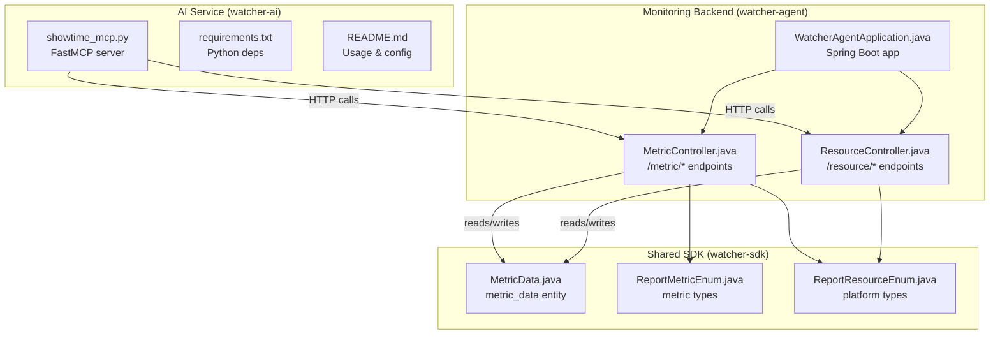
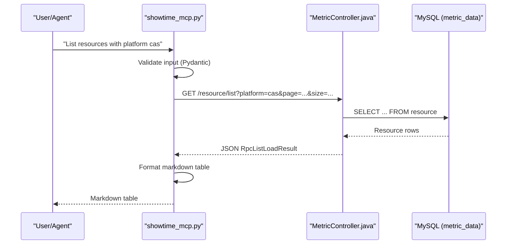
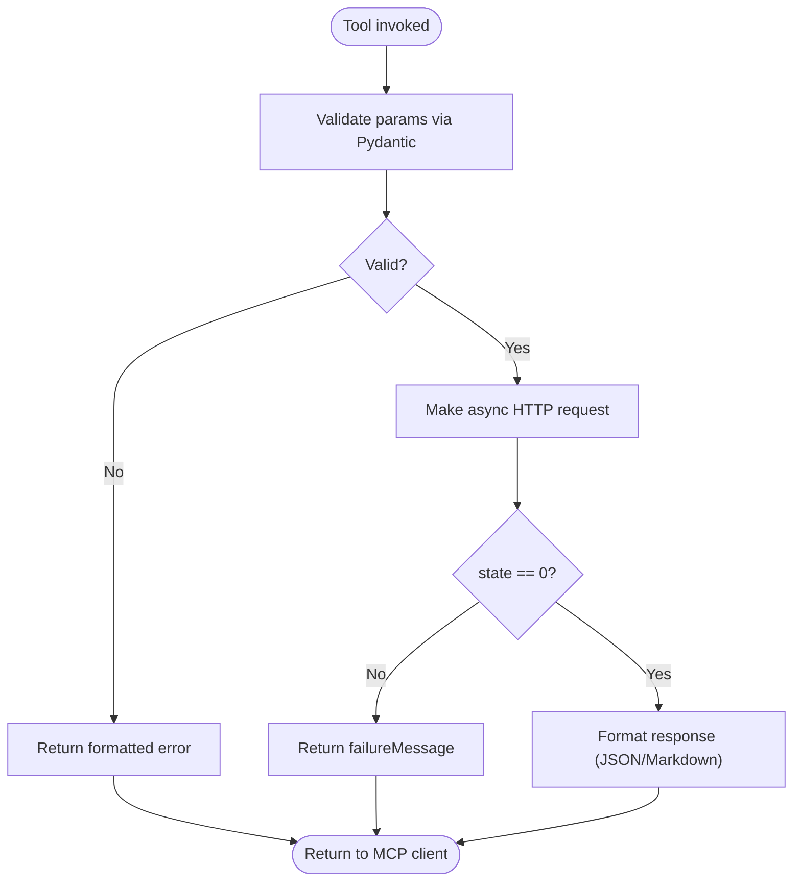
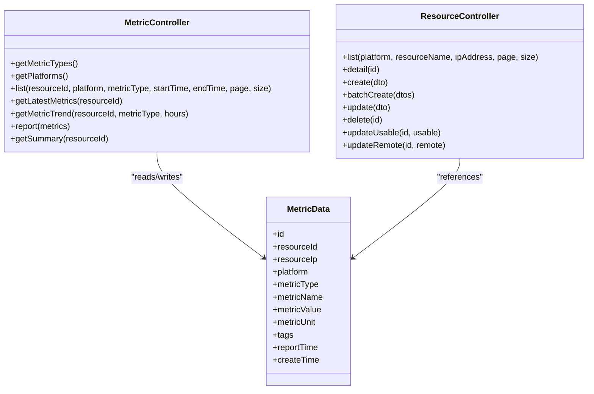
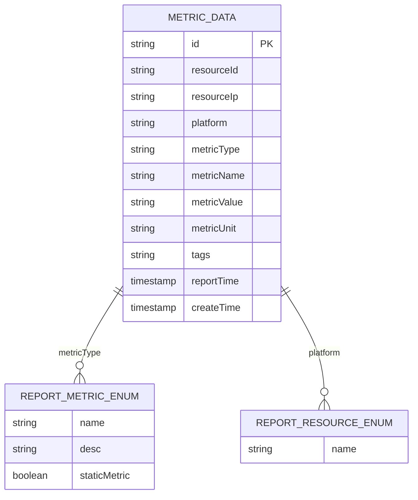
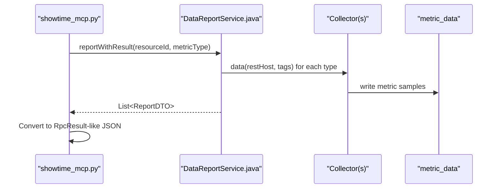
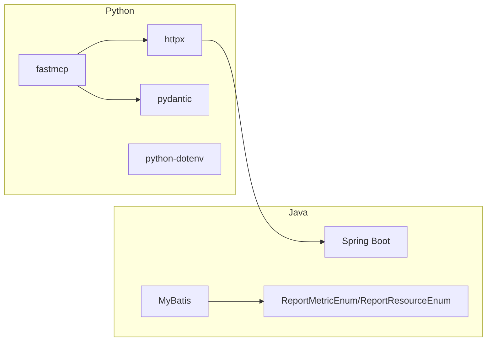

# AI Integration

<cite>
**Referenced Files in This Document**
- [showtime_mcp.py](file://watcher-ai/src/showtime_mcp.py)
- [README.md](file://watcher-ai/README.md)
- [requirements.txt](file://watcher-ai/requirements.txt)
- [MetricController.java](file://watcher-agent/src/main/java/com/virtual/cloud/om/agent/controller/MetricController.java)
- [ResourceController.java](file://watcher-agent/src/main/java/com/virtual/cloud/om/agent/controller/ResourceController.java)
- [WatcherAgentApplication.java](file://watcher-agent/src/main/java/com/virtual/cloud/om/agent/WatcherAgentApplication.java)
- [MetricData.java](file://watcher-sdk/src/main/java/com/virtual/cloud/om/sdk/entity/mysql/MetricData.java)
- [ReportMetricEnum.java](file://watcher-sdk/src/main/java/com/virtual/cloud/om/sdk/constant/report/ReportMetricEnum.java)
- [ReportResourceEnum.java](file://watcher-sdk/src/main/java/com/virtual/cloud/om/sdk/constant/ReportResourceEnum.java)
- [DataReportService.java](file://watcher-agent/src/main/java/com/virtual/cloud/om/agent/service/report/DataReportService.java)
- [DataReportCollectorOverview.java](file://watcher-agent/src/main/java/com/virtual/cloud/om/agent/service/DataReportCollectorOverview.java)
</cite>

## Table of Contents
1. [Introduction](#introduction)
2. [Project Structure](#project-structure)
3. [Core Components](#core-components)
4. [Architecture Overview](#architecture-overview)
5. [Detailed Component Analysis](#detailed-component-analysis)
6. [Dependency Analysis](#dependency-analysis)
7. [Performance Considerations](#performance-considerations)
8. [Troubleshooting Guide](#troubleshooting-guide)
9. [Conclusion](#conclusion)
10. [Appendices](#appendices)

## Introduction
This document explains ShowTime’s AI integration for natural language processing using the Model Context Protocol (MCP). It covers the MCP server implementation in Python 3.8+ powered by FastMCP, the AI-enabled monitoring query system, and the integration with the main monitoring platform. It also documents Python requirements, installation, configuration, deployment modes, response formats, error handling, and operational guidance.

## Project Structure
The AI integration spans two primary areas:
- watcher-ai: An MCP server exposing tools for resource discovery and metric queries against the monitoring backend.
- watcher-agent: The monitoring backend exposing REST endpoints for resources and metrics.
- watcher-sdk: Shared data models and enumerations used by the backend.

**Diagram sources**
- [showtime_mcp.py:1-557](file://watcher-ai/src/showtime_mcp.py#L1-L557)
- [requirements.txt:1-5](file://watcher-ai/requirements.txt#L1-L5)
- [README.md:1-72](file://watcher-ai/README.md#L1-L72)
- [MetricController.java:1-271](file://watcher-agent/src/main/java/com/virtual/cloud/om/agent/controller/MetricController.java#L1-L271)
- [ResourceController.java:1-235](file://watcher-agent/src/main/java/com/virtual/cloud/om/agent/controller/ResourceController.java#L1-L235)
- [WatcherAgentApplication.java:1-30](file://watcher-agent/src/main/java/com/virtual/cloud/om/agent/WatcherAgentApplication.java#L1-L30)
- [MetricData.java:1-43](file://watcher-sdk/src/main/java/com/virtual/cloud/om/sdk/entity/mysql/MetricData.java#L1-L43)
- [ReportMetricEnum.java:1-118](file://watcher-sdk/src/main/java/com/virtual/cloud/om/sdk/constant/report/ReportMetricEnum.java#L1-L118)
- [ReportResourceEnum.java:1-7](file://watcher-sdk/src/main/java/com/virtual/cloud/om/sdk/constant/ReportResourceEnum.java#L1-L7)

**Section sources**
- [showtime_mcp.py:1-557](file://watcher-ai/src/showtime_mcp.py#L1-L557)
- [README.md:1-72](file://watcher-ai/README.md#L1-L72)

## Core Components
- MCP Server (Python/FastMCP): Exposes six tools for resource and metric operations. Tools validate inputs via Pydantic models, call backend endpoints, and format responses.
- Monitoring Backend (Java/Spring Boot): Provides REST endpoints for resources and metrics, backed by MyBatis and MySQL.
- Shared SDK: Defines metric and platform enumerations and the metric data entity.

Key capabilities:
- Resource listing and detail retrieval
- Metric type listing and categorization
- Metric trend retrieval and latest values
- Metric summary statistics per resource

**Section sources**
- [showtime_mcp.py:33-116](file://watcher-ai/src/showtime_mcp.py#L33-L116)
- [MetricController.java:46-269](file://watcher-agent/src/main/java/com/virtual/cloud/om/agent/controller/MetricController.java#L46-L269)
- [ResourceController.java:34-65](file://watcher-agent/src/main/java/com/virtual/cloud/om/agent/controller/ResourceController.java#L34-L65)
- [MetricData.java:14-42](file://watcher-sdk/src/main/java/com/virtual/cloud/om/sdk/entity/mysql/MetricData.java#L14-L42)
- [ReportMetricEnum.java:9-117](file://watcher-sdk/src/main/java/com/virtual/cloud/om/sdk/constant/report/ReportMetricEnum.java#L9-L117)
- [ReportResourceEnum.java:3-6](file://watcher-sdk/src/main/java/com/virtual/cloud/om/sdk/constant/ReportResourceEnum.java#L3-L6)

## Architecture Overview
The AI service acts as an MCP server that translates natural language queries into structured tool calls. These tools call the monitoring backend REST endpoints, which return standardized JSON responses. The MCP server formats these responses into Markdown or JSON for the AI agent.

**Diagram sources**
- [showtime_mcp.py:184-247](file://watcher-ai/src/showtime_mcp.py#L184-L247)
- [ResourceController.java:34-55](file://watcher-agent/src/main/java/com/virtual/cloud/om/agent/controller/ResourceController.java#L34-L55)
- [MetricData.java:14-42](file://watcher-sdk/src/main/java/com/virtual/cloud/om/sdk/entity/mysql/MetricData.java#L14-L42)

## Detailed Component Analysis

### MCP Server Implementation
- Initialization: Creates a FastMCP instance named “showtime_mcp”.
- Configuration: Reads SHOWTIME_API_URL and SHOWTIME_API_TOKEN from environment.
- Tools:
  - showtime_list_resources: Filters and paginates resources.
  - showtime_get_resource_detail: Retrieves a single resource by ID.
  - showtime_list_metric_types: Lists metric types, optionally filtered by platform, grouped by category.
  - showtime_get_metric_trend: Returns time-series data for a given metric and window.
  - showtime_get_metric_summary: Aggregates total metrics and last report time for a resource.
  - showtime_list_latest_metrics: Returns the latest value for each metric type for a resource.
- Validation: Pydantic models enforce input constraints and strip whitespace.
- Error Handling: Centralized handler maps HTTP errors and timeouts to user-friendly messages.

**Diagram sources**
- [showtime_mcp.py:127-158](file://watcher-ai/src/showtime_mcp.py#L127-L158)
- [showtime_mcp.py:194-246](file://watcher-ai/src/showtime_mcp.py#L194-L246)

**Section sources**
- [showtime_mcp.py:18-24](file://watcher-ai/src/showtime_mcp.py#L18-L24)
- [showtime_mcp.py:33-116](file://watcher-ai/src/showtime_mcp.py#L33-L116)
- [showtime_mcp.py:119-158](file://watcher-ai/src/showtime_mcp.py#L119-L158)
- [showtime_mcp.py:184-553](file://watcher-ai/src/showtime_mcp.py#L184-L553)

### Monitoring Backend Endpoints
- Resource APIs:
  - GET /resource/list: Filters by platform, partial name, and IP; supports pagination.
  - GET /resource/detail/{id}: Returns resource details.
- Metric APIs:
  - GET /metric/types: Lists all metric types with metadata.
  - GET /metric/latest/{resourceId}: Latest values for all metric types.
  - GET /metric/trend/{resourceId}/{metricType}?hours=H: Time-series data.
  - GET /metric/summary/{resourceId}: Aggregated stats for a resource.
- Data Access:
  - Uses MyBatis mappers to query metric_data and resource tables.
  - Returns RpcResult/RpcListLoadResult wrappers with state and data.

**Diagram sources**
- [MetricController.java:46-269](file://watcher-agent/src/main/java/com/virtual/cloud/om/agent/controller/MetricController.java#L46-L269)
- [ResourceController.java:34-235](file://watcher-agent/src/main/java/com/virtual/cloud/om/agent/controller/ResourceController.java#L34-L235)
- [MetricData.java:14-42](file://watcher-sdk/src/main/java/com/virtual/cloud/om/sdk/entity/mysql/MetricData.java#L14-L42)

**Section sources**
- [MetricController.java:46-269](file://watcher-agent/src/main/java/com/virtual/cloud/om/agent/controller/MetricController.java#L46-L269)
- [ResourceController.java:34-65](file://watcher-agent/src/main/java/com/virtual/cloud/om/agent/controller/ResourceController.java#L34-L65)
- [MetricData.java:14-42](file://watcher-sdk/src/main/java/com/virtual/cloud/om/sdk/entity/mysql/MetricData.java#L14-L42)

### Data Models and Enumerations
- Metric types: Enumerated in ReportMetricEnum with descriptions and static vs dynamic flags.
- Platforms: Enumerated in ReportResourceEnum.
- Metric data entity: Maps to metric_data table with fields for resource, metric, value, unit, tags, and timestamps.

**Diagram sources**
- [MetricData.java:14-42](file://watcher-sdk/src/main/java/com/virtual/cloud/om/sdk/entity/mysql/MetricData.java#L14-L42)
- [ReportMetricEnum.java:9-117](file://watcher-sdk/src/main/java/com/virtual/cloud/om/sdk/constant/report/ReportMetricEnum.java#L9-L117)
- [ReportResourceEnum.java:3-6](file://watcher-sdk/src/main/java/com/virtual/cloud/om/sdk/constant/ReportResourceEnum.java#L3-L6)

**Section sources**
- [ReportMetricEnum.java:9-117](file://watcher-sdk/src/main/java/com/virtual/cloud/om/sdk/constant/report/ReportMetricEnum.java#L9-L117)
- [ReportResourceEnum.java:3-6](file://watcher-sdk/src/main/java/com/virtual/cloud/om/sdk/constant/ReportResourceEnum.java#L3-L6)
- [MetricData.java:14-42](file://watcher-sdk/src/main/java/com/virtual/cloud/om/sdk/entity/mysql/MetricData.java#L14-L42)

### Data Access Patterns and Security Considerations
- Data Access:
  - ResourceController lists and details resources from the resource table.
  - MetricController reads from metric_data for trends, summaries, and latest values; can trigger real-time collection via DataReportService when specific parameters are provided.
- Security:
  - The MCP server attaches an optional token header to backend requests. Configure SHOWTIME_API_TOKEN for protected environments.
  - The backend uses RpcResult wrappers indicating state; tools interpret state == 0 as success.

**Diagram sources**
- [showtime_mcp.py:517-552](file://watcher-ai/src/showtime_mcp.py#L517-L552)
- [MetricController.java:94-119](file://watcher-agent/src/main/java/com/virtual/cloud/om/agent/controller/MetricController.java#L94-L119)
- [DataReportService.java:166-266](file://watcher-agent/src/main/java/com/virtual/cloud/om/agent/service/report/DataReportService.java#L166-L266)
- [DataReportCollectorOverview.java:23-45](file://watcher-agent/src/main/java/com/virtual/cloud/om/agent/service/DataReportCollectorOverview.java#L23-L45)

**Section sources**
- [showtime_mcp.py:119-138](file://watcher-ai/src/showtime_mcp.py#L119-L138)
- [MetricController.java:94-119](file://watcher-agent/src/main/java/com/virtual/cloud/om/agent/controller/MetricController.java#L94-L119)
- [DataReportService.java:166-266](file://watcher-agent/src/main/java/com/virtual/cloud/om/agent/service/report/DataReportService.java#L166-L266)

## Dependency Analysis
- Python runtime and libraries:
  - fastmcp: MCP server framework
  - httpx: Async HTTP client
  - pydantic: Input validation
  - python-dotenv: Optional env loading
- Java runtime and frameworks:
  - Spring Boot: Application bootstrap
  - MyBatis: ORM for SQL queries
  - Enumerations and DTOs: Shared across modules

**Diagram sources**
- [requirements.txt:1-5](file://watcher-ai/requirements.txt#L1-L5)
- [WatcherAgentApplication.java:14-18](file://watcher-agent/src/main/java/com/virtual/cloud/om/agent/WatcherAgentApplication.java#L14-L18)
- [ReportMetricEnum.java:9-117](file://watcher-sdk/src/main/java/com/virtual/cloud/om/sdk/constant/report/ReportMetricEnum.java#L9-L117)
- [ReportResourceEnum.java:3-6](file://watcher-sdk/src/main/java/com/virtual/cloud/om/sdk/constant/ReportResourceEnum.java#L3-L6)

**Section sources**
- [requirements.txt:1-5](file://watcher-ai/requirements.txt#L1-L5)
- [WatcherAgentApplication.java:14-18](file://watcher-agent/src/main/java/com/virtual/cloud/om/agent/WatcherAgentApplication.java#L14-L18)

## Performance Considerations
- Asynchronous HTTP: The MCP server uses an async HTTP client to avoid blocking during backend calls.
- Pagination and limits: Resource and metric endpoints support pagination and bounded limits to control payload sizes.
- Caching: Consider caching metric type listings and resource metadata at the MCP server level if latency is a concern.
- Concurrency: The backend’s real-time collection uses asynchronous futures; ensure adequate thread pools for high concurrency.

## Troubleshooting Guide
Common issues and resolutions:
- Authentication failures:
  - Ensure SHOWTIME_API_TOKEN is set and valid. The MCP server attaches the token header automatically.
- Connectivity errors:
  - Verify SHOWTIME_API_URL points to the running backend. The MCP server reports connection failures distinctly.
- Rate limiting:
  - HTTP 429 is handled gracefully; retry after the recommended delay.
- Resource not found:
  - Confirm resource IDs and filters. The MCP server distinguishes 404 vs. general failures.
- Timeouts:
  - Increase tolerance or reduce query windows (e.g., hours for trends).

Operational tips:
- Run the MCP server in HTTP mode for integration with external clients.
- Monitor backend logs for SQL errors and MyBatis exceptions.
- Validate inputs using the Pydantic constraints (min/max lengths, ranges) to prevent backend errors.

**Section sources**
- [showtime_mcp.py:141-158](file://watcher-ai/src/showtime_mcp.py#L141-L158)
- [MetricController.java:116-119](file://watcher-agent/src/main/java/com/virtual/cloud/om/agent/controller/MetricController.java#L116-L119)

## Conclusion
The MCP server provides a robust bridge between natural language queries and ShowTime’s monitoring backend. By leveraging FastMCP, Pydantic validation, and well-defined REST endpoints, it enables flexible, secure, and efficient AI-driven monitoring workflows. Proper configuration of environment variables, attention to pagination and limits, and clear error handling ensure reliable operation in production.

## Appendices

### Installation and Setup
- Install Python dependencies:
  - pip install -r watcher-ai/requirements.txt
- Configure environment:
  - Set SHOWTIME_API_URL and optionally SHOWTIME_API_TOKEN.
- Run modes:
  - Local stdio mode: python src/showtime_mcp.py
  - HTTP mode: python src/showtime_mcp.py --transport streamable_http --port 8000

**Section sources**
- [README.md:14-41](file://watcher-ai/README.md#L14-L41)
- [requirements.txt:1-5](file://watcher-ai/requirements.txt#L1-L5)

### Example Natural Language Queries and Responses
- “List all CAS resources”
  - Tool: showtime_list_resources
  - Filters: platform=cas
  - Response: Markdown table of resources
- “Show me the CPU usage trend for resource abc123 over the last 24 hours”
  - Tool: showtime_get_metric_trend
  - Params: resource_id=abc123, metric_type=cpu_usage, hours=24
  - Response: JSON array of time-series entries
- “What are the metric types available for Onestor?”
  - Tool: showtime_list_metric_types
  - Params: platform=onestor
  - Response: Markdown categorized list of metric types

**Section sources**
- [showtime_mcp.py:194-246](file://watcher-ai/src/showtime_mcp.py#L194-L246)
- [showtime_mcp.py:413-456](file://watcher-ai/src/showtime_mcp.py#L413-L456)
- [showtime_mcp.py:310-400](file://watcher-ai/src/showtime_mcp.py#L310-L400)

### Error Handling Reference
- HTTP 401/403: Authentication/authorization failure
- HTTP 404: Resource not found
- HTTP 429: Rate limit exceeded
- Timeout/Connect errors: Backend unreachable or slow
- Backend state != 0: FailureMessage returned by backend

**Section sources**
- [showtime_mcp.py:141-158](file://watcher-ai/src/showtime_mcp.py#L141-L158)
- [MetricController.java:242-269](file://watcher-agent/src/main/java/com/virtual/cloud/om/agent/controller/MetricController.java#L242-L269)