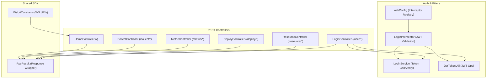
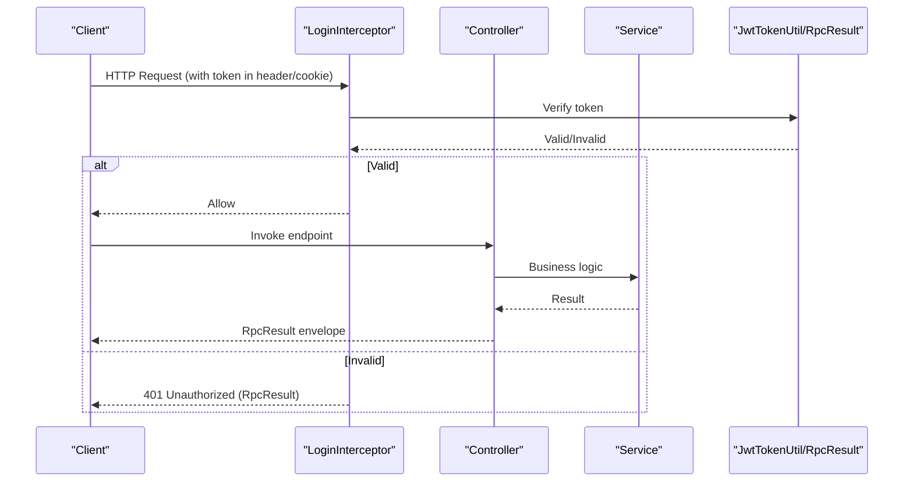
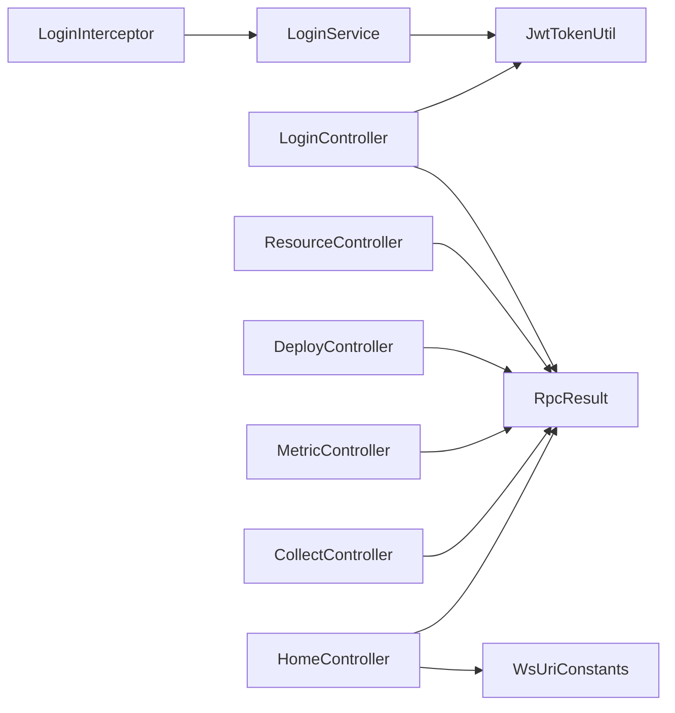

# API Reference

<cite>
**Referenced Files in This Document**
- [LoginController.java](file://watcher-agent/src/main/java/com/virtual/cloud/om/agent/controller/LoginController.java)
- [ResourceController.java](file://watcher-agent/src/main/java/com/virtual/cloud/om/agent/controller/ResourceController.java)
- [DeployController.java](file://watcher-agent/src/main/java/com/virtual/cloud/om/agent/controller/DeployController.java)
- [MetricController.java](file://watcher-agent/src/main/java/com/virtual/cloud/om/agent/controller/MetricController.java)
- [CollectController.java](file://watcher-agent/src/main/java/com/virtual/cloud/om/agent/controller/CollectController.java)
- [HomeController.java](file://watcher-agent/src/main/java/com/virtual/cloud/om/agent/controller/HomeController.java)
- [webConfig.java](file://watcher-agent/src/main/java/com/virtual/cloud/om/agent/filter/webConfig.java)
- [LoginInterceptor.java](file://watcher-agent/src/main/java/com/virtual/cloud/om/agent/config/LoginInterceptor.java)
- [LoginService.java](file://watcher-agent/src/main/java/com/virtual/cloud/om/agent/service/auth/LoginService.java)
- [JwtTokenUtil.java](file://watcher-sdk/src/main/java/com/virtual/cloud/om/sdk/utils/JwtTokenUtil.java)
- [RpcResult.java](file://watcher-sdk/src/main/java/com/virtual/cloud/om/sdk/dto/RpcResult.java)
- [WsUriConstants.java](file://watcher-sdk/src/main/java/com/virtual/cloud/om/sdk/constant/uri/WsUriConstants.java)
- [WebsocketMessageDTO.java](file://watcher-agent/src/main/java/com/virtual/cloud/om/agent/dto/WebsocketMessageDTO.java)
- [WebsocketSate.java](file://watcher-agent/src/main/java/com/virtual/cloud/om/agent/entity/WebsocketSate.java)
- [WebsocketWatcherRouteOperateResult.java](file://watcher-agent/src/main/java/com/virtual/cloud/om/agent/dto/WebsocketWatcherRouteOperateResult.java)
- [WebsocketWatcherRouteQueryResult.java](file://watcher-agent/src/main/java/com/virtual/cloud/om/agent/dto/WebsocketWatcherRouteQueryResult.java)
- [showtime_mcp.py](file://watcher-ai/src/showtime_mcp.py)
</cite>

## Table of Contents
1. [Introduction](#introduction)
2. [Project Structure](#project-structure)
3. [Core Components](#core-components)
4. [Architecture Overview](#architecture-overview)
5. [Detailed Component Analysis](#detailed-component-analysis)
6. [Dependency Analysis](#dependency-analysis)
7. [Performance Considerations](#performance-considerations)
8. [Troubleshooting Guide](#troubleshooting-guide)
9. [Conclusion](#conclusion)
10. [Appendices](#appendices)

## Introduction
This document provides comprehensive API documentation for ShowTime’s RESTful endpoints and WebSocket interfaces. It covers authentication, resource management, deployment operations, and monitoring data retrieval. For each REST endpoint, you will find HTTP methods, URL patterns, request/response schemas, authentication requirements, and error handling. The WebSocket section documents connection protocols, message formats, and event types. Additional topics include JWT-based authentication, API versioning, rate limiting, security considerations, practical examples, testing strategies, debugging approaches, and performance optimization tips.

## Project Structure
ShowTime exposes REST APIs primarily through Spring MVC controllers in the watcher-agent module and defines shared DTOs, constants, and utilities in the watcher-sdk module. Authentication is enforced via a global interceptor that validates JWT tokens stored in cookies or headers. WebSocket URIs are centralized in WsUriConstants.

**Diagram sources**
- [LoginController.java:13-18](file://watcher-agent/src/main/java/com/virtual/cloud/om/agent/controller/LoginController.java#L13-L18)
- [ResourceController.java:24-29](file://watcher-agent/src/main/java/com/virtual/cloud/om/agent/controller/ResourceController.java#L24-L29)
- [DeployController.java:33-36](file://watcher-agent/src/main/java/com/virtual/cloud/om/agent/controller/DeployController.java#L33-L36)
- [MetricController.java:30-35](file://watcher-agent/src/main/java/com/virtual/cloud/om/agent/controller/MetricController.java#L30-L35)
- [CollectController.java:27-30](file://watcher-agent/src/main/java/com/virtual/cloud/om/agent/controller/CollectController.java#L27-L30)
- [HomeController.java:40-71](file://watcher-agent/src/main/java/com/virtual/cloud/om/agent/controller/HomeController.java#L40-L71)
- [webConfig.java:11-37](file://watcher-agent/src/main/java/com/virtual/cloud/om/agent/filter/webConfig.java#L11-L37)
- [LoginInterceptor.java:36-99](file://watcher-agent/src/main/java/com/virtual/cloud/om/agent/config/LoginInterceptor.java#L36-L99)
- [LoginService.java:54-141](file://watcher-agent/src/main/java/com/virtual/cloud/om/agent/service/auth/LoginService.java#L54-L141)
- [JwtTokenUtil.java:16-88](file://watcher-sdk/src/main/java/com/virtual/cloud/om/sdk/utils/JwtTokenUtil.java#L16-L88)
- [RpcResult.java:3-88](file://watcher-sdk/src/main/java/com/virtual/cloud/om/sdk/dto/RpcResult.java#L3-L88)
- [WsUriConstants.java:6-195](file://watcher-sdk/src/main/java/com/virtual/cloud/om/sdk/constant/uri/WsUriConstants.java#L6-L195)

**Section sources**
- [LoginController.java:13-92](file://watcher-agent/src/main/java/com/virtual/cloud/om/agent/controller/LoginController.java#L13-L92)
- [ResourceController.java:24-235](file://watcher-agent/src/main/java/com/virtual/cloud/om/agent/controller/ResourceController.java#L24-L235)
- [DeployController.java:33-325](file://watcher-agent/src/main/java/com/virtual/cloud/om/agent/controller/DeployController.java#L33-L325)
- [MetricController.java:30-271](file://watcher-agent/src/main/java/com/virtual/cloud/om/agent/controller/MetricController.java#L30-L271)
- [CollectController.java:27-67](file://watcher-agent/src/main/java/com/virtual/cloud/om/agent/controller/CollectController.java#L27-L67)
- [HomeController.java:40-71](file://watcher-agent/src/main/java/com/virtual/cloud/om/agent/controller/HomeController.java#L40-L71)
- [webConfig.java:11-37](file://watcher-agent/src/main/java/com/virtual/cloud/om/agent/filter/webConfig.java#L11-L37)
- [LoginInterceptor.java:36-99](file://watcher-agent/src/main/java/com/virtual/cloud/om/agent/config/LoginInterceptor.java#L36-L99)
- [LoginService.java:54-141](file://watcher-agent/src/main/java/com/virtual/cloud/om/agent/service/auth/LoginService.java#L54-L141)
- [JwtTokenUtil.java:16-88](file://watcher-sdk/src/main/java/com/virtual/cloud/om/sdk/utils/JwtTokenUtil.java#L16-L88)
- [RpcResult.java:3-88](file://watcher-sdk/src/main/java/com/virtual/cloud/om/sdk/dto/RpcResult.java#L3-L88)
- [WsUriConstants.java:6-195](file://watcher-sdk/src/main/java/com/virtual/cloud/om/sdk/constant/uri/WsUriConstants.java#L6-L195)

## Core Components
- Authentication and Authorization
  - JWT token generation and verification via JwtTokenUtil.
  - Global interceptor LoginInterceptor validates tokens from headers or cookies and rejects unauthorized requests.
  - LoginController exposes login/logout endpoints returning tokens in cookies and wrapping responses with RpcResult.

- REST Controllers
  - ResourceController: CRUD and status management for resources.
  - DeployController: Deployment orchestration, component management, network configuration, and route operations.
  - MetricController: Metrics enumeration, retrieval, latest values, trends, and reporting.
  - CollectController: Demo endpoints for real-time log strategy and resource synchronization.
  - LoginController: User authentication and profile modification.
  - HomeController: Utility endpoints and integration tests against external systems.

- Shared Types and Constants
  - RpcResult: Standardized response envelope with state, data, and error metadata.
  - WsUriConstants: Centralized WebSocket URI templates used by clients and agents.

**Section sources**
- [LoginController.java:25-92](file://watcher-agent/src/main/java/com/virtual/cloud/om/agent/controller/LoginController.java#L25-L92)
- [ResourceController.java:34-235](file://watcher-agent/src/main/java/com/virtual/cloud/om/agent/controller/ResourceController.java#L34-L235)
- [DeployController.java:46-325](file://watcher-agent/src/main/java/com/virtual/cloud/om/agent/controller/DeployController.java#L46-L325)
- [MetricController.java:46-271](file://watcher-agent/src/main/java/com/virtual/cloud/om/agent/controller/MetricController.java#L46-L271)
- [CollectController.java:45-67](file://watcher-agent/src/main/java/com/virtual/cloud/om/agent/controller/CollectController.java#L45-L67)
- [HomeController.java:52-65](file://watcher-agent/src/main/java/com/virtual/cloud/om/agent/controller/HomeController.java#L52-L65)
- [webConfig.java:19-37](file://watcher-agent/src/main/java/com/virtual/cloud/om/agent/filter/webConfig.java#L19-L37)
- [LoginInterceptor.java:36-99](file://watcher-agent/src/main/java/com/virtual/cloud/om/agent/config/LoginInterceptor.java#L36-L99)
- [LoginService.java:54-141](file://watcher-agent/src/main/java/com/virtual/cloud/om/agent/service/auth/LoginService.java#L54-L141)
- [JwtTokenUtil.java:49-88](file://watcher-sdk/src/main/java/com/virtual/cloud/om/sdk/utils/JwtTokenUtil.java#L49-L88)
- [RpcResult.java:15-88](file://watcher-sdk/src/main/java/com/virtual/cloud/om/sdk/dto/RpcResult.java#L15-L88)
- [WsUriConstants.java:6-195](file://watcher-sdk/src/main/java/com/virtual/cloud/om/sdk/constant/uri/WsUriConstants.java#L6-L195)

## Architecture Overview
The REST API layer is protected by a global interceptor that enforces JWT-based authentication. Responses are standardized using RpcResult. WebSocket URIs are centrally defined and consumed by controllers for integration testing and future real-time features.

**Diagram sources**
- [LoginInterceptor.java:36-99](file://watcher-agent/src/main/java/com/virtual/cloud/om/agent/config/LoginInterceptor.java#L36-L99)
- [LoginService.java:117-141](file://watcher-agent/src/main/java/com/virtual/cloud/om/agent/service/auth/LoginService.java#L117-L141)
- [JwtTokenUtil.java:31-88](file://watcher-sdk/src/main/java/com/virtual/cloud/om/sdk/utils/JwtTokenUtil.java#L31-L88)
- [RpcResult.java:15-88](file://watcher-sdk/src/main/java/com/virtual/cloud/om/sdk/dto/RpcResult.java#L15-L88)

## Detailed Component Analysis

### Authentication Endpoints
- POST /user/login
  - Purpose: Authenticate user and issue JWT token.
  - Request body: SysUserDTO (username, password).
  - Response: RpcResult<String> containing token.
  - Authentication: None (login endpoint excluded from interceptor).
  - Errors: RpcResult with failure message on invalid credentials.

- PUT /user/modifyUser
  - Purpose: Update user profile.
  - Request body: ModifyUser.
  - Response: RpcResult<Void>.
  - Authentication: Required (JWT via header or cookie).

- POST /user/logout
  - Purpose: Invalidate current session.
  - Response: RpcResult<Void>.
  - Authentication: Required.

- GET /user/search/complexity
  - Purpose: Retrieve password complexity policy.
  - Response: RpcResult<Integer>.
  - Authentication: Required.

Security and Tokens
- Token placement: Prefer Authorization header with Bearer scheme; fallback to cookie named token.
- Expiration and refresh: Tokens expire after a fixed period; the interceptor refreshes tokens proactively.
- Logout: Clears the token cookie.

**Section sources**
- [LoginController.java:25-92](file://watcher-agent/src/main/java/com/virtual/cloud/om/agent/controller/LoginController.java#L25-L92)
- [webConfig.java:19-37](file://watcher-agent/src/main/java/com/virtual/cloud/om/agent/filter/webConfig.java#L19-L37)
- [LoginInterceptor.java:36-99](file://watcher-agent/src/main/java/com/virtual/cloud/om/agent/config/LoginInterceptor.java#L36-L99)
- [LoginService.java:54-141](file://watcher-agent/src/main/java/com/virtual/cloud/om/agent/service/auth/LoginService.java#L54-L141)
- [JwtTokenUtil.java:17-88](file://watcher-sdk/src/main/java/com/virtual/cloud/om/sdk/utils/JwtTokenUtil.java#L17-L88)
- [RpcResult.java:15-88](file://watcher-sdk/src/main/java/com/virtual/cloud/om/sdk/dto/RpcResult.java#L15-L88)

### Resource Management Endpoints
- GET /resource/list
  - Purpose: Paginated list of resources with filters (platform, resourceName, ipAddress).
  - Query params: platform, resourceName, ipAddress, page, size.
  - Response: RpcListLoadResult<Resource>.

- GET /resource/detail/{id}
  - Purpose: Retrieve resource by ID.
  - Path param: id.
  - Response: RpcResult<Resource>.

- POST /resource/create
  - Purpose: Create a single resource.
  - Request body: ResourceDTO.
  - Response: RpcResult<Void>.

- POST /resource/batchCreate
  - Purpose: Upsert multiple resources.
  - Request body: List<ResourceDTO>.
  - Response: RpcResult<Void>.

- PUT /resource/update
  - Purpose: Update an existing resource.
  - Request body: ResourceDTO.
  - Response: RpcResult<Void>.

- DELETE /resource/delete/{id}
  - Purpose: Delete a resource by ID.
  - Path param: id.
  - Response: RpcResult<Void>.

- PUT /resource/usable/{id}?usable={0|1}
  - Purpose: Toggle resource usability.
  - Path param: id; Query param: usable.
  - Response: RpcResult<Void>.

- PUT /resource/remote/{id}?remote={0|1}
  - Purpose: Toggle SSH remote permissions.
  - Path param: id; Query param: remote.
  - Response: RpcResult<Void>.

Notes
- All endpoints except creation support filtering and pagination semantics via RpcListLoadResult.
- Internal encryption is applied to sensitive fields during create/update.

**Section sources**
- [ResourceController.java:34-235](file://watcher-agent/src/main/java/com/virtual/cloud/om/agent/controller/ResourceController.java#L34-L235)

### Deployment Operations Endpoints
- POST /deploy/batch
  - Purpose: Multi-node deployment.
  - Request body: BatchDeployVO.
  - Response: RpcResult<Void>.

- POST /deploy/single
  - Purpose: Single-node deployment.
  - Request body: DeployVO.
  - Response: RpcResult<Void>.

- GET /deploy
  - Purpose: Query deployment status across nodes.
  - Response: RpcListLoadResult<DeployQueryVO>.

- PUT /deploy/manage
  - Purpose: Manage component services.
  - Request body: ComponentManage.
  - Response: RpcResult<Void>.

- GET /deploy/refresh
  - Purpose: Restart the Spring Boot application.
  - Response: RpcResult<Void>.

- GET /deploy/host
  - Purpose: Query host information.
  - Response: String.

- GET /deploy/localIps
  - Purpose: List local IP addresses.
  - Response: RpcListLoadResult<String>.

- PUT /deploy/keepalived/notify/{masterOrBackup}
  - Purpose: Keepalived notification endpoint.
  - Path param: masterOrBackup.
  - Response: RpcResult<Void>.

- PUT /deploy/step
  - Purpose: Update deployment step.
  - Request body: UpdateStepDTO.
  - Response: RpcResult<Void>.

- GET /deploy/network
  - Purpose: Get network info.
  - Response: RpcResult.

- POST /deploy/network
  - Purpose: Configure local network interfaces, DNS, and strategy routes; restarts network service.
  - Request body: NetworkInfoVO.
  - Response: RpcResult.

- PUT /deploy/network
  - Purpose: Edit network configuration remotely.
  - Request body: NetworkInfoVO.
  - Response: RpcResult.

- GET /deploy/network/master
  - Purpose: Check if current node was master before deployment.
  - Response: RpcResult.

- GET /deploy/network/config/nodes
  - Purpose: Get all nodes’ network configurations.
  - Response: RpcResult.

- GET /deploy/network/config/node
  - Purpose: Get a specific node’s network configuration.
  - Query param: nodeName.
  - Response: RpcResult.

- GET /deploy/network/wifis
  - Purpose: Enumerate available Wi-Fi networks.
  - Response: RpcResult.

- POST /deploy/route/add/check
  - Purpose: Test reachability before adding a route.
  - Request body: RouteVo.
  - Response: RpcResult.

- POST /deploy/route/edit/check
  - Purpose: Test reachability before editing a route.
  - Request body: RouteVo.
  - Response: RpcResult.

- POST /deploy/route/check
  - Purpose: General route ping check.
  - Request body: RouteCheckPingVo.
  - Response: RpcResult.

- GET /deploy/route
  - Purpose: List routes.
  - Response: RpcResult.

- POST /deploy/route
  - Purpose: Add a route.
  - Request body: RouteVo.
  - Response: RpcResult.

- PUT /deploy/route
  - Purpose: Edit a route.
  - Request body: RouteVo.
  - Response: RpcResult.

- DELETE /deploy/route
  - Purpose: Delete routes by IDs.
  - Request body: List<String>.
  - Response: RpcResult.

Operational Notes
- Many endpoints trigger OS-level commands and require elevated privileges.
- Network configuration endpoints persist settings to files and may restart services.

**Section sources**
- [DeployController.java:46-325](file://watcher-agent/src/main/java/com/virtual/cloud/om/agent/controller/DeployController.java#L46-L325)

### Monitoring Data Retrieval Endpoints
- GET /metric/types
  - Purpose: Enumerate supported metric types.
  - Response: RpcResult<List<Map<String, String>>>.

- GET /metric/platforms
  - Purpose: Enumerate supported platforms.
  - Response: RpcResult<List<Map<String, String>>>.

- GET /metric/list
  - Purpose: Query metric data list with optional filters and pagination.
  - Query params: resourceId, platform, metricType, startTime, endTime, page, size.
  - Response: RpcListLoadResult<Map<String, Object>>.

- GET /metric/latest/{resourceId}
  - Purpose: Latest metrics for a given resource.
  - Path param: resourceId.
  - Response: RpcResult<List<MetricData>>.

- GET /metric/trend/{resourceId}/{metricType}?hours={1..N}
  - Purpose: Trend data for a metric type over recent hours.
  - Path params: resourceId, metricType; Query param: hours.
  - Response: RpcResult<List<MetricData>>.

- POST /metric/report
  - Purpose: Submit metrics for persistence.
  - Request body: List<MetricData>.
  - Response: RpcResult<Void>.

- GET /metric/summary/{resourceId}
  - Purpose: Summary statistics for a resource’s metrics.
  - Path param: resourceId.
  - Response: RpcResult<Map<String, Object>>.

Data Flow
- When resourceId and metricType are provided to /metric/list, the controller delegates to a data reporting service to collect live metrics and returns structured results.
- Otherwise, it queries persisted MetricData entries.

**Section sources**
- [MetricController.java:46-271](file://watcher-agent/src/main/java/com/virtual/cloud/om/agent/controller/MetricController.java#L46-L271)

### Collection and Demo Endpoints
- POST /collect/realtime-log
  - Purpose: Demonstration endpoint to apply real-time log strategies.
  - Request body: List<RealTimeLogStrategyRequest>.
  - Response: RpcResult.

- POST /collect/resources
  - Purpose: Synchronize resources to the backend.
  - Request body: List<ResourceDTO>.
  - Response: RpcResult<Void>.

- POST /collect/batch
  - Purpose: Demonstration batch deployment.
  - Request body: BatchDeployVO.
  - Response: RpcResult<Void>.

These endpoints are intended for demos and internal integrations.

**Section sources**
- [CollectController.java:45-67](file://watcher-agent/src/main/java/com/virtual/cloud/om/agent/controller/CollectController.java#L45-L67)

### Home and Integration Endpoints
- GET /
  - Purpose: Health check and environment info.
  - Response: String.

- GET /workspace/desktoppools
  - Purpose: Integration test to fetch desktop pool list from a remote center.
  - Query: RestHost model attributes.
  - Response: String.

- GET /cas/hosts
  - Purpose: Integration test to fetch CAS hosts.
  - Query: RestHost model attributes.
  - Response: String.

These endpoints demonstrate REST client usage and are useful for validating connectivity.

**Section sources**
- [HomeController.java:52-65](file://watcher-agent/src/main/java/com/virtual/cloud/om/agent/controller/HomeController.java#L52-L65)

## Dependency Analysis
The authentication layer depends on JwtTokenUtil and LoginService, while controllers depend on RpcResult for consistent responses. WebSocket URIs are centralized in WsUriConstants and consumed by controllers for integration scenarios.

**Diagram sources**
- [LoginInterceptor.java:36-99](file://watcher-agent/src/main/java/com/virtual/cloud/om/agent/config/LoginInterceptor.java#L36-L99)
- [LoginService.java:54-141](file://watcher-agent/src/main/java/com/virtual/cloud/om/agent/service/auth/LoginService.java#L54-L141)
- [JwtTokenUtil.java:16-88](file://watcher-sdk/src/main/java/com/virtual/cloud/om/sdk/utils/JwtTokenUtil.java#L16-L88)
- [LoginController.java:25-92](file://watcher-agent/src/main/java/com/virtual/cloud/om/agent/controller/LoginController.java#L25-L92)
- [ResourceController.java:34-235](file://watcher-agent/src/main/java/com/virtual/cloud/om/agent/controller/ResourceController.java#L34-L235)
- [DeployController.java:46-325](file://watcher-agent/src/main/java/com/virtual/cloud/om/agent/controller/DeployController.java#L46-L325)
- [MetricController.java:46-271](file://watcher-agent/src/main/java/com/virtual/cloud/om/agent/controller/MetricController.java#L46-L271)
- [CollectController.java:45-67](file://watcher-agent/src/main/java/com/virtual/cloud/om/agent/controller/CollectController.java#L45-L67)
- [HomeController.java:52-65](file://watcher-agent/src/main/java/com/virtual/cloud/om/agent/controller/HomeController.java#L52-L65)
- [RpcResult.java:15-88](file://watcher-sdk/src/main/java/com/virtual/cloud/om/sdk/dto/RpcResult.java#L15-L88)
- [WsUriConstants.java:6-195](file://watcher-sdk/src/main/java/com/virtual/cloud/om/sdk/constant/uri/WsUriConstants.java#L6-L195)

**Section sources**
- [LoginInterceptor.java:36-99](file://watcher-agent/src/main/java/com/virtual/cloud/om/agent/config/LoginInterceptor.java#L36-L99)
- [LoginService.java:54-141](file://watcher-agent/src/main/java/com/virtual/cloud/om/agent/service/auth/LoginService.java#L54-L141)
- [JwtTokenUtil.java:16-88](file://watcher-sdk/src/main/java/com/virtual/cloud/om/sdk/utils/JwtTokenUtil.java#L16-L88)
- [RpcResult.java:15-88](file://watcher-sdk/src/main/java/com/virtual/cloud/om/sdk/dto/RpcResult.java#L15-L88)
- [WsUriConstants.java:6-195](file://watcher-sdk/src/main/java/com/virtual/cloud/om/sdk/constant/uri/WsUriConstants.java#L6-L195)

## Performance Considerations
- Token caching and refresh: Proactive token refresh reduces repeated validation overhead.
- Batch operations: Use POST /resource/batchCreate for bulk resource upserts to minimize round trips.
- Pagination: Prefer paginated endpoints (e.g., /metric/list, /resource/list) to avoid large payloads.
- Network configuration: Persisting network settings and restarting services can be expensive; batch related changes where possible.
- Real-time metrics: When resourceId and metricType are provided to /metric/list, live collection is triggered; cache results client-side when appropriate.

[No sources needed since this section provides general guidance]

## Troubleshooting Guide
Common Issues and Resolutions
- 401 Unauthorized
  - Cause: Missing or invalid token in header or cookie.
  - Resolution: Obtain a new token via /user/login and include it in the Authorization header or ensure the cookie is present.

- 403 Forbidden
  - Not directly handled by the interceptor; check backend logs for authorization failures.

- Rate Limiting
  - The codebase does not expose explicit rate-limiting headers. If rate limiting is enforced upstream, reduce request frequency and implement client-side retries with exponential backoff.

- Network Configuration Failures
  - Some endpoints restart network services; verify OS commands succeed and re-check configuration files.

- WebSocket Connectivity
  - WebSocket URIs are defined centrally. Ensure the client connects to the correct endpoint and handles reconnection on errors.

Testing Strategies
- Use the demo endpoints under /collect to validate end-to-end flows.
- Utilize /workspace/desktoppools and /cas/hosts to verify external system connectivity.
- Employ the AI MCP script’s error handling patterns for robust client-side error formatting.

Debugging Approaches
- Inspect RpcResult envelopes for state and error codes.
- Review interceptor logs for token validation outcomes.
- Enable verbose logging for controllers and services to trace request lifecycle.

**Section sources**
- [LoginInterceptor.java:36-99](file://watcher-agent/src/main/java/com/virtual/cloud/om/agent/config/LoginInterceptor.java#L36-L99)
- [RpcResult.java:15-88](file://watcher-sdk/src/main/java/com/virtual/cloud/om/sdk/dto/RpcResult.java#L15-L88)
- [showtime_mcp.py:141-157](file://watcher-ai/src/showtime_mcp.py#L141-L157)

## Conclusion
ShowTime’s REST API provides comprehensive capabilities for authentication, resource management, deployment orchestration, and monitoring data retrieval. Authentication is enforced via JWT tokens validated by a global interceptor. Responses are standardized using RpcResult, ensuring consistent error handling and status reporting. WebSocket URIs are centralized for integration and future real-time features. By following the documented endpoints, authentication requirements, and best practices outlined here, you can build reliable integrations and maintain high performance.

[No sources needed since this section summarizes without analyzing specific files]

## Appendices

### Authentication via JWT
- Token issuance: POST /user/login returns a token.
- Token usage: Include Authorization: Bearer <token> or set cookie named token.
- Token refresh: The interceptor proactively refreshes tokens nearing expiration.
- Logout: Clears the token cookie.

**Section sources**
- [LoginController.java:25-92](file://watcher-agent/src/main/java/com/virtual/cloud/om/agent/controller/LoginController.java#L25-L92)
- [LoginInterceptor.java:36-99](file://watcher-agent/src/main/java/com/virtual/cloud/om/agent/config/LoginInterceptor.java#L36-L99)
- [LoginService.java:54-141](file://watcher-agent/src/main/java/com/virtual/cloud/om/agent/service/auth/LoginService.java#L54-L141)
- [JwtTokenUtil.java:49-88](file://watcher-sdk/src/main/java/com/virtual/cloud/om/sdk/utils/JwtTokenUtil.java#L49-L88)

### API Versioning
- No explicit version path segments were identified in the controllers. If versioning is required, introduce versioned paths (e.g., /api/v1/...) and deprecate older endpoints gradually.

[No sources needed since this section provides general guidance]

### Rate Limiting
- No built-in rate limiting is evident in the provided code. If enforced, expect 429 responses. Implement client-side throttling and retry policies.

[No sources needed since this section provides general guidance]

### Security Considerations
- Prefer Authorization header over cookies for non-browser clients.
- Rotate secrets and review token expiration intervals periodically.
- Restrict sensitive endpoints and monitor for anomalies.

[No sources needed since this section provides general guidance]

### Practical Examples

curl Examples
- Login and capture token:
  - curl -X POST https://<host>/user/login -H "Content-Type: application/json" -d '{"username":"<user>","password":"<pass>"}'
- Access a protected resource:
  - curl -H "Authorization: Bearer <token>" https://<host>/resource/list
- Create a resource:
  - curl -X POST https://<host>/resource/create -H "Authorization: Bearer <token>" -H "Content-Type: application/json" -d '{}'
- Deploy a single node:
  - curl -X POST https://<host>/deploy/single -H "Authorization: Bearer <token>" -H "Content-Type: application/json" -d '{}'

Client Implementation Guidelines
- Use RpcResult parsing to handle success/failure states.
- Implement token refresh and retry logic around token expiration.
- For WebSocket, use WsUriConstants to construct URIs and define message handlers for events.

WebSocket Interfaces
- Message Format
  - Type: String indicating event type.
  - Data: String-encoded payload (typically JSON).
- Event Types
  - Define and document event types in your client to process incoming messages.
- Connection Protocols
  - Use the URIs from WsUriConstants for WebSocket endpoints.

**Section sources**
- [WsUriConstants.java:6-195](file://watcher-sdk/src/main/java/com/virtual/cloud/om/sdk/constant/uri/WsUriConstants.java#L6-L195)
- [WebsocketMessageDTO.java:15-22](file://watcher-agent/src/main/java/com/virtual/cloud/om/agent/dto/WebsocketMessageDTO.java#L15-L22)
- [WebsocketSate.java:20-28](file://watcher-agent/src/main/java/com/virtual/cloud/om/agent/entity/WebsocketSate.java#L20-L28)
- [WebsocketWatcherRouteOperateResult.java:6-12](file://watcher-agent/src/main/java/com/virtual/cloud/om/agent/dto/WebsocketWatcherRouteOperateResult.java#L6-L12)
- [WebsocketWatcherRouteQueryResult.java:9-16](file://watcher-agent/src/main/java/com/virtual/cloud/om/agent/dto/WebsocketWatcherRouteQueryResult.java#L9-L16)

### API Testing Strategies
- Unit/integration tests should validate RpcResult handling and error propagation.
- Use demo endpoints under /collect to exercise end-to-end flows.
- Validate token behavior with login, refresh, and logout sequences.

**Section sources**
- [CollectController.java:45-67](file://watcher-agent/src/main/java/com/virtual/cloud/om/agent/controller/CollectController.java#L45-L67)
- [LoginController.java:25-92](file://watcher-agent/src/main/java/com/virtual/cloud/om/agent/controller/LoginController.java#L25-L92)

### Debugging Approaches
- Enable controller logs to trace request routing and exceptions.
- Parse RpcResult state and error codes to diagnose failures.
- Inspect interceptor logs for token validation outcomes.

**Section sources**
- [RpcResult.java:15-88](file://watcher-sdk/src/main/java/com/virtual/cloud/om/sdk/dto/RpcResult.java#L15-L88)
- [LoginInterceptor.java:36-99](file://watcher-agent/src/main/java/com/virtual/cloud/om/agent/config/LoginInterceptor.java#L36-L99)