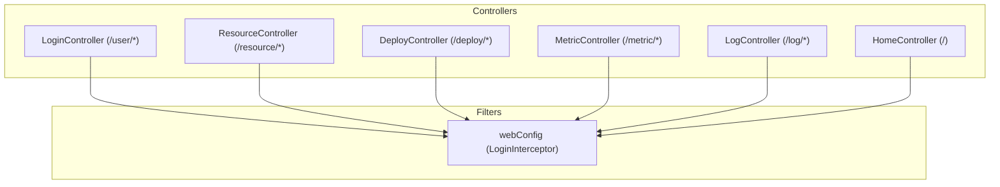
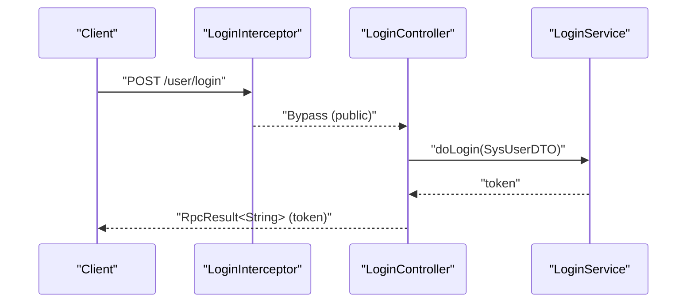
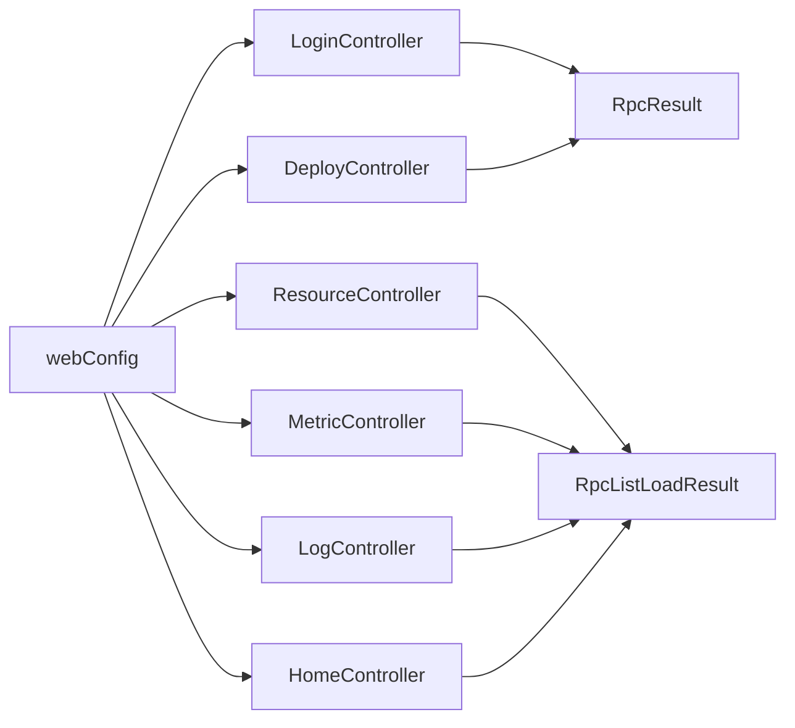

# REST APIs

<cite>
**Referenced Files in This Document**
- [LoginController.java](file://watcher-agent/src/main/java/com/virtual/cloud/om/agent/controller/LoginController.java)
- [ResourceController.java](file://watcher-agent/src/main/java/com/virtual/cloud/om/agent/controller/ResourceController.java)
- [DeployController.java](file://watcher-agent/src/main/java/com/virtual/cloud/om/agent/controller/DeployController.java)
- [MetricController.java](file://watcher-agent/src/main/java/com/virtual/cloud/om/agent/controller/MetricController.java)
- [LogController.java](file://watcher-agent/src/main/java/com/virtual/cloud/om/agent/controller/LogController.java)
- [HomeController.java](file://watcher-agent/src/main/java/com/virtual/cloud/om/agent/controller/HomeController.java)
- [webConfig.java](file://watcher-agent/src/main/java/com/virtual/cloud/om/agent/filter/webConfig.java)
- [SysUserDTO.java](file://watcher-sdk/src/main/java/com/virtual/cloud/om/sdk/dto/SysUserDTO.java)
- [ResourceDTO.java](file://watcher-agent/src/main/java/com/virtual/cloud/om/agent/dto/ResourceDTO.java)
- [ExportLogReq.java](file://watcher-sdk/src/main/java/com/virtual/cloud/om/sdk/dto/ExportLogReq.java)
- [RpcResult.java](file://watcher-sdk/src/main/java/com/virtual/cloud/om/sdk/dto/RpcResult.java)
- [RpcListLoadResult.java](file://watcher-sdk/src/main/java/com/virtual/cloud/om/sdk/dto/RpcListLoadResult.java)
</cite>

## Table of Contents
1. [Introduction](#introduction)
2. [Project Structure](#project-structure)
3. [Core Components](#core-components)
4. [Architecture Overview](#architecture-overview)
5. [Detailed Component Analysis](#detailed-component-analysis)
6. [Dependency Analysis](#dependency-analysis)
7. [Performance Considerations](#performance-considerations)
8. [Troubleshooting Guide](#troubleshooting-guide)
9. [Conclusion](#conclusion)
10. [Appendices](#appendices)

## Introduction
This document provides comprehensive REST API documentation for ShowTime’s backend services. It covers authentication, resource management, deployment operations, metric retrieval, log management, and system operations. For each endpoint, we specify HTTP methods, URL patterns, request/response schemas using DTO objects, authentication requirements, error handling, and query parameters. Practical examples with curl commands are included to demonstrate typical workflows such as adding resources, retrieving metrics, deploying components, and managing user sessions. We also address API versioning, rate limiting, CORS configuration, and security considerations including input validation and authorization checks.

## Project Structure
The REST API surface is implemented in the watcher-agent module under the controller package. Controllers expose endpoints grouped by domain:
- Authentication: /user/*
- Resource Management: /resource/*
- Deployment Operations: /deploy/*
- Metric Retrieval: /metric/*
- Log Management: /log/*
- System Operations: / (root-level endpoints)

CORS is enabled globally via @CrossOrigin on controllers. Interceptors enforce authentication for protected routes, excluding public endpoints such as login and Swagger UI.

**Diagram sources**
- [LoginController.java:13-18](file://watcher-agent/src/main/java/com/virtual/cloud/om/agent/controller/LoginController.java#L13-L18)
- [ResourceController.java:24-29](file://watcher-agent/src/main/java/com/virtual/cloud/om/agent/controller/ResourceController.java#L24-L29)
- [DeployController.java:33-36](file://watcher-agent/src/main/java/com/virtual/cloud/om/agent/controller/DeployController.java#L33-L36)
- [MetricController.java:30-35](file://watcher-agent/src/main/java/com/virtual/cloud/om/agent/controller/MetricController.java#L30-L35)
- [LogController.java:20-22](file://watcher-agent/src/main/java/com/virtual/cloud/om/agent/controller/LogController.java#L20-L22)
- [HomeController.java:24-26](file://watcher-agent/src/main/java/com/virtual/cloud/om/agent/controller/HomeController.java#L24-L26)
- [webConfig.java:11-37](file://watcher-agent/src/main/java/com/virtual/cloud/om/agent/filter/webConfig.java#L11-L37)

**Section sources**
- [LoginController.java:13-18](file://watcher-agent/src/main/java/com/virtual/cloud/om/agent/controller/LoginController.java#L13-L18)
- [ResourceController.java:24-29](file://watcher-agent/src/main/java/com/virtual/cloud/om/agent/controller/ResourceController.java#L24-L29)
- [DeployController.java:33-36](file://watcher-agent/src/main/java/com/virtual/cloud/om/agent/controller/DeployController.java#L33-L36)
- [MetricController.java:30-35](file://watcher-agent/src/main/java/com/virtual/cloud/om/agent/controller/MetricController.java#L30-L35)
- [LogController.java:20-22](file://watcher-agent/src/main/java/com/virtual/cloud/om/agent/controller/LogController.java#L20-L22)
- [HomeController.java:24-26](file://watcher-agent/src/main/java/com/virtual/cloud/om/agent/controller/HomeController.java#L24-L26)
- [webConfig.java:11-37](file://watcher-agent/src/main/java/com/virtual/cloud/om/agent/filter/webConfig.java#L11-L37)

## Core Components
- Response envelopes:
  - RpcResult: Single-object responses with state, message, and optional data.
  - RpcListLoadResult: Paginated list responses with state, message, and data list.
- Request DTOs:
  - SysUserDTO: Login credentials.
  - ResourceDTO: Resource creation/update payload.
  - ExportLogReq: Log search criteria.

These envelopes and DTOs define the canonical request and response schemas for all endpoints.

**Section sources**
- [RpcResult.java:1-88](file://watcher-sdk/src/main/java/com/virtual/cloud/om/sdk/dto/RpcResult.java#L1-L88)
- [RpcListLoadResult.java:1-57](file://watcher-sdk/src/main/java/com/virtual/cloud/om/sdk/dto/RpcListLoadResult.java#L1-L57)
- [SysUserDTO.java:1-27](file://watcher-sdk/src/main/java/com/virtual/cloud/om/sdk/dto/SysUserDTO.java#L1-L27)
- [ResourceDTO.java:1-35](file://watcher-agent/src/main/java/com/virtual/cloud/om/agent/dto/ResourceDTO.java#L1-L35)
- [ExportLogReq.java:1-48](file://watcher-sdk/src/main/java/com/virtual/cloud/om/sdk/dto/ExportLogReq.java#L1-L48)

## Architecture Overview
Endpoints are organized by functional domains. Authentication is enforced via a global interceptor that excludes public routes. Responses are standardized using RpcResult/RpcListLoadResult. Some endpoints integrate with external systems (e.g., workspace/CAS) via REST connections.

**Diagram sources**
- [webConfig.java:19-36](file://watcher-agent/src/main/java/com/virtual/cloud/om/agent/filter/webConfig.java#L19-L36)
- [LoginController.java:25-44](file://watcher-agent/src/main/java/com/virtual/cloud/om/agent/controller/LoginController.java#L25-L44)

**Section sources**
- [webConfig.java:19-36](file://watcher-agent/src/main/java/com/virtual/cloud/om/agent/filter/webConfig.java#L19-L36)
- [LoginController.java:25-44](file://watcher-agent/src/main/java/com/virtual/cloud/om/agent/controller/LoginController.java#L25-L44)

## Detailed Component Analysis

### Authentication (/user/*)
- Purpose: User login, session management, and password policy queries.
- Security: Protected by LoginInterceptor; public routes exclude /user/login and related.

Endpoints
- POST /user/login
  - Description: Authenticate user and return a token.
  - Authentication: None (public).
  - Request: SysUserDTO (username, password).
  - Response: RpcResult<String> (token).
  - Example:
    - curl -X POST https://host/user/login -H "Content-Type: application/json" -d '{"username":"admin","password":"encrypted-or-clear"}'
    - Response: {"state": "SUCCESS", "data": "TOKEN_HERE", "successMessage": "..."}
- PUT /user/modifyUser
  - Description: Update user profile.
  - Authentication: JWT required.
  - Request: ModifyUser (service-side DTO).
  - Response: RpcResult<Void>.
- POST /user/logout
  - Description: Invalidate current session.
  - Authentication: JWT required.
  - Response: RpcResult<Void>.
- GET /user/search/complexity
  - Description: Retrieve password complexity policy.
  - Authentication: JWT required.
  - Response: RpcResult<Integer>.

Security and Authorization
- Interceptor applies to all routes except public paths including /user/login.
- JWT token is expected for protected endpoints; token validation occurs in LoginInterceptor.

**Section sources**
- [LoginController.java:25-90](file://watcher-agent/src/main/java/com/virtual/cloud/om/agent/controller/LoginController.java#L25-L90)
- [webConfig.java:19-36](file://watcher-agent/src/main/java/com/virtual/cloud/om/agent/filter/webConfig.java#L19-L36)
- [SysUserDTO.java:16-27](file://watcher-sdk/src/main/java/com/virtual/cloud/om/sdk/dto/SysUserDTO.java#L16-L27)

### Resource Management (/resource/*)
- Purpose: CRUD and state management for monitored resources.

Endpoints
- GET /resource/list
  - Description: List resources with filters and pagination.
  - Query params: platform (optional), resourceName (optional), ipAddress (optional), page (default 0), size (default 10).
  - Response: RpcListLoadResult<Resource>.
- GET /resource/detail/{id}
  - Description: Get resource by ID.
  - Path var: id (string).
  - Response: RpcResult<Resource>.
- POST /resource/create
  - Description: Create a new resource.
  - Request: ResourceDTO.
  - Response: RpcResult<Void>.
- POST /resource/batchCreate
  - Description: Batch create/update resources.
  - Request: List<ResourceDTO>.
  - Response: RpcResult<Void>.
- PUT /resource/update
  - Description: Update an existing resource.
  - Request: ResourceDTO.
  - Response: RpcResult<Void>.
- DELETE /resource/delete/{id}
  - Description: Delete a resource.
  - Path var: id (string).
  - Response: RpcResult<Void>.
- PUT /resource/usable/{id}?usable={0|1}
  - Description: Toggle resource usability.
  - Path var: id (string), usable (integer).
  - Response: RpcResult<Void>.
- PUT /resource/remote/{id}?remote={0|1}
  - Description: Toggle SSH remote permissions and set end time.
  - Path var: id (string), remote (integer).
  - Response: RpcResult<Void>.

Request/Response Schemas
- ResourceDTO fields: resourceName, platform, id, ipAddress, port, ac, ci, protocol, authType, serverUsername, serverPassword, serverPort.
- Response envelopes: RpcResult<Void> or RpcListLoadResult<Resource>.

Validation and Error Handling
- Validation occurs in controller logic (e.g., existence checks before update/delete).
- Errors return RpcResult with FAILURE state and messages.

**Section sources**
- [ResourceController.java:34-234](file://watcher-agent/src/main/java/com/virtual/cloud/om/agent/controller/ResourceController.java#L34-L234)
- [ResourceDTO.java:9-34](file://watcher-agent/src/main/java/com/virtual/cloud/om/agent/dto/ResourceDTO.java#L9-L34)
- [RpcListLoadResult.java:9-57](file://watcher-sdk/src/main/java/com/virtual/cloud/om/sdk/dto/RpcListLoadResult.java#L9-L57)
- [RpcResult.java:3-88](file://watcher-sdk/src/main/java/com/virtual/cloud/om/sdk/dto/RpcResult.java#L3-L88)

### Deployment Operations (/deploy/*)
- Purpose: Deploy agents, manage components, configure networking, and handle keepalived notifications.

Endpoints
- POST /deploy/batch
  - Description: Multi-node deployment.
  - Request: BatchDeployVO (service-side DTO).
  - Response: RpcResult<Void>.
- POST /deploy/single
  - Description: Single-node deployment.
  - Request: DeployVO (service-side DTO).
  - Response: RpcResult<Void>.
- GET /deploy
  - Description: Query deployment status across nodes.
  - Response: RpcListLoadResult<DeployQueryVO>.
- PUT /deploy/manage
  - Description: Manage component services.
  - Request: ComponentManage (service-side DTO).
  - Response: RpcResult<Void>.
- GET /deploy/refresh
  - Description: Restart Spring Boot application.
  - Response: RpcResult<Void>.
- GET /deploy/host
  - Description: Retrieve host information.
  - Response: String.
- GET /deploy/localIps
  - Description: List local IP addresses.
  - Response: RpcListLoadResult<String>.
- PUT /deploy/keepalived/notify/{masterOrBackup}
  - Description: Keepalived master/backup notification.
  - Path var: masterOrBackup ("master"|"backup").
  - Response: RpcResult<Void>.
- PUT /deploy/step
  - Description: Update deployment step.
  - Request: UpdateStepDTO (service-side DTO).
  - Response: RpcResult<Void>.
- GET /deploy/network
  - Description: Get network interfaces.
  - Response: RpcResult (service-side DTO).
- POST /deploy/network
  - Description: Configure local network interfaces and DNS; restart network service.
  - Request: NetworkInfoVO (service-side DTO).
  - Response: RpcResult.
- PUT /deploy/network
  - Description: Edit network configuration remotely.
  - Request: NetworkInfoVO (service-side DTO).
  - Response: RpcResult.
- GET /deploy/network/master
  - Description: Check if node was master during pre-deployment.
  - Response: RpcResult (NetworkInfoVO or empty).
- GET /deploy/network/config/nodes
  - Description: Get network configs for all nodes.
  - Response: RpcResult (List of NetworkConfigDTO).
- GET /deploy/network/config/node?nodeName={name}
  - Description: Get network config for a specific node.
  - Query param: nodeName (string).
  - Response: RpcResult (NetworkConfigDTO or error).
- GET /deploy/network/wifis
  - Description: Enumerate available Wi-Fi networks.
  - Response: RpcResult (Set of SSIDs).
- POST /deploy/route/add/check
  - Description: Test reachability before adding a route.
  - Request: RouteVo (service-side DTO).
  - Response: RpcResult.
- POST /deploy/route/edit/check
  - Description: Test reachability before editing a route.
  - Request: RouteVo (service-side DTO).
  - Response: RpcResult.
- POST /deploy/route/check
  - Description: General route connectivity check.
  - Request: RouteCheckPingVo (service-side DTO).
  - Response: RpcResult.
- GET /deploy/route
  - Description: List configured routes.
  - Response: RpcResult (List of routes).
- POST /deploy/route
  - Description: Add a route.
  - Request: RouteVo (service-side DTO).
  - Response: RpcResult.
- PUT /deploy/route
  - Description: Edit a route.
  - Request: RouteVo (service-side DTO).
  - Response: RpcResult.
- DELETE /deploy/route
  - Description: Delete routes by IDs.
  - Request: List<String> (ids).
  - Response: RpcResult.

Notes
- Many endpoints interact with system commands and services (e.g., restarting network). Failures return RpcResult with FAILURE state and messages.

**Section sources**
- [DeployController.java:46-324](file://watcher-agent/src/main/java/com/virtual/cloud/om/agent/controller/DeployController.java#L46-L324)

### Metric Retrieval (/metric/*)
- Purpose: Query supported metric/platform types, list metrics, fetch latest metrics, trends, and summarize resource metrics. Also supports reporting metrics.

Endpoints
- GET /metric/types
  - Description: Supported metric types.
  - Response: RpcResult<List<Map<String,String>>> (code, name, desc, static).
- GET /metric/platforms
  - Description: Supported platform types.
  - Response: RpcResult<List<Map<String,String>>> (code, name).
- GET /metric/list
  - Description: List metrics with optional filters and pagination.
  - Query params: resourceId (optional), platform (optional), metricType (optional), startTime (optional), endTime (optional), page (default 0), size (default 100).
  - Behavior: If resourceId and metricType provided, triggers real-time collection via DataReportService; otherwise queries stored metrics.
  - Response: RpcListLoadResult<Map<String,Object>>.
- GET /metric/latest/{resourceId}
  - Description: Latest metrics for a resource across metric types.
  - Path var: resourceId (string).
  - Response: RpcResult<List<MetricData>>.
- GET /metric/trend/{resourceId}/{metricType}?hours={int}
  - Description: Trend data for a metric type over last N hours.
  - Path vars: resourceId (string), metricType (string), hours (default 1).
  - Response: RpcResult<List<MetricData>>.
- POST /metric/report
  - Description: Report metrics to storage.
  - Request: List<MetricData>.
  - Response: RpcResult<Void>.
- GET /metric/summary/{resourceId}
  - Description: Resource metric summary (count, last report time).
  - Path var: resourceId (string).
  - Response: RpcResult<Map<String,Object>>.

Data Model Notes
- MetricData fields include identifiers, values, units, timestamps, and tags. Responses convert internal entities to maps for list endpoints.

**Section sources**
- [MetricController.java:46-270](file://watcher-agent/src/main/java/com/virtual/cloud/om/agent/controller/MetricController.java#L46-L270)

### Log Management (/log/*)
- Purpose: Online log search across platforms and resources.

Endpoints
- POST /log/search
  - Description: Search and export logs.
  - Request: ExportLogReq (platform, resourceId, type, targetId, path, query, startTime, endTime, dataFormat, logNum, sortDir, level).
  - Response: RpcListLoadResult<LogLine>.

Example
- curl -X POST https://host/log/search -H "Content-Type: application/json" -d '{"platform":"workspace","resourceId":1,"type":"host","targetId":1001,"path":"/var/log/app.log","query":"ERROR","startTime":1640995200000,"endTime":1640998800000,"sortDir":1,"logNum":100}'

**Section sources**
- [LogController.java:27-34](file://watcher-agent/src/main/java/com/virtual/cloud/om/agent/controller/LogController.java#L27-L34)
- [ExportLogReq.java:10-48](file://watcher-sdk/src/main/java/com/virtual/cloud/om/sdk/dto/ExportLogReq.java#L10-L48)

### System Operations (/home/*)
- Purpose: System-level operations and integrations with external services.

Endpoints
- GET /
  - Description: Health/status message.
  - Response: String.
- GET /workspace/desktoppools
  - Description: Fetch desktop pool list from Workspace service.
  - Query params: RestHost (host, protocol, port).
  - Response: String.
- GET /cas/hosts
  - Description: Fetch hosts from CAS service.
  - Query params: RestHost (platform, host, protocol, port, username, password).
  - Response: String.
- POST /parameter
  - Description: Edit parameter by type and name.
  - Request: Parameter (service-side DTO).
  - Response: RpcResult<Parameter>.
- GET /log
  - Description: Query operation logs.
  - Query params: OperationLog (service-side DTO).
  - Response: RpcListLoadResult<OperationLog>.
- DELETE /log?time={time}&persistent={boolean}
  - Description: Remove logs older than a timestamp.
  - Query params: time (string), persistent (boolean).
  - Response: RpcResult<Long>.
- GET /enableKafkaDebug?ip={ip}
  - Description: Enable Kafka debug (currently disabled).
  - Query params: ip (string).
  - Response: RpcResult<String>.

**Section sources**
- [HomeController.java:52-99](file://watcher-agent/src/main/java/com/virtual/cloud/om/agent/controller/HomeController.java#L52-L99)

## Dependency Analysis
- Controllers depend on service-layer APIs and mappers for persistence.
- Global interceptor applies to all controllers, enforcing JWT-based authentication for protected routes.
- Response envelopes (RpcResult, RpcListLoadResult) unify error and success payloads.

**Diagram sources**
- [LoginController.java:25-90](file://watcher-agent/src/main/java/com/virtual/cloud/om/agent/controller/LoginController.java#L25-L90)
- [ResourceController.java:34-234](file://watcher-agent/src/main/java/com/virtual/cloud/om/agent/controller/ResourceController.java#L34-L234)
- [DeployController.java:46-324](file://watcher-agent/src/main/java/com/virtual/cloud/om/agent/controller/DeployController.java#L46-L324)
- [MetricController.java:46-270](file://watcher-agent/src/main/java/com/virtual/cloud/om/agent/controller/MetricController.java#L46-L270)
- [LogController.java:27-34](file://watcher-agent/src/main/java/com/virtual/cloud/om/agent/controller/LogController.java#L27-L34)
- [HomeController.java:52-99](file://watcher-agent/src/main/java/com/virtual/cloud/om/agent/controller/HomeController.java#L52-L99)
- [webConfig.java:19-36](file://watcher-agent/src/main/java/com/virtual/cloud/om/agent/filter/webConfig.java#L19-L36)
- [RpcResult.java:3-88](file://watcher-sdk/src/main/java/com/virtual/cloud/om/sdk/dto/RpcResult.java#L3-L88)
- [RpcListLoadResult.java:9-57](file://watcher-sdk/src/main/java/com/virtual/cloud/om/sdk/dto/RpcListLoadResult.java#L9-L57)

**Section sources**
- [webConfig.java:19-36](file://watcher-agent/src/main/java/com/virtual/cloud/om/agent/filter/webConfig.java#L19-L36)
- [RpcResult.java:3-88](file://watcher-sdk/src/main/java/com/virtual/cloud/om/sdk/dto/RpcResult.java#L3-L88)
- [RpcListLoadResult.java:9-57](file://watcher-sdk/src/main/java/com/virtual/cloud/om/sdk/dto/RpcListLoadResult.java#L9-L57)

## Performance Considerations
- Pagination defaults: /resource/list uses page=0, size=10; /metric/list uses page=0, size=100. Tune size according to client needs.
- Real-time metric collection: When resourceId and metricType are provided to /metric/list, the system triggers live collection via DataReportService. Expect higher latency and potential timeouts for large time ranges.
- Network operations: Deployment endpoints that restart services or apply network changes may block briefly; consider asynchronous patterns for production deployments.
- Logging: Limit logNum and refine KQL queries to reduce payload sizes.

## Troubleshooting Guide
Common Issues and Resolutions
- Authentication failures:
  - Cause: Missing or invalid JWT token for protected endpoints.
  - Resolution: Obtain a token via /user/login and include it in Authorization headers for subsequent requests.
- Resource not found:
  - Symptom: RpcResult with FAILURE and message indicating resource does not exist.
  - Resolution: Verify resource ID and platform values; ensure the resource exists before update/delete.
- Network configuration errors:
  - Symptom: RpcResult with FAILURE after POST/PUT /deploy/network.
  - Resolution: Validate NetworkInfoVO fields; confirm network service restart succeeded and strategy routes applied.
- Metric list returns empty:
  - Symptom: Empty list from /metric/list.
  - Resolution: Check filters (resourceId, metricType, startTime, endTime); if collecting live metrics, ensure DataReportService is reachable.

Error Handling Patterns
- All endpoints return RpcResult or RpcListLoadResult. FAILURE state indicates errors; inspect failureMessage for details.

**Section sources**
- [ResourceController.java:142-145](file://watcher-agent/src/main/java/com/virtual/cloud/om/agent/controller/ResourceController.java#L142-L145)
- [MetricController.java:90-120](file://watcher-agent/src/main/java/com/virtual/cloud/om/agent/controller/MetricController.java#L90-L120)
- [DeployController.java:148-180](file://watcher-agent/src/main/java/com/virtual/cloud/om/agent/controller/DeployController.java#L148-L180)

## Conclusion
ShowTime’s REST API provides a cohesive set of endpoints for authentication, resource lifecycle management, deployment orchestration, metrics, logging, and system operations. Standardized response envelopes simplify client integration, while interceptors and DTOs enforce security and validation. Use the provided curl examples as templates for testing and development, and adjust query parameters and payloads per your operational needs.

## Appendices

### API Versioning
- No explicit versioning scheme observed in URL patterns or headers. Consider introducing version prefixes (e.g., /api/v1) for future-proofing.

### Rate Limiting
- No built-in rate limiting detected. For production, consider implementing rate limiting at the gateway or controller level.

### CORS Configuration
- Controllers are annotated with @CrossOrigin, enabling cross-origin requests. Review browser policies and preflight handling as needed.

**Section sources**
- [LoginController.java:28](file://watcher-agent/src/main/java/com/virtual/cloud/om/agent/controller/LoginController.java#L28)
- [ResourceController.java:28](file://watcher-agent/src/main/java/com/virtual/cloud/om/agent/controller/ResourceController.java#L28)
- [DeployController.java:34](file://watcher-agent/src/main/java/com/virtual/cloud/om/agent/controller/DeployController.java#L34)
- [MetricController.java:34](file://watcher-agent/src/main/java/com/virtual/cloud/om/agent/controller/MetricController.java#L34)
- [LogController.java:20](file://watcher-agent/src/main/java/com/virtual/cloud/om/agent/controller/LogController.java#L20)

### Request/Response Envelopes
- RpcResult: Generic envelope with state, message, and optional data.
- RpcListLoadResult: Envelope for paginated lists with state, message, and data list.

**Section sources**
- [RpcResult.java:3-88](file://watcher-sdk/src/main/java/com/virtual/cloud/om/sdk/dto/RpcResult.java#L3-L88)
- [RpcListLoadResult.java:9-57](file://watcher-sdk/src/main/java/com/virtual/cloud/om/sdk/dto/RpcListLoadResult.java#L9-L57)

### Practical Examples

- Add a Resource
  - curl -X POST https://host/resource/create -H "Content-Type: application/json" -d '{"resourceName":"CAS-01","platform":"cas","ipAddress":"198.51.100.10","port":8080,"ac":"admin","ci":"encrypted","protocol":"HTTP","authType":"Digest","serverUsername":"root","serverPassword":"encrypted","serverPort":22}'
  - Response: {"state":"SUCCESS","successMessage":"...","data":null}

- Retrieve Metrics for a Resource
  - curl "https://host/metric/list?resourceId=R1&metricType=cpu_usage&page=0&size=100"
  - Response: {"state":"SUCCESS","data":[{...}],"successMessage":"..."}

- Deploy a Component
  - curl -X POST https://host/deploy/manage -H "Content-Type: application/json" -d '{"action":"start","component":"agent"}'
  - Response: {"state":"SUCCESS","successMessage":"...","data":null}

- Search Logs
  - curl -X POST https://host/log/search -H "Content-Type: application/json" -d '{"platform":"workspace","resourceId":1,"type":"host","targetId":1001,"path":"/var/log/app.log","query":"ERROR","startTime":1640995200000,"endTime":1640998800000,"sortDir":1,"logNum":100}'
  - Response: {"state":"SUCCESS","data":[{...}],"successMessage":"..."}

- Manage User Session
  - curl -X POST https://host/user/login -H "Content-Type: application/json" -d '{"username":"admin","password":"encrypted-or-clear"}'
  - Response: {"state":"SUCCESS","data":"TOKEN_HERE","successMessage":"..."}
  - Subsequent request: curl -H "Authorization: Bearer TOKEN_HERE" https://host/resource/list?page=0&size=10