# WebSocket APIs

<cite>
**Referenced Files in This Document**
- [WebsocketMessageDTO.java](file://watcher-agent/src/main/java/com/virtual/cloud/om/agent/dto/WebsocketMessageDTO.java)
- [WebsocketWatcherRouteOperateResult.java](file://watcher-agent/src/main/java/com/virtual/cloud/om/agent/dto/WebsocketWatcherRouteOperateResult.java)
- [WebsocketWatcherRouteQueryResult.java](file://watcher-agent/src/main/java/com/virtual/cloud/om/agent/dto/WebsocketWatcherRouteQueryResult.java)
- [WebsocketSate.java](file://watcher-agent/src/main/java/com/virtual/cloud/om/agent/entity/WebsocketSate.java)
- [WebsocketPushTypeEnum.java](file://watcher-sdk/src/main/java/com/virtual/cloud/om/sdk/constant/WebsocketPushTypeEnum.java)
- [WebsocketPushDTO.java](file://watcher-sdk/src/main/java/com/virtual/cloud/om/sdk/dto/websocket/WebsocketPushDTO.java)
- [WebsocketAuthDTO.java](file://watcher-sdk/src/main/java/com/virtual/cloud/om/sdk/dto/websocket/WebsocketAuthDTO.java)
- [WebsocketStateDTO.java](file://watcher-sdk/src/main/java/com/virtual/cloud/om/sdk/dto/websocket/WebsocketStateDTO.java)
- [WebsocketHostLimitDTO.java](file://watcher-sdk/src/main/java/com/virtual/cloud/om/sdk/dto/websocket/WebsocketHostLimitDTO.java)
- [DataCenterWebcocketUriConstants.java](file://watcher-sdk/src/main/java/com/virtual/cloud/om/sdk/constant/uri/DataCenterWebcocketUriConstants.java)
- [JwtTokenUtil.java](file://watcher-sdk/src/main/java/com/virtual/cloud/om/sdk/utils/JwtTokenUtil.java)
</cite>

## Table of Contents
1. [Introduction](#introduction)
2. [Project Structure](#project-structure)
3. [Core Components](#core-components)
4. [Architecture Overview](#architecture-overview)
5. [Detailed Component Analysis](#detailed-component-analysis)
6. [Dependency Analysis](#dependency-analysis)
7. [Performance Considerations](#performance-considerations)
8. [Troubleshooting Guide](#troubleshooting-guide)
9. [Conclusion](#conclusion)
10. [Appendices](#appendices)

## Introduction
This document describes ShowTime’s WebSocket real-time communication system. It covers connection establishment, JWT-based authentication, message protocols, event types, and operational behaviors such as heartbeats, reconnection strategies, and error handling. Practical client-side examples are included for JavaScript/TypeScript to help implement robust real-time clients.

## Project Structure
The WebSocket system spans two modules:
- watcher-sdk: Defines DTOs, enums, constants, and utilities for WebSocket messaging and authentication.
- watcher-agent: Provides agent-side DTOs and entities for route operations and state reporting.

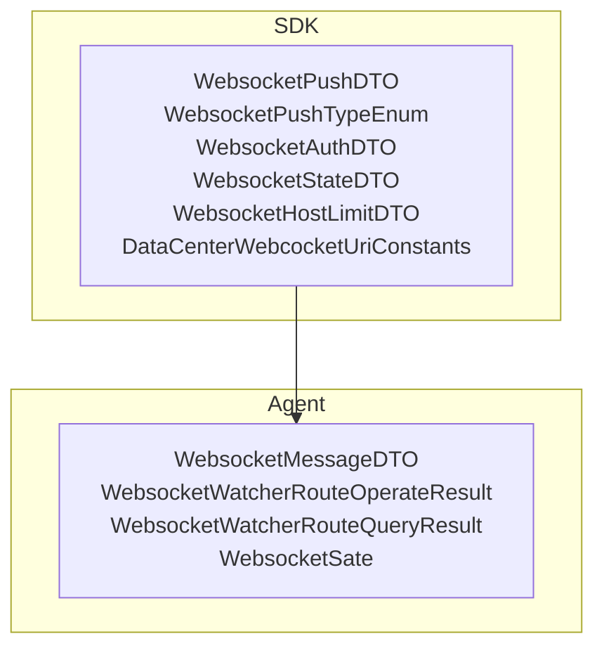

**Diagram sources**
- [WebsocketPushDTO.java:1-14](file://watcher-sdk/src/main/java/com/virtual/cloud/om/sdk/dto/websocket/WebsocketPushDTO.java#L1-L14)
- [WebsocketPushTypeEnum.java:1-22](file://watcher-sdk/src/main/java/com/virtual/cloud/om/sdk/constant/WebsocketPushTypeEnum.java#L1-L22)
- [WebsocketAuthDTO.java:1-23](file://watcher-sdk/src/main/java/com/virtual/cloud/om/sdk/dto/websocket/WebsocketAuthDTO.java#L1-L23)
- [WebsocketStateDTO.java:1-24](file://watcher-sdk/src/main/java/com/virtual/cloud/om/sdk/dto/websocket/WebsocketStateDTO.java#L1-L24)
- [WebsocketHostLimitDTO.java:1-11](file://watcher-sdk/src/main/java/com/virtual/cloud/om/sdk/dto/websocket/WebsocketHostLimitDTO.java#L1-L11)
- [DataCenterWebcocketUriConstants.java:1-14](file://watcher-sdk/src/main/java/com/virtual/cloud/om/sdk/constant/uri/DataCenterWebcocketUriConstants.java#L1-L14)
- [WebsocketMessageDTO.java:1-23](file://watcher-agent/src/main/java/com/virtual/cloud/om/agent/dto/WebsocketMessageDTO.java#L1-L23)
- [WebsocketWatcherRouteOperateResult.java:1-14](file://watcher-agent/src/main/java/com/virtual/cloud/om/agent/dto/WebsocketWatcherRouteOperateResult.java#L1-L14)
- [WebsocketWatcherRouteQueryResult.java:1-17](file://watcher-agent/src/main/java/com/virtual/cloud/om/agent/dto/WebsocketWatcherRouteQueryResult.java#L1-L17)
- [WebsocketSate.java:1-28](file://watcher-agent/src/main/java/com/virtual/cloud/om/agent/entity/WebsocketSate.java#L1-L28)

**Section sources**
- [WebsocketPushDTO.java:1-14](file://watcher-sdk/src/main/java/com/virtual/cloud/om/sdk/dto/websocket/WebsocketPushDTO.java#L1-L14)
- [WebsocketPushTypeEnum.java:1-22](file://watcher-sdk/src/main/java/com/virtual/cloud/om/sdk/constant/WebsocketPushTypeEnum.java#L1-L22)
- [WebsocketAuthDTO.java:1-23](file://watcher-sdk/src/main/java/com/virtual/cloud/om/sdk/dto/websocket/WebsocketAuthDTO.java#L1-L23)
- [WebsocketStateDTO.java:1-24](file://watcher-sdk/src/main/java/com/virtual/cloud/om/sdk/dto/websocket/WebsocketStateDTO.java#L1-L24)
- [WebsocketHostLimitDTO.java:1-11](file://watcher-sdk/src/main/java/com/virtual/cloud/om/sdk/dto/websocket/WebsocketHostLimitDTO.java#L1-L11)
- [DataCenterWebcocketUriConstants.java:1-14](file://watcher-sdk/src/main/java/com/virtual/cloud/om/sdk/constant/uri/DataCenterWebcocketUriConstants.java#L1-L14)
- [WebsocketMessageDTO.java:1-23](file://watcher-agent/src/main/java/com/virtual/cloud/om/agent/dto/WebsocketMessageDTO.java#L1-L23)
- [WebsocketWatcherRouteOperateResult.java:1-14](file://watcher-agent/src/main/java/com/virtual/cloud/om/agent/dto/WebsocketWatcherRouteOperateResult.java#L1-L14)
- [WebsocketWatcherRouteQueryResult.java:1-17](file://watcher-agent/src/main/java/com/virtual/cloud/om/agent/dto/WebsocketWatcherRouteQueryResult.java#L1-L17)
- [WebsocketSate.java:1-28](file://watcher-agent/src/main/java/com/virtual/cloud/om/agent/entity/WebsocketSate.java#L1-L28)

## Core Components
- WebSocket URI constants define the endpoint paths for WebSocket connections.
- Authentication DTO carries JWT token, heartbeat interval hint, and watcher code.
- Push DTO wraps typed events with generic payload data.
- Event type enumeration lists supported push types.
- State and limit DTOs represent server feedback and capacity constraints.
- Agent-side DTOs model route operation results and raw message envelopes.

Key artifacts:
- WebSocket URIs: [WEBSOCKET:11-11](file://watcher-sdk/src/main/java/com/virtual/cloud/om/sdk/constant/uri/DataCenterWebcocketUriConstants.java#L11-L11), [WEBSOCKET_SSH:12-12](file://watcher-sdk/src/main/java/com/virtual/cloud/om/sdk/constant/uri/DataCenterWebcocketUriConstants.java#L12-L12)
- Authentication: [WebsocketAuthDTO:15-22](file://watcher-sdk/src/main/java/com/virtual/cloud/om/sdk/dto/websocket/WebsocketAuthDTO.java#L15-L22)
- Push envelope: [WebsocketPushDTO:10-13](file://watcher-sdk/src/main/java/com/virtual/cloud/om/sdk/dto/websocket/WebsocketPushDTO.java#L10-L13)
- Event types: [WebsocketPushTypeEnum:4-21](file://watcher-sdk/src/main/java/com/virtual/cloud/om/sdk/constant/WebsocketPushTypeEnum.java#L4-L21)
- State feedback: [WebsocketStateDTO:15-23](file://watcher-sdk/src/main/java/com/virtual/cloud/om/sdk/dto/websocket/WebsocketStateDTO.java#L15-L23)
- Host limit: [WebsocketHostLimitDTO:8-11](file://watcher-sdk/src/main/java/com/virtual/cloud/om/sdk/dto/websocket/WebsocketHostLimitDTO.java#L8-L11)
- Agent message envelope: [WebsocketMessageDTO:15-22](file://watcher-agent/src/main/java/com/virtual/cloud/om/agent/dto/WebsocketMessageDTO.java#L15-L22)
- Route operation result: [WebsocketWatcherRouteOperateResult:6-12](file://watcher-agent/src/main/java/com/virtual/cloud/om/agent/dto/WebsocketWatcherRouteOperateResult.java#L6-L12)
- Route query result: [WebsocketWatcherRouteQueryResult:9-16](file://watcher-agent/src/main/java/com/virtual/cloud/om/agent/dto/WebsocketWatcherRouteQueryResult.java#L9-L16)
- Agent state entity: [WebsocketSate:20-28](file://watcher-agent/src/main/java/com/virtual/cloud/om/agent/entity/WebsocketSate.java#L20-L28)

**Section sources**
- [DataCenterWebcocketUriConstants.java:8-13](file://watcher-sdk/src/main/java/com/virtual/cloud/om/sdk/constant/uri/DataCenterWebcocketUriConstants.java#L8-L13)
- [WebsocketAuthDTO.java:15-22](file://watcher-sdk/src/main/java/com/virtual/cloud/om/sdk/dto/websocket/WebsocketAuthDTO.java#L15-L22)
- [WebsocketPushDTO.java:10-13](file://watcher-sdk/src/main/java/com/virtual/cloud/om/sdk/dto/websocket/WebsocketPushDTO.java#L10-L13)
- [WebsocketPushTypeEnum.java:4-21](file://watcher-sdk/src/main/java/com/virtual/cloud/om/sdk/constant/WebsocketPushTypeEnum.java#L4-L21)
- [WebsocketStateDTO.java:15-23](file://watcher-sdk/src/main/java/com/virtual/cloud/om/sdk/dto/websocket/WebsocketStateDTO.java#L15-L23)
- [WebsocketHostLimitDTO.java:8-11](file://watcher-sdk/src/main/java/com/virtual/cloud/om/sdk/dto/websocket/WebsocketHostLimitDTO.java#L8-L11)
- [WebsocketMessageDTO.java:15-22](file://watcher-agent/src/main/java/com/virtual/cloud/om/agent/dto/WebsocketMessageDTO.java#L15-L22)
- [WebsocketWatcherRouteOperateResult.java:6-12](file://watcher-agent/src/main/java/com/virtual/cloud/om/agent/dto/WebsocketWatcherRouteOperateResult.java#L6-L12)
- [WebsocketWatcherRouteQueryResult.java:9-16](file://watcher-agent/src/main/java/com/virtual/cloud/om/agent/dto/WebsocketWatcherRouteQueryResult.java#L9-L16)
- [WebsocketSate.java:20-28](file://watcher-agent/src/main/java/com/virtual/cloud/om/agent/entity/WebsocketSate.java#L20-L28)

## Architecture Overview
The WebSocket API uses a typed push model:
- Client connects to the WebSocket endpoint.
- Client authenticates with a JWT token and watcher identity.
- Server pushes typed events to the client based on system state and operations.
- Client handles events and responds with heartbeats and commands.

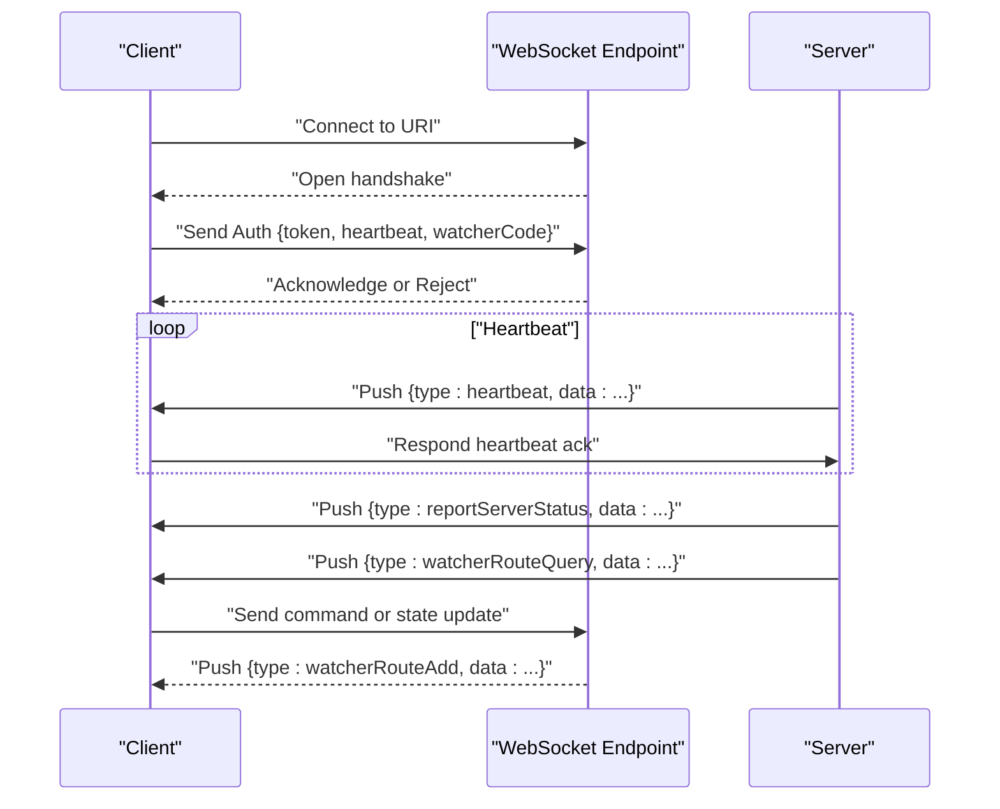

**Diagram sources**
- [DataCenterWebcocketUriConstants.java:11-12](file://watcher-sdk/src/main/java/com/virtual/cloud/om/sdk/constant/uri/DataCenterWebcocketUriConstants.java#L11-L12)
- [WebsocketAuthDTO.java:15-22](file://watcher-sdk/src/main/java/com/virtual/cloud/om/sdk/dto/websocket/WebsocketAuthDTO.java#L15-L22)
- [WebsocketPushTypeEnum.java:4-21](file://watcher-sdk/src/main/java/com/virtual/cloud/om/sdk/constant/WebsocketPushTypeEnum.java#L4-L21)
- [WebsocketPushDTO.java:10-13](file://watcher-sdk/src/main/java/com/virtual/cloud/om/sdk/dto/websocket/WebsocketPushDTO.java#L10-L13)

## Detailed Component Analysis

### WebSocket Message Envelope
The agent-side message envelope carries a type and data payload suitable for transport over WebSocket.

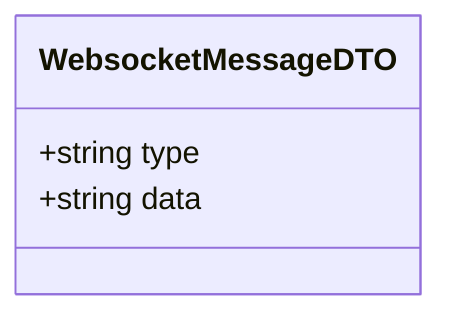

**Diagram sources**
- [WebsocketMessageDTO.java:15-22](file://watcher-agent/src/main/java/com/virtual/cloud/om/agent/dto/WebsocketMessageDTO.java#L15-L22)

**Section sources**
- [WebsocketMessageDTO.java:15-22](file://watcher-agent/src/main/java/com/virtual/cloud/om/agent/dto/WebsocketMessageDTO.java#L15-L22)

### Route Operations and Queries
Agent-side DTOs support route operation outcomes and query results.

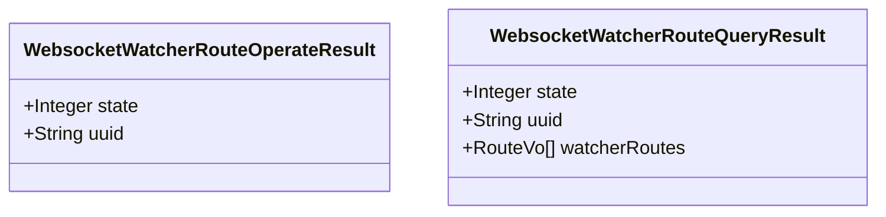

**Diagram sources**
- [WebsocketWatcherRouteOperateResult.java:6-12](file://watcher-agent/src/main/java/com/virtual/cloud/om/agent/dto/WebsocketWatcherRouteOperateResult.java#L6-L12)
- [WebsocketWatcherRouteQueryResult.java:9-16](file://watcher-agent/src/main/java/com/virtual/cloud/om/agent/dto/WebsocketWatcherRouteQueryResult.java#L9-L16)

**Section sources**
- [WebsocketWatcherRouteOperateResult.java:6-12](file://watcher-agent/src/main/java/com/virtual/cloud/om/agent/dto/WebsocketWatcherRouteOperateResult.java#L6-L12)
- [WebsocketWatcherRouteQueryResult.java:9-16](file://watcher-agent/src/main/java/com/virtual/cloud/om/agent/dto/WebsocketWatcherRouteQueryResult.java#L9-L16)

### Agent State Reporting
Agent state is represented as an entity with id, state code, and message.

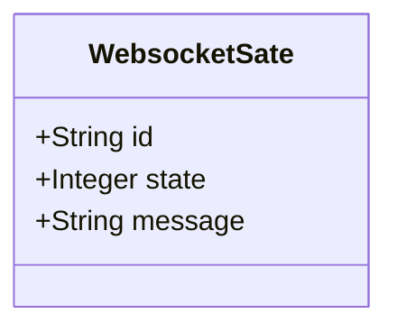

**Diagram sources**
- [WebsocketSate.java:20-28](file://watcher-agent/src/main/java/com/virtual/cloud/om/agent/entity/WebsocketSate.java#L20-L28)

**Section sources**
- [WebsocketSate.java:20-28](file://watcher-agent/src/main/java/com/virtual/cloud/om/agent/entity/WebsocketSate.java#L20-L28)

### Push DTO and Event Types
The SDK defines a generic push envelope and enumerates supported event types.

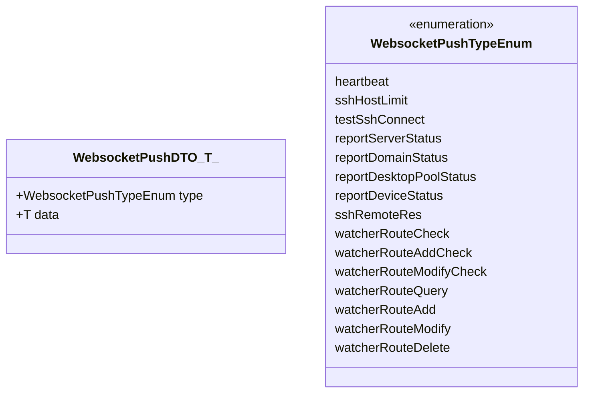

**Diagram sources**
- [WebsocketPushDTO.java:10-13](file://watcher-sdk/src/main/java/com/virtual/cloud/om/sdk/dto/websocket/WebsocketPushDTO.java#L10-L13)
- [WebsocketPushTypeEnum.java:4-21](file://watcher-sdk/src/main/java/com/virtual/cloud/om/sdk/constant/WebsocketPushTypeEnum.java#L4-L21)

**Section sources**
- [WebsocketPushDTO.java:10-13](file://watcher-sdk/src/main/java/com/virtual/cloud/om/sdk/dto/websocket/WebsocketPushDTO.java#L10-L13)
- [WebsocketPushTypeEnum.java:4-21](file://watcher-sdk/src/main/java/com/virtual/cloud/om/sdk/constant/WebsocketPushTypeEnum.java#L4-L21)

### Authentication and Heartbeat
Authentication DTO carries JWT token, heartbeat hint, and watcher code. Heartbeat is a dedicated event type.

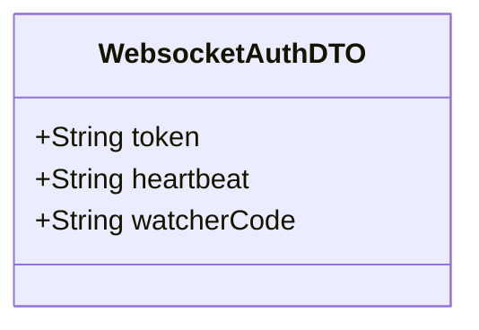

**Diagram sources**
- [WebsocketAuthDTO.java:15-22](file://watcher-sdk/src/main/java/com/virtual/cloud/om/sdk/dto/websocket/WebsocketAuthDTO.java#L15-L22)
- [WebsocketPushTypeEnum.java:4-6](file://watcher-sdk/src/main/java/com/virtual/cloud/om/sdk/constant/WebsocketPushTypeEnum.java#L4-L6)

**Section sources**
- [WebsocketAuthDTO.java:15-22](file://watcher-sdk/src/main/java/com/virtual/cloud/om/sdk/dto/websocket/WebsocketAuthDTO.java#L15-L22)
- [WebsocketPushTypeEnum.java:4-6](file://watcher-sdk/src/main/java/com/virtual/cloud/om/sdk/constant/WebsocketPushTypeEnum.java#L4-L6)

### State Feedback and Host Limits
State DTO communicates success/failure with messages. Host limit DTO signals capacity constraints.

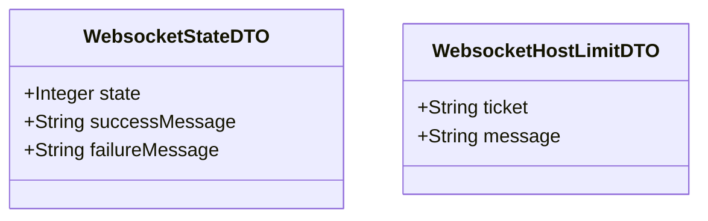

**Diagram sources**
- [WebsocketStateDTO.java:15-23](file://watcher-sdk/src/main/java/com/virtual/cloud/om/sdk/dto/websocket/WebsocketStateDTO.java#L15-L23)
- [WebsocketHostLimitDTO.java:8-11](file://watcher-sdk/src/main/java/com/virtual/cloud/om/sdk/dto/websocket/WebsocketHostLimitDTO.java#L8-L11)

**Section sources**
- [WebsocketStateDTO.java:15-23](file://watcher-sdk/src/main/java/com/virtual/cloud/om/sdk/dto/websocket/WebsocketStateDTO.java#L15-L23)
- [WebsocketHostLimitDTO.java:8-11](file://watcher-sdk/src/main/java/com/virtual/cloud/om/sdk/dto/websocket/WebsocketHostLimitDTO.java#L8-L11)

### URI Constants
WebSocket endpoints are defined under a common prefix.

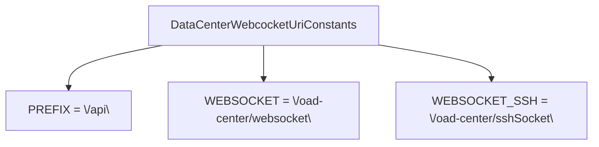

**Diagram sources**
- [DataCenterWebcocketUriConstants.java:8-13](file://watcher-sdk/src/main/java/com/virtual/cloud/om/sdk/constant/uri/DataCenterWebcocketUriConstants.java#L8-L13)

**Section sources**
- [DataCenterWebcocketUriConstants.java:8-13](file://watcher-sdk/src/main/java/com/virtual/cloud/om/sdk/constant/uri/DataCenterWebcocketUriConstants.java#L8-L13)

### JWT Utilities
JWT utilities provide token parsing and expiration handling.

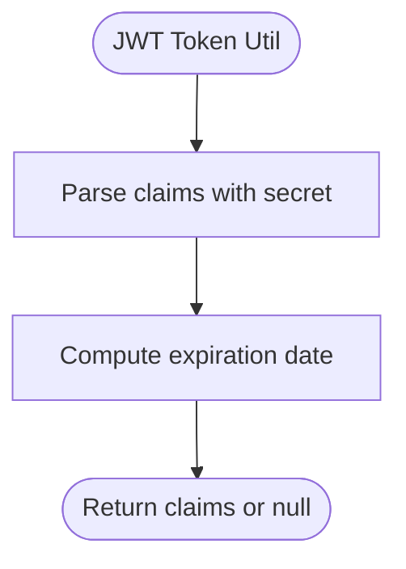

**Diagram sources**
- [JwtTokenUtil.java:17-47](file://watcher-sdk/src/main/java/com/virtual/cloud/om/sdk/utils/JwtTokenUtil.java#L17-L47)

**Section sources**
- [JwtTokenUtil.java:17-47](file://watcher-sdk/src/main/java/com/virtual/cloud/om/sdk/utils/JwtTokenUtil.java#L17-L47)

## Dependency Analysis
The SDK and Agent modules collaborate to deliver a cohesive WebSocket experience:
- SDK defines the contract (push types, DTOs, URIs).
- Agent implements route and state operations that feed into the push model.

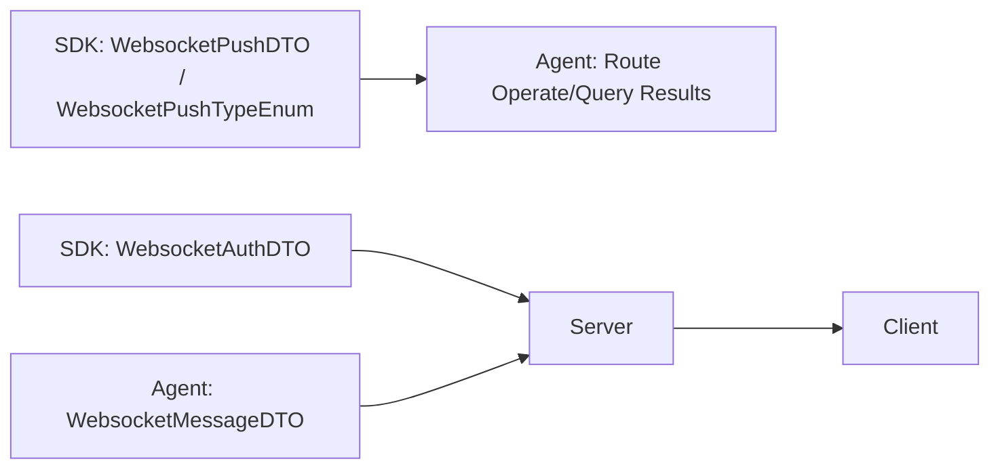

**Diagram sources**
- [WebsocketPushDTO.java:10-13](file://watcher-sdk/src/main/java/com/virtual/cloud/om/sdk/dto/websocket/WebsocketPushDTO.java#L10-L13)
- [WebsocketPushTypeEnum.java:4-21](file://watcher-sdk/src/main/java/com/virtual/cloud/om/sdk/constant/WebsocketPushTypeEnum.java#L4-L21)
- [WebsocketAuthDTO.java:15-22](file://watcher-sdk/src/main/java/com/virtual/cloud/om/sdk/dto/websocket/WebsocketAuthDTO.java#L15-L22)
- [WebsocketMessageDTO.java:15-22](file://watcher-agent/src/main/java/com/virtual/cloud/om/agent/dto/WebsocketMessageDTO.java#L15-L22)

**Section sources**
- [WebsocketPushDTO.java:10-13](file://watcher-sdk/src/main/java/com/virtual/cloud/om/sdk/dto/websocket/WebsocketPushDTO.java#L10-L13)
- [WebsocketPushTypeEnum.java:4-21](file://watcher-sdk/src/main/java/com/virtual/cloud/om/sdk/constant/WebsocketPushTypeEnum.java#L4-L21)
- [WebsocketAuthDTO.java:15-22](file://watcher-sdk/src/main/java/com/virtual/cloud/om/sdk/dto/websocket/WebsocketAuthDTO.java#L15-L22)
- [WebsocketMessageDTO.java:15-22](file://watcher-agent/src/main/java/com/virtual/cloud/om/agent/dto/WebsocketMessageDTO.java#L15-L22)

## Performance Considerations
- Keep-alive: Use heartbeat events to maintain connection health and detect disconnections promptly.
- Payload sizing: Prefer compact JSON payloads for frequent updates; batch where feasible.
- Backpressure: Implement client-side throttling for high-frequency metrics to avoid overload.
- Compression: Consider enabling compression at the WebSocket layer if supported by infrastructure.
- Connection pooling: Limit concurrent connections per watcher to reduce overhead.

## Troubleshooting Guide
Common issues and resolutions:
- Authentication failures: Verify JWT token validity and watcher code. Check server logs for rejected credentials.
- Heartbeat timeouts: Ensure client responds to heartbeat events within expected intervals.
- Route operation errors: Inspect route operation result state and UUID correlation.
- Host limits: When receiving host limit events, reduce concurrent operations or wait for capacity.
- State feedback: Use state DTO messages to diagnose success or failure conditions.

**Section sources**
- [WebsocketAuthDTO.java:15-22](file://watcher-sdk/src/main/java/com/virtual/cloud/om/sdk/dto/websocket/WebsocketAuthDTO.java#L15-L22)
- [WebsocketPushTypeEnum.java:4-6](file://watcher-sdk/src/main/java/com/virtual/cloud/om/sdk/constant/WebsocketPushTypeEnum.java#L4-L6)
- [WebsocketWatcherRouteOperateResult.java:6-12](file://watcher-agent/src/main/java/com/virtual/cloud/om/agent/dto/WebsocketWatcherRouteOperateResult.java#L6-L12)
- [WebsocketHostLimitDTO.java:8-11](file://watcher-sdk/src/main/java/com/virtual/cloud/om/sdk/dto/websocket/WebsocketHostLimitDTO.java#L8-L11)
- [WebsocketStateDTO.java:15-23](file://watcher-sdk/src/main/java/com/virtual/cloud/om/sdk/dto/websocket/WebsocketStateDTO.java#L15-L23)

## Conclusion
ShowTime’s WebSocket API provides a structured, typed push mechanism for real-time monitoring and control. By adhering to the defined DTOs, event types, and authentication flow, clients can implement resilient, high-performance real-time experiences.

## Appendices

### WebSocket Connection Establishment
- Connect to the WebSocket endpoint derived from the URI constants.
- Send an authentication message containing the JWT token, heartbeat hint, and watcher code.
- Upon successful authentication, expect periodic heartbeat events and targeted push events.

**Section sources**
- [DataCenterWebcocketUriConstants.java:11-12](file://watcher-sdk/src/main/java/com/virtual/cloud/om/sdk/constant/uri/DataCenterWebcocketUriConstants.java#L11-L12)
- [WebsocketAuthDTO.java:15-22](file://watcher-sdk/src/main/java/com/virtual/cloud/om/sdk/dto/websocket/WebsocketAuthDTO.java#L15-L22)

### Authentication Mechanisms Using JWT Tokens
- JWT utilities parse claims and compute expiration dates.
- Clients must refresh tokens before expiration and handle invalid/expired tokens gracefully.

**Section sources**
- [JwtTokenUtil.java:17-47](file://watcher-sdk/src/main/java/com/virtual/cloud/om/sdk/utils/JwtTokenUtil.java#L17-L47)

### Message Protocols and Formats
- Push envelope: type and data fields define event semantics and payload shape.
- Event types enumerate supported notifications (metrics, logs, deployments, alerts).
- Agent message envelope: type and data fields for agent-to-server messages.

**Section sources**
- [WebsocketPushDTO.java:10-13](file://watcher-sdk/src/main/java/com/virtual/cloud/om/sdk/dto/websocket/WebsocketPushDTO.java#L10-L13)
- [WebsocketPushTypeEnum.java:4-21](file://watcher-sdk/src/main/java/com/virtual/cloud/om/sdk/constant/WebsocketPushTypeEnum.java#L4-L21)
- [WebsocketMessageDTO.java:15-22](file://watcher-agent/src/main/java/com/virtual/cloud/om/agent/dto/WebsocketMessageDTO.java#L15-L22)

### Event Types and Payloads
- Heartbeat: periodic keepalive signal.
- SSH host limit: capacity constraint notification.
- Test SSH connect: connectivity verification result.
- Report events: server/domain/desktop/device status updates.
- SSH remote resources: remote resource availability.
- Watcher route operations: checks, queries, adds, modifies, deletes.

**Section sources**
- [WebsocketPushTypeEnum.java:4-21](file://watcher-sdk/src/main/java/com/virtual/cloud/om/sdk/constant/WebsocketPushTypeEnum.java#L4-L21)

### Connection Lifecycle Management and Reconnection Strategies
- Establish connection on application start.
- On close/error, implement exponential backoff with jitter.
- Re-authenticate after reconnect using stored token and watcher code.
- Resume subscriptions based on last acknowledged UUIDs.

[No sources needed since this section provides general guidance]

### Heartbeat Mechanisms
- Server sends heartbeat events; client acknowledges.
- Missed acknowledgments trigger reconnection attempts.

**Section sources**
- [WebsocketPushTypeEnum.java:4-6](file://watcher-sdk/src/main/java/com/virtual/cloud/om/sdk/constant/WebsocketPushTypeEnum.java#L4-L6)

### Error Handling
- Authentication rejection: retry with refreshed token.
- Host limit: throttle operations until capacity clears.
- Route operation failure: inspect result state and UUID for diagnostics.

**Section sources**
- [WebsocketHostLimitDTO.java:8-11](file://watcher-sdk/src/main/java/com/virtual/cloud/om/sdk/dto/websocket/WebsocketHostLimitDTO.java#L8-L11)
- [WebsocketWatcherRouteOperateResult.java:6-12](file://watcher-agent/src/main/java/com/virtual/cloud/om/agent/dto/WebsocketWatcherRouteOperateResult.java#L6-L12)

### Security Considerations
- Transport security: use secure WebSocket (wss) endpoints.
- Token rotation: proactively refresh JWT tokens before expiry.
- Watcher identity: ensure watcher code uniqueness and revocation on compromise.
- Rate limiting: enforce per-client rate limits to prevent abuse.

[No sources needed since this section provides general guidance]

### Client-Side Implementation Examples (JavaScript/TypeScript)
Note: The following outlines the steps and data structures. Replace with your own implementation.

- Connection setup
  - Build WebSocket URL from URI constants.
  - Open connection and listen for open/close/error events.
  - On open, send an authentication message containing token, heartbeat hint, and watcher code.

- Message handling
  - Register handlers for each event type.
  - For heartbeat, respond immediately to keep the connection alive.
  - For route operations, correlate by UUID and update UI accordingly.
  - For state feedback, surface success/failure messages to users.

- Event listeners
  - Metrics updates: render charts and dashboards.
  - Log streaming: append new log entries to the terminal/console.
  - Deployment status changes: refresh deployment list and progress indicators.
  - System alerts: show notifications and escalate as needed.

[No sources needed since this section provides general guidance]