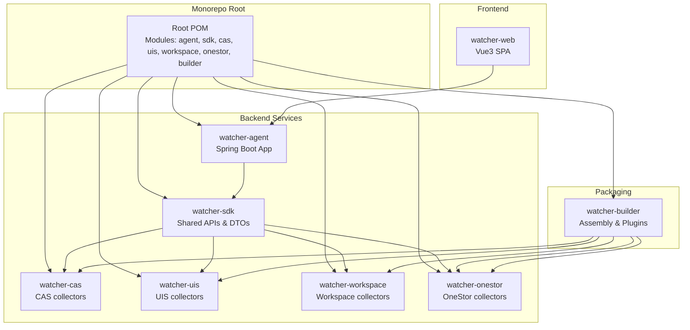
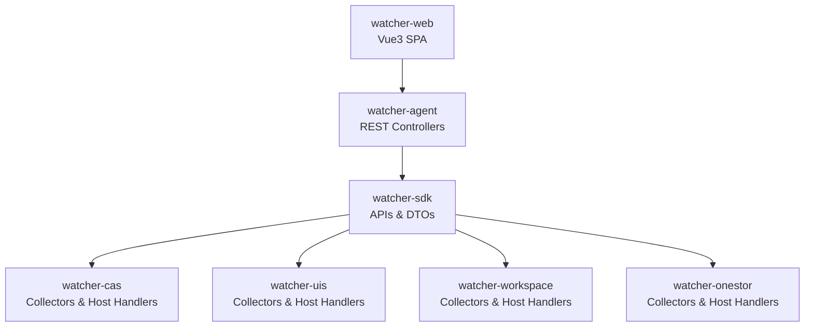
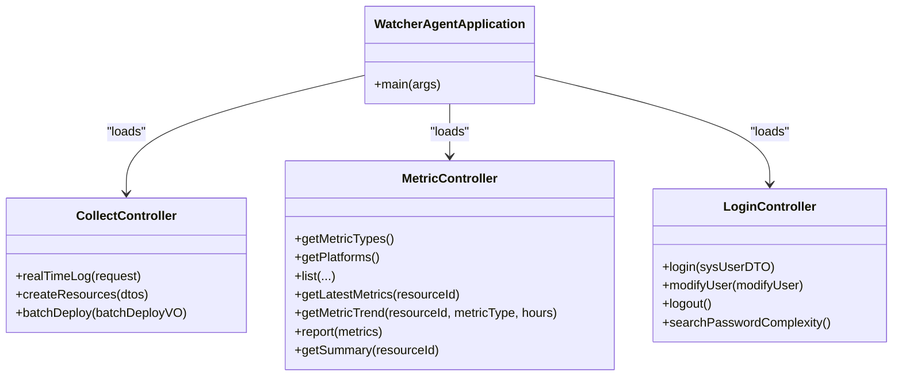
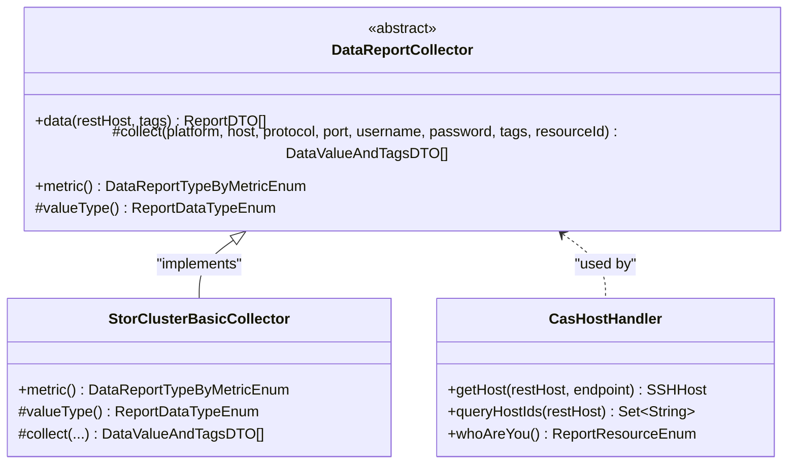
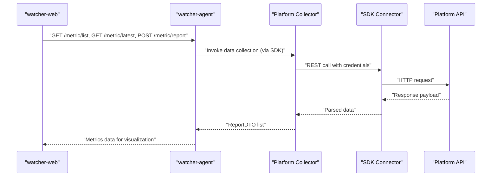
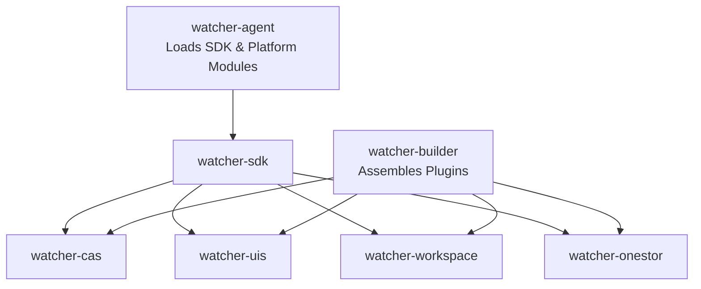
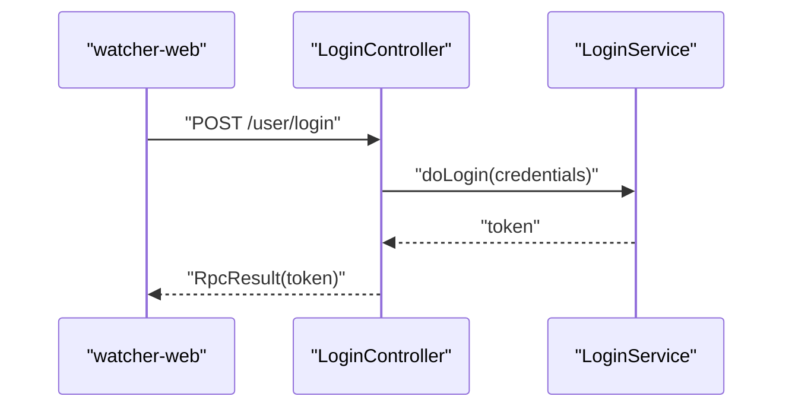
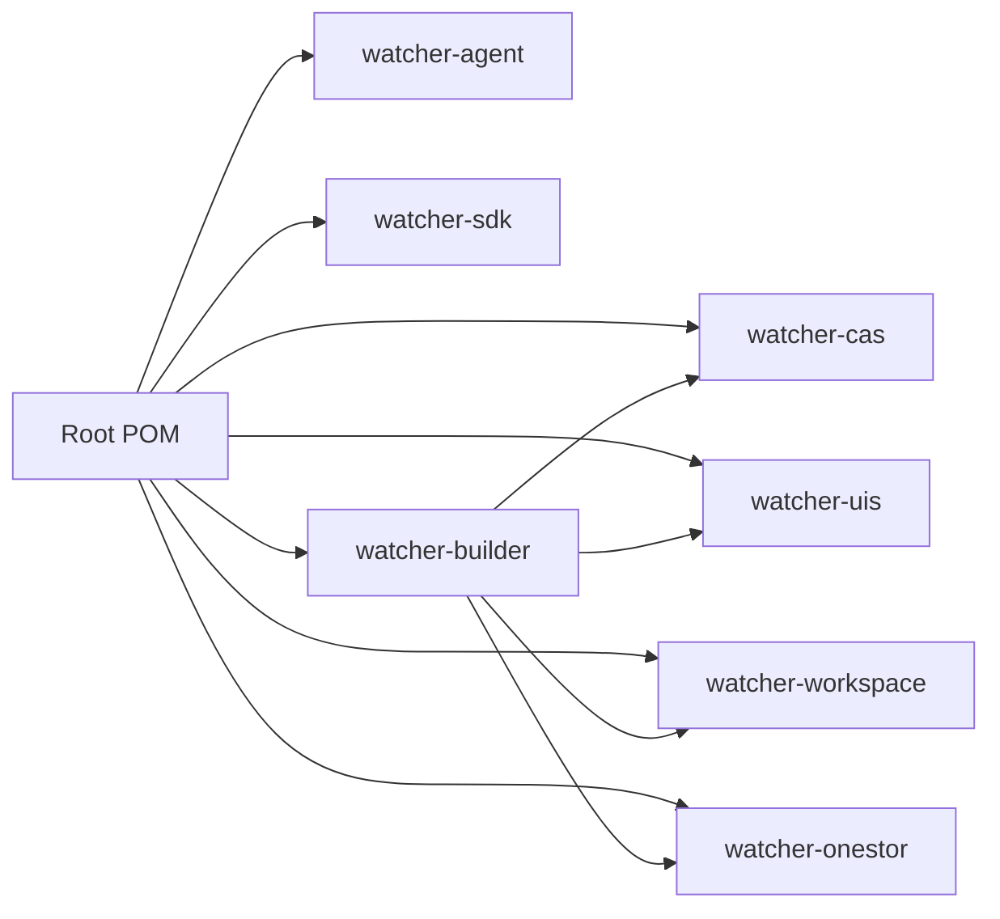

# Architecture Overview

<cite>
**Referenced Files in This Document**
- [Readme.md](file://Readme.md)
- [pom.xml](file://pom.xml)
- [WatcherAgentApplication.java](file://watcher-agent/src/main/java/com/virtual/cloud/om/agent/WatcherAgentApplication.java)
- [CollectController.java](file://watcher-agent/src/main/java/com/virtual/cloud/om/agent/controller/CollectController.java)
- [MetricController.java](file://watcher-agent/src/main/java/com/virtual/cloud/om/agent/controller/MetricController.java)
- [LoginController.java](file://watcher-agent/src/main/java/com/virtual/cloud/om/agent/controller/LoginController.java)
- [DataReportCollector.java](file://watcher-sdk/src/main/java/com/virtual/cloud/om/sdk/api/DataReportCollector.java)
- [PlatformTestConnectionApi.java](file://watcher-sdk/src/main/java/com/virtual/cloud/om/sdk/api/PlatformTestConnectionApi.java)
- [StorClusterBasicCollector.java](file://watcher-onestor/src/main/java/com/virtual/cloud/om/onestor/service/clusterBasic/StorClusterBasicCollector.java)
- [CasHostHandler.java](file://watcher-cas/src/main/java/com/virtual/cloud/om/cas/service/CasHostHandler.java)
- [watcher-builder pom.xml](file://watcher-builder/pom.xml)
- [watcher-web main.ts](file://watcher-web/src/main.ts)
- [watcher-web router/index.ts](file://watcher-web/src/router/index.ts)
- [watcher-web package.json](file://watcher-web/package.json)
- [watcher-sdk pom.xml](file://watcher-sdk/pom.xml)
</cite>

## Table of Contents
1. [Introduction](#introduction)
2. [Project Structure](#project-structure)
3. [Core Components](#core-components)
4. [Architecture Overview](#architecture-overview)
5. [Detailed Component Analysis](#detailed-component-analysis)
6. [Dependency Analysis](#dependency-analysis)
7. [Performance Considerations](#performance-considerations)
8. [Troubleshooting Guide](#troubleshooting-guide)
9. [Conclusion](#conclusion)

## Introduction
ShowTime is a monitoring platform designed for cloud infrastructure products, focusing on time-series data such as logs and metrics. It adopts a monorepo structure centered around a watcher-agent that orchestrates collection, processing, and reporting, while watcher-web provides the frontend for administration and visualization. Specialized platform modules (CAS, Workspace, UIS, OneStor) act as plugins that extend capabilities through a shared SDK.

Technology highlights include Spring Boot, MyBatis-Plus, JWT-based authentication, and a plugin packaging strategy for modular deployment.

## Project Structure
The repository is a Maven multi-module project organized by functional domains:
- Central monitoring agent: watcher-agent
- Frontend application: watcher-web
- Platform-specific collectors: watcher-cas, watcher-uis, watcher-workspace, watcher-onestor
- Shared SDK: watcher-sdk
- Packaging and distribution: watcher-builder

**Diagram sources**
- [pom.xml:11-20](file://pom.xml#L11-L20)
- [watcher-builder pom.xml:11-13](file://watcher-builder/pom.xml#L11-L13)

**Section sources**
- [Readme.md:27-38](file://Readme.md#L27-L38)
- [pom.xml:11-20](file://pom.xml#L11-L20)

## Core Components
- watcher-agent: Central Spring Boot application exposing REST endpoints for metrics, logs, deployments, and resource synchronization. It integrates scheduling, persistence, and plugin discovery via component scanning across SDK and platform modules.
- watcher-web: Vue3 single-page application with routing, internationalization, and state management. It communicates with watcher-agent for data and control operations.
- watcher-sdk: Shared library defining APIs, DTOs, constants, mappers, and utilities used by collectors and the agent.
- Platform modules: CAS, UIS, Workspace, OneStor implement platform-specific collectors and host handlers extending the SDK’s abstractions.
- watcher-builder: Assembles the runtime bundle, copies agent artifacts, and packages platform plugins into a unified distribution.

Key responsibilities:
- Data collection: SDK collectors encapsulate platform-specific logic and produce standardized ReportDTO payloads.
- Data ingestion: Agent exposes endpoints to accept metrics and logs, persists them, and supports real-time strategies.
- Authentication: LoginController handles JWT-based user authentication.
- Frontend integration: watcher-web routes and stores integrate with agent APIs for operational tasks.

**Section sources**
- [WatcherAgentApplication.java:14-19](file://watcher-agent/src/main/java/com/virtual/cloud/om/agent/WatcherAgentApplication.java#L14-L19)
- [CollectController.java:27-66](file://watcher-agent/src/main/java/com/virtual/cloud/om/agent/controller/CollectController.java#L27-L66)
- [MetricController.java:30-270](file://watcher-agent/src/main/java/com/virtual/cloud/om/agent/controller/MetricController.java#L30-L270)
- [LoginController.java:13-91](file://watcher-agent/src/main/java/com/virtual/cloud/om/agent/controller/LoginController.java#L13-L91)
- [DataReportCollector.java:18-117](file://watcher-sdk/src/main/java/com/virtual/cloud/om/sdk/api/DataReportCollector.java#L18-L117)
- [StorClusterBasicCollector.java:30-76](file://watcher-onestor/src/main/java/com/virtual/cloud/om/onestor/service/clusterBasic/StorClusterBasicCollector.java#L30-L76)
- [CasHostHandler.java:25-60](file://watcher-cas/src/main/java/com/virtual/cloud/om/cas/service/CasHostHandler.java#L25-L60)
- [watcher-builder pom.xml:15-211](file://watcher-builder/pom.xml#L15-L211)
- [watcher-web main.ts:1-37](file://watcher-web/src/main.ts#L1-L37)
- [watcher-web router/index.ts:27-72](file://watcher-web/src/router/index.ts#L27-L72)

## Architecture Overview
High-level system boundaries and interactions:
- Internal system boundary: watcher-agent and watcher-sdk form the core runtime.
- Platform boundary: CAS, UIS, Workspace, OneStor provide platform-specific collectors and host handlers.
- External systems: watcher-web acts as the admin UI; agents may also integrate with external storage and visualization systems (per technology stack).
- Communication: REST APIs between watcher-web and watcher-agent; SDK-defined interfaces connect collectors to platform APIs.

**Diagram sources**
- [watcher-web main.ts:26-36](file://watcher-web/src/main.ts#L26-L36)
- [WatcherAgentApplication.java:14-19](file://watcher-agent/src/main/java/com/virtual/cloud/om/agent/WatcherAgentApplication.java#L14-L19)
- [DataReportCollector.java:18-117](file://watcher-sdk/src/main/java/com/virtual/cloud/om/sdk/api/DataReportCollector.java#L18-L117)
- [CasHostHandler.java:25-60](file://watcher-cas/src/main/java/com/virtual/cloud/om/cas/service/CasHostHandler.java#L25-L60)
- [StorClusterBasicCollector.java:30-76](file://watcher-onestor/src/main/java/com/virtual/cloud/om/onestor/service/clusterBasic/StorClusterBasicCollector.java#L30-L76)

## Detailed Component Analysis

### Central Monitoring Agent (watcher-agent)
Responsibilities:
- Expose REST endpoints for metrics, logs, deployments, and resource synchronization.
- Manage authentication and authorization via JWT.
- Persist metrics and support real-time strategies through SDK APIs.
- Scan and load platform modules via component scanning across SDK and platform packages.

**Diagram sources**
- [WatcherAgentApplication.java:14-27](file://watcher-agent/src/main/java/com/virtual/cloud/om/agent/WatcherAgentApplication.java#L14-L27)
- [CollectController.java:27-66](file://watcher-agent/src/main/java/com/virtual/cloud/om/agent/controller/CollectController.java#L27-L66)
- [MetricController.java:30-270](file://watcher-agent/src/main/java/com/virtual/cloud/om/agent/controller/MetricController.java#L30-L270)
- [LoginController.java:13-91](file://watcher-agent/src/main/java/com/virtual/cloud/om/agent/controller/LoginController.java#L13-L91)

**Section sources**
- [WatcherAgentApplication.java:14-27](file://watcher-agent/src/main/java/com/virtual/cloud/om/agent/WatcherAgentApplication.java#L14-L27)
- [CollectController.java:27-66](file://watcher-agent/src/main/java/com/virtual/cloud/om/agent/controller/CollectController.java#L27-L66)
- [MetricController.java:30-270](file://watcher-agent/src/main/java/com/virtual/cloud/om/agent/controller/MetricController.java#L30-L270)
- [LoginController.java:13-91](file://watcher-agent/src/main/java/com/virtual/cloud/om/agent/controller/LoginController.java#L13-L91)

### Plugin Architecture Pattern (SDK + Platform Modules)
The SDK defines a collector abstraction and common DTOs. Platform modules implement collectors for specific platforms and host handlers for resource discovery.

**Diagram sources**
- [DataReportCollector.java:18-117](file://watcher-sdk/src/main/java/com/virtual/cloud/om/sdk/api/DataReportCollector.java#L18-L117)
- [StorClusterBasicCollector.java:30-76](file://watcher-onestor/src/main/java/com/virtual/cloud/om/onestor/service/clusterBasic/StorClusterBasicCollector.java#L30-L76)
- [CasHostHandler.java:25-60](file://watcher-cas/src/main/java/com/virtual/cloud/om/cas/service/CasHostHandler.java#L25-L60)

**Section sources**
- [DataReportCollector.java:18-117](file://watcher-sdk/src/main/java/com/virtual/cloud/om/sdk/api/DataReportCollector.java#L18-L117)
- [StorClusterBasicCollector.java:30-76](file://watcher-onestor/src/main/java/com/virtual/cloud/om/onestor/service/clusterBasic/StorClusterBasicCollector.java#L30-L76)
- [CasHostHandler.java:25-60](file://watcher-cas/src/main/java/com/virtual/cloud/om/cas/service/CasHostHandler.java#L25-L60)

### Data Flow: From Platform APIs to Storage and Visualization
End-to-end flow:
- Platform collectors (OneStor, CAS, etc.) query platform APIs via SDK connectors.
- Collectors transform raw responses into standardized ReportDTOs.
- Agent receives metrics/logs via REST endpoints and persists them.
- Frontend queries agent endpoints to render dashboards and reports.

**Diagram sources**
- [MetricController.java:77-161](file://watcher-agent/src/main/java/com/virtual/cloud/om/agent/controller/MetricController.java#L77-L161)
- [DataReportCollector.java:48-86](file://watcher-sdk/src/main/java/com/virtual/cloud/om/sdk/api/DataReportCollector.java#L48-L86)
- [StorClusterBasicCollector.java:38-65](file://watcher-onestor/src/main/java/com/virtual/cloud/om/onestor/service/clusterBasic/StorClusterBasicCollector.java#L38-L65)

**Section sources**
- [MetricController.java:77-161](file://watcher-agent/src/main/java/com/virtual/cloud/om/agent/controller/MetricController.java#L77-L161)
- [DataReportCollector.java:48-86](file://watcher-sdk/src/main/java/com/virtual/cloud/om/sdk/api/DataReportCollector.java#L48-L86)
- [StorClusterBasicCollector.java:38-65](file://watcher-onestor/src/main/java/com/virtual/cloud/om/onestor/service/clusterBasic/StorClusterBasicCollector.java#L38-L65)

### System Context: CAS, Workspace, UIS, OneStor and Central Agent
The central agent loads platform modules and delegates collection to them. The builder packages these modules for runtime.

**Diagram sources**
- [WatcherAgentApplication.java:14-19](file://watcher-agent/src/main/java/com/virtual/cloud/om/agent/WatcherAgentApplication.java#L14-L19)
- [pom.xml:11-20](file://pom.xml#L11-L20)
- [watcher-builder pom.xml:116-154](file://watcher-builder/pom.xml#L116-L154)

**Section sources**
- [WatcherAgentApplication.java:14-19](file://watcher-agent/src/main/java/com/virtual/cloud/om/agent/WatcherAgentApplication.java#L14-L19)
- [pom.xml:11-20](file://pom.xml#L11-L20)
- [watcher-builder pom.xml:116-154](file://watcher-builder/pom.xml#L116-L154)

### Cross-Cutting Concerns

#### Authentication and Authorization
- JWT-based login/logout endpoints manage session tokens.
- Internationalized messages and RPC wrappers standardize responses.

**Diagram sources**
- [LoginController.java:25-44](file://watcher-agent/src/main/java/com/virtual/cloud/om/agent/controller/LoginController.java#L25-L44)

**Section sources**
- [LoginController.java:13-91](file://watcher-agent/src/main/java/com/virtual/cloud/om/agent/controller/LoginController.java#L13-L91)

#### Logging
- Structured logging via SLF4J in controllers and collectors.
- Logback configurations are packaged for dev/prod/test environments.

**Section sources**
- [MetricController.java:18-34](file://watcher-agent/src/main/java/com/virtual/cloud/om/agent/controller/MetricController.java#L18-L34)
- [DataReportCollector.java:18-20](file://watcher-sdk/src/main/java/com/virtual/cloud/om/sdk/api/DataReportCollector.java#L18-L20)

#### Real-Time Communication
- Frontend includes socket.io-client; real-time features can be integrated via WebSocket endpoints exposed by the agent.
- The SDK defines WebSocket-related constants and DTOs for push notifications.

**Section sources**
- [watcher-web package.json:40-40](file://watcher-web/package.json#L40-L40)
- [DataReportCollector.java:18-20](file://watcher-sdk/src/main/java/com/virtual/cloud/om/sdk/api/DataReportCollector.java#L18-L20)

## Dependency Analysis
Module-level dependencies and packaging:
- Root POM aggregates all modules.
- watcher-builder copies agent artifacts and platform plugins into a unified distribution.
- watcher-sdk provides shared dependencies and is imported by other modules.

**Diagram sources**
- [pom.xml:11-20](file://pom.xml#L11-L20)
- [watcher-builder pom.xml:15-211](file://watcher-builder/pom.xml#L15-L211)

**Section sources**
- [pom.xml:11-20](file://pom.xml#L11-L20)
- [watcher-builder pom.xml:15-211](file://watcher-builder/pom.xml#L15-L211)

## Performance Considerations
- Use SDK collectors to minimize repeated parsing and reduce overhead.
- Prefer batch endpoints for metrics/log uploads to reduce round trips.
- Tune database queries and pagination parameters in metric endpoints.
- Cache frequently accessed platform metadata where appropriate.
- Monitor collector execution times and adjust scheduling intervals.

## Troubleshooting Guide
Common areas to inspect:
- Authentication failures: Verify login endpoint responses and token validity.
- Metrics retrieval issues: Check controller filters and mapper queries for correctness.
- Collector errors: Review structured logs emitted by collectors and controllers.
- Plugin loading: Confirm builder assembly includes required platform JARs and dependencies.

**Section sources**
- [LoginController.java:25-44](file://watcher-agent/src/main/java/com/virtual/cloud/om/agent/controller/LoginController.java#L25-L44)
- [MetricController.java:77-161](file://watcher-agent/src/main/java/com/virtual/cloud/om/agent/controller/MetricController.java#L77-L161)
- [DataReportCollector.java:48-86](file://watcher-sdk/src/main/java/com/virtual/cloud/om/sdk/api/DataReportCollector.java#L48-L86)

## Conclusion
ShowTime’s architecture centers on a modular, plugin-driven design. The watcher-agent orchestrates data collection and persistence, while watcher-web provides a modern admin interface. Platform-specific modules extend capabilities through a shared SDK, enabling scalable growth across diverse infrastructures. The builder streamlines deployment by packaging the agent and plugins together, supporting efficient operations in production environments.