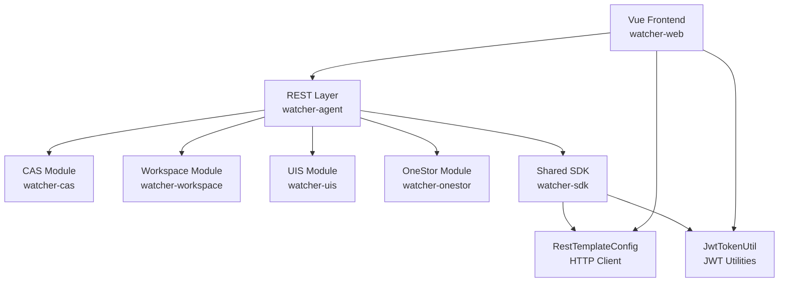
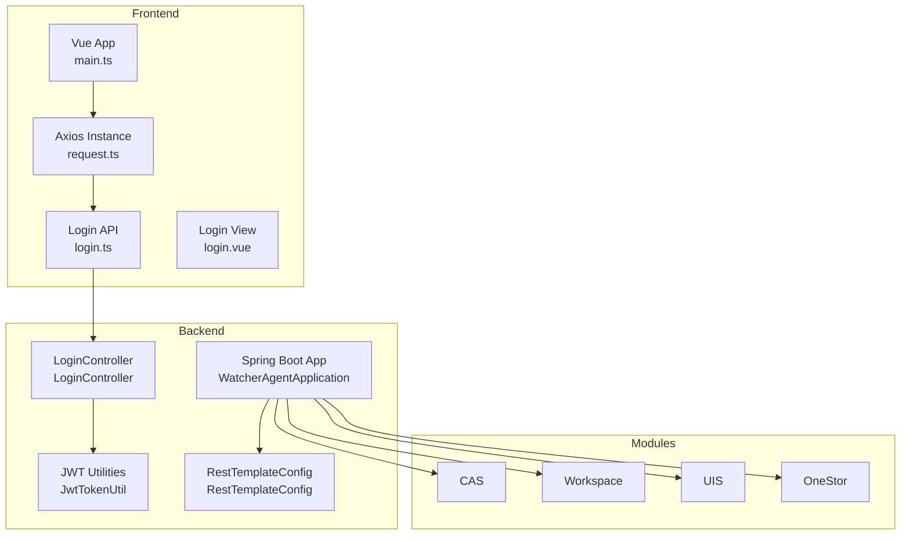
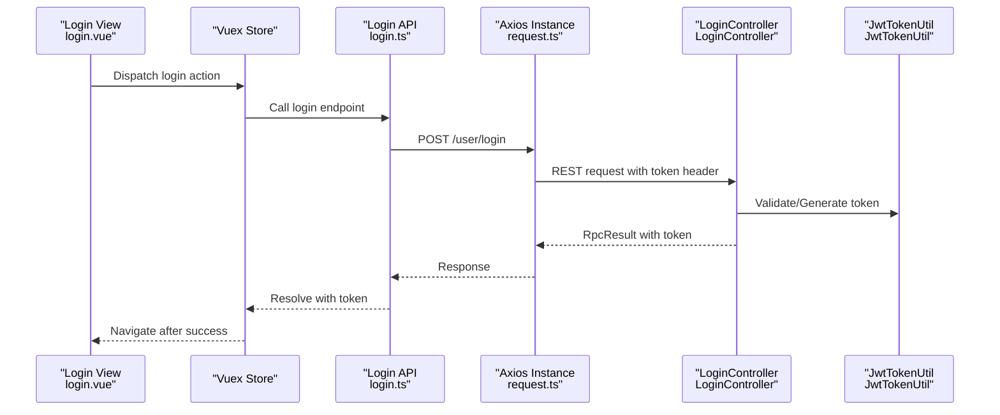
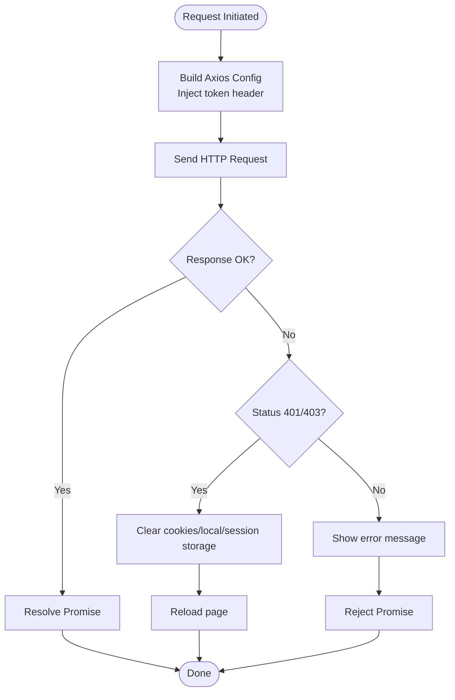
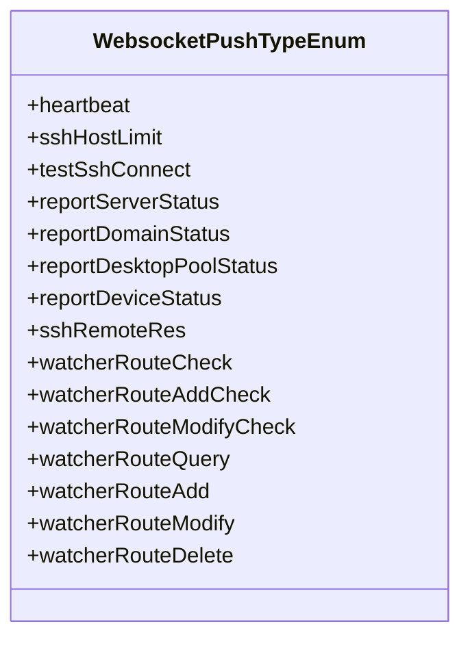
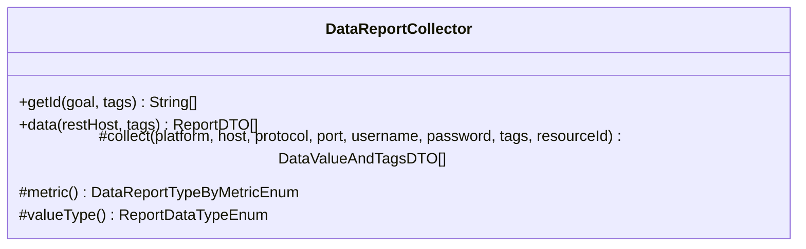
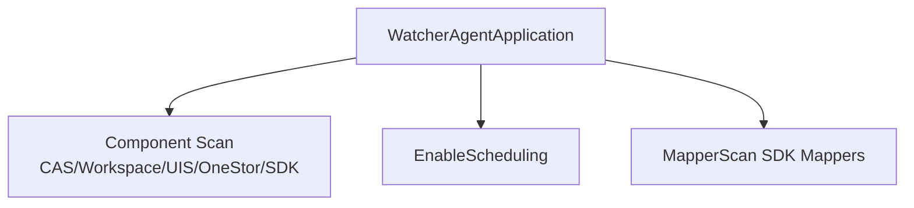
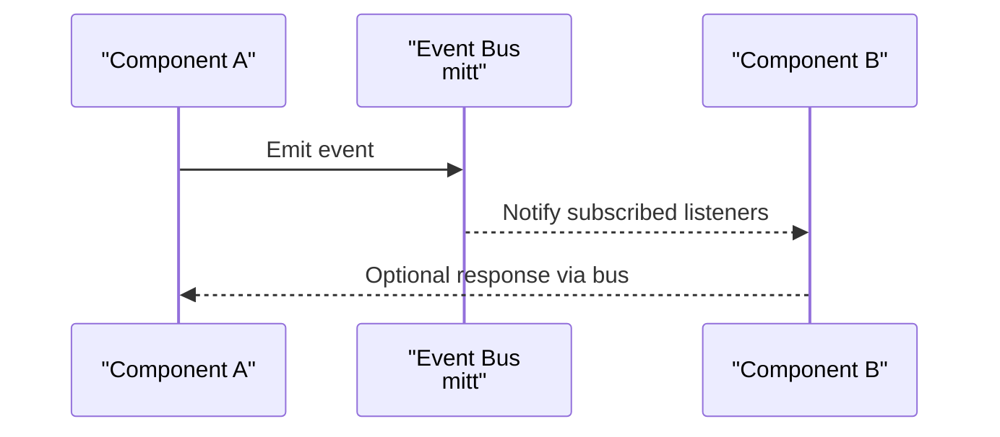
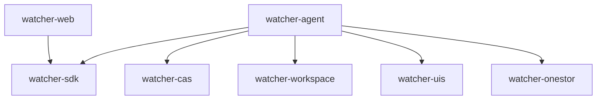

# Component Interactions

<cite>
**Referenced Files in This Document**
- [WatcherAgentApplication.java](file://watcher-agent/src/main/java/com/virtual/cloud/om/agent/WatcherAgentApplication.java)
- [LoginController.java](file://watcher-agent/src/main/java/com/virtual/cloud/om/agent/controller/LoginController.java)
- [JwtTokenUtil.java](file://watcher-sdk/src/main/java/com/virtual/cloud/om/sdk/utils/JwtTokenUtil.java)
- [request.ts](file://watcher-web/src/utils/system/request.ts)
- [login.ts](file://watcher-web/src/api/login/login.ts)
- [login.vue](file://watcher-web/src/views/system/login.vue)
- [RestTemplateConfig.java](file://watcher-sdk/src/main/java/com/virtual/cloud/om/sdk/config/rest/RestTemplateConfig.java)
- [WebsocketMessageDTO.java](file://watcher-agent/src/main/java/com/virtual/cloud/om/agent/dto/WebsocketMessageDTO.java)
- [WebsocketPushTypeEnum.java](file://watcher-sdk/src/main/java/com/virtual/cloud/om/sdk/constant/WebsocketPushTypeEnum.java)
- [DataReportCollector.java](file://watcher-sdk/src/main/java/com/virtual/cloud/om/sdk/api/DataReportCollector.java)
- [main.ts](file://watcher-web/src/main.ts)
</cite>

## Table of Contents
1. [Introduction](#introduction)
2. [Project Structure](#project-structure)
3. [Core Components](#core-components)
4. [Architecture Overview](#architecture-overview)
5. [Detailed Component Analysis](#detailed-component-analysis)
6. [Dependency Analysis](#dependency-analysis)
7. [Performance Considerations](#performance-considerations)
8. [Troubleshooting Guide](#troubleshooting-guide)
9. [Conclusion](#conclusion)
10. [Appendices](#appendices)

## Introduction
This document explains how the ShowTime platform components interact across the frontend, backend, and platform-specific modules. It covers:
- Frontend-backend REST API consumption and authentication using JWT tokens
- Real-time communication via WebSocket push types
- Inter-module collaboration among watcher-agent and platform modules (CAS, Workspace, UIS, OneStor)
- Service-layer interactions, dependency injection, and event-driven mechanisms
- Error propagation, resilience strategies, and graceful degradation
- Plugin architecture enabling extensible integrations

## Project Structure
The platform is organized into modular Spring Boot services and a Vue-based frontend:
- watcher-agent: Spring Boot microservice exposing REST endpoints and managing platform integrations
- watcher-sdk: Shared SDK providing APIs, DTOs, utilities, REST configuration, and constants
- watcher-web: Vue 3 SPA frontend consuming REST APIs and emitting events
- watcher-cas, watcher-onestor, watcher-uis, watcher-workspace: Platform-specific modules integrated via component scanning and shared SDK

**Diagram sources**
- [WatcherAgentApplication.java:14-18](file://watcher-agent/src/main/java/com/virtual/cloud/om/agent/WatcherAgentApplication.java#L14-L18)
- [RestTemplateConfig.java:42-147](file://watcher-sdk/src/main/java/com/virtual/cloud/om/sdk/config/rest/RestTemplateConfig.java#L42-L147)
- [JwtTokenUtil.java:14-88](file://watcher-sdk/src/main/java/com/virtual/cloud/om/sdk/utils/JwtTokenUtil.java#L14-L88)

**Section sources**
- [WatcherAgentApplication.java:14-18](file://watcher-agent/src/main/java/com/virtual/cloud/om/agent/WatcherAgentApplication.java#L14-L18)

## Core Components
- Frontend (Vue): Initializes the app, registers global event bus, integrates routing, stores, and internationalization. It consumes REST endpoints via a configured Axios instance and handles JWT token injection and error responses.
- Backend (Spring Boot): Exposes REST endpoints for authentication and user management, integrates platform modules via component scanning, and provides shared utilities and HTTP client configuration.
- Shared SDK: Provides JWT utilities, REST client configuration, constants (including WebSocket push types), and abstract collectors for data reporting.

Key responsibilities:
- Authentication flow: JWT token generation and validation
- REST consumption: Centralized request/response interceptors and error handling
- Real-time updates: WebSocket push types enumeration
- Data collection: Abstract collector pattern for metrics reporting

**Section sources**
- [main.ts:26-36](file://watcher-web/src/main.ts#L26-L36)
- [request.ts:8-81](file://watcher-web/src/utils/system/request.ts#L8-L81)
- [JwtTokenUtil.java:14-88](file://watcher-sdk/src/main/java/com/virtual/cloud/om/sdk/utils/JwtTokenUtil.java#L14-L88)
- [RestTemplateConfig.java:42-147](file://watcher-sdk/src/main/java/com/virtual/cloud/om/sdk/config/rest/RestTemplateConfig.java#L42-L147)
- [WebsocketPushTypeEnum.java:1-22](file://watcher-sdk/src/main/java/com/virtual/cloud/om/sdk/constant/WebsocketPushTypeEnum.java#L1-L22)
- [DataReportCollector.java:18-118](file://watcher-sdk/src/main/java/com/virtual/cloud/om/sdk/api/DataReportCollector.java#L18-L118)

## Architecture Overview
The system follows a layered architecture:
- Presentation layer: Vue frontend
- API gateway/controller layer: Spring Boot REST controllers
- Service layer: Business logic and cross-module coordination
- Shared layer: SDK providing utilities, HTTP clients, and constants
- Platform modules: CAS, Workspace, UIS, OneStor integrated via component scanning

**Diagram sources**
- [main.ts:26-36](file://watcher-web/src/main.ts#L26-L36)
- [request.ts:8-81](file://watcher-web/src/utils/system/request.ts#L8-L81)
- [login.ts:1-52](file://watcher-web/src/api/login/login.ts#L1-L52)
- [login.vue:139-169](file://watcher-web/src/views/system/login.vue#L139-L169)
- [WatcherAgentApplication.java:14-18](file://watcher-agent/src/main/java/com/virtual/cloud/om/agent/WatcherAgentApplication.java#L14-L18)
- [LoginController.java:18-92](file://watcher-agent/src/main/java/com/virtual/cloud/om/agent/controller/LoginController.java#L18-L92)
- [JwtTokenUtil.java:14-88](file://watcher-sdk/src/main/java/com/virtual/cloud/om/sdk/utils/JwtTokenUtil.java#L14-L88)
- [RestTemplateConfig.java:42-147](file://watcher-sdk/src/main/java/com/virtual/cloud/om/sdk/config/rest/RestTemplateConfig.java#L42-L147)

## Detailed Component Analysis

### Frontend-Backend Authentication Flow
The frontend authenticates users and manages JWT tokens:
- The login view dispatches credentials to the store, which triggers a login API call
- The Axios instance injects the token into outbound requests
- On error responses (e.g., 401/403), the frontend clears session data and reloads

**Diagram sources**
- [login.vue:139-169](file://watcher-web/src/views/system/login.vue#L139-L169)
- [login.ts:1-52](file://watcher-web/src/api/login/login.ts#L1-L52)
- [request.ts:19-22](file://watcher-web/src/utils/system/request.ts#L19-L22)
- [LoginController.java:25-44](file://watcher-agent/src/main/java/com/virtual/cloud/om/agent/controller/LoginController.java#L25-L44)
- [JwtTokenUtil.java:49-57](file://watcher-sdk/src/main/java/com/virtual/cloud/om/sdk/utils/JwtTokenUtil.java#L49-L57)

**Section sources**
- [login.vue:139-169](file://watcher-web/src/views/system/login.vue#L139-L169)
- [login.ts:1-52](file://watcher-web/src/api/login/login.ts#L1-L52)
- [request.ts:19-22](file://watcher-web/src/utils/system/request.ts#L19-L22)
- [LoginController.java:25-44](file://watcher-agent/src/main/java/com/virtual/cloud/om/agent/controller/LoginController.java#L25-L44)
- [JwtTokenUtil.java:49-57](file://watcher-sdk/src/main/java/com/virtual/cloud/om/sdk/utils/JwtTokenUtil.java#L49-L57)

### REST API Consumption and Error Handling
The frontend’s Axios instance:
- Injects the token header for authenticated requests
- Serializes DELETE parameters consistently
- Handles server-side errors and redirects unauthorized users to login

Backend REST configuration:
- Provides a shared HTTP client with connection pooling, retry handling, and error handlers
- Supports both standard and “online” REST templates

**Diagram sources**
- [request.ts:8-81](file://watcher-web/src/utils/system/request.ts#L8-L81)
- [RestTemplateConfig.java:48-101](file://watcher-sdk/src/main/java/com/virtual/cloud/om/sdk/config/rest/RestTemplateConfig.java#L48-L101)

**Section sources**
- [request.ts:8-81](file://watcher-web/src/utils/system/request.ts#L8-L81)
- [RestTemplateConfig.java:48-101](file://watcher-sdk/src/main/java/com/virtual/cloud/om/sdk/config/rest/RestTemplateConfig.java#L48-L101)

### Real-Time Communication via WebSocket Push Types
WebSocket push types define the kinds of real-time events emitted by the backend:
- Heartbeat, SSH limits, SSH connectivity tests, and various platform status reports
- Route-related operations (check, add, modify, delete) for watchers

**Diagram sources**
- [WebsocketPushTypeEnum.java:1-22](file://watcher-sdk/src/main/java/com/virtual/cloud/om/sdk/constant/WebsocketPushTypeEnum.java#L1-L22)

**Section sources**
- [WebsocketPushTypeEnum.java:1-22](file://watcher-sdk/src/main/java/com/virtual/cloud/om/sdk/constant/WebsocketPushTypeEnum.java#L1-L22)

### Data Reporting Collector Pattern
The SDK defines an abstract collector for metrics reporting:
- Accepts platform credentials and tags
- Produces structured report DTOs with timestamps and value types
- Ensures consistent timestamping and empty-value handling

**Diagram sources**
- [DataReportCollector.java:18-118](file://watcher-sdk/src/main/java/com/virtual/cloud/om/sdk/api/DataReportCollector.java#L18-L118)

**Section sources**
- [DataReportCollector.java:18-118](file://watcher-sdk/src/main/java/com/virtual/cloud/om/sdk/api/DataReportCollector.java#L18-L118)

### Inter-Module Communication and Dependency Injection
The watcher-agent bootstraps the application and scans multiple packages:
- Scans CAS, Workspace, UIS, OneStor, and SDK packages
- Enables scheduling and MyBatis mappers

**Diagram sources**
- [WatcherAgentApplication.java:14-18](file://watcher-agent/src/main/java/com/virtual/cloud/om/agent/WatcherAgentApplication.java#L14-L18)

**Section sources**
- [WatcherAgentApplication.java:14-18](file://watcher-agent/src/main/java/com/virtual/cloud/om/agent/WatcherAgentApplication.java#L14-L18)

### Event-Driven Communication Mechanisms
The frontend initializes a global event bus for component-to-component messaging:
- Uses a lightweight event emitter to publish and subscribe to events
- Useful for decoupled UI interactions and cross-component coordination

**Diagram sources**
- [main.ts:27](file://watcher-web/src/main.ts#L27)

**Section sources**
- [main.ts:27](file://watcher-web/src/main.ts#L27)

## Dependency Analysis
Inter-module dependencies and coupling:
- watcher-agent depends on watcher-sdk for shared utilities and HTTP configuration
- watcher-web depends on watcher-sdk indirectly via Axios interceptors and JWT utilities
- Platform modules (CAS, Workspace, UIS, OneStor) are integrated via component scanning in the agent application

**Diagram sources**
- [WatcherAgentApplication.java:14-18](file://watcher-agent/src/main/java/com/virtual/cloud/om/agent/WatcherAgentApplication.java#L14-L18)
- [RestTemplateConfig.java:42-147](file://watcher-sdk/src/main/java/com/virtual/cloud/om/sdk/config/rest/RestTemplateConfig.java#L42-L147)

**Section sources**
- [WatcherAgentApplication.java:14-18](file://watcher-agent/src/main/java/com/virtual/cloud/om/agent/WatcherAgentApplication.java#L14-L18)

## Performance Considerations
- HTTP client tuning: Connection pooling, socket timeouts, and retry policies reduce latency and improve resilience under load
- Token lifecycle: Short-lived tokens with refresh support minimize exposure and enable seamless sessions
- Data collection: Abstract collector ensures consistent timestamping and avoids unnecessary processing for empty datasets
- Frontend responsiveness: Centralized Axios configuration and global event bus reduce boilerplate and improve maintainability

[No sources needed since this section provides general guidance]

## Troubleshooting Guide
Common issues and remedies:
- Authentication failures (401/403): The frontend clears local/session storage and reloads the page to force re-authentication
- Network errors: The SDK’s HTTP client retries transient failures and applies strict error handling
- WebSocket disconnects: Use heartbeat and route operation push types to detect and recover from disconnections

**Section sources**
- [request.ts:50-76](file://watcher-web/src/utils/system/request.ts#L50-L76)
- [RestTemplateConfig.java:81-99](file://watcher-sdk/src/main/java/com/virtual/cloud/om/sdk/config/rest/RestTemplateConfig.java#L81-L99)
- [WebsocketPushTypeEnum.java:1-22](file://watcher-sdk/src/main/java/com/virtual/cloud/om/sdk/constant/WebsocketPushTypeEnum.java#L1-L22)

## Conclusion
The ShowTime platform employs a clean separation of concerns:
- The Vue frontend interacts with REST endpoints and manages JWT tokens
- The Spring Boot agent orchestrates platform modules and exposes a unified API surface
- The SDK centralizes shared utilities, HTTP configuration, and event types
- Abstract collectors and event buses enable extensibility and maintainability

[No sources needed since this section summarizes without analyzing specific files]

## Appendices
- WebSocket message envelope: A simple DTO encapsulates type and data for real-time updates
- Data reporting: The collector pattern ensures consistent metric reporting across platforms

**Section sources**
- [WebsocketMessageDTO.java:1-23](file://watcher-agent/src/main/java/com/virtual/cloud/om/agent/dto/WebsocketMessageDTO.java#L1-L23)
- [DataReportCollector.java:48-86](file://watcher-sdk/src/main/java/com/virtual/cloud/om/sdk/api/DataReportCollector.java#L48-L86)