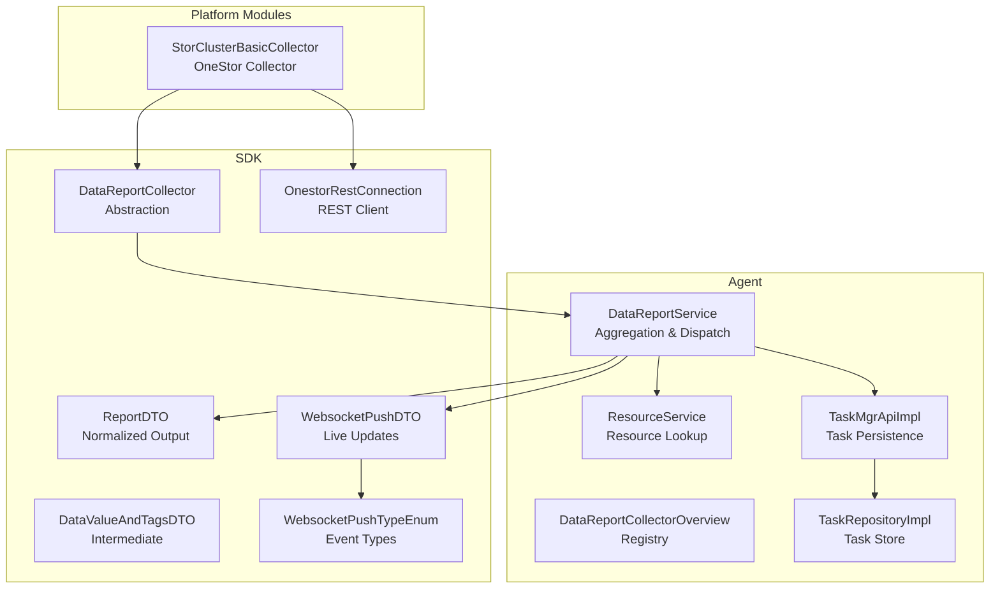
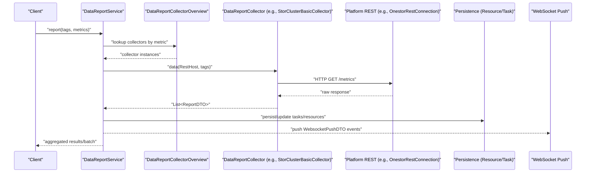
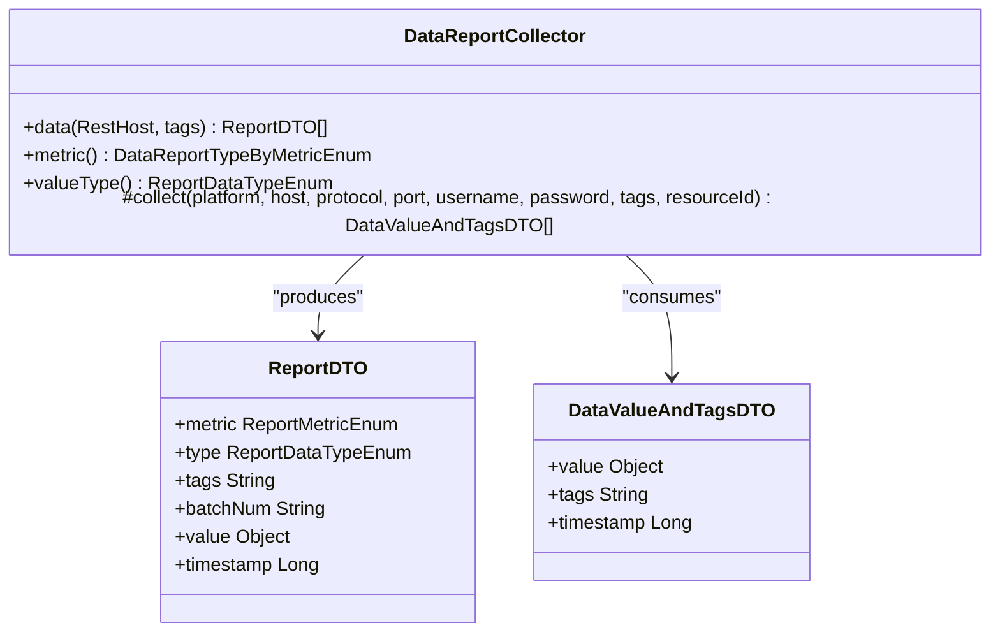
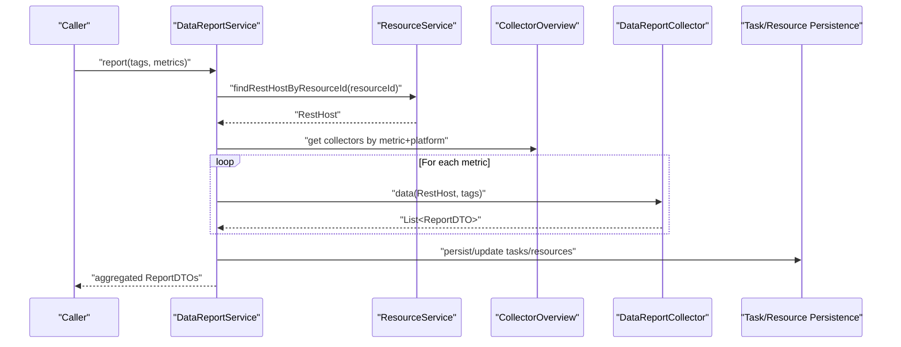
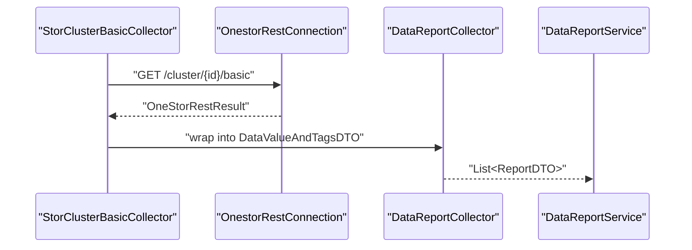
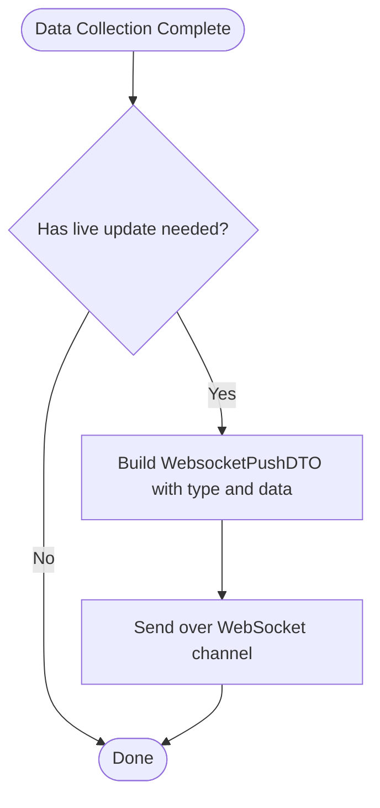
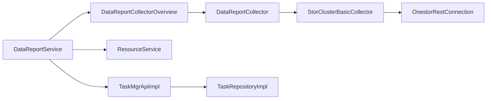

# Data Flow & Processing

<cite>
**Referenced Files in This Document**
- [DataReportCollector.java](file://watcher-sdk/src/main/java/com/virtual/cloud/om/sdk/api/DataReportCollector.java)
- [DataReportService.java](file://watcher-agent/src/main/java/com/virtual/cloud/om/agent/service/report/DataReportService.java)
- [DataReportCollectorOverview.java](file://watcher-agent/src/main/java/com/virtual/cloud/om/agent/service/DataReportCollectorOverview.java)
- [ReportDTO.java](file://watcher-sdk/src/main/java/com/virtual/cloud/om/sdk/dto/dataReport/workspace/ReportDTO.java)
- [DataValueAndTagsDTO.java](file://watcher-sdk/src/main/java/com/virtual/cloud/om/sdk/dto/dataReport/DataValueAndTagsDTO.java)
- [StorClusterBasicCollector.java](file://watcher-onestor/src/main/java/com/virtual/cloud/om/onestor/service/clusterBasic/StorClusterBasicCollector.java)
- [OnestorRestConnection.java](file://watcher-sdk/src/main/java/com/virtual/cloud/om/sdk/config/token/onestor/OnestorRestConnection.java)
- [WebsocketPushDTO.java](file://watcher-sdk/src/main/java/com/virtual/cloud/om/sdk/dto/websocket/WebsocketPushDTO.java)
- [WebsocketPushTypeEnum.java](file://watcher-sdk/src/main/java/com/virtual/cloud/om/sdk/constant/WebsocketPushTypeEnum.java)
- [DataCenterWebcocketUriConstants.java](file://watcher-sdk/src/main/java/com/virtual/cloud/om/sdk/constant/uri/DataCenterWebcocketUriConstants.java)
- [ResourceService.java](file://watcher-agent/src/main/java/com/virtual/cloud/om/agent/service/resource/ResourceService.java)
- [TaskMgrApiImpl.java](file://watcher-agent/src/main/java/com/virtual/cloud/om/agent/service/task/TaskMgrApiImpl.java)
- [TaskRepositoryImpl.java](file://watcher-agent/src/main/java/com/virtual/cloud/om/agent/repository/TaskRepositoryImpl.java)
</cite>

## Table of Contents
1. [Introduction](#introduction)
2. [Project Structure](#project-structure)
3. [Core Components](#core-components)
4. [Architecture Overview](#architecture-overview)
5. [Detailed Component Analysis](#detailed-component-analysis)
6. [Dependency Analysis](#dependency-analysis)
7. [Performance Considerations](#performance-considerations)
8. [Troubleshooting Guide](#troubleshooting-guide)
9. [Conclusion](#conclusion)

## Introduction
This document explains the end-to-end data flow from platform-specific API calls to user visualization. It covers:
- How platform data is collected via the DataReportCollector abstraction
- How collectors transform raw platform responses into normalized ReportDTOs
- How DataReportService orchestrates collection, aggregation, and error reporting
- How WebSocket push channels deliver live updates to clients
- How caching and concurrency strategies optimize performance
- How validation, enrichment, and normalization occur across the pipeline

## Project Structure
The data pipeline spans three primary areas:
- SDK: Abstractions, DTOs, constants, and REST connections
- Agent: Orchestrator services and resource/task persistence
- Platform Modules: Platform-specific collectors and handlers

**Diagram sources**
- [DataReportCollector.java:1-118](file://watcher-sdk/src/main/java/com/virtual/cloud/om/sdk/api/DataReportCollector.java#L1-L118)
- [DataReportService.java:1-327](file://watcher-agent/src/main/java/com/virtual/cloud/om/agent/service/report/DataReportService.java#L1-L327)
- [DataReportCollectorOverview.java:1-45](file://watcher-agent/src/main/java/com/virtual/cloud/om/agent/service/DataReportCollectorOverview.java#L1-L45)
- [ReportDTO.java:1-25](file://watcher-sdk/src/main/java/com/virtual/cloud/om/sdk/dto/dataReport/workspace/ReportDTO.java#L1-L25)
- [DataValueAndTagsDTO.java:1-17](file://watcher-sdk/src/main/java/com/virtual/cloud/om/sdk/dto/dataReport/DataValueAndTagsDTO.java#L1-L17)
- [StorClusterBasicCollector.java:1-77](file://watcher-onestor/src/main/java/com/virtual/cloud/om/onestor/service/clusterBasic/StorClusterBasicCollector.java#L1-L77)
- [OnestorRestConnection.java:30-63](file://watcher-sdk/src/main/java/com/virtual/cloud/om/sdk/config/token/onestor/OnestorRestConnection.java#L30-L63)
- [WebsocketPushDTO.java:1-13](file://watcher-sdk/src/main/java/com/virtual/cloud/om/sdk/dto/websocket/WebsocketPushDTO.java#L1-L13)
- [WebsocketPushTypeEnum.java:1-21](file://watcher-sdk/src/main/java/com/virtual/cloud/om/sdk/constant/WebsocketPushTypeEnum.java#L1-L21)
- [ResourceService.java:34-51](file://watcher-agent/src/main/java/com/virtual/cloud/om/agent/service/resource/ResourceService.java#L34-L51)
- [TaskMgrApiImpl.java:1-164](file://watcher-agent/src/main/java/com/virtual/cloud/om/agent/service/task/TaskMgrApiImpl.java#L1-L164)
- [TaskRepositoryImpl.java:1-52](file://watcher-agent/src/main/java/com/virtual/cloud/om/agent/repository/TaskRepositoryImpl.java#L1-L52)

**Section sources**
- [DataReportCollector.java:1-118](file://watcher-sdk/src/main/java/com/virtual/cloud/om/sdk/api/DataReportCollector.java#L1-L118)
- [DataReportService.java:1-327](file://watcher-agent/src/main/java/com/virtual/cloud/om/agent/service/report/DataReportService.java#L1-L327)
- [StorClusterBasicCollector.java:1-77](file://watcher-onestor/src/main/java/com/virtual/cloud/om/onestor/service/clusterBasic/StorClusterBasicCollector.java#L1-L77)
- [OnestorRestConnection.java:30-63](file://watcher-sdk/src/main/java/com/virtual/cloud/om/sdk/config/token/onestor/OnestorRestConnection.java#L30-L63)
- [WebsocketPushDTO.java:1-13](file://watcher-sdk/src/main/java/com/virtual/cloud/om/sdk/dto/websocket/WebsocketPushDTO.java#L1-L13)
- [WebsocketPushTypeEnum.java:1-21](file://watcher-sdk/src/main/java/com/virtual/cloud/om/sdk/constant/WebsocketPushTypeEnum.java#L1-L21)
- [DataCenterWebcocketUriConstants.java:1-13](file://watcher-sdk/src/main/java/com/virtual/cloud/om/sdk/constant/uri/DataCenterWebcocketUriConstants.java#L1-L13)
- [ResourceService.java:34-51](file://watcher-agent/src/main/java/com/virtual/cloud/om/agent/service/resource/ResourceService.java#L34-L51)
- [TaskMgrApiImpl.java:1-164](file://watcher-agent/src/main/java/com/virtual/cloud/om/agent/service/task/TaskMgrApiImpl.java#L1-L164)
- [TaskRepositoryImpl.java:1-52](file://watcher-agent/src/main/java/com/virtual/cloud/om/agent/repository/TaskRepositoryImpl.java#L1-L52)

## Core Components
- DataReportCollector: Abstract base for platform-specific collectors. It normalizes raw data into ReportDTOs and ensures timestamps are set consistently.
- DataReportService: Orchestrates collection across metrics and platforms, aggregates results, handles concurrency, and reports errors.
- Collector Registry: DataReportCollectorOverview registers and retrieves collectors by metric.
- Platform Collector Example: StorClusterBasicCollector demonstrates fetching platform metrics via REST and returning DataValueAndTagsDTO.
- WebSocket Push: WebsocketPushDTO encapsulates live event payloads; WebsocketPushTypeEnum enumerates event categories.
- Resource and Task Persistence: ResourceService resolves platform hosts; TaskMgrApiImpl and TaskRepositoryImpl manage task lifecycle.

**Section sources**
- [DataReportCollector.java:48-86](file://watcher-sdk/src/main/java/com/virtual/cloud/om/sdk/api/DataReportCollector.java#L48-L86)
- [DataReportService.java:115-140](file://watcher-agent/src/main/java/com/virtual/cloud/om/agent/service/report/DataReportService.java#L115-L140)
- [DataReportCollectorOverview.java:22-45](file://watcher-agent/src/main/java/com/virtual/cloud/om/agent/service/DataReportCollectorOverview.java#L22-L45)
- [StorClusterBasicCollector.java:33-77](file://watcher-onestor/src/main/java/com/virtual/cloud/om/onestor/service/clusterBasic/StorClusterBasicCollector.java#L33-L77)
- [WebsocketPushDTO.java:1-13](file://watcher-sdk/src/main/java/com/virtual/cloud/om/sdk/dto/websocket/WebsocketPushDTO.java#L1-L13)
- [WebsocketPushTypeEnum.java:1-21](file://watcher-sdk/src/main/java/com/virtual/cloud/om/sdk/constant/WebsocketPushTypeEnum.java#L1-L21)
- [ResourceService.java:34-51](file://watcher-agent/src/main/java/com/virtual/cloud/om/agent/service/resource/ResourceService.java#L34-L51)
- [TaskMgrApiImpl.java:75-115](file://watcher-agent/src/main/java/com/virtual/cloud/om/agent/service/task/TaskMgrApiImpl.java#L75-L115)
- [TaskRepositoryImpl.java:21-52](file://watcher-agent/src/main/java/com/virtual/cloud/om/agent/repository/TaskRepositoryImpl.java#L21-L52)

## Architecture Overview
The pipeline follows a layered design:
- Platform API Layer: Collectors query platform endpoints and return structured data.
- Normalization Layer: Collectors convert raw responses into DataValueAndTagsDTO, then into ReportDTO.
- Aggregation Layer: DataReportService dispatches collectors per metric/platform, merges results, and sets batch metadata.
- Persistence/Dispatch Layer: Results are persisted or forwarded; errors are reported; live updates are pushed via WebSocket.

**Diagram sources**
- [DataReportService.java:115-140](file://watcher-agent/src/main/java/com/virtual/cloud/om/agent/service/report/DataReportService.java#L115-L140)
- [DataReportCollectorOverview.java:22-45](file://watcher-agent/src/main/java/com/virtual/cloud/om/agent/service/DataReportCollectorOverview.java#L22-L45)
- [DataReportCollector.java:48-86](file://watcher-sdk/src/main/java/com/virtual/cloud/om/sdk/api/DataReportCollector.java#L48-L86)
- [StorClusterBasicCollector.java:33-77](file://watcher-onestor/src/main/java/com/virtual/cloud/om/onestor/service/clusterBasic/StorClusterBasicCollector.java#L33-L77)
- [OnestorRestConnection.java:30-63](file://watcher-sdk/src/main/java/com/virtual/cloud/om/sdk/config/token/onestor/OnestorRestConnection.java#L30-L63)
- [WebsocketPushDTO.java:1-13](file://watcher-sdk/src/main/java/com/virtual/cloud/om/sdk/dto/websocket/WebsocketPushDTO.java#L1-L13)

## Detailed Component Analysis

### DataReportCollector Abstraction
- Purpose: Define the contract for collecting platform metrics and normalizing them into ReportDTOs.
- Key responsibilities:
  - Parse tags to extract identifiers
  - Invoke platform-specific collect(...) method
  - Convert DataValueAndTagsDTO to ReportDTO
  - Normalize missing timestamps to collection time
- Validation and normalization:
  - Empty collections produce empty-value ReportDTO entries
  - Timestamps are ensured present post-collection

**Diagram sources**
- [DataReportCollector.java:19-118](file://watcher-sdk/src/main/java/com/virtual/cloud/om/sdk/api/DataReportCollector.java#L19-L118)
- [ReportDTO.java:1-25](file://watcher-sdk/src/main/java/com/virtual/cloud/om/sdk/dto/dataReport/workspace/ReportDTO.java#L1-L25)
- [DataValueAndTagsDTO.java:1-17](file://watcher-sdk/src/main/java/com/virtual/cloud/om/sdk/dto/dataReport/DataValueAndTagsDTO.java#L1-L17)

**Section sources**
- [DataReportCollector.java:48-86](file://watcher-sdk/src/main/java/com/virtual/cloud/om/sdk/api/DataReportCollector.java#L48-L86)

### DataReportService Orchestration
- Responsibilities:
  - Resolve platform/host from resourceId
  - Determine metric types per platform
  - Launch parallel collector invocations
  - Aggregate results and attach batch number
  - Handle static vs. dynamic metrics with locks
  - Report errors and persist tasks/resources
- Concurrency and performance:
  - Uses CompletableFuture to parallelize metric collection
  - Batch number derived from minute granularity for grouping
- Error handling:
  - Catches AppException and records errors
  - Logs trace IDs for correlation

**Diagram sources**
- [DataReportService.java:115-140](file://watcher-agent/src/main/java/com/virtual/cloud/om/agent/service/report/DataReportService.java#L115-L140)
- [DataReportService.java:159-223](file://watcher-agent/src/main/java/com/virtual/cloud/om/agent/service/report/DataReportService.java#L159-L223)
- [ResourceService.java:34-51](file://watcher-agent/src/main/java/com/virtual/cloud/om/agent/service/resource/ResourceService.java#L34-L51)
- [DataReportCollectorOverview.java:22-45](file://watcher-agent/src/main/java/com/virtual/cloud/om/agent/service/DataReportCollectorOverview.java#L22-L45)

**Section sources**
- [DataReportService.java:115-140](file://watcher-agent/src/main/java/com/virtual/cloud/om/agent/service/report/DataReportService.java#L115-L140)
- [DataReportService.java:159-223](file://watcher-agent/src/main/java/com/virtual/cloud/om/agent/service/report/DataReportService.java#L159-L223)
- [DataReportService.java:228-289](file://watcher-agent/src/main/java/com/virtual/cloud/om/agent/service/report/DataReportService.java#L228-L289)

### Platform-Specific Collector Example: StorClusterBasicCollector
- Role: Fetch cluster-level metrics from OneStor and normalize into ReportDTO.
- Flow:
  - Extract cluster ID from tags
  - Call REST endpoint via OnestorRestConnection
  - Build DataValueAndTagsDTO with tags and timestamp
  - Return as single-element list for downstream conversion

**Diagram sources**
- [StorClusterBasicCollector.java:33-77](file://watcher-onestor/src/main/java/com/virtual/cloud/om/onestor/service/clusterBasic/StorClusterBasicCollector.java#L33-L77)
- [OnestorRestConnection.java:30-63](file://watcher-sdk/src/main/java/com/virtual/cloud/om/sdk/config/token/onestor/OnestorRestConnection.java#L30-L63)
- [DataReportCollector.java:48-86](file://watcher-sdk/src/main/java/com/virtual/cloud/om/sdk/api/DataReportCollector.java#L48-L86)

**Section sources**
- [StorClusterBasicCollector.java:33-77](file://watcher-onestor/src/main/java/com/virtual/cloud/om/onestor/service/clusterBasic/StorClusterBasicCollector.java#L33-L77)
- [OnestorRestConnection.java:30-63](file://watcher-sdk/src/main/java/com/virtual/cloud/om/sdk/config/token/onestor/OnestorRestConnection.java#L30-L63)

### Real-Time Processing and WebSocket Live Updates
- Event model:
  - WebsocketPushDTO carries a type and payload
  - WebsocketPushTypeEnum enumerates supported event categories
- WebSocket endpoints:
  - DataCenterWebcocketUriConstants defines WebSocket URIs for central data center communication
- Typical flow:
  - After successful data collection, DataReportService may trigger push events via WebSocket channels for live dashboards

**Section sources**
- [WebsocketPushDTO.java:1-13](file://watcher-sdk/src/main/java/com/virtual/cloud/om/sdk/dto/websocket/WebsocketPushDTO.java#L1-L13)
- [WebsocketPushTypeEnum.java:1-21](file://watcher-sdk/src/main/java/com/virtual/cloud/om/sdk/constant/WebsocketPushTypeEnum.java#L1-L21)
- [DataCenterWebcocketUriConstants.java:1-13](file://watcher-sdk/src/main/java/com/virtual/cloud/om/sdk/constant/uri/DataCenterWebcocketUriConstants.java#L1-L13)

### Data Validation, Enrichment, and Normalization
- Validation:
  - Missing resourceId in tags triggers an error
  - Null platform resolved from RestHost leads to early exit
- Enrichment:
  - Tags propagated to ReportDTO for resource tagging
  - Batch number attached for time-bucketing
- Normalization:
  - Missing timestamps filled with collection time
  - Empty results represented as empty-value ReportDTO entries

**Section sources**
- [DataReportService.java:115-140](file://watcher-agent/src/main/java/com/virtual/cloud/om/agent/service/report/DataReportService.java#L115-L140)
- [DataReportCollector.java:48-86](file://watcher-sdk/src/main/java/com/virtual/cloud/om/sdk/api/DataReportCollector.java#L48-L86)

### Caching Strategies
- REST client caching:
  - OnestorRestConnection maintains an in-memory token cache keyed by resource and host to reduce repeated authentication overhead
- Benefits:
  - Reduces latency for repeated requests
  - Mitigates rate limits by avoiding redundant token acquisition

**Section sources**
- [OnestorRestConnection.java:30-63](file://watcher-sdk/src/main/java/com/virtual/cloud/om/sdk/config/token/onestor/OnestorRestConnection.java#L30-L63)

## Dependency Analysis
- Collector registry:
  - DataReportCollectorOverview builds a map from metric to collector instance for fast lookup
- Service dependencies:
  - DataReportService depends on ResourceService for host resolution, TaskMgrApiImpl/TaskRepositoryImpl for task persistence, and collector instances
- Platform collectors depend on REST connections and DTOs defined in SDK

**Diagram sources**
- [DataReportCollectorOverview.java:22-45](file://watcher-agent/src/main/java/com/virtual/cloud/om/agent/service/DataReportCollectorOverview.java#L22-L45)
- [DataReportService.java:1-327](file://watcher-agent/src/main/java/com/virtual/cloud/om/agent/service/report/DataReportService.java#L1-L327)
- [ResourceService.java:34-51](file://watcher-agent/src/main/java/com/virtual/cloud/om/agent/service/resource/ResourceService.java#L34-L51)
- [TaskMgrApiImpl.java:1-164](file://watcher-agent/src/main/java/com/virtual/cloud/om/agent/service/task/TaskMgrApiImpl.java#L1-L164)
- [TaskRepositoryImpl.java:1-52](file://watcher-agent/src/main/java/com/virtual/cloud/om/agent/repository/TaskRepositoryImpl.java#L1-L52)
- [StorClusterBasicCollector.java:1-77](file://watcher-onestor/src/main/java/com/virtual/cloud/om/onestor/service/clusterBasic/StorClusterBasicCollector.java#L1-L77)
- [OnestorRestConnection.java:30-63](file://watcher-sdk/src/main/java/com/virtual/cloud/om/sdk/config/token/onestor/OnestorRestConnection.java#L30-L63)

**Section sources**
- [DataReportCollectorOverview.java:22-45](file://watcher-agent/src/main/java/com/virtual/cloud/om/agent/service/DataReportCollectorOverview.java#L22-L45)
- [DataReportService.java:1-327](file://watcher-agent/src/main/java/com/virtual/cloud/om/agent/service/report/DataReportService.java#L1-L327)
- [StorClusterBasicCollector.java:1-77](file://watcher-onestor/src/main/java/com/virtual/cloud/om/onestor/service/clusterBasic/StorClusterBasicCollector.java#L1-L77)

## Performance Considerations
- Parallelism:
  - CompletableFuture-based parallel collection reduces end-to-end latency for multi-metric batches
- Batching:
  - Minute-granularity batch numbers enable efficient downstream aggregation and querying
- Caching:
  - In-memory token cache minimizes repeated authentication and improves throughput
- Static vs. Dynamic Metrics:
  - Static metrics are guarded by distributed locks to avoid overlapping runs

[No sources needed since this section provides general guidance]

## Troubleshooting Guide
- Missing resourceId in tags:
  - Symptom: Immediate error during report invocation
  - Action: Ensure tags include a valid resourceId
- Null platform resolution:
  - Symptom: Early exit with no metrics
  - Action: Verify resource mapping and platform configuration
- Collector lookup failures:
  - Symptom: Missing collector for a given metric/platform combination
  - Action: Confirm metric registration and platform support
- REST failures:
  - Symptom: Empty results from collectors
  - Action: Check platform connectivity and credentials; inspect REST client cache behavior
- WebSocket delivery:
  - Symptom: Live updates not received
  - Action: Verify WebSocket URI constants and push event types

**Section sources**
- [DataReportService.java:115-140](file://watcher-agent/src/main/java/com/virtual/cloud/om/agent/service/report/DataReportService.java#L115-L140)
- [DataReportService.java:228-289](file://watcher-agent/src/main/java/com/virtual/cloud/om/agent/service/report/DataReportService.java#L228-L289)
- [DataReportCollectorOverview.java:22-45](file://watcher-agent/src/main/java/com/virtual/cloud/om/agent/service/DataReportCollectorOverview.java#L22-L45)
- [OnestorRestConnection.java:30-63](file://watcher-sdk/src/main/java/com/virtual/cloud/om/sdk/config/token/onestor/OnestorRestConnection.java#L30-L63)
- [DataCenterWebcocketUriConstants.java:1-13](file://watcher-sdk/src/main/java/com/virtual/cloud/om/sdk/constant/uri/DataCenterWebcocketUriConstants.java#L1-L13)

## Conclusion
The data pipeline integrates platform-specific collectors with a robust orchestration layer, ensuring reliable, normalized, and timely delivery of metrics. Parallel execution, batching, and caching optimize performance, while strict validation and error reporting improve reliability. WebSocket push enables real-time visualization, completing the journey from platform APIs to user dashboards.