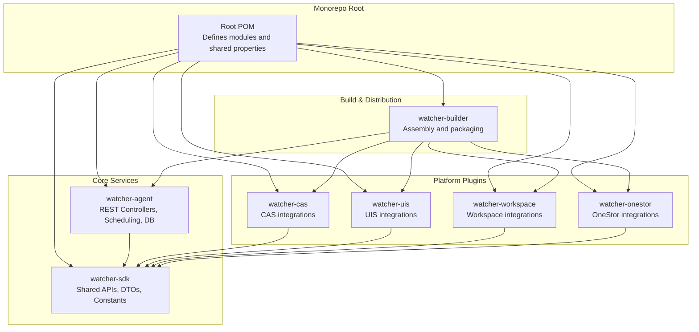
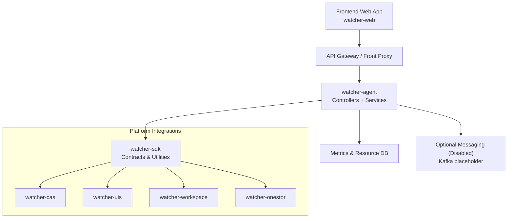
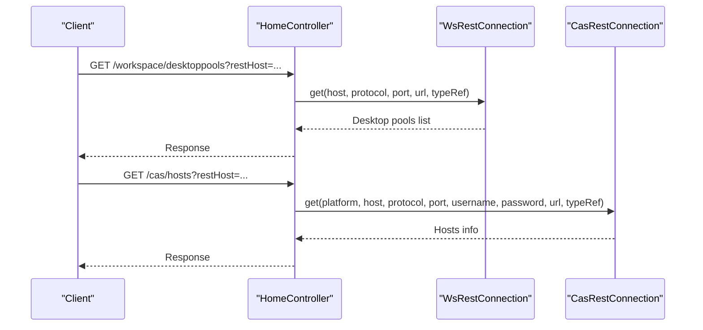
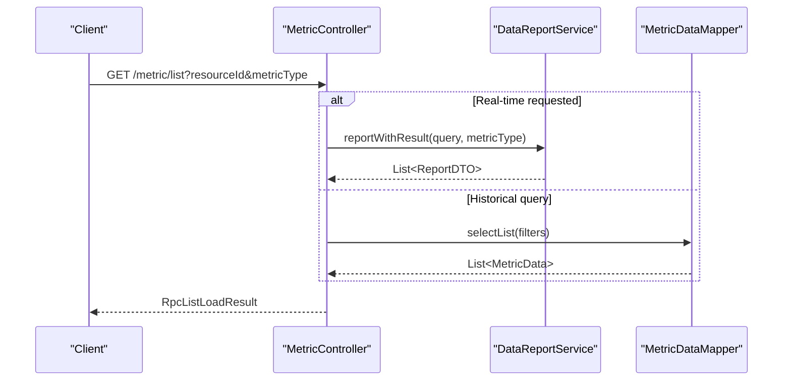
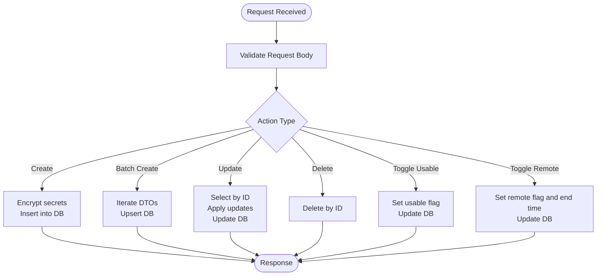
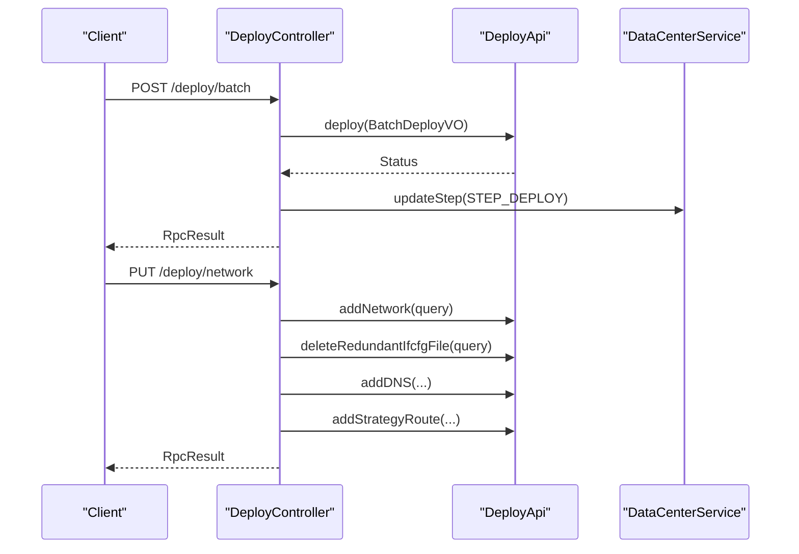
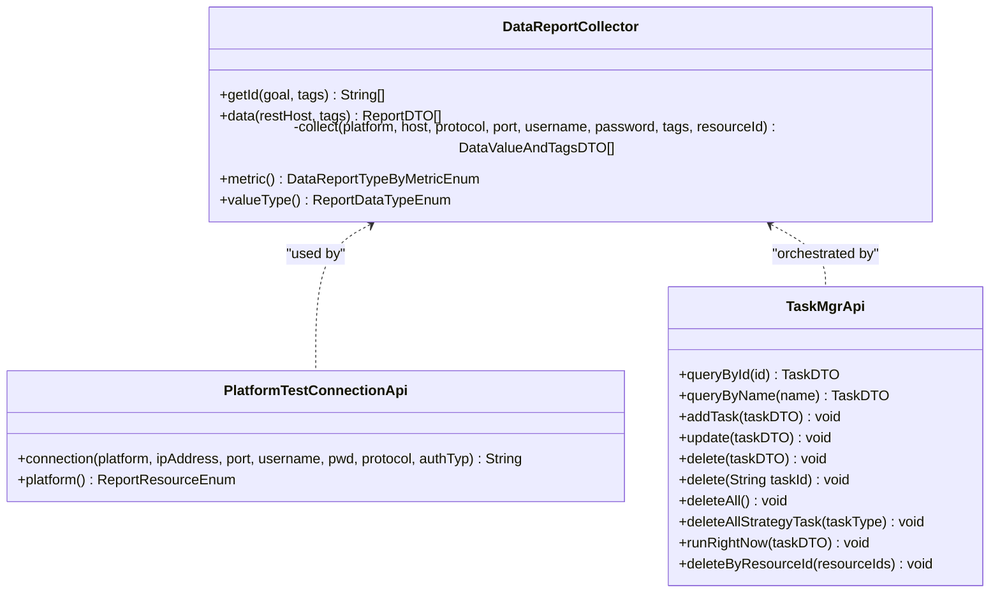
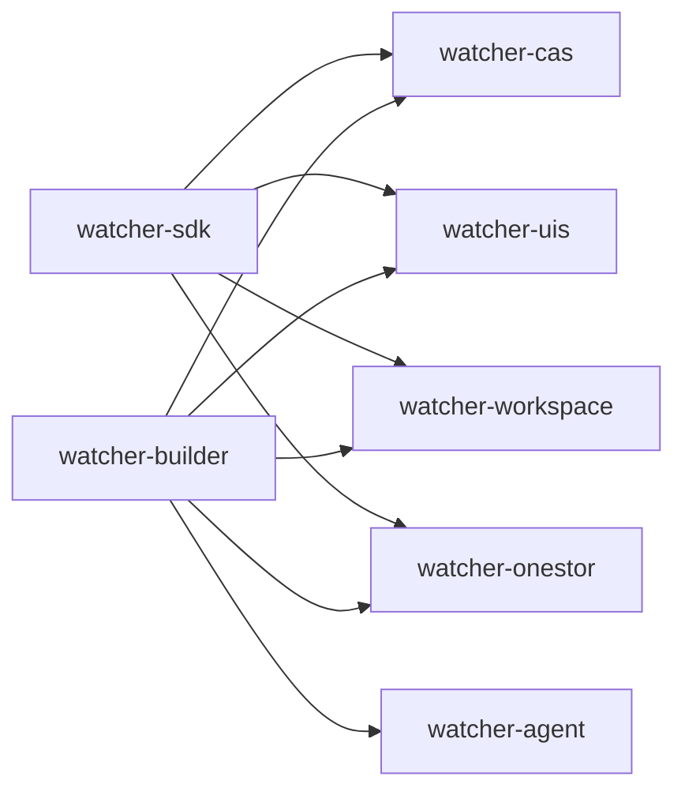
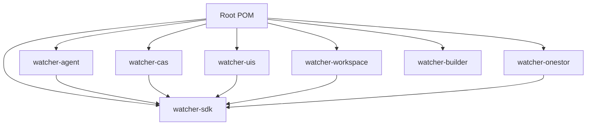

# System Design

<cite>
**Referenced Files in This Document**
- [pom.xml](file://pom.xml)
- [watcher-agent/src/main/java/com/virtual/cloud/om/agent/WatcherAgentApplication.java](file://watcher-agent/src/main/java/com/virtual/cloud/om/agent/WatcherAgentApplication.java)
- [watcher-agent/src/main/java/com/virtual/cloud/om/agent/controller/HomeController.java](file://watcher-agent/src/main/java/com/virtual/cloud/om/agent/controller/HomeController.java)
- [watcher-agent/src/main/java/com/virtual/cloud/om/agent/controller/MetricController.java](file://watcher-agent/src/main/java/com/virtual/cloud/om/agent/controller/MetricController.java)
- [watcher-agent/src/main/java/com/virtual/cloud/om/agent/controller/ResourceController.java](file://watcher-agent/src/main/java/com/virtual/cloud/om/agent/controller/ResourceController.java)
- [watcher-agent/src/main/java/com/virtual/cloud/om/agent/controller/DeployController.java](file://watcher-agent/src/main/java/com/virtual/cloud/om/agent/controller/DeployController.java)
- [watcher-agent/src/main/java/com/virtual/cloud/om/agent/controller/CollectController.java](file://watcher-agent/src/main/java/com/virtual/cloud/om/agent/controller/CollectController.java)
- [watcher-sdk/src/main/java/com/virtual/cloud/om/sdk/api/DataReportCollector.java](file://watcher-sdk/src/main/java/com/virtual/cloud/om/sdk/api/DataReportCollector.java)
- [watcher-sdk/src/main/java/com/virtual/cloud/om/sdk/api/PlatformTestConnectionApi.java](file://watcher-sdk/src/main/java/com/virtual/cloud/om/sdk/api/PlatformTestConnectionApi.java)
- [watcher-sdk/src/main/java/com/virtual/cloud/om/sdk/api/TaskMgrApi.java](file://watcher-sdk/src/main/java/com/virtual/cloud/om/sdk/api/TaskMgrApi.java)
- [watcher-cas/pom.xml](file://watcher-cas/pom.xml)
- [watcher-uis/pom.xml](file://watcher-uis/pom.xml)
- [watcher-workspace/pom.xml](file://watcher-workspace/pom.xml)
- [watcher-onestor/pom.xml](file://watcher-onestor/pom.xml)
- [watcher-builder/pom.xml](file://watcher-builder/pom.xml)
</cite>

## Table of Contents
1. [Introduction](#introduction)
2. [Project Structure](#project-structure)
3. [Core Components](#core-components)
4. [Architecture Overview](#architecture-overview)
5. [Detailed Component Analysis](#detailed-component-analysis)
6. [Dependency Analysis](#dependency-analysis)
7. [Performance Considerations](#performance-considerations)
8. [Troubleshooting Guide](#troubleshooting-guide)
9. [Conclusion](#conclusion)

## Introduction
This document describes the system design of the ShowTime monitoring platform. The platform is organized as a Maven monorepo with a centralized watcher-agent acting as the core orchestrator. It exposes REST APIs for deployment, resource management, metrics, and collection, while integrating with platform-specific modules via a plugin-based SDK. The system follows a layered architecture separating presentation (controllers), business logic (services), and data access (mappers and repositories). It supports modular integrations for CAS, Workspace, UIS, and OneStor systems, enabling scalable and distributed processing patterns.

## Project Structure
The repository is a multi-module Maven project with the following primary modules:
- watcher-agent: Central orchestrator exposing REST endpoints and coordinating tasks.
- watcher-sdk: Shared SDK defining APIs, DTOs, constants, and utilities used across platform modules.
- watcher-cas, watcher-uis, watcher-workspace, watcher-onestor: Platform-specific plugins implementing integrations and collectors.
- watcher-builder: Build module packaging the agent and plugins for distribution.

**Diagram sources**
- [pom.xml:11-20](file://pom.xml#L11-L20)
- [watcher-builder/pom.xml:15-212](file://watcher-builder/pom.xml#L15-L212)

**Section sources**
- [pom.xml:11-20](file://pom.xml#L11-L20)
- [watcher-builder/pom.xml:15-212](file://watcher-builder/pom.xml#L15-L212)

## Core Components
- Central Agent Application: Bootstraps the Spring Boot application, enables scheduling, and scans packages for CAS, SDK, UIS, Workspace, and OneStor modules.
- REST Controllers: Expose endpoints for deployment orchestration, resource management, metrics queries, and collection demos.
- SDK Layer: Defines collector abstractions, platform test connection interfaces, and task management APIs used by plugins and the agent.
- Platform Modules: Implement platform-specific integrations and collectors extending the SDK abstractions.

Key responsibilities:
- watcher-agent: Orchestration, scheduling, persistence, and external platform communication.
- watcher-sdk: Cross-cutting contracts and utilities for data reporting, authentication, and task management.
- watcher-*: Platform-specific implementations and handlers.

**Section sources**
- [watcher-agent/src/main/java/com/virtual/cloud/om/agent/WatcherAgentApplication.java:14-19](file://watcher-agent/src/main/java/com/virtual/cloud/om/agent/WatcherAgentApplication.java#L14-L19)
- [watcher-agent/src/main/java/com/virtual/cloud/om/agent/controller/DeployController.java:32-36](file://watcher-agent/src/main/java/com/virtual/cloud/om/agent/controller/DeployController.java#L32-L36)
- [watcher-agent/src/main/java/com/virtual/cloud/om/agent/controller/ResourceController.java:24-29](file://watcher-agent/src/main/java/com/virtual/cloud/om/agent/controller/ResourceController.java#L24-L29)
- [watcher-agent/src/main/java/com/virtual/cloud/om/agent/controller/MetricController.java:30-35](file://watcher-agent/src/main/java/com/virtual/cloud/om/agent/controller/MetricController.java#L30-L35)
- [watcher-sdk/src/main/java/com/virtual/cloud/om/sdk/api/DataReportCollector.java:18-19](file://watcher-sdk/src/main/java/com/virtual/cloud/om/sdk/api/DataReportCollector.java#L18-L19)
- [watcher-sdk/src/main/java/com/virtual/cloud/om/sdk/api/PlatformTestConnectionApi.java:5-28](file://watcher-sdk/src/main/java/com/virtual/cloud/om/sdk/api/PlatformTestConnectionApi.java#L5-L28)
- [watcher-sdk/src/main/java/com/virtual/cloud/om/sdk/api/TaskMgrApi.java:10-44](file://watcher-sdk/src/main/java/com/virtual/cloud/om/sdk/api/TaskMgrApi.java#L10-L44)

## Architecture Overview
The system employs a layered architecture:
- Presentation Layer: REST controllers expose endpoints for deployment, resource management, metrics, and collection.
- Business Logic Layer: Services coordinate tasks, manage resources, and orchestrate platform integrations.
- Data Layer: MyBatis mappers and repositories persist and query metrics and resource metadata.

The central agent communicates with platform-specific modules through SDK-defined interfaces and plugin implementations. The build module packages the agent and plugins for deployment.

**Diagram sources**
- [watcher-agent/src/main/java/com/virtual/cloud/om/agent/controller/HomeController.java:24-50](file://watcher-agent/src/main/java/com/virtual/cloud/om/agent/controller/HomeController.java#L24-L50)
- [watcher-agent/src/main/java/com/virtual/cloud/om/agent/controller/MetricController.java:30-44](file://watcher-agent/src/main/java/com/virtual/cloud/om/agent/controller/MetricController.java#L30-L44)
- [watcher-agent/src/main/java/com/virtual/cloud/om/agent/controller/ResourceController.java:24-32](file://watcher-agent/src/main/java/com/virtual/cloud/om/agent/controller/ResourceController.java#L24-L32)
- [watcher-sdk/src/main/java/com/virtual/cloud/om/sdk/api/DataReportCollector.java:18-19](file://watcher-sdk/src/main/java/com/virtual/cloud/om/sdk/api/DataReportCollector.java#L18-L19)

## Detailed Component Analysis

### Central Agent Orchestration
The central agent initializes the Spring Boot application and enables scheduling. It scans multiple packages to integrate platform modules and SDK components. Controllers expose endpoints for:
- Deployment orchestration and node/network management
- Resource lifecycle management
- Metrics retrieval and reporting
- Collection demos and real-time log strategies

**Diagram sources**
- [watcher-agent/src/main/java/com/virtual/cloud/om/agent/controller/HomeController.java:52-65](file://watcher-agent/src/main/java/com/virtual/cloud/om/agent/controller/HomeController.java#L52-L65)

**Section sources**
- [watcher-agent/src/main/java/com/virtual/cloud/om/agent/WatcherAgentApplication.java:14-19](file://watcher-agent/src/main/java/com/virtual/cloud/om/agent/WatcherAgentApplication.java#L14-L19)
- [watcher-agent/src/main/java/com/virtual/cloud/om/agent/controller/HomeController.java:24-98](file://watcher-agent/src/main/java/com/virtual/cloud/om/agent/controller/HomeController.java#L24-L98)

### Metrics Management
The metrics controller provides:
- Enumeration of supported metric types and platforms
- Listing metrics with filters and pagination
- Latest metrics per resource
- Trend queries over time windows
- Reporting new metrics into the database

**Diagram sources**
- [watcher-agent/src/main/java/com/virtual/cloud/om/agent/controller/MetricController.java:77-161](file://watcher-agent/src/main/java/com/virtual/cloud/om/agent/controller/MetricController.java#L77-L161)

**Section sources**
- [watcher-agent/src/main/java/com/virtual/cloud/om/agent/controller/MetricController.java:30-271](file://watcher-agent/src/main/java/com/virtual/cloud/om/agent/controller/MetricController.java#L30-L271)

### Resource Management
The resource controller manages platform resources:
- Listing with filters
- Creating/updating/deleting resources
- Batch creation
- Updating usability and remote SSH permissions

**Diagram sources**
- [watcher-agent/src/main/java/com/virtual/cloud/om/agent/controller/ResourceController.java:67-233](file://watcher-agent/src/main/java/com/virtual/cloud/om/agent/controller/ResourceController.java#L67-L233)

**Section sources**
- [watcher-agent/src/main/java/com/virtual/cloud/om/agent/controller/ResourceController.java:24-235](file://watcher-agent/src/main/java/com/virtual/cloud/om/agent/controller/ResourceController.java#L24-L235)

### Deployment and Node Management
The deployment controller coordinates:
- Single and batch deployments
- Component service management
- Network configuration and routing
- Keepalived master/backup notifications
- Application refresh/restart
- Local IP discovery and host info

**Diagram sources**
- [watcher-agent/src/main/java/com/virtual/cloud/om/agent/controller/DeployController.java:46-180](file://watcher-agent/src/main/java/com/virtual/cloud/om/agent/controller/DeployController.java#L46-L180)

**Section sources**
- [watcher-agent/src/main/java/com/virtual/cloud/om/agent/controller/DeployController.java:32-325](file://watcher-agent/src/main/java/com/virtual/cloud/om/agent/controller/DeployController.java#L32-L325)

### Data Reporting Abstractions
The SDK defines a collector abstraction that:
- Extracts target IDs from tags
- Collects platform metrics with typed values and timestamps
- Normalizes missing timestamps to collection time
- Produces structured report DTOs consumable by the agent

**Diagram sources**
- [watcher-sdk/src/main/java/com/virtual/cloud/om/sdk/api/DataReportCollector.java:18-118](file://watcher-sdk/src/main/java/com/virtual/cloud/om/sdk/api/DataReportCollector.java#L18-L118)
- [watcher-sdk/src/main/java/com/virtual/cloud/om/sdk/api/PlatformTestConnectionApi.java:5-28](file://watcher-sdk/src/main/java/com/virtual/cloud/om/sdk/api/PlatformTestConnectionApi.java#L5-L28)
- [watcher-sdk/src/main/java/com/virtual/cloud/om/sdk/api/TaskMgrApi.java:10-44](file://watcher-sdk/src/main/java/com/virtual/cloud/om/sdk/api/TaskMgrApi.java#L10-L44)

**Section sources**
- [watcher-sdk/src/main/java/com/virtual/cloud/om/sdk/api/DataReportCollector.java:18-118](file://watcher-sdk/src/main/java/com/virtual/cloud/om/sdk/api/DataReportCollector.java#L18-L118)
- [watcher-sdk/src/main/java/com/virtual/cloud/om/sdk/api/PlatformTestConnectionApi.java:5-28](file://watcher-sdk/src/main/java/com/virtual/cloud/om/sdk/api/PlatformTestConnectionApi.java#L5-L28)
- [watcher-sdk/src/main/java/com/virtual/cloud/om/sdk/api/TaskMgrApi.java:10-44](file://watcher-sdk/src/main/java/com/virtual/cloud/om/sdk/api/TaskMgrApi.java#L10-L44)

### Plugin-Based Integrations
Each platform module depends on the SDK and implements platform-specific handlers and collectors. The builder module packages the agent and plugins into a distributable assembly, copying JARs and configurations into a unified structure.

**Diagram sources**
- [watcher-cas/pom.xml:23-26](file://watcher-cas/pom.xml#L23-L26)
- [watcher-uis/pom.xml:23-26](file://watcher-uis/pom.xml#L23-L26)
- [watcher-workspace/pom.xml:22-29](file://watcher-workspace/pom.xml#L22-L29)
- [watcher-onestor/pom.xml:23-26](file://watcher-onestor/pom.xml#L23-L26)
- [watcher-builder/pom.xml:116-162](file://watcher-builder/pom.xml#L116-L162)

**Section sources**
- [watcher-cas/pom.xml:15-27](file://watcher-cas/pom.xml#L15-L27)
- [watcher-uis/pom.xml:15-27](file://watcher-uis/pom.xml#L15-L27)
- [watcher-workspace/pom.xml:14-30](file://watcher-workspace/pom.xml#L14-L30)
- [watcher-onestor/pom.xml:15-27](file://watcher-onestor/pom.xml#L15-L27)
- [watcher-builder/pom.xml:15-212](file://watcher-builder/pom.xml#L15-L212)

## Dependency Analysis
The root POM aggregates all modules. The agent depends on SDK and scans multiple packages for platform modules. Each platform module depends on the SDK. The builder module copies artifacts and configurations into a unified distribution.

**Diagram sources**
- [pom.xml:11-20](file://pom.xml#L11-L20)
- [watcher-builder/pom.xml:15-212](file://watcher-builder/pom.xml#L15-L212)

**Section sources**
- [pom.xml:11-20](file://pom.xml#L11-L20)
- [watcher-builder/pom.xml:15-212](file://watcher-builder/pom.xml#L15-L212)

## Performance Considerations
- Asynchronous processing: Use SDK’s executor utilities and thread pools for heavy operations to avoid blocking the main request threads.
- Caching: Cache platform credentials and connection metadata where safe to reduce repeated authentication overhead.
- Pagination and filtering: Prefer filtered queries and pagination in controllers to limit payload sizes and DB load.
- Batch operations: Utilize batch creation/update endpoints for bulk resource management to minimize round trips.
- Metrics normalization: Normalize timestamps and value types early to reduce downstream processing costs.
- Scheduling: Leverage scheduled tasks for periodic data collection and cleanup jobs to distribute load.

## Troubleshooting Guide
- Authentication failures during deployment: Verify network configuration endpoints and DNS settings; ensure gateway and strategy routes are correctly applied.
- Metrics retrieval returns empty: Confirm resource existence and metric type availability; fallback to historical queries if real-time collection fails.
- Resource updates not reflected: Check encryption/decryption of sensitive fields and ensure proper update paths are invoked.
- Plugin packaging issues: Validate builder assembly steps and confirm plugin JARs and dependencies are copied into the distribution directory.

**Section sources**
- [watcher-agent/src/main/java/com/virtual/cloud/om/agent/controller/DeployController.java:145-180](file://watcher-agent/src/main/java/com/virtual/cloud/om/agent/controller/DeployController.java#L145-L180)
- [watcher-agent/src/main/java/com/virtual/cloud/om/agent/controller/MetricController.java:114-120](file://watcher-agent/src/main/java/com/virtual/cloud/om/agent/controller/MetricController.java#L114-L120)
- [watcher-agent/src/main/java/com/virtual/cloud/om/agent/controller/ResourceController.java:137-183](file://watcher-agent/src/main/java/com/virtual/cloud/om/agent/controller/ResourceController.java#L137-L183)

## Conclusion
The ShowTime monitoring platform is designed around a centralized watcher-agent orchestrator integrated with a shared SDK and modular platform plugins. Its layered architecture cleanly separates concerns, while the plugin model enables extensibility across CAS, Workspace, UIS, and OneStor systems. The build module streamlines distribution, and the controllers provide robust APIs for deployment, resource management, metrics, and collection. By leveraging asynchronous processing, caching, and batch operations, the system achieves scalability and reliability suitable for distributed environments.