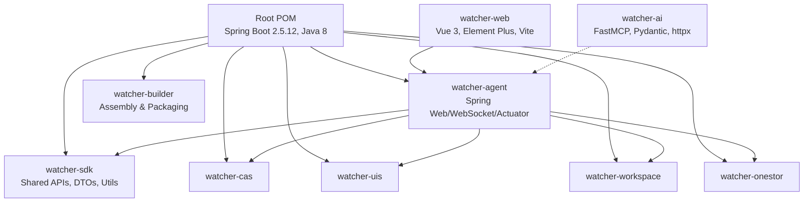
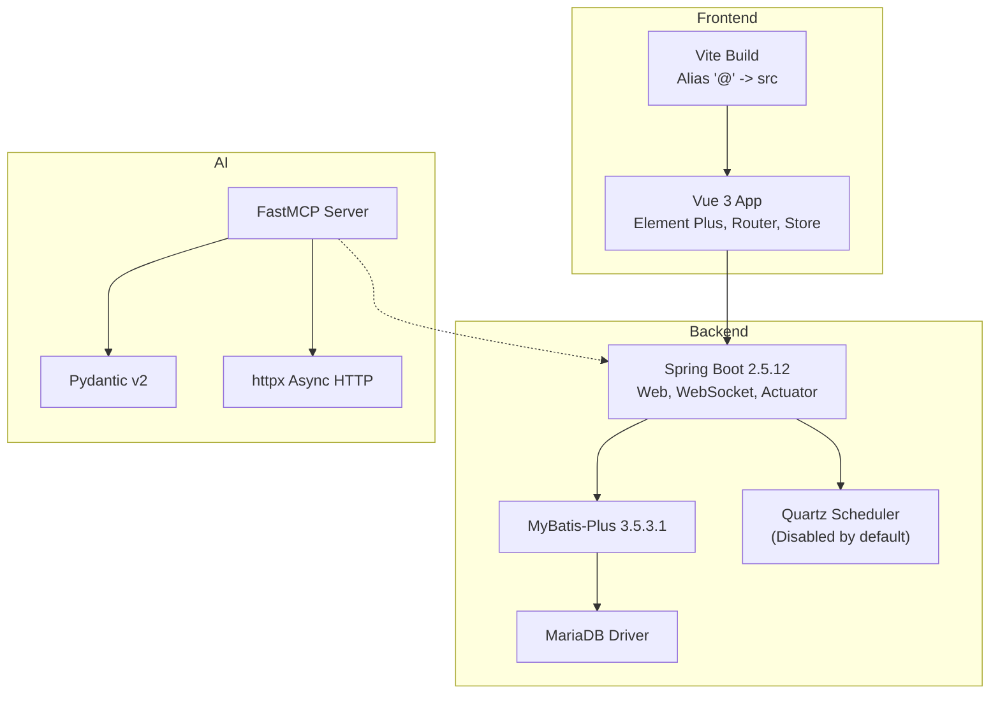
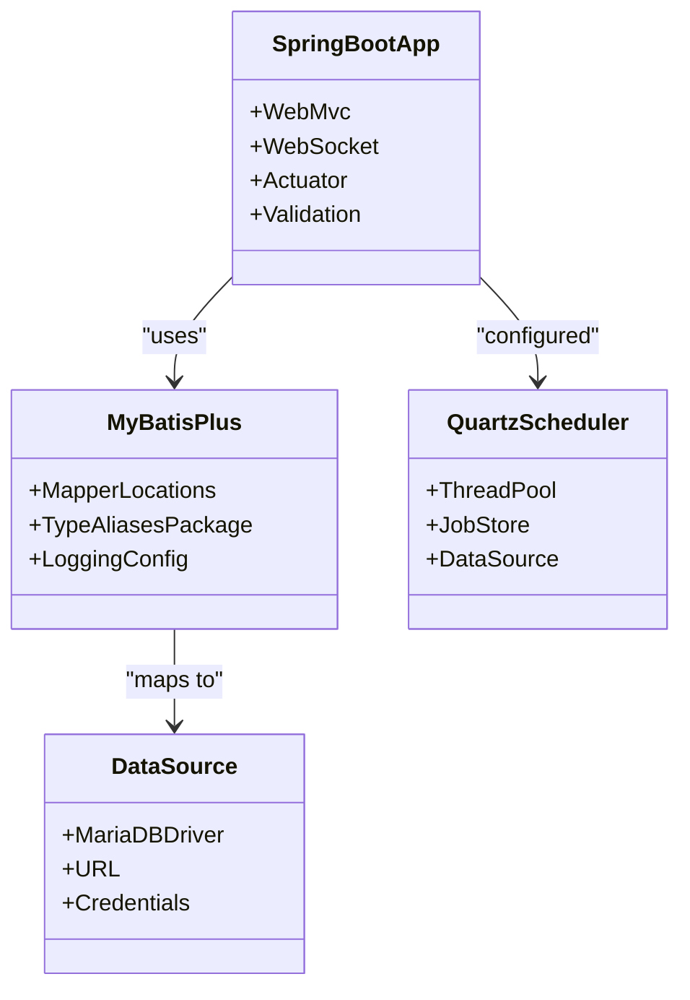
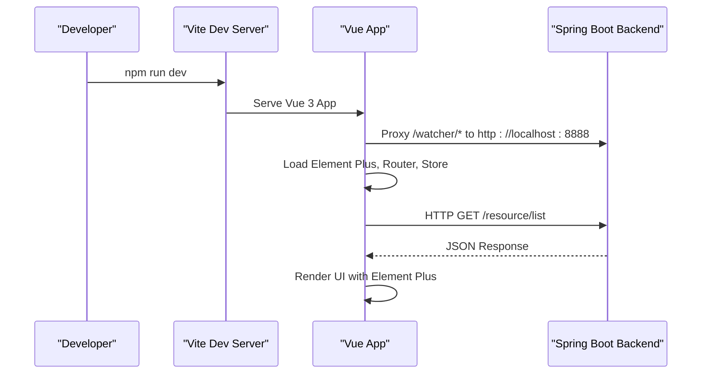
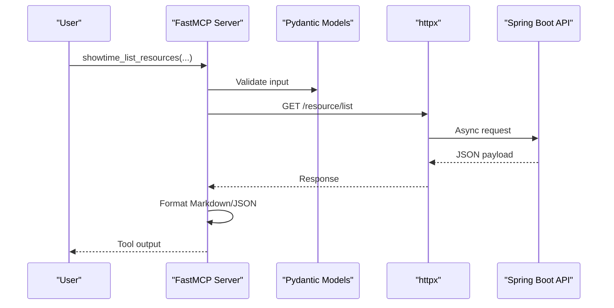
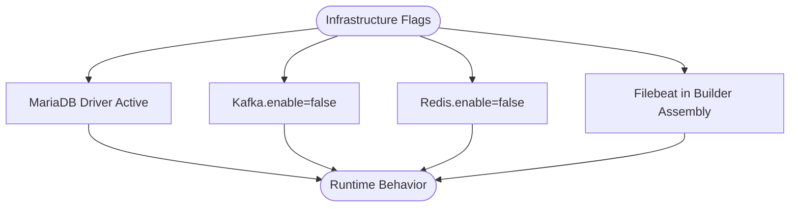
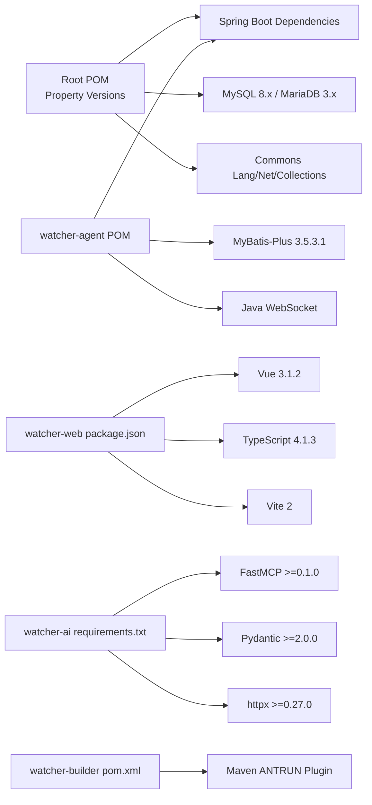

# Technology Stack & Frameworks

<cite>
**Referenced Files in This Document**
- [pom.xml](file://pom.xml)
- [watcher-agent/pom.xml](file://watcher-agent/pom.xml)
- [watcher-builder/pom.xml](file://watcher-builder/pom.xml)
- [watcher-web/package.json](file://watcher-web/package.json)
- [watcher-web/vite.config.ts](file://watcher-web/vite.config.ts)
- [watcher-web/tsconfig.json](file://watcher-web/tsconfig.json)
- [watcher-web/src/main.ts](file://watcher-web/src/main.ts)
- [watcher-web/README.md](file://watcher-web/README.md)
- [watcher-agent/src/main/resources/application.properties](file://watcher-agent/src/main/resources/application.properties)
- [watcher-agent/src/main/resources/quartz.properties](file://watcher-agent/src/main/resources/quartz.properties)
- [watcher-ai/requirements.txt](file://watcher-ai/requirements.txt)
- [watcher-ai/src/showtime_mcp.py](file://watcher-ai/src/showtime_mcp.py)
</cite>

## Table of Contents
1. [Introduction](#introduction)
2. [Project Structure](#project-structure)
3. [Core Components](#core-components)
4. [Architecture Overview](#architecture-overview)
5. [Detailed Component Analysis](#detailed-component-analysis)
6. [Dependency Analysis](#dependency-analysis)
7. [Performance Considerations](#performance-considerations)
8. [Troubleshooting Guide](#troubleshooting-guide)
9. [Conclusion](#conclusion)
10. [Appendices](#appendices)

## Introduction
This document provides a comprehensive technology stack and frameworks guide for the ShowTime platform. It covers backend technologies (Spring Boot, MyBatis-Plus, Quartz), frontend technologies (Vue 3, Element Plus, TypeScript, Vite), AI integration (Python, FastMCP, Pydantic), and infrastructure dependencies (MySQL/MariaDB, Kafka, Redis, Filebeat). It also explains version compatibility, rationale for technology choices, upgrade paths, dependency management strategies, build configurations, and development environment setup requirements.

## Project Structure
The ShowTime platform is a multi-module Maven project with distinct backend, frontend, AI integration, and packaging/build modules:
- Backend modules: watcher-agent, watcher-sdk, watcher-cas, watcher-uis, watcher-workspace, watcher-onestor
- Frontend module: watcher-web
- AI integration module: watcher-ai
- Packaging/build module: watcher-builder

**Diagram sources**
- [pom.xml:11-19](file://pom.xml#L11-L19)
- [watcher-agent/pom.xml:24-50](file://watcher-agent/pom.xml#L24-L50)
- [watcher-builder/pom.xml:15-212](file://watcher-builder/pom.xml#L15-L212)

**Section sources**
- [pom.xml:11-19](file://pom.xml#L11-L19)
- [watcher-builder/pom.xml:15-212](file://watcher-builder/pom.xml#L15-L212)

## Core Components
- Backend (Spring Boot 2.5.12)
  - Spring Web, WebSocket, Actuator, Validation
  - MyBatis-Plus 3.5.3.1 for ORM
  - Quartz scheduler (disabled by default in current profile)
  - MariaDB driver configured for data source
- Frontend (Vue 3.1.2)
  - Element Plus UI framework
  - TypeScript 4.1.3 with strict compiler options
  - Vite 2 build tool with Vue plugin
  - Axios for HTTP requests, Vuex 4 for state management, Vue Router 4 for routing
- AI Integration (Python 3.8+)
  - FastMCP for Model Context Protocol server
  - Pydantic v2 for data validation
  - httpx for async HTTP requests
- Infrastructure
  - MySQL/MariaDB for persistence
  - Kafka, Redis, Filebeat referenced in builder assembly (not enabled by default in agent)

**Section sources**
- [watcher-agent/pom.xml:54-136](file://watcher-agent/pom.xml#L54-L136)
- [watcher-agent/src/main/resources/application.properties:46-58](file://watcher-agent/src/main/resources/application.properties#L46-L58)
- [watcher-agent/src/main/resources/quartz.properties:15-40](file://watcher-agent/src/main/resources/quartz.properties#L15-L40)
- [watcher-web/package.json:20-54](file://watcher-web/package.json#L20-L54)
- [watcher-web/package.json:55-70](file://watcher-web/package.json#L55-L70)
- [watcher-web/vite.config.ts:13-48](file://watcher-web/vite.config.ts#L13-L48)
- [watcher-web/tsconfig.json:2-18](file://watcher-web/tsconfig.json#L2-L18)
- [watcher-web/src/main.ts:1-37](file://watcher-web/src/main.ts#L1-L37)
- [watcher-ai/requirements.txt:1-5](file://watcher-ai/requirements.txt#L1-L5)
- [watcher-ai/src/showtime_mcp.py:14-19](file://watcher-ai/src/showtime_mcp.py#L14-L19)

## Architecture Overview
The system follows a modular backend with a Vue 3 frontend and optional AI integration via FastMCP. The backend exposes REST endpoints consumed by the frontend, while the AI module communicates with the backend through HTTP.

**Diagram sources**
- [watcher-web/vite.config.ts:9-18](file://watcher-web/vite.config.ts#L9-L18)
- [watcher-web/src/main.ts:28-32](file://watcher-web/src/main.ts#L28-L32)
- [watcher-agent/pom.xml:54-136](file://watcher-agent/pom.xml#L54-L136)
- [watcher-agent/src/main/resources/application.properties:46-58](file://watcher-agent/src/main/resources/application.properties#L46-L58)
- [watcher-agent/src/main/resources/quartz.properties:15-40](file://watcher-agent/src/main/resources/quartz.properties#L15-L40)
- [watcher-ai/src/showtime_mcp.py:14-19](file://watcher-ai/src/showtime_mcp.py#L14-L19)

## Detailed Component Analysis

### Backend: Spring Boot 2.5.12, MyBatis-Plus, Quartz
- Spring Boot 2.5.12 baseline with Java 8 compatibility
- MyBatis-Plus configured with mapper locations, type aliases, and logging
- MariaDB driver configured; MySQL 8.x and MariaDB 3.x versions managed at root level
- Quartz scheduler properties present; disabled by default in active profile
- Actuator enabled for health and management endpoints

**Diagram sources**
- [watcher-agent/pom.xml:54-136](file://watcher-agent/pom.xml#L54-L136)
- [watcher-agent/src/main/resources/application.properties:46-58](file://watcher-agent/src/main/resources/application.properties#L46-L58)
- [watcher-agent/src/main/resources/quartz.properties:15-40](file://watcher-agent/src/main/resources/quartz.properties#L15-L40)

**Section sources**
- [pom.xml:22-47](file://pom.xml#L22-L47)
- [watcher-agent/pom.xml:54-136](file://watcher-agent/pom.xml#L54-L136)
- [watcher-agent/src/main/resources/application.properties:46-58](file://watcher-agent/src/main/resources/application.properties#L46-L58)
- [watcher-agent/src/main/resources/quartz.properties:15-40](file://watcher-agent/src/main/resources/quartz.properties#L15-L40)

### Frontend: Vue 3.1.2, Element Plus, TypeScript 4.1.3, Vite
- Vue 3.1.2 with Element Plus UI and global directives
- TypeScript 4.1.3 with strict mode and DOM libs
- Vite 2 with Vue plugin, path alias '@' mapped to src, proxy for backend API
- Axios for HTTP, Vuex 4 for state, Vue Router 4 for routing
- Internationalization via vue-i18n, SCSS support, and build chunking for chart libraries

**Diagram sources**
- [watcher-web/vite.config.ts:23-34](file://watcher-web/vite.config.ts#L23-L34)
- [watcher-web/src/main.ts:28-32](file://watcher-web/src/main.ts#L28-L32)

**Section sources**
- [watcher-web/package.json:20-54](file://watcher-web/package.json#L20-L54)
- [watcher-web/package.json:55-70](file://watcher-web/package.json#L55-L70)
- [watcher-web/vite.config.ts:13-48](file://watcher-web/vite.config.ts#L13-L48)
- [watcher-web/tsconfig.json:2-18](file://watcher-web/tsconfig.json#L2-L18)
- [watcher-web/src/main.ts:1-37](file://watcher-web/src/main.ts#L1-L37)
- [watcher-web/README.md:37-46](file://watcher-web/README.md#L37-L46)

### AI Integration: Python 3.8+, FastMCP, Pydantic
- FastMCP server exposing tools to list resources, get details, list metric types, fetch trends, summaries, and latest metrics
- Pydantic v2 models for input validation and structured outputs
- httpx for async HTTP requests to the backend API
- Environment-driven configuration for API base URL and token

**Diagram sources**
- [watcher-ai/src/showtime_mcp.py:184-247](file://watcher-ai/src/showtime_mcp.py#L184-L247)
- [watcher-ai/src/showtime_mcp.py:127-139](file://watcher-ai/src/showtime_mcp.py#L127-L139)
- [watcher-ai/requirements.txt:1-5](file://watcher-ai/requirements.txt#L1-L5)

**Section sources**
- [watcher-ai/requirements.txt:1-5](file://watcher-ai/requirements.txt#L1-L5)
- [watcher-ai/src/showtime_mcp.py:14-19](file://watcher-ai/src/showtime_mcp.py#L14-L19)
- [watcher-ai/src/showtime_mcp.py:184-247](file://watcher-ai/src/showtime_mcp.py#L184-L247)

### Infrastructure Dependencies
- Database: MariaDB configured in backend properties; MySQL 8.x and MariaDB 3.x versions managed at root level
- Messaging/Streaming: Kafka enable flag present in backend properties (disabled by default)
- Caching: Redis enable flag present in backend properties (disabled by default)
- Logging/Beats: Filebeat referenced in builder assembly (not enabled by default in agent)

**Diagram sources**
- [watcher-agent/src/main/resources/application.properties:16-20](file://watcher-agent/src/main/resources/application.properties#L16-L20)
- [watcher-builder/pom.xml:28-198](file://watcher-builder/pom.xml#L28-L198)

**Section sources**
- [watcher-agent/src/main/resources/application.properties:16-20](file://watcher-agent/src/main/resources/application.properties#L16-L20)
- [watcher-builder/pom.xml:28-198](file://watcher-builder/pom.xml#L28-L198)

## Dependency Analysis
- Backend dependency management via Spring Boot BOM and property-managed versions
- Frontend dependencies pinned in package.json with Node engine requirement
- AI dependencies declared in requirements.txt with minimum versions
- Build-time assembly orchestrated by watcher-builder’s Maven ANTRUN plugin

**Diagram sources**
- [pom.xml:22-47](file://pom.xml#L22-L47)
- [watcher-agent/pom.xml:54-136](file://watcher-agent/pom.xml#L54-L136)
- [watcher-web/package.json:20-54](file://watcher-web/package.json#L20-L54)
- [watcher-web/package.json:55-70](file://watcher-web/package.json#L55-L70)
- [watcher-ai/requirements.txt:1-5](file://watcher-ai/requirements.txt#L1-L5)
- [watcher-builder/pom.xml:17-207](file://watcher-builder/pom.xml#L17-L207)

**Section sources**
- [pom.xml:49-108](file://pom.xml#L49-L108)
- [watcher-agent/pom.xml:54-136](file://watcher-agent/pom.xml#L54-L136)
- [watcher-web/package.json:20-54](file://watcher-web/package.json#L20-L54)
- [watcher-web/package.json:55-70](file://watcher-web/package.json#L55-L70)
- [watcher-ai/requirements.txt:1-5](file://watcher-ai/requirements.txt#L1-L5)
- [watcher-builder/pom.xml:17-207](file://watcher-builder/pom.xml#L17-L207)

## Performance Considerations
- Frontend
  - Vite’s dev server optimized for fast HMR; production builds use Rollup with manualChunks for chart libraries
  - Strict TypeScript compilation improves build-time correctness and reduces runtime errors
- Backend
  - MyBatis-Plus with camelCase mapping and SLF4J logging aids maintainability
  - Quartz disabled by default to avoid unnecessary overhead
- AI Integration
  - Async HTTP requests with timeouts prevent blocking behavior
  - Pydantic validation ensures efficient downstream processing

[No sources needed since this section provides general guidance]

## Troubleshooting Guide
- Frontend
  - Vite proxy targets localhost:8888; ensure backend is running on that port and context path matches
  - Path alias '@' resolves to src; incorrect imports may cause build failures
- Backend
  - MariaDB driver configured; verify connection URL, credentials, and database existence
  - Quartz properties present; confirm whether clustering or JDBC JobStore is intended
  - Actuator endpoints exposed; health checks help diagnose runtime issues
- AI Integration
  - API base URL and token environment variables must be set for FastMCP to reach backend
  - httpx timeouts and status error handling provide structured error messages

**Section sources**
- [watcher-web/vite.config.ts:23-34](file://watcher-web/vite.config.ts#L23-L34)
- [watcher-web/vite.config.ts:9-18](file://watcher-web/vite.config.ts#L9-L18)
- [watcher-agent/src/main/resources/application.properties:46-58](file://watcher-agent/src/main/resources/application.properties#L46-L58)
- [watcher-agent/src/main/resources/quartz.properties:15-40](file://watcher-agent/src/main/resources/quartz.properties#L15-L40)
- [watcher-ai/src/showtime_mcp.py:141-158](file://watcher-ai/src/showtime_mcp.py#L141-L158)

## Conclusion
The ShowTime platform combines a robust Spring Boot backend with a modern Vue 3 frontend, supported by MyBatis-Plus and MariaDB. The AI integration leverages FastMCP and Pydantic for structured tooling, while the build system packages artifacts via Maven and Vite. Infrastructure components like Kafka, Redis, and Filebeat are available but disabled by default, enabling a lean runtime profile. Version compatibility is managed centrally, and upgrade paths should respect Spring Boot 2.5.x constraints, Java 8 compatibility, and aligned dependency versions.

[No sources needed since this section summarizes without analyzing specific files]

## Appendices

### Version Compatibility and Upgrade Paths
- Spring Boot 2.5.12
  - Upgrade path: Consider Spring Boot 2.7.x or 3.x series; 3.x requires Java 17+
  - Impact: Major changes in starters, actuator, and auto-configuration
- Java
  - Current: Java 8 (compatibility with legacy libraries)
  - Recommendation: Migrate to Java 17+ for LTS and improved performance
- Vue 3.1.2 and Vite 2
  - Upgrade path: Vue 3.4+, Vite 5+; ensure plugin updates and TypeScript 5.x
  - Impact: Breaking changes in Vue Composition API and Vite ecosystem
- TypeScript 4.1.3
  - Upgrade path: TypeScript 5.x; strictness improvements and new features
  - Impact: Enhanced type inference and stricter checks
- MyBatis-Plus 3.5.3.1
  - Upgrade path: Latest 3.x patch; verify mapper and annotation compatibility
  - Impact: ORM enhancements and bug fixes
- MariaDB Driver
  - Upgrade path: Align with MariaDB server version; ensure JDBC compliance
  - Impact: Improved performance and security

**Section sources**
- [pom.xml:22-47](file://pom.xml#L22-L47)
- [watcher-web/package.json:17-19](file://watcher-web/package.json#L17-L19)
- [watcher-web/package.json:55-70](file://watcher-web/package.json#L55-L70)
- [watcher-agent/pom.xml:54-136](file://watcher-agent/pom.xml#L54-L136)

### Development Environment Setup
- Backend
  - Install JDK 8; configure Maven; run watcher-agent module
  - Ensure MariaDB is running and database/schema initialized
- Frontend
  - Install Node.js meeting engine requirements; run npm install and npm run dev
  - Configure Vite proxy to match backend port and context path
- AI Integration
  - Install Python 3.8+; create virtual environment; pip install -r requirements.txt
  - Set SHOWTIME_API_URL and SHOWTIME_API_TOKEN environment variables
- Packaging
  - Run Maven build in watcher-builder to assemble distribution artifacts

**Section sources**
- [watcher-web/package.json:17-19](file://watcher-web/package.json#L17-L19)
- [watcher-web/README.md:55-75](file://watcher-web/README.md#L55-L75)
- [watcher-ai/requirements.txt:1-5](file://watcher-ai/requirements.txt#L1-L5)
- [watcher-builder/pom.xml:17-207](file://watcher-builder/pom.xml#L17-L207)