# Backend Services

<cite>
**Referenced Files in This Document**
- [WatcherAgentApplication.java](file://watcher-agent/src/main/java/com/virtual/cloud/om/agent/WatcherAgentApplication.java)
- [HomeController.java](file://watcher-agent/src/main/java/com/virtual/cloud/om/agent/controller/HomeController.java)
- [DeployController.java](file://watcher-agent/src/main/java/com/virtual/cloud/om/agent/controller/DeployController.java)
- [MetricController.java](file://watcher-agent/src/main/java/com/virtual/cloud/om/agent/controller/MetricController.java)
- [ResourceController.java](file://watcher-agent/src/main/java/com/virtual/cloud/om/agent/controller/ResourceController.java)
- [LoginInterceptor.java](file://watcher-agent/src/main/java/com/virtual/cloud/om/agent/config/LoginInterceptor.java)
- [SwaggerConfiguration.java](file://watcher-agent/src/main/java/com/virtual/cloud/om/agent/config/SwaggerConfiguration.java)
- [webConfig.java](file://watcher-agent/src/main/java/com/virtual/cloud/om/agent/filter/webConfig.java)
- [DataCenterService.java](file://watcher-agent/src/main/java/com/virtual/cloud/om/agent/service/datacenter/DataCenterService.java)
- [DeployService.java](file://watcher-agent/src/main/java/com/virtual/cloud/om/agent/service/deploy/DeployService.java)
- [DataReportService.java](file://watcher-agent/src/main/java/com/virtual/cloud/om/agent/service/report/DataReportService.java)
- [application.properties](file://watcher-agent/src/main/resources/application.properties)
- [quartz.properties](file://watcher-agent/src/main/resources/quartz.properties)
- [pom.xml](file://watcher-agent/pom.xml)
</cite>

## Table of Contents
1. [Introduction](#introduction)
2. [Project Structure](#project-structure)
3. [Core Components](#core-components)
4. [Architecture Overview](#architecture-overview)
5. [Detailed Component Analysis](#detailed-component-analysis)
6. [Dependency Analysis](#dependency-analysis)
7. [Performance Considerations](#performance-considerations)
8. [Troubleshooting Guide](#troubleshooting-guide)
9. [Conclusion](#conclusion)
10. [Appendices](#appendices)

## Introduction
This document describes the backend services of the ShowTime monitoring platform with a focus on the watcher-agent module. It explains the Spring Boot application configuration, the controller layer responsibilities, the service layer organization, and the integration patterns with platform-specific modules. It also covers configuration management, database integration via MyBatis-Plus, scheduling with Quartz, security implementation, error handling, and logging strategies.

## Project Structure
The watcher-agent module is a Spring Boot application that exposes REST endpoints for monitoring and management, integrates with platform modules (CAS, UIS, Workspace, OneStor), and persists data using a MariaDB database via MyBatis-Plus. It disables several optional integrations (e.g., Kafka, Elasticsearch, MongoDB, ClickHouse) and Quartz in the current profile to support a MySQL single-node deployment.

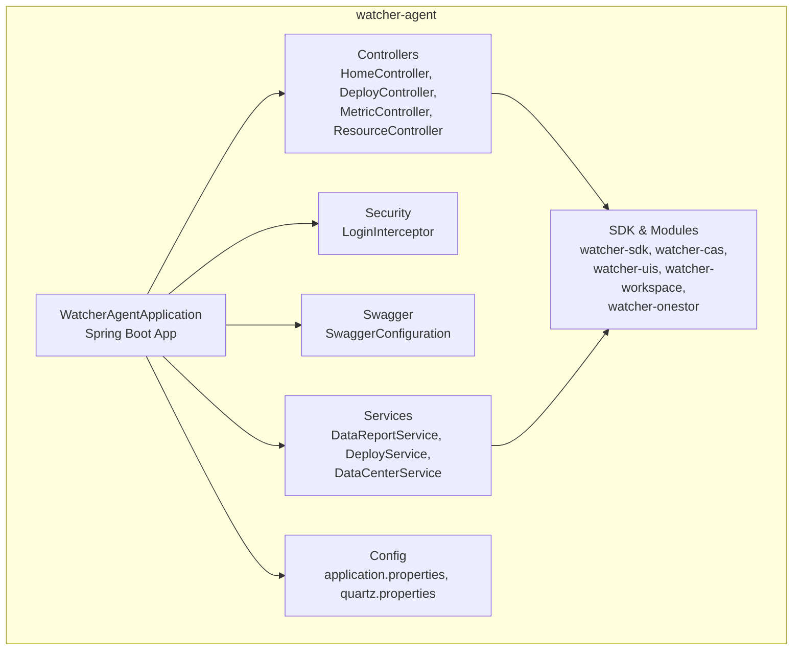

**Diagram sources**
- [WatcherAgentApplication.java:14-27](file://watcher-agent/src/main/java/com/virtual/cloud/om/agent/WatcherAgentApplication.java#L14-L27)
- [HomeController.java:24-26](file://watcher-agent/src/main/java/com/virtual/cloud/om/agent/controller/HomeController.java#L24-L26)
- [DeployController.java:32-36](file://watcher-agent/src/main/java/com/virtual/cloud/om/agent/controller/DeployController.java#L32-L36)
- [MetricController.java:30-35](file://watcher-agent/src/main/java/com/virtual/cloud/om/agent/controller/MetricController.java#L30-L35)
- [ResourceController.java:24-29](file://watcher-agent/src/main/java/com/virtual/cloud/om/agent/controller/ResourceController.java#L24-L29)
- [LoginInterceptor.java:29-73](file://watcher-agent/src/main/java/com/virtual/cloud/om/agent/config/LoginInterceptor.java#L29-L73)
- [SwaggerConfiguration.java:21-37](file://watcher-agent/src/main/java/com/virtual/cloud/om/agent/config/SwaggerConfiguration.java#L21-L37)
- [DataReportService.java:47-79](file://watcher-agent/src/main/java/com/virtual/cloud/om/agent/service/report/DataReportService.java#L47-L79)
- [DeployService.java:26-41](file://watcher-agent/src/main/java/com/virtual/cloud/om/agent/service/deploy/DeployService.java#L26-L41)
- [DataCenterService.java:16-39](file://watcher-agent/src/main/java/com/virtual/cloud/om/agent/service/datacenter/DataCenterService.java#L16-L39)
- [application.properties:1-80](file://watcher-agent/src/main/resources/application.properties#L1-L80)
- [quartz.properties:1-45](file://watcher-agent/src/main/resources/quartz.properties#L1-L45)

**Section sources**
- [WatcherAgentApplication.java:14-27](file://watcher-agent/src/main/java/com/virtual/cloud/om/agent/WatcherAgentApplication.java#L14-L27)
- [application.properties:1-80](file://watcher-agent/src/main/resources/application.properties#L1-L80)

## Core Components
- Application bootstrap and scanning:
  - Spring Boot application class configures component scanning across watcher modules and MyBatis-Plus mapper scanning, and disables Quartz auto-configuration.
- Controllers:
  - HomeController: exposes health, parameter editing, and log operations; integrates with Workspace and CAS via REST clients.
  - DeployController: orchestrates deployment and networking operations; supports batch/single deployments, component management, network configuration, and keepalived notifications.
  - MetricController: queries supported metric/platform types, lists metrics, retrieves latest and trend data, and accepts metric reports.
  - ResourceController: manages platform resources (create, batch-create, update, delete, usability toggles).
- Security:
  - LoginInterceptor validates tokens from headers or cookies and rejects unauthorized requests.
- Swagger:
  - SwaggerConfiguration enables API documentation for the agent’s REST endpoints.
- Services:
  - DataReportService: collects and reports metrics asynchronously per platform and metric type; coordinates collectors and tasks.
  - DeployService: placeholder implementation for deployment-related operations (disabled in current profile).
  - DataCenterService: placeholder implementation for data center orchestration (disabled in current profile).

**Section sources**
- [WatcherAgentApplication.java:14-27](file://watcher-agent/src/main/java/com/virtual/cloud/om/agent/WatcherAgentApplication.java#L14-L27)
- [HomeController.java:24-99](file://watcher-agent/src/main/java/com/virtual/cloud/om/agent/controller/HomeController.java#L24-L99)
- [DeployController.java:32-325](file://watcher-agent/src/main/java/com/virtual/cloud/om/agent/controller/DeployController.java#L32-L325)
- [MetricController.java:30-271](file://watcher-agent/src/main/java/com/virtual/cloud/om/agent/controller/MetricController.java#L30-L271)
- [ResourceController.java:24-235](file://watcher-agent/src/main/java/com/virtual/cloud/om/agent/controller/ResourceController.java#L24-L235)
- [LoginInterceptor.java:29-99](file://watcher-agent/src/main/java/com/virtual/cloud/om/agent/config/LoginInterceptor.java#L29-L99)
- [SwaggerConfiguration.java:21-49](file://watcher-agent/src/main/java/com/virtual/cloud/om/agent/config/SwaggerConfiguration.java#L21-L49)
- [DataReportService.java:47-327](file://watcher-agent/src/main/java/com/virtual/cloud/om/agent/service/report/DataReportService.java#L47-L327)
- [DeployService.java:26-232](file://watcher-agent/src/main/java/com/virtual/cloud/om/agent/service/deploy/DeployService.java#L26-L232)
- [DataCenterService.java:16-50](file://watcher-agent/src/main/java/com/virtual/cloud/om/agent/service/datacenter/DataCenterService.java#L16-L50)

## Architecture Overview
The watcher-agent acts as a Spring Boot microservice that:
- Exposes REST endpoints for monitoring and management.
- Integrates with external platform services (CAS, UIS, Workspace, OneStor) via REST clients.
- Persists operational data (metrics, resources, logs) to MariaDB using MyBatis-Plus.
- Uses Quartz for scheduling (disabled in current profile).
- Enforces authentication via a global interceptor.

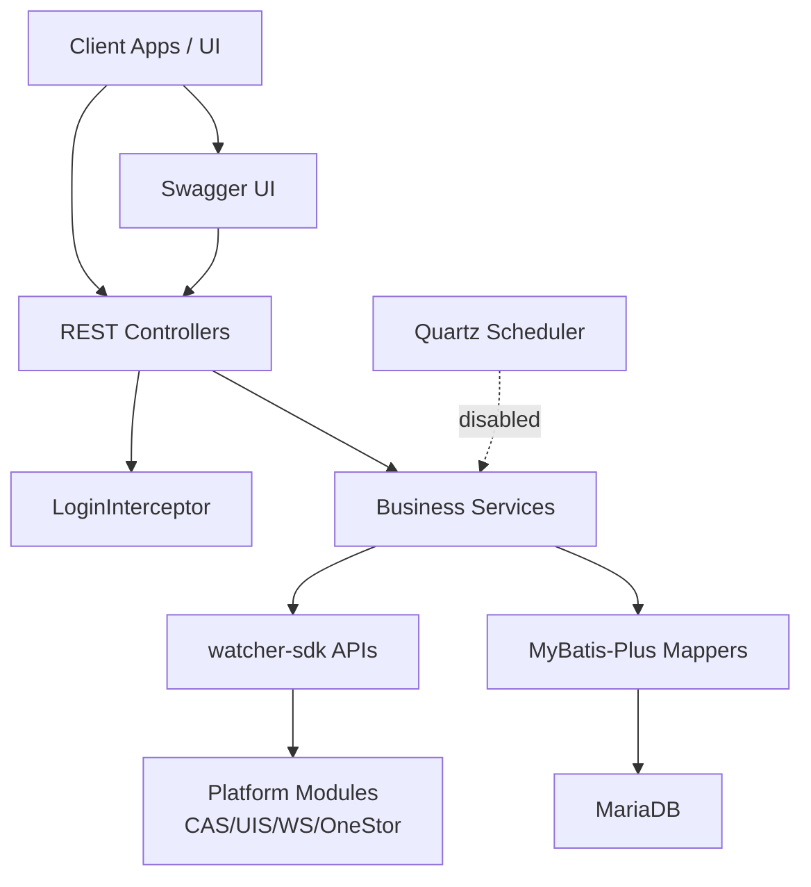

**Diagram sources**
- [HomeController.java:24-99](file://watcher-agent/src/main/java/com/virtual/cloud/om/agent/controller/HomeController.java#L24-L99)
- [DeployController.java:32-325](file://watcher-agent/src/main/java/com/virtual/cloud/om/agent/controller/DeployController.java#L32-L325)
- [MetricController.java:30-271](file://watcher-agent/src/main/java/com/virtual/cloud/om/agent/controller/MetricController.java#L30-L271)
- [ResourceController.java:24-235](file://watcher-agent/src/main/java/com/virtual/cloud/om/agent/controller/ResourceController.java#L24-L235)
- [LoginInterceptor.java:29-99](file://watcher-agent/src/main/java/com/virtual/cloud/om/agent/config/LoginInterceptor.java#L29-L99)
- [DataReportService.java:47-327](file://watcher-agent/src/main/java/com/virtual/cloud/om/agent/service/report/DataReportService.java#L47-L327)
- [DeployService.java:26-232](file://watcher-agent/src/main/java/com/virtual/cloud/om/agent/service/deploy/DeployService.java#L26-L232)
- [DataCenterService.java:16-50](file://watcher-agent/src/main/java/com/virtual/cloud/om/agent/service/datacenter/DataCenterService.java#L16-L50)
- [application.properties:46-71](file://watcher-agent/src/main/resources/application.properties#L46-L71)
- [quartz.properties:1-45](file://watcher-agent/src/main/resources/quartz.properties#L1-L45)

## Detailed Component Analysis

### Application Bootstrap and Configuration
- WatcherAgentApplication:
  - Disables Quartz auto-configuration and scans packages for components and MyBatis-Plus mappers.
  - Enables scheduling globally.
- application.properties:
  - Defines server port, context path, active profile, management endpoints, and feature toggles for optional integrations.
  - Configures MariaDB datasource and MyBatis-Plus settings.
  - Provides service URLs for CAS, UIS, Workspace, and OneStor.
- quartz.properties:
  - Contains Quartz defaults; clustering and MongoDB-backed stores are commented out, aligning with the disabled integrations.

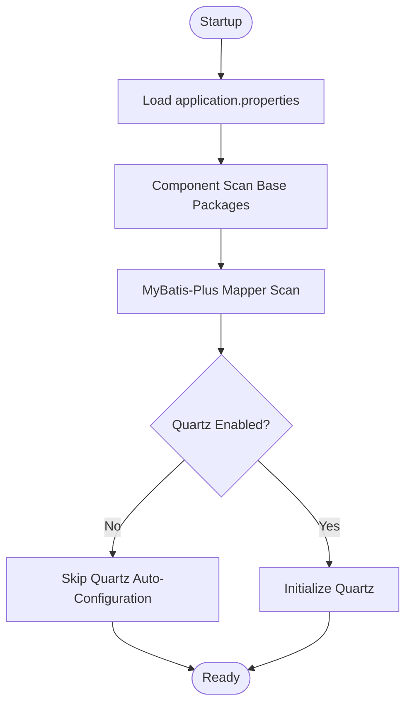

**Diagram sources**
- [WatcherAgentApplication.java:14-27](file://watcher-agent/src/main/java/com/virtual/cloud/om/agent/WatcherAgentApplication.java#L14-L27)
- [application.properties:14-28](file://watcher-agent/src/main/resources/application.properties#L14-L28)
- [application.properties:46-71](file://watcher-agent/src/main/resources/application.properties#L46-L71)
- [quartz.properties:1-45](file://watcher-agent/src/main/resources/quartz.properties#L1-L45)

**Section sources**
- [WatcherAgentApplication.java:14-27](file://watcher-agent/src/main/java/com/virtual/cloud/om/agent/WatcherAgentApplication.java#L14-L27)
- [application.properties:14-28](file://watcher-agent/src/main/resources/application.properties#L14-L28)
- [application.properties:46-71](file://watcher-agent/src/main/resources/application.properties#L46-L71)
- [quartz.properties:1-45](file://watcher-agent/src/main/resources/quartz.properties#L1-L45)

### Security Implementation
- Global interceptor:
  - Reads token from request header or cookie.
  - Calls LoginService to verify token validity.
  - Returns UNAUTHORIZED with JSON payload if verification fails.
- Exclusions:
  - Public endpoints (login, Swagger, collect/log, deployment refresh, keepalived notify) are excluded from interception.

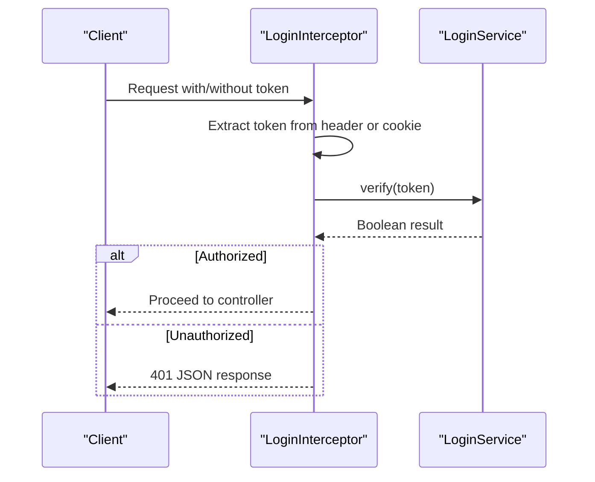

**Diagram sources**
- [LoginInterceptor.java:36-73](file://watcher-agent/src/main/java/com/virtual/cloud/om/agent/config/LoginInterceptor.java#L36-L73)
- [webConfig.java:19-36](file://watcher-agent/src/main/java/com/virtual/cloud/om/agent/filter/webConfig.java#L19-L36)

**Section sources**
- [LoginInterceptor.java:29-99](file://watcher-agent/src/main/java/com/virtual/cloud/om/agent/config/LoginInterceptor.java#L29-L99)
- [webConfig.java:11-37](file://watcher-agent/src/main/java/com/virtual/cloud/om/agent/filter/webConfig.java#L11-L37)

### Controller Layer Responsibilities

#### HomeController
- Exposes:
  - Health endpoint returning active properties and watcher home path.
  - Parameter editing endpoint delegating to ParameterService.
  - Log query and deletion endpoints delegating to LogService.
  - Workspace and CAS integration endpoints using REST clients.

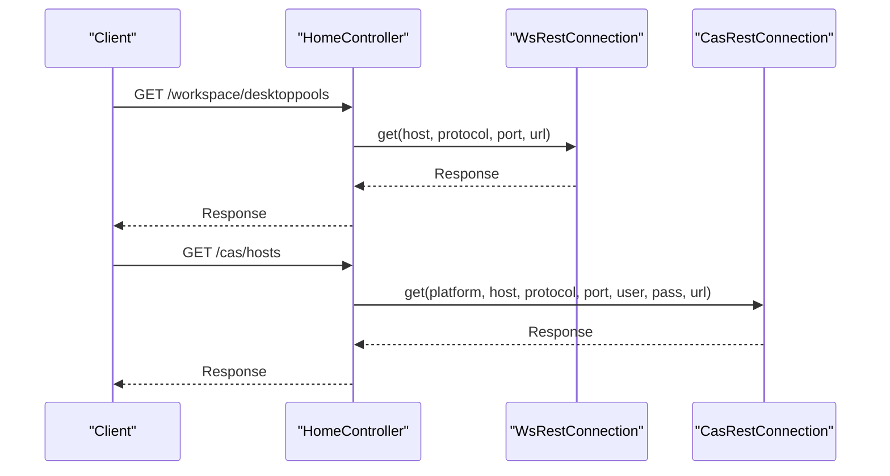

**Diagram sources**
- [HomeController.java:52-65](file://watcher-agent/src/main/java/com/virtual/cloud/om/agent/controller/HomeController.java#L52-L65)

**Section sources**
- [HomeController.java:24-99](file://watcher-agent/src/main/java/com/virtual/cloud/om/agent/controller/HomeController.java#L24-L99)

#### DeployController
- Supports:
  - Batch and single deployments invoking DeployApi.
  - Component lifecycle management.
  - Network configuration and routing management.
  - Keepalived notifications and step updates.
  - Local IP and host information retrieval.
  - Application refresh via controlled restart.

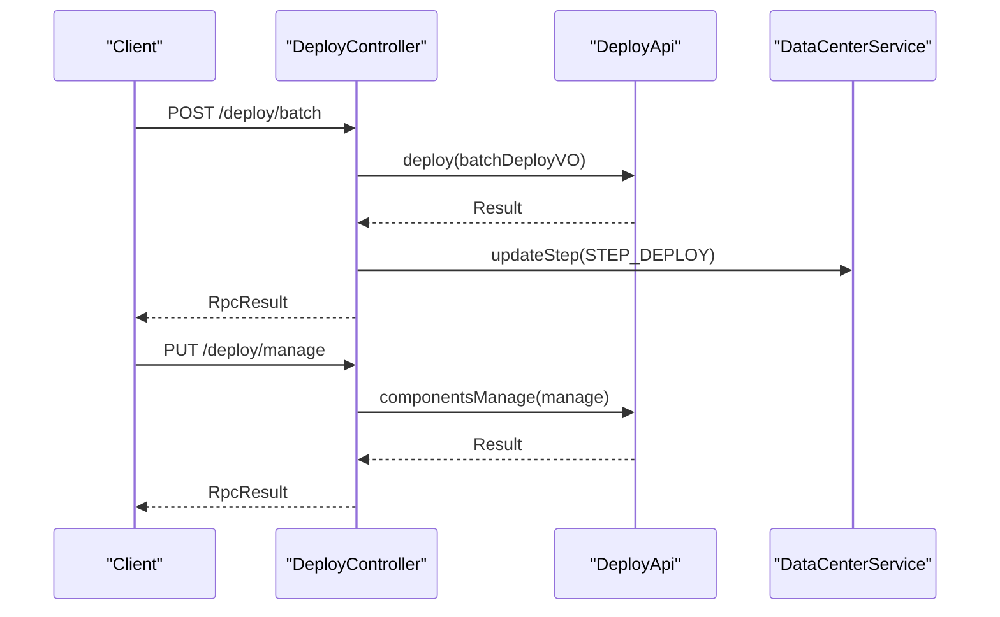

**Diagram sources**
- [DeployController.java:46-90](file://watcher-agent/src/main/java/com/virtual/cloud/om/agent/controller/DeployController.java#L46-L90)
- [DeployService.java:26-100](file://watcher-agent/src/main/java/com/virtual/cloud/om/agent/service/deploy/DeployService.java#L26-L100)
- [DataCenterService.java:29-39](file://watcher-agent/src/main/java/com/virtual/cloud/om/agent/service/datacenter/DataCenterService.java#L29-L39)

**Section sources**
- [DeployController.java:32-325](file://watcher-agent/src/main/java/com/virtual/cloud/om/agent/controller/DeployController.java#L32-L325)
- [DeployService.java:26-232](file://watcher-agent/src/main/java/com/virtual/cloud/om/agent/service/deploy/DeployService.java#L26-L232)
- [DataCenterService.java:16-50](file://watcher-agent/src/main/java/com/virtual/cloud/om/agent/service/datacenter/DataCenterService.java#L16-L50)

#### MetricController
- Provides:
  - Supported metric types and platforms.
  - Metrics listing with filtering and pagination.
  - Latest metrics per resource.
  - Trend data for a given metric type.
  - Metrics reporting endpoint inserting into MetricData table.
  - Resource metrics summary.

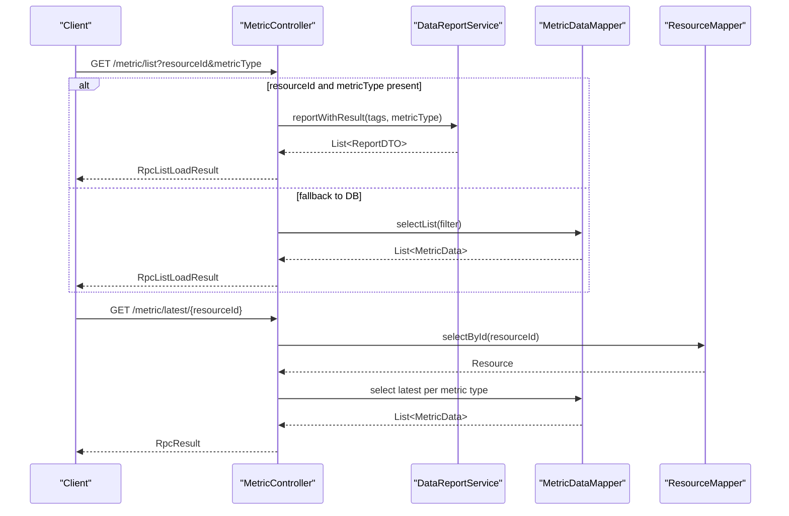

**Diagram sources**
- [MetricController.java:77-161](file://watcher-agent/src/main/java/com/virtual/cloud/om/agent/controller/MetricController.java#L77-L161)
- [MetricController.java:163-194](file://watcher-agent/src/main/java/com/virtual/cloud/om/agent/controller/MetricController.java#L163-L194)
- [MetricController.java:216-238](file://watcher-agent/src/main/java/com/virtual/cloud/om/agent/controller/MetricController.java#L216-L238)
- [DataReportService.java:145-154](file://watcher-agent/src/main/java/com/virtual/cloud/om/agent/service/report/DataReportService.java#L145-L154)

**Section sources**
- [MetricController.java:30-271](file://watcher-agent/src/main/java/com/virtual/cloud/om/agent/controller/MetricController.java#L30-L271)
- [DataReportService.java:145-289](file://watcher-agent/src/main/java/com/virtual/cloud/om/agent/service/report/DataReportService.java#L145-L289)

#### ResourceController
- Manages:
  - Listing resources with filters.
  - Retrieving resource details.
  - Creating/updating/deleting resources.
  - Batch creation with upsert semantics.
  - Updating resource usability and remote SSH permissions.

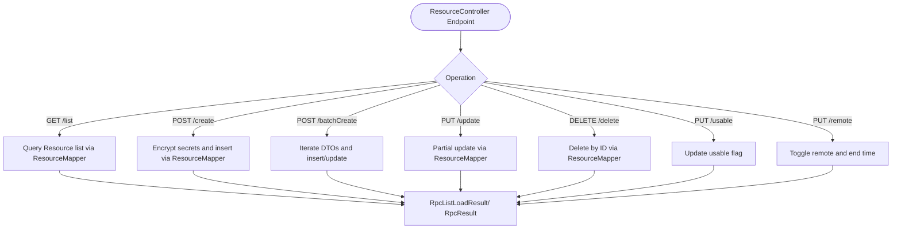

**Diagram sources**
- [ResourceController.java:34-55](file://watcher-agent/src/main/java/com/virtual/cloud/om/agent/controller/ResourceController.java#L34-L55)
- [ResourceController.java:67-96](file://watcher-agent/src/main/java/com/virtual/cloud/om/agent/controller/ResourceController.java#L67-L96)
- [ResourceController.java:98-135](file://watcher-agent/src/main/java/com/virtual/cloud/om/agent/controller/ResourceController.java#L98-L135)
- [ResourceController.java:137-183](file://watcher-agent/src/main/java/com/virtual/cloud/om/agent/controller/ResourceController.java#L137-L183)
- [ResourceController.java:185-233](file://watcher-agent/src/main/java/com/virtual/cloud/om/agent/controller/ResourceController.java#L185-L233)

**Section sources**
- [ResourceController.java:24-235](file://watcher-agent/src/main/java/com/virtual/cloud/om/agent/controller/ResourceController.java#L24-L235)

### Service Layer Organization

#### DataReportService
- Orchestrates asynchronous metric collection:
  - Initializes collector map from annotated collectors.
  - Validates resource identifiers and acquires locks for static metrics.
  - Invokes collectors per metric type and platform.
  - Aggregates results and handles errors.
  - Coordinates with TaskMgrApi and StrategyService for task management.

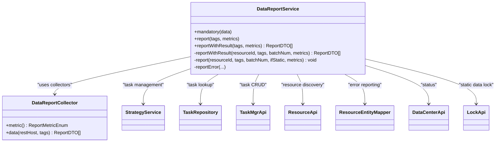

**Diagram sources**
- [DataReportService.java:47-327](file://watcher-agent/src/main/java/com/virtual/cloud/om/agent/service/report/DataReportService.java#L47-L327)

**Section sources**
- [DataReportService.java:47-327](file://watcher-agent/src/main/java/com/virtual/cloud/om/agent/service/report/DataReportService.java#L47-L327)

#### DeployService
- Placeholder implementation for deployment operations; logs warnings for disabled features.

**Section sources**
- [DeployService.java:26-232](file://watcher-agent/src/main/java/com/virtual/cloud/om/agent/service/deploy/DeployService.java#L26-L232)

#### DataCenterService
- Placeholder implementation for data center orchestration; logs debug messages for disabled features.

**Section sources**
- [DataCenterService.java:16-50](file://watcher-agent/src/main/java/com/virtual/cloud/om/agent/service/datacenter/DataCenterService.java#L16-L50)

### Configuration Management and Database Integration
- application.properties:
  - Sets server port, context path, active profile, and management exposure.
  - Disables optional integrations (Elasticsearch, Kafka, MongoDB, ClickHouse, Quartz).
  - Configures MariaDB datasource and MyBatis-Plus settings (mapper locations, type aliases, camelCase mapping).
  - Defines service URLs for CAS, UIS, Workspace, and OneStor.
- MyBatis-Plus:
  - Mapper scanning configured via WatcherAgentApplication and application.properties.
  - Entity classes under sdk.entity.mysql are mapped automatically.

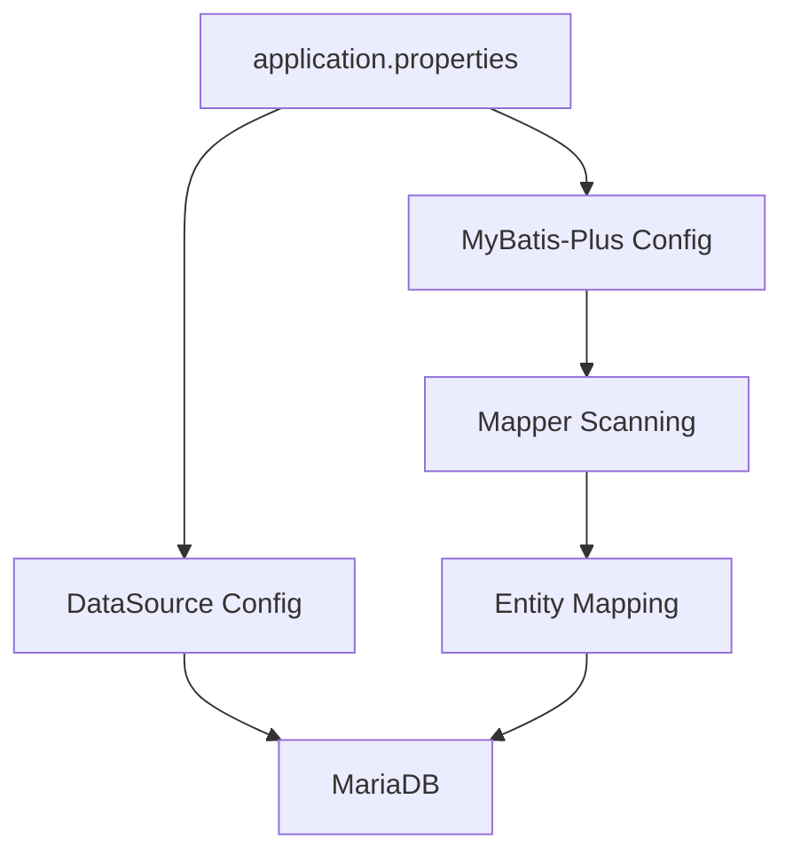

**Diagram sources**
- [application.properties:46-71](file://watcher-agent/src/main/resources/application.properties#L46-L71)
- [WatcherAgentApplication.java:18](file://watcher-agent/src/main/java/com/virtual/cloud/om/agent/WatcherAgentApplication.java#L18)

**Section sources**
- [application.properties:14-28](file://watcher-agent/src/main/resources/application.properties#L14-L28)
- [application.properties:46-71](file://watcher-agent/src/main/resources/application.properties#L46-L71)
- [WatcherAgentApplication.java:18](file://watcher-agent/src/main/java/com/virtual/cloud/om/agent/WatcherAgentApplication.java#L18)

### Scheduling with Quartz
- Quartz is configured via quartz.properties with default thread pool settings.
- Quartz auto-configuration is disabled in WatcherAgentApplication to align with the disabled integrations in the current profile.

**Section sources**
- [quartz.properties:1-45](file://watcher-agent/src/main/resources/quartz.properties#L1-L45)
- [WatcherAgentApplication.java:14-16](file://watcher-agent/src/main/java/com/virtual/cloud/om/agent/WatcherAgentApplication.java#L14-L16)

### API Documentation
- SwaggerConfiguration:
  - Enables Swagger UI and Knife4j with a custom docket targeting the com.virtual.cloud.om package.

**Section sources**
- [SwaggerConfiguration.java:21-49](file://watcher-agent/src/main/java/com/virtual/cloud/om/agent/config/SwaggerConfiguration.java#L21-L49)

## Dependency Analysis
The watcher-agent depends on watcher-sdk and integrates with watcher-cas, watcher-uis, watcher-workspace, and watcher-onestor. It also includes Spring Boot starters for web, actuator, validation, and websocket.

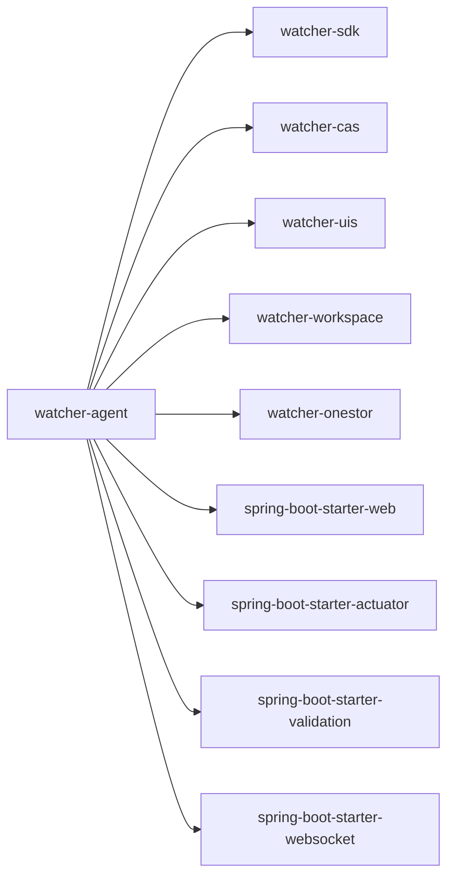

**Diagram sources**
- [pom.xml:24-50](file://watcher-agent/pom.xml#L24-L50)
- [pom.xml:64-108](file://watcher-agent/pom.xml#L64-L108)

**Section sources**
- [pom.xml:14-136](file://watcher-agent/pom.xml#L14-L136)

## Performance Considerations
- Asynchronous metric collection:
  - DataReportService uses CompletableFuture to parallelize collector invocations per metric type and platform, reducing latency for multi-type collections.
- Locking for static metrics:
  - Static data reporting is guarded by a lock to prevent concurrent runs across batches.
- Database writes:
  - MetricController inserts metrics in bulk; ensure appropriate indexing on MetricData for report_time and resource_id.
- Interceptor overhead:
  - LoginInterceptor performs token verification per request; caching or JWT token reuse can reduce overhead.

[No sources needed since this section provides general guidance]

## Troubleshooting Guide
- Authentication failures:
  - Verify token presence in header or cookie; check LoginInterceptor behavior and error messages returned.
- Deployment/network operations:
  - Review DeployController logs for exceptions during network configuration and keepalived notifications.
- Metric reporting:
  - Confirm resource identifiers and platform mappings; ensure collectors are registered and available.
- Database connectivity:
  - Validate MariaDB datasource credentials and availability; confirm MyBatis-Plus mapper locations and entity mappings.

**Section sources**
- [LoginInterceptor.java:36-73](file://watcher-agent/src/main/java/com/virtual/cloud/om/agent/config/LoginInterceptor.java#L36-L73)
- [DeployController.java:46-90](file://watcher-agent/src/main/java/com/virtual/cloud/om/agent/controller/DeployController.java#L46-L90)
- [MetricController.java:216-238](file://watcher-agent/src/main/java/com/virtual/cloud/om/agent/controller/MetricController.java#L216-L238)
- [application.properties:46-71](file://watcher-agent/src/main/resources/application.properties#L46-L71)

## Conclusion
The watcher-agent module provides a focused backend for monitoring and management within the ShowTime platform. It leverages Spring Boot, MyBatis-Plus, and a curated set of platform integrations while maintaining a simplified operational model suitable for MySQL single-node deployments. The controller and service layers are organized to support secure, scalable, and maintainable operations across deployment, resource, metric, and logging domains.

[No sources needed since this section summarizes without analyzing specific files]

## Appendices
- Example endpoints:
  - GET /metric/types, GET /metric/platforms
  - GET /metric/list, GET /metric/latest/{resourceId}, GET /metric/trend/{resourceId}/{metricType}
  - POST /metric/report
  - GET /resource/list, POST /resource/create, PUT /resource/update, DELETE /resource/delete/{id}
  - POST /deploy/batch, PUT /deploy/manage, PUT /deploy/network
  - GET /workspace/desktoppools, GET /cas/hosts

**Section sources**
- [MetricController.java:46-75](file://watcher-agent/src/main/java/com/virtual/cloud/om/agent/controller/MetricController.java#L46-L75)
- [MetricController.java:77-161](file://watcher-agent/src/main/java/com/virtual/cloud/om/agent/controller/MetricController.java#L77-L161)
- [MetricController.java:163-214](file://watcher-agent/src/main/java/com/virtual/cloud/om/agent/controller/MetricController.java#L163-L214)
- [MetricController.java:216-238](file://watcher-agent/src/main/java/com/virtual/cloud/om/agent/controller/MetricController.java#L216-L238)
- [ResourceController.java:34-55](file://watcher-agent/src/main/java/com/virtual/cloud/om/agent/controller/ResourceController.java#L34-L55)
- [ResourceController.java:67-96](file://watcher-agent/src/main/java/com/virtual/cloud/om/agent/controller/ResourceController.java#L67-L96)
- [ResourceController.java:137-183](file://watcher-agent/src/main/java/com/virtual/cloud/om/agent/controller/ResourceController.java#L137-L183)
- [ResourceController.java:185-233](file://watcher-agent/src/main/java/com/virtual/cloud/om/agent/controller/ResourceController.java#L185-L233)
- [DeployController.java:46-90](file://watcher-agent/src/main/java/com/virtual/cloud/om/agent/controller/DeployController.java#L46-L90)
- [HomeController.java:52-65](file://watcher-agent/src/main/java/com/virtual/cloud/om/agent/controller/HomeController.java#L52-L65)