# Controller Layer

<cite>
**Referenced Files in This Document**
- [HomeController.java](file://watcher-agent/src/main/java/com/virtual/cloud/om/agent/controller/HomeController.java)
- [DeployController.java](file://watcher-agent/src/main/java/com/virtual/cloud/om/agent/controller/DeployController.java)
- [MetricController.java](file://watcher-agent/src/main/java/com/virtual/cloud/om/agent/controller/MetricController.java)
- [ResourceController.java](file://watcher-agent/src/main/java/com/virtual/cloud/om/agent/controller/ResourceController.java)
- [CollectController.java](file://watcher-agent/src/main/java/com/virtual/cloud/om/agent/controller/CollectController.java)
- [LogController.java](file://watcher-agent/src/main/java/com/virtual/cloud/om/agent/controller/LogController.java)
- [LoginController.java](file://watcher-agent/src/main/java/com/virtual/cloud/om/agent/controller/LoginController.java)
- [RpcResult.java](file://watcher-sdk/src/main/java/com/virtual/cloud/om/sdk/dto/RpcResult.java)
- [RpcListLoadResult.java](file://watcher-sdk/src/main/java/com/virtual/cloud/om/sdk/dto/RpcListLoadResult.java)
- [Resource.java](file://watcher-sdk/src/main/java/com/virtual/cloud/om/sdk/entity/mysql/Resource.java)
- [MetricData.java](file://watcher-sdk/src/main/java/com/virtual/cloud/om/sdk/entity/mysql/MetricData.java)
- [BatchDeployVO.java](file://watcher-sdk/src/main/java/com/virtual/cloud/om/sdk/dto/deploy/BatchDeployVO.java)
- [DeployVO.java](file://watcher-sdk/src/main/java/com/virtual/cloud/om/sdk/dto/deploy/DeployVO.java)
- [SysUserDTO.java](file://watcher-sdk/src/main/java/com/virtual/cloud/om/sdk/dto/SysUserDTO.java)
</cite>

## Table of Contents
1. [Introduction](#introduction)
2. [Project Structure](#project-structure)
3. [Core Components](#core-components)
4. [Architecture Overview](#architecture-overview)
5. [Detailed Component Analysis](#detailed-component-analysis)
6. [Dependency Analysis](#dependency-analysis)
7. [Performance Considerations](#performance-considerations)
8. [Troubleshooting Guide](#troubleshooting-guide)
9. [Conclusion](#conclusion)

## Introduction
This document describes the controller layer of the ShowTime monitoring platform’s watcher-agent module. It focuses on RESTful APIs implemented by the following controllers:
- HomeController: Basic application operations, parameter management, and log operations
- DeployController: Deployment orchestration, component lifecycle, and network/route management
- MetricController: Metric data retrieval, reporting, and summaries
- ResourceController: CRUD and state management for monitored resources
- CollectController: Coordination for real-time log tasks, resource synchronization, and batch deployments
- LogController: Online log search and retrieval
- LoginController: Authentication and user management

Each controller’s responsibilities, endpoints, HTTP methods, URL patterns, parameter validation, response formats, and error handling strategies are documented. Typical usage patterns and integration scenarios are included to aid developers and operators.

## Project Structure
Controllers are organized under the watcher-agent module and exposed via Spring MVC @RestController annotations. They share a common response envelope via RpcResult and RpcListLoadResult DTOs from the SDK.

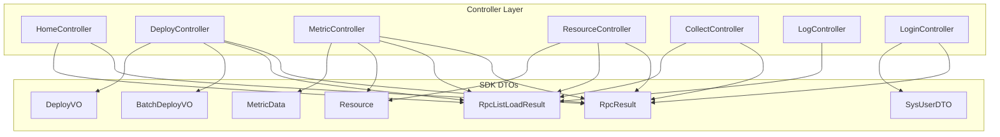

**Diagram sources**
- [HomeController.java:24-99](file://watcher-agent/src/main/java/com/virtual/cloud/om/agent/controller/HomeController.java#L24-L99)
- [DeployController.java:32-324](file://watcher-agent/src/main/java/com/virtual/cloud/om/agent/controller/DeployController.java#L32-L324)
- [MetricController.java:30-270](file://watcher-agent/src/main/java/com/virtual/cloud/om/agent/controller/MetricController.java#L30-L270)
- [ResourceController.java:24-234](file://watcher-agent/src/main/java/com/virtual/cloud/om/agent/controller/ResourceController.java#L24-L234)
- [CollectController.java:27-66](file://watcher-agent/src/main/java/com/virtual/cloud/om/agent/controller/CollectController.java#L27-L66)
- [LogController.java:20-35](file://watcher-agent/src/main/java/com/virtual/cloud/om/agent/controller/LogController.java#L20-L35)
- [LoginController.java:13-91](file://watcher-agent/src/main/java/com/virtual/cloud/om/agent/controller/LoginController.java#L13-L91)
- [RpcResult.java:3-87](file://watcher-sdk/src/main/java/com/virtual/cloud/om/sdk/dto/RpcResult.java#L3-L87)
- [RpcListLoadResult.java:10-56](file://watcher-sdk/src/main/java/com/virtual/cloud/om/sdk/dto/RpcListLoadResult.java#L10-L56)
- [Resource.java:14-56](file://watcher-sdk/src/main/java/com/virtual/cloud/om/sdk/entity/mysql/Resource.java#L14-L56)
- [MetricData.java:14-42](file://watcher-sdk/src/main/java/com/virtual/cloud/om/sdk/entity/mysql/MetricData.java#L14-L42)
- [BatchDeployVO.java:14-38](file://watcher-sdk/src/main/java/com/virtual/cloud/om/sdk/dto/deploy/BatchDeployVO.java#L14-L38)
- [DeployVO.java:10-33](file://watcher-sdk/src/main/java/com/virtual/cloud/om/sdk/dto/deploy/DeployVO.java#L10-L33)
- [SysUserDTO.java:12-26](file://watcher-sdk/src/main/java/com/virtual/cloud/om/sdk/dto/SysUserDTO.java#L12-L26)

**Section sources**
- [HomeController.java:24-99](file://watcher-agent/src/main/java/com/virtual/cloud/om/agent/controller/HomeController.java#L24-L99)
- [DeployController.java:32-324](file://watcher-agent/src/main/java/com/virtual/cloud/om/agent/controller/DeployController.java#L32-L324)
- [MetricController.java:30-270](file://watcher-agent/src/main/java/com/virtual/cloud/om/agent/controller/MetricController.java#L30-L270)
- [ResourceController.java:24-234](file://watcher-agent/src/main/java/com/virtual/cloud/om/agent/controller/ResourceController.java#L24-L234)
- [CollectController.java:27-66](file://watcher-agent/src/main/java/com/virtual/cloud/om/agent/controller/CollectController.java#L27-L66)
- [LogController.java:20-35](file://watcher-agent/src/main/java/com/virtual/cloud/om/agent/controller/LogController.java#L20-L35)
- [LoginController.java:13-91](file://watcher-agent/src/main/java/com/virtual/cloud/om/agent/controller/LoginController.java#L13-L91)

## Core Components
This section summarizes each controller’s responsibilities and primary endpoints.

- HomeController
  - Purpose: Application health, parameter editing, log query/delete, and integration tests against Workspace/CAS services.
  - Key endpoints:
    - GET / -> Hello world and active properties
    - GET /workspace/desktoppools?host&protocol&port -> Fetch desktop pools from Workspace
    - GET /cas/hosts?platform&host&protocol&port&username&password -> Fetch hosts from CAS
    - POST /parameter -> Edit parameter by type/name
    - GET /log -> Query operation logs with filters
    - DELETE /log?time&per -> Delete logs before a timestamp
    - GET /enableKafkaDebug?ip -> Toggle Kafka debug (disabled)

- DeployController
  - Purpose: Multi-node/single-node deployment, component management, application refresh, host/network/route configuration, and step tracking.
  - Key endpoints:
    - POST /deploy/batch -> Batch deploy
    - POST /deploy/single -> Single-node deploy
    - GET /deploy -> Query deployment status
    - PUT /deploy/manage -> Component manage
    - GET /deploy/refresh -> Refresh Spring Boot app
    - GET /deploy/host -> Query host info
    - GET /deploy/localIps -> List local IPs
    - PUT /deploy/keepalived/notify/{masterOrBackup} -> Keepalived notify
    - PUT /deploy/step -> Update deployment step
    - GET /deploy/network -> Get network info
    - POST /deploy/network -> Add network info and restart network service
    - PUT /deploy/network -> Edit network info and restart remotely
    - GET /deploy/network/master -> Check master node network config file
    - GET /deploy/network/config/nodes -> Get all nodes’ network configs
    - GET /deploy/network/config/node?nodeName -> Get specific node’s network config
    - GET /deploy/network/wifis -> List available Wi-Fi networks
    - POST /deploy/route/add/check -> Test ping for adding route
    - POST /deploy/route/edit/check -> Test ping for editing route
    - POST /deploy/route/check -> General route ping check
    - GET /deploy/route -> List routes
    - POST /deploy/route -> Add route
    - PUT /deploy/route -> Edit route
    - DELETE /deploy/route -> Delete route

- MetricController
  - Purpose: Retrieve supported metric/platform types, list metrics with optional real-time collection, fetch latest metrics per resource, trend queries, report metrics, and compute summaries.
  - Key endpoints:
    - GET /metric/types -> Supported metric types
    - GET /metric/platforms -> Supported platforms
    - GET /metric/list?resourceId&platform&metricType&startTime&endTime&page&size -> List metrics; optionally collect real-time
    - GET /metric/latest/{resourceId} -> Latest metrics for all types
    - GET /metric/trend/{resourceId}/{metricType}?hours= -> Trend over time
    - POST /metric/report -> Report metrics
    - GET /metric/summary/{resourceId} -> Summary stats for a resource

- ResourceController
  - Purpose: Manage resources (create/update/delete/query/detail), toggle usability and remote access, and batch creation.
  - Key endpoints:
    - GET /resource/list?platform&resourceName&ipAddress&page&size -> List resources
    - GET /resource/detail/{id} -> Resource detail
    - POST /resource/create -> Create resource
    - POST /resource/batchCreate -> Batch create/update resources
    - PUT /resource/update -> Update resource
    - DELETE /resource/delete/{id} -> Delete resource
    - PUT /resource/usable/{id}?usable= -> Toggle usable flag
    - PUT /resource/remote/{id}?remote= -> Toggle remote SSH capability

- CollectController
  - Purpose: Demonstration endpoints for coordinating real-time log strategies, resource synchronization, and batch deployments.
  - Key endpoints:
    - POST /collect/realtime-log -> Dispatch real-time log strategies
    - POST /collect/resources -> Sync resources via ResourceService
    - POST /collect/batch -> Trigger batch deployment

- LogController
  - Purpose: Online log search across platforms and resources.
  - Key endpoint:
    - POST /log/search -> Search logs with filters and time range

- LoginController
  - Purpose: User authentication, logout, and password complexity query.
  - Key endpoints:
    - POST /user/login -> Authenticate and issue token
    - PUT /user/modifyUser -> Modify user attributes
    - POST /user/logout -> Logout current session
    - GET /user/search/complexity -> Query password complexity policy

Response envelopes:
- RpcResult<T>: success/fail/partialSuccess/error with state, message, and optional data
- RpcListLoadResult<T>: success/fail with paginated list data

**Section sources**
- [HomeController.java:52-97](file://watcher-agent/src/main/java/com/virtual/cloud/om/agent/controller/HomeController.java#L52-L97)
- [DeployController.java:46-323](file://watcher-agent/src/main/java/com/virtual/cloud/om/agent/controller/DeployController.java#L46-L323)
- [MetricController.java:46-269](file://watcher-agent/src/main/java/com/virtual/cloud/om/agent/controller/MetricController.java#L46-L269)
- [ResourceController.java:34-233](file://watcher-agent/src/main/java/com/virtual/cloud/om/agent/controller/ResourceController.java#L34-L233)
- [CollectController.java:45-65](file://watcher-agent/src/main/java/com/virtual/cloud/om/agent/controller/CollectController.java#L45-L65)
- [LogController.java:27-34](file://watcher-agent/src/main/java/com/virtual/cloud/om/agent/controller/LogController.java#L27-L34)
- [LoginController.java:25-90](file://watcher-agent/src/main/java/com/virtual/cloud/om/agent/controller/LoginController.java#L25-L90)
- [RpcResult.java:15-45](file://watcher-sdk/src/main/java/com/virtual/cloud/om/sdk/dto/RpcResult.java#L15-L45)
- [RpcListLoadResult.java:40-46](file://watcher-sdk/src/main/java/com/virtual/cloud/om/sdk/dto/RpcListLoadResult.java#L40-L46)

## Architecture Overview
The controllers expose REST endpoints and delegate to services/mappers or external REST connections. Responses are standardized via RpcResult/RpcListLoadResult.

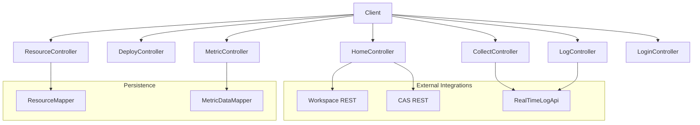

**Diagram sources**
- [HomeController.java:52-97](file://watcher-agent/src/main/java/com/virtual/cloud/om/agent/controller/HomeController.java#L52-L97)
- [DeployController.java:38-42](file://watcher-agent/src/main/java/com/virtual/cloud/om/agent/controller/DeployController.java#L38-L42)
- [MetricController.java:37-44](file://watcher-agent/src/main/java/com/virtual/cloud/om/agent/controller/MetricController.java#L37-L44)
- [ResourceController.java:31-32](file://watcher-agent/src/main/java/com/virtual/cloud/om/agent/controller/ResourceController.java#L31-L32)
- [CollectController.java:32-39](file://watcher-agent/src/main/java/com/virtual/cloud/om/agent/controller/CollectController.java#L32-L39)
- [LogController.java:24-25](file://watcher-agent/src/main/java/com/virtual/cloud/om/agent/controller/LogController.java#L24-L25)

## Detailed Component Analysis

### HomeController
Responsibilities:
- Health and property inspection
- Parameter editing and persistence
- Operation log query and cleanup
- Integration testing against Workspace and CAS services

Endpoints and behaviors:
- GET /
  - Returns a greeting and active properties
- GET /workspace/desktoppools
  - Parameters: host, protocol, port
  - Calls Workspace REST to list desktop pools
- GET /cas/hosts
  - Parameters: platform, host, protocol, port, username, password
  - Calls CAS REST to list hosts
- POST /parameter
  - Body: Parameter (type, name, value)
  - Updates parameter and returns current value
- GET /log
  - Query: OperationLog filters
  - Returns paginated operation logs
- DELETE /log
  - Query: time (before which to delete), per (persist flag)
  - Deletes logs and returns count removed

Error handling:
- Exceptions are caught and mapped to failure responses; informational logging is performed

Typical usage:
- Health checks and diagnostics
- Parameter tuning during deployment
- Log maintenance and troubleshooting

**Section sources**
- [HomeController.java:52-97](file://watcher-agent/src/main/java/com/virtual/cloud/om/agent/controller/HomeController.java#L52-L97)

### DeployController
Responsibilities:
- Orchestrates multi-node and single-node deployments
- Manages component lifecycle and application refresh
- Configures local and remote networking and routes
- Tracks deployment steps and exposes host/network/route operations

Key endpoints:
- POST /deploy/batch
  - Body: BatchDeployVO
  - Validates mask default; triggers deployment and updates step
- POST /deploy/single
  - Body: DeployVO
  - Deploys master node and updates step
- GET /deploy
  - Returns deployment status list
- PUT /deploy/manage
  - Body: ComponentManage
  - Manages components
- GET /deploy/refresh
  - Recreates Spring context asynchronously
- GET /deploy/host
  - Returns host info
- GET /deploy/localIps
  - Returns local IP addresses
- PUT /deploy/keepalived/notify/{masterOrBackup}
  - Logs role transitions
- PUT /deploy/step
  - Body: UpdateStepDTO
  - Updates data center step
- GET/POST/PUT /deploy/network
  - Adds/edits network info, restarts network, configures DNS and routing, persists config to file
- GET /deploy/network/master
  - Reads persisted network config file
- GET /deploy/network/config/nodes
  - Lists all nodes’ network configs
- GET /deploy/network/config/node?nodeName
  - Returns specific node’s network config
- GET /deploy/network/wifis
  - Scans and lists Wi-Fi networks
- POST /deploy/route/*
  - Ping checks for route operations
- GET/POST/PUT/DELETE /deploy/route
  - Route list, add, edit, delete

Validation and error handling:
- Uses masks defaults, validates gateway presence for strategy routes
- Catches exceptions and updates step/status accordingly
- Returns localized messages via StringManager

Integration scenarios:
- Automated deployment pipelines
- Network reconfiguration after provisioning
- Failover notification handling

**Section sources**
- [DeployController.java:46-323](file://watcher-agent/src/main/java/com/virtual/cloud/om/agent/controller/DeployController.java#L46-L323)

### MetricController
Responsibilities:
- Exposes metric metadata (types, platforms)
- Retrieves metric lists with optional real-time collection
- Provides latest metrics per resource and trends
- Accepts metric reports and computes summaries

Endpoints:
- GET /metric/types
  - Returns supported metric types with metadata
- GET /metric/platforms
  - Returns supported platforms
- GET /metric/list
  - Query params: resourceId, platform, metricType, startTime, endTime, page, size
  - If resourceId and metricType provided, collects real-time data via DataReportService
  - Otherwise, queries metric_data table with filters and pagination
- GET /metric/latest/{resourceId}
  - Returns latest metric for each type for the given resource
- GET /metric/trend/{resourceId}/{metricType}?hours=
  - Returns ordered trend data for the last N hours
- POST /metric/report
  - Body: List<MetricData>
  - Inserts metrics with generated IDs and timestamps
- GET /metric/summary/{resourceId}
  - Returns total count and last report time for a resource

Data models:
- MetricData: maps to metric_data table
- Resource: maps to resource table

Validation and error handling:
- Filters applied to queries; empty results handled gracefully
- Real-time collection errors logged and suppressed to avoid breaking list

Example usage:
- Dashboard widgets querying latest metrics
- Historical trend visualization
- Batch metric ingestion from agents

**Section sources**
- [MetricController.java:46-269](file://watcher-agent/src/main/java/com/virtual/cloud/om/agent/controller/MetricController.java#L46-L269)
- [MetricData.java:14-42](file://watcher-sdk/src/main/java/com/virtual/cloud/om/sdk/entity/mysql/MetricData.java#L14-L42)
- [Resource.java:14-56](file://watcher-sdk/src/main/java/com/virtual/cloud/om/sdk/entity/mysql/Resource.java#L14-L56)

### ResourceController
Responsibilities:
- Full CRUD for resources
- Toggle usability and remote access
- Batch creation with upsert semantics
- Secure credential handling

Endpoints:
- GET /resource/list
  - Query params: platform, resourceName, ipAddress, page, size
  - Filters and sorts by creation time
- GET /resource/detail/{id}
  - Returns resource or failure if not found
- POST /resource/create
  - Body: ResourceDTO
  - Encrypts sensitive fields and inserts
- POST /resource/batchCreate
  - Body: List<ResourceDTO>
  - Upserts resources
- PUT /resource/update
  - Body: ResourceDTO
  - Partial updates with encryption
- DELETE /resource/delete/{id}
  - Removes resource
- PUT /resource/usable/{id}?usable=
  - Toggles usable flag
- PUT /resource/remote/{id}?remote=
  - Toggles remote SSH capability and clears end time when disabling

Security:
- Credentials encrypted before persistence

**Section sources**
- [ResourceController.java:34-233](file://watcher-agent/src/main/java/com/virtual/cloud/om/agent/controller/ResourceController.java#L34-L233)

### CollectController
Responsibilities:
- Demonstrates coordination for real-time log strategies, resource sync, and batch deployments
- Delegates to ResourceService and DeployApi

Endpoints:
- POST /collect/realtime-log
  - Body: List<RealTimeLogStrategyRequest>
  - Dispatches strategies via RealTimeLogApi
- POST /collect/resources
  - Body: List<ResourceDTO>
  - Synchronizes resources via ResourceService
- POST /collect/batch
  - Body: BatchDeployVO
  - Triggers batch deployment with default mask

**Section sources**
- [CollectController.java:45-65](file://watcher-agent/src/main/java/com/virtual/cloud/om/agent/controller/CollectController.java#L45-L65)

### LogController
Responsibilities:
- Online log search across platforms and resources

Endpoint:
- POST /log/search
  - Body: ExportLogReq
  - Calls RealTimeLogApi.searchAll with platform, resource ID, type, target ID, path, query, time window, sort field, number of logs, and level

**Section sources**
- [LogController.java:27-34](file://watcher-agent/src/main/java/com/virtual/cloud/om/agent/controller/LogController.java#L27-L34)

### LoginController
Responsibilities:
- User authentication, logout, and password complexity query

Endpoints:
- POST /user/login
  - Body: SysUserDTO
  - Authenticates and returns token in RpcResult
- PUT /user/modifyUser
  - Body: ModifyUser
  - Updates user attributes
- POST /user/logout
  - Ends current session
- GET /user/search/complexity
  - Returns password complexity policy value

**Section sources**
- [LoginController.java:25-90](file://watcher-agent/src/main/java/com/virtual/cloud/om/agent/controller/LoginController.java#L25-L90)
- [SysUserDTO.java:12-26](file://watcher-sdk/src/main/java/com/virtual/cloud/om/sdk/dto/SysUserDTO.java#L12-L26)

## Architecture Overview

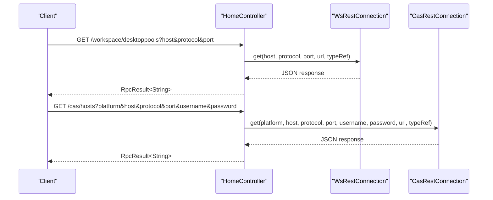

**Diagram sources**
- [HomeController.java:52-65](file://watcher-agent/src/main/java/com/virtual/cloud/om/agent/controller/HomeController.java#L52-L65)

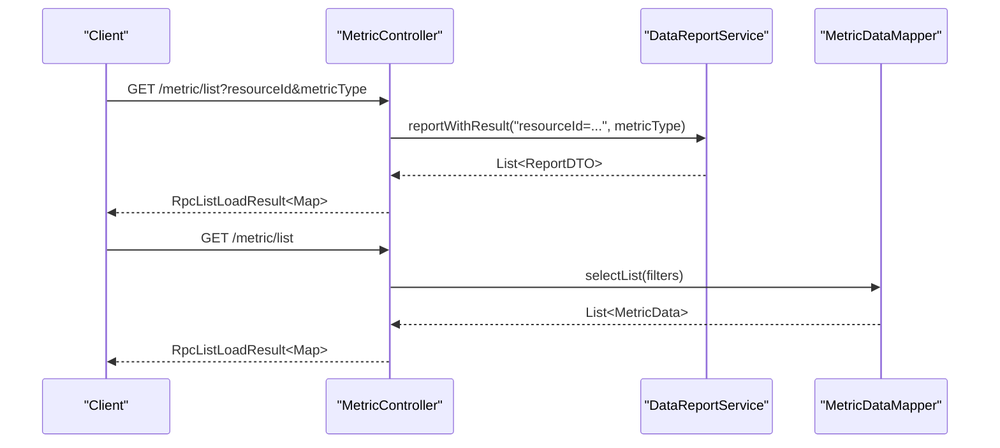

**Diagram sources**
- [MetricController.java:77-161](file://watcher-agent/src/main/java/com/virtual/cloud/om/agent/controller/MetricController.java#L77-L161)
- [MetricData.java:14-42](file://watcher-sdk/src/main/java/com/virtual/cloud/om/sdk/entity/mysql/MetricData.java#L14-L42)

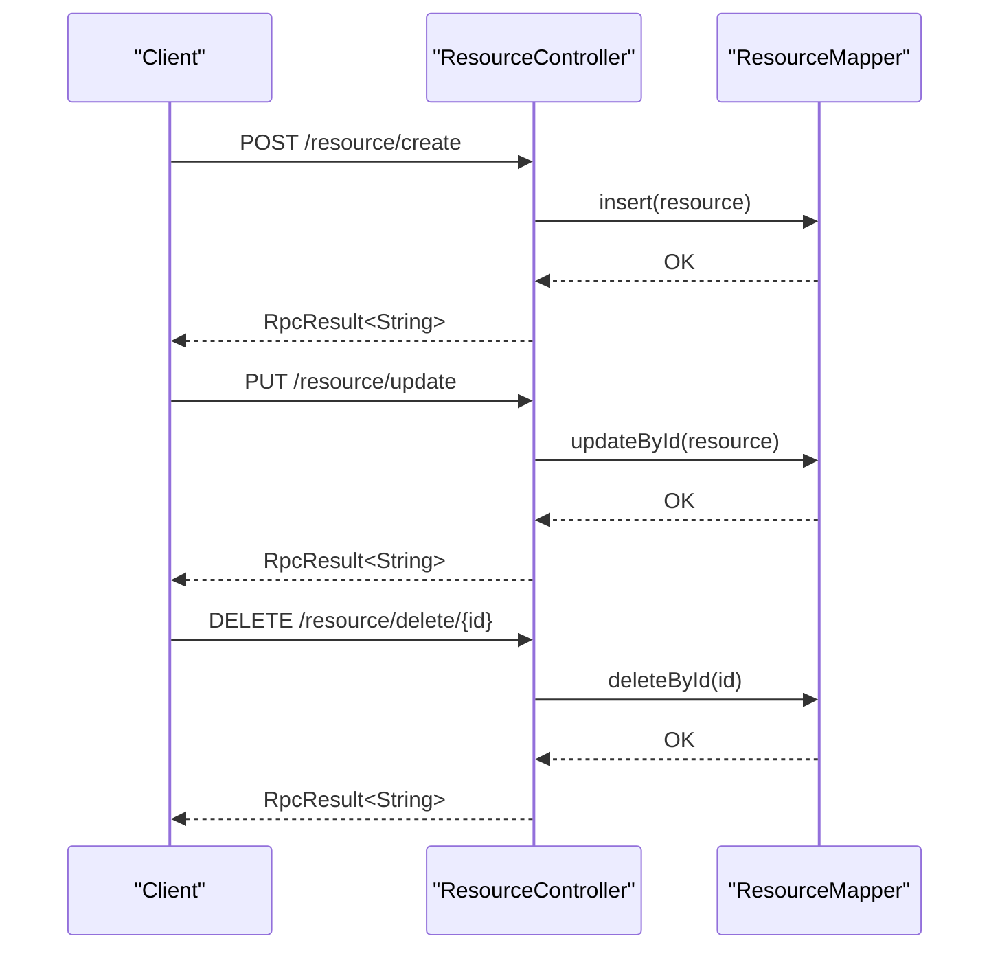

**Diagram sources**
- [ResourceController.java:67-196](file://watcher-agent/src/main/java/com/virtual/cloud/om/agent/controller/ResourceController.java#L67-L196)
- [Resource.java:14-56](file://watcher-sdk/src/main/java/com/virtual/cloud/om/sdk/entity/mysql/Resource.java#L14-L56)

## Detailed Component Analysis

### HomeController Analysis
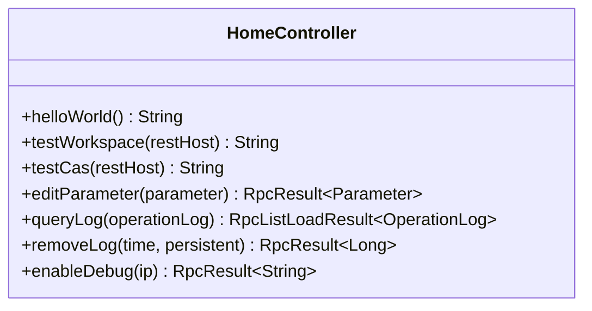

**Diagram sources**
- [HomeController.java:24-99](file://watcher-agent/src/main/java/com/virtual/cloud/om/agent/controller/HomeController.java#L24-L99)

**Section sources**
- [HomeController.java:52-97](file://watcher-agent/src/main/java/com/virtual/cloud/om/agent/controller/HomeController.java#L52-L97)

### DeployController Analysis
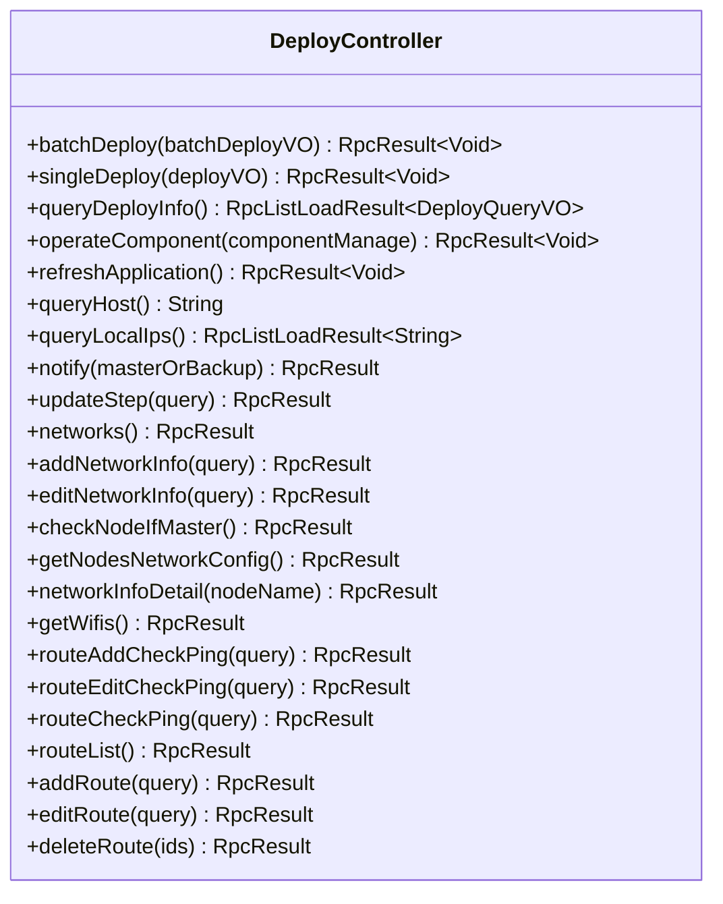

**Diagram sources**
- [DeployController.java:32-324](file://watcher-agent/src/main/java/com/virtual/cloud/om/agent/controller/DeployController.java#L32-L324)

**Section sources**
- [DeployController.java:46-323](file://watcher-agent/src/main/java/com/virtual/cloud/om/agent/controller/DeployController.java#L46-L323)

### MetricController Analysis
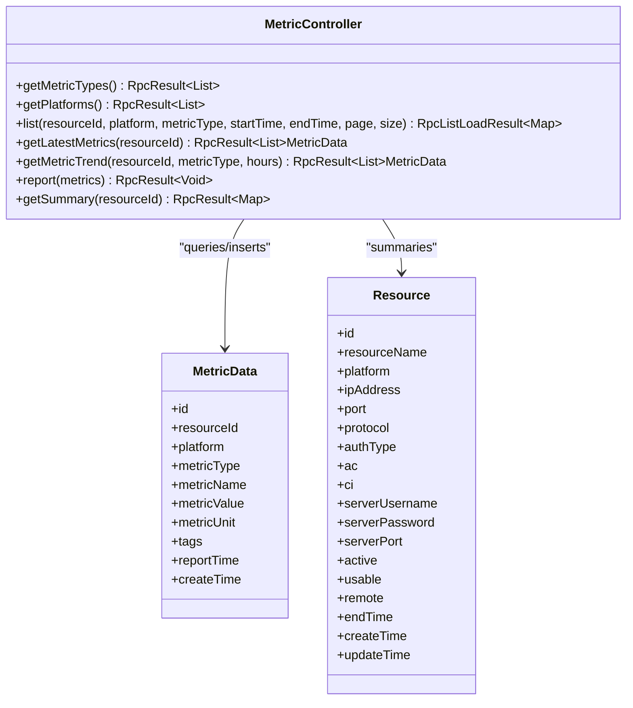

**Diagram sources**
- [MetricController.java:30-270](file://watcher-agent/src/main/java/com/virtual/cloud/om/agent/controller/MetricController.java#L30-L270)
- [MetricData.java:14-42](file://watcher-sdk/src/main/java/com/virtual/cloud/om/sdk/entity/mysql/MetricData.java#L14-L42)
- [Resource.java:14-56](file://watcher-sdk/src/main/java/com/virtual/cloud/om/sdk/entity/mysql/Resource.java#L14-L56)

**Section sources**
- [MetricController.java:46-269](file://watcher-agent/src/main/java/com/virtual/cloud/om/agent/controller/MetricController.java#L46-L269)

### ResourceController Analysis
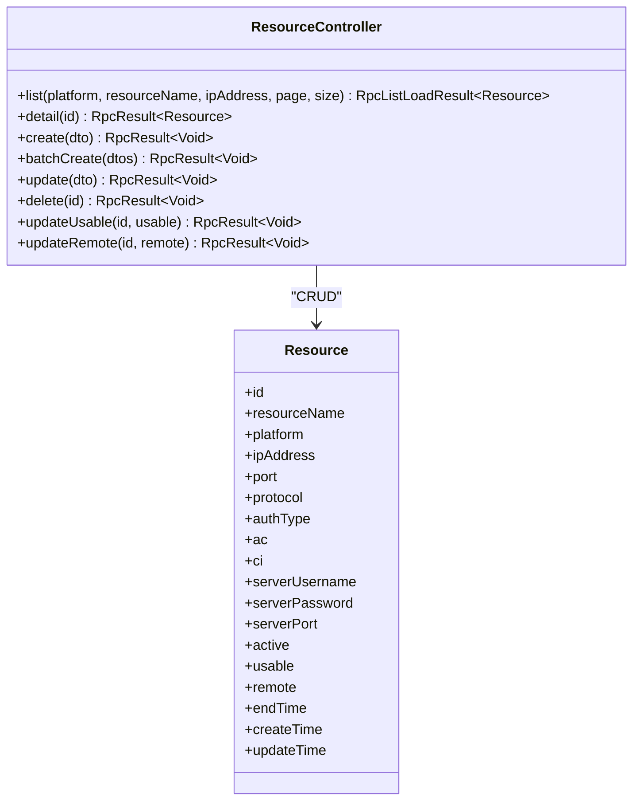

**Diagram sources**
- [ResourceController.java:24-234](file://watcher-agent/src/main/java/com/virtual/cloud/om/agent/controller/ResourceController.java#L24-L234)
- [Resource.java:14-56](file://watcher-sdk/src/main/java/com/virtual/cloud/om/sdk/entity/mysql/Resource.java#L14-L56)

**Section sources**
- [ResourceController.java:34-233](file://watcher-agent/src/main/java/com/virtual/cloud/om/agent/controller/ResourceController.java#L34-L233)

### CollectController Analysis
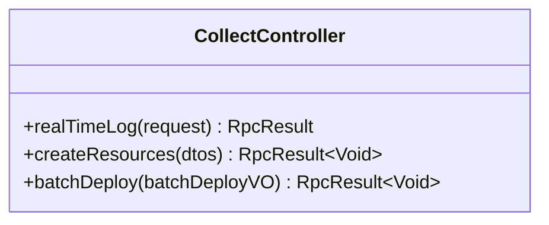

**Diagram sources**
- [CollectController.java:27-66](file://watcher-agent/src/main/java/com/virtual/cloud/om/agent/controller/CollectController.java#L27-L66)

**Section sources**
- [CollectController.java:45-65](file://watcher-agent/src/main/java/com/virtual/cloud/om/agent/controller/CollectController.java#L45-L65)

### LogController Analysis
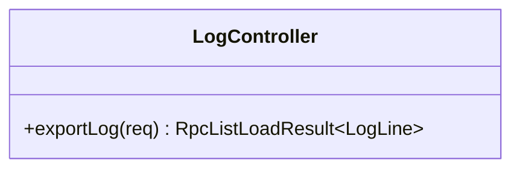

**Diagram sources**
- [LogController.java:20-35](file://watcher-agent/src/main/java/com/virtual/cloud/om/agent/controller/LogController.java#L20-L35)

**Section sources**
- [LogController.java:27-34](file://watcher-agent/src/main/java/com/virtual/cloud/om/agent/controller/LogController.java#L27-L34)

### LoginController Analysis
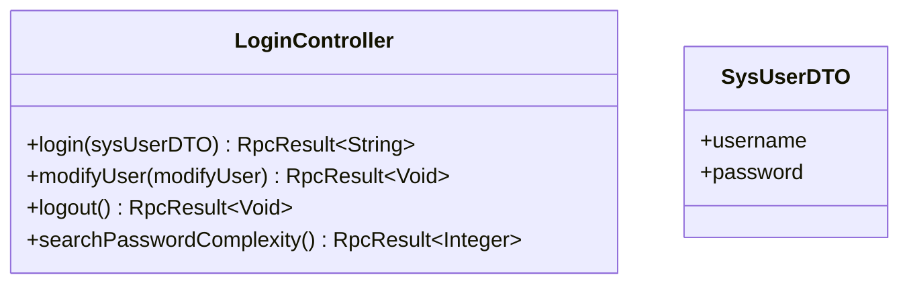

**Diagram sources**
- [LoginController.java:13-91](file://watcher-agent/src/main/java/com/virtual/cloud/om/agent/controller/LoginController.java#L13-L91)
- [SysUserDTO.java:12-26](file://watcher-sdk/src/main/java/com/virtual/cloud/om/sdk/dto/SysUserDTO.java#L12-L26)

**Section sources**
- [LoginController.java:25-90](file://watcher-agent/src/main/java/com/virtual/cloud/om/agent/controller/LoginController.java#L25-L90)

## Dependency Analysis
Controllers depend on:
- SDK DTOs for request/response modeling
- Mappers for persistence
- External REST clients for Workspace/CAS integrations
- Services for business logic (e.g., DataReportService, ResourceService)

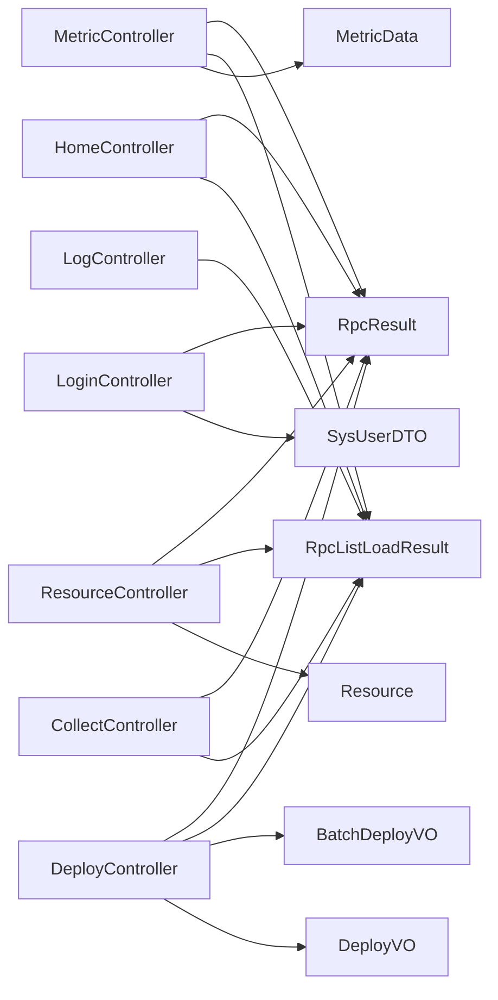

**Diagram sources**
- [RpcResult.java:3-87](file://watcher-sdk/src/main/java/com/virtual/cloud/om/sdk/dto/RpcResult.java#L3-L87)
- [RpcListLoadResult.java:10-56](file://watcher-sdk/src/main/java/com/virtual/cloud/om/sdk/dto/RpcListLoadResult.java#L10-L56)
- [MetricData.java:14-42](file://watcher-sdk/src/main/java/com/virtual/cloud/om/sdk/entity/mysql/MetricData.java#L14-L42)
- [Resource.java:14-56](file://watcher-sdk/src/main/java/com/virtual/cloud/om/sdk/entity/mysql/Resource.java#L14-L56)
- [BatchDeployVO.java:14-38](file://watcher-sdk/src/main/java/com/virtual/cloud/om/sdk/dto/deploy/BatchDeployVO.java#L14-L38)
- [DeployVO.java:10-33](file://watcher-sdk/src/main/java/com/virtual/cloud/om/sdk/dto/deploy/DeployVO.java#L10-L33)
- [SysUserDTO.java:12-26](file://watcher-sdk/src/main/java/com/virtual/cloud/om/sdk/dto/SysUserDTO.java#L12-L26)

**Section sources**
- [HomeController.java:24-99](file://watcher-agent/src/main/java/com/virtual/cloud/om/agent/controller/HomeController.java#L24-L99)
- [DeployController.java:32-324](file://watcher-agent/src/main/java/com/virtual/cloud/om/agent/controller/DeployController.java#L32-L324)
- [MetricController.java:30-270](file://watcher-agent/src/main/java/com/virtual/cloud/om/agent/controller/MetricController.java#L30-L270)
- [ResourceController.java:24-234](file://watcher-agent/src/main/java/com/virtual/cloud/om/agent/controller/ResourceController.java#L24-L234)
- [CollectController.java:27-66](file://watcher-agent/src/main/java/com/virtual/cloud/om/agent/controller/CollectController.java#L27-L66)
- [LogController.java:20-35](file://watcher-agent/src/main/java/com/virtual/cloud/om/agent/controller/LogController.java#L20-L35)
- [LoginController.java:13-91](file://watcher-agent/src/main/java/com/virtual/cloud/om/agent/controller/LoginController.java#L13-L91)

## Performance Considerations
- Pagination: Use page and size parameters on list endpoints to limit payload sizes
- Filtering: Apply filters (resourceId, platform, metricType, time range) to reduce dataset sizes
- Real-time collection: Prefer cached data when available; use targeted metricType/resourceId combinations
- Batch operations: Use batchCreate for bulk resource updates to minimize round-trips
- Network operations: Network configuration and route changes may trigger OS-level restarts; schedule during maintenance windows

## Troubleshooting Guide
Common issues and resolutions:
- Authentication failures
  - Verify credentials and token issuance via LoginController
  - Check localized error messages returned in RpcResult
- Parameter edits
  - Ensure type/name uniqueness and correct values when calling POST /parameter
- Metric retrieval
  - Confirm resourceId and metricType correctness for real-time collection
  - Validate time formats for startTime/endTime
- Resource operations
  - Ensure required fields are present; encrypted fields are handled automatically
- Deployment steps
  - Use PUT /deploy/step to reset or advance step after failures
- Network/route configuration
  - Validate gateway presence for strategy routes
  - Check network service restart outcomes and adjust masks/DNS as needed

**Section sources**
- [LoginController.java:25-90](file://watcher-agent/src/main/java/com/virtual/cloud/om/agent/controller/LoginController.java#L25-L90)
- [MetricController.java:77-161](file://watcher-agent/src/main/java/com/virtual/cloud/om/agent/controller/MetricController.java#L77-L161)
- [ResourceController.java:67-196](file://watcher-agent/src/main/java/com/virtual/cloud/om/agent/controller/ResourceController.java#L67-L196)
- [DeployController.java:133-180](file://watcher-agent/src/main/java/com/virtual/cloud/om/agent/controller/DeployController.java#L133-L180)

## Conclusion
The controller layer provides a cohesive REST interface for ShowTime’s monitoring platform, covering deployment, metrics, resources, logging, and authentication. Standardized response envelopes simplify client integration, while robust error handling and validation improve reliability. Following the documented patterns ensures predictable behavior and efficient operations across the platform.