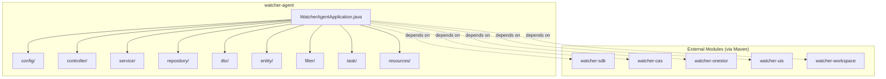
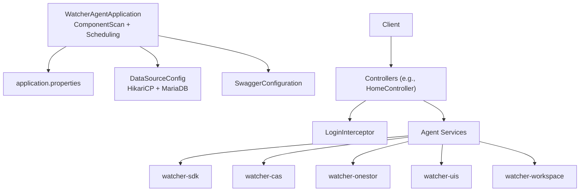
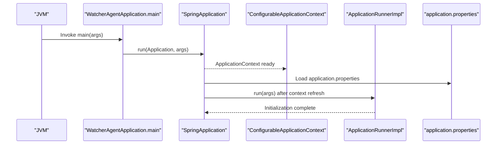
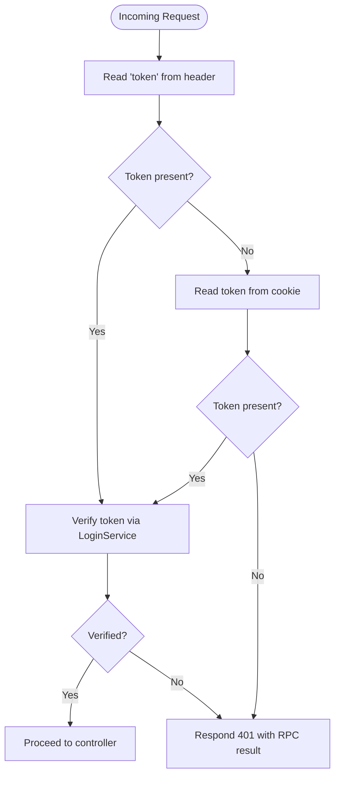
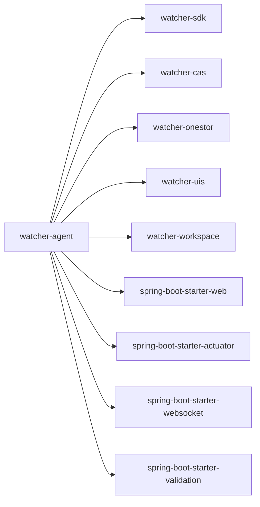

# Core Application Architecture

<cite>
**Referenced Files in This Document**
- [WatcherAgentApplication.java](file://watcher-agent/src/main/java/com/virtual/cloud/om/agent/WatcherAgentApplication.java)
- [ApplicationRunnerImpl.java](file://watcher-agent/src/main/java/com/virtual/cloud/om/agent/config/ApplicationRunnerImpl.java)
- [SwaggerConfiguration.java](file://watcher-agent/src/main/java/com/virtual/cloud/om/agent/config/SwaggerConfiguration.java)
- [DataSourceConfig.java](file://watcher-agent/src/main/java/com/virtual/cloud/om/agent/config/DataSourceConfig.java)
- [quartz.properties](file://watcher-agent/src/main/resources/quartz.properties)
- [application.properties](file://watcher-agent/src/main/resources/application.properties)
- [pom.xml](file://watcher-agent/pom.xml)
- [HomeController.java](file://watcher-agent/src/main/java/com/virtual/cloud/om/agent/controller/HomeController.java)
- [webConfig.java](file://watcher-agent/src/main/java/com/virtual/cloud/om/agent/filter/webConfig.java)
- [LoginInterceptor.java](file://watcher-agent/src/main/java/com/virtual/cloud/om/agent/config/LoginInterceptor.java)
- [DataReportCollectorOverview.java](file://watcher-agent/src/main/java/com/virtual/cloud/om/agent/service/DataReportCollectorOverview.java)
</cite>

## Table of Contents
1. [Introduction](#introduction)
2. [Project Structure](#project-structure)
3. [Core Components](#core-components)
4. [Architecture Overview](#architecture-overview)
5. [Detailed Component Analysis](#detailed-component-analysis)
6. [Dependency Analysis](#dependency-analysis)
7. [Performance Considerations](#performance-considerations)
8. [Troubleshooting Guide](#troubleshooting-guide)
9. [Conclusion](#conclusion)

## Introduction
This document describes the core application architecture of the watcher-agent service. It explains the Spring Boot application configuration, component scanning setup, package organization, and configuration management. It also documents the data source configuration, the current status of Quartz scheduler integration, and the Swagger API documentation setup. Finally, it outlines component scanning patterns for platform-specific modules (CAS, OneStor, UIS, Workspace) and the overall architectural foundation, including application lifecycle, startup sequence, and configuration loading mechanisms.

## Project Structure
The watcher-agent module is a Spring Boot application packaged as a standalone service. It integrates multiple platform-specific modules via Maven dependencies and scans them during application startup. The module’s Java packages are organized by feature and domain (controller, service, repository, dto, entity, filter, config, task), while resources include configuration files, SQL scripts, and logging configurations.

**Diagram sources**
- [WatcherAgentApplication.java:1-30](file://watcher-agent/src/main/java/com/virtual/cloud/om/agent/WatcherAgentApplication.java#L1-L30)
- [pom.xml:24-50](file://watcher-agent/pom.xml#L24-L50)

**Section sources**
- [WatcherAgentApplication.java:1-30](file://watcher-agent/src/main/java/com/virtual/cloud/om/agent/WatcherAgentApplication.java#L1-L30)
- [pom.xml:1-195](file://watcher-agent/pom.xml#L1-L195)

## Core Components
- Application entry point and component scanning:
  - The primary entry point defines the Spring Boot application class, disables Quartz auto-configuration, enables scheduling, and configures component scanning across the agent and multiple platform modules.
- Configuration management:
  - Centralized application properties define server settings, profiles, middleware toggles, plugin endpoints, and database configuration.
- Data source configuration:
  - A HikariCP-based DataSource bean is defined with MariaDB driver and connection pool tuning.
- Swagger API documentation:
  - Swagger 2 with Knife4j is enabled and configured to expose API documentation under a named group targeting a broad package base.
- Interceptor and filters:
  - A global interceptor validates tokens from headers or cookies and delegates verification to a service, excluding specific paths.
- Initialization hooks:
  - An ApplicationRunner initializes agent unique code, system user, step state, and password strategy on first launch.

**Section sources**
- [WatcherAgentApplication.java:14-18](file://watcher-agent/src/main/java/com/virtual/cloud/om/agent/WatcherAgentApplication.java#L14-L18)
- [application.properties:1-80](file://watcher-agent/src/main/resources/application.properties#L1-L80)
- [DataSourceConfig.java:15-46](file://watcher-agent/src/main/java/com/virtual/cloud/om/agent/config/DataSourceConfig.java#L15-L46)
- [SwaggerConfiguration.java:21-37](file://watcher-agent/src/main/java/com/virtual/cloud/om/agent/config/SwaggerConfiguration.java#L21-L37)
- [webConfig.java:11-37](file://watcher-agent/src/main/java/com/virtual/cloud/om/agent/filter/webConfig.java#L11-L37)
- [LoginInterceptor.java:28-73](file://watcher-agent/src/main/java/com/virtual/cloud/om/agent/config/LoginInterceptor.java#L28-L73)
- [ApplicationRunnerImpl.java:24-62](file://watcher-agent/src/main/java/com/virtual/cloud/om/agent/config/ApplicationRunnerImpl.java#L24-L62)

## Architecture Overview
The watcher-agent is a modular Spring Boot service that:
- Scans and loads beans from the agent module and external platform modules (CAS, OneStor, UIS, Workspace) using a custom base package list.
- Exposes REST endpoints via controllers and applies a global interceptor for authentication.
- Manages persistence via a MariaDB-backed MyBatis-Plus configuration.
- Integrates platform services through SDK abstractions and typed DTOs.
- Provides API documentation via Swagger 2 with Knife4j.

**Diagram sources**
- [WatcherAgentApplication.java:14-18](file://watcher-agent/src/main/java/com/virtual/cloud/om/agent/WatcherAgentApplication.java#L14-L18)
- [application.properties:1-80](file://watcher-agent/src/main/resources/application.properties#L1-L80)
- [DataSourceConfig.java:15-46](file://watcher-agent/src/main/java/com/virtual/cloud/om/agent/config/DataSourceConfig.java#L15-L46)
- [SwaggerConfiguration.java:21-37](file://watcher-agent/src/main/java/com/virtual/cloud/om/agent/config/SwaggerConfiguration.java#L21-L37)
- [webConfig.java:11-37](file://watcher-agent/src/main/java/com/virtual/cloud/om/agent/filter/webConfig.java#L11-L37)
- [HomeController.java:24-99](file://watcher-agent/src/main/java/com/virtual/cloud/om/agent/controller/HomeController.java#L24-L99)
- [pom.xml:24-50](file://watcher-agent/pom.xml#L24-L50)

## Detailed Component Analysis

### Application Entry Point and Startup Sequence
- The application class disables Quartz auto-configuration and enables scheduling, sets a custom component scan base package list covering agent and platform modules, and configures MyBatis mapper scanning.
- The main method launches the Spring application context and stores references to arguments and the context for potential downstream use.
- The startup sequence initializes the Spring context, loads property files, creates the DataSource bean, registers Swagger, applies interceptors, and runs ApplicationRunner hooks.

**Diagram sources**
- [WatcherAgentApplication.java:24-27](file://watcher-agent/src/main/java/com/virtual/cloud/om/agent/WatcherAgentApplication.java#L24-L27)
- [ApplicationRunnerImpl.java:39-62](file://watcher-agent/src/main/java/com/virtual/cloud/om/agent/config/ApplicationRunnerImpl.java#L39-L62)
- [application.properties:1-80](file://watcher-agent/src/main/resources/application.properties#L1-L80)

**Section sources**
- [WatcherAgentApplication.java:14-27](file://watcher-agent/src/main/java/com/virtual/cloud/om/agent/WatcherAgentApplication.java#L14-L27)
- [ApplicationRunnerImpl.java:24-62](file://watcher-agent/src/main/java/com/virtual/cloud/om/agent/config/ApplicationRunnerImpl.java#L24-L62)

### Configuration Management
- Profile activation and server settings:
  - The active profile is set via a property, and the server listens on a fixed port with a context path.
- Middleware toggles:
  - Features such as Elasticsearch, Kafka, MongoDB, ClickHouse, and Quartz are disabled by default in the central configuration.
- Plugin endpoints:
  - Base URLs for CAS, UIS, Workspace, and OneStor are defined for cross-module communication.
- Database and MyBatis-Plus:
  - MariaDB JDBC URL, credentials, and driver are configured; MyBatis-Plus mapper locations and type aliases are set for entity scanning.

**Section sources**
- [application.properties:1-80](file://watcher-agent/src/main/resources/application.properties#L1-L80)

### Data Source Configuration
- DataSource bean:
  - HikariCP is configured with explicit JDBC URL, username, driver class, and connection pool sizing and timeouts.
  - Additional MariaDB connection properties are set for SSL, public key retrieval, and timezone.
- Mapper scanning:
  - MyBatis mappers are scanned under the SDK package.

**Section sources**
- [DataSourceConfig.java:15-46](file://watcher-agent/src/main/java/com/virtual/cloud/om/agent/config/DataSourceConfig.java#L15-L46)
- [WatcherAgentApplication.java:18-18](file://watcher-agent/src/main/java/com/virtual/cloud/om/agent/WatcherAgentApplication.java#L18-L18)

### Swagger API Documentation Setup
- Swagger 2 and Knife4j are enabled, importing Bean Validator plugins.
- A named docket exposes APIs under a broad base package and builds documentation with metadata.

**Section sources**
- [SwaggerConfiguration.java:21-47](file://watcher-agent/src/main/java/com/virtual/cloud/om/agent/config/SwaggerConfiguration.java#L21-L47)

### Component Scanning Patterns for Platform Modules
- The application class declares a custom base package list that includes:
  - Agent module packages
  - Platform modules: watcher-onestor, watcher-sdk, watcher-cas, watcher-uis, watcher-workspace
- This ensures controllers, services, repositories, and other components from these modules are discovered and registered in the Spring context.

**Section sources**
- [WatcherAgentApplication.java:14-18](file://watcher-agent/src/main/java/com/virtual/cloud/om/agent/WatcherAgentApplication.java#L14-L18)
- [pom.xml:24-50](file://watcher-agent/pom.xml#L24-L50)

### Authentication Interceptor and Global Filters
- The interceptor attempts to extract a token from the request header; if absent, it reads from a cookie.
- If no token is present, it responds with an unauthorized RPC result.
- If a token exists, it delegates verification to a service and proceeds only if verified.
- The interceptor is registered globally and excludes specific paths such as Swagger UI, health endpoints, and selected API endpoints.

**Diagram sources**
- [LoginInterceptor.java:36-73](file://watcher-agent/src/main/java/com/virtual/cloud/om/agent/config/LoginInterceptor.java#L36-L73)
- [webConfig.java:19-36](file://watcher-agent/src/main/java/com/virtual/cloud/om/agent/filter/webConfig.java#L19-L36)

**Section sources**
- [webConfig.java:11-37](file://watcher-agent/src/main/java/com/virtual/cloud/om/agent/filter/webConfig.java#L11-L37)
- [LoginInterceptor.java:28-99](file://watcher-agent/src/main/java/com/virtual/cloud/om/agent/config/LoginInterceptor.java#L28-L99)

### Quartz Scheduler Integration Status
- The application class disables Quartz auto-configuration, indicating manual or external scheduling is preferred or not currently active.
- A Quartz properties file exists but is sparsely configured; clustering and job store settings are commented or defaulted.
- No Quartz jobs or schedulers are instantiated in the agent module at this time.

**Section sources**
- [WatcherAgentApplication.java:14-16](file://watcher-agent/src/main/java/com/virtual/cloud/om/agent/WatcherAgentApplication.java#L14-L16)
- [quartz.properties:1-45](file://watcher-agent/src/main/resources/quartz.properties#L1-L45)

### API Exposure and Example Controller
- The HomeController demonstrates:
  - Path mappings for testing platform integrations (e.g., Workspace desktop pools, CAS hosts)
  - Parameter binding and REST client usage via SDK connections
  - Logging and parameter management endpoints
- The controller is annotated with a base path and exposes GET/POST endpoints.

**Section sources**
- [HomeController.java:24-99](file://watcher-agent/src/main/java/com/virtual/cloud/om/agent/controller/HomeController.java#L24-L99)

### Data Report Collector Registry
- The DataReportCollectorOverview component collects all DataReportCollector beans and maps them by metric type upon application startup, enabling runtime selection of collectors.

**Section sources**
- [DataReportCollectorOverview.java:22-44](file://watcher-agent/src/main/java/com/virtual/cloud/om/agent/service/DataReportCollectorOverview.java#L22-L44)

## Dependency Analysis
The watcher-agent module depends on several platform modules and core Spring Boot starters. The dependency graph below reflects Maven dependencies declared in the module’s POM.

**Diagram sources**
- [pom.xml:24-108](file://watcher-agent/pom.xml#L24-L108)

**Section sources**
- [pom.xml:1-195](file://watcher-agent/pom.xml#L1-L195)

## Performance Considerations
- Connection pooling:
  - HikariCP is tuned with conservative minimum idle and moderate timeouts; adjust pool size and lifetimes according to workload.
- Scheduling:
  - Quartz auto-configuration is disabled; if scheduling is introduced later, ensure thread pool sizing and job store configuration align with load.
- Interceptor overhead:
  - Token verification occurs per request; caching or efficient token validation strategies can reduce latency.
- Swagger:
  - Knife4j and Swagger 2 are included for development; consider disabling in production to reduce overhead.

## Troubleshooting Guide
- Unauthorized requests:
  - If clients receive 401 responses, verify the presence of a valid token in the header or the designated cookie. Confirm the interceptor exclusions for Swagger and health endpoints.
- Database connectivity:
  - Ensure the MariaDB JDBC URL, credentials, and driver class match the target environment. Check pool configuration and network reachability.
- Property overrides:
  - Confirm the active profile and context path are applied as expected. Validate middleware toggles and plugin endpoint URLs.
- Initialization failures:
  - ApplicationRunner performs one-time initialization tasks. Review logs for exceptions during agent unique code, user, step, and password strategy creation.

**Section sources**
- [LoginInterceptor.java:36-73](file://watcher-agent/src/main/java/com/virtual/cloud/om/agent/config/LoginInterceptor.java#L36-L73)
- [DataSourceConfig.java:15-46](file://watcher-agent/src/main/java/com/virtual/cloud/om/agent/config/DataSourceConfig.java#L15-L46)
- [application.properties:1-80](file://watcher-agent/src/main/resources/application.properties#L1-L80)
- [ApplicationRunnerImpl.java:39-62](file://watcher-agent/src/main/java/com/virtual/cloud/om/agent/config/ApplicationRunnerImpl.java#L39-L62)

## Conclusion
The watcher-agent service is built as a modular Spring Boot application with explicit component scanning across agent and platform modules. Its configuration emphasizes clear separation of concerns, centralized property management, and extensibility through SDK-driven integrations. While Quartz auto-configuration is disabled and Quartz properties are minimal, the application remains ready to adopt scheduling when required. The Swagger setup and interceptor framework support secure and documented API consumption. The initialization hooks ensure baseline data readiness on first launch, and the dependency structure cleanly integrates watcher-sdk and platform modules.