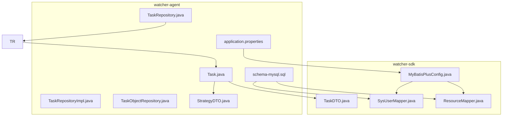
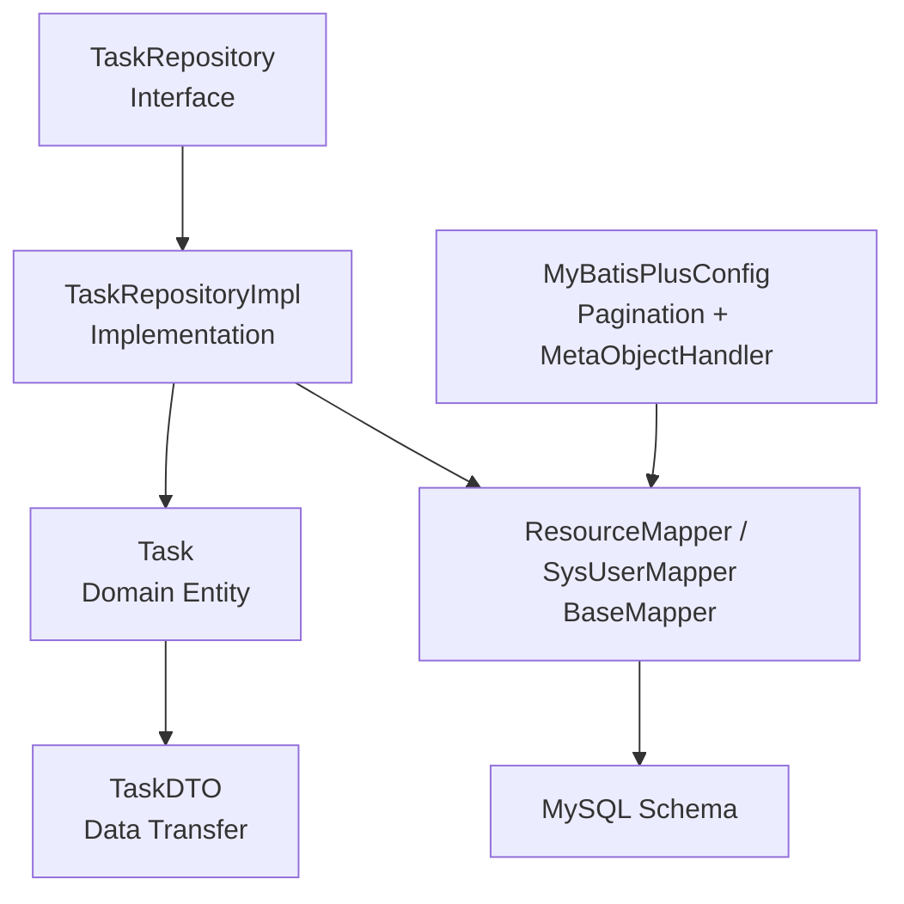
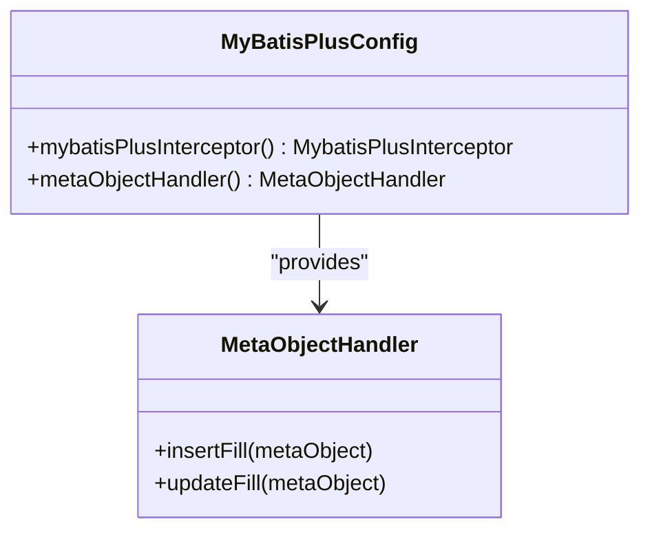
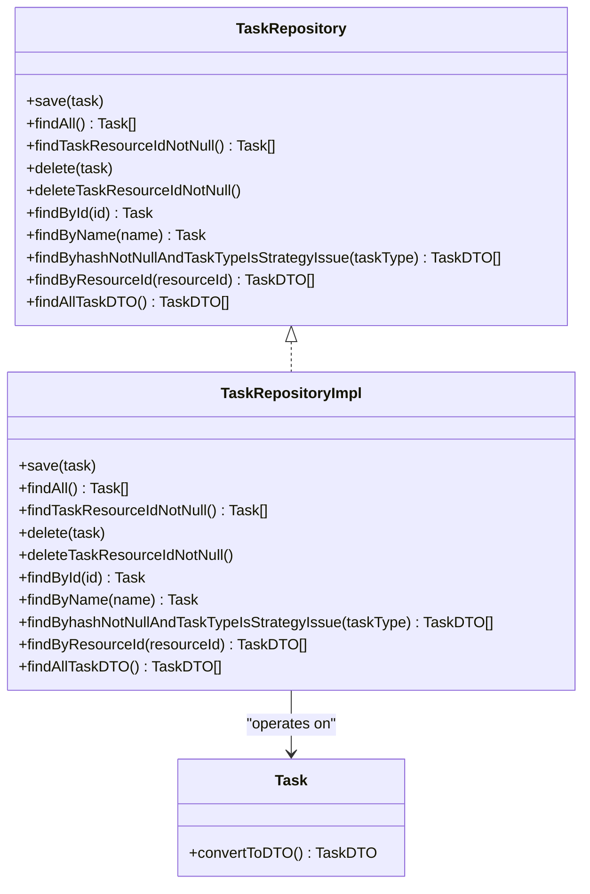
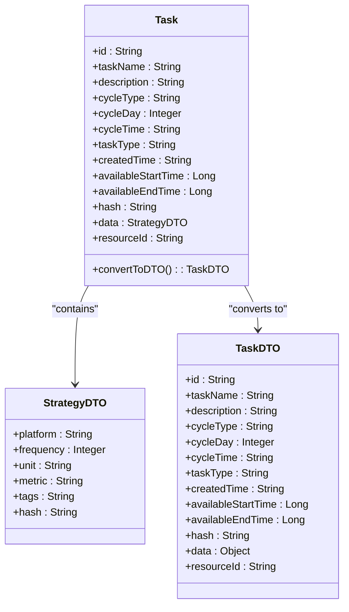
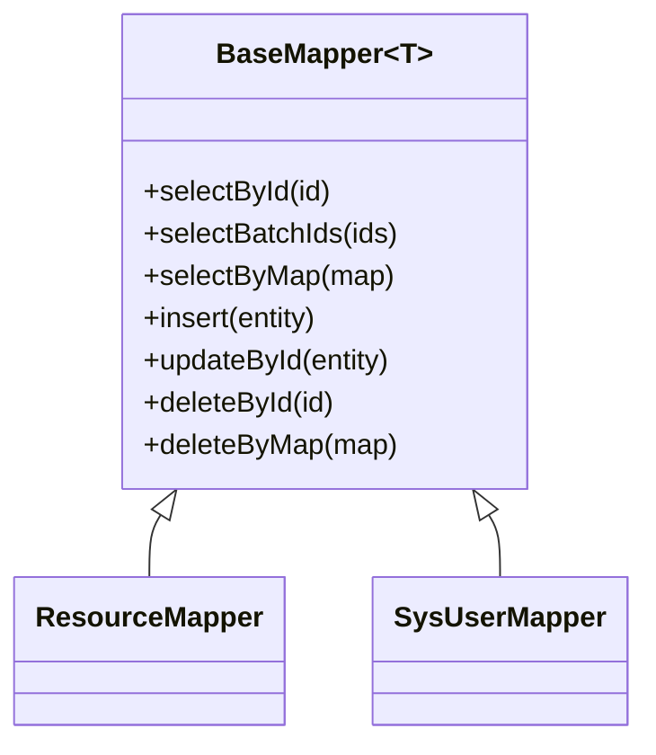
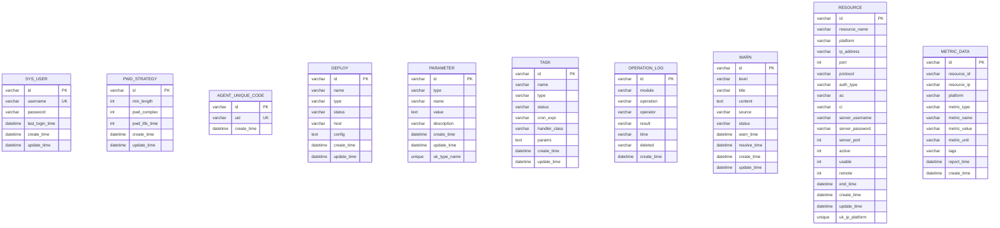
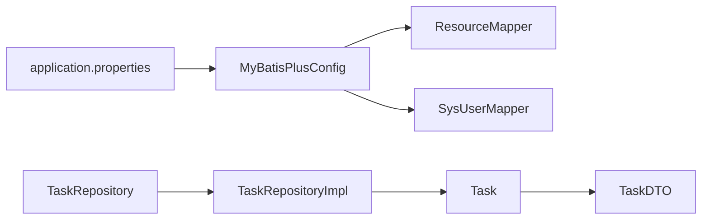

# Data Access Layer

<cite>
**Referenced Files in This Document**
- [application.properties](file://watcher-agent/src/main/resources/application.properties)
- [schema-mysql.sql](file://watcher-agent/src/main/resources/schema-mysql.sql)
- [MyBatisPlusConfig.java](file://watcher-sdk/src/main/java/com/virtual/cloud/om/sdk/config/mybatis/MyBatisPlusConfig.java)
- [TaskRepository.java](file://watcher-agent/src/main/java/com/virtual/cloud/om/agent/repository/TaskRepository.java)
- [TaskRepositoryImpl.java](file://watcher-agent/src/main/java/com/virtual/cloud/om/agent/repository/TaskRepositoryImpl.java)
- [TaskObjectRepository.java](file://watcher-agent/src/main/java/com/virtual/cloud/om/agent/repository/TaskObjectRepository.java)
- [Task.java](file://watcher-agent/src/main/java/com/virtual/cloud/om/agent/entity/Task.java)
- [TaskDTO.java](file://watcher-sdk/src/main/java/com/virtual/cloud/om/sdk/dto/TaskDTO.java)
- [StrategyDTO.java](file://watcher-agent/src/main/java/com/virtual/cloud/om/agent/dto/StrategyDTO.java)
- [ResourceMapper.java](file://watcher-sdk/src/main/java/com/virtual/cloud/om/sdk/mapper/ResourceMapper.java)
- [SysUserMapper.java](file://watcher-sdk/src/main/java/com/virtual/cloud/om/sdk/mapper/SysUserMapper.java)
</cite>

## Table of Contents
1. [Introduction](#introduction)
2. [Project Structure](#project-structure)
3. [Core Components](#core-components)
4. [Architecture Overview](#architecture-overview)
5. [Detailed Component Analysis](#detailed-component-analysis)
6. [Dependency Analysis](#dependency-analysis)
7. [Performance Considerations](#performance-considerations)
8. [Troubleshooting Guide](#troubleshooting-guide)
9. [Conclusion](#conclusion)

## Introduction
This document describes the data access layer that implements repository patterns and entity management using MyBatis Plus. It covers configuration, repository interfaces and custom implementations, entity definitions, data transfer objects (DTOs), and database mapping strategies. It also explains CRUD operations, query optimization, transaction management, data validation, entity relationships, database schema integration, and persistence patterns. Finally, it addresses performance considerations and best practices for data access.

## Project Structure
The data access layer spans two modules:
- watcher-sdk: Shared persistence infrastructure, MyBatis Plus configuration, mappers, and DTOs.
- watcher-agent: Application-specific repository implementations and domain entities.

Key locations:
- MyBatis Plus configuration and interceptors
- Repository interfaces and implementations
- Entities and DTOs
- Database schema initialization script

**Diagram sources**
- [MyBatisPlusConfig.java:1-51](file://watcher-sdk/src/main/java/com/virtual/cloud/om/sdk/config/mybatis/MyBatisPlusConfig.java#L1-L51)
- [ResourceMapper.java:1-14](file://watcher-sdk/src/main/java/com/virtual/cloud/om/sdk/mapper/ResourceMapper.java#L1-L14)
- [SysUserMapper.java:1-14](file://watcher-sdk/src/main/java/com/virtual/cloud/om/sdk/mapper/SysUserMapper.java#L1-L14)
- [TaskRepository.java:1-34](file://watcher-agent/src/main/java/com/virtual/cloud/om/agent/repository/TaskRepository.java#L1-L34)
- [TaskRepositoryImpl.java:1-78](file://watcher-agent/src/main/java/com/virtual/cloud/om/agent/repository/TaskRepositoryImpl.java#L1-L78)
- [TaskObjectRepository.java:1-9](file://watcher-agent/src/main/java/com/virtual/cloud/om/agent/repository/TaskObjectRepository.java#L1-L9)
- [Task.java:1-148](file://watcher-agent/src/main/java/com/virtual/cloud/om/agent/entity/Task.java#L1-L148)
- [TaskDTO.java:1-68](file://watcher-sdk/src/main/java/com/virtual/cloud/om/sdk/dto/TaskDTO.java#L1-L68)
- [StrategyDTO.java:1-42](file://watcher-agent/src/main/java/com/virtual/cloud/om/agent/dto/StrategyDTO.java#L1-L42)
- [application.properties:48-58](file://watcher-agent/src/main/resources/application.properties#L48-L58)
- [schema-mysql.sql:1-204](file://watcher-agent/src/main/resources/schema-mysql.sql#L1-L204)

**Section sources**
- [application.properties:48-58](file://watcher-agent/src/main/resources/application.properties#L48-L58)
- [schema-mysql.sql:1-204](file://watcher-agent/src/main/resources/schema-mysql.sql#L1-L204)

## Core Components
- MyBatis Plus configuration: Provides pagination interceptor and automatic field fill handlers for timestamps.
- Repository interfaces: Define the contract for task-related persistence operations.
- Repository implementations: Provide concrete behavior; in single-DB mode, several operations are intentionally disabled.
- Entities and DTOs: Model domain data and cross-module data transfer.
- Mappers: Extend MyBatis-Plus base mapper for standard CRUD operations.

Key responsibilities:
- Centralized MyBatis Plus configuration and interceptors
- Repository abstraction for task domain
- Automatic creation/update time filling
- Standardized CRUD via mappers

**Section sources**
- [MyBatisPlusConfig.java:1-51](file://watcher-sdk/src/main/java/com/virtual/cloud/om/sdk/config/mybatis/MyBatisPlusConfig.java#L1-L51)
- [TaskRepository.java:1-34](file://watcher-agent/src/main/java/com/virtual/cloud/om/agent/repository/TaskRepository.java#L1-L34)
- [TaskRepositoryImpl.java:1-78](file://watcher-agent/src/main/java/com/virtual/cloud/om/agent/repository/TaskRepositoryImpl.java#L1-L78)
- [Task.java:1-148](file://watcher-agent/src/main/java/com/virtual/cloud/om/agent/entity/Task.java#L1-L148)
- [TaskDTO.java:1-68](file://watcher-sdk/src/main/java/com/virtual/cloud/om/sdk/dto/TaskDTO.java#L1-L68)
- [ResourceMapper.java:1-14](file://watcher-sdk/src/main/java/com/virtual/cloud/om/sdk/mapper/ResourceMapper.java#L1-L14)
- [SysUserMapper.java:1-14](file://watcher-sdk/src/main/java/com/virtual/cloud/om/sdk/mapper/SysUserMapper.java#L1-L14)

## Architecture Overview
The data access layer follows a layered pattern:
- Configuration layer: MyBatis Plus configuration and interceptors
- Persistence layer: Mappers extending BaseMapper for standard CRUD
- Repository layer: Interfaces and implementations for domain-specific operations
- Domain model layer: Entities and DTOs for data transfer

**Diagram sources**
- [MyBatisPlusConfig.java:1-51](file://watcher-sdk/src/main/java/com/virtual/cloud/om/sdk/config/mybatis/MyBatisPlusConfig.java#L1-L51)
- [TaskRepository.java:1-34](file://watcher-agent/src/main/java/com/virtual/cloud/om/agent/repository/TaskRepository.java#L1-L34)
- [TaskRepositoryImpl.java:1-78](file://watcher-agent/src/main/java/com/virtual/cloud/om/agent/repository/TaskRepositoryImpl.java#L1-L78)
- [Task.java:1-148](file://watcher-agent/src/main/java/com/virtual/cloud/om/agent/entity/Task.java#L1-L148)
- [TaskDTO.java:1-68](file://watcher-sdk/src/main/java/com/virtual/cloud/om/sdk/dto/TaskDTO.java#L1-L68)
- [ResourceMapper.java:1-14](file://watcher-sdk/src/main/java/com/virtual/cloud/om/sdk/mapper/ResourceMapper.java#L1-L14)
- [SysUserMapper.java:1-14](file://watcher-sdk/src/main/java/com/virtual/cloud/om/sdk/mapper/SysUserMapper.java#L1-L14)
- [schema-mysql.sql:82-95](file://watcher-agent/src/main/resources/schema-mysql.sql#L82-L95)

## Detailed Component Analysis

### MyBatis Plus Configuration
- Pagination interceptor configured for MySQL
- Automatic fill handler sets creation and update timestamps on insert/update
- Global MyBatis logging enabled

**Diagram sources**
- [MyBatisPlusConfig.java:1-51](file://watcher-sdk/src/main/java/com/virtual/cloud/om/sdk/config/mybatis/MyBatisPlusConfig.java#L1-L51)

**Section sources**
- [MyBatisPlusConfig.java:19-49](file://watcher-sdk/src/main/java/com/virtual/cloud/om/sdk/config/mybatis/MyBatisPlusConfig.java#L19-L49)

### Task Repository Interfaces and Implementations
- Interface defines methods for saving, finding, deleting, and querying tasks, including DTO projections.
- Implementation disables persistence operations in single-DB mode and returns empty collections or defaults.

**Diagram sources**
- [TaskRepository.java:1-34](file://watcher-agent/src/main/java/com/virtual/cloud/om/agent/repository/TaskRepository.java#L1-L34)
- [TaskRepositoryImpl.java:1-78](file://watcher-agent/src/main/java/com/virtual/cloud/om/agent/repository/TaskRepositoryImpl.java#L1-L78)
- [Task.java:140-144](file://watcher-agent/src/main/java/com/virtual/cloud/om/agent/entity/Task.java#L140-L144)

**Section sources**
- [TaskRepository.java:14-32](file://watcher-agent/src/main/java/com/virtual/cloud/om/agent/repository/TaskRepository.java#L14-L32)
- [TaskRepositoryImpl.java:21-76](file://watcher-agent/src/main/java/com/virtual/cloud/om/agent/repository/TaskRepositoryImpl.java#L21-L76)
- [Task.java:140-144](file://watcher-agent/src/main/java/com/virtual/cloud/om/agent/entity/Task.java#L140-L144)

### Entities and DTOs
- Task entity encapsulates task metadata, constants for states and types, and conversion to TaskDTO.
- StrategyDTO carries strategy-related fields used by Task.
- TaskDTO mirrors task attributes for cross-module data transfer.

**Diagram sources**
- [Task.java:1-148](file://watcher-agent/src/main/java/com/virtual/cloud/om/agent/entity/Task.java#L1-L148)
- [StrategyDTO.java:1-42](file://watcher-agent/src/main/java/com/virtual/cloud/om/agent/dto/StrategyDTO.java#L1-L42)
- [TaskDTO.java:1-68](file://watcher-sdk/src/main/java/com/virtual/cloud/om/sdk/dto/TaskDTO.java#L1-L68)

**Section sources**
- [Task.java:24-144](file://watcher-agent/src/main/java/com/virtual/cloud/om/agent/entity/Task.java#L24-L144)
- [StrategyDTO.java:17-41](file://watcher-agent/src/main/java/com/virtual/cloud/om/agent/dto/StrategyDTO.java#L17-L41)
- [TaskDTO.java:21-66](file://watcher-sdk/src/main/java/com/virtual/cloud/om/sdk/dto/TaskDTO.java#L21-L66)

### Mappers and Database Mapping
- ResourceMapper and SysUserMapper extend BaseMapper to inherit standard CRUD operations.
- MyBatis Plus configuration enables underscore-to-camel mapping and loads mappers from the configured package.

**Diagram sources**
- [ResourceMapper.java:1-14](file://watcher-sdk/src/main/java/com/virtual/cloud/om/sdk/mapper/ResourceMapper.java#L1-L14)
- [SysUserMapper.java:1-14](file://watcher-sdk/src/main/java/com/virtual/cloud/om/sdk/mapper/SysUserMapper.java#L1-L14)

**Section sources**
- [ResourceMapper.java:10-13](file://watcher-sdk/src/main/java/com/virtual/cloud/om/sdk/mapper/ResourceMapper.java#L10-L13)
- [SysUserMapper.java:10-13](file://watcher-sdk/src/main/java/com/virtual/cloud/om/sdk/mapper/SysUserMapper.java#L10-L13)
- [application.properties:54-58](file://watcher-agent/src/main/resources/application.properties#L54-L58)

### Database Schema Integration
- MySQL schema initializes tables for users, strategies, agents, deployments, parameters, tasks, logs, warnings, resources, metrics, and indexes.
- Indexes are created on frequently queried columns to optimize query performance.

**Diagram sources**
- [schema-mysql.sql:11-204](file://watcher-agent/src/main/resources/schema-mysql.sql#L11-L204)

**Section sources**
- [schema-mysql.sql:8-204](file://watcher-agent/src/main/resources/schema-mysql.sql#L8-L204)

## Dependency Analysis
- MyBatisPlusConfig is a Spring configuration bean that registers pagination and meta-object handlers.
- TaskRepositoryImpl depends on Task entity and returns TaskDTO via conversion.
- Mappers depend on BaseMapper for CRUD operations and are scanned via MyBatis Plus configuration.
- application.properties ties datasource and MyBatis Plus settings to the runtime environment.

**Diagram sources**
- [application.properties:48-58](file://watcher-agent/src/main/resources/application.properties#L48-L58)
- [MyBatisPlusConfig.java:1-51](file://watcher-sdk/src/main/java/com/virtual/cloud/om/sdk/config/mybatis/MyBatisPlusConfig.java#L1-L51)
- [TaskRepository.java:1-34](file://watcher-agent/src/main/java/com/virtual/cloud/om/agent/repository/TaskRepository.java#L1-L34)
- [TaskRepositoryImpl.java:1-78](file://watcher-agent/src/main/java/com/virtual/cloud/om/agent/repository/TaskRepositoryImpl.java#L1-L78)
- [Task.java:1-148](file://watcher-agent/src/main/java/com/virtual/cloud/om/agent/entity/Task.java#L1-L148)
- [TaskDTO.java:1-68](file://watcher-sdk/src/main/java/com/virtual/cloud/om/sdk/dto/TaskDTO.java#L1-L68)

**Section sources**
- [application.properties:48-58](file://watcher-agent/src/main/resources/application.properties#L48-L58)
- [TaskRepositoryImpl.java:17-18](file://watcher-agent/src/main/java/com/virtual/cloud/om/agent/repository/TaskRepositoryImpl.java#L17-L18)

## Performance Considerations
- Pagination: MyBatis Plus pagination interceptor is configured for MySQL; use Page queries for large datasets.
- Automatic timestamp filling: Reduces boilerplate and ensures consistent audit fields.
- Indexes: Schema includes indexes on frequently filtered columns (e.g., status, platform, IP) to improve query performance.
- Logging: MyBatis logging is enabled; monitor logs in production environments to identify slow queries.
- DTO projection: TaskRepository exposes methods returning TaskDTO to limit payload size and avoid unnecessary entity loading.

Best practices:
- Prefer paginated queries for list endpoints.
- Add indexes on columns used in WHERE clauses and joins.
- Use DTOs for read-heavy operations to minimize object graph size.
- Avoid N+1 selects by leveraging JOINs or batch fetching where appropriate.

**Section sources**
- [MyBatisPlusConfig.java:22-27](file://watcher-sdk/src/main/java/com/virtual/cloud/om/sdk/config/mybatis/MyBatisPlusConfig.java#L22-L27)
- [schema-mysql.sql:112-203](file://watcher-agent/src/main/resources/schema-mysql.sql#L112-L203)
- [TaskRepository.java:28-32](file://watcher-agent/src/main/java/com/virtual/cloud/om/agent/repository/TaskRepository.java#L28-L32)

## Troubleshooting Guide
Common issues and resolutions:
- No data returned from TaskRepositoryImpl: In single-DB mode, several methods intentionally return empty collections or defaults; verify environment configuration and expected behavior.
- MyBatis logging: Enable or tune logging to diagnose SQL generation and performance.
- Mapper scanning: Ensure mapper package is included in MyBatis Plus configuration.
- Timestamp fields: Automatic fill requires MetaObjectHandler; confirm it is registered.

Validation steps:
- Confirm datasource URL, username, and driver are set correctly.
- Verify MyBatis Plus mapper locations and type aliases packages.
- Check that indexes exist on high-cardinality columns for filtering.

**Section sources**
- [TaskRepositoryImpl.java:22-76](file://watcher-agent/src/main/java/com/virtual/cloud/om/agent/repository/TaskRepositoryImpl.java#L22-L76)
- [application.properties:48-58](file://watcher-agent/src/main/resources/application.properties#L48-L58)
- [MyBatisPlusConfig.java:32-49](file://watcher-sdk/src/main/java/com/virtual/cloud/om/sdk/config/mybatis/MyBatisPlusConfig.java#L32-L49)

## Conclusion
The data access layer leverages MyBatis Plus for robust, standardized persistence with automatic timestamp management and pagination support. Repository interfaces define a clean domain contract, while implementations provide operational behavior tailored to the current deployment mode. Entities and DTOs separate domain modeling from data transfer, and the schema is optimized with strategic indexes. Following the outlined performance and troubleshooting guidance will help maintain efficient and reliable data access.