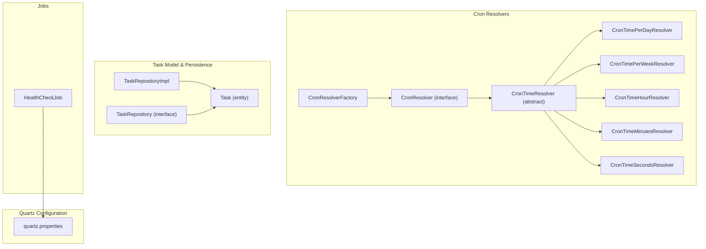
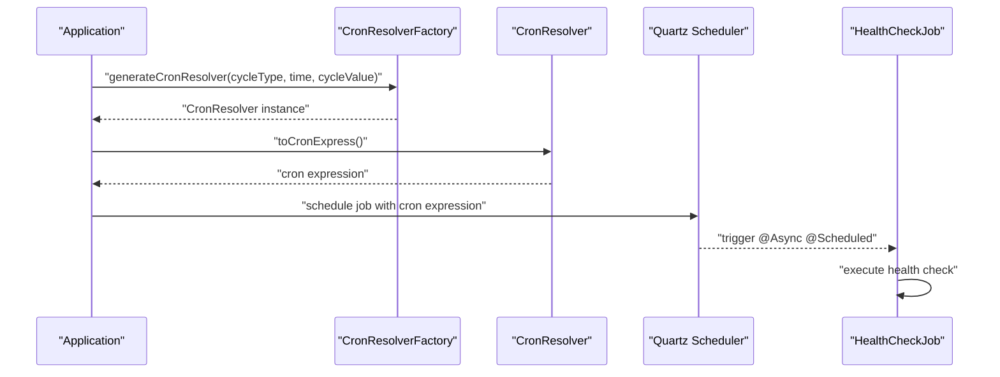
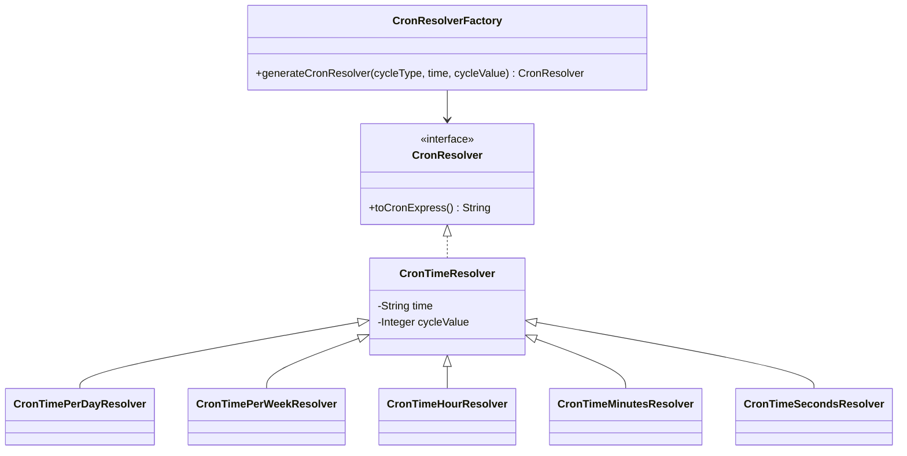
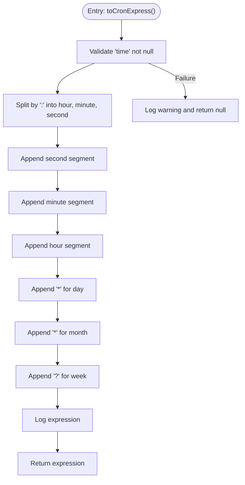
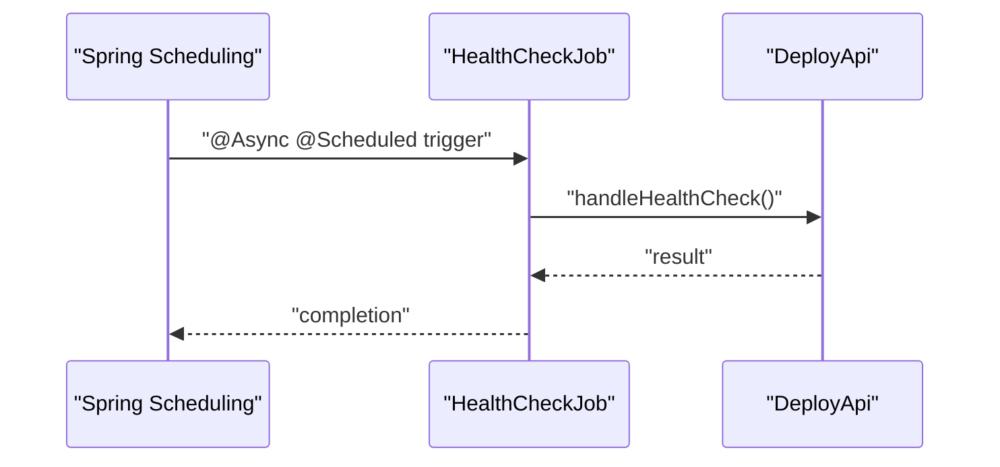
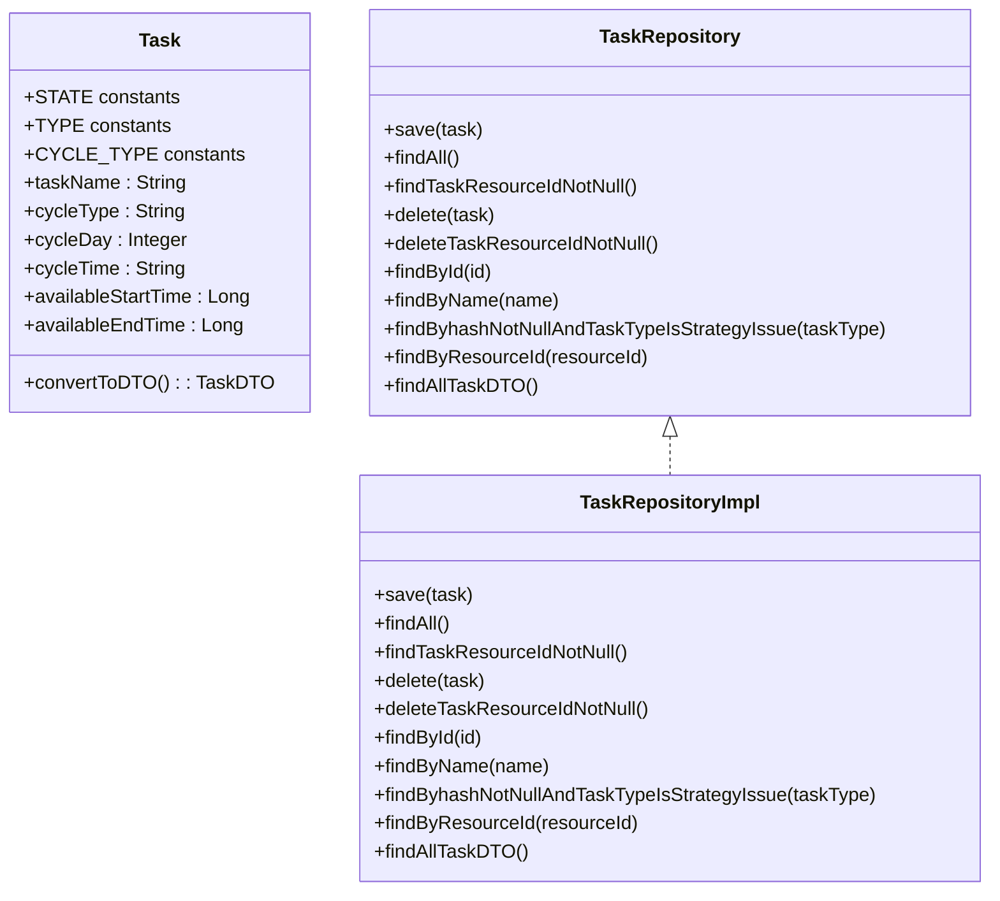
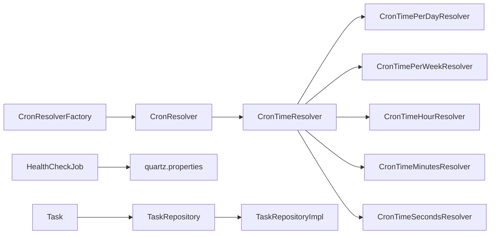

# Scheduling & Task Management

<cite>
**Referenced Files in This Document**
- [quartz.properties](file://watcher-agent/src/main/resources/quartz.properties)
- [HealthCheckJob.java](file://watcher-agent/src/main/java/com/virtual/cloud/om/agent/task/job/HealthCheckJob.java)
- [CronResolverFactory.java](file://watcher-agent/src/main/java/com/virtual/cloud/om/agent/task/cron/CronResolverFactory.java)
- [CronResolver.java](file://watcher-agent/src/main/java/com/virtual/cloud/om/agent/task/cron/CronResolver.java)
- [CronTimeResolver.java](file://watcher-agent/src/main/java/com/virtual/cloud/om/agent/task/cron/CronTimeResolver.java)
- [CronTimePerDayResolver.java](file://watcher-agent/src/main/java/com/virtual/cloud/om/agent/task/cron/CronTimePerDayResolver.java)
- [CronTimePerWeekResolver.java](file://watcher-agent/src/main/java/com/virtual/cloud/om/agent/task/cron/CronTimePerWeekResolver.java)
- [CronTimeHourResolver.java](file://watcher-agent/src/main/java/com/virtual/cloud/om/agent/task/cron/CronTimeHourResolver.java)
- [CronTimeMinutesResolver.java](file://watcher-agent/src/main/java/com/virtual/cloud/om/agent/task/cron/CronTimeMinutesResolver.java)
- [CronTimeSecondsResolver.java](file://watcher-agent/src/main/java/com/virtual/cloud/om/agent/task/cron/CronTimeSecondsResolver.java)
- [Task.java](file://watcher-agent/src/main/java/com/virtual/cloud/om/agent/entity/Task.java)
- [TaskRepository.java](file://watcher-agent/src/main/java/com/virtual/cloud/om/agent/repository/TaskRepository.java)
- [TaskRepositoryImpl.java](file://watcher-agent/src/main/java/com/virtual/cloud/om/agent/repository/TaskRepositoryImpl.java)
</cite>

## Table of Contents
1. [Introduction](#introduction)
2. [Project Structure](#project-structure)
3. [Core Components](#core-components)
4. [Architecture Overview](#architecture-overview)
5. [Detailed Component Analysis](#detailed-component-analysis)
6. [Dependency Analysis](#dependency-analysis)
7. [Performance Considerations](#performance-considerations)
8. [Troubleshooting Guide](#troubleshooting-guide)
9. [Conclusion](#conclusion)
10. [Appendices](#appendices)

## Introduction
This document describes the scheduling system and task management framework used by the watcher-agent module. It covers Quartz scheduler configuration, cron expression generation via a resolver factory, time-based scheduling mechanisms, and a dedicated HealthCheckJob for system monitoring. It also documents task lifecycle concepts, persistence interfaces, retry/error handling strategies, performance monitoring, and best practices for scheduling reliability.

## Project Structure
The scheduling-related code resides under the watcher-agent module:
- Quartz configuration is provided via a properties file.
- Cron resolution logic is encapsulated in a factory and multiple resolver implementations.
- A scheduled job performs periodic health checks.
- Task domain model and repository interfaces define task lifecycle and persistence contracts.

**Diagram sources**
- [quartz.properties:1-45](file://watcher-agent/src/main/resources/quartz.properties#L1-L45)
- [CronResolverFactory.java:1-45](file://watcher-agent/src/main/java/com/virtual/cloud/om/agent/task/cron/CronResolverFactory.java#L1-L45)
- [CronResolver.java:1-23](file://watcher-agent/src/main/java/com/virtual/cloud/om/agent/task/cron/CronResolver.java#L1-L23)
- [CronTimeResolver.java:1-21](file://watcher-agent/src/main/java/com/virtual/cloud/om/agent/task/cron/CronTimeResolver.java#L1-L21)
- [CronTimePerDayResolver.java:1-55](file://watcher-agent/src/main/java/com/virtual/cloud/om/agent/task/cron/CronTimePerDayResolver.java#L1-L55)
- [CronTimePerWeekResolver.java:1-64](file://watcher-agent/src/main/java/com/virtual/cloud/om/agent/task/cron/CronTimePerWeekResolver.java#L1-L64)
- [CronTimeHourResolver.java:1-38](file://watcher-agent/src/main/java/com/virtual/cloud/om/agent/task/cron/CronTimeHourResolver.java#L1-L38)
- [CronTimeMinutesResolver.java:1-38](file://watcher-agent/src/main/java/com/virtual/cloud/om/agent/task/cron/CronTimeMinutesResolver.java#L1-L38)
- [CronTimeSecondsResolver.java:1-38](file://watcher-agent/src/main/java/com/virtual/cloud/om/agent/task/cron/CronTimeSecondsResolver.java#L1-L38)
- [Task.java:1-148](file://watcher-agent/src/main/java/com/virtual/cloud/om/agent/entity/Task.java#L1-L148)
- [TaskRepository.java:1-34](file://watcher-agent/src/main/java/com/virtual/cloud/om/agent/repository/TaskRepository.java#L1-L34)
- [TaskRepositoryImpl.java:1-78](file://watcher-agent/src/main/java/com/virtual/cloud/om/agent/repository/TaskRepositoryImpl.java#L1-L78)
- [HealthCheckJob.java:1-35](file://watcher-agent/src/main/java/com/virtual/cloud/om/agent/task/job/HealthCheckJob.java#L1-L35)

**Section sources**
- [quartz.properties:1-45](file://watcher-agent/src/main/resources/quartz.properties#L1-L45)
- [CronResolverFactory.java:1-45](file://watcher-agent/src/main/java/com/virtual/cloud/om/agent/task/cron/CronResolverFactory.java#L1-L45)
- [CronResolver.java:1-23](file://watcher-agent/src/main/java/com/virtual/cloud/om/agent/task/cron/CronResolver.java#L1-L23)
- [CronTimeResolver.java:1-21](file://watcher-agent/src/main/java/com/virtual/cloud/om/agent/task/cron/CronTimeResolver.java#L1-L21)
- [CronTimePerDayResolver.java:1-55](file://watcher-agent/src/main/java/com/virtual/cloud/om/agent/task/cron/CronTimePerDayResolver.java#L1-L55)
- [CronTimePerWeekResolver.java:1-64](file://watcher-agent/src/main/java/com/virtual/cloud/om/agent/task/cron/CronTimePerWeekResolver.java#L1-L64)
- [CronTimeHourResolver.java:1-38](file://watcher-agent/src/main/java/com/virtual/cloud/om/agent/task/cron/CronTimeHourResolver.java#L1-L38)
- [CronTimeMinutesResolver.java:1-38](file://watcher-agent/src/main/java/com/virtual/cloud/om/agent/task/cron/CronTimeMinutesResolver.java#L1-L38)
- [CronTimeSecondsResolver.java:1-38](file://watcher-agent/src/main/java/com/virtual/cloud/om/agent/task/cron/CronTimeSecondsResolver.java#L1-L38)
- [Task.java:1-148](file://watcher-agent/src/main/java/com/virtual/cloud/om/agent/entity/Task.java#L1-L148)
- [TaskRepository.java:1-34](file://watcher-agent/src/main/java/com/virtual/cloud/om/agent/repository/TaskRepository.java#L1-L34)
- [TaskRepositoryImpl.java:1-78](file://watcher-agent/src/main/java/com/virtual/cloud/om/agent/repository/TaskRepositoryImpl.java#L1-L78)
- [HealthCheckJob.java:1-35](file://watcher-agent/src/main/java/com/virtual/cloud/om/agent/task/job/HealthCheckJob.java#L1-L35)

## Core Components
- Quartz configuration: Controls thread pool size, job store class, and clustering settings. The current configuration enables a thread pool with a fixed number of threads and supports clustered operation via a configurable job store property.
- CronResolverFactory: Produces appropriate cron resolvers based on task cycle type and parameters.
- Cron resolvers: Implement time-based cron expression generation for daily, weekly, hourly, minute, and second intervals, as well as one-time schedules.
- Task model and repository: Define task lifecycle states, types, and scheduling metadata; repository interfaces outline persistence operations (with a simplified implementation currently logging disabled operations).
- HealthCheckJob: A scheduled job that periodically invokes a health check endpoint asynchronously.

**Section sources**
- [quartz.properties:15-45](file://watcher-agent/src/main/resources/quartz.properties#L15-L45)
- [CronResolverFactory.java:23-43](file://watcher-agent/src/main/java/com/virtual/cloud/om/agent/task/cron/CronResolverFactory.java#L23-L43)
- [CronResolver.java:7-22](file://watcher-agent/src/main/java/com/virtual/cloud/om/agent/task/cron/CronResolver.java#L7-L22)
- [CronTimeResolver.java:6-20](file://watcher-agent/src/main/java/com/virtual/cloud/om/agent/task/cron/CronTimeResolver.java#L6-L20)
- [Task.java:24-144](file://watcher-agent/src/main/java/com/virtual/cloud/om/agent/entity/Task.java#L24-L144)
- [TaskRepository.java:12-33](file://watcher-agent/src/main/java/com/virtual/cloud/om/agent/repository/TaskRepository.java#L12-L33)
- [TaskRepositoryImpl.java:19-77](file://watcher-agent/src/main/java/com/virtual/cloud/om/agent/repository/TaskRepositoryImpl.java#L19-L77)
- [HealthCheckJob.java:17-34](file://watcher-agent/src/main/java/com/virtual/cloud/om/agent/task/job/HealthCheckJob.java#L17-L34)

## Architecture Overview
The scheduling architecture combines a factory-driven cron expression builder with a Quartz configuration and a simple job that performs periodic health checks. Task metadata is modeled by the Task entity and accessed via repository interfaces.

**Diagram sources**
- [CronResolverFactory.java:23-43](file://watcher-agent/src/main/java/com/virtual/cloud/om/agent/task/cron/CronResolverFactory.java#L23-L43)
- [CronResolver.java:21-21](file://watcher-agent/src/main/java/com/virtual/cloud/om/agent/task/cron/CronResolver.java#L21-L21)
- [HealthCheckJob.java:29-33](file://watcher-agent/src/main/java/com/virtual/cloud/om/agent/task/job/HealthCheckJob.java#L29-L33)

## Detailed Component Analysis

### Quartz Scheduler Configuration
- Thread pool: Configured with a fixed thread count suitable for background tasks.
- Job store: Supports multiple backends; the configuration includes commented options for MongoDB and JDBC-based stores, enabling persistence and clustering.
- Clustering: A property exists to enable clustered mode for distributed environments.

Key configuration references:
- Thread pool settings and job store comments.
- Clustered mode toggle.

**Section sources**
- [quartz.properties:15-45](file://watcher-agent/src/main/resources/quartz.properties#L15-L45)

### Cron Resolver Factory Pattern
The factory selects a resolver based on the task’s cycle type and parameters:
- Once: One-time schedule using a date/time string.
- Daily: Per-day schedule using time-of-day.
- Weekly: Per-week schedule with a weekday index.
- Monthly: Per-month schedule with a day-of-month index.
- Hour/Minute/Second: Fixed-interval schedules using cycle values.

**Diagram sources**
- [CronResolverFactory.java:23-43](file://watcher-agent/src/main/java/com/virtual/cloud/om/agent/task/cron/CronResolverFactory.java#L23-L43)
- [CronResolver.java:7-22](file://watcher-agent/src/main/java/com/virtual/cloud/om/agent/task/cron/CronResolver.java#L7-L22)
- [CronTimeResolver.java:6-20](file://watcher-agent/src/main/java/com/virtual/cloud/om/agent/task/cron/CronTimeResolver.java#L6-L20)
- [CronTimePerDayResolver.java:11-55](file://watcher-agent/src/main/java/com/virtual/cloud/om/agent/task/cron/CronTimePerDayResolver.java#L11-L55)
- [CronTimePerWeekResolver.java:12-64](file://watcher-agent/src/main/java/com/virtual/cloud/om/agent/task/cron/CronTimePerWeekResolver.java#L12-L64)
- [CronTimeHourResolver.java:9-38](file://watcher-agent/src/main/java/com/virtual/cloud/om/agent/task/cron/CronTimeHourResolver.java#L9-L38)
- [CronTimeMinutesResolver.java:9-38](file://watcher-agent/src/main/java/com/virtual/cloud/om/agent/task/cron/CronTimeMinutesResolver.java#L9-L38)
- [CronTimeSecondsResolver.java:9-38](file://watcher-agent/src/main/java/com/virtual/cloud/om/agent/task/cron/CronTimeSecondsResolver.java#L9-L38)

**Section sources**
- [CronResolverFactory.java:23-43](file://watcher-agent/src/main/java/com/virtual/cloud/om/agent/task/cron/CronResolverFactory.java#L23-L43)
- [CronResolver.java:7-22](file://watcher-agent/src/main/java/com/virtual/cloud/om/agent/task/cron/CronResolver.java#L7-L22)
- [CronTimeResolver.java:6-20](file://watcher-agent/src/main/java/com/virtual/cloud/om/agent/task/cron/CronTimeResolver.java#L6-L20)
- [CronTimePerDayResolver.java:21-53](file://watcher-agent/src/main/java/com/virtual/cloud/om/agent/task/cron/CronTimePerDayResolver.java#L21-L53)
- [CronTimePerWeekResolver.java:22-61](file://watcher-agent/src/main/java/com/virtual/cloud/om/agent/task/cron/CronTimePerWeekResolver.java#L22-L61)
- [CronTimeHourResolver.java:19-35](file://watcher-agent/src/main/java/com/virtual/cloud/om/agent/task/cron/CronTimeHourResolver.java#L19-L35)
- [CronTimeMinutesResolver.java:19-35](file://watcher-agent/src/main/java/com/virtual/cloud/om/agent/task/cron/CronTimeMinutesResolver.java#L19-L35)
- [CronTimeSecondsResolver.java:19-35](file://watcher-agent/src/main/java/com/virtual/cloud/om/agent/task/cron/CronTimeSecondsResolver.java#L19-L35)

### Cron Expression Generation Flow
The per-day resolver demonstrates the typical flow:
- Validate and split the time string.
- Build a cron expression segment for seconds, minutes, and hours.
- Append wildcard placeholders for day, month, and a “no-day-of-week” indicator.
- Log and return the expression or handle exceptions.

**Diagram sources**
- [CronTimePerDayResolver.java:22-53](file://watcher-agent/src/main/java/com/virtual/cloud/om/agent/task/cron/CronTimePerDayResolver.java#L22-L53)

**Section sources**
- [CronTimePerDayResolver.java:21-53](file://watcher-agent/src/main/java/com/virtual/cloud/om/agent/task/cron/CronTimePerDayResolver.java#L21-L53)

### HealthCheckJob for System Monitoring
- Uses Spring’s @Async and @Scheduled annotations to run periodically.
- Invokes a health check endpoint via a service dependency.
- Initial delay and fixed rate define the schedule cadence.

**Diagram sources**
- [HealthCheckJob.java:29-33](file://watcher-agent/src/main/java/com/virtual/cloud/om/agent/task/job/HealthCheckJob.java#L29-L33)

**Section sources**
- [HealthCheckJob.java:17-34](file://watcher-agent/src/main/java/com/virtual/cloud/om/agent/task/job/HealthCheckJob.java#L17-L34)

### Task Lifecycle Management and Persistence
- Task entity defines lifecycle states, types, and scheduling metadata (cycle type, cycle day/time, effective period).
- Repository interface defines persistence operations; the implementation currently logs that operations are disabled and returns empty collections or defaults.

**Diagram sources**
- [Task.java:24-144](file://watcher-agent/src/main/java/com/virtual/cloud/om/agent/entity/Task.java#L24-L144)
- [TaskRepository.java:12-33](file://watcher-agent/src/main/java/com/virtual/cloud/om/agent/repository/TaskRepository.java#L12-L33)
- [TaskRepositoryImpl.java:19-77](file://watcher-agent/src/main/java/com/virtual/cloud/om/agent/repository/TaskRepositoryImpl.java#L19-L77)

**Section sources**
- [Task.java:24-144](file://watcher-agent/src/main/java/com/virtual/cloud/om/agent/entity/Task.java#L24-L144)
- [TaskRepository.java:12-33](file://watcher-agent/src/main/java/com/virtual/cloud/om/agent/repository/TaskRepository.java#L12-L33)
- [TaskRepositoryImpl.java:19-77](file://watcher-agent/src/main/java/com/virtual/cloud/om/agent/repository/TaskRepositoryImpl.java#L19-L77)

## Dependency Analysis
- CronResolverFactory depends on Task constants to select the correct resolver.
- Cron resolvers depend on shared constants for time/date segment separators.
- HealthCheckJob depends on a service interface for invoking health checks.
- Quartz configuration influences how jobs are scheduled and executed.

**Diagram sources**
- [CronResolverFactory.java:23-43](file://watcher-agent/src/main/java/com/virtual/cloud/om/agent/task/cron/CronResolverFactory.java#L23-L43)
- [CronResolver.java:7-22](file://watcher-agent/src/main/java/com/virtual/cloud/om/agent/task/cron/CronResolver.java#L7-L22)
- [CronTimeResolver.java:6-20](file://watcher-agent/src/main/java/com/virtual/cloud/om/agent/task/cron/CronTimeResolver.java#L6-L20)
- [CronTimePerDayResolver.java:11-55](file://watcher-agent/src/main/java/com/virtual/cloud/om/agent/task/cron/CronTimePerDayResolver.java#L11-L55)
- [CronTimePerWeekResolver.java:12-64](file://watcher-agent/src/main/java/com/virtual/cloud/om/agent/task/cron/CronTimePerWeekResolver.java#L12-L64)
- [CronTimeHourResolver.java:9-38](file://watcher-agent/src/main/java/com/virtual/cloud/om/agent/task/cron/CronTimeHourResolver.java#L9-L38)
- [CronTimeMinutesResolver.java:9-38](file://watcher-agent/src/main/java/com/virtual/cloud/om/agent/task/cron/CronTimeMinutesResolver.java#L9-L38)
- [CronTimeSecondsResolver.java:9-38](file://watcher-agent/src/main/java/com/virtual/cloud/om/agent/task/cron/CronTimeSecondsResolver.java#L9-L38)
- [HealthCheckJob.java:17-34](file://watcher-agent/src/main/java/com/virtual/cloud/om/agent/task/job/HealthCheckJob.java#L17-L34)
- [quartz.properties:15-45](file://watcher-agent/src/main/resources/quartz.properties#L15-L45)
- [Task.java:24-144](file://watcher-agent/src/main/java/com/virtual/cloud/om/agent/entity/Task.java#L24-L144)
- [TaskRepository.java:12-33](file://watcher-agent/src/main/java/com/virtual/cloud/om/agent/repository/TaskRepository.java#L12-L33)
- [TaskRepositoryImpl.java:19-77](file://watcher-agent/src/main/java/com/virtual/cloud/om/agent/repository/TaskRepositoryImpl.java#L19-L77)

**Section sources**
- [CronResolverFactory.java:23-43](file://watcher-agent/src/main/java/com/virtual/cloud/om/agent/task/cron/CronResolverFactory.java#L23-L43)
- [CronResolver.java:7-22](file://watcher-agent/src/main/java/com/virtual/cloud/om/agent/task/cron/CronResolver.java#L7-L22)
- [CronTimeResolver.java:6-20](file://watcher-agent/src/main/java/com/virtual/cloud/om/agent/task/cron/CronTimeResolver.java#L6-L20)
- [CronTimePerDayResolver.java:11-55](file://watcher-agent/src/main/java/com/virtual/cloud/om/agent/task/cron/CronTimePerDayResolver.java#L11-L55)
- [CronTimePerWeekResolver.java:12-64](file://watcher-agent/src/main/java/com/virtual/cloud/om/agent/task/cron/CronTimePerWeekResolver.java#L12-L64)
- [CronTimeHourResolver.java:9-38](file://watcher-agent/src/main/java/com/virtual/cloud/om/agent/task/cron/CronTimeHourResolver.java#L9-L38)
- [CronTimeMinutesResolver.java:9-38](file://watcher-agent/src/main/java/com/virtual/cloud/om/agent/task/cron/CronTimeMinutesResolver.java#L9-L38)
- [CronTimeSecondsResolver.java:9-38](file://watcher-agent/src/main/java/com/virtual/cloud/om/agent/task/cron/CronTimeSecondsResolver.java#L9-L38)
- [HealthCheckJob.java:17-34](file://watcher-agent/src/main/java/com/virtual/cloud/om/agent/task/job/HealthCheckJob.java#L17-L34)
- [quartz.properties:15-45](file://watcher-agent/src/main/resources/quartz.properties#L15-L45)
- [Task.java:24-144](file://watcher-agent/src/main/java/com/virtual/cloud/om/agent/entity/Task.java#L24-L144)
- [TaskRepository.java:12-33](file://watcher-agent/src/main/java/com/virtual/cloud/om/agent/repository/TaskRepository.java#L12-L33)
- [TaskRepositoryImpl.java:19-77](file://watcher-agent/src/main/java/com/virtual/cloud/om/agent/repository/TaskRepositoryImpl.java#L19-L77)

## Performance Considerations
- Thread pool sizing: Tune the Quartz thread pool count according to workload concurrency needs.
- Cron expression complexity: Prefer simpler intervals (minutes/seconds) for frequent tasks to reduce overhead.
- Logging verbosity: Excessive debug logs can impact performance; adjust log levels accordingly.
- Clustering: Enable clustering only when multiple nodes share the same job store to avoid conflicts.
- Health checks: Keep the health check lightweight and bounded to prevent contention with other tasks.

[No sources needed since this section provides general guidance]

## Troubleshooting Guide
Common issues and remedies:
- Unknown cycle type: The factory logs a warning and returns null; ensure cycleType matches supported constants.
- Invalid time format: Resolvers expect time in HH:mm:ss; mismatches cause warnings and null returns.
- Disabled repository operations: Current implementation logs disabled operations; implement persistence if required.
- Quartz job store configuration: Verify the selected job store backend and connection settings; ensure clustering is enabled only when appropriate.

**Section sources**
- [CronResolverFactory.java:40-42](file://watcher-agent/src/main/java/com/virtual/cloud/om/agent/task/cron/CronResolverFactory.java#L40-L42)
- [CronTimePerDayResolver.java:48-50](file://watcher-agent/src/main/java/com/virtual/cloud/om/agent/task/cron/CronTimePerDayResolver.java#L48-L50)
- [TaskRepositoryImpl.java:22-46](file://watcher-agent/src/main/java/com/virtual/cloud/om/agent/repository/TaskRepositoryImpl.java#L22-L46)
- [quartz.properties:26-45](file://watcher-agent/src/main/resources/quartz.properties#L26-L45)

## Conclusion
The scheduling system integrates a factory-driven cron resolver architecture with Quartz configuration and a dedicated health check job. While the current repository implementation is disabled, the design supports straightforward extension for persistence. Proper configuration of Quartz, careful selection of cron resolvers, and disciplined logging practices contribute to a robust and maintainable scheduling framework.

[No sources needed since this section summarizes without analyzing specific files]

## Appendices
- Supported cycle types and their corresponding resolvers:
  - once → CronDateTimeOnceResolver
  - everyDay → CronTimePerDayResolver
  - everyWeek → CronTimePerWeekResolver
  - everyMonth → CronTimePerMonthResolver
  - hour → CronTimeHourResolver
  - minute → CronTimeMinutesResolver
  - second → CronTimeSecondsResolver

**Section sources**
- [CronResolverFactory.java:25-39](file://watcher-agent/src/main/java/com/virtual/cloud/om/agent/task/cron/CronResolverFactory.java#L25-L39)
- [Task.java:40-50](file://watcher-agent/src/main/java/com/virtual/cloud/om/agent/entity/Task.java#L40-L50)