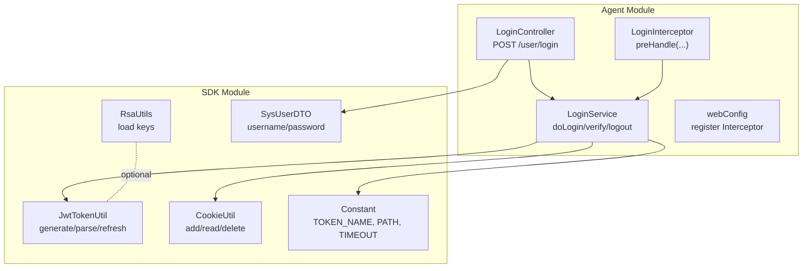
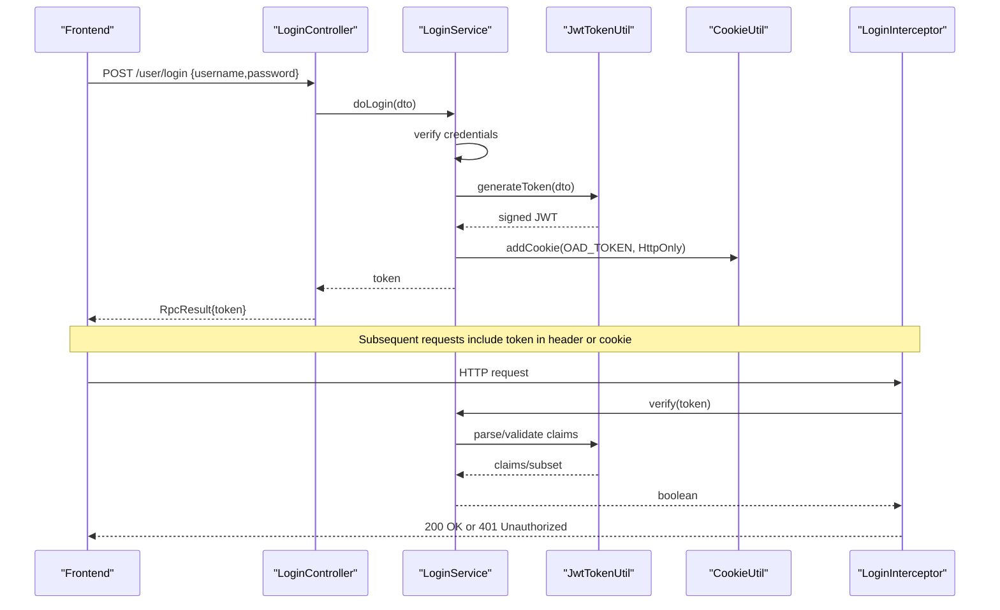
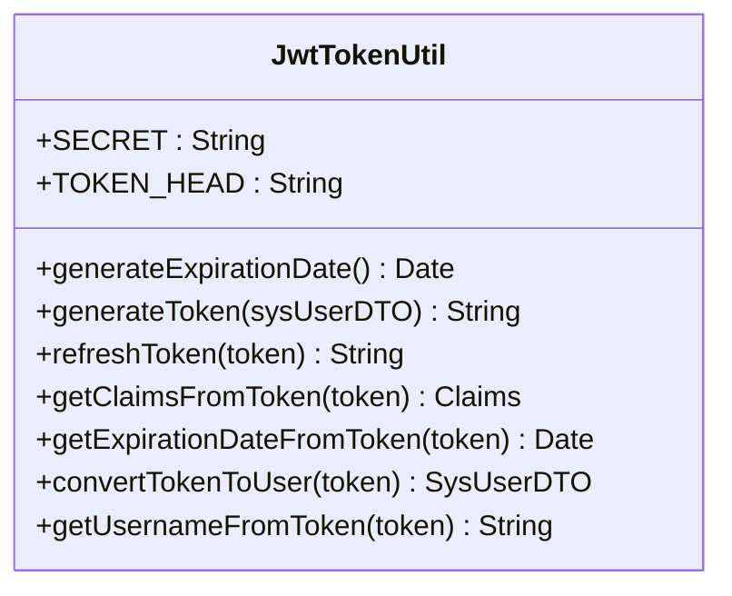
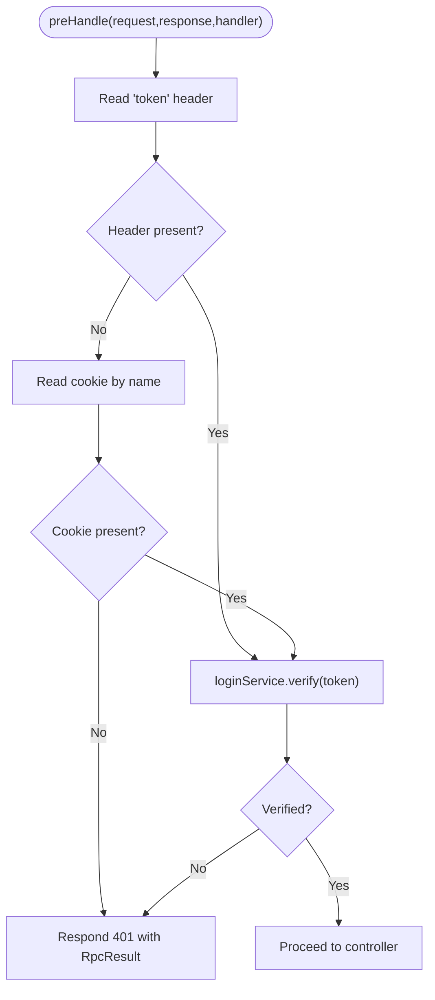
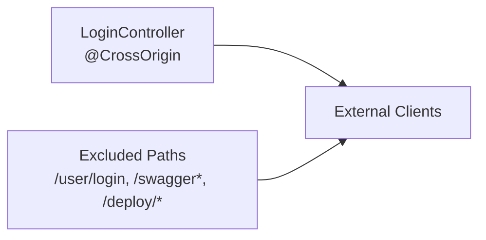
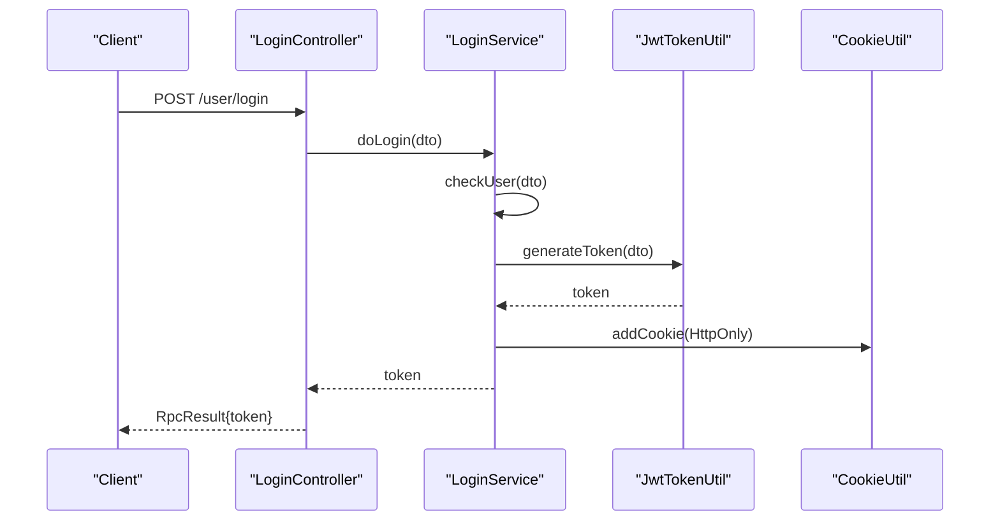
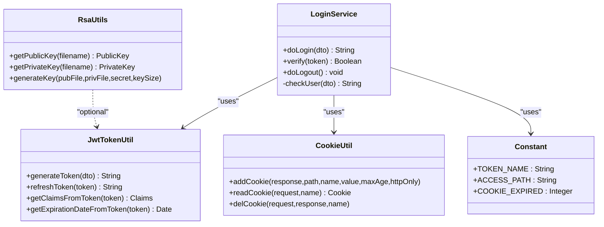
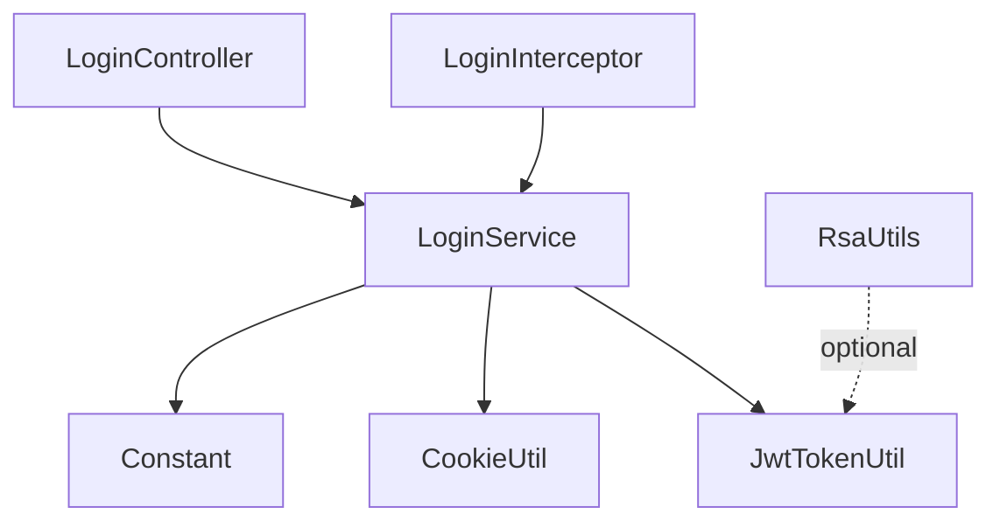

# Security & Authentication

<cite>
**Referenced Files in This Document**
- [JwtTokenUtil.java](file://watcher-sdk/src/main/java/com/virtual/cloud/om/sdk/utils/JwtTokenUtil.java)
- [RsaUtils.java](file://watcher-sdk/src/main/java/com/virtual/cloud/om/sdk/utils/RsaUtils.java)
- [LoginInterceptor.java](file://watcher-agent/src/main/java/com/virtual/cloud/om/agent/config/LoginInterceptor.java)
- [webConfig.java](file://watcher-agent/src/main/java/com/virtual/cloud/om/agent/filter/webConfig.java)
- [LoginController.java](file://watcher-agent/src/main/java/com/virtual/cloud/om/agent/controller/LoginController.java)
- [LoginService.java](file://watcher-agent/src/main/java/com/virtual/cloud/om/agent/service/auth/LoginService.java)
- [CookieUtil.java](file://watcher-sdk/src/main/java/com/virtual/cloud/om/sdk/utils/CookieUtil.java)
- [Constant.java](file://watcher-sdk/src/main/java/com/virtual/cloud/om/sdk/constant/Constant.java)
- [SysUserDTO.java](file://watcher-sdk/src/main/java/com/virtual/cloud/om/sdk/dto/SysUserDTO.java)
- [showtime_mcp.py](file://watcher-ai/src/showtime_mcp.py)
</cite>

## Table of Contents
1. [Introduction](#introduction)
2. [Project Structure](#project-structure)
3. [Core Components](#core-components)
4. [Architecture Overview](#architecture-overview)
5. [Detailed Component Analysis](#detailed-component-analysis)
6. [Dependency Analysis](#dependency-analysis)
7. [Performance Considerations](#performance-considerations)
8. [Troubleshooting Guide](#troubleshooting-guide)
9. [Conclusion](#conclusion)
10. [Appendices](#appendices)

## Introduction
This document explains the security and authentication implementation across the backend agents and SDK. It covers JWT token generation and validation, interceptor-based request filtering, session management, and integration points with the frontend. It also documents RSA utilities, cookie-based token storage, CORS exposure via controllers, and best practices for securing APIs.

## Project Structure
Security-related components are primarily located in:
- Backend agent module: interceptors, controllers, and services implementing authentication and session management
- SDK module: shared utilities for JWT, RSA, cookies, constants, and DTOs used across services

**Diagram sources**
- [LoginController.java:13-92](file://watcher-agent/src/main/java/com/virtual/cloud/om/agent/controller/LoginController.java#L13-L92)
- [LoginInterceptor.java:29-100](file://watcher-agent/src/main/java/com/virtual/cloud/om/agent/config/LoginInterceptor.java#L29-L100)
- [LoginService.java:36-282](file://watcher-agent/src/main/java/com/virtual/cloud/om/agent/service/auth/LoginService.java#L36-L282)
- [webConfig.java:11-38](file://watcher-agent/src/main/java/com/virtual/cloud/om/agent/filter/webConfig.java#L11-L38)
- [JwtTokenUtil.java:14-88](file://watcher-sdk/src/main/java/com/virtual/cloud/om/sdk/utils/JwtTokenUtil.java#L14-L88)
- [RsaUtils.java:12-102](file://watcher-sdk/src/main/java/com/virtual/cloud/om/sdk/utils/RsaUtils.java#L12-L102)
- [CookieUtil.java:13-95](file://watcher-sdk/src/main/java/com/virtual/cloud/om/sdk/utils/CookieUtil.java#L13-L95)
- [Constant.java:9-33](file://watcher-sdk/src/main/java/com/virtual/cloud/om/sdk/constant/Constant.java#L9-L33)
- [SysUserDTO.java:12-27](file://watcher-sdk/src/main/java/com/virtual/cloud/om/sdk/dto/SysUserDTO.java#L12-L27)

**Section sources**
- [LoginController.java:13-92](file://watcher-agent/src/main/java/com/virtual/cloud/om/agent/controller/LoginController.java#L13-L92)
- [LoginInterceptor.java:29-100](file://watcher-agent/src/main/java/com/virtual/cloud/om/agent/config/LoginInterceptor.java#L29-L100)
- [LoginService.java:36-282](file://watcher-agent/src/main/java/com/virtual/cloud/om/agent/service/auth/LoginService.java#L36-L282)
- [webConfig.java:11-38](file://watcher-agent/src/main/java/com/virtual/cloud/om/agent/filter/webConfig.java#L11-L38)
- [JwtTokenUtil.java:14-88](file://watcher-sdk/src/main/java/com/virtual/cloud/om/sdk/utils/JwtTokenUtil.java#L14-L88)
- [RsaUtils.java:12-102](file://watcher-sdk/src/main/java/com/virtual/cloud/om/sdk/utils/RsaUtils.java#L12-L102)
- [CookieUtil.java:13-95](file://watcher-sdk/src/main/java/com/virtual/cloud/om/sdk/utils/CookieUtil.java#L13-L95)
- [Constant.java:9-33](file://watcher-sdk/src/main/java/com/virtual/cloud/om/sdk/constant/Constant.java#L9-L33)
- [SysUserDTO.java:12-27](file://watcher-sdk/src/main/java/com/virtual/cloud/om/sdk/dto/SysUserDTO.java#L12-L27)

## Core Components
- JWT utilities: token creation, parsing, expiration handling, and refresh logic
- Interceptor: global request filtering to enforce authentication
- Login controller: exposes login/logout endpoints and returns tokens
- Login service: orchestrates user verification, token issuance, session management, and token refresh
- Cookie utilities: manage HttpOnly cookies for token persistence
- Constants: token cookie name, access path, and timeouts
- RSA utilities: load public/private keys from files for asymmetric cryptography scenarios
- Frontend integration: example showing how to attach the token header

**Section sources**
- [JwtTokenUtil.java:14-88](file://watcher-sdk/src/main/java/com/virtual/cloud/om/sdk/utils/JwtTokenUtil.java#L14-L88)
- [LoginInterceptor.java:29-100](file://watcher-agent/src/main/java/com/virtual/cloud/om/agent/config/LoginInterceptor.java#L29-L100)
- [LoginController.java:13-92](file://watcher-agent/src/main/java/com/virtual/cloud/om/agent/controller/LoginController.java#L13-L92)
- [LoginService.java:36-282](file://watcher-agent/src/main/java/com/virtual/cloud/om/agent/service/auth/LoginService.java#L36-L282)
- [CookieUtil.java:13-95](file://watcher-sdk/src/main/java/com/virtual/cloud/om/sdk/utils/CookieUtil.java#L13-L95)
- [Constant.java:9-33](file://watcher-sdk/src/main/java/com/virtual/cloud/om/sdk/constant/Constant.java#L9-L33)
- [RsaUtils.java:12-102](file://watcher-sdk/src/main/java/com/virtual/cloud/om/sdk/utils/RsaUtils.java#L12-L102)
- [showtime_mcp.py:119-138](file://watcher-ai/src/showtime_mcp.py#L119-L138)

## Architecture Overview
The authentication flow integrates a global interceptor, a login endpoint, and a service that validates credentials, issues JWT tokens, and manages sessions and cookies.

**Diagram sources**
- [LoginController.java:25-44](file://watcher-agent/src/main/java/com/virtual/cloud/om/agent/controller/LoginController.java#L25-L44)
- [LoginService.java:54-93](file://watcher-agent/src/main/java/com/virtual/cloud/om/agent/service/auth/LoginService.java#L54-L93)
- [JwtTokenUtil.java:49-57](file://watcher-sdk/src/main/java/com/virtual/cloud/om/sdk/utils/JwtTokenUtil.java#L49-L57)
- [CookieUtil.java:23-31](file://watcher-sdk/src/main/java/com/virtual/cloud/om/sdk/utils/CookieUtil.java#L23-L31)
- [LoginInterceptor.java:36-72](file://watcher-agent/src/main/java/com/virtual/cloud/om/agent/config/LoginInterceptor.java#L36-L72)

## Detailed Component Analysis

### JWT Token Implementation
- Secret and algorithm: HS512 with a shared secret
- Expiration: two hours from issuance
- Refresh: token refreshed if within a 20-minute window of expiry; new token stored in cookie
- Parsing: claims parsed with clock skew allowance; errors return null/invalid state

**Diagram sources**
- [JwtTokenUtil.java:14-88](file://watcher-sdk/src/main/java/com/virtual/cloud/om/sdk/utils/JwtTokenUtil.java#L14-L88)

**Section sources**
- [JwtTokenUtil.java:17-57](file://watcher-sdk/src/main/java/com/virtual/cloud/om/sdk/utils/JwtTokenUtil.java#L17-L57)
- [JwtTokenUtil.java:59-69](file://watcher-sdk/src/main/java/com/virtual/cloud/om/sdk/utils/JwtTokenUtil.java#L59-L69)
- [JwtTokenUtil.java:31-42](file://watcher-sdk/src/main/java/com/virtual/cloud/om/sdk/utils/JwtTokenUtil.java#L31-L42)

### Interceptor Configuration and Access Control
- Global interceptor applied to all paths except a predefined exclusion list
- Extracts token from request header or falls back to a named cookie
- Delegates verification to the login service; responds with structured RPC result on failure

**Diagram sources**
- [LoginInterceptor.java:36-72](file://watcher-agent/src/main/java/com/virtual/cloud/om/agent/config/LoginInterceptor.java#L36-L72)
- [webConfig.java:19-36](file://watcher-agent/src/main/java/com/virtual/cloud/om/agent/filter/webConfig.java#L19-L36)

**Section sources**
- [LoginInterceptor.java:36-72](file://watcher-agent/src/main/java/com/virtual/cloud/om/agent/config/LoginInterceptor.java#L36-L72)
- [webConfig.java:19-36](file://watcher-agent/src/main/java/com/virtual/cloud/om/agent/filter/webConfig.java#L19-L36)

### Web Security Configuration and CORS
- Login controller enables cross-origin requests for login-related endpoints
- Interceptor applies globally to most paths; excludes swagger, health, and public endpoints

**Diagram sources**
- [LoginController.java](file://watcher-agent/src/main/java/com/virtual/cloud/om/agent/controller/LoginController.java#L15)
- [webConfig.java:20-36](file://watcher-agent/src/main/java/com/virtual/cloud/om/agent/filter/webConfig.java#L20-L36)

**Section sources**
- [LoginController.java](file://watcher-agent/src/main/java/com/virtual/cloud/om/agent/controller/LoginController.java#L15)
- [webConfig.java:20-36](file://watcher-agent/src/main/java/com/virtual/cloud/om/agent/filter/webConfig.java#L20-L36)

### Authentication Flow
- Login endpoint accepts credentials, verifies them, generates a JWT, stores it in an HttpOnly cookie, and returns the token
- Subsequent requests must carry the token either in the header or cookie
- Interceptor validates the token; on near-expiry, service refreshes and updates the cookie

**Diagram sources**
- [LoginController.java:25-44](file://watcher-agent/src/main/java/com/virtual/cloud/om/agent/controller/LoginController.java#L25-L44)
- [LoginService.java:54-93](file://watcher-agent/src/main/java/com/virtual/cloud/om/agent/service/auth/LoginService.java#L54-L93)
- [JwtTokenUtil.java:49-57](file://watcher-sdk/src/main/java/com/virtual/cloud/om/sdk/utils/JwtTokenUtil.java#L49-L57)
- [CookieUtil.java:23-31](file://watcher-sdk/src/main/java/com/virtual/cloud/om/sdk/utils/CookieUtil.java#L23-L31)

**Section sources**
- [LoginController.java:25-44](file://watcher-agent/src/main/java/com/virtual/cloud/om/agent/controller/LoginController.java#L25-L44)
- [LoginService.java:54-93](file://watcher-agent/src/main/java/com/virtual/cloud/om/agent/service/auth/LoginService.java#L54-L93)

### Token Generation, Validation, Encryption, and Session Management
- Token generation: HS512-signed JWT with a subject derived from serialized user DTO and fixed expiration
- Token validation: parser with allowed clock skew; checks expiration and parses subject
- Refresh logic: near-expiry triggers refresh and cookie update
- Session management: server-side session configured with idle timeout; cookie HttpOnly flag set
- RSA utilities: loading public/private keys from files for asymmetric cryptography scenarios

**Diagram sources**
- [LoginService.java:54-141](file://watcher-agent/src/main/java/com/virtual/cloud/om/agent/service/auth/LoginService.java#L54-L141)
- [JwtTokenUtil.java:49-69](file://watcher-sdk/src/main/java/com/virtual/cloud/om/sdk/utils/JwtTokenUtil.java#L49-L69)
- [CookieUtil.java:23-31](file://watcher-sdk/src/main/java/com/virtual/cloud/om/sdk/utils/CookieUtil.java#L23-L31)
- [Constant.java:30-32](file://watcher-sdk/src/main/java/com/virtual/cloud/om/sdk/constant/Constant.java#L30-L32)
- [RsaUtils.java:20-85](file://watcher-sdk/src/main/java/com/virtual/cloud/om/sdk/utils/RsaUtils.java#L20-L85)

**Section sources**
- [LoginService.java:54-93](file://watcher-agent/src/main/java/com/virtual/cloud/om/agent/service/auth/LoginService.java#L54-L93)
- [LoginService.java:117-141](file://watcher-agent/src/main/java/com/virtual/cloud/om/agent/service/auth/LoginService.java#L117-L141)
- [JwtTokenUtil.java:49-69](file://watcher-sdk/src/main/java/com/virtual/cloud/om/sdk/utils/JwtTokenUtil.java#L49-L69)
- [CookieUtil.java:23-31](file://watcher-sdk/src/main/java/com/virtual/cloud/om/sdk/utils/CookieUtil.java#L23-L31)
- [Constant.java:30-32](file://watcher-sdk/src/main/java/com/virtual/cloud/om/sdk/constant/Constant.java#L30-L32)
- [RsaUtils.java:20-85](file://watcher-sdk/src/main/java/com/virtual/cloud/om/sdk/utils/RsaUtils.java#L20-L85)

### Authorization Patterns and Role-Based Access Control
- Current implementation enforces presence and validity of tokens but does not implement role-based authorization checks in the provided code
- To add RBAC, introduce roles in the user DTO, extend the token payload, and augment the interceptor or controller advice to enforce role-based policies

[No sources needed since this section provides conceptual guidance]

### Security Headers and CORS
- Login controller is annotated with cross-origin allowance enabling external clients to call the login endpoint
- No explicit security headers are enforced in the provided code; consider adding Content-Security-Policy, X-Frame-Options, and HSTS at the gateway or server level

**Section sources**
- [LoginController.java](file://watcher-agent/src/main/java/com/virtual/cloud/om/agent/controller/LoginController.java#L15)

### Frontend Integration and Secure API Usage
- Example shows attaching the token via a custom header named "token"
- Recommended: send the token in the header for stateless APIs; fallback to HttpOnly cookie for browser-based apps

**Section sources**
- [showtime_mcp.py:119-138](file://watcher-ai/src/showtime_mcp.py#L119-L138)

## Dependency Analysis
- Interceptor depends on LoginService for verification
- LoginService depends on JwtTokenUtil for token operations, CookieUtil for cookie management, and Constant for cookie metadata
- Controller depends on LoginService and returns tokens to clients
- RSA utilities are independent and can be used for asymmetric cryptography when needed

**Diagram sources**
- [LoginInterceptor.java](file://watcher-agent/src/main/java/com/virtual/cloud/om/agent/config/LoginInterceptor.java#L31)
- [LoginService.java:40-47](file://watcher-agent/src/main/java/com/virtual/cloud/om/agent/service/auth/LoginService.java#L40-L47)
- [JwtTokenUtil.java:14-16](file://watcher-sdk/src/main/java/com/virtual/cloud/om/sdk/utils/JwtTokenUtil.java#L14-L16)
- [CookieUtil.java:13-14](file://watcher-sdk/src/main/java/com/virtual/cloud/om/sdk/utils/CookieUtil.java#L13-L14)
- [Constant.java:9-33](file://watcher-sdk/src/main/java/com/virtual/cloud/om/sdk/constant/Constant.java#L9-L33)
- [LoginController.java:20-21](file://watcher-agent/src/main/java/com/virtual/cloud/om/agent/controller/LoginController.java#L20-L21)
- [RsaUtils.java:12-13](file://watcher-sdk/src/main/java/com/virtual/cloud/om/sdk/utils/RsaUtils.java#L12-L13)

**Section sources**
- [LoginInterceptor.java](file://watcher-agent/src/main/java/com/virtual/cloud/om/agent/config/LoginInterceptor.java#L31)
- [LoginService.java:40-47](file://watcher-agent/src/main/java/com/virtual/cloud/om/agent/service/auth/LoginService.java#L40-L47)
- [JwtTokenUtil.java:14-16](file://watcher-sdk/src/main/java/com/virtual/cloud/om/sdk/utils/JwtTokenUtil.java#L14-L16)
- [CookieUtil.java:13-14](file://watcher-sdk/src/main/java/com/virtual/cloud/om/sdk/utils/CookieUtil.java#L13-L14)
- [Constant.java:9-33](file://watcher-sdk/src/main/java/com/virtual/cloud/om/sdk/constant/Constant.java#L9-L33)
- [LoginController.java:20-21](file://watcher-agent/src/main/java/com/virtual/cloud/om/agent/controller/LoginController.java#L20-L21)
- [RsaUtils.java:12-13](file://watcher-sdk/src/main/java/com/virtual/cloud/om/sdk/utils/RsaUtils.java#L12-L13)

## Performance Considerations
- Token refresh occurs near expiry; ensure low-latency cookie writes and avoid excessive refresh triggers
- Keep the shared secret secure and rotate periodically; consider rotating signing keys for improved security posture
- Avoid storing sensitive data in tokens; keep claims minimal

[No sources needed since this section provides general guidance]

## Troubleshooting Guide
Common issues and resolutions:
- 401 Unauthorized on protected endpoints
  - Ensure the token is included in the "token" header or the OAD_TOKEN cookie
  - Confirm the token is not expired; near-expiry tokens are refreshed automatically
- Login succeeds but subsequent requests fail
  - Verify the HttpOnly cookie is being sent with the request
  - Check server logs for interceptor failures and error messages
- CORS errors on login
  - Confirm the controller allows cross-origin requests and the client sends the appropriate headers

**Section sources**
- [LoginInterceptor.java:44-50](file://watcher-agent/src/main/java/com/virtual/cloud/om/agent/config/LoginInterceptor.java#L44-L50)
- [LoginService.java:117-141](file://watcher-agent/src/main/java/com/virtual/cloud/om/agent/service/auth/LoginService.java#L117-L141)
- [LoginController.java](file://watcher-agent/src/main/java/com/virtual/cloud/om/agent/controller/LoginController.java#L15)

## Conclusion
The system implements a straightforward, stateless JWT-based authentication mechanism with a global interceptor enforcing token validation. Tokens are issued upon successful login, stored in an HttpOnly cookie, and refreshed near expiry. The design leverages shared utilities for JWT and cookie management, and the controller exposes login/logout endpoints with CORS enabled. For production hardening, consider adding RBAC, stricter security headers, secrets rotation, and stronger cryptographic practices.

[No sources needed since this section summarizes without analyzing specific files]

## Appendices

### Best Practices Checklist
- Use HTTPS/TLS for all endpoints
- Store tokens in HttpOnly cookies for browser clients
- Enforce RBAC at the interceptor or controller advice level
- Rotate signing secrets and keys regularly
- Add security headers (CSP, X-Frame-Options, HSTS)
- Sanitize and validate all inputs; avoid embedding sensitive data in JWTs
- Monitor and log authentication events

[No sources needed since this section provides general guidance]