# Service Layer

<cite>
**Referenced Files in This Document**
- [WatcherAgentApplication.java](file://watcher-agent/src/main/java/com/virtual/cloud/om/agent/WatcherAgentApplication.java)
- [LoginService.java](file://watcher-agent/src/main/java/com/virtual/cloud/om/agent/service/auth/LoginService.java)
- [SysUserService.java](file://watcher-agent/src/main/java/com/virtual/cloud/om/agent/service/SysUserService.java)
- [DataCenterService.java](file://watcher-agent/src/main/java/com/virtual/cloud/om/agent/service/datacenter/DataCenterService.java)
- [DeployService.java](file://watcher-agent/src/main/java/com/virtual/cloud/om/agent/service/deploy/DeployService.java)
- [ResourceService.java](file://watcher-agent/src/main/java/com/virtual/cloud/om/agent/service/resource/ResourceService.java)
- [LogService.java](file://watcher-agent/src/main/java/com/virtual/cloud/om/agent/service/logs/LogService.java)
- [RealTimeLogService.java](file://watcher-agent/src/main/java/com/virtual/cloud/om/agent/service/logs/RealTimeLogService.java)
- [LogLineParserUtil.java](file://watcher-agent/src/main/java/com/virtual/cloud/om/agent/service/logs/LogLineParserUtil.java)
- [ParameterService.java](file://watcher-agent/src/main/java/com/virtual/cloud/om/agent/service/parameter/ParameterService.java)
- [DataReportService.java](file://watcher-agent/src/main/java/com/virtual/cloud/om/agent/service/report/DataReportService.java)
- [StrategyServiceImpl.java](file://watcher-agent/src/main/java/com/virtual/cloud/om/agent/service/strategy/StrategyServiceImpl.java)
- [WarnStrategyServiceImpl.java](file://watcher-agent/src/main/java/com/virtual/cloud/om/agent/service/warn/WarnStrategyServiceImpl.java)
- [TaskMgrApiImpl.java](file://watcher-agent/src/main/java/com/virtual/cloud/om/agent/service/task/TaskMgrApiImpl.java)
- [WatcherLockService.java](file://watcher-agent/src/main/java/com/virtual/cloud/om/agent/service/lock/WatcherLockService.java)
- [ResourceAuthService.java](file://watcher-agent/src/main/java/com/virtual/cloud/om/agent/service/ssh/ResourceAuthService.java)
</cite>

## Table of Contents
1. [Introduction](#introduction)
2. [Project Structure](#project-structure)
3. [Core Components](#core-components)
4. [Architecture Overview](#architecture-overview)
5. [Detailed Component Analysis](#detailed-component-analysis)
6. [Dependency Analysis](#dependency-analysis)
7. [Performance Considerations](#performance-considerations)
8. [Troubleshooting Guide](#troubleshooting-guide)
9. [Conclusion](#conclusion)

## Introduction
This document describes the service layer of the watcher-agent module. It focuses on business logic implementations across authentication, data center management, deployment orchestration, resource management, monitoring strategies, log processing, warning management, parameter configuration, data reporting, task management, user services, locking mechanisms, and SSH authentication. It explains service interfaces, implementation patterns, dependency injection, transaction management, error handling strategies, service interaction patterns, data flow between layers, and integration with external platforms via SDK interfaces.

## Project Structure
The watcher-agent module is a Spring Boot application that exposes services via SDK interfaces and orchestrates operations against external systems. The application scans multiple packages and enables scheduling. Services are organized by domain areas under the service package and integrate with SDK APIs and repositories.

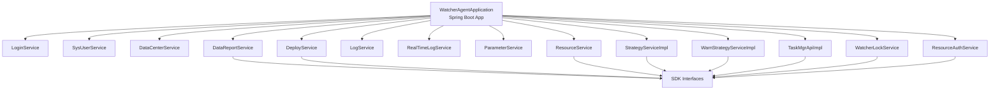

**Diagram sources**
- [WatcherAgentApplication.java:14-18](file://watcher-agent/src/main/java/com/virtual/cloud/om/agent/WatcherAgentApplication.java#L14-L18)
- [LoginService.java:36-47](file://watcher-agent/src/main/java/com/virtual/cloud/om/agent/service/auth/LoginService.java#L36-L47)
- [DataReportService.java:51-84](file://watcher-agent/src/main/java/com/virtual/cloud/om/agent/service/report/DataReportService.java#L51-L84)

**Section sources**
- [WatcherAgentApplication.java:14-18](file://watcher-agent/src/main/java/com/virtual/cloud/om/agent/WatcherAgentApplication.java#L14-L18)

## Core Components
- Authentication services: LoginService and SysUserService manage user authentication, token generation/refresh, password validation, and session cleanup.
- Data center management: DataCenterService provides simplified stubs for initialization steps and WebSocket state queries.
- Deployment orchestration: DeployService offers a broad interface for deployment operations but is disabled in MySQL single-node mode.
- Resource management: ResourceService synchronizes resources, resolves REST hosts, and manages related tasks and real-time log features.
- Monitoring strategies: StrategyServiceImpl handles periodic strategy pull and task scheduling; WarnStrategyServiceImpl manages warning strategies and task updates.
- Log processing: LogService provides operation log stubs; RealTimeLogService integrates with platform-specific host APIs and log pattern handlers; LogLineParserUtil parses structured log lines.
- Parameter configuration: ParameterService provides parameter query/edit/delete stubs.
- Data reporting: DataReportService coordinates metric collection, parallel execution, locking, and error reporting.
- Task management: TaskMgrApiImpl persists tasks to the database and supports deletion by resource ID.
- Locking mechanisms: WatcherLockService provides an in-memory distributed lock suitable for single-node mode.
- SSH authentication: ResourceAuthService delegates SSH checks/modifications to platform-specific implementations.

**Section sources**
- [LoginService.java:54-141](file://watcher-agent/src/main/java/com/virtual/cloud/om/agent/service/auth/LoginService.java#L54-L141)
- [SysUserService.java:22-37](file://watcher-agent/src/main/java/com/virtual/cloud/om/agent/service/SysUserService.java#L22-L37)
- [DataCenterService.java:20-49](file://watcher-agent/src/main/java/com/virtual/cloud/om/agent/service/datacenter/DataCenterService.java#L20-L49)
- [DeployService.java:42-231](file://watcher-agent/src/main/java/com/virtual/cloud/om/agent/service/deploy/DeployService.java#L42-L231)
- [ResourceService.java:56-214](file://watcher-agent/src/main/java/com/virtual/cloud/om/agent/service/resource/ResourceService.java#L56-L214)
- [StrategyServiceImpl.java:68-327](file://watcher-agent/src/main/java/com/virtual/cloud/om/agent/service/strategy/StrategyServiceImpl.java#L68-L327)
- [WarnStrategyServiceImpl.java:89-297](file://watcher-agent/src/main/java/com/virtual/cloud/om/agent/service/warn/WarnStrategyServiceImpl.java#L89-L297)
- [LogService.java:24-49](file://watcher-agent/src/main/java/com/virtual/cloud/om/agent/service/logs/LogService.java#L24-L49)
- [RealTimeLogService.java:115-272](file://watcher-agent/src/main/java/com/virtual/cloud/om/agent/service/logs/RealTimeLogService.java#L115-L272)
- [LogLineParserUtil.java:35-63](file://watcher-agent/src/main/java/com/virtual/cloud/om/agent/service/logs/LogLineParserUtil.java#L35-L63)
- [ParameterService.java:25-50](file://watcher-agent/src/main/java/com/virtual/cloud/om/agent/service/parameter/ParameterService.java#L25-L50)
- [DataReportService.java:89-325](file://watcher-agent/src/main/java/com/virtual/cloud/om/agent/service/report/DataReportService.java#L89-L325)
- [TaskMgrApiImpl.java:75-163](file://watcher-agent/src/main/java/com/virtual/cloud/om/agent/service/task/TaskMgrApiImpl.java#L75-L163)
- [WatcherLockService.java:33-68](file://watcher-agent/src/main/java/com/virtual/cloud/om/agent/service/lock/WatcherLockService.java#L33-L68)
- [ResourceAuthService.java:31-44](file://watcher-agent/src/main/java/com/virtual/cloud/om/agent/service/ssh/ResourceAuthService.java#L31-L44)

## Architecture Overview
The service layer follows a layered architecture:
- Controllers expose endpoints and delegate to services.
- Services implement business logic and coordinate with SDK interfaces and repositories.
- SDK interfaces abstract integrations with external platforms (data center, resource, task manager, lock, logging, etc.).
- Repositories persist tasks and related entities.
- Utilities encapsulate cross-cutting concerns (SSH tools, JWT, encryption, parsing).

```mermaid
graph TB
subgraph "Controllers"
C1["CollectController"]
C2["DeployController"]
C3["MetricController"]
C4["ResourceController"]
C5["LogController"]
C6["HomeController"]
C7["LoginController"]
end
subgraph "Services"
SAuth["LoginService"]
SUser["SysUserService"]
SDc["DataCenterService"]
SDep["DeployService"]
SRes["ResourceService"]
SLog["LogService"]
SRLog["RealTimeLogService"]
SPar["ParameterService"]
SRep["DataReportService"]
SStrat["StrategyServiceImpl"]
SWarn["WarnStrategyServiceImpl"]
STask["TaskMgrApiImpl"]
SLck["WatcherLockService"]
SSSH["ResourceAuthService"]
end
subgraph "SDK Interfaces"
I1["DataCenterApi"]
I2["ResourceApi"]
I3["TaskMgrApi"]
I4["LockApi"]
I5["RealTimeLogApi"]
I6["ParameterApi"]
I7["DeployApi"]
I8["HostApi"]
I9["LogPatternApi"]
end
C1 --> SRes
C2 --> SDep
C3 --> SRep
C4 --> SRes
C5 --> SRLog
C6 --> SDc
C7 --> SAuth
SAuth --> SUser
SRes --> I2
SDep --> I7
SRep --> I1
SRep --> I2
SRep --> I4
SRep --> I3
SStrat --> I1
SStrat --> I3
SWarn --> I1
SWarn --> I3
SRLog --> I8
SRLog --> I9
SPar --> I6
STask --> I3
SLck --> I4
SSSH --> I7
```

**Diagram sources**
- [LoginService.java:36-47](file://watcher-agent/src/main/java/com/virtual/cloud/om/agent/service/auth/LoginService.java#L36-L47)
- [DataReportService.java:51-84](file://watcher-agent/src/main/java/com/virtual/cloud/om/agent/service/report/DataReportService.java#L51-L84)
- [RealTimeLogService.java:66-72](file://watcher-agent/src/main/java/com/virtual/cloud/om/agent/service/logs/RealTimeLogService.java#L66-L72)

## Detailed Component Analysis

### Authentication Services
- LoginService
  - Validates credentials, generates and refreshes JWT tokens, sets secure cookies, and enforces token expiration and refresh windows.
  - Enforces password complexity according to configured policies and updates user last login time via SysUserService.
  - Provides logout by clearing cookies.
- SysUserService
  - Retrieves user by username and updates last login timestamp.

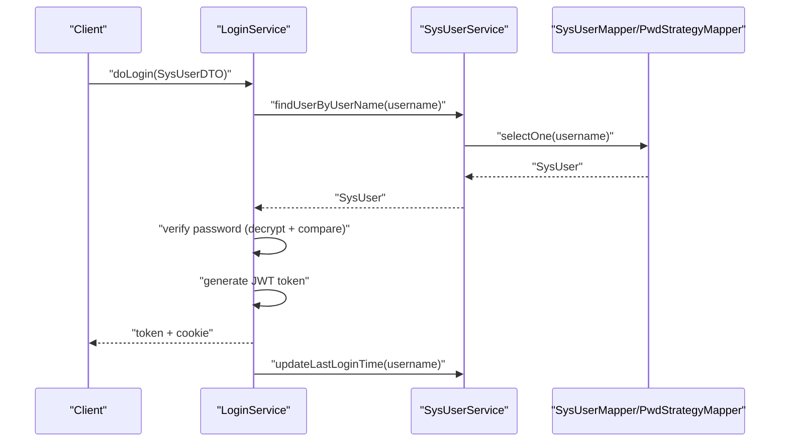

**Diagram sources**
- [LoginService.java:54-93](file://watcher-agent/src/main/java/com/virtual/cloud/om/agent/service/auth/LoginService.java#L54-L93)
- [SysUserService.java:22-37](file://watcher-agent/src/main/java/com/virtual/cloud/om/agent/service/SysUserService.java#L22-L37)

**Section sources**
- [LoginService.java:54-141](file://watcher-agent/src/main/java/com/virtual/cloud/om/agent/service/auth/LoginService.java#L54-L141)
- [SysUserService.java:22-37](file://watcher-agent/src/main/java/com/virtual/cloud/om/agent/service/SysUserService.java#L22-L37)

### Data Center Management
- DataCenterService implements DataCenterApi with simplified stubs for initialization steps, current step retrieval, and WebSocket state queries. These are disabled in MySQL single-node mode.

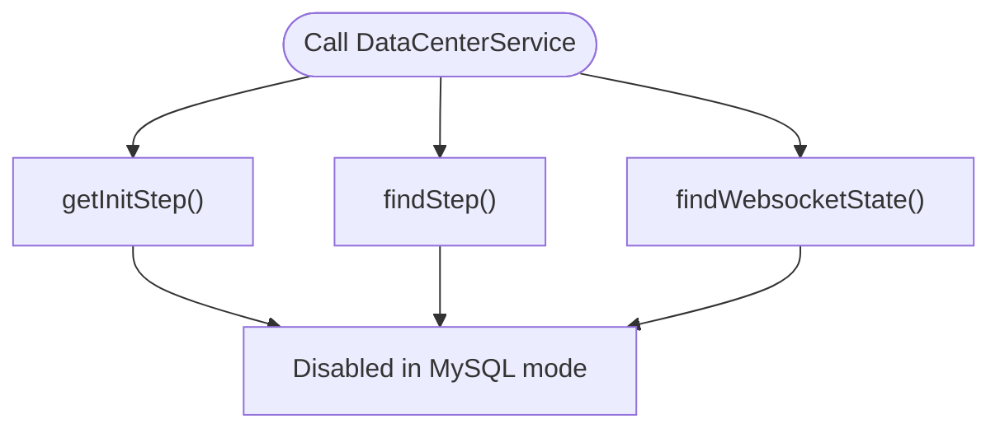

**Diagram sources**
- [DataCenterService.java:20-49](file://watcher-agent/src/main/java/com/virtual/cloud/om/agent/service/datacenter/DataCenterService.java#L20-L49)

**Section sources**
- [DataCenterService.java:20-49](file://watcher-agent/src/main/java/com/virtual/cloud/om/agent/service/datacenter/DataCenterService.java#L20-L49)

### Deployment Orchestration
- DeployService implements DeployApi with numerous methods for deployment, health checks, component management, networking, routing, and service lifecycle operations. All are disabled in MySQL single-node mode.

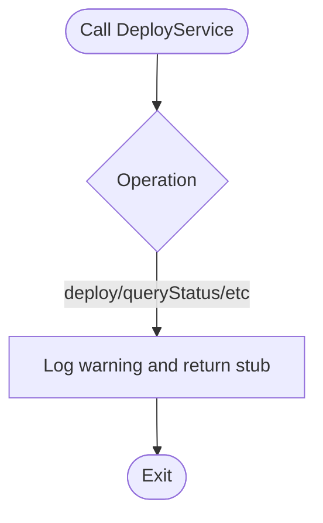

**Diagram sources**
- [DeployService.java:42-231](file://watcher-agent/src/main/java/com/virtual/cloud/om/agent/service/deploy/DeployService.java#L42-L231)

**Section sources**
- [DeployService.java:42-231](file://watcher-agent/src/main/java/com/virtual/cloud/om/agent/service/deploy/DeployService.java#L42-L231)

### Resource Management
- ResourceService
  - Syncs resources from DTOs to persistence, validates required fields, and maintains task associations.
  - Deletes tasks for removed resources and logs that real-time log feature is disabled in MySQL mode.
  - Resolves REST hosts from resource records and applies platform-specific checks.

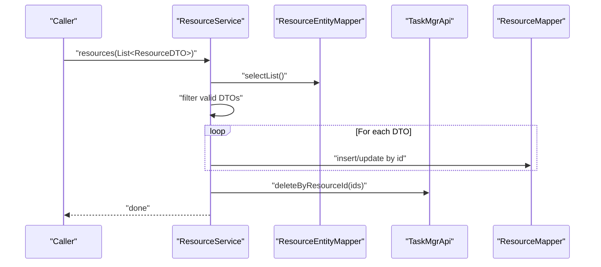

**Diagram sources**
- [ResourceService.java:93-152](file://watcher-agent/src/main/java/com/virtual/cloud/om/agent/service/resource/ResourceService.java#L93-L152)
- [TaskMgrApiImpl.java:149-162](file://watcher-agent/src/main/java/com/virtual/cloud/om/agent/service/task/TaskMgrApiImpl.java#L149-L162)

**Section sources**
- [ResourceService.java:56-214](file://watcher-agent/src/main/java/com/virtual/cloud/om/agent/service/resource/ResourceService.java#L56-L214)
- [TaskMgrApiImpl.java:149-162](file://watcher-agent/src/main/java/com/virtual/cloud/om/agent/service/task/TaskMgrApiImpl.java#L149-L162)

### Monitoring Strategies
- StrategyServiceImpl
  - Pulls strategy definitions, separates one-time vs scheduled strategies, computes task IDs, and schedules tasks via TaskMgrApi.
  - Handles task insertion, updates, deletions, and grouping per resource ID.
- WarnStrategyServiceImpl
  - Similar to strategy service but for warnings, with master node detection and task synchronization.

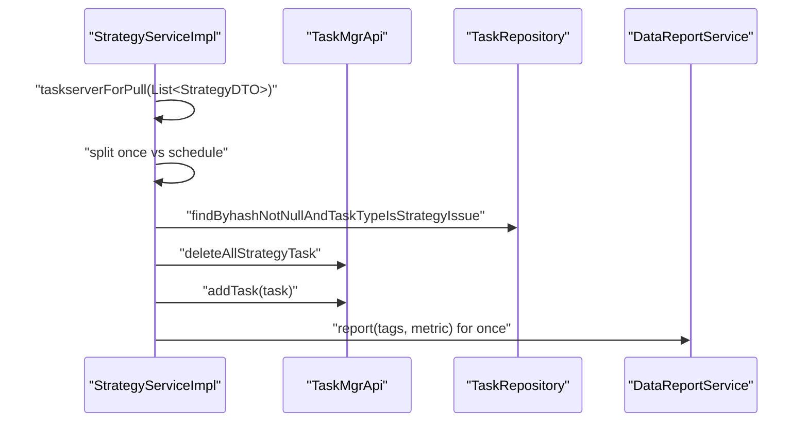

**Diagram sources**
- [StrategyServiceImpl.java:81-128](file://watcher-agent/src/main/java/com/virtual/cloud/om/agent/service/strategy/StrategyServiceImpl.java#L81-L128)
- [StrategyServiceImpl.java:203-239](file://watcher-agent/src/main/java/com/virtual/cloud/om/agent/service/strategy/StrategyServiceImpl.java#L203-L239)

**Section sources**
- [StrategyServiceImpl.java:68-327](file://watcher-agent/src/main/java/com/virtual/cloud/om/agent/service/strategy/StrategyServiceImpl.java#L68-L327)
- [WarnStrategyServiceImpl.java:89-297](file://watcher-agent/src/main/java/com/virtual/cloud/om/agent/service/warn/WarnStrategyServiceImpl.java#L89-L297)

### Log Processing
- LogService
  - Provides stubs for saving operation logs, querying logs, deleting logs, and saving Kafka consumer offset logs.
- RealTimeLogService
  - Integrates with platform HostApi and LogPatternApi implementations, converts requests to strategies, and attempts to deploy/modify FileBeat configurations. All Kafka-related features are disabled in MySQL single-node mode.
- LogLineParserUtil
  - Parses structured log lines using regex patterns and extracts fields into a LogLine model.

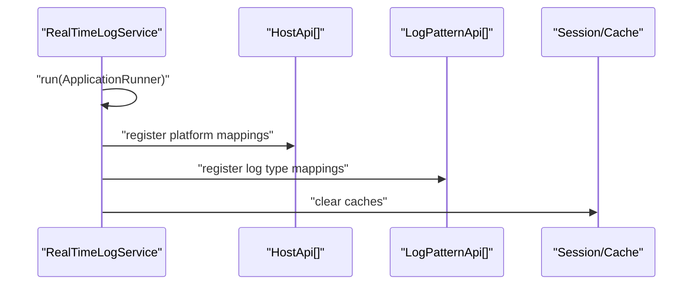

**Diagram sources**
- [RealTimeLogService.java:187-197](file://watcher-agent/src/main/java/com/virtual/cloud/om/agent/service/logs/RealTimeLogService.java#L187-L197)
- [LogLineParserUtil.java:35-63](file://watcher-agent/src/main/java/com/virtual/cloud/om/agent/service/logs/LogLineParserUtil.java#L35-L63)

**Section sources**
- [LogService.java:24-49](file://watcher-agent/src/main/java/com/virtual/cloud/om/agent/service/logs/LogService.java#L24-L49)
- [RealTimeLogService.java:115-272](file://watcher-agent/src/main/java/com/virtual/cloud/om/agent/service/logs/RealTimeLogService.java#L115-L272)
- [LogLineParserUtil.java:35-63](file://watcher-agent/src/main/java/com/virtual/cloud/om/agent/service/logs/LogLineParserUtil.java#L35-L63)

### Parameter Configuration
- ParameterService
  - Implements ParameterApi with stubs for parameter query, edit, and delete operations.

**Section sources**
- [ParameterService.java:25-50](file://watcher-agent/src/main/java/com/virtual/cloud/om/agent/service/parameter/ParameterService.java#L25-L50)

### Data Reporting
- DataReportService
  - Orchestrates metric collection across collectors, supports mandatory static data reporting with distributed locking, and aggregates results.
  - Uses ResourceApi to resolve platform and credentials, and TaskMgrApi to synchronize tasks derived from strategies.

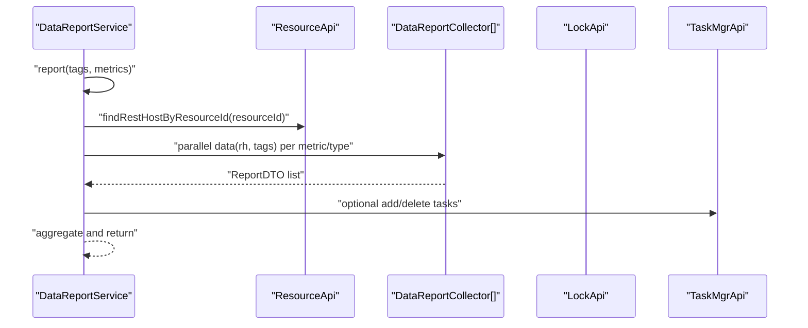

**Diagram sources**
- [DataReportService.java:115-140](file://watcher-agent/src/main/java/com/virtual/cloud/om/agent/service/report/DataReportService.java#L115-L140)
- [DataReportService.java:184-223](file://watcher-agent/src/main/java/com/virtual/cloud/om/agent/service/report/DataReportService.java#L184-L223)

**Section sources**
- [DataReportService.java:89-325](file://watcher-agent/src/main/java/com/virtual/cloud/om/agent/service/report/DataReportService.java#L89-L325)

### Task Management
- TaskMgrApiImpl
  - Persists tasks to the database with transactional semantics, supports add/update/delete operations, and deletes tasks by resource ID.

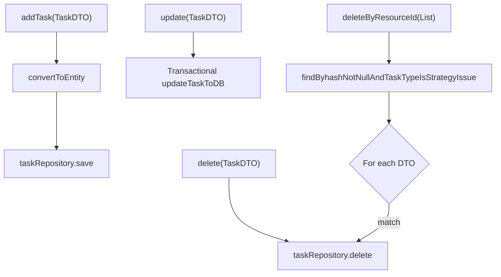

**Diagram sources**
- [TaskMgrApiImpl.java:75-163](file://watcher-agent/src/main/java/com/virtual/cloud/om/agent/service/task/TaskMgrApiImpl.java#L75-L163)

**Section sources**
- [TaskMgrApiImpl.java:75-163](file://watcher-agent/src/main/java/com/virtual/cloud/om/agent/service/task/TaskMgrApiImpl.java#L75-L163)

### Locking Mechanisms
- WatcherLockService
  - Provides in-memory distributed lock with acquire/release/refresh operations keyed by a string token and expiration window.

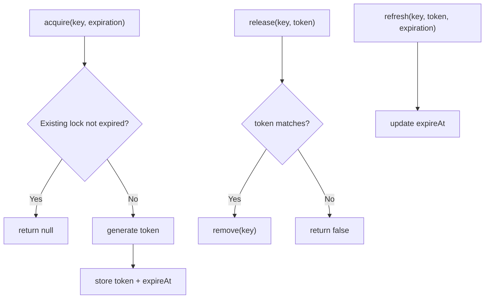

**Diagram sources**
- [WatcherLockService.java:33-68](file://watcher-agent/src/main/java/com/virtual/cloud/om/agent/service/lock/WatcherLockService.java#L33-L68)

**Section sources**
- [WatcherLockService.java:33-68](file://watcher-agent/src/main/java/com/virtual/cloud/om/agent/service/lock/WatcherLockService.java#L33-L68)

### SSH Authentication
- ResourceAuthService
  - Delegates SSH authentication checks and modifications to platform-specific SshAuthAbstract implementations registered via constructor injection.

**Section sources**
- [ResourceAuthService.java:31-44](file://watcher-agent/src/main/java/com/virtual/cloud/om/agent/service/ssh/ResourceAuthService.java#L31-L44)

## Dependency Analysis
- Dependency Injection
  - Services use constructor-based injection for final fields and setter injection for optional SDK interfaces.
  - PostConstruct initializes maps for platform/host/log pattern dispatchers.
- Coupling and Cohesion
  - Services are cohesive around domains and loosely coupled via SDK interfaces.
  - DataReportService depends on ResourceApi, LockApi, TaskMgrApi, and DataReportCollector implementations.
- External Integrations
  - SDK interfaces abstract integrations with data center, resource, task manager, lock, real-time log, parameter, deploy, host, and log pattern providers.
- Transaction Management
  - TaskMgrApiImpl uses @Transactional for add/update operations to ensure atomicity.

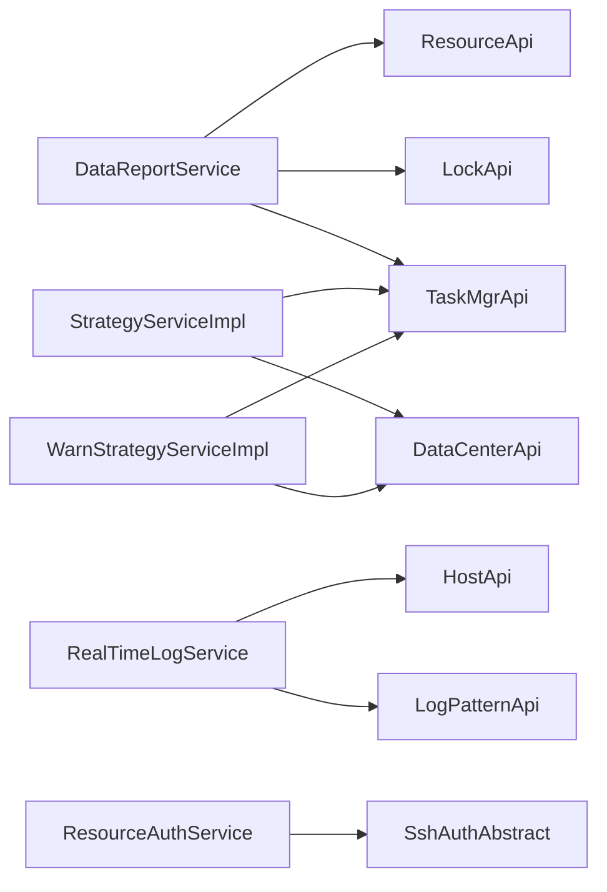

**Diagram sources**
- [DataReportService.java:51-84](file://watcher-agent/src/main/java/com/virtual/cloud/om/agent/service/report/DataReportService.java#L51-L84)
- [StrategyServiceImpl.java:52-64](file://watcher-agent/src/main/java/com/virtual/cloud/om/agent/service/strategy/StrategyServiceImpl.java#L52-L64)
- [WarnStrategyServiceImpl.java:36-52](file://watcher-agent/src/main/java/com/virtual/cloud/om/agent/service/warn/WarnStrategyServiceImpl.java#L36-L52)
- [RealTimeLogService.java:66-72](file://watcher-agent/src/main/java/com/virtual/cloud/om/agent/service/logs/RealTimeLogService.java#L66-L72)
- [ResourceAuthService.java:23-29](file://watcher-agent/src/main/java/com/virtual/cloud/om/agent/service/ssh/ResourceAuthService.java#L23-L29)

**Section sources**
- [DataReportService.java:51-84](file://watcher-agent/src/main/java/com/virtual/cloud/om/agent/service/report/DataReportService.java#L51-L84)
- [StrategyServiceImpl.java:52-64](file://watcher-agent/src/main/java/com/virtual/cloud/om/agent/service/strategy/StrategyServiceImpl.java#L52-L64)
- [WarnStrategyServiceImpl.java:36-52](file://watcher-agent/src/main/java/com/virtual/cloud/om/agent/service/warn/WarnStrategyServiceImpl.java#L36-L52)
- [RealTimeLogService.java:66-72](file://watcher-agent/src/main/java/com/virtual/cloud/om/agent/service/logs/RealTimeLogService.java#L66-L72)
- [ResourceAuthService.java:23-29](file://watcher-agent/src/main/java/com/virtual/cloud/om/agent/service/ssh/ResourceAuthService.java#L23-L29)

## Performance Considerations
- Parallelism
  - DataReportService uses CompletableFuture to parallelize metric collection across types and metrics.
- Asynchronous Execution
  - Strategy and warning services schedule periodic tasks and use CloudExecutorServices for background pulls.
- In-Memory Locking
  - WatcherLockService avoids external dependencies but limits distribution across nodes; consider replacing with Redis/Zookeeper in clustered environments.
- Database Persistence
  - TaskMgrApiImpl persists tasks to the local database; ensure proper indexing on task fields to optimize lookups and deletions.

## Troubleshooting Guide
- Authentication failures
  - Verify user existence and password decryption; check token expiration and refresh logic.
- Resource synchronization errors
  - Review validation filters and exception logging during resource sync; confirm required fields are present.
- Data reporting failures
  - Inspect collector mapping and platform resolution; review lock acquisition and release; check error reporting DTO construction.
- Task scheduling anomalies
  - Confirm master node detection and task creation/update flows; verify resource ID-based deletions.
- Real-time log disabled features
  - Understand that Kafka/FileBeat/Elasticsearch integrations are disabled in MySQL single-node mode; expect warnings and empty results.

**Section sources**
- [LoginService.java:76-93](file://watcher-agent/src/main/java/com/virtual/cloud/om/agent/service/auth/LoginService.java#L76-L93)
- [ResourceService.java:84-87](file://watcher-agent/src/main/java/com/virtual/cloud/om/agent/service/resource/ResourceService.java#L84-L87)
- [DataReportService.java:194-212](file://watcher-agent/src/main/java/com/virtual/cloud/om/agent/service/report/DataReportService.java#L194-L212)
- [TaskMgrApiImpl.java:149-162](file://watcher-agent/src/main/java/com/virtual/cloud/om/agent/service/task/TaskMgrApiImpl.java#L149-L162)
- [RealTimeLogService.java:115-118](file://watcher-agent/src/main/java/com/virtual/cloud/om/agent/service/logs/RealTimeLogService.java#L115-L118)

## Conclusion
The watcher-agent service layer implements a robust, modular design centered on SDK abstractions. While many features are disabled in MySQL single-node mode, the architecture preserves clear separation of concerns, dependency injection, and transactional integrity. For production deployments requiring clustering and advanced integrations, consider enabling distributed capabilities for locking, real-time log streaming, and parameter/data center orchestration.