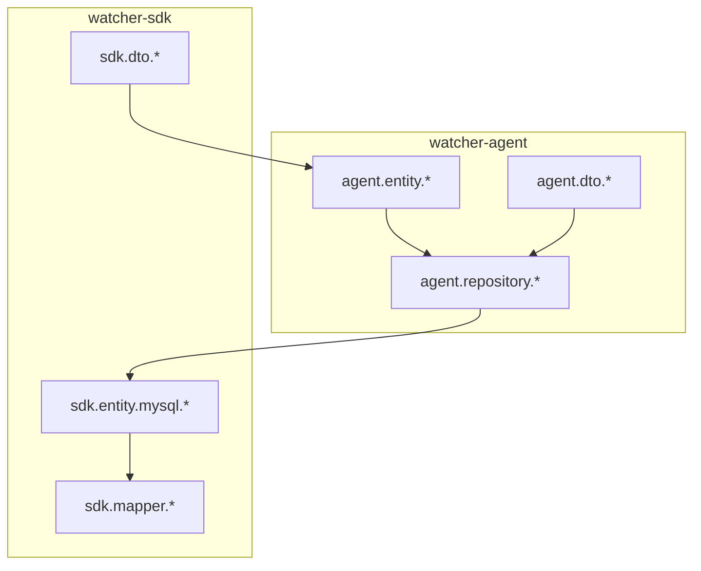
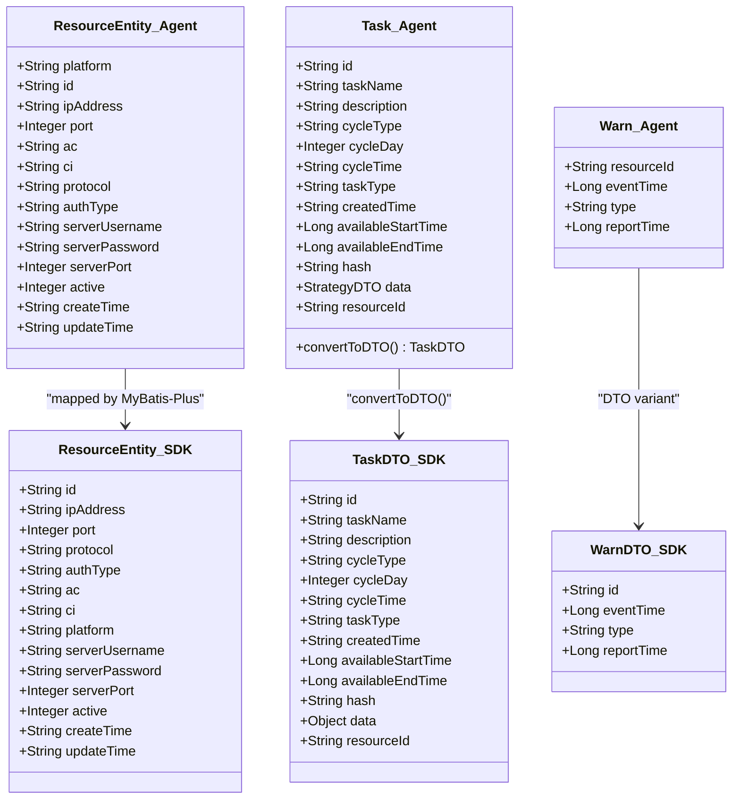
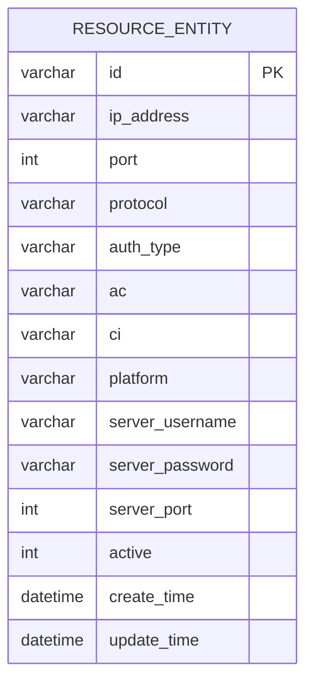
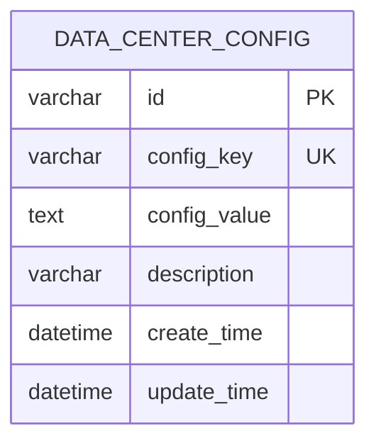
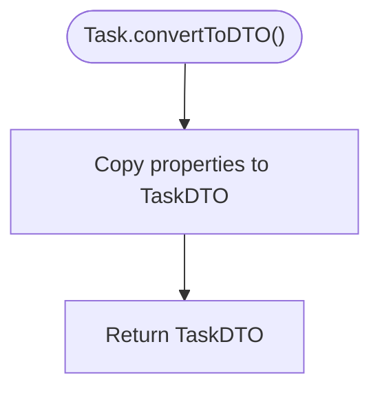
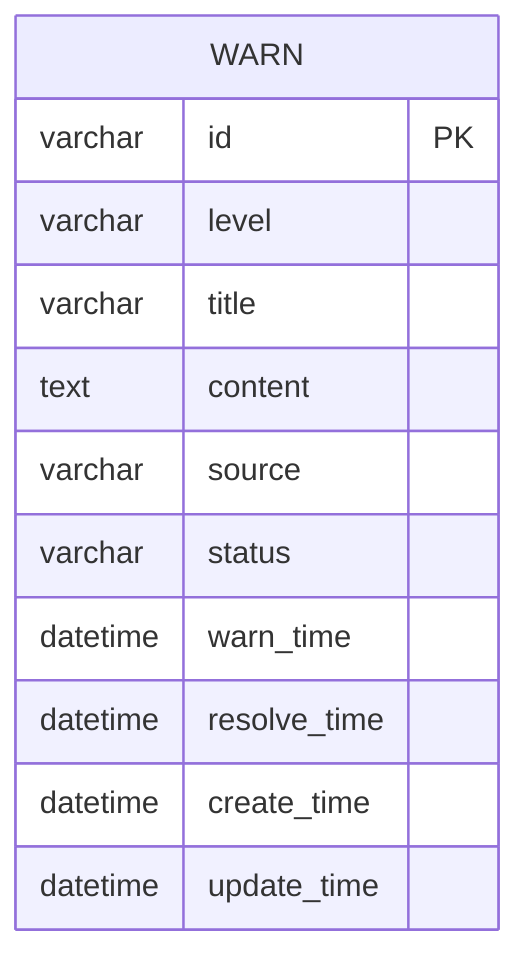
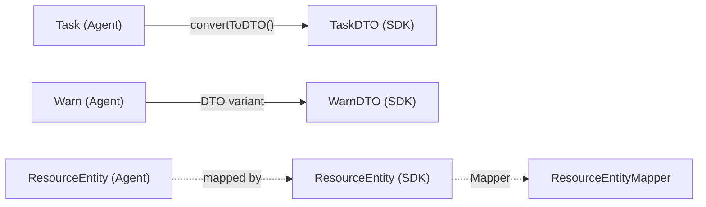
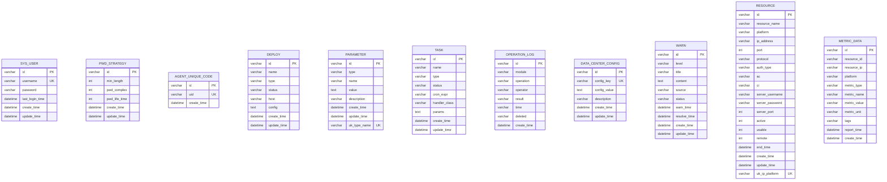

# Data Models & Database Schema

<cite>
**Referenced Files in This Document**
- [ResourceEntity.java](file://watcher-agent/src/main/java/com/virtual/cloud/om/agent/entity/ResourceEntity.java)
- [DataCenterConfig.java](file://watcher-agent/src/main/java/com/virtual/cloud/om/agent/entity/DataCenterConfig.java)
- [Task.java](file://watcher-agent/src/main/java/com/virtual/cloud/om/agent/entity/Task.java)
- [Warn.java](file://watcher-agent/src/main/java/com/virtual/cloud/om/agent/entity/Warn.java)
- [TaskDTO.java](file://watcher-sdk/src/main/java/com/virtual/cloud/om/sdk/dto/TaskDTO.java)
- [WarnDTO.java](file://watcher-sdk/src/main/java/com/virtual/cloud/om/sdk/dto/WarnDTO.java)
- [schema-mysql.sql](file://watcher-agent/src/main/resources/schema-mysql.sql)
- [ResourceEntity.java](file://watcher-sdk/src/main/java/com/virtual/cloud/om/sdk/entity/mysql/ResourceEntity.java)
- [ResourceEntityMapper.java](file://watcher-sdk/src/main/java/com/virtual/cloud/om/sdk/mapper/ResourceEntityMapper.java)
- [TaskRepository.java](file://watcher-agent/src/main/java/com/virtual/cloud/om/agent/repository/TaskRepository.java)
- [TaskRepositoryImpl.java](file://watcher-agent/src/main/java/com/virtual/cloud/om/agent/repository/TaskRepositoryImpl.java)
</cite>

## Table of Contents
1. [Introduction](#introduction)
2. [Project Structure](#project-structure)
3. [Core Components](#core-components)
4. [Architecture Overview](#architecture-overview)
5. [Detailed Component Analysis](#detailed-component-analysis)
6. [Dependency Analysis](#dependency-analysis)
7. [Performance Considerations](#performance-considerations)
8. [Troubleshooting Guide](#troubleshooting-guide)
9. [Conclusion](#conclusion)
10. [Appendices](#appendices)

## Introduction
This document provides comprehensive data model documentation for ShowTime’s monitoring platform. It focuses on the core entities and their relationships: ResourceEntity, DataCenterConfig, Task, and Warn. It also documents the mapping between DTOs and database entities, transformation patterns, validation rules, database schema, indexing, caching strategies, performance considerations, data lifecycle and retention, migration procedures, and common dashboard query patterns.

## Project Structure
The data model spans two modules:
- watcher-agent: domain entities and repositories for task and warn management, plus DTOs for data center configuration.
- watcher-sdk: shared DTOs and MyBatis-Plus entities/mappers for MySQL-backed persistence.

Key locations:
- Entities and DTOs: watcher-agent/src/main/java/com/virtual/cloud/om/agent/{entity,dto}
- SDK entities and mappers: watcher-sdk/src/main/java/com/virtual/cloud/om/sdk/{entity,mapper,dto}
- Database schema: watcher-agent/src/main/resources/schema-mysql.sql

**Section sources**
- [schema-mysql.sql:1-204](file://watcher-agent/src/main/resources/schema-mysql.sql#L1-L204)

## Core Components
This section defines the core entities and their fields, types, and constraints. It also outlines DTO-to-entity transformations and validation rules.

- ResourceEntity (Agent-side)
  - Purpose: Represents monitored resource metadata (platform, IP, credentials, activation).
  - Fields: platform, id, ipAddress, port, ac, ci, protocol, authType, serverUsername, serverPassword, serverPort, active, createTime, updateTime.
  - Notes: Used primarily for credential and connectivity management.

- DataCenterConfig (Agent-side)
  - Purpose: Stores data center connection credentials and metadata.
  - Fields: id, ip, username, password, port, datacenterType.
  - Constraints: Unique key on (ip, platform) exists in the MySQL schema for resource table; DataCenterConfig is a separate configuration table.

- Task (Agent-side)
  - Purpose: Defines scheduled or ad-hoc tasks for strategy issuance/pull, health checks, and other operations.
  - Fields: id, taskName, description, cycleType, cycleDay, cycleTime, taskType, createdTime, availableStartTime, availableEndTime, hash, data (StrategyDTO), resourceId.
  - Validation: cycleType supports predefined constants; taskType includes constants for strategy issue/pull, health check, filebeat check, watcher warn, and ssh close.

- Warn (Agent-side)
  - Purpose: Tracks latest warning events per resource.
  - Fields: resourceId, eventTime, type, reportTime.

- DTOs
  - TaskDTO (SDK): Mirrors Task fields; includes data as Object for strategy payload.
  - WarnDTO (SDK): Mirrors Warn fields; id is the warning record identifier.

- Transformation patterns
  - Task.convertToDTO(): Copies Task fields to TaskDTO using property copying.
  - ResourceEntity (SDK) vs ResourceEntity (Agent): Agent-side DTOs are annotated for API docs; SDK-side entity is mapped to MySQL table resource_entity.

- Validation rules
  - Task.cycleType and taskType use predefined constants; invalid values should be rejected by callers.
  - DataCenterConfig.username/password are exposed as DTO fields; encryption/decryption handled externally.

**Section sources**
- [ResourceEntity.java:12-52](file://watcher-agent/src/main/java/com/virtual/cloud/om/agent/entity/ResourceEntity.java#L12-L52)
- [DataCenterConfig.java:11-38](file://watcher-agent/src/main/java/com/virtual/cloud/om/agent/entity/DataCenterConfig.java#L11-L38)
- [Task.java:21-146](file://watcher-agent/src/main/java/com/virtual/cloud/om/agent/entity/Task.java#L21-L146)
- [Warn.java:18-36](file://watcher-agent/src/main/java/com/virtual/cloud/om/agent/entity/Warn.java#L18-L36)
- [TaskDTO.java:18-67](file://watcher-sdk/src/main/java/com/virtual/cloud/om/sdk/dto/TaskDTO.java#L18-L67)
- [WarnDTO.java:11-28](file://watcher-sdk/src/main/java/com/virtual/cloud/om/sdk/dto/WarnDTO.java#L11-L28)

## Architecture Overview
The data layer follows a layered pattern:
- Domain entities (watcher-agent) encapsulate business logic and DTOs.
- SDK entities and mappers (watcher-sdk) provide MyBatis-Plus mapping to MySQL tables.
- Repositories (watcher-agent) define access contracts; current implementation logs disabled operations for MySQL single-node mode.

**Diagram sources**
- [ResourceEntity.java:12-52](file://watcher-agent/src/main/java/com/virtual/cloud/om/agent/entity/ResourceEntity.java#L12-L52)
- [ResourceEntity.java:13-47](file://watcher-sdk/src/main/java/com/virtual/cloud/om/sdk/entity/mysql/ResourceEntity.java#L13-L47)
- [Task.java:140-144](file://watcher-agent/src/main/java/com/virtual/cloud/om/agent/entity/Task.java#L140-L144)
- [TaskDTO.java:18-67](file://watcher-sdk/src/main/java/com/virtual/cloud/om/sdk/dto/TaskDTO.java#L18-L67)
- [Warn.java:18-36](file://watcher-agent/src/main/java/com/virtual/cloud/om/agent/entity/Warn.java#L18-L36)
- [WarnDTO.java:11-28](file://watcher-sdk/src/main/java/com/virtual/cloud/om/sdk/dto/WarnDTO.java#L11-L28)

## Detailed Component Analysis

### ResourceEntity
- Agent-side ResourceEntity: API-focused DTO with Swagger annotations for documentation.
- SDK-side ResourceEntity: MyBatis-Plus mapped entity targeting MySQL table resource_entity.
- Mapping: Both share similar fields; SDK entity adds explicit table mapping and ID strategy.

**Diagram sources**
- [schema-mysql.sql:155-176](file://watcher-agent/src/main/resources/schema-mysql.sql#L155-L176)

**Section sources**
- [ResourceEntity.java:12-52](file://watcher-agent/src/main/java/com/virtual/cloud/om/agent/entity/ResourceEntity.java#L12-L52)
- [ResourceEntity.java:13-47](file://watcher-sdk/src/main/java/com/virtual/cloud/om/sdk/entity/mysql/ResourceEntity.java#L13-L47)
- [ResourceEntityMapper.java:10-13](file://watcher-sdk/src/main/java/com/virtual/cloud/om/sdk/mapper/ResourceEntityMapper.java#L10-L13)

### DataCenterConfig
- Agent-side DataCenterConfig: Holds data center connection info and type.
- SDK-side: No direct entity; configuration stored in data_center_config table.

**Diagram sources**
- [schema-mysql.sql:122-130](file://watcher-agent/src/main/resources/schema-mysql.sql#L122-L130)

**Section sources**
- [DataCenterConfig.java:11-38](file://watcher-agent/src/main/java/com/virtual/cloud/om/agent/entity/DataCenterConfig.java#L11-L38)
- [DataCenterConfigDTO.java:11-26](file://watcher-agent/src/main/java/com/virtual/cloud/om/agent/dto/DataCenterConfigDTO.java#L11-L26)

### Task
- Agent-side Task: Business entity with constants for state, type, cycleType, and target object types; includes conversion to TaskDTO.
- Repository contract: TaskRepository defines CRUD-like methods; current implementation logs disabled operations for MySQL single-node mode.

**Diagram sources**
- [Task.java:140-144](file://watcher-agent/src/main/java/com/virtual/cloud/om/agent/entity/Task.java#L140-L144)

**Section sources**
- [Task.java:21-146](file://watcher-agent/src/main/java/com/virtual/cloud/om/agent/entity/Task.java#L21-L146)
- [TaskRepository.java:12-33](file://watcher-agent/src/main/java/com/virtual/cloud/om/agent/repository/TaskRepository.java#L12-L33)
- [TaskRepositoryImpl.java:19-77](file://watcher-agent/src/main/java/com/virtual/cloud/om/agent/repository/TaskRepositoryImpl.java#L19-L77)

### Warn
- Agent-side Warn: Tracks latest warning per resource with event and report timestamps.
- SDK-side WarnDTO: Warning record DTO with id as the warning record identifier.

**Diagram sources**
- [schema-mysql.sql:135-147](file://watcher-agent/src/main/resources/schema-mysql.sql#L135-L147)

**Section sources**
- [Warn.java:18-36](file://watcher-agent/src/main/java/com/virtual/cloud/om/agent/entity/Warn.java#L18-L36)
- [WarnDTO.java:11-28](file://watcher-sdk/src/main/java/com/virtual/cloud/om/sdk/dto/WarnDTO.java#L11-L28)

## Dependency Analysis
- Entity-to-DTO mapping:
  - Task.convertToDTO() copies Task to TaskDTO.
  - Warn and WarnDTO are distinct DTOs; no direct conversion method is present.
- Persistence:
  - ResourceEntity (SDK) is mapped via ResourceEntityMapper to resource_entity table.
  - Task and Warn are persisted in MySQL tables task and warn respectively.
- Repository access:
  - TaskRepository defines methods; TaskRepositoryImpl currently logs disabled operations for MySQL single-node mode.

**Diagram sources**
- [Task.java:140-144](file://watcher-agent/src/main/java/com/virtual/cloud/om/agent/entity/Task.java#L140-L144)
- [TaskDTO.java:18-67](file://watcher-sdk/src/main/java/com/virtual/cloud/om/sdk/dto/TaskDTO.java#L18-L67)
- [Warn.java:18-36](file://watcher-agent/src/main/java/com/virtual/cloud/om/agent/entity/Warn.java#L18-L36)
- [WarnDTO.java:11-28](file://watcher-sdk/src/main/java/com/virtual/cloud/om/sdk/dto/WarnDTO.java#L11-L28)
- [ResourceEntity.java:13-47](file://watcher-sdk/src/main/java/com/virtual/cloud/om/sdk/entity/mysql/ResourceEntity.java#L13-L47)
- [ResourceEntityMapper.java:10-13](file://watcher-sdk/src/main/java/com/virtual/cloud/om/sdk/mapper/ResourceEntityMapper.java#L10-L13)

**Section sources**
- [TaskRepositoryImpl.java:19-77](file://watcher-agent/src/main/java/com/virtual/cloud/om/agent/repository/TaskRepositoryImpl.java#L19-L77)

## Performance Considerations
- Indexes
  - operation_log: deleted, time
  - parameter: type+name
  - deploy: status
  - task: status
  - warn: status, level
  - resource: platform, ip_address, usable
  - metric_data: resource_id, metric_type, report_time, platform
- Recommendations
  - Use indexed filters for frequent queries (status, level, platform, ip_address).
  - Batch writes for metrics; avoid row-level contention on hot keys.
  - Consider partitioning metric_data by time for long-term retention.
  - Cache frequently accessed resource configurations keyed by (ip_address, platform).

[No sources needed since this section provides general guidance]

## Troubleshooting Guide
- TaskRepository disabled operations
  - Symptom: All TaskRepository methods log disabled operations and return empty/default values.
  - Cause: Current implementation is adapted for MySQL single-node mode.
  - Action: Implement or replace with MyBatis-Plus repository for full CRUD support.
- Missing mappers
  - Symptom: TaskMapper/WarnMapper not found under watcher-sdk.
  - Action: Add corresponding mapper interfaces extending BaseMapper for task and warn tables.
- Data center credentials exposure
  - Symptom: username/password appear as DTO fields.
  - Action: Enforce encryption/decryption at transport boundaries; validate credentials before persistence.

**Section sources**
- [TaskRepositoryImpl.java:21-29](file://watcher-agent/src/main/java/com/virtual/cloud/om/agent/repository/TaskRepositoryImpl.java#L21-L29)
- [TaskRepositoryImpl.java:39-46](file://watcher-agent/src/main/java/com/virtual/cloud/om/agent/repository/TaskRepositoryImpl.java#L39-L46)

## Conclusion
The ShowTime monitoring platform employs a clear separation between domain entities (watcher-agent) and SDK-backed persistence (watcher-sdk). ResourceEntity, DataCenterConfig, Task, and Warn form the core data model. DTOs facilitate cross-module communication, with Task providing a conversion method to TaskDTO. The MySQL schema defines robust constraints and indexes for performance. Current repository implementations are simplified for single-node MySQL; production deployments should enable full CRUD via MyBatis-Plus and implement proper caching and retention strategies.

[No sources needed since this section summarizes without analyzing specific files]

## Appendices

### Database Schema Reference
- Tables and indexes
  - sys_user, pwd_strategy, agent_unique_code, deploy, parameter, task, operation_log, data_center_config, warn, resource, metric_data.

**Diagram sources**
- [schema-mysql.sql:11-19](file://watcher-agent/src/main/resources/schema-mysql.sql#L11-L19)
- [schema-mysql.sql:28-36](file://watcher-agent/src/main/resources/schema-mysql.sql#L28-L36)
- [schema-mysql.sql:44-49](file://watcher-agent/src/main/resources/schema-mysql.sql#L44-L49)
- [schema-mysql.sql:54-64](file://watcher-agent/src/main/resources/schema-mysql.sql#L54-L64)
- [schema-mysql.sql:69-79](file://watcher-agent/src/main/resources/schema-mysql.sql#L69-L79)
- [schema-mysql.sql:84-95](file://watcher-agent/src/main/resources/schema-mysql.sql#L84-L95)
- [schema-mysql.sql:100-110](file://watcher-agent/src/main/resources/schema-mysql.sql#L100-L110)
- [schema-mysql.sql:122-130](file://watcher-agent/src/main/resources/schema-mysql.sql#L122-L130)
- [schema-mysql.sql:135-147](file://watcher-agent/src/main/resources/schema-mysql.sql#L135-L147)
- [schema-mysql.sql:155-176](file://watcher-agent/src/main/resources/schema-mysql.sql#L155-L176)
- [schema-mysql.sql:185-203](file://watcher-agent/src/main/resources/schema-mysql.sql#L185-L203)

### Sample Data Examples
- ResourceEntity (SDK)
  - Example fields: id, ipAddress, port, protocol, authType, ac, ci, platform, serverUsername, serverPassword, serverPort, active, createTime, updateTime.
- DataCenterConfig (Agent)
  - Example fields: id, ip, username, password, port, datacenterType.
- Task (Agent)
  - Example fields: id, taskName, description, cycleType, cycleDay, cycleTime, taskType, createdTime, availableStartTime, availableEndTime, hash, data (StrategyDTO), resourceId.
- Warn (Agent)
  - Example fields: resourceId, eventTime, type, reportTime.

**Section sources**
- [ResourceEntity.java:13-47](file://watcher-sdk/src/main/java/com/virtual/cloud/om/sdk/entity/mysql/ResourceEntity.java#L13-L47)
- [DataCenterConfig.java:25-38](file://watcher-agent/src/main/java/com/virtual/cloud/om/agent/entity/DataCenterConfig.java#L25-L38)
- [Task.java:93-144](file://watcher-agent/src/main/java/com/virtual/cloud/om/agent/entity/Task.java#L93-L144)
- [Warn.java:21-36](file://watcher-agent/src/main/java/com/virtual/cloud/om/agent/entity/Warn.java#L21-L36)

### Common Query Patterns for Monitoring Dashboards
- Retrieve active resources by platform and usability
  - Filter: platform, usable = 1
  - Index: resource(platform), resource(usable)
- Fetch recent warnings by status and level
  - Filter: status, level
  - Index: warn(status), warn(level)
- Get metrics for a resource within a time window
  - Filter: resource_id, report_time range
  - Index: metric_data(resource_id), metric_data(report_time)
- List tasks by status and type
  - Filter: status, type
  - Index: task(status)

**Section sources**
- [schema-mysql.sql:178-181](file://watcher-agent/src/main/resources/schema-mysql.sql#L178-L181)
- [schema-mysql.sql:149-151](file://watcher-agent/src/main/resources/schema-mysql.sql#L149-L151)
- [schema-mysql.sql:200-203](file://watcher-agent/src/main/resources/schema-mysql.sql#L200-L203)
- [schema-mysql.sql:117](file://watcher-agent/src/main/resources/schema-mysql.sql#L117)

### Data Lifecycle Management and Retention
- Retention policy recommendations
  - Keep raw metrics for 90–180 days; archive older entries.
  - Purge resolved warnings after 30 days; maintain audit trail for 1 year.
  - Rotate operation logs by quarter; compress historical partitions.
- Migration procedures
  - Schema updates: wrap DDL in migrations with pre/post validations.
  - Data migrations: batch process with progress tracking and rollback steps.
  - Backups: snapshot-based backups with point-in-time recovery enabled.

[No sources needed since this section provides general guidance]