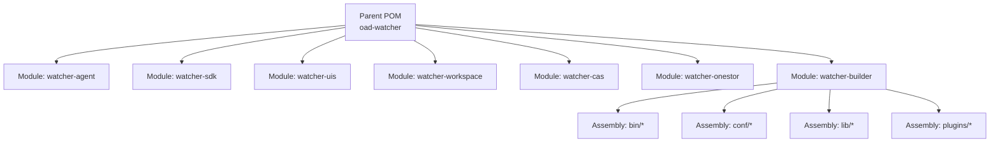
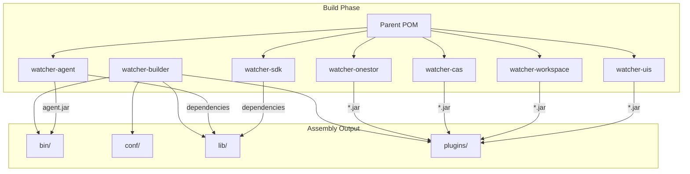
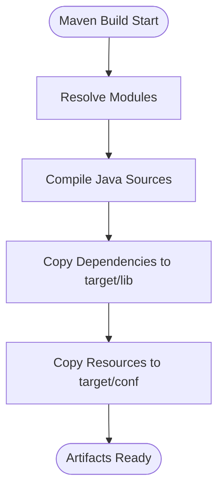
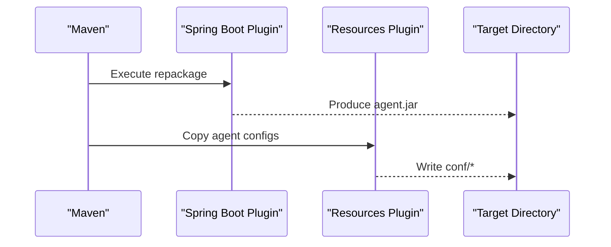
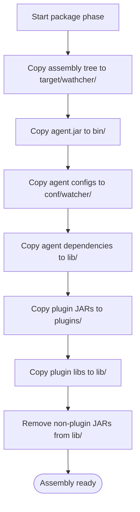
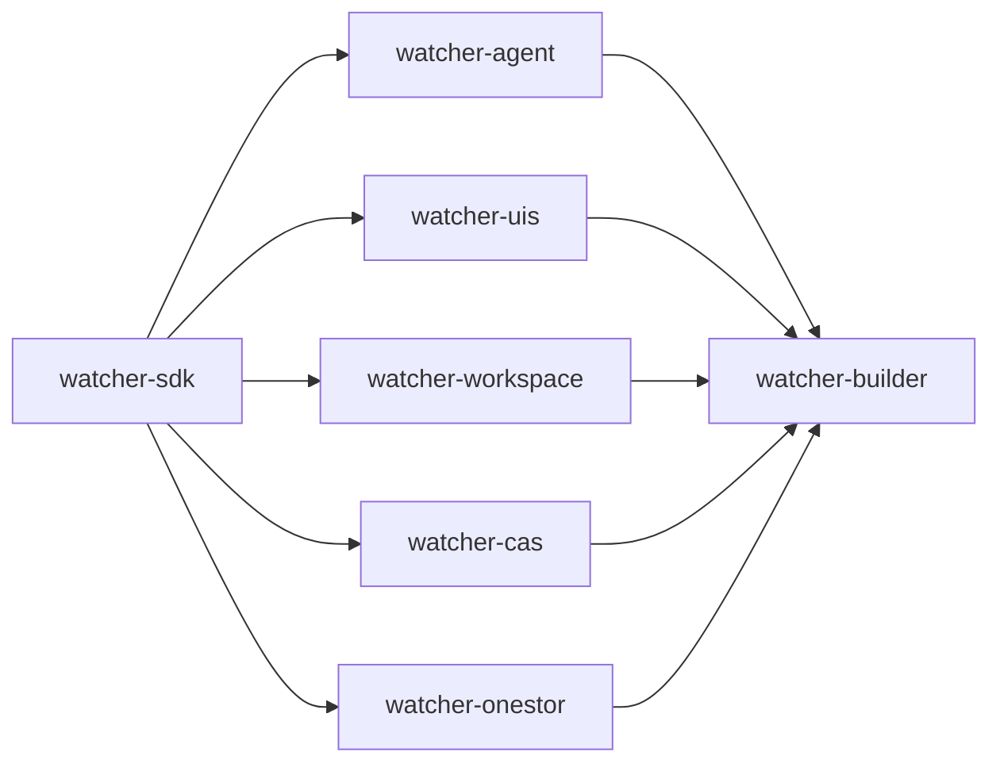

# Build & Packaging

<cite>
**Referenced Files in This Document**
- [pom.xml](file://pom.xml)
- [watcher-agent/pom.xml](file://watcher-agent/pom.xml)
- [watcher-sdk/pom.xml](file://watcher-sdk/pom.xml)
- [watcher-uis/pom.xml](file://watcher-uis/pom.xml)
- [watcher-workspace/pom.xml](file://watcher-workspace/pom.xml)
- [watcher-cas/pom.xml](file://watcher-cas/pom.xml)
- [watcher-onestor/pom.xml](file://watcher-onestor/pom.xml)
- [watcher-builder/pom.xml](file://watcher-builder/pom.xml)
- [watcher-builder/assembly/bin/startup.sh](file://watcher-builder/assembly/bin/startup.sh)
- [watcher-builder/assembly/bin/shutdown.sh](file://watcher-builder/assembly/bin/shutdown.sh)
- [watcher-builder/assembly/conf/agent.service](file://watcher-builder/assembly/conf/agent.service)
- [pipeline.groovy](file://pipeline.groovy)
</cite>

## Table of Contents
1. [Introduction](#introduction)
2. [Project Structure](#project-structure)
3. [Core Components](#core-components)
4. [Architecture Overview](#architecture-overview)
5. [Detailed Component Analysis](#detailed-component-analysis)
6. [Dependency Analysis](#dependency-analysis)
7. [Performance Considerations](#performance-considerations)
8. [Troubleshooting Guide](#troubleshooting-guide)
9. [Conclusion](#conclusion)
10. [Appendices](#appendices)

## Introduction
This document explains the build and packaging system for the ShowTime monitoring platform. It covers the Maven multi-module structure, dependency management, build lifecycle phases, artifact generation, and the watcher-builder assembly process that produces deployment packages. It also provides step-by-step build instructions, environment requirements, CI/CD automation, and troubleshooting guidance.

## Project Structure
The repository is a Maven multi-module project centered around a parent POM that aggregates platform modules and the builder module. The primary modules include:
- watcher-agent: Spring Boot application that acts as the monitoring agent and runtime host for plugins.
- watcher-sdk: Shared SDK used across platform modules.
- watcher-uis, watcher-workspace, watcher-cas, watcher-onestor: Plugin modules distributed as JARs under the deployment package’s plugins directory.
- watcher-builder: Aggregates artifacts from all modules into a structured deployment package and provides startup/shutdown scripts and systemd unit files.

**Diagram sources**
- [pom.xml:11-20](file://pom.xml#L11-L20)
- [watcher-builder/pom.xml:15-209](file://watcher-builder/pom.xml#L15-L209)

**Section sources**
- [pom.xml:11-20](file://pom.xml#L11-L20)
- [watcher-builder/pom.xml:15-209](file://watcher-builder/pom.xml#L15-L209)

## Core Components
- Parent POM (oad-watcher): Defines shared properties, dependency management, and common build plugins (compiler, resources, dependency copy).
- watcher-agent: Produces a Spring Boot fat JAR named agent.jar and copies additional configuration resources to the build output.
- watcher-sdk: Provides shared APIs, utilities, and dependencies consumed by other modules.
- watcher-uis, watcher-workspace, watcher-cas, watcher-onestor: Lightweight modules packaged as plugin JARs.
- watcher-builder: Orchestrates the assembly of the deployment package (bin, conf, lib, plugins) and prepares scripts and service units.

Key build behaviors:
- The parent POM configures maven-compiler-plugin and maven-resources-plugin for all modules.
- watcher-agent configures spring-boot-maven-plugin to repack the built JAR and sets the finalName to agent.
- watcher-builder uses maven-antrun-plugin to copy artifacts and resources into the assembly directory structure during the package phase.

**Section sources**
- [pom.xml:22-47](file://pom.xml#L22-L47)
- [pom.xml:112-181](file://pom.xml#L112-L181)
- [watcher-agent/pom.xml:138-194](file://watcher-agent/pom.xml#L138-L194)
- [watcher-sdk/pom.xml:157-178](file://watcher-sdk/pom.xml#L157-L178)
- [watcher-uis/pom.xml:29-41](file://watcher-uis/pom.xml#L29-L41)
- [watcher-workspace/pom.xml:32-44](file://watcher-workspace/pom.xml#L32-L44)
- [watcher-cas/pom.xml:29-41](file://watcher-cas/pom.xml#L29-L41)
- [watcher-onestor/pom.xml:29-41](file://watcher-onestor/pom.xml#L29-L41)
- [watcher-builder/pom.xml:15-209](file://watcher-builder/pom.xml#L15-L209)

## Architecture Overview
The build and packaging architecture consists of:
- Multi-module Maven build orchestrated by the parent POM.
- Module-specific packaging and artifact generation.
- Centralized assembly via watcher-builder that consolidates JARs, configuration, libraries, and plugins.
- Deployment-ready package with standardized directory structure and startup scripts.

**Diagram sources**
- [pom.xml:11-20](file://pom.xml#L11-L20)
- [watcher-agent/pom.xml:138-194](file://watcher-agent/pom.xml#L138-L194)
- [watcher-builder/pom.xml:15-209](file://watcher-builder/pom.xml#L15-L209)

## Detailed Component Analysis

### Parent POM and Global Build Configuration
- Properties define consistent versions for Spring Boot, commons libraries, JWT, YAML, and database drivers.
- Dependency management imports Spring Boot’s dependency management and declares SDK version.
- Build plugins:
  - maven-compiler-plugin configured with UTF-8 encoding and Java 1.8 source/target.
  - pluginManagement defines maven-dependency-plugin and maven-resources-plugin behaviors for copying dependencies and resources into target/lib and target/conf respectively.

**Diagram sources**
- [pom.xml:112-181](file://pom.xml#L112-L181)

**Section sources**
- [pom.xml:22-47](file://pom.xml#L22-L47)
- [pom.xml:49-109](file://pom.xml#L49-L109)
- [pom.xml:112-181](file://pom.xml#L112-L181)

### watcher-agent: Spring Boot Application Packaging
- Final name set to agent, producing agent.jar.
- spring-boot-maven-plugin repackage goal included to build an executable JAR.
- Copies additional configuration resources from src/main/resources/agent to target/conf during package phase.
- Depends on watcher-sdk and plugin modules (UIS, Workspace, CAS, Onestor).

**Diagram sources**
- [watcher-agent/pom.xml:138-194](file://watcher-agent/pom.xml#L138-L194)

**Section sources**
- [watcher-agent/pom.xml:138-194](file://watcher-agent/pom.xml#L138-L194)

### watcher-sdk: Shared Library
- Declares common dependencies (Swagger, Jackson/GSON, MyBatis-Plus, MariaDB driver, JAXB API).
- Configures annotation processing for Lombok.

**Section sources**
- [watcher-sdk/pom.xml:17-155](file://watcher-sdk/pom.xml#L17-L155)
- [watcher-sdk/pom.xml:157-178](file://watcher-sdk/pom.xml#L157-L178)

### Plugin Modules: watcher-uis, watcher-workspace, watcher-cas, watcher-onestor
- Each module depends on watcher-sdk and exposes a thin Spring Boot web module packaged as a plugin JAR.
- watcher-builder copies each plugin JAR into the assembly’s plugins directory and their dependencies into lib.

**Section sources**
- [watcher-uis/pom.xml:15-27](file://watcher-uis/pom.xml#L15-L27)
- [watcher-workspace/pom.xml:14-30](file://watcher-workspace/pom.xml#L14-L30)
- [watcher-cas/pom.xml:15-27](file://watcher-cas/pom.xml#L15-L27)
- [watcher-onestor/pom.xml:15-27](file://watcher-onestor/pom.xml#L15-L27)

### watcher-builder: Assembly and Distribution
- Uses maven-antrun-plugin to orchestrate the assembly during the package phase:
  - Copies assembly directory tree to target/wathcher/.
  - Copies agent.jar and plugin JARs into bin and plugins respectively.
  - Copies configuration files (application.properties, application-prod.properties, logback-prod.xml) into conf/watcher and conf/performer.
  - Copies dependency JARs into lib for both agent and plugins.
  - Removes non-plugin JARs from lib to avoid duplication.
- Provides shell scripts for startup and shutdown and systemd unit files for service management.

**Diagram sources**
- [watcher-builder/pom.xml:15-209](file://watcher-builder/pom.xml#L15-L209)

**Section sources**
- [watcher-builder/pom.xml:15-209](file://watcher-builder/pom.xml#L15-L209)
- [watcher-builder/assembly/bin/startup.sh:1-81](file://watcher-builder/assembly/bin/startup.sh#L1-L81)
- [watcher-builder/assembly/bin/shutdown.sh:1-26](file://watcher-builder/assembly/bin/shutdown.sh#L1-L26)
- [watcher-builder/assembly/conf/agent.service:1-14](file://watcher-builder/assembly/conf/agent.service#L1-L14)

## Dependency Analysis
- watcher-agent depends on watcher-sdk and plugin modules (UIS, Workspace, CAS, Onestor).
- All modules inherit dependency versions from the parent’s dependencyManagement.
- watcher-builder coordinates artifact placement across bin, conf, lib, and plugins directories.

**Diagram sources**
- [watcher-agent/pom.xml:24-50](file://watcher-agent/pom.xml#L24-L50)
- [watcher-uis/pom.xml:24-26](file://watcher-uis/pom.xml#L24-L26)
- [watcher-workspace/pom.xml:26-29](file://watcher-workspace/pom.xml#L26-L29)
- [watcher-cas/pom.xml:24-26](file://watcher-cas/pom.xml#L24-L26)
- [watcher-onestor/pom.xml:24-26](file://watcher-onestor/pom.xml#L24-L26)

**Section sources**
- [pom.xml:49-109](file://pom.xml#L49-L109)
- [watcher-agent/pom.xml:24-50](file://watcher-agent/pom.xml#L24-L50)

## Performance Considerations
- Minimizing plugin count reduces startup overhead and memory footprint at runtime.
- Consolidating dependencies in lib avoids redundant JARs and reduces classpath scanning cost.
- Using Spring Boot’s repackaged JAR ensures efficient startup and reduced I/O during load.

## Troubleshooting Guide
Common build issues and resolutions:
- Java version mismatch: Ensure JAVA_HOME points to Java 1.8 or higher. The startup script validates the Java version and exits if incompatible.
- Missing dependencies in lib: Verify that maven-dependency-plugin executed and copied dependencies to target/lib during package phase.
- Incorrect finalName for agent.jar: Confirm that watcher-agent sets finalName to agent and that watcher-builder expects agent.jar in bin.
- Missing plugin JARs in plugins: Ensure plugin modules are built and that watcher-builder copies plugin JARs from each module’s target directory.
- Service unit misconfiguration: Confirm ExecStart paths in systemd unit files match the assembly layout under WATCHER_HOME.

**Section sources**
- [watcher-builder/assembly/bin/startup.sh:1-25](file://watcher-builder/assembly/bin/startup.sh#L1-L25)
- [watcher-builder/pom.xml:15-209](file://watcher-builder/pom.xml#L15-L209)
- [watcher-builder/assembly/conf/agent.service:7](file://watcher-builder/assembly/conf/agent.service#L7)

## Conclusion
The ShowTime build and packaging system leverages a Maven multi-module architecture with centralized dependency management and a dedicated assembly module. The watcher-builder consolidates artifacts into a structured deployment package, enabling straightforward installation and operation. Following the provided steps and best practices ensures reliable builds, predictable packaging, and smooth deployments.

## Appendices

### Step-by-Step Build Instructions
- Prerequisites:
  - Java 1.8 or higher with JAVA_HOME set.
  - Maven 3.6+.
- Build all modules:
  - Run the Maven build from the repository root to compile, test, and package all modules.
- Produce the deployment package:
  - Execute the watcher-builder module’s package phase to assemble bin, conf, lib, and plugins directories.
- Validate the assembly:
  - Confirm agent.jar exists in bin/, plugin JARs in plugins/, and dependencies in lib/.
  - Verify configuration files in conf/watcher and conf/performer.
- Install and run:
  - Place the assembled package under WATCHER_HOME.
  - Register and start the systemd service using the provided unit file.
  - Use startup.sh to launch the agent and shutdown.sh to stop it.

**Section sources**
- [watcher-builder/pom.xml:15-209](file://watcher-builder/pom.xml#L15-L209)
- [watcher-builder/assembly/bin/startup.sh:1-81](file://watcher-builder/assembly/bin/startup.sh#L1-L81)
- [watcher-builder/assembly/bin/shutdown.sh:1-26](file://watcher-builder/assembly/bin/shutdown.sh#L1-L26)
- [watcher-builder/assembly/conf/agent.service:1-14](file://watcher-builder/assembly/conf/agent.service#L1-L14)

### Continuous Integration and Release Management
- CI Pipeline:
  - The pipeline orchestrates building frontend and backend artifacts, extracting them, merging frontend dist into the backend, stamping version metadata, and generating final release archives with MD5 checksums.
- Release Artifacts:
  - Full package archive and upgrader archive are generated with versioned filenames and checksums for distribution and upgrades.

**Section sources**
- [pipeline.groovy:1-72](file://pipeline.groovy#L1-L72)