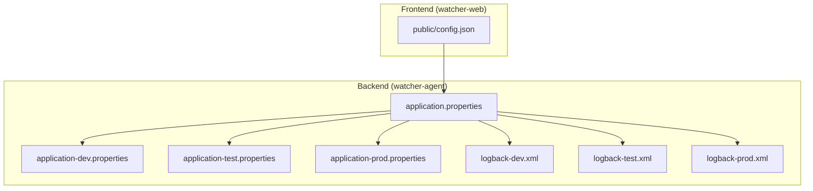
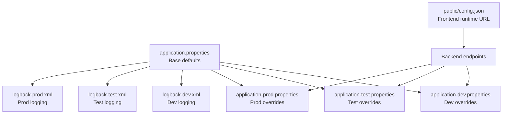
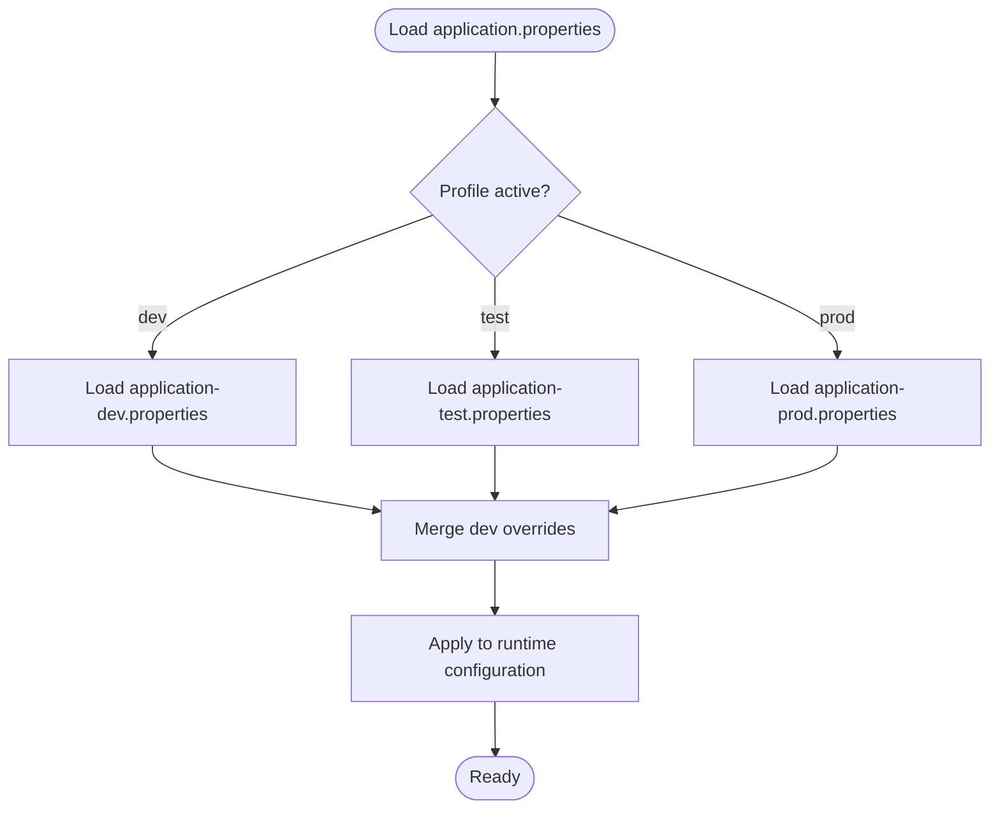
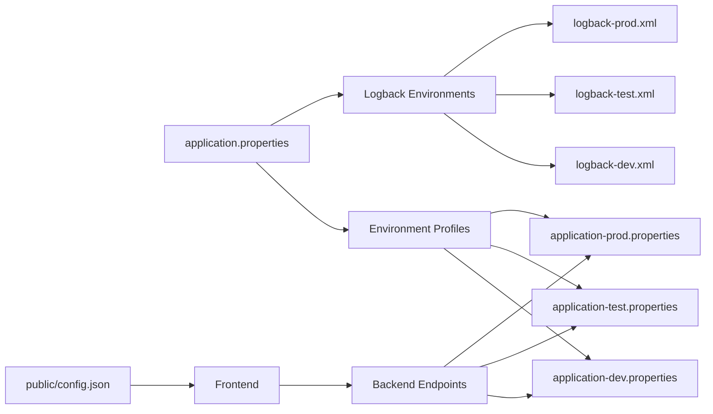

# Configuration Management

<cite>
**Referenced Files in This Document**
- [application.properties](file://watcher-agent/src/main/resources/application.properties)
- [application-dev.properties](file://watcher-agent/src/main/resources/application-dev.properties)
- [application-test.properties](file://watcher-agent/src/main/resources/application-test.properties)
- [application-prod.properties](file://watcher-agent/src/main/resources/application-prod.properties)
- [logback-dev.xml](file://watcher-agent/src/main/resources/logback-dev.xml)
- [logback-test.xml](file://watcher-agent/src/main/resources/logback-test.xml)
- [logback-prod.xml](file://watcher-agent/src/main/resources/logback-prod.xml)
- [config.json](file://watcher-web/public/config.json)
</cite>

## Table of Contents
1. [Introduction](#introduction)
2. [Project Structure](#project-structure)
3. [Core Components](#core-components)
4. [Architecture Overview](#architecture-overview)
5. [Detailed Component Analysis](#detailed-component-analysis)
6. [Dependency Analysis](#dependency-analysis)
7. [Performance Considerations](#performance-considerations)
8. [Troubleshooting Guide](#troubleshooting-guide)
9. [Conclusion](#conclusion)
10. [Appendices](#appendices)

## Introduction
This document describes the configuration management system used across the ShowTime monitoring platform. It explains how property-based configuration is applied across modules, how environment-specific configurations are organized, and how logging, database connections, and service endpoints are configured. It also covers externalized configuration via environment variables, runtime configuration injection for the frontend, and operational practices for configuration security and drift prevention.

## Project Structure
The configuration system spans two primary areas:
- Backend (Spring Boot) configuration under watcher-agent resources
- Frontend (Vue) runtime configuration under watcher-web public assets

**Diagram sources**
- [application.properties:1-80](file://watcher-agent/src/main/resources/application.properties#L1-L80)
- [application-dev.properties:1-72](file://watcher-agent/src/main/resources/application-dev.properties#L1-L72)
- [application-test.properties:1-66](file://watcher-agent/src/main/resources/application-test.properties#L1-L66)
- [application-prod.properties:1-70](file://watcher-agent/src/main/resources/application-prod.properties#L1-L70)
- [logback-dev.xml:1-44](file://watcher-agent/src/main/resources/logback-dev.xml#L1-L44)
- [logback-test.xml:1-45](file://watcher-agent/src/main/resources/logback-test.xml#L1-L45)
- [logback-prod.xml:1-35](file://watcher-agent/src/main/resources/logback-prod.xml#L1-L35)
- [config.json:1-4](file://watcher-web/public/config.json#L1-L4)

**Section sources**
- [application.properties:1-80](file://watcher-agent/src/main/resources/application.properties#L1-L80)
- [application-dev.properties:1-72](file://watcher-agent/src/main/resources/application-dev.properties#L1-L72)
- [application-test.properties:1-66](file://watcher-agent/src/main/resources/application-test.properties#L1-L66)
- [application-prod.properties:1-70](file://watcher-agent/src/main/resources/application-prod.properties#L1-L70)
- [logback-dev.xml:1-44](file://watcher-agent/src/main/resources/logback-dev.xml#L1-L44)
- [logback-test.xml:1-45](file://watcher-agent/src/main/resources/logback-test.xml#L1-L45)
- [logback-prod.xml:1-35](file://watcher-agent/src/main/resources/logback-prod.xml#L1-L35)
- [config.json:1-4](file://watcher-web/public/config.json#L1-L4)

## Core Components
- Property-based configuration
  - Base properties define server, application metadata, management endpoints, middleware toggles, datasource, MyBatis-Plus settings, and inter-service URLs.
  - Environment-specific profiles override or extend base properties for development, testing, and production.
- Logging configuration
  - Separate Logback XML files per environment control rolling policies, encoders, and logger levels.
- Frontend runtime configuration
  - A JSON file provides the backend endpoint URL injected at runtime into the frontend.

Key configuration domains:
- Server and application identity
- Management endpoints exposure
- Middleware enablement switches
- Datasource and MyBatis-Plus
- Inter-service URLs
- Environment-specific overrides and ports
- Logging policy and retention
- Frontend endpoint URL

**Section sources**
- [application.properties:1-80](file://watcher-agent/src/main/resources/application.properties#L1-L80)
- [application-dev.properties:1-72](file://watcher-agent/src/main/resources/application-dev.properties#L1-L72)
- [application-test.properties:1-66](file://watcher-agent/src/main/resources/application-test.properties#L1-L66)
- [application-prod.properties:1-70](file://watcher-agent/src/main/resources/application-prod.properties#L1-L70)
- [logback-dev.xml:1-44](file://watcher-agent/src/main/resources/logback-dev.xml#L1-L44)
- [logback-test.xml:1-45](file://watcher-agent/src/main/resources/logback-test.xml#L1-L45)
- [logback-prod.xml:1-35](file://watcher-agent/src/main/resources/logback-prod.xml#L1-L35)
- [config.json:1-4](file://watcher-web/public/config.json#L1-L4)

## Architecture Overview
The configuration architecture follows a layered approach:
- Base properties define defaults and shared settings.
- Environment profiles selectively override base properties.
- Logback XML files tailor logging behavior per environment.
- The frontend reads a runtime configuration file to determine the backend base URL.

**Diagram sources**
- [application.properties:1-80](file://watcher-agent/src/main/resources/application.properties#L1-L80)
- [application-dev.properties:1-72](file://watcher-agent/src/main/resources/application-dev.properties#L1-L72)
- [application-test.properties:1-66](file://watcher-agent/src/main/resources/application-test.properties#L1-L66)
- [application-prod.properties:1-70](file://watcher-agent/src/main/resources/application-prod.properties#L1-L70)
- [logback-dev.xml:1-44](file://watcher-agent/src/main/resources/logback-dev.xml#L1-L44)
- [logback-test.xml:1-45](file://watcher-agent/src/main/resources/logback-test.xml#L1-L45)
- [logback-prod.xml:1-35](file://watcher-agent/src/main/resources/logback-prod.xml#L1-L35)
- [config.json:1-4](file://watcher-web/public/config.json#L1-L4)

## Detailed Component Analysis

### Property-Based Configuration System
- Base properties
  - Define server port, servlet context path, application name, watcher home, circular reference allowance, management endpoints exposure, health details visibility, middleware toggles, plugin module toggles, placeholder CAS/UIS/Workspace credentials, MySQL datasource, MyBatis-Plus mapper locations and type aliases, and inter-service base URLs.
- Environment-specific profiles
  - Development profile adds MongoDB, Kafka, Elasticsearch, ClickHouse, batch log root path, and environment variable overrides for service ports.
  - Testing profile mirrors development with different hosts and ports.
  - Production profile centralizes MongoDB replica set and Kafka brokers, and defines production-like service endpoints and ports.
- Externalized configuration
  - Environment variables are used to override service ports and defaults (e.g., UIS, CAS, OneStor), enabling containerized deployments and environment isolation.

**Diagram sources**
- [application.properties:1-80](file://watcher-agent/src/main/resources/application.properties#L1-L80)
- [application-dev.properties:1-72](file://watcher-agent/src/main/resources/application-dev.properties#L1-L72)
- [application-test.properties:1-66](file://watcher-agent/src/main/resources/application-test.properties#L1-L66)
- [application-prod.properties:1-70](file://watcher-agent/src/main/resources/application-prod.properties#L1-L70)

**Section sources**
- [application.properties:1-80](file://watcher-agent/src/main/resources/application.properties#L1-L80)
- [application-dev.properties:1-72](file://watcher-agent/src/main/resources/application-dev.properties#L1-L72)
- [application-test.properties:1-66](file://watcher-agent/src/main/resources/application-test.properties#L1-L66)
- [application-prod.properties:1-70](file://watcher-agent/src/main/resources/application-prod.properties#L1-L70)

### Database Connection Settings
- Datasource
  - JDBC URL, driver class, username, and connection timeout are defined in base properties.
- MyBatis-Plus
  - Mapper locations, type aliases package, underscore-to-camel mapping, and logging implementation are configured in base properties.

Operational guidance:
- Keep credentials out of base properties in production; rely on environment variable overrides or secret managers.
- Validate JDBC URL and driver compatibility with the target database.

**Section sources**
- [application.properties:48-58](file://watcher-agent/src/main/resources/application.properties#L48-L58)

### Logging Configuration
- Logback XML files
  - Define rolling file appenders with size-and-time-based rollover, charset, and pattern.
  - Control root logging level and include a logger for Quartz.
  - Environment-specific files share similar structure but differ slightly in console output presence.

Best practices:
- Ensure log directory permissions and disk quotas align with rolling policy limits.
- Rotate logs regularly and monitor total size cap to prevent disk pressure.

**Section sources**
- [logback-dev.xml:1-44](file://watcher-agent/src/main/resources/logback-dev.xml#L1-L44)
- [logback-test.xml:1-45](file://watcher-agent/src/main/resources/logback-test.xml#L1-L45)
- [logback-prod.xml:1-35](file://watcher-agent/src/main/resources/logback-prod.xml#L1-L35)

### Service Endpoints and Inter-Service Configuration
- Inter-service URLs
  - CAS, UIS, Workspace, and OneStor base URLs are defined in base properties and overridden per environment.
- Port overrides
  - Environment variables supply default ports for UIS, CAS, and OneStor in development and testing profiles.

Recommendations:
- Keep inter-service URLs consistent across environments.
- Use internal DNS or service discovery in containerized environments.

**Section sources**
- [application.properties:63-70](file://watcher-agent/src/main/resources/application.properties#L63-L70)
- [application-dev.properties:37-63](file://watcher-agent/src/main/resources/application-dev.properties#L37-L63)
- [application-test.properties:32-58](file://watcher-agent/src/main/resources/application-test.properties#L32-L58)
- [application-prod.properties:37-63](file://watcher-agent/src/main/resources/application-prod.properties#L37-L63)

### Frontend Runtime Configuration
- Frontend configuration
  - The public config.json supplies the backend base URL consumed by the frontend at runtime.
- Build-time vs runtime
  - The frontend does not embed the backend URL during build; it reads the runtime config.json.

Guidance:
- Ensure config.json is served alongside the built frontend assets.
- Version and distribute config.json carefully to avoid stale endpoints.

**Section sources**
- [config.json:1-4](file://watcher-web/public/config.json#L1-L4)

### Externalized Configuration Patterns and Environment Variable Overrides
- Environment variable overrides
  - Development and testing profiles use variables to set service ports and defaults, enabling deployment flexibility.
- Profile activation
  - Base properties set the active profile; environment-specific properties merge accordingly.

Security note:
- Prefer environment variables for sensitive values and avoid committing secrets to source control.

**Section sources**
- [application-dev.properties:37-63](file://watcher-agent/src/main/resources/application-dev.properties#L37-L63)
- [application-test.properties:32-58](file://watcher-agent/src/main/resources/application-test.properties#L32-L58)
- [application-prod.properties:37-63](file://watcher-agent/src/main/resources/application-prod.properties#L37-L63)
- [application.properties](file://watcher-agent/src/main/resources/application.properties#L2)

### Configuration Validation
Recommended checks:
- Verify active profile matches intended environment.
- Confirm datasource connectivity and credentials resolution.
- Validate inter-service URLs are reachable from the runtime environment.
- Ensure logging roll policies match disk capacity and retention requirements.

[No sources needed since this section provides general guidance]

### Configuration Security and Sensitive Data Handling
- Secrets management
  - Store passwords and tokens in secure secret stores or environment providers; avoid embedding in property files.
- Least privilege
  - Limit service account privileges and restrict access to databases and external systems.
- Transport security
  - Enforce TLS for inter-service communication and external integrations.

[No sources needed since this section provides general guidance]

### Configuration Drift Prevention
- Centralized governance
  - Maintain a single source of truth for environment-specific properties and enforce change control.
- Automation
  - Use infrastructure-as-code to provision and validate configuration artifacts across environments.
- Auditing
  - Track configuration changes and reconcile drift periodically.

[No sources needed since this section provides general guidance]

## Dependency Analysis
Configuration dependencies across modules:
- Backend depends on base properties and environment-specific overlays.
- Logging depends on environment-specific Logback XML files.
- Frontend depends on runtime config.json for backend endpoint resolution.

**Diagram sources**
- [application.properties:1-80](file://watcher-agent/src/main/resources/application.properties#L1-L80)
- [application-dev.properties:1-72](file://watcher-agent/src/main/resources/application-dev.properties#L1-L72)
- [application-test.properties:1-66](file://watcher-agent/src/main/resources/application-test.properties#L1-L66)
- [application-prod.properties:1-70](file://watcher-agent/src/main/resources/application-prod.properties#L1-L70)
- [logback-dev.xml:1-44](file://watcher-agent/src/main/resources/logback-dev.xml#L1-L44)
- [logback-test.xml:1-45](file://watcher-agent/src/main/resources/logback-test.xml#L1-L45)
- [logback-prod.xml:1-35](file://watcher-agent/src/main/resources/logback-prod.xml#L1-L35)
- [config.json:1-4](file://watcher-web/public/config.json#L1-L4)

**Section sources**
- [application.properties:1-80](file://watcher-agent/src/main/resources/application.properties#L1-L80)
- [application-dev.properties:1-72](file://watcher-agent/src/main/resources/application-dev.properties#L1-L72)
- [application-test.properties:1-66](file://watcher-agent/src/main/resources/application-test.properties#L1-L66)
- [application-prod.properties:1-70](file://watcher-agent/src/main/resources/application-prod.properties#L1-L70)
- [logback-dev.xml:1-44](file://watcher-agent/src/main/resources/logback-dev.xml#L1-L44)
- [logback-test.xml:1-45](file://watcher-agent/src/main/resources/logback-test.xml#L1-L45)
- [logback-prod.xml:1-35](file://watcher-agent/src/main/resources/logback-prod.xml#L1-L35)
- [config.json:1-4](file://watcher-web/public/config.json#L1-L4)

## Performance Considerations
- Logging
  - Rolling policies and file sizes impact disk I/O; tune MaxFileSize and totalSizeCap according to storage capacity.
- Datasource
  - Connection timeouts and driver selection affect responsiveness; validate against database performance characteristics.
- Inter-service calls
  - Endpoint reachability and latency influence overall throughput; monitor and cache where appropriate.

[No sources needed since this section provides general guidance]

## Troubleshooting Guide
Common issues and resolutions:
- Profile mismatch
  - Symptoms: unexpected defaults or missing environment-specific settings.
  - Action: verify active profile and ensure the correct environment properties are loaded.
- Datasource errors
  - Symptoms: connection failures or timeouts.
  - Action: validate JDBC URL, credentials, and network connectivity; confirm driver availability.
- Logging not rotating
  - Symptoms: disk growth or missing rotated files.
  - Action: check rolling policy settings and log directory permissions.
- Frontend cannot reach backend
  - Symptoms: failed API calls from the UI.
  - Action: confirm config.json URL matches deployed backend endpoint and is accessible from the browser.

**Section sources**
- [application.properties:1-80](file://watcher-agent/src/main/resources/application.properties#L1-L80)
- [application-dev.properties:1-72](file://watcher-agent/src/main/resources/application-dev.properties#L1-L72)
- [application-test.properties:1-66](file://watcher-agent/src/main/resources/application-test.properties#L1-L66)
- [application-prod.properties:1-70](file://watcher-agent/src/main/resources/application-prod.properties#L1-L70)
- [logback-dev.xml:1-44](file://watcher-agent/src/main/resources/logback-dev.xml#L1-L44)
- [logback-test.xml:1-45](file://watcher-agent/src/main/resources/logback-test.xml#L1-L45)
- [logback-prod.xml:1-35](file://watcher-agent/src/main/resources/logback-prod.xml#L1-L35)
- [config.json:1-4](file://watcher-web/public/config.json#L1-L4)

## Conclusion
ShowTime’s configuration system leverages Spring Boot’s property-based configuration with environment-specific overlays and Logback XML files for logging. The frontend consumes a runtime config.json for endpoint resolution. By externalizing sensitive values via environment variables, enforcing strict validation, and adopting disciplined change control, teams can maintain reliable, secure, and consistent deployments across development, testing, and production environments.

## Appendices
- Appendix A: Environment variable overrides summary
  - UIS port override
  - CAS HTTP/HTTPS port overrides
  - OneStor HTTP/HTTPS port overrides
- Appendix B: Inter-service URL references
  - CAS service URL
  - UIS service URL
  - Workspace service URL
  - OneStor service URL

**Section sources**
- [application-dev.properties:37-63](file://watcher-agent/src/main/resources/application-dev.properties#L37-L63)
- [application-test.properties:32-58](file://watcher-agent/src/main/resources/application-test.properties#L32-L58)
- [application-prod.properties:37-63](file://watcher-agent/src/main/resources/application-prod.properties#L37-L63)
- [application.properties:63-70](file://watcher-agent/src/main/resources/application.properties#L63-L70)