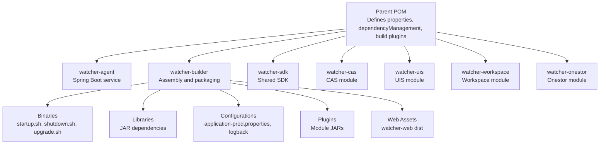
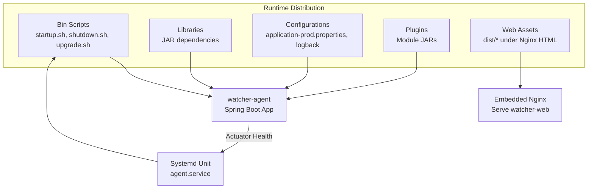
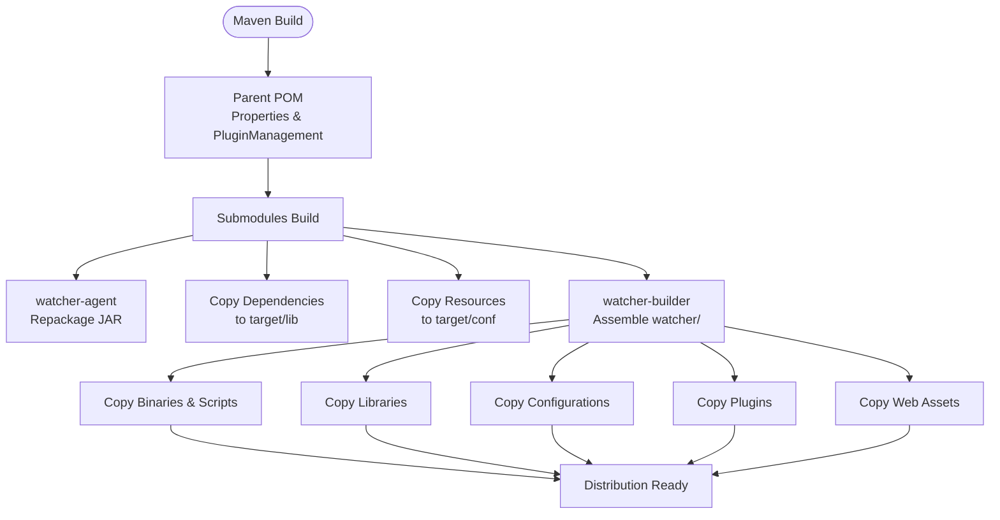
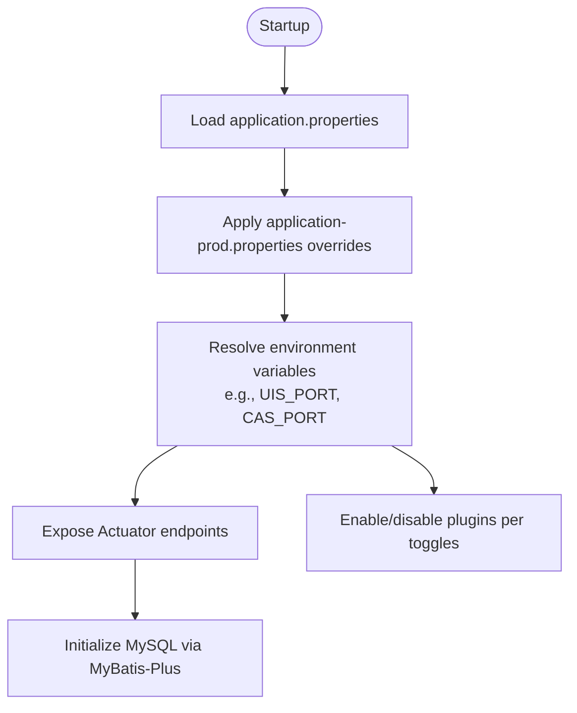
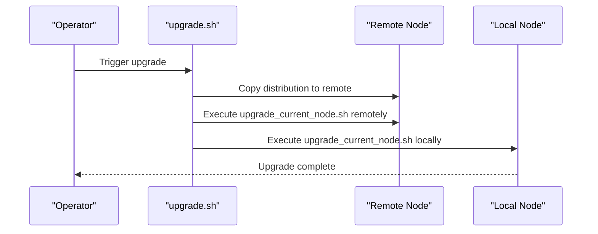
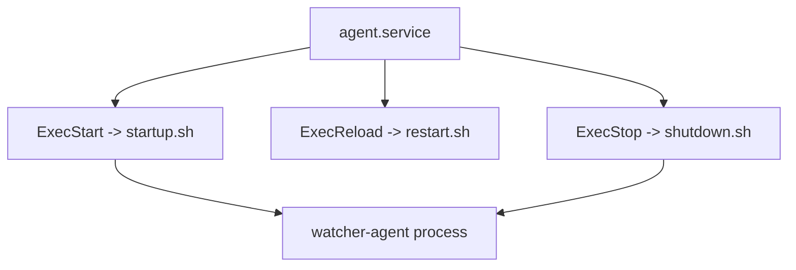
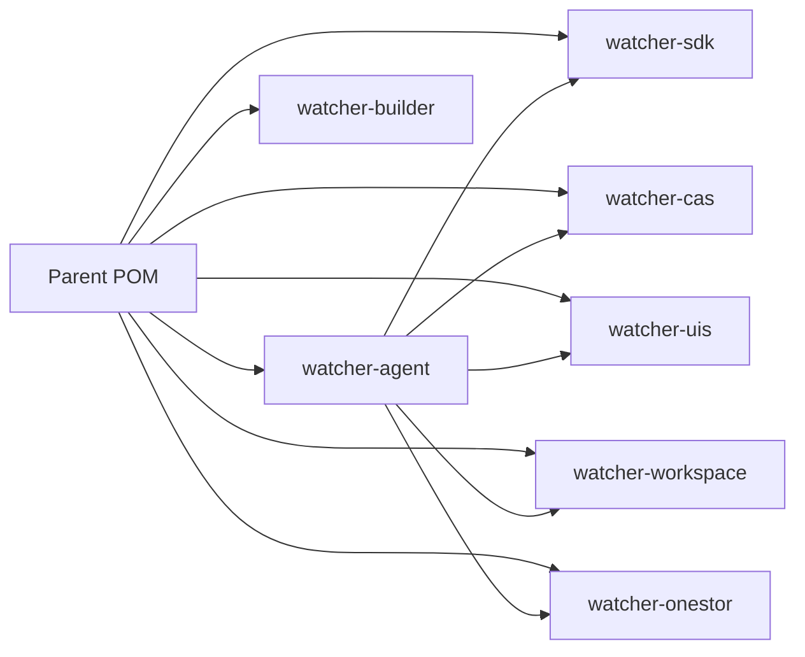

# Deployment & Operations

<cite>
**Referenced Files in This Document**
- [pom.xml](file://pom.xml)
- [watcher-agent/pom.xml](file://watcher-agent/pom.xml)
- [watcher-builder/pom.xml](file://watcher-builder/pom.xml)
- [watcher-builder/assembly/bin/startup.sh](file://watcher-builder/assembly/bin/startup.sh)
- [watcher-builder/assembly/bin/shutdown.sh](file://watcher-builder/assembly/bin/shutdown.sh)
- [watcher-builder/assembly/bin/upgrade.sh](file://watcher-builder/assembly/bin/upgrade.sh)
- [watcher-builder/assembly/bin/upgrade_current_node.sh](file://watcher-builder/assembly/bin/upgrade_current_node.sh)
- [watcher-builder/assembly/bin/check.sh](file://watcher-builder/assembly/bin/check.sh)
- [watcher-builder/assembly/conf/agent.service](file://watcher-builder/assembly/conf/agent.service)
- [watcher-agent/src/main/resources/application.properties](file://watcher-agent/src/main/resources/application.properties)
- [watcher-agent/src/main/resources/application-prod.properties](file://watcher-agent/src/main/resources/application-prod.properties)
- [pipeline.groovy](file://pipeline.groovy)
- [watcher-web/package.json](file://watcher-web/package.json)
</cite>

## Table of Contents
1. [Introduction](#introduction)
2. [Project Structure](#project-structure)
3. [Core Components](#core-components)
4. [Architecture Overview](#architecture-overview)
5. [Detailed Component Analysis](#detailed-component-analysis)
6. [Dependency Analysis](#dependency-analysis)
7. [Performance Considerations](#performance-considerations)
8. [Troubleshooting Guide](#troubleshooting-guide)
9. [Conclusion](#conclusion)
10. [Appendices](#appendices)

## Introduction
This document provides comprehensive deployment and operations guidance for the ShowTime monitoring platform. It covers the Maven multi-module build and packaging process, deployment procedures for watcher-agent, watcher-web, and platform modules across development, staging, and production environments, configuration management via property files, environment variables, and externalized configuration, infrastructure requirements and system dependencies, service orchestration, health checks, update and rollback procedures, and operational maintenance tasks. It also includes troubleshooting guidance for common deployment and operational issues.

## Project Structure
The repository is a Maven multi-module project centered around the watcher platform. The top-level parent module defines shared properties, dependency management, and build plugins. Submodules include the watcher-agent (Spring Boot service), watcher-builder (assembly and packaging), watcher-sdk (shared SDK), watcher-cas, watcher-uis, watcher-workspace, watcher-onestor, and others. The watcher-builder module orchestrates packaging artifacts and prepares the runtime distribution with binaries, libraries, configurations, plugins, and web assets.

**Diagram sources**
- [pom.xml:11-20](file://pom.xml#L11-L20)
- [watcher-agent/pom.xml:14-50](file://watcher-agent/pom.xml#L14-L50)
- [watcher-builder/pom.xml:15-209](file://watcher-builder/pom.xml#L15-L209)

**Section sources**
- [pom.xml:11-20](file://pom.xml#L11-L20)
- [watcher-agent/pom.xml:14-50](file://watcher-agent/pom.xml#L14-L50)
- [watcher-builder/pom.xml:15-209](file://watcher-builder/pom.xml#L15-L209)

## Core Components
- Multi-module Maven build with centralized dependency management and shared properties.
- watcher-agent: Spring Boot service packaged as a fat JAR with embedded Actuator and WebSocket support; configured via application.properties and application-prod.properties.
- watcher-builder: Assembles the runtime distribution, copies agent JARs, dependencies, configurations, plugins, and web assets; provides lifecycle scripts for startup, shutdown, upgrade, and health checks.
- watcher-web: Vue-based frontend built via Vite; assets are integrated into the watcher-builder distribution for serving by the embedded Nginx component.

Key build and packaging highlights:
- Parent POM manages versions and plugins; resources and dependencies are copied to target/conf and target/lib respectively.
- watcher-agent sets finalName and repackages with spring-boot-maven-plugin.
- watcher-builder uses maven-antrun-plugin to assemble the distribution and copy artifacts from submodules.

**Section sources**
- [pom.xml:22-47](file://pom.xml#L22-L47)
- [pom.xml:112-181](file://pom.xml#L112-L181)
- [watcher-agent/pom.xml:138-192](file://watcher-agent/pom.xml#L138-L192)
- [watcher-builder/pom.xml:17-207](file://watcher-builder/pom.xml#L17-L207)

## Architecture Overview
The deployment architecture consists of:
- watcher-agent as the primary service exposing REST APIs and WebSocket endpoints, with Actuator health endpoints.
- watcher-web frontend served by the embedded Nginx component included in the distribution.
- watcher-builder assembling the runtime environment with binaries, libraries, configurations, plugins, and web assets.
- System services managed via systemd unit files for watcher-agent.

**Diagram sources**
- [watcher-builder/assembly/bin/startup.sh:78](file://watcher-builder/assembly/bin/startup.sh#L78)
- [watcher-builder/assembly/conf/agent.service:7](file://watcher-builder/assembly/conf/agent.service#L7)
- [watcher-builder/pom.xml:25-162](file://watcher-builder/pom.xml#L25-L162)

## Detailed Component Analysis

### Build and Packaging with Maven
- Parent POM centralizes versions and imports Spring Boot dependency management. It configures maven-compiler-plugin and defines pluginManagement for maven-dependency-plugin and maven-resources-plugin to copy dependencies and resources into target/lib and target/conf respectively.
- watcher-agent configures spring-boot-maven-plugin to repackage as a single executable JAR and copies agent-specific configuration files to target/conf during packaging.
- watcher-builder uses maven-antrun-plugin to assemble the distribution directory watcher/, copying:
  - Binaries: agent.jar and scripts from watcher-agent and performer-service targets.
  - Libraries: dependencies from watcher-agent and other modules’ target/lib.
  - Configurations: application.properties and logback-prod.xml for watcher and performer.
  - Plugins: module JARs from watcher-workspace, watcher-cas, watcher-uis, watcher-onestor, and others.
  - Web assets: dist/* copied into the Nginx HTML directory.

**Diagram sources**
- [pom.xml:112-181](file://pom.xml#L112-L181)
- [watcher-agent/pom.xml:138-192](file://watcher-agent/pom.xml#L138-L192)
- [watcher-builder/pom.xml:17-207](file://watcher-builder/pom.xml#L17-L207)

**Section sources**
- [pom.xml:22-47](file://pom.xml#L22-L47)
- [pom.xml:112-181](file://pom.xml#L112-L181)
- [watcher-agent/pom.xml:138-192](file://watcher-agent/pom.xml#L138-L192)
- [watcher-builder/pom.xml:17-207](file://watcher-builder/pom.xml#L17-L207)

### Configuration Management
- Property files:
  - application.properties: Base configuration including server port, context path, Actuator exposure, middleware and plugin toggles, MySQL data source, MyBatis-Plus settings, and default values for plugin service URLs.
  - application-prod.properties: Production overrides including MongoDB, Kafka, Elasticsearch, ClickHouse, data center settings, and environment-dependent ports exposed via environment variables (e.g., UIS_PORT, CAS_PORT, CAS_HTTPS_PORT, ONESTOR_PORT, ONESTOR_HTTPS_PORT).
- Environment variables:
  - Ports and credentials are externalized via environment variables to avoid embedding secrets in code.
- Externalized configuration:
  - watcher-builder passes Dspring.config.location and Dwatcher.home JVM arguments to load configuration from the distribution conf directory and set the watcher home path.

**Diagram sources**
- [watcher-agent/src/main/resources/application.properties:1-80](file://watcher-agent/src/main/resources/application.properties#L1-L80)
- [watcher-agent/src/main/resources/application-prod.properties:1-70](file://watcher-agent/src/main/resources/application-prod.properties#L1-L70)
- [watcher-builder/assembly/bin/startup.sh:78](file://watcher-builder/assembly/bin/startup.sh#L78)

**Section sources**
- [watcher-agent/src/main/resources/application.properties:1-80](file://watcher-agent/src/main/resources/application.properties#L1-L80)
- [watcher-agent/src/main/resources/application-prod.properties:1-70](file://watcher-agent/src/main/resources/application-prod.properties#L1-L70)
- [watcher-builder/assembly/bin/startup.sh:78](file://watcher-builder/assembly/bin/startup.sh#L78)

### Deployment Procedures
- Development:
  - Use application.properties defaults and local profile. watcher-agent runs on the configured port with Actuator enabled.
- Staging:
  - Override with application-prod.properties and environment variables for staging endpoints and ports.
- Production:
  - Use watcher-builder distribution with Dspring.profiles.active set to prod and Dspring.config.location pointing to conf directory. Ensure watcher.home is set to the distribution root.

Lifecycle scripts:
- Startup: watcher-builder/assembly/bin/startup.sh validates Java, resolves WATCHER_ROOT, creates GC/Dump log directories, and launches the agent JAR with loader.path including lib, plugins, and conf directories.
- Shutdown: watcher-builder/assembly/bin/shutdown.sh locates the process by a process flag and terminates it gracefully.
- Upgrade: watcher-builder/assembly/bin/upgrade.sh orchestrates rolling upgrades across cluster nodes by copying new binaries, libraries, plugins, and web assets to remote nodes and invoking upgrade_current_node.sh locally.
- Health check: watcher-builder/assembly/bin/check.sh monitors MongoDB and watcher-agent processes and restarts them if needed.

**Diagram sources**
- [watcher-builder/assembly/bin/upgrade.sh:18-44](file://watcher-builder/assembly/bin/upgrade.sh#L18-L44)
- [watcher-builder/assembly/bin/upgrade_current_node.sh:24-35](file://watcher-builder/assembly/bin/upgrade_current_node.sh#L24-L35)

**Section sources**
- [watcher-builder/assembly/bin/startup.sh:1-81](file://watcher-builder/assembly/bin/startup.sh#L1-L81)
- [watcher-builder/assembly/bin/shutdown.sh:1-26](file://watcher-builder/assembly/bin/shutdown.sh#L1-L26)
- [watcher-builder/assembly/bin/upgrade.sh:1-53](file://watcher-builder/assembly/bin/upgrade.sh#L1-L53)
- [watcher-builder/assembly/bin/upgrade_current_node.sh:1-44](file://watcher-builder/assembly/bin/upgrade_current_node.sh#L1-L44)
- [watcher-builder/assembly/bin/check.sh:1-27](file://watcher-builder/assembly/bin/check.sh#L1-L27)

### Service Orchestration
- Systemd unit file for watcher-agent delegates ExecStart, ExecReload, and ExecStop to watcher-builder scripts, ensuring consistent lifecycle management across environments.

**Diagram sources**
- [watcher-builder/assembly/conf/agent.service:7-10](file://watcher-builder/assembly/conf/agent.service#L7-L10)

**Section sources**
- [watcher-builder/assembly/conf/agent.service:1-14](file://watcher-builder/assembly/conf/agent.service#L1-L14)

### Monitoring and Health Checks
- Actuator health endpoints are exposed and configured to show details, enabling readiness and liveness probes.
- check.sh script monitors watcher-agent and MongoDB processes and restarts them if down.

**Section sources**
- [watcher-agent/src/main/resources/application.properties:10-11](file://watcher-agent/src/main/resources/application.properties#L10-L11)
- [watcher-builder/assembly/bin/check.sh:13-19](file://watcher-builder/assembly/bin/check.sh#L13-L19)

### Update and Rollback Strategies
- Rolling upgrade:
  - upgrade.sh enumerates nodes, copies the new distribution to each node, executes upgrade_current_node.sh remotely, and finally upgrades the local node.
  - upgrade_current_node.sh replaces binaries, libraries, plugins, and web assets while preserving application-prod.properties to maintain cluster-specific settings, then restarts the service.
- Rollback:
  - To roll back, repeat the upgrade process with the previous distribution tarball. Alternatively, restore binaries, libraries, plugins, and web assets from backups taken prior to upgrade.

**Section sources**
- [watcher-builder/assembly/bin/upgrade.sh:18-44](file://watcher-builder/assembly/bin/upgrade.sh#L18-L44)
- [watcher-builder/assembly/bin/upgrade_current_node.sh:24-35](file://watcher-builder/assembly/bin/upgrade_current_node.sh#L24-L35)

### Maintenance Tasks
- Log rotation and garbage collection:
  - startup.sh configures GC logging and heap dump paths under logs/gc and logs/dump.
- Cleanup:
  - Remove temporary files, old logs, and cache directories after upgrades as part of the upgrade_current_node.sh process.
- Version tracking:
  - pipeline.groovy writes watcher.version with build metadata and branch information.

**Section sources**
- [watcher-builder/assembly/bin/startup.sh:62-72](file://watcher-builder/assembly/bin/startup.sh#L62-L72)
- [watcher-builder/assembly/bin/upgrade_current_node.sh:24-35](file://watcher-builder/assembly/bin/upgrade_current_node.sh#L24-L35)
- [pipeline.groovy:42-46](file://pipeline.groovy#L42-L46)

## Dependency Analysis
The build-time and runtime dependencies are managed centrally in the parent POM and declared in submodules. watcher-agent depends on watcher-sdk and several watcher-* modules, and includes Spring Boot starters for web, actuator, websocket, validation, and test. watcher-builder coordinates artifact assembly and copies dependencies from submodules.

**Diagram sources**
- [pom.xml:11-20](file://pom.xml#L11-L20)
- [watcher-agent/pom.xml:24-50](file://watcher-agent/pom.xml#L24-L50)

**Section sources**
- [pom.xml:11-20](file://pom.xml#L11-L20)
- [watcher-agent/pom.xml:24-50](file://watcher-agent/pom.xml#L24-L50)

## Performance Considerations
- JVM memory and GC tuning:
  - startup.sh sets fixed heap sizes and enables GC logging and heap dumps to diagnose performance issues.
- Resource packaging:
  - watcher-builder consolidates dependencies and plugins into lib and plugins directories to reduce classpath overhead and simplify runtime startup.
- Frontend build:
  - watcher-web uses Vite for optimized production builds; ensure NODE_VERSION meets engine requirements.

**Section sources**
- [watcher-builder/assembly/bin/startup.sh:62-72](file://watcher-builder/assembly/bin/startup.sh#L62-L72)
- [watcher-web/package.json:17-19](file://watcher-web/package.json#L17-L19)

## Troubleshooting Guide
Common deployment and operational issues:
- Java version mismatch:
  - startup.sh validates Java >= 1.8; ensure JAVA_HOME or PATH points to a compatible JDK.
- Missing watcher.home or configuration:
  - startup.sh requires WATCHER_HOME; ensure /etc/watcher_home exists and points to the distribution root.
- Port conflicts:
  - Verify server.port and plugin service ports (UIS, CAS, OneStor) are not occupied; override via environment variables.
- Plugin toggles disabled:
  - Confirm plugin enable flags in application-prod.properties match intended environment.
- Health endpoint access:
  - Ensure Actuator endpoints are exposed and reachable; verify network policies and firewall rules.
- Upgrade failures:
  - Review upgrade logs under logs/upgrade.log; confirm SSH connectivity and permissions for remote nodes; ensure sufficient disk space for distribution extraction.

**Section sources**
- [watcher-builder/assembly/bin/startup.sh:1-25](file://watcher-builder/assembly/bin/startup.sh#L1-L25)
- [watcher-builder/assembly/bin/upgrade.sh:8-13](file://watcher-builder/assembly/bin/upgrade.sh#L8-L13)
- [watcher-builder/assembly/bin/upgrade_current_node.sh:1-13](file://watcher-builder/assembly/bin/upgrade_current_node.sh#L1-L13)
- [watcher-agent/src/main/resources/application.properties:10-11](file://watcher-agent/src/main/resources/application.properties#L10-L11)

## Conclusion
The ShowTime monitoring platform leverages a Maven multi-module build to produce a cohesive runtime distribution. watcher-builder packages binaries, libraries, configurations, plugins, and web assets, while watcher-agent exposes management and monitoring capabilities via Actuator. Systemd integrates lifecycle scripts for reliable operation, and scripted upgrade mechanisms support rolling updates across clusters. Proper configuration management via property files and environment variables ensures flexibility across environments, and health checks and maintenance tasks support ongoing operations.

## Appendices

### Build and Release Pipeline
- Continuous integration pipeline stages:
  - Backend build stage packages watcher-agent artifacts.
  - Frontend build stage packages watcher-web dist assets.
  - Shell stage extracts artifacts, moves web assets, generates version metadata, and produces final tarballs with checksums.

**Section sources**
- [pipeline.groovy:1-33](file://pipeline.groovy#L1-L33)
- [pipeline.groovy:35-71](file://pipeline.groovy#L35-L71)