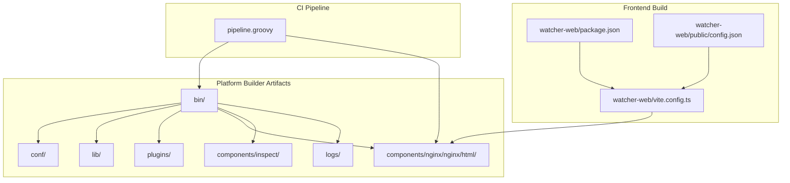
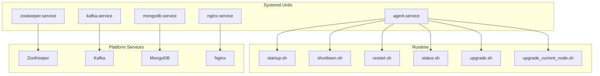
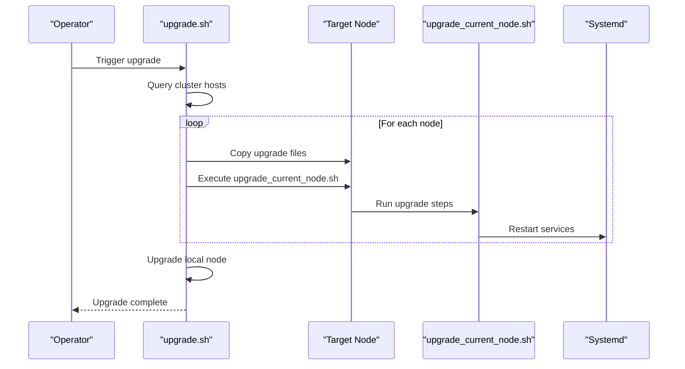
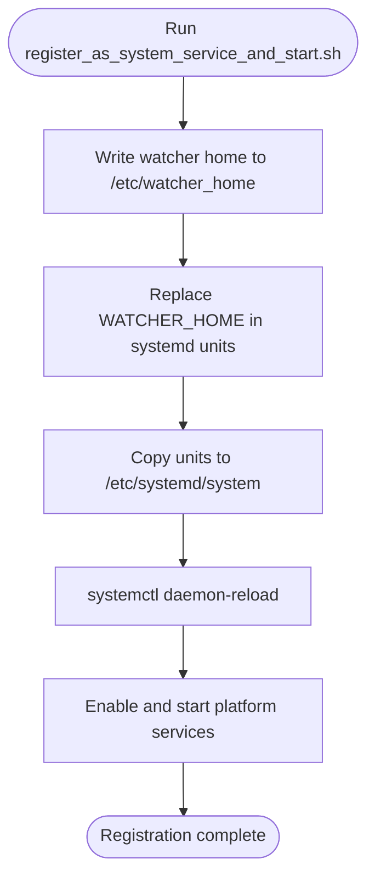
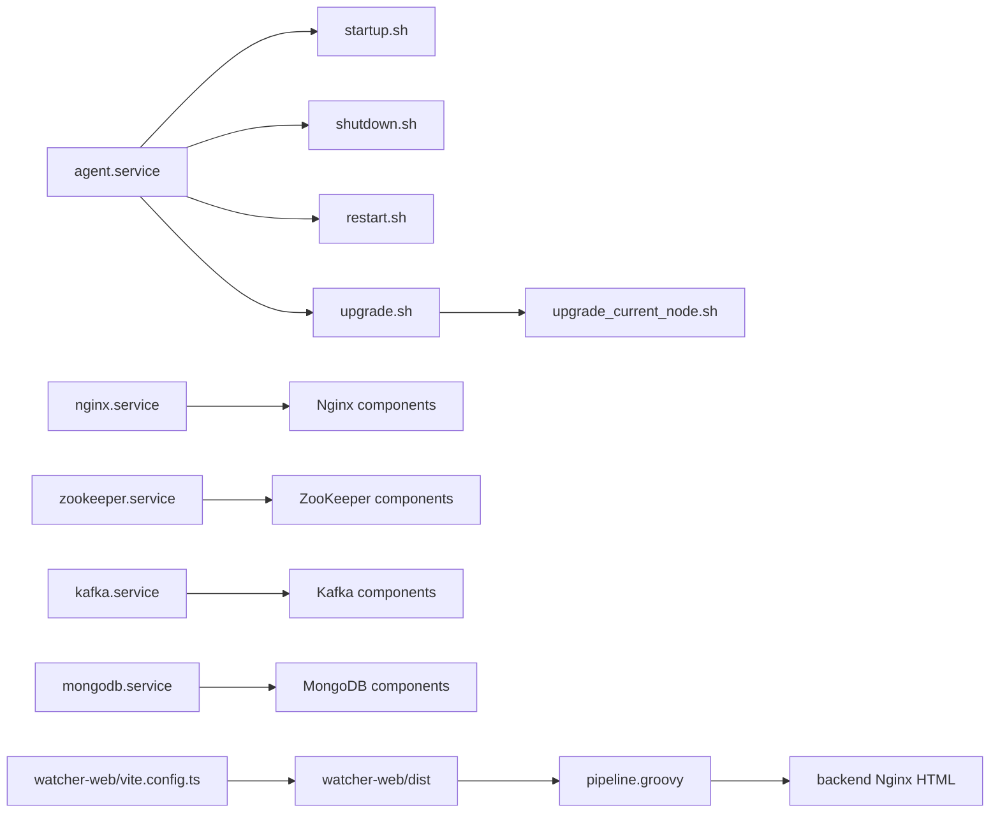

# Deployment Procedures

<cite>
**Referenced Files in This Document**
- [startup.sh](file://watcher-builder/assembly/bin/startup.sh)
- [shutdown.sh](file://watcher-builder/assembly/bin/shutdown.sh)
- [restart.sh](file://watcher-builder/assembly/bin/restart.sh)
- [status.sh](file://watcher-builder/assembly/bin/status.sh)
- [upgrade.sh](file://watcher-builder/assembly/bin/upgrade.sh)
- [upgrade_current_node.sh](file://watcher-builder/assembly/bin/upgrade_current_node.sh)
- [register_as_system_service_and_start.sh](file://watcher-builder/assembly/bin/register_as_system_service_and_start.sh)
- [agent.service](file://watcher-builder/assembly/conf/agent.service)
- [nginx.service](file://watcher-builder/assembly/conf/nginx.service)
- [kafka.service](file://watcher-builder/assembly/conf/kafka.service)
- [mongodb.service](file://watcher-builder/assembly/conf/mongodb.service)
- [zookeeper.service](file://watcher-builder/assembly/conf/zookeeper.service)
- [package.json](file://watcher-web/package.json)
- [vite.config.ts](file://watcher-web/vite.config.ts)
- [config.json](file://watcher-web/public/config.json)
- [pipeline.groovy](file://pipeline.groovy)
</cite>

## Table of Contents
1. [Introduction](#introduction)
2. [Project Structure](#project-structure)
3. [Core Components](#core-components)
4. [Architecture Overview](#architecture-overview)
5. [Detailed Component Analysis](#detailed-component-analysis)
6. [Dependency Analysis](#dependency-analysis)
7. [Performance Considerations](#performance-considerations)
8. [Troubleshooting Guide](#troubleshooting-guide)
9. [Conclusion](#conclusion)
10. [Appendices](#appendices)

## Introduction
This document provides end-to-end deployment procedures for the ShowTime monitoring platform, focusing on the watcher-agent and watcher-web modules and their supporting platform components. It covers environment-specific deployment steps, service registration via systemd, health checks, and operational scripts (startup.sh, shutdown.sh, upgrade.sh). It also outlines zero-downtime and blue-green deployment strategies, rollback procedures, validation steps, and troubleshooting guidance.

## Project Structure
The deployment artifacts and scripts are primarily located under the watcher-builder/assembly directory, with the watcher-web frontend build configuration under watcher-web. The CI pipeline definition is in pipeline.groovy.

**Diagram sources**
- [startup.sh](file://watcher-builder/assembly/bin/startup.sh)
- [register_as_system_service_and_start.sh](file://watcher-builder/assembly/bin/register_as_system_service_and_start.sh)
- [agent.service](file://watcher-builder/assembly/conf/agent.service)
- [nginx.service](file://watcher-builder/assembly/conf/nginx.service)
- [kafka.service](file://watcher-builder/assembly/conf/kafka.service)
- [mongodb.service](file://watcher-builder/assembly/conf/mongodb.service)
- [zookeeper.service](file://watcher-builder/assembly/conf/zookeeper.service)
- [vite.config.ts](file://watcher-web/vite.config.ts)
- [package.json](file://watcher-web/package.json)
- [config.json](file://watcher-web/public/config.json)
- [pipeline.groovy](file://pipeline.groovy)

**Section sources**
- [startup.sh](file://watcher-builder/assembly/bin/startup.sh)
- [register_as_system_service_and_start.sh](file://watcher-builder/assembly/bin/register_as_system_service_and_start.sh)
- [agent.service](file://watcher-builder/assembly/conf/agent.service)
- [nginx.service](file://watcher-builder/assembly/conf/nginx.service)
- [kafka.service](file://watcher-builder/assembly/conf/kafka.service)
- [mongodb.service](file://watcher-builder/assembly/conf/mongodb.service)
- [zookeeper.service](file://watcher-builder/assembly/conf/zookeeper.service)
- [vite.config.ts](file://watcher-web/vite.config.ts)
- [package.json](file://watcher-web/package.json)
- [config.json](file://watcher-web/public/config.json)
- [pipeline.groovy](file://pipeline.groovy)

## Core Components
- watcher-agent runtime and scripts: managed via systemd unit agent.service, controlled by startup.sh, shutdown.sh, restart.sh, status.sh, and upgrade/upgrade_current_node scripts.
- Platform services: zookeeper.service, kafka.service, mongodb.service, nginx.service are registered and started by register_as_system_service_and_start.sh.
- Frontend: built with Vite; production build outputs to watcher-web/dist and is embedded into the backend distribution for serving via Nginx.

Key operational scripts and their roles:
- startup.sh: validates Java, resolves paths, prepares logs, sets JVM options, and launches the agent JAR with a process flag.
- shutdown.sh: stops the agent process using the process flag.
- restart.sh: graceful stop followed by start.
- status.sh: checks agent process presence.
- upgrade.sh: orchestrates rolling upgrades across cluster nodes using SSH and the per-node upgrade script.
- upgrade_current_node.sh: copies new binaries and assets, preserves selected configuration, and restarts services.
- register_as_system_service_and_start.sh: writes watcher home, replaces placeholders in systemd units, installs units, reloads daemon, enables and starts services.

**Section sources**
- [startup.sh](file://watcher-builder/assembly/bin/startup.sh)
- [shutdown.sh](file://watcher-builder/assembly/bin/shutdown.sh)
- [restart.sh](file://watcher-builder/assembly/bin/restart.sh)
- [status.sh](file://watcher-builder/assembly/bin/status.sh)
- [upgrade.sh](file://watcher-builder/assembly/bin/upgrade.sh)
- [upgrade_current_node.sh](file://watcher-builder/assembly/bin/upgrade_current_node.sh)
- [register_as_system_service_and_start.sh](file://watcher-builder/assembly/bin/register_as_system_service_and_start.sh)
- [agent.service](file://watcher-builder/assembly/conf/agent.service)
- [nginx.service](file://watcher-builder/assembly/conf/nginx.service)
- [kafka.service](file://watcher-builder/assembly/conf/kafka.service)
- [mongodb.service](file://watcher-builder/assembly/conf/mongodb.service)
- [zookeeper.service](file://watcher-builder/assembly/conf/zookeeper.service)

## Architecture Overview
The deployment architecture integrates the watcher-agent as the primary runtime, supported by platform services (ZooKeeper, Kafka, MongoDB) and an embedded Nginx for static content. Systemd manages lifecycle and autostart.

**Diagram sources**
- [agent.service](file://watcher-builder/assembly/conf/agent.service)
- [nginx.service](file://watcher-builder/assembly/conf/nginx.service)
- [kafka.service](file://watcher-builder/assembly/conf/kafka.service)
- [mongodb.service](file://watcher-builder/assembly/conf/mongodb.service)
- [zookeeper.service](file://watcher-builder/assembly/conf/zookeeper.service)
- [startup.sh](file://watcher-builder/assembly/bin/startup.sh)
- [shutdown.sh](file://watcher-builder/assembly/bin/shutdown.sh)
- [restart.sh](file://watcher-builder/assembly/bin/restart.sh)
- [status.sh](file://watcher-builder/assembly/bin/status.sh)
- [upgrade.sh](file://watcher-builder/assembly/bin/upgrade.sh)
- [upgrade_current_node.sh](file://watcher-builder/assembly/bin/upgrade_current_node.sh)

## Detailed Component Analysis

### watcher-agent Deployment
- Environment preparation:
  - Java detection and version check are performed by startup.sh.
  - WATCHER_ROOT, WATCHER_LIBDIR, PLUGIN_DIR, CONF_DIR are resolved; logs directories are created.
- Startup:
  - The agent JAR is launched with loader.path pointing to lib, plugins, and conf directories, with Spring profile set to prod and watcher home configured.
- Shutdown:
  - The agent process is terminated using a process flag pattern.
- Restart:
  - Graceful stop followed by start via restart.sh.
- Health check:
  - status.sh inspects process presence using the process flag.
- Upgrade:
  - upgrade.sh queries cluster hosts and iterates nodes to copy and execute upgrade_current_node.sh remotely, then upgrades the local node.
  - upgrade_current_node.sh syncs bin, lib, plugins, html, and inspect assets while preserving selected configuration and restarts services.

**Diagram sources**
- [upgrade.sh](file://watcher-builder/assembly/bin/upgrade.sh)
- [upgrade_current_node.sh](file://watcher-builder/assembly/bin/upgrade_current_node.sh)
- [agent.service](file://watcher-builder/assembly/conf/agent.service)

**Section sources**
- [startup.sh](file://watcher-builder/assembly/bin/startup.sh)
- [shutdown.sh](file://watcher-builder/assembly/bin/shutdown.sh)
- [restart.sh](file://watcher-builder/assembly/bin/restart.sh)
- [status.sh](file://watcher-builder/assembly/bin/status.sh)
- [upgrade.sh](file://watcher-builder/assembly/bin/upgrade.sh)
- [upgrade_current_node.sh](file://watcher-builder/assembly/bin/upgrade_current_node.sh)

### Platform Services Registration
- register_as_system_service_and_start.sh:
  - Writes watcher home to /etc/watcher_home.
  - Replaces placeholder WATCHER_HOME in systemd units and copies them to /etc/systemd/system.
  - Reloads systemd daemon and enables/stars ZooKeeper, Kafka, MongoDB, Nginx, and agent services.

**Diagram sources**
- [register_as_system_service_and_start.sh](file://watcher-builder/assembly/bin/register_as_system_service_and_start.sh)
- [agent.service](file://watcher-builder/assembly/conf/agent.service)
- [nginx.service](file://watcher-builder/assembly/conf/nginx.service)
- [kafka.service](file://watcher-builder/assembly/conf/kafka.service)
- [mongodb.service](file://watcher-builder/assembly/conf/mongodb.service)
- [zookeeper.service](file://watcher-builder/assembly/conf/zookeeper.service)

**Section sources**
- [register_as_system_service_and_start.sh](file://watcher-builder/assembly/bin/register_as_system_service_and_start.sh)
- [agent.service](file://watcher-builder/assembly/conf/agent.service)
- [nginx.service](file://watcher-builder/assembly/conf/nginx.service)
- [kafka.service](file://watcher-builder/assembly/conf/kafka.service)
- [mongodb.service](file://watcher-builder/assembly/conf/mongodb.service)
- [zookeeper.service](file://watcher-builder/assembly/conf/zookeeper.service)

### watcher-web Frontend Build and Integration
- Build configuration:
  - package.json defines build scripts for development, staging, and production modes.
  - vite.config.ts configures base path, aliases, dev server, proxy, and build output directory.
  - public/config.json holds the backend API URL used by the frontend.
- Integration into platform:
  - The CI pipeline builds the frontend and moves dist assets into the backend’s Nginx HTML directory prior to packaging.

```mermaid
flowchart TD
Dev(["Developer"]) --> Build["npm run build (production)"]
Build --> Dist["Output to watcher-web/dist"]
Dist --> CI["CI pipeline"]
CI --> Move["Move dist/* to watcher-backend/components/nginx/nginx/html"]
Move --> Package["Package oad-watcher archive"]
```

**Diagram sources**
- [package.json](file://watcher-web/package.json)
- [vite.config.ts](file://watcher-web/vite.config.ts)
- [config.json](file://watcher-web/public/config.json)
- [pipeline.groovy](file://pipeline.groovy)

**Section sources**
- [package.json](file://watcher-web/package.json)
- [vite.config.ts](file://watcher-web/vite.config.ts)
- [config.json](file://watcher-web/public/config.json)
- [pipeline.groovy](file://pipeline.groovy)

## Dependency Analysis
- Script interdependencies:
  - agent.service delegates ExecStart/Reload/Stop to startup.sh, restart.sh, shutdown.sh respectively.
  - upgrade.sh depends on upgrade_current_node.sh and remote SSH access to nodes.
  - register_as_system_service_and_start.sh depends on systemd units and service startup scripts.
- Frontend-backend integration:
  - watcher-web build outputs are consumed by the CI pipeline and embedded into the backend distribution.

**Diagram sources**
- [agent.service](file://watcher-builder/assembly/conf/agent.service)
- [startup.sh](file://watcher-builder/assembly/bin/startup.sh)
- [shutdown.sh](file://watcher-builder/assembly/bin/shutdown.sh)
- [restart.sh](file://watcher-builder/assembly/bin/restart.sh)
- [upgrade.sh](file://watcher-builder/assembly/bin/upgrade.sh)
- [upgrade_current_node.sh](file://watcher-builder/assembly/bin/upgrade_current_node.sh)
- [nginx.service](file://watcher-builder/assembly/conf/nginx.service)
- [kafka.service](file://watcher-builder/assembly/conf/kafka.service)
- [mongodb.service](file://watcher-builder/assembly/conf/mongodb.service)
- [zookeeper.service](file://watcher-builder/assembly/conf/zookeeper.service)
- [vite.config.ts](file://watcher-web/vite.config.ts)
- [pipeline.groovy](file://pipeline.groovy)

**Section sources**
- [agent.service](file://watcher-builder/assembly/conf/agent.service)
- [startup.sh](file://watcher-builder/assembly/bin/startup.sh)
- [shutdown.sh](file://watcher-builder/assembly/bin/shutdown.sh)
- [restart.sh](file://watcher-builder/assembly/bin/restart.sh)
- [upgrade.sh](file://watcher-builder/assembly/bin/upgrade.sh)
- [upgrade_current_node.sh](file://watcher-builder/assembly/bin/upgrade_current_node.sh)
- [nginx.service](file://watcher-builder/assembly/conf/nginx.service)
- [kafka.service](file://watcher-builder/assembly/conf/kafka.service)
- [mongodb.service](file://watcher-builder/assembly/conf/mongodb.service)
- [zookeeper.service](file://watcher-builder/assembly/conf/zookeeper.service)
- [vite.config.ts](file://watcher-web/vite.config.ts)
- [pipeline.groovy](file://pipeline.groovy)

## Performance Considerations
- JVM tuning:
  - startup.sh sets fixed heap sizing and GC logging/dump options; adjust Xmx/Xms and GC options based on workload and hardware capacity.
- Logging:
  - GC and heap dump logs are rotated; ensure sufficient disk space in logs directory.
- Frontend build:
  - Vite’s build configuration splits bundles; review chunking strategy for optimal caching and CDN delivery.

[No sources needed since this section provides general guidance]

## Troubleshooting Guide
Common deployment failures and recovery procedures:
- Java prerequisites:
  - startup.sh validates Java presence and version; ensure Java 1.8+ is installed and accessible in PATH or via JAVA_HOME.
- Process visibility:
  - status.sh relies on a process flag; if the agent does not appear running, verify the process flag and logs.
- Upgrade failures:
  - upgrade.sh requires SSH credentials and connectivity to nodes; confirm SSH keys/passwords and network reachability.
  - upgrade_current_node.sh preserves critical configuration; if upgrades fail mid-way, re-run the script to retry.
- Service registration:
  - register_as_system_service_and_start.sh requires write permissions to /etc/systemd/system; verify unit file placement and systemctl daemon-reload success.
- Frontend integration:
  - If the UI does not load backend APIs, verify watcher-web/public/config.json URL and ensure dist assets were copied into the backend Nginx HTML directory during CI.

**Section sources**
- [startup.sh](file://watcher-builder/assembly/bin/startup.sh)
- [status.sh](file://watcher-builder/assembly/bin/status.sh)
- [upgrade.sh](file://watcher-builder/assembly/bin/upgrade.sh)
- [upgrade_current_node.sh](file://watcher-builder/assembly/bin/upgrade_current_node.sh)
- [register_as_system_service_and_start.sh](file://watcher-builder/assembly/bin/register_as_system_service_and_start.sh)
- [config.json](file://watcher-web/public/config.json)
- [pipeline.groovy](file://pipeline.groovy)

## Conclusion
The ShowTime platform provides a robust, script-driven deployment model with systemd-managed services and a CI pipeline that packages the frontend and backend together. By leveraging the provided scripts and systemd units, operators can perform reliable upgrades, maintain service health, and integrate the frontend seamlessly. The outlined strategies support zero-downtime and blue-green approaches, with clear rollback and validation steps.

[No sources needed since this section summarizes without analyzing specific files]

## Appendices

### Step-by-Step Deployment Procedures

- Pre-deployment checklist
  - Verify Java 1.8+ availability and PATH/JAVA_HOME configuration.
  - Confirm disk space for logs and application directories.
  - Prepare SSH access for cluster nodes if performing distributed upgrades.
  - Ensure watcher-web public/config.json points to the correct backend endpoint.

- Local deployment (single node)
  - Register services:
    - Run register_as_system_service_and_start.sh to write watcher home, install systemd units, and start services.
  - Start agent:
    - Use systemctl start agent.service or invoke startup.sh directly.
  - Validate:
    - Use status.sh to confirm the agent is running.
  - Stop agent:
    - Use systemctl stop agent.service or invoke shutdown.sh.

- Distributed deployment (multi-node)
  - Register services on all nodes using register_as_system_service_and_start.sh.
  - Perform rolling upgrades:
    - Execute upgrade.sh to distribute and apply changes across nodes, then upgrade the local node.

- Zero-downtime and blue-green strategies
  - Zero-downtime:
    - Use restart.sh to gracefully stop and start the agent; ensure external load balancers route traffic away from the node during restart windows.
  - Blue-green:
    - Maintain two identical environments (green and blue). Deploy updates to the inactive environment, validate, then switch traffic and decommission the previous environment.

- Rollback procedures
  - If an upgrade fails, rerun upgrade_current_node.sh on affected nodes to restore previous binaries and assets, then restart services.
  - Alternatively, redeploy the last known-good package and re-run the registration and start procedures.

- Deployment validation
  - Health checks:
    - status.sh for agent process status.
    - curl or browser access to the frontend served by Nginx.
  - Logs:
    - Review GC logs and heap dumps under logs/gc and logs/dump.
  - Backend API:
    - Confirm watcher-web/public/config.json points to the correct backend address and that the backend is reachable.

- Post-deployment checks
  - Confirm all platform services (ZooKeeper, Kafka, MongoDB, Nginx) are healthy.
  - Validate that the frontend loads and communicates with the backend API.
  - Monitor logs and metrics for stability.

[No sources needed since this section aggregates previously cited information]