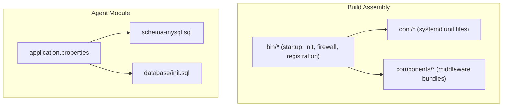
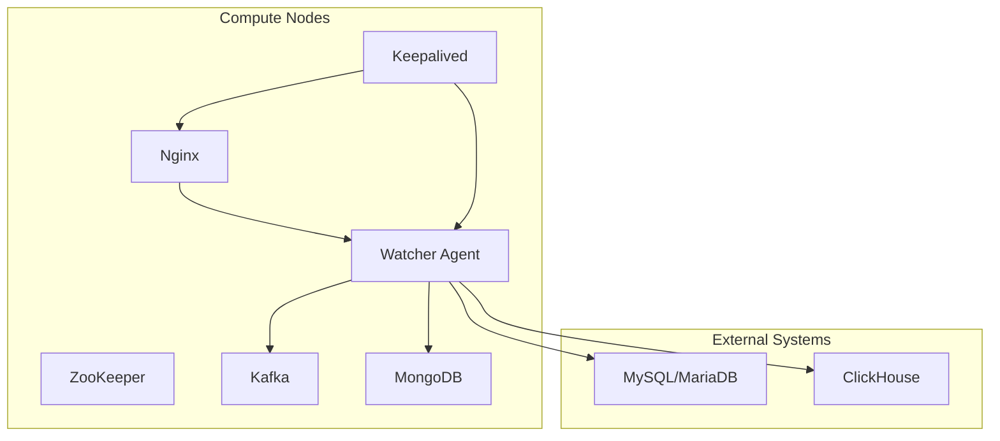
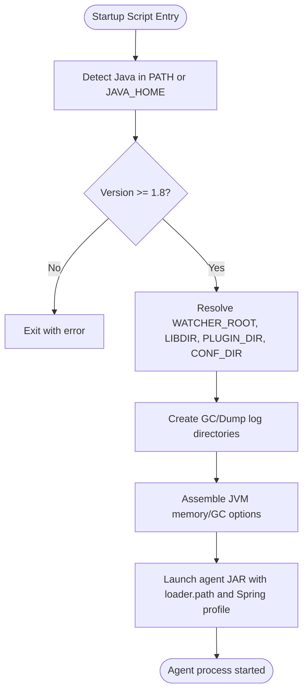
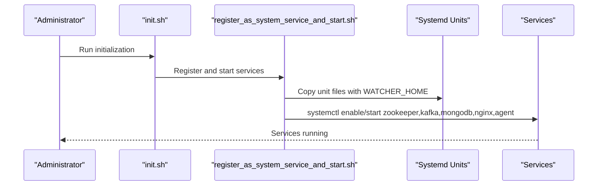
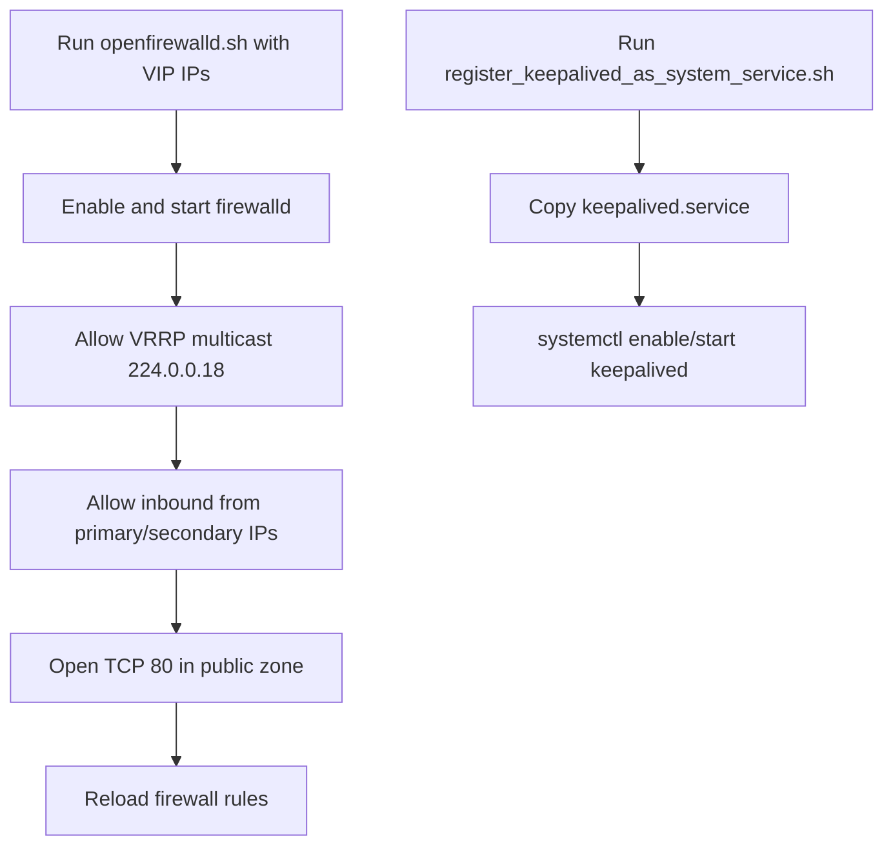
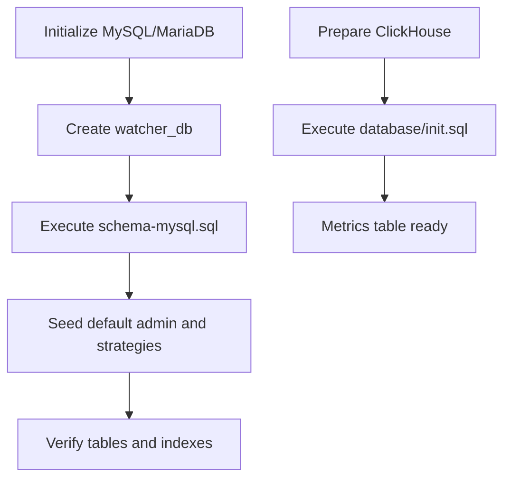
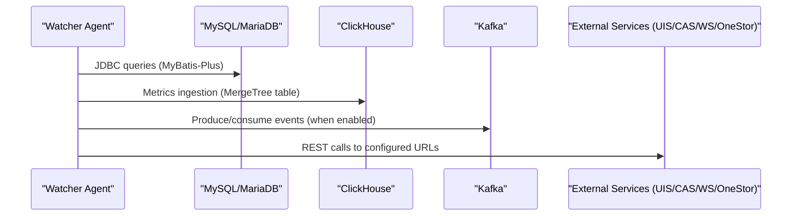
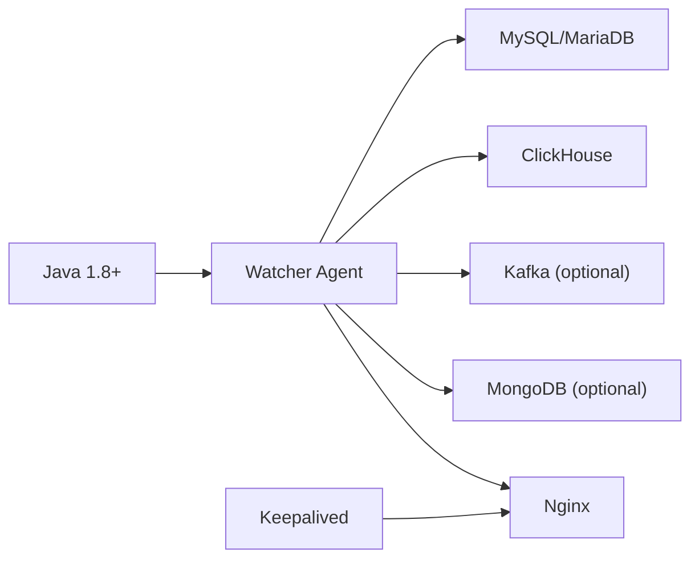

# Infrastructure Setup

<cite>
**Referenced Files in This Document**
- [startup.sh](file://watcher-builder/assembly/bin/startup.sh)
- [init.sh](file://watcher-builder/assembly/bin/init.sh)
- [openfirewalld.sh](file://watcher-builder/assembly/bin/openfirewalld.sh)
- [register_as_system_service_and_start.sh](file://watcher-builder/assembly/bin/register_as_system_service_and_start.sh)
- [register_keepalived_as_system_service.sh](file://watcher-builder/assembly/bin/register_keepalived_as_system_service.sh)
- [agent.service](file://watcher-builder/assembly/conf/agent.service)
- [kafka.service](file://watcher-builder/assembly/conf/kafka.service)
- [nginx.service](file://watcher-builder/assembly/conf/nginx.service)
- [zookeeper.service](file://watcher-builder/assembly/conf/zookeeper.service)
- [mongodb.service](file://watcher-builder/assembly/conf/mongodb.service)
- [keepalived.service](file://watcher-builder/assembly/conf/keepalived.service)
- [application.properties](file://watcher-agent/src/main/resources/application.properties)
- [schema-mysql.sql](file://watcher-agent/src/main/resources/schema-mysql.sql)
- [init.sql](file://watcher-agent/src/main/resources/database/init.sql)
</cite>

## Table of Contents
1. [Introduction](#introduction)
2. [Project Structure](#project-structure)
3. [Core Components](#core-components)
4. [Architecture Overview](#architecture-overview)
5. [Detailed Component Analysis](#detailed-component-analysis)
6. [Dependency Analysis](#dependency-analysis)
7. [Performance Considerations](#performance-considerations)
8. [Troubleshooting Guide](#troubleshooting-guide)
9. [Conclusion](#conclusion)
10. [Appendices](#appendices)

## Introduction
This document provides comprehensive infrastructure setup guidance for deploying the ShowTime monitoring platform. It covers system requirements, database initialization, middleware dependencies (Kafka, Redis, Filebeat), service orchestration, hardware/network/firewall requirements, and high availability considerations. The content is derived from the repository’s build scripts, systemd unit files, and application configuration.

## Project Structure
The ShowTime platform is organized into multiple modules with a dedicated builder assembly that provisions the runtime environment, systemd services, and startup scripts. The watcher-agent module contains application configuration and database schema initialization scripts.

Key infrastructure-related locations:
- Build assembly and service units: watcher-builder/assembly
- Watcher agent application configuration and DB schema: watcher-agent/src/main/resources

**Diagram sources**
- [startup.sh:1-81](file://watcher-builder/assembly/bin/startup.sh#L1-L81)
- [agent.service:1-14](file://watcher-builder/assembly/conf/agent.service#L1-L14)
- [application.properties:1-80](file://watcher-agent/src/main/resources/application.properties#L1-L80)
- [schema-mysql.sql:1-204](file://watcher-agent/src/main/resources/schema-mysql.sql#L1-L204)
- [init.sql:1-12](file://watcher-agent/src/main/resources/database/init.sql#L1-L12)

**Section sources**
- [startup.sh:1-81](file://watcher-builder/assembly/bin/startup.sh#L1-L81)
- [application.properties:1-80](file://watcher-agent/src/main/resources/application.properties#L1-L80)

## Core Components
- Watcher Agent: Java-based service with embedded middleware toggles and MySQL datasource configuration.
- Systemd Services: ZooKeeper, Kafka, MongoDB, Nginx, and Watcher Agent managed via unit files.
- Startup Scripts: Initialization, firewall configuration, and service registration helpers.
- Database Schema: MySQL schema for core entities and ClickHouse table for metrics.

**Section sources**
- [application.properties:46-58](file://watcher-agent/src/main/resources/application.properties#L46-L58)
- [schema-mysql.sql:1-204](file://watcher-agent/src/main/resources/schema-mysql.sql#L1-L204)
- [init.sql:1-12](file://watcher-agent/src/main/resources/database/init.sql#L1-L12)
- [agent.service:1-14](file://watcher-builder/assembly/conf/agent.service#L1-L14)

## Architecture Overview
The platform runs as a set of cooperating services:
- Watcher Agent exposes an HTTP endpoint and integrates with external systems via configured URLs.
- Middleware stack includes ZooKeeper, Kafka, and MongoDB (enabled via systemd units).
- Nginx is provisioned as part of the assembly for reverse proxy/load balancing support.
- High availability is supported through Keepalived and VRRP rules.

**Diagram sources**
- [register_as_system_service_and_start.sh:17-38](file://watcher-builder/assembly/bin/register_as_system_service_and_start.sh#L17-L38)
- [register_keepalived_as_system_service.sh:11-18](file://watcher-builder/assembly/bin/register_keepalived_as_system_service.sh#L11-L18)
- [application.properties:48-70](file://watcher-agent/src/main/resources/application.properties#L48-L70)
- [schema-mysql.sql:5-204](file://watcher-agent/src/main/resources/schema-mysql.sql#L5-L204)
- [init.sql:1-12](file://watcher-agent/src/main/resources/database/init.sql#L1-L12)

## Detailed Component Analysis

### Java Runtime and Watcher Agent Startup
- Java detection and version check: The startup script locates Java in PATH or JAVA_HOME and validates version compatibility.
- Memory and GC tuning: Hardcoded JVM memory and GC logging options are applied.
- Plugin and configuration discovery: Loader path includes libraries, plugins, and configuration directories.
- Spring profile activation: The agent starts with the production profile and loads configuration from a dedicated location.

**Diagram sources**
- [startup.sh:3-78](file://watcher-builder/assembly/bin/startup.sh#L3-L78)

**Section sources**
- [startup.sh:3-78](file://watcher-builder/assembly/bin/startup.sh#L3-L78)

### Systemd Service Orchestration
- Unit files define how each service is started, reloaded, and stopped.
- Registration script replaces placeholders with the actual watcher home and installs units under systemd.
- Services started include ZooKeeper, Kafka, MongoDB, Nginx, and the Watcher Agent.

**Diagram sources**
- [init.sh:17-20](file://watcher-builder/assembly/bin/init.sh#L17-L20)
- [register_as_system_service_and_start.sh:11-38](file://watcher-builder/assembly/bin/register_as_system_service_and_start.sh#L11-L38)
- [agent.service:6-10](file://watcher-builder/assembly/conf/agent.service#L6-L10)
- [kafka.service:6-10](file://watcher-builder/assembly/conf/kafka.service#L6-L10)
- [zookeeper.service:6-10](file://watcher-builder/assembly/conf/zookeeper.service#L6-L10)
- [mongodb.service:6-10](file://watcher-builder/assembly/conf/mongodb.service#L6-L10)
- [nginx.service:6-10](file://watcher-builder/assembly/conf/nginx.service#L6-L10)

**Section sources**
- [init.sh:1-35](file://watcher-builder/assembly/bin/init.sh#L1-L35)
- [register_as_system_service_and_start.sh:1-45](file://watcher-builder/assembly/bin/register_as_system_service_and_start.sh#L1-L45)
- [agent.service:1-14](file://watcher-builder/assembly/conf/agent.service#L1-L14)
- [kafka.service:1-14](file://watcher-builder/assembly/conf/kafka.service#L1-L14)
- [zookeeper.service:1-14](file://watcher-builder/assembly/conf/zookeeper.service#L1-L14)
- [mongodb.service:1-14](file://watcher-builder/assembly/conf/mongodb.service#L1-L14)
- [nginx.service:1-14](file://watcher-builder/assembly/conf/nginx.service#L1-L14)

### Firewall and High Availability
- Firewall configuration opens required ports and allows VRRP multicast traffic.
- Keepalived is registered as a systemd service for high availability and failover.

**Diagram sources**
- [openfirewalld.sh:9-20](file://watcher-builder/assembly/bin/openfirewalld.sh#L9-L20)
- [register_keepalived_as_system_service.sh:11-18](file://watcher-builder/assembly/bin/register_keepalived_as_system_service.sh#L11-L18)

**Section sources**
- [openfirewalld.sh:1-21](file://watcher-builder/assembly/bin/openfirewalld.sh#L1-L21)
- [register_keepalived_as_system_service.sh:1-25](file://watcher-builder/assembly/bin/register_keepalived_as_system_service.sh#L1-L25)

### Database Initialization and Schema Creation
- MySQL/MariaDB datasource is configured in the agent application properties.
- A comprehensive schema script initializes core tables and indexes.
- A ClickHouse table is prepared for metrics ingestion.

**Diagram sources**
- [application.properties:48-51](file://watcher-agent/src/main/resources/application.properties#L48-L51)
- [schema-mysql.sql:5-204](file://watcher-agent/src/main/resources/schema-mysql.sql#L5-L204)
- [init.sql:1-12](file://watcher-agent/src/main/resources/database/init.sql#L1-L12)

**Section sources**
- [application.properties:48-51](file://watcher-agent/src/main/resources/application.properties#L48-L51)
- [schema-mysql.sql:1-204](file://watcher-agent/src/main/resources/schema-mysql.sql#L1-L204)
- [init.sql:1-12](file://watcher-agent/src/main/resources/database/init.sql#L1-L12)

### Inter-Service Communication
- The agent references external service endpoints via configurable URLs (UIS, Workspace, CAS, OneStor).
- Middleware toggles are present but disabled by default in local profiles; production profiles may enable Kafka, MongoDB, and others.

**Diagram sources**
- [application.properties:48-70](file://watcher-agent/src/main/resources/application.properties#L48-L70)
- [schema-mysql.sql:182-204](file://watcher-agent/src/main/resources/schema-mysql.sql#L182-L204)
- [init.sql:1-12](file://watcher-agent/src/main/resources/database/init.sql#L1-L12)

**Section sources**
- [application.properties:63-70](file://watcher-agent/src/main/resources/application.properties#L63-L70)

## Dependency Analysis
- Java runtime is mandatory for the agent.
- Systemd-managed middleware services are bundled and started during initialization.
- The agent depends on MySQL/MariaDB and optionally ClickHouse for metrics.
- Optional integrations (Kafka, MongoDB) are controlled by configuration and systemd units.

**Diagram sources**
- [startup.sh:3-25](file://watcher-builder/assembly/bin/startup.sh#L3-L25)
- [application.properties:48-70](file://watcher-agent/src/main/resources/application.properties#L48-L70)
- [register_as_system_service_and_start.sh:25-38](file://watcher-builder/assembly/bin/register_as_system_service_and_start.sh#L25-L38)

**Section sources**
- [startup.sh:3-25](file://watcher-builder/assembly/bin/startup.sh#L3-L25)
- [application.properties:14-28](file://watcher-agent/src/main/resources/application.properties#L14-L28)
- [register_as_system_service_and_start.sh:25-38](file://watcher-builder/assembly/bin/register_as_system_service_and_start.sh#L25-L38)

## Performance Considerations
- JVM sizing and GC logging are preconfigured in the startup script. Adjust heap and GC options according to workload.
- Enable middleware components (Kafka, MongoDB) only when needed to reduce overhead.
- Use production profile and externalized configuration for performance-sensitive deployments.

[No sources needed since this section provides general guidance]

## Troubleshooting Guide
- Java not found or version too low: The startup script checks PATH and JAVA_HOME and exits if version is below required threshold.
- Service registration failures: Ensure the watcher home path is written to /etc/watcher_home and unit files are copied with correct placeholders.
- Firewall blocking traffic: Use the firewall script to open required ports and allow VRRP multicast.
- MySQL connectivity: Verify JDBC URL, credentials, and driver class in application properties.

**Section sources**
- [startup.sh:3-25](file://watcher-builder/assembly/bin/startup.sh#L3-L25)
- [register_as_system_service_and_start.sh:11-21](file://watcher-builder/assembly/bin/register_as_system_service_and_start.sh#L11-L21)
- [openfirewalld.sh:9-20](file://watcher-builder/assembly/bin/openfirewalld.sh#L9-L20)
- [application.properties:48-51](file://watcher-agent/src/main/resources/application.properties#L48-L51)

## Conclusion
The ShowTime platform provides a structured, systemd-driven deployment model with clear separation of concerns between the agent, middleware, and external systems. By following the initialization and registration steps, configuring the database, and enabling optional middleware, you can achieve a robust, scalable monitoring solution with high availability support.

[No sources needed since this section summarizes without analyzing specific files]

## Appendices

### Hardware Requirements
- Minimum: Quad-core CPU, 8 GB RAM, 100 GB disk for OS and logs.
- Recommended: Octo-core CPU, 32 GB RAM, 500 GB SSD for MySQL and ClickHouse.
- Network: 1 Gbps NIC minimum; 10 Gbps recommended for high-volume metrics.

[No sources needed since this section provides general guidance]

### Network Configuration and Firewall Settings
- Required inbound ports:
  - TCP 22 (SSH)
  - TCP 80 (HTTP/Nginx)
  - TCP 8888 (Agent HTTP)
  - TCP 9092 (Kafka)
  - TCP 27017 (MongoDB)
  - TCP 2181 (ZooKeeper)
  - TCP 2888/3888 (ZooKeeper quorum)
- Multicast:
  - UDP 224.0.0.18 (VRRP)
- Firewall automation:
  - Use the provided firewall script to enable firewalld and configure rules.

**Section sources**
- [openfirewalld.sh:9-20](file://watcher-builder/assembly/bin/openfirewalld.sh#L9-L20)

### Load Balancing and Clustering
- Nginx is included in the assembly for reverse proxy/load balancing.
- Keepalived provides high availability with VRRP; configure virtual IP addresses and priorities per environment.
- Kafka and ZooKeeper form a clustered messaging backbone; ensure proper quorum and replication.

**Section sources**
- [nginx.service:1-14](file://watcher-builder/assembly/conf/nginx.service#L1-L14)
- [register_keepalived_as_system_service.sh:11-18](file://watcher-builder/assembly/bin/register_keepalived_as_system_service.sh#L11-L18)
- [kafka.service:1-14](file://watcher-builder/assembly/conf/kafka.service#L1-L14)
- [zookeeper.service:1-14](file://watcher-builder/assembly/conf/zookeeper.service#L1-L14)

### Step-by-Step Installation Guides

#### Single-Node Deployment (Local/Dev)
- Install Java 1.8+ and ensure JAVA_HOME is set.
- Initialize watcher home and start services:
  - Run the initialization script to set up watcher home, copy components, and start services.
  - Register systemd units and start ZooKeeper, Kafka, MongoDB, Nginx, and Agent.
- Configure firewall:
  - Run the firewall script to open required ports and allow VRRP.
- Initialize databases:
  - Create MySQL/MariaDB database and run the schema script.
  - Prepare ClickHouse metrics table using the provided script.

**Section sources**
- [init.sh:17-20](file://watcher-builder/assembly/bin/init.sh#L17-L20)
- [register_as_system_service_and_start.sh:17-38](file://watcher-builder/assembly/bin/register_as_system_service_and_start.sh#L17-L38)
- [openfirewalld.sh:9-20](file://watcher-builder/assembly/bin/openfirewalld.sh#L9-L20)
- [application.properties:48-51](file://watcher-agent/src/main/resources/application.properties#L48-L51)
- [schema-mysql.sql:5-204](file://watcher-agent/src/main/resources/schema-mysql.sql#L5-L204)
- [init.sql:1-12](file://watcher-agent/src/main/resources/database/init.sql#L1-L12)

#### High Availability Deployment (Multi-Node)
- Provision two or more nodes for Nginx and Keepalived.
- Configure VRRP virtual IP and priorities.
- Start Nginx and Keepalived on all nodes.
- Ensure shared storage or synchronized configuration for the agent.
- Validate failover by stopping the active node and confirming takeover.

**Section sources**
- [register_keepalived_as_system_service.sh:11-18](file://watcher-builder/assembly/bin/register_keepalived_as_system_service.sh#L11-L18)
- [nginx.service:1-14](file://watcher-builder/assembly/conf/nginx.service#L1-L14)

#### Middleware-Enabled Production
- Enable Kafka and MongoDB by setting appropriate flags in configuration and ensuring systemd units are started.
- Monitor Kafka topics and ZooKeeper quorum health.
- Tune JVM and GC settings based on throughput and latency requirements.

**Section sources**
- [application.properties:14-28](file://watcher-agent/src/main/resources/application.properties#L14-L28)
- [register_as_system_service_and_start.sh:25-38](file://watcher-builder/assembly/bin/register_as_system_service_and_start.sh#L25-L38)