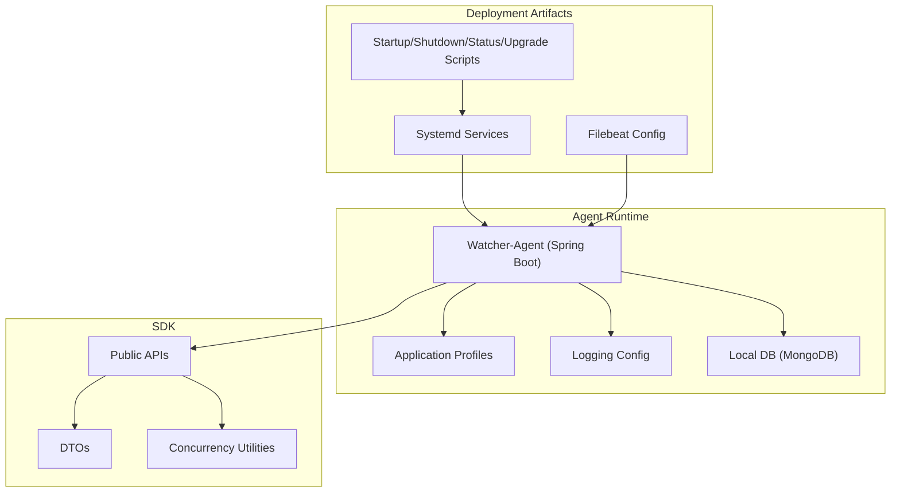
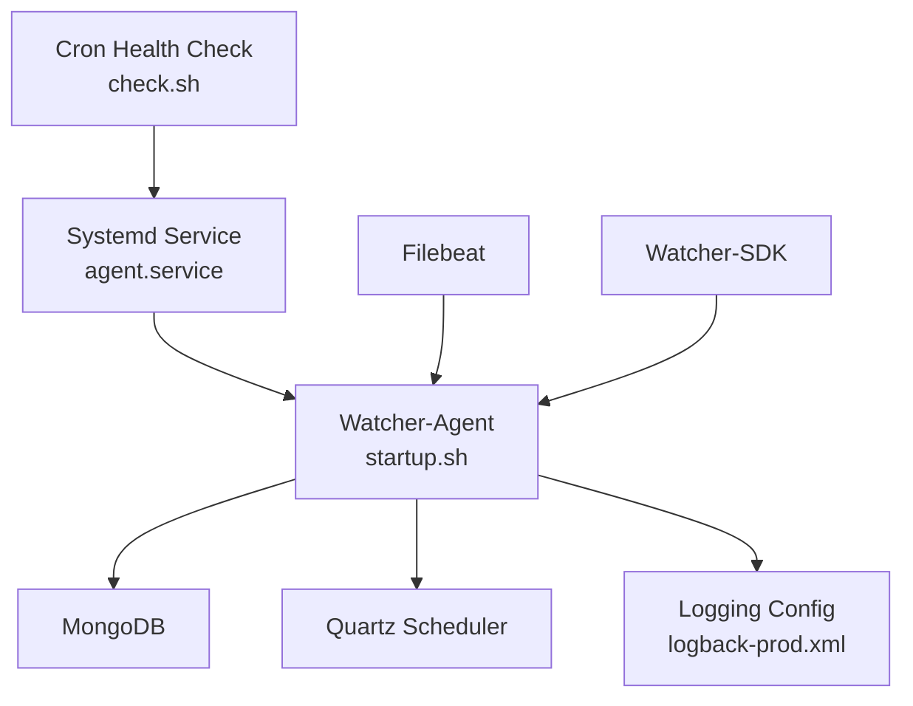
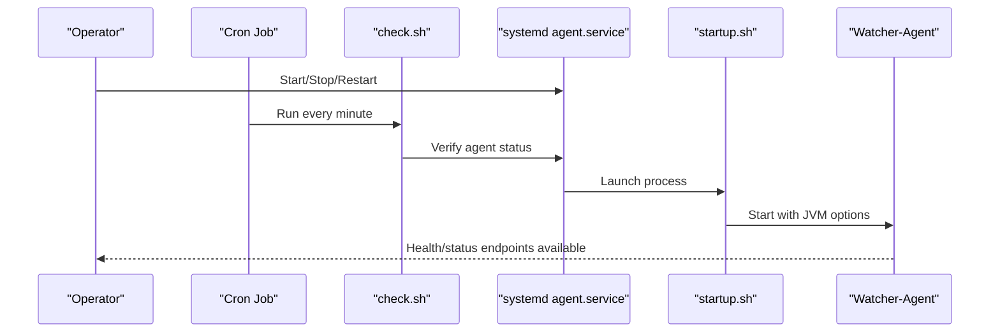
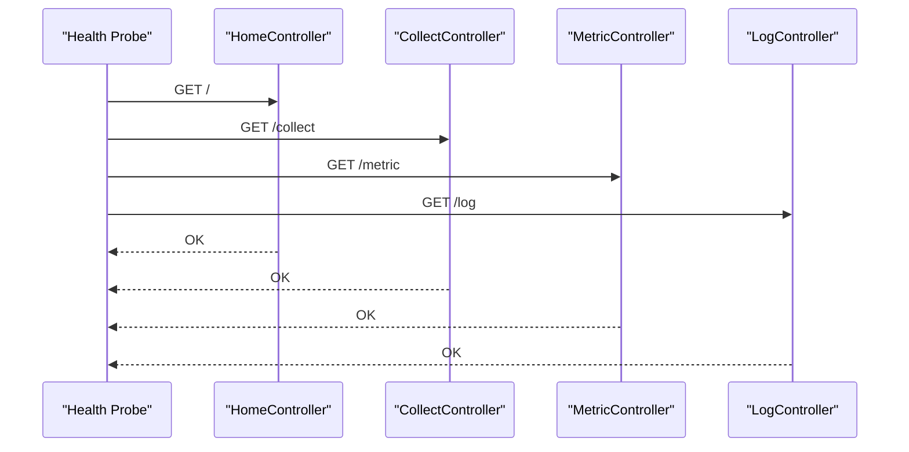
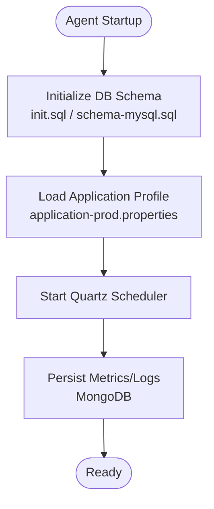
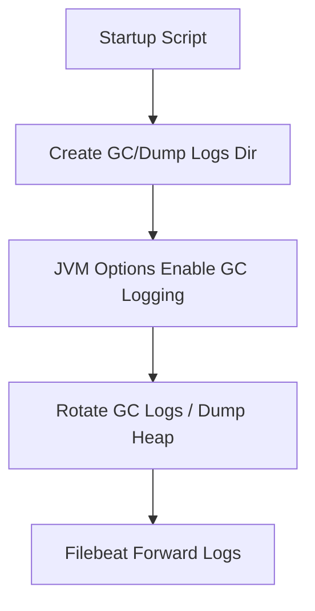
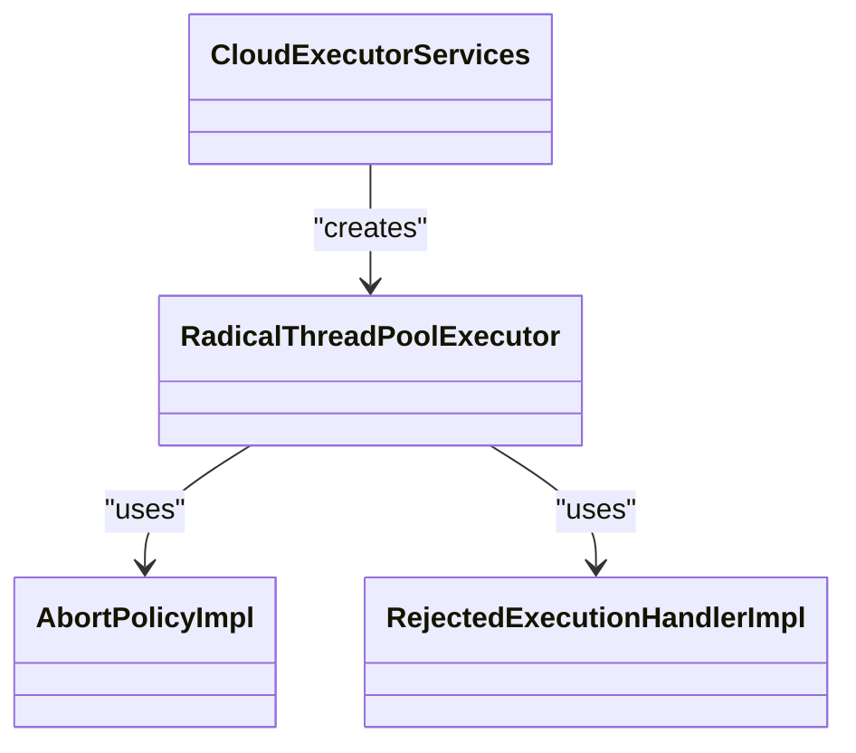
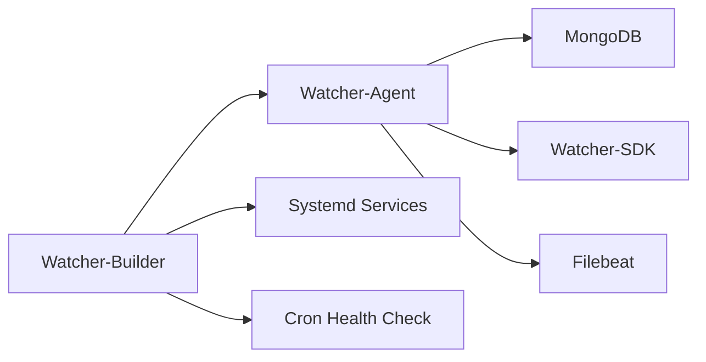

# Maintenance & Operations

<cite>
**Referenced Files in This Document**
- [Readme.md](file://Readme.md)
- [init.sh](file://watcher-builder/assembly/bin/init.sh)
- [check.sh](file://watcher-builder/assembly/bin/check.sh)
- [startup.sh](file://watcher-builder/assembly/bin/startup.sh)
- [shutdown.sh](file://watcher-builder/assembly/bin/shutdown.sh)
- [restart.sh](file://watcher-builder/assembly/bin/restart.sh)
- [status.sh](file://watcher-builder/assembly/bin/status.sh)
- [upgrade.sh](file://watcher-builder/assembly/bin/upgrade.sh)
- [filebeat.yml](file://watcher-builder/assembly/components/filebeat/filebeat-8.0.1-linux-x86_64/filebeat.yml)
- [filebeat-watcher.yml](file://watcher-builder/assembly/components/filebeat/filebeat-8.0.1-linux-x86_64/filebeat-watcher.yml)
- [agent.service](file://watcher-builder/assembly/conf/agent.service)
- [kafka.service](file://watcher-builder/assembly/conf/kafka.service)
- [mongodb.service](file://watcher-builder/assembly/conf/mongodb.service)
- [nginx.service](file://watcher-builder/assembly/conf/nginx.service)
- [zookeeper.service](file://watcher-builder/assembly/conf/zookeeper.service)
- [keepalived.service](file://watcher-builder/assembly/conf/keepalived.service)
- [application.properties](file://watcher-agent/src/main/resources/application.properties)
- [application-prod.properties](file://watcher-agent/src/main/resources/application-prod.properties)
- [logback-prod.xml](file://watcher-agent/src/main/resources/logback-prod.xml)
- [schema-mysql.sql](file://watcher-agent/src/main/resources/schema-mysql.sql)
- [init.sql](file://watcher-agent/src/main/resources/database/init.sql)
- [WatcherAgentApplication.java](file://watcher-agent/src/main/java/com/virtual/cloud/om/agent/WatcherAgentApplication.java)
- [CollectController.java](file://watcher-agent/src/main/java/com/virtual/cloud/om/agent/controller/CollectController.java)
- [MetricController.java](file://watcher-agent/src/main/java/com/virtual/cloud/om/agent/controller/MetricController.java)
- [LogController.java](file://watcher-agent/src/main/java/com/virtual/cloud/om/agent/controller/LogController.java)
- [DeployController.java](file://watcher-agent/src/main/java/com/virtual/cloud/om/agent/controller/DeployController.java)
- [HomeController.java](file://watcher-agent/src/main/java/com/virtual/cloud/om/agent/controller/HomeController.java)
- [DataSourceConfig.java](file://watcher-agent/src/main/java/com/virtual/cloud/om/agent/config/DataSourceConfig.java)
- [TaskRepository.java](file://watcher-agent/src/main/java/com/virtual/cloud/om/agent/repository/TaskRepository.java)
- [TaskRepositoryImpl.java](file://watcher-agent/src/main/java/com/virtual/cloud/om/agent/repository/TaskRepositoryImpl.java)
- [Task.java](file://watcher-agent/src/main/java/com/virtual/cloud/om/agent/entity/Task.java)
- [OperationLog.java](file://watcher-agent/src/main/java/com/virtual/cloud/om/agent/entity/OperationLog.java)
- [DataCenterConfig.java](file://watcher-agent/src/main/java/com/virtual/cloud/om/agent/entity/DataCenterConfig.java)
- [DataCenterToken.java](file://watcher-agent/src/main/java/com/virtual/cloud/om/agent/entity/DataCenterToken.java)
- [SysUser.java](file://watcher-agent/src/main/java/com/virtual/cloud/om/agent/entity/SysUser.java)
- [OadWatcherStatus.java](file://watcher-agent/src/main/java/com/virtual/cloud/agent/entity/OadWatcherStatus.java)
- [FilebeatLog.java](file://watcher-agent/src/main/java/com/virtual/cloud/om/agent/entity/FilebeatLog.java)
- [KafkaConsumerOffsetLog.java](file://watcher-agent/src/main/java/com/virtual/cloud/om/agent/entity/KafkaConsumerOffsetLog.java)
- [LastReportStaticDataTime.java](file://watcher-agent/src/main/java/com/virtual/cloud/om/agent/entity/LastReportStaticDataTime.java)
- [LogMetaData.java](file://watcher-agent/src/main/java/com/virtual/cloud/om/agent/entity/LogMetaData.java)
- [NetworkConfig.java](file://watcher-agent/src/main/java/com/virtual/cloud/om/agent/entity/NetworkConfig.java)
- [Parameter.java](file://watcher-agent/src/main/java/com/virtual/cloud/om/agent/entity/Parameter.java)
- [PwdStrategy.java](file://watcher-agent/src/main/java/com/virtual/cloud/om/agent/entity/PwdStrategy.java)
- [RealTimeLogStrategy.java](file://watcher-agent/src/main/java/com/virtual/cloud/om/agent/entity/RealTimeLogStrategy.java)
- [ResourceEntity.java](file://watcher-agent/src/main/java/com/virtual/cloud/om/agent/entity/ResourceEntity.java)
- [RouteConfig.java](file://watcher-agent/src/main/java/com/virtual/cloud/om/agent/entity/RouteConfig.java)
- [SysUser.java](file://watcher-agent/src/main/java/com/virtual/cloud/om/agent/entity/SysUser.java)
- [Task.java](file://watcher-agent/src/main/java/com/virtual/cloud/om/agent/entity/Task.java)
- [Warn.java](file://watcher-agent/src/main/java/com/virtual/cloud/om/agent/entity/Warn.java)
- [WatcherLock.java](file://watcher-agent/src/main/java/com/virtual/cloud/om/agent/entity/WatcherLock.java)
- [WatcherWarn.java](file://watcher-agent/src/main/java/com/virtual/cloud/om/agent/entity/WatcherWarn.java)
- [WebsocketSate.java](file://watcher-agent/src/main/java/com/virtual/cloud/om/agent/entity/WebsocketSate.java)
- [DataReportCollectorOverview.java](file://watcher-agent/src/main/java/com/virtual/cloud/om/agent/service/DataReportCollectorOverview.java)
- [SysUserService.java](file://watcher-agent/src/main/java/com/virtual/cloud/om/agent/service/SysUserService.java)
- [DataReportCollector.java](file://watcher-sdk/src/main/java/com/virtual/cloud/om/sdk/api/DataReportCollector.java)
- [LogBatchCollector.java](file://watcher-sdk/src/main/java/com/virtual/cloud/om/sdk/api/LogBatchCollector.java)
- [WarnReportCollector.java](file://watcher-sdk/src/main/java/com/virtual/cloud/om/sdk/api/WarnReportCollector.java)
- [PlatformTestConnectionApi.java](file://watcher-sdk/src/main/java/com/virtual/cloud/om/sdk/api/PlatformTestConnectionApi.java)
- [DataCenterApi.java](file://watcher-sdk/src/main/java/com/virtual/cloud/om/sdk/api/DataCenterApi.java)
- [HostApi.java](file://watcher-sdk/src/main/java/com/virtual/cloud/om/sdk/api/HostApi.java)
- [ResourceApi.java](file://watcher-sdk/src/main/java/com/virtual/cloud/om/sdk/api/ResourceApi.java)
- [TaskMgrApi.java](file://watcher-sdk/src/main/java/com/virtual/cloud/om/sdk/api/TaskMgrApi.java)
- [WatcherWarnMgrApi.java](file://watcher-sdk/src/main/java/com/virtual/cloud/om/sdk/api/WatcherWarnMgrApi.java)
- [DeployApi.java](file://watcher-sdk/src/main/java/com/virtual/cloud/om/sdk/api/DeployApi.java)
- [OperateCommandApi.java](file://watcher-sdk/src/main/java/com/virtual/cloud/om/sdk/api/OperateCommandApi.java)
- [ParameterApi.java](file://watcher-sdk/src/main/java/com/virtual/cloud/om/sdk/api/ParameterApi.java)
- [RealTimeLogApi.java](file://watcher-sdk/src/main/java/com/virtual/cloud/om/sdk/api/RealTimeLogApi.java)
- [LogPatternApi.java](file://watcher-sdk/src/main/java/com/virtual/cloud/om/sdk/api/LogPatternApi.java)
- [LockApi.java](file://watcher-sdk/src/main/java/com/virtual/cloud/om/sdk/api/LockApi.java)
- [TokenAndWatcherCodeDTO.java](file://watcher-sdk/src/main/java/com/virtual/cloud/om/sdk/dto/TokenAndWatcherCodeDTO.java)
- [FileBeatLogDTO.java](file://watcher-sdk/src/main/java/com/virtual/cloud/om/sdk/dto/FileBeatLogDTO.java)
- [CmdRetryDTO.java](file://watcher-sdk/src/main/java/com/virtual/cloud/om/sdk/dto/CmdRetryDTO.java)
- [ConmandLineSshDTO.java](file://watcher-sdk/src/main/java/com/virtual/cloud/om/sdk/dto/ConmandLineSshDTO.java)
- [DataCenterDTO.java](file://watcher-sdk/src/main/java/com/virtual/cloud/om/sdk/dto/DataCenterDTO.java)
- [DataCenterConfigDTO.java](file://watcher-sdk/src/main/java/com/virtual/cloud/om/sdk/dto/DataCenterConfigDTO.java)
- [DataCenterTokenDTO.java](file://watcher-sdk/src/main/java/com/virtual/cloud/om/sdk/dto/DataCenterTokenDTO.java)
- [DataReportDTO.java](file://watcher-sdk/src/main/java/com/virtual/cloud/om/sdk/dto/DataReportDTO.java)
- [ResourceDTO.java](file://watcher-sdk/src/main/java/com/virtual/cloud/om/sdk/dto/ResourceDTO.java)
- [ResourcesActiveDTO.java](file://watcher-sdk/src/main/java/com/virtual/cloud/om/sdk/dto/ResourcesActiveDTO.java)
- [SshRemoteResDTO.java](file://watcher-sdk/src/main/java/com/virtual/cloud/om/sdk/dto/SshRemoteResDTO.java)
- [StrategyDTO.java](file://watcher-sdk/src/main/java/com/virtual/cloud/om/sdk/dto/StrategyDTO.java)
- [TestSshConnectResultDTO.java](file://watcher-sdk/src/main/java/com/virtual/cloud/om/sdk/dto/TestSshConnectResultDTO.java)
- [UpdateStepDTO.java](file://watcher-sdk/src/main/java/com/virtual/cloud/om/sdk/dto/UpdateStepDTO.java)
- [UpgradeDTO.java](file://watcher-sdk/src/main/java/com/virtual/cloud/om/sdk/dto/UpgradeDTO.java)
- [UpgradeResultDTO.java](file://watcher-sdk/src/main/java/com/virtual/cloud/om/sdk/dto/UpgradeResultDTO.java)
- [WarnStrategyDTO.java](file://watcher-sdk/src/main/java/com/virtual/cloud/om/sdk/dto/WarnStrategyDTO.java)
- [WebsocketMessageDTO.java](file://watcher-sdk/src/main/java/com/virtual/cloud/om/sdk/dto/WebsocketMessageDTO.java)
- [WebsocketWatcherRouteOperateResult.java](file://watcher-sdk/src/main/java/com/virtual/cloud/om/sdk/dto/WebsocketWatcherRouteOperateResult.java)
- [WebsocketWatcherRouteQueryResult.java](file://watcher-sdk/src/main/java/com/virtual/cloud/om/sdk/dto/WebsocketWatcherRouteQueryResult.java)
- [DataReportAspect.java](file://watcher-sdk/src/main/java/com/virtual/cloud/om/sdk/aop/DataReportAspect.java)
- [CloudExecutorServices.java](file://watcher-sdk/src/main/java/com/virtual/cloud/om/sdk/concurrent/CloudExecutorServices.java)
- [RadicalThreadPoolExecutor.java](file://watcher-sdk/src/main/java/com/virtual/cloud/om/sdk/concurrent/RadicalThreadPoolExecutor.java)
- [AbortPolicyImpl.java](file://watcher-sdk/src/main/java/com/virtual/cloud/om/sdk/concurrent/AbortPolicyImpl.java)
- [RejectedExecutionHandlerImpl.java](file://watcher-sdk/src/main/java/com/virtual/cloud/om/sdk/concurrent/RejectedExecutionHandlerImpl.java)
- [WatcherWarn.java](file://watcher-agent/src/main/java/com/virtual/cloud/om/agent/entity/WatcherWarn.java)
- [WebsocketSate.java](file://watcher-agent/src/main/java/com/virtual/cloud/om/agent/entity/WebsocketSate.java)
- [OadWatcherStatus.java](file://watcher-agent/src/main/java/com/virtual/cloud/om/agent/entity/OadWatcherStatus.java)
- [FilebeatLog.java](file://watcher-agent/src/main/java/com/virtual/cloud/om/agent/entity/FilebeatLog.java)
- [KafkaConsumerOffsetLog.java](file://watcher-agent/src/main/java/com/virtual/cloud/om/agent/entity/KafkaConsumerOffsetLog.java)
- [LastReportStaticDataTime.java](file://watcher-agent/src/main/java/com/virtual/cloud/om/agent/entity/LastReportStaticDataTime.java)
- [LogMetaData.java](file://watcher-agent/src/main/java/com/virtual/cloud/om/agent/entity/LogMetaData.java)
- [NetworkConfig.java](file://watcher-agent/src/main/java/com/virtual/cloud/om/agent/entity/NetworkConfig.java)
- [Parameter.java](file://watcher-agent/src/main/java/com/virtual/cloud/om/agent/entity/Parameter.java)
- [PwdStrategy.java](file://watcher-agent/src/main/java/com/virtual/cloud/om/agent/entity/PwdStrategy.java)
- [RealTimeLogStrategy.java](file://watcher-agent/src/main/java/com/virtual/cloud/om/agent/entity/RealTimeLogStrategy.java)
- [ResourceEntity.java](file://watcher-agent/src/main/java/com/virtual/cloud/om/agent/entity/ResourceEntity.java)
- [RouteConfig.java](file://watcher-agent/src/main/java/com/virtual/cloud/om/agent/entity/RouteConfig.java)
- [SysUser.java](file://watcher-agent/src/main/java/com/virtual/cloud/om/agent/entity/SysUser.java)
- [Task.java](file://watcher-agent/src/main/java/com/virtual/cloud/om/agent/entity/Task.java)
- [Warn.java](file://watcher-agent/src/main/java/com/virtual/cloud/om/agent/entity/Warn.java)
- [WatcherLock.java](file://watcher-agent/src/main/java/com/virtual/cloud/om/agent/entity/WatcherLock.java)
- [WatcherWarn.java](file://watcher-agent/src/main/java/com/virtual/cloud/om/agent/entity/WatcherWarn.java)
- [WebsocketSate.java](file://watcher-agent/src/main/java/com/virtual/cloud/om/agent/entity/WebsocketSate.java)
- [DataReportCollectorOverview.java](file://watcher-agent/src/main/java/com/virtual/cloud/om/agent/service/DataReportCollectorOverview.java)
- [SysUserService.java](file://watcher-agent/src/main/java/com/virtual/cloud/om/agent/service/SysUserService.java)
- [DataReportCollector.java](file://watcher-sdk/src/main/java/com/virtual/cloud/om/sdk/api/DataReportCollector.java)
- [LogBatchCollector.java](file://watcher-sdk/src/main/java/com/virtual/cloud/om/sdk/api/LogBatchCollector.java)
- [WarnReportCollector.java](file://watcher-sdk/src/main/java/com/virtual/cloud/om/sdk/api/WarnReportCollector.java)
- [PlatformTestConnectionApi.java](file://watcher-sdk/src/main/java/com/virtual/cloud/om/sdk/api/PlatformTestConnectionApi.java)
- [DataCenterApi.java](file://watcher-sdk/src/main/java/com/virtual/cloud/om/sdk/api/DataCenterApi.java)
- [HostApi.java](file://watcher-sdk/src/main/java/com/virtual/cloud/om/sdk/api/HostApi.java)
- [ResourceApi.java](file://watcher-sdk/src/main/java/com/virtual/cloud/om/sdk/api/ResourceApi.java)
- [TaskMgrApi.java](file://watcher-sdk/src/main/java/com/virtual/cloud/om/sdk/api/TaskMgrApi.java)
- [WatcherWarnMgrApi.java](file://watcher-sdk/src/main/java/com/virtual/cloud/om/sdk/api/WatcherWarnMgrApi.java)
- [DeployApi.java](file://watcher-sdk/src/main/java/com/virtual/cloud/om/sdk/api/DeployApi.java)
- [OperateCommandApi.java](file://watcher-sdk/src/main/java/com/virtual/cloud/om/sdk/api/OperateCommandApi.java)
- [ParameterApi.java](file://watcher-sdk/src/main/java/com/virtual/cloud/om/sdk/api/ParameterApi.java)
- [RealTimeLogApi.java](file://watcher-sdk/src/main/java/com/virtual/cloud/om/sdk/api/RealTimeLogApi.java)
- [LogPatternApi.java](file://watcher-sdk/src/main/java/com/virtual/cloud/om/sdk/api/LogPatternApi.java)
- [LockApi.java](file://watcher-sdk/src/main/java/com/virtual/cloud/om/sdk/api/LockApi.java)
- [TokenAndWatcherCodeDTO.java](file://watcher-sdk/src/main/java/com/virtual/cloud/om/sdk/dto/TokenAndWatcherCodeDTO.java)
- [FileBeatLogDTO.java](file://watcher-sdk/src/main/java/com/virtual/cloud/om/sdk/dto/FileBeatLogDTO.java)
- [CmdRetryDTO.java](file://watcher-sdk/src/main/java/com/virtual/cloud/om/sdk/dto/CmdRetryDTO.java)
- [ConmandLineSshDTO.java](file://watcher-sdk/src/main/java/com/virtual/cloud/om/sdk/dto/ConmandLineSshDTO.java)
- [DataCenterDTO.java](file://watcher-sdk/src/main/java/com/virtual/cloud/om/sdk/dto/DataCenterDTO.java)
- [DataCenterConfigDTO.java](file://watcher-sdk/src/main/java/com/virtual/cloud/om/sdk/dto/DataCenterConfigDTO.java)
- [DataCenterTokenDTO.java](file://watcher-sdk/src/main/java/com/virtual/cloud/om/sdk/dto/DataCenterTokenDTO.java)
- [DataReportDTO.java](file://watcher-sdk/src/main/java/com/virtual/cloud/om/sdk/dto/DataReportDTO.java)
- [ResourceDTO.java](file://watcher-sdk/src/main/java/com/virtual/cloud/om/sdk/dto/ResourceDTO.java)
- [ResourcesActiveDTO.java](file://watcher-sdk/src/main/java/com/virtual/cloud/om/sdk/dto/ResourcesActiveDTO.java)
- [SshRemoteResDTO.java](file://watcher-sdk/src/main/java/com/virtual/cloud/om/sdk/dto/SshRemoteResDTO.java)
- [StrategyDTO.java](file://watcher-sdk/src/main/java/com/virtual/cloud/om/sdk/dto/StrategyDTO.java)
- [TestSshConnectResultDTO.java](file://watcher-sdk/src/main/java/com/virtual/cloud/om/sdk/dto/TestSshConnectResultDTO.java)
- [UpdateStepDTO.java](file://watcher-sdk/src/main/java/com/virtual/cloud/om/sdk/dto/UpdateStepDTO.java)
- [UpgradeDTO.java](file://watcher-sdk/src/main/java/com/virtual/cloud/om/sdk/dto/UpgradeDTO.java)
- [UpgradeResultDTO.java](file://watcher-sdk/src/main/java/com/virtual/cloud/om/sdk/dto/UpgradeResultDTO.java)
- [WarnStrategyDTO.java](file://watcher-sdk/src/main/java/com/virtual/cloud/om/sdk/dto/WarnStrategyDTO.java)
- [WebsocketMessageDTO.java](file://watcher-sdk/src/main/java/com/virtual/cloud/om/sdk/dto/WebsocketMessageDTO.java)
- [WebsocketWatcherRouteOperateResult.java](file://watcher-sdk/src/main/java/com/virtual/cloud/om/sdk/dto/WebsocketWatcherRouteOperateResult.java)
- [WebsocketWatcherRouteQueryResult.java](file://watcher-sdk/src/main/java/com/virtual/cloud/om/sdk/dto/WebsocketWatcherRouteQueryResult.java)
- [DataReportAspect.java](file://watcher-sdk/src/main/java/com/virtual/cloud/om/sdk/aop/DataReportAspect.java)
- [CloudExecutorServices.java](file://watcher-sdk/src/main/java/com/virtual/cloud/om/sdk/concurrent/CloudExecutorServices.java)
- [RadicalThreadPoolExecutor.java](file://watcher-sdk/src/main/java/com/virtual/cloud/om/sdk/concurrent/RadicalThreadPoolExecutor.java)
- [AbortPolicyImpl.java](file://watcher-sdk/src/main/java/com/virtual/cloud/om/sdk/concurrent/AbortPolicyImpl.java)
- [RejectedExecutionHandlerImpl.java](file://watcher-sdk/src/main/java/com/virtual/cloud/om/sdk/concurrent/RejectedExecutionHandlerImpl.java)
</cite>

## Table of Contents
1. [Introduction](#introduction)
2. [Project Structure](#project-structure)
3. [Core Components](#core-components)
4. [Architecture Overview](#architecture-overview)
5. [Detailed Component Analysis](#detailed-component-analysis)
6. [Dependency Analysis](#dependency-analysis)
7. [Performance Considerations](#performance-considerations)
8. [Troubleshooting Guide](#troubleshooting-guide)
9. [Backup and Recovery](#backup-and-recovery)
10. [Disaster Recovery Planning](#disaster-recovery-planning)
11. [Business Continuity Measures](#business-continuity-measures)
12. [System Updates and Patch Management](#system-updates-and-patch-management)
13. [Operational Runbooks](#operational-runbooks)
14. [Escalation Procedures](#escalation-procedures)
15. [24/7 Operations Guidelines](#247-operations-guidelines)
16. [Conclusion](#conclusion)

## Introduction
This document provides comprehensive maintenance and operations guidance for the ShowTime monitoring platform. It covers routine maintenance tasks (log rotation, database cleanup, system monitoring), health checks, performance monitoring, capacity planning, incident response, troubleshooting, backup and recovery, disaster recovery, business continuity, updates and upgrades, and 24/7 operations runbooks. The content is derived from the repository’s operational scripts, configuration files, and application modules.

## Project Structure
ShowTime comprises multiple modules:
- watcher-agent: Java Spring Boot service responsible for data collection, scheduling, and local persistence.
- watcher-builder: Packaging and deployment automation, including systemd service units and operational scripts.
- watcher-sdk: Shared APIs, DTOs, utilities, and concurrency primitives used across components.
- watcher-cas, watcher-onestor, watcher-uis, watcher-workspace: Product-specific collectors and handlers.
- watcher-web: Vue3 frontend for the watcher-agent.

Key operational artifacts:
- Startup/shutdown scripts under watcher-builder/assembly/bin
- Systemd unit files under watcher-builder/assembly/conf
- Logging configuration under watcher-agent/src/main/resources
- Database initialization scripts under watcher-agent/src/main/resources/database
- Application profiles under watcher-agent/src/main/resources

**Diagram sources**
- [startup.sh](file://watcher-builder/assembly/bin/startup.sh)
- [shutdown.sh](file://watcher-builder/assembly/bin/shutdown.sh)
- [status.sh](file://watcher-builder/assembly/bin/status.sh)
- [upgrade.sh](file://watcher-builder/assembly/bin/upgrade.sh)
- [agent.service](file://watcher-builder/assembly/conf/agent.service)
- [filebeat.yml](file://watcher-builder/assembly/components/filebeat/filebeat-8.0.1-linux-x86_64/filebeat.yml)
- [application-prod.properties](file://watcher-agent/src/main/resources/application-prod.properties)
- [logback-prod.xml](file://watcher-agent/src/main/resources/logback-prod.xml)
- [schema-mysql.sql](file://watcher-agent/src/main/resources/schema-mysql.sql)
- [init.sql](file://watcher-agent/src/main/resources/database/init.sql)

**Section sources**
- [Readme.md](file://Readme.md)
- [startup.sh](file://watcher-builder/assembly/bin/startup.sh)
- [application-prod.properties](file://watcher-agent/src/main/resources/application-prod.properties)
- [logback-prod.xml](file://watcher-agent/src/main/resources/logback-prod.xml)
- [schema-mysql.sql](file://watcher-agent/src/main/resources/schema-mysql.sql)
- [init.sql](file://watcher-agent/src/main/resources/database/init.sql)

## Core Components
- Watcher-Agent (Spring Boot): Orchestrates collection, scheduling, and persistence; exposes REST endpoints for health and metrics; integrates with MongoDB and Quartz.
- Watcher-Builder: Provides packaging, service registration, and lifecycle scripts; manages systemd services and cron-based health checks.
- Watcher-SDK: Defines cross-module contracts (APIs, DTOs) and shared concurrency utilities.
- Watcher-Web: Frontend for agent management and configuration.

Operational highlights:
- Health and status endpoints exposed via controllers.
- Cron-based health check script and systemd service for resilience.
- GC and heap dump logging configured for diagnostics.
- Database initialization and schema present for local persistence.

**Section sources**
- [WatcherAgentApplication.java](file://watcher-agent/src/main/java/com/virtual/cloud/om/agent/WatcherAgentApplication.java)
- [CollectController.java](file://watcher-agent/src/main/java/com/virtual/cloud/om/agent/controller/CollectController.java)
- [MetricController.java](file://watcher-agent/src/main/java/com/virtual/cloud/om/agent/controller/MetricController.java)
- [LogController.java](file://watcher-agent/src/main/java/com/virtual/cloud/om/agent/controller/LogController.java)
- [DeployController.java](file://watcher-agent/src/main/java/com/virtual/cloud/om/agent/controller/DeployController.java)
- [HomeController.java](file://watcher-agent/src/main/java/com/virtual/cloud/om/agent/controller/HomeController.java)
- [check.sh](file://watcher-builder/assembly/bin/check.sh)
- [agent.service](file://watcher-builder/assembly/conf/agent.service)
- [logback-prod.xml](file://watcher-agent/src/main/resources/logback-prod.xml)

## Architecture Overview
The platform runs as a Spring Boot agent process managed by systemd and monitored by a periodic cron job. Data collection and persistence rely on MongoDB, while Filebeat forwards logs to downstream systems. The SDK module provides shared contracts and utilities.

**Diagram sources**
- [check.sh](file://watcher-builder/assembly/bin/check.sh)
- [agent.service](file://watcher-builder/assembly/conf/agent.service)
- [startup.sh](file://watcher-builder/assembly/bin/startup.sh)
- [logback-prod.xml](file://watcher-agent/src/main/resources/logback-prod.xml)
- [filebeat.yml](file://watcher-builder/assembly/components/filebeat/filebeat-8.0.1-linux-x86_64/filebeat.yml)

## Detailed Component Analysis

### Watcher-Agent Lifecycle and Monitoring
- Startup validates Java runtime and sets JVM options including GC logging and heap dumps.
- Shutdown terminates the agent process using a process flag.
- Status checks process presence to determine operational state.
- Upgrade coordinates remote rollout across cluster nodes and executes local upgrade.

**Diagram sources**
- [check.sh](file://watcher-builder/assembly/bin/check.sh)
- [startup.sh](file://watcher-builder/assembly/bin/startup.sh)
- [shutdown.sh](file://watcher-builder/assembly/bin/shutdown.sh)
- [status.sh](file://watcher-builder/assembly/bin/status.sh)
- [agent.service](file://watcher-builder/assembly/conf/agent.service)

**Section sources**
- [startup.sh](file://watcher-builder/assembly/bin/startup.sh)
- [shutdown.sh](file://watcher-builder/assembly/bin/shutdown.sh)
- [status.sh](file://watcher-builder/assembly/bin/status.sh)
- [upgrade.sh](file://watcher-builder/assembly/bin/upgrade.sh)

### Health Checks and Metrics Exposure
- Controllers expose endpoints for collection, metrics, logs, deployment, and home page; these serve as primary health and readiness indicators.
- Logging configuration enables structured logging suitable for health dashboards.

**Diagram sources**
- [HomeController.java](file://watcher-agent/src/main/java/com/virtual/cloud/om/agent/controller/HomeController.java)
- [CollectController.java](file://watcher-agent/src/main/java/com/virtual/cloud/om/agent/controller/CollectController.java)
- [MetricController.java](file://watcher-agent/src/main/java/com/virtual/cloud/om/agent/controller/MetricController.java)
- [LogController.java](file://watcher-agent/src/main/java/com/virtual/cloud/om/agent/controller/LogController.java)
- [logback-prod.xml](file://watcher-agent/src/main/resources/logback-prod.xml)

**Section sources**
- [HomeController.java](file://watcher-agent/src/main/java/com/virtual/cloud/om/agent/controller/HomeController.java)
- [CollectController.java](file://watcher-agent/src/main/java/com/virtual/cloud/om/agent/controller/CollectController.java)
- [MetricController.java](file://watcher-agent/src/main/java/com/virtual/cloud/om/agent/controller/MetricController.java)
- [LogController.java](file://watcher-agent/src/main/java/com/virtual/cloud/om/agent/controller/LogController.java)
- [logback-prod.xml](file://watcher-agent/src/main/resources/logback-prod.xml)

### Data Persistence and Scheduling
- MongoDB is used for local persistence; Quartz scheduler handles timed tasks.
- Database initialization scripts define schema and seed data.

**Diagram sources**
- [init.sql](file://watcher-agent/src/main/resources/database/init.sql)
- [schema-mysql.sql](file://watcher-agent/src/main/resources/schema-mysql.sql)
- [application-prod.properties](file://watcher-agent/src/main/resources/application-prod.properties)
- [DataSourceConfig.java](file://watcher-agent/src/main/java/com/virtual/cloud/om/agent/config/DataSourceConfig.java)

**Section sources**
- [init.sql](file://watcher-agent/src/main/resources/database/init.sql)
- [schema-mysql.sql](file://watcher-agent/src/main/resources/schema-mysql.sql)
- [application-prod.properties](file://watcher-agent/src/main/resources/application-prod.properties)
- [DataSourceConfig.java](file://watcher-agent/src/main/java/com/virtual/cloud/om/agent/config/DataSourceConfig.java)

### Logging and Log Rotation
- GC logs and heap dumps are rotated and stored under logs/gc and logs/dump.
- Logback configuration supports production logging; Filebeat configuration exists for log forwarding.

**Diagram sources**
- [startup.sh](file://watcher-builder/assembly/bin/startup.sh)
- [logback-prod.xml](file://watcher-agent/src/main/resources/logback-prod.xml)
- [filebeat.yml](file://watcher-builder/assembly/components/filebeat/filebeat-8.0.1-linux-x86_64/filebeat.yml)

**Section sources**
- [startup.sh](file://watcher-builder/assembly/bin/startup.sh)
- [logback-prod.xml](file://watcher-agent/src/main/resources/logback-prod.xml)
- [filebeat.yml](file://watcher-builder/assembly/components/filebeat/filebeat-8.0.1-linux-x86_64/filebeat.yml)

### Concurrency and Task Execution
- SDK provides thread pools and policies to manage task execution safely under load.

**Diagram sources**
- [CloudExecutorServices.java](file://watcher-sdk/src/main/java/com/virtual/cloud/om/sdk/concurrent/CloudExecutorServices.java)
- [RadicalThreadPoolExecutor.java](file://watcher-sdk/src/main/java/com/virtual/cloud/om/sdk/concurrent/RadicalThreadPoolExecutor.java)
- [AbortPolicyImpl.java](file://watcher-sdk/src/main/java/com/virtual/cloud/om/sdk/concurrent/AbortPolicyImpl.java)
- [RejectedExecutionHandlerImpl.java](file://watcher-sdk/src/main/java/com/virtual/cloud/om/sdk/concurrent/RejectedExecutionHandlerImpl.java)

**Section sources**
- [CloudExecutorServices.java](file://watcher-sdk/src/main/java/com/virtual/cloud/om/sdk/concurrent/CloudExecutorServices.java)
- [RadicalThreadPoolExecutor.java](file://watcher-sdk/src/main/java/com/virtual/cloud/om/sdk/concurrent/RadicalThreadPoolExecutor.java)
- [AbortPolicyImpl.java](file://watcher-sdk/src/main/java/com/virtual/cloud/om/sdk/concurrent/AbortPolicyImpl.java)
- [RejectedExecutionHandlerImpl.java](file://watcher-sdk/src/main/java/com/virtual/cloud/om/sdk/concurrent/RejectedExecutionHandlerImpl.java)

## Dependency Analysis
- Watcher-Agent depends on:
  - MongoDB for persistence
  - Quartz for scheduling
  - Watcher-SDK for APIs and utilities
  - Filebeat for log forwarding
- Watcher-Builder provides:
  - Systemd services for MongoDB, Kafka, Zookeeper, Nginx, Keepalived
  - Lifecycle scripts for startup, shutdown, restart, status, and upgrade
  - Cron-based health check

**Diagram sources**
- [agent.service](file://watcher-builder/assembly/conf/agent.service)
- [mongodb.service](file://watcher-builder/assembly/conf/mongodb.service)
- [kafka.service](file://watcher-builder/assembly/conf/kafka.service)
- [zookeeper.service](file://watcher-builder/assembly/conf/zookeeper.service)
- [nginx.service](file://watcher-builder/assembly/conf/nginx.service)
- [keepalived.service](file://watcher-builder/assembly/conf/keepalived.service)
- [check.sh](file://watcher-builder/assembly/bin/check.sh)

**Section sources**
- [agent.service](file://watcher-builder/assembly/conf/agent.service)
- [mongodb.service](file://watcher-builder/assembly/conf/mongodb.service)
- [kafka.service](file://watcher-builder/assembly/conf/kafka.service)
- [zookeeper.service](file://watcher-builder/assembly/conf/zookeeper.service)
- [nginx.service](file://watcher-builder/assembly/conf/nginx.service)
- [keepalived.service](file://watcher-builder/assembly/conf/keepalived.service)
- [check.sh](file://watcher-builder/assembly/bin/check.sh)

## Performance Considerations
- JVM tuning: The startup script configures heap size and GC logging; enable GC log rotation and heap dump capture for diagnostics.
- Concurrency: Use SDK thread pools to avoid overload during heavy collection periods.
- Scheduling: Configure Quartz jobs to avoid peak contention with collection tasks.
- Logging: Ensure Filebeat and logback configurations support high throughput without blocking the agent.

[No sources needed since this section provides general guidance]

## Troubleshooting Guide
Common scenarios and steps:
- Agent not running:
  - Verify systemd service status and logs.
  - Confirm cron health check is active and not restarting the agent repeatedly.
- Memory pressure:
  - Review GC logs and heap dumps; adjust JVM memory options if needed.
- Database connectivity:
  - Check MongoDB service status and network accessibility.
- Upgrade failures:
  - Inspect upgrade logs and confirm SSH credentials and paths.

**Section sources**
- [status.sh](file://watcher-builder/assembly/bin/status.sh)
- [check.sh](file://watcher-builder/assembly/bin/check.sh)
- [startup.sh](file://watcher-builder/assembly/bin/startup.sh)
- [mongodb.service](file://watcher-builder/assembly/conf/mongodb.service)
- [upgrade.sh](file://watcher-builder/assembly/bin/upgrade.sh)

## Backup and Recovery
Recommended practices:
- Database backup:
  - Back up MongoDB collections regularly; schedule automated dumps and retain rotation windows per retention policy.
- Configuration backup:
  - Archive application-prod.properties, logback-prod.xml, and Filebeat configuration.
- Artifact backup:
  - Preserve watcher-agent JAR and watcher-builder packages for rollback.
- Recovery procedure:
  - Restore DB from latest clean backup.
  - Reinstall watcher-agent and watcher-builder.
  - Recreate systemd services and cron entries.
  - Validate health endpoints and metrics.

**Section sources**
- [application-prod.properties](file://watcher-agent/src/main/resources/application-prod.properties)
- [logback-prod.xml](file://watcher-agent/src/main/resources/logback-prod.xml)
- [filebeat.yml](file://watcher-builder/assembly/components/filebeat/filebeat-8.0.1-linux-x86_64/filebeat.yml)
- [init.sql](file://watcher-agent/src/main/resources/database/init.sql)

## Disaster Recovery Planning
- Multi-zone deployment:
  - Run watcher-agent instances across availability zones; configure failover for critical services.
- Service redundancy:
  - Use Keepalived and systemd to ensure high availability of watcher-agent.
- Data replication:
  - Enable MongoDB replica set and cross-region snapshots.
- DR testing:
  - Periodically validate restore procedures and cross-region failover drills.

**Section sources**
- [keepalived.service](file://watcher-builder/assembly/conf/keepalived.service)
- [agent.service](file://watcher-builder/assembly/conf/agent.service)
- [mongodb.service](file://watcher-builder/assembly/conf/mongodb.service)

## Business Continuity Measures
- SLAs:
  - Define uptime targets for watcher-agent and downstream systems.
- Change windows:
  - Perform upgrades and maintenance during scheduled maintenance windows.
- Monitoring:
  - Monitor health endpoints and alert on downtime or degraded performance.
- Documentation:
  - Maintain runbooks and escalation matrices for all stakeholders.

**Section sources**
- [check.sh](file://watcher-builder/assembly/bin/check.sh)
- [upgrade.sh](file://watcher-builder/assembly/bin/upgrade.sh)

## System Updates and Patch Management
- Pre-update checklist:
  - Back up DB and configs.
  - Verify Java version compatibility.
- Update process:
  - Stop watcher-agent, apply watcher-builder updates, restart services, validate endpoints.
- Rollback:
  - Reinstall previous artifact and restore DB snapshot if issues arise.

**Section sources**
- [startup.sh](file://watcher-builder/assembly/bin/startup.sh)
- [upgrade.sh](file://watcher-builder/assembly/bin/upgrade.sh)
- [shutdown.sh](file://watcher-builder/assembly/bin/shutdown.sh)

## Operational Runbooks
- Daily:
  - Review cron health check logs.
  - Verify watcher-agent status and health endpoints.
  - Monitor GC logs for anomalies.
- Weekly:
  - Rotate and archive logs per policy.
  - Validate DB backup integrity.
- Monthly:
  - Audit systemd services and cron entries.
  - Review upgrade history and patch compliance.

**Section sources**
- [check.sh](file://watcher-builder/assembly/bin/check.sh)
- [status.sh](file://watcher-builder/assembly/bin/status.sh)
- [startup.sh](file://watcher-builder/assembly/bin/startup.sh)

## Escalation Procedures
- Tier 1:
  - Initial detection via cron health check or monitoring alerts.
- Tier 2:
  - Investigate GC logs, DB connectivity, and service status.
- Tier 3:
  - Engage platform team for infrastructure or dependency issues.

**Section sources**
- [check.sh](file://watcher-builder/assembly/bin/check.sh)
- [mongodb.service](file://watcher-builder/assembly/conf/mongodb.service)

## 24/7 Operations Guidelines
- On-call rotation:
  - Assign shifts covering health checks, incident response, and emergency fixes.
- Runbook adherence:
  - Follow startup/shutdown/restart procedures strictly.
- Communication:
  - Use defined channels for escalations and status updates.

**Section sources**
- [init.sh](file://watcher-builder/assembly/bin/init.sh)
- [status.sh](file://watcher-builder/assembly/bin/status.sh)
- [restart.sh](file://watcher-builder/assembly/bin/restart.sh)

## Conclusion
This guide consolidates operational practices for ShowTime based on repository artifacts. By following the runbooks, escalation procedures, and maintenance schedules outlined here, teams can sustain reliable operation, respond effectively to incidents, and maintain platform availability.