# Build Configuration

<cite>
**Referenced Files in This Document**
- [package.json](file://watcher-web/package.json)
- [vite.config.ts](file://watcher-web/vite.config.ts)
- [mockProdServer.ts](file://watcher-web/mockProdServer.ts)
- [mock/user.ts](file://watcher-web/mock/user.ts)
- [mock/table.ts](file://watcher-web/mock/table.ts)
- [mock/card.ts](file://watcher-web/mock/card.ts)
- [mock/work.ts](file://watcher-web/mock/work.ts)
- [mock/menu.ts](file://watcher-web/mock/menu.ts)
- [src/main.ts](file://watcher-web/src/main.ts)
- [src/utils/system/request.ts](file://watcher-web/src/utils/system/request.ts)
- [index.html](file://watcher-web/index.html)
- [public/config.json](file://watcher-web/public/config.json)
- [tsconfig.json](file://watcher-web/tsconfig.json)
</cite>

## Table of Contents
1. [Introduction](#introduction)
2. [Project Structure](#project-structure)
3. [Core Components](#core-components)
4. [Architecture Overview](#architecture-overview)
5. [Detailed Component Analysis](#detailed-component-analysis)
6. [Dependency Analysis](#dependency-analysis)
7. [Performance Considerations](#performance-considerations)
8. [Troubleshooting Guide](#troubleshooting-guide)
9. [Conclusion](#conclusion)
10. [Appendices](#appendices)

## Introduction
This document explains the Vite-based frontend build configuration for the watcher-web module. It covers development server setup, proxy configuration for API requests, build optimization settings, and the npm scripts that drive development, staging, and production builds. It also documents the mock server setup for development, static asset management, environment-specific configurations, and practical guidance for customization, plugin integration, performance optimization, deployment preparation, and CDN strategies.

## Project Structure
The watcher-web module is a Vue 3 application built with Vite. Key build-related artifacts include:
- Vite configuration defining aliases, dev server, proxy, build outputs, and plugins
- Mock server utilities for development and optional production mock behavior
- Package scripts for dev, staging, and production builds
- Environment-driven HTTP client configuration
- Static assets under public and module aliases under src

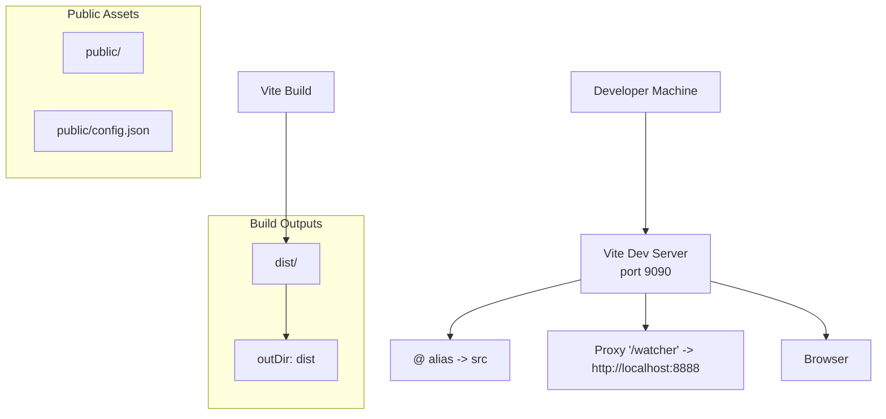

**Diagram sources**
- [vite.config.ts:13-49](file://watcher-web/vite.config.ts#L13-L49)
- [index.html:10-14](file://watcher-web/index.html#L10-L14)
- [public/config.json:1-4](file://watcher-web/public/config.json#L1-L4)

**Section sources**
- [vite.config.ts:13-49](file://watcher-web/vite.config.ts#L13-L49)
- [package.json:4-10](file://watcher-web/package.json#L4-L10)
- [index.html:10-14](file://watcher-web/index.html#L10-L14)
- [public/config.json:1-4](file://watcher-web/public/config.json#L1-L4)

## Core Components
- Vite configuration
  - Base path configured for relative asset resolution
  - Path alias @ mapped to src
  - Dev server host, port, and open behavior
  - Proxy for API routes under /watcher
  - Build output directory and Rollup chunk splitting for echarts
  - Plugins list includes @vitejs/plugin-vue
- Package scripts
  - dev: starts Vite dev server
  - start: starts Vite with host binding
  - build: production build
  - build:staging: staging build
  - serve: preview production build locally
- Mock server
  - Development-time mock APIs via vite-plugin-mock
  - Optional production mock setup via createProdMockServer
- Environment configuration
  - HTTP client reads base URL from import.meta.env.VITE_BASE_URL
  - Public config.json supplies a default backend URL
- TypeScript configuration
  - Path aliases mirror Vite’s @ -> src
  - Module resolution and strictness settings

**Section sources**
- [vite.config.ts:13-49](file://watcher-web/vite.config.ts#L13-L49)
- [package.json:4-10](file://watcher-web/package.json#L4-L10)
- [mockProdServer.ts:8-16](file://watcher-web/mockProdServer.ts#L8-L16)
- [src/utils/system/request.ts:8-11](file://watcher-web/src/utils/system/request.ts#L8-L11)
- [public/config.json:1-4](file://watcher-web/public/config.json#L1-L4)
- [tsconfig.json:15-17](file://watcher-web/tsconfig.json#L15-L17)

## Architecture Overview
The build system orchestrates development, proxying, mocking, and production bundling.

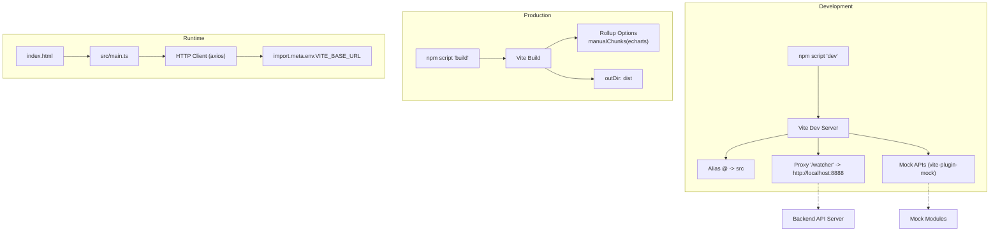

**Diagram sources**
- [package.json:4-10](file://watcher-web/package.json#L4-L10)
- [vite.config.ts:23-44](file://watcher-web/vite.config.ts#L23-L44)
- [mockProdServer.ts:8-16](file://watcher-web/mockProdServer.ts#L8-L16)
- [src/main.ts:35-37](file://watcher-web/src/main.ts#L35-L37)
- [src/utils/system/request.ts:8-11](file://watcher-web/src/utils/system/request.ts#L8-L11)

## Detailed Component Analysis

### Vite Configuration
Key behaviors:
- Base path: "./" ensures assets resolve relative to the deployed path
- Alias: "@" resolves to "src" for concise imports
- Dev server: host 0.0.0.0, port 9090, open false
- Proxy: "/watcher" forwards to http://localhost:8888 with origin change and path rewrite
- Build: outDir "dist", manualChunks splits echarts into its own bundle
- Plugins: @vitejs/plugin-vue included

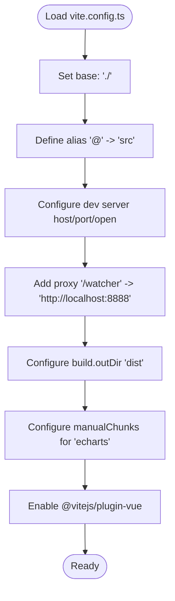

**Diagram sources**
- [vite.config.ts:13-49](file://watcher-web/vite.config.ts#L13-L49)

**Section sources**
- [vite.config.ts:13-49](file://watcher-web/vite.config.ts#L13-L49)

### Development Workflow and Hot Module Replacement
- The dev script launches Vite with the default mode
- The dev server binds to 0.0.0.0 and serves on port 9090
- HMR is enabled by default in Vite for Vue components
- The HTML entry loads the main module as an ES module

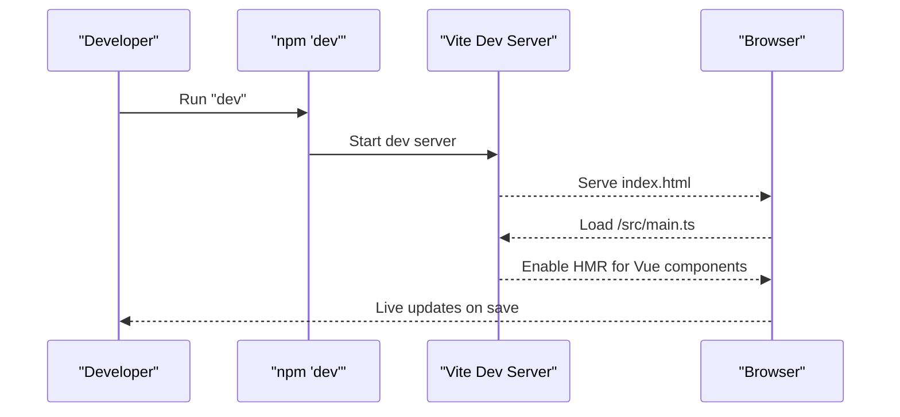

**Diagram sources**
- [package.json:5](file://watcher-web/package.json#L5)
- [vite.config.ts:23-27](file://watcher-web/vite.config.ts#L23-L27)
- [index.html:12](file://watcher-web/index.html#L12)

**Section sources**
- [package.json:5](file://watcher-web/package.json#L5)
- [vite.config.ts:23-27](file://watcher-web/vite.config.ts#L23-L27)
- [index.html:12](file://watcher-web/index.html#L12)

### Proxy Configuration for API Requests
- All requests prefixed with "/watcher" are proxied to http://localhost:8888
- Origin is changed and the incoming path is rewritten unchanged
- This allows local frontend to call "/watcher/..." without CORS concerns during development

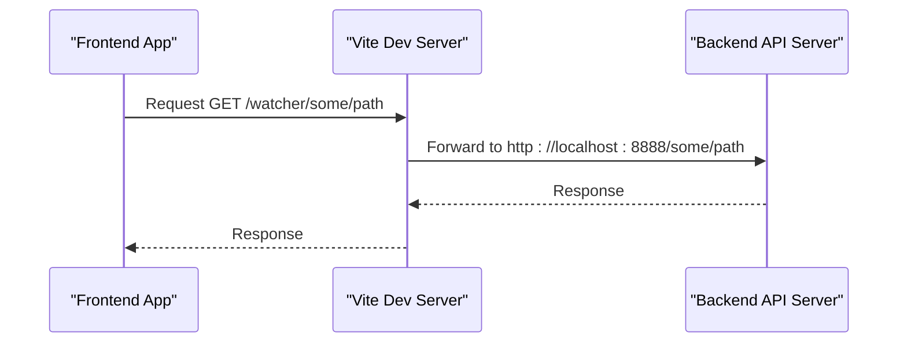

**Diagram sources**
- [vite.config.ts:27-33](file://watcher-web/vite.config.ts#L27-L33)

**Section sources**
- [vite.config.ts:27-33](file://watcher-web/vite.config.ts#L27-L33)

### Mock Server Setup for Development
- Mock modules define endpoints under "/mock/..."
- The mockProdServer utility aggregates modules and sets up production mock behavior
- During development, vite-plugin-mock registers these endpoints automatically

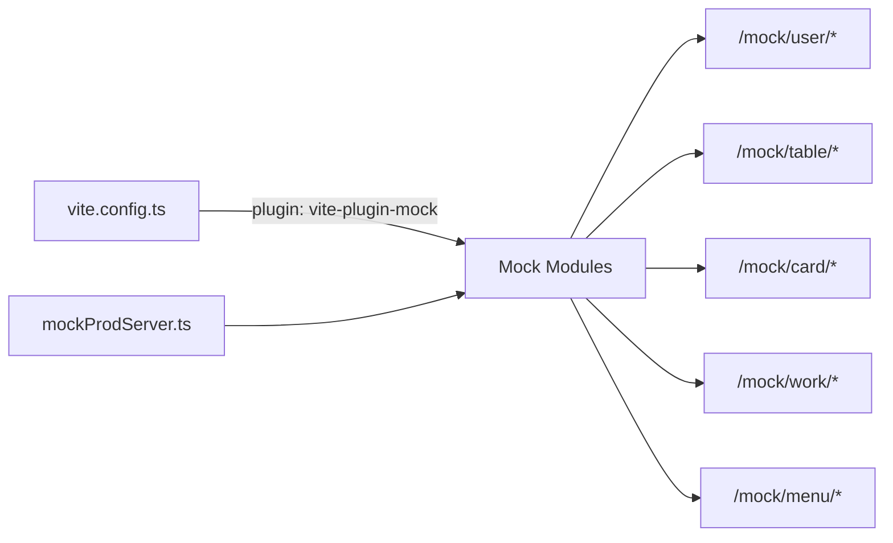

**Diagram sources**
- [vite.config.ts:45-47](file://watcher-web/vite.config.ts#L45-L47)
- [mockProdServer.ts:8-16](file://watcher-web/mockProdServer.ts#L8-L16)
- [mock/user.ts:13-86](file://watcher-web/mock/user.ts#L13-L86)
- [mock/table.ts:3-138](file://watcher-web/mock/table.ts#L3-L138)
- [mock/card.ts:3-28](file://watcher-web/mock/card.ts#L3-L28)
- [mock/work.ts:3-338](file://watcher-web/mock/work.ts#L3-L338)
- [mock/menu.ts:17-29](file://watcher-web/mock/menu.ts#L17-L29)

**Section sources**
- [vite.config.ts:45-47](file://watcher-web/vite.config.ts#L45-L47)
- [mockProdServer.ts:8-16](file://watcher-web/mockProdServer.ts#L8-L16)
- [mock/user.ts:13-86](file://watcher-web/mock/user.ts#L13-L86)
- [mock/table.ts:3-138](file://watcher-web/mock/table.ts#L3-L138)
- [mock/card.ts:3-28](file://watcher-web/mock/card.ts#L3-L28)
- [mock/work.ts:3-338](file://watcher-web/mock/work.ts#L3-L338)
- [mock/menu.ts:17-29](file://watcher-web/mock/menu.ts#L17-L29)

### Static Asset Management
- Public assets: place files in the public folder; they are served at the app root
- Example: public/config.json is a runtime configuration file
- Vite base path is "./" so assets are resolved relative to the deployed path

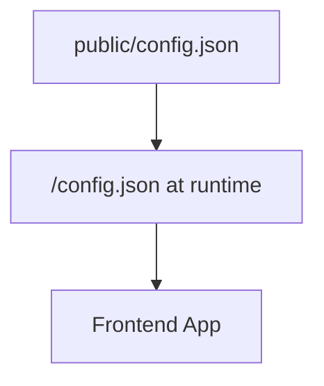

**Diagram sources**
- [public/config.json:1-4](file://watcher-web/public/config.json#L1-L4)
- [vite.config.ts:15](file://watcher-web/vite.config.ts#L15)

**Section sources**
- [public/config.json:1-4](file://watcher-web/public/config.json#L1-L4)
- [vite.config.ts:15](file://watcher-web/vite.config.ts#L15)

### Environment-Specific Configurations
- Runtime HTTP client reads the base URL from import.meta.env.VITE_BASE_URL
- The public config.json provides a default backend URL value
- The main entry initializes analytics and mounts the app

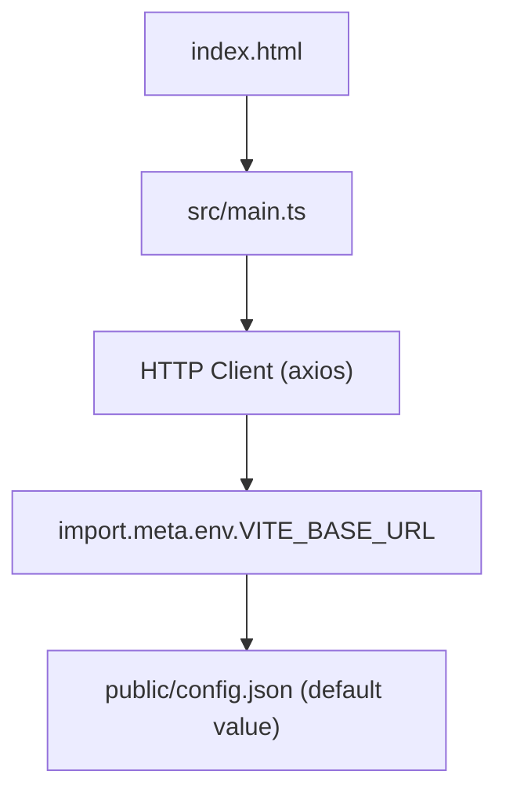

**Diagram sources**
- [index.html:10-14](file://watcher-web/index.html#L10-L14)
- [src/main.ts:20-23](file://watcher-web/src/main.ts#L20-L23)
- [src/utils/system/request.ts:8-11](file://watcher-web/src/utils/system/request.ts#L8-L11)
- [public/config.json:1-4](file://watcher-web/public/config.json#L1-L4)

**Section sources**
- [src/utils/system/request.ts:8-11](file://watcher-web/src/utils/system/request.ts#L8-L11)
- [public/config.json:1-4](file://watcher-web/public/config.json#L1-L4)
- [src/main.ts:20-23](file://watcher-web/src/main.ts#L20-L23)
- [index.html:10-14](file://watcher-web/index.html#L10-L14)

### Build Optimization Settings
- Output directory: dist
- Manual chunking: the echarts library is split into its own chunk to improve caching and load performance
- Base path: "./" ensures assets resolve correctly when hosted under a subpath

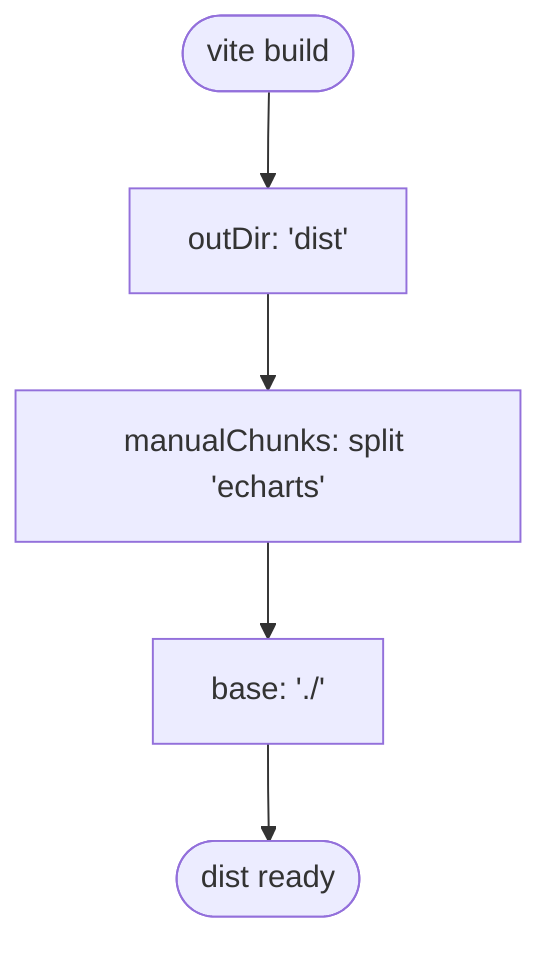

**Diagram sources**
- [vite.config.ts:35-44](file://watcher-web/vite.config.ts#L35-L44)

**Section sources**
- [vite.config.ts:35-44](file://watcher-web/vite.config.ts#L35-L44)

### Production Build and Preview
- Production build script generates optimized bundles in dist
- Staging build script supports a separate staging mode
- Preview script serves the built assets locally for verification

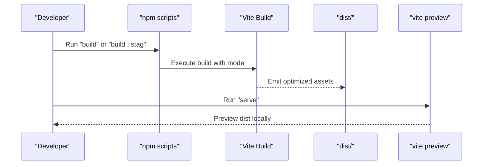

**Diagram sources**
- [package.json:7-9](file://watcher-web/package.json#L7-L9)

**Section sources**
- [package.json:7-9](file://watcher-web/package.json#L7-L9)

### Plugin Integration
- @vitejs/plugin-vue is enabled for Vue SFC support
- vite-plugin-mock is available for mock APIs in development and can be wired for production via setupProdMockServer

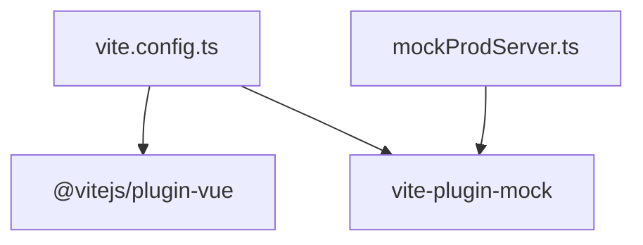

**Diagram sources**
- [vite.config.ts:45-47](file://watcher-web/vite.config.ts#L45-L47)
- [mockProdServer.ts:8-16](file://watcher-web/mockProdServer.ts#L8-L16)

**Section sources**
- [vite.config.ts:45-47](file://watcher-web/vite.config.ts#L45-L47)
- [mockProdServer.ts:8-16](file://watcher-web/mockProdServer.ts#L8-L16)

## Dependency Analysis
- Vite configuration depends on:
  - Path alias for imports
  - Dev server and proxy for API routing
  - Build outputs and chunking strategy
  - Plugins for Vue SFC support
- Runtime HTTP client depends on environment variables and public config.json
- Mock server depends on vite-plugin-mock and individual mock modules

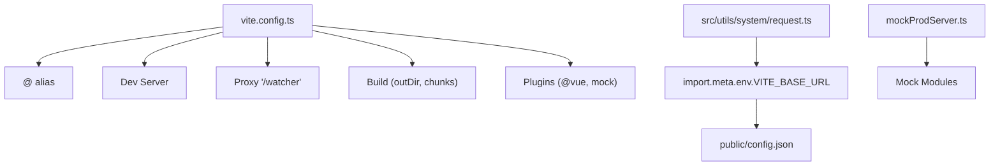

**Diagram sources**
- [vite.config.ts:13-49](file://watcher-web/vite.config.ts#L13-L49)
- [src/utils/system/request.ts:8-11](file://watcher-web/src/utils/system/request.ts#L8-L11)
- [public/config.json:1-4](file://watcher-web/public/config.json#L1-L4)
- [mockProdServer.ts:8-16](file://watcher-web/mockProdServer.ts#L8-L16)

**Section sources**
- [vite.config.ts:13-49](file://watcher-web/vite.config.ts#L13-L49)
- [src/utils/system/request.ts:8-11](file://watcher-web/src/utils/system/request.ts#L8-L11)
- [public/config.json:1-4](file://watcher-web/public/config.json#L1-L4)
- [mockProdServer.ts:8-16](file://watcher-web/mockProdServer.ts#L8-L16)

## Performance Considerations
- Splitting heavy libraries (e.g., echarts) into dedicated chunks improves caching and reduces initial bundle size
- Using a relative base path ("./") ensures assets remain functional when deployed under subpaths
- Keeping the dev server bound to 0.0.0.0 enables external access when needed
- Consider enabling code splitting for large vendor libraries and lazy-loading routes/components
- Use the preview command to validate production builds locally before deployment

[No sources needed since this section provides general guidance]

## Troubleshooting Guide
- Proxy not working
  - Verify the proxy target matches the backend address and port
  - Confirm the proxy path prefix aligns with frontend API calls
- Mock endpoints not active
  - Ensure vite-plugin-mock is present in plugins
  - Confirm mock modules are exported and aggregated by setupProdMockServer
- Incorrect asset paths after build
  - Check base path setting and ensure public assets are placed correctly
- Environment variable not applied
  - Confirm VITE_BASE_URL is set appropriately for the selected mode
  - Validate that public/config.json defaults are acceptable or overridden

**Section sources**
- [vite.config.ts:27-33](file://watcher-web/vite.config.ts#L27-L33)
- [vite.config.ts:45-47](file://watcher-web/vite.config.ts#L45-L47)
- [mockProdServer.ts:8-16](file://watcher-web/mockProdServer.ts#L8-L16)
- [src/utils/system/request.ts:8-11](file://watcher-web/src/utils/system/request.ts#L8-L11)

## Conclusion
The watcher-web build system leverages Vite for fast development, flexible proxying, and efficient production builds. With a clear alias configuration, proxy setup, and chunking strategy, it balances developer productivity and runtime performance. The mock server and environment-driven HTTP client enable smooth development and testing workflows. Following the deployment preparation steps and performance recommendations will help maintain a robust and scalable frontend build.

[No sources needed since this section summarizes without analyzing specific files]

## Appendices

### Package Scripts Reference
- dev: Starts the Vite development server
- start: Starts the Vite development server with host binding
- build: Produces an optimized production build
- build:staging: Produces a staging build
- serve: Previews the production build locally

**Section sources**
- [package.json:4-10](file://watcher-web/package.json#L4-L10)

### Environment Variables Reference
- VITE_BASE_URL: Used by the HTTP client to determine the backend base URL at runtime

**Section sources**
- [src/utils/system/request.ts:8-11](file://watcher-web/src/utils/system/request.ts#L8-L11)

### TypeScript Path Aliases
- @/* resolves to src/*

**Section sources**
- [tsconfig.json:15-17](file://watcher-web/tsconfig.json#L15-L17)