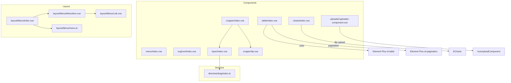
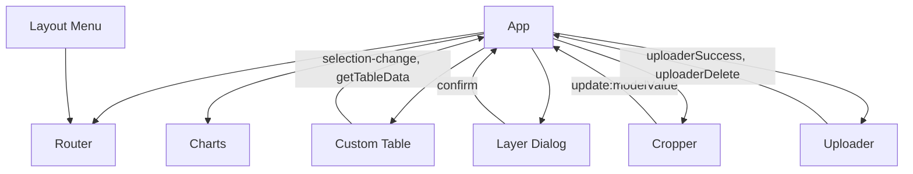
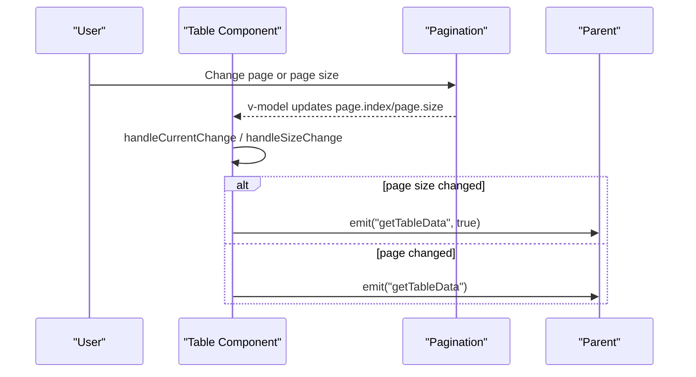
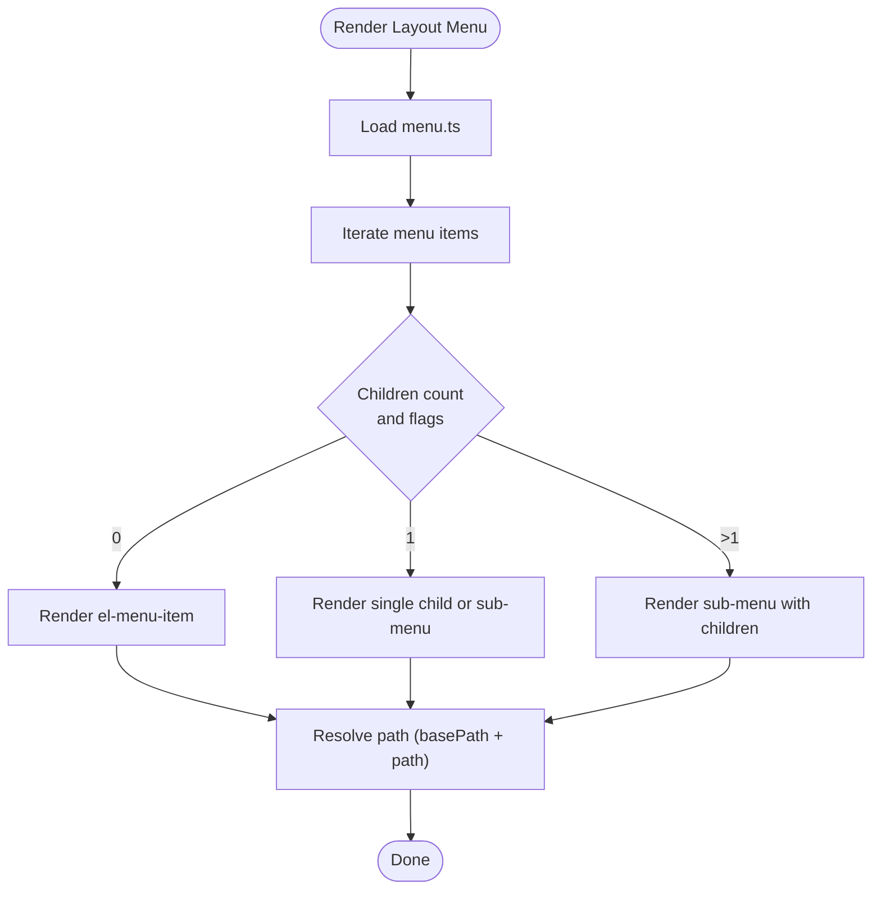
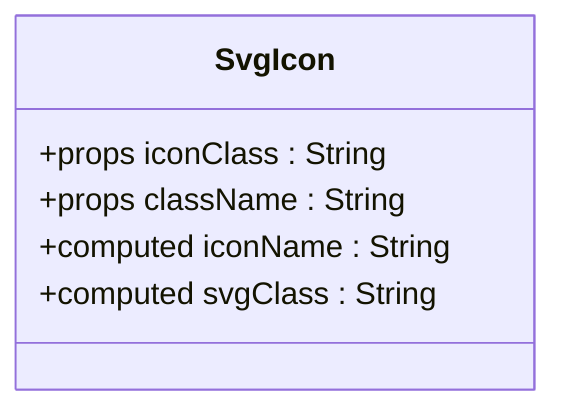
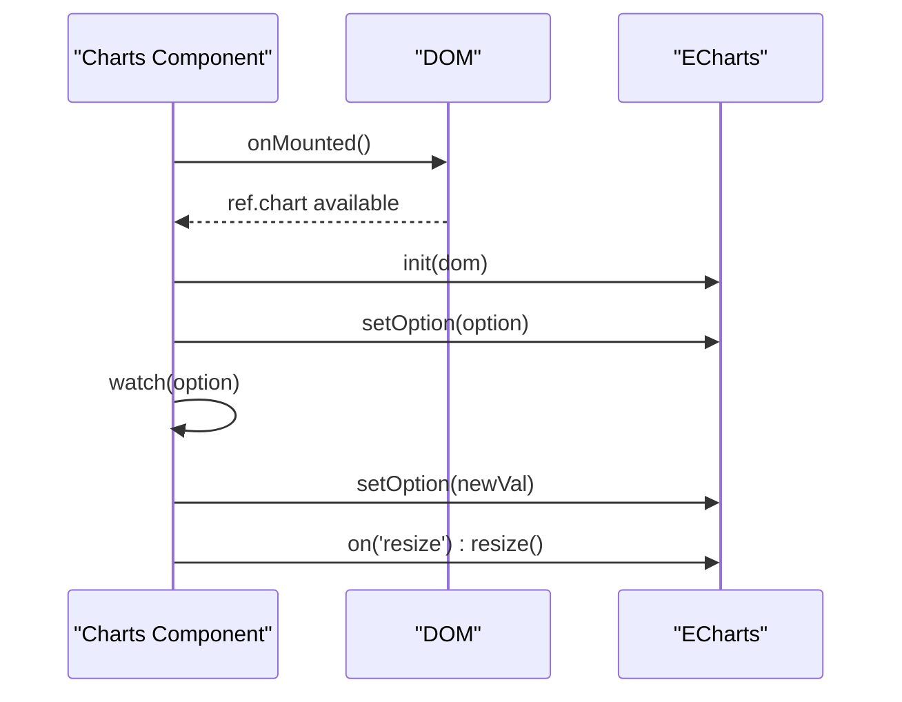
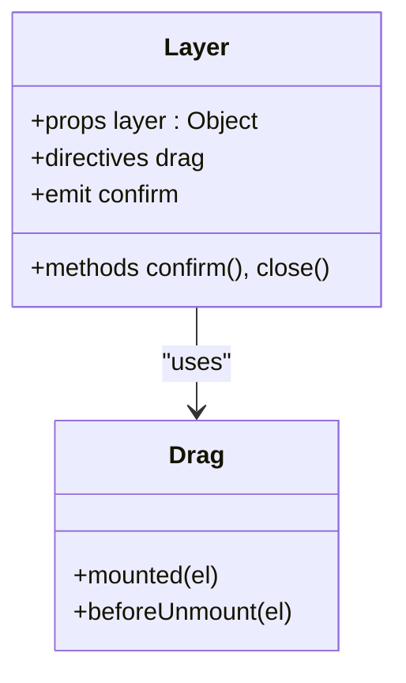
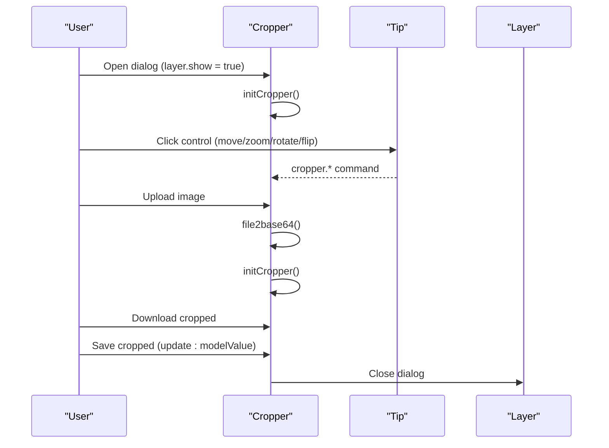
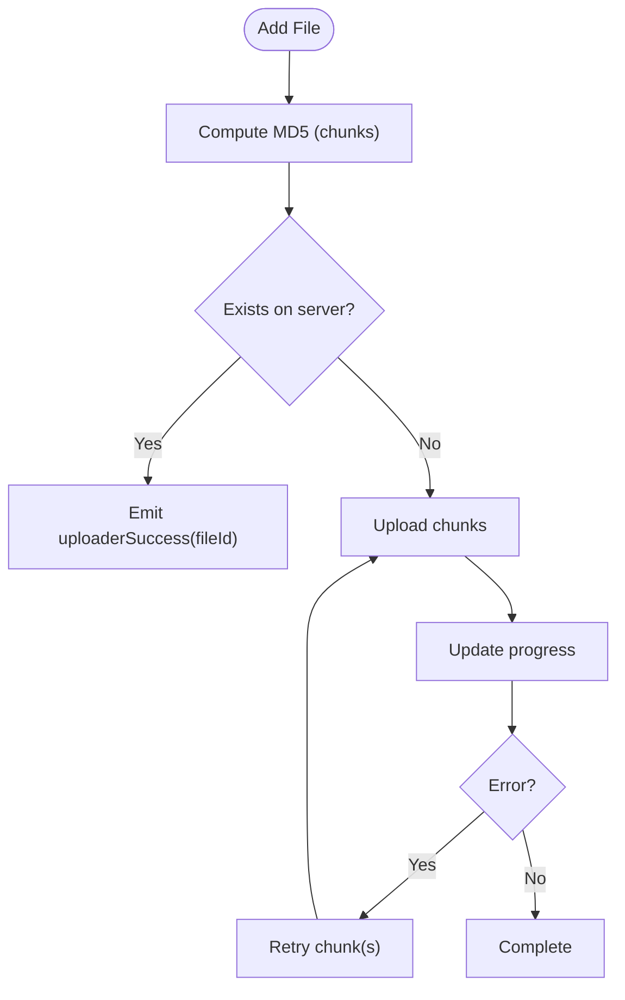
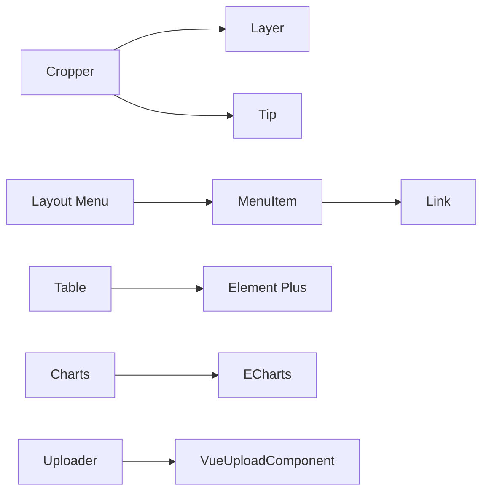

# Component Library

<cite>
**Referenced Files in This Document**
- [index.vue](file://watcher-web/src/components/table/index.vue)
- [type.ts](file://watcher-web/src/components/table/type.ts)
- [index.vue](file://watcher-web/src/components/menu/index.vue)
- [index.vue](file://watcher-web/src/components/svgIcon/index.vue)
- [index.vue](file://watcher-web/src/components/charts/index.vue)
- [index.vue](file://watcher-web/src/layout/Menu/index.vue)
- [menu.ts](file://watcher-web/src/layout/Menu/menu.ts)
- [MenuItem.vue](file://watcher-web/src/layout/Menu/MenuItem.vue)
- [Link.vue](file://watcher-web/src/layout/Menu/Link.vue)
- [uploader-component.vue](file://watcher-web/src/components/uploader/uploader-component.vue)
- [index.vue](file://watcher-web/src/components/layer/index.vue)
- [index.vue](file://watcher-web/src/components/cropper/index.vue)
- [tip.vue](file://watcher-web/src/components/cropper/tip.vue)
- [index.ts](file://watcher-web/src/directive/drag/index.ts)
</cite>

## Table of Contents
1. [Introduction](#introduction)
2. [Project Structure](#project-structure)
3. [Core Components](#core-components)
4. [Architecture Overview](#architecture-overview)
5. [Detailed Component Analysis](#detailed-component-analysis)
6. [Dependency Analysis](#dependency-analysis)
7. [Performance Considerations](#performance-considerations)
8. [Troubleshooting Guide](#troubleshooting-guide)
9. [Conclusion](#conclusion)
10. [Appendices](#appendices)

## Introduction
This document describes the custom component library and reusable UI components used in the watcher-web project. It focuses on component architecture, prop definitions, event handling, slot usage patterns, and practical integration guidelines. Special emphasis is placed on:
- The table component with selection, pagination, and layout handling
- The menu system and SVG icon integration
- Chart components for data visualization
- Composition patterns, prop validation, defaults, styling, responsiveness, and accessibility

## Project Structure
The component library resides under watcher-web/src/components and watcher-web/src/layout. Key areas:
- Components: table, menu, svgIcon, charts, layer, cropper, uploader
- Layout: Menu subsystem (index, MenuItem, Link) and menu configuration
- Directives: drag directive for dialogs

**Diagram sources**
- [index.vue:1-133](file://watcher-web/src/components/table/index.vue#L1-L133)
- [index.vue:1-12](file://watcher-web/src/components/menu/index.vue#L1-L12)
- [index.vue:1-42](file://watcher-web/src/components/svgIcon/index.vue#L1-L42)
- [index.vue:1-47](file://watcher-web/src/components/charts/index.vue#L1-L47)
- [index.vue:1-132](file://watcher-web/src/layout/Menu/index.vue#L1-L132)
- [MenuItem.vue:1-99](file://watcher-web/src/layout/Menu/MenuItem.vue#L1-L99)
- [Link.vue:1-41](file://watcher-web/src/layout/Menu/Link.vue#L1-L41)
- [menu.ts:1-84](file://watcher-web/src/layout/Menu/menu.ts#L1-L84)
- [index.vue:1-84](file://watcher-web/src/components/layer/index.vue#L1-L84)
- [index.vue:1-173](file://watcher-web/src/components/cropper/index.vue#L1-L173)
- [tip.vue:1-82](file://watcher-web/src/components/cropper/tip.vue#L1-L82)
- [index.ts:1-120](file://watcher-web/src/directive/drag/index.ts#L1-L120)

**Section sources**
- [index.vue:1-133](file://watcher-web/src/components/table/index.vue#L1-L133)
- [index.vue:1-12](file://watcher-web/src/components/menu/index.vue#L1-L12)
- [index.vue:1-42](file://watcher-web/src/components/svgIcon/index.vue#L1-L42)
- [index.vue:1-47](file://watcher-web/src/components/charts/index.vue#L1-L47)
- [index.vue:1-132](file://watcher-web/src/layout/Menu/index.vue#L1-L132)
- [MenuItem.vue:1-99](file://watcher-web/src/layout/Menu/MenuItem.vue#L1-L99)
- [Link.vue:1-41](file://watcher-web/src/layout/Menu/Link.vue#L1-L41)
- [menu.ts:1-84](file://watcher-web/src/layout/Menu/menu.ts#L1-L84)
- [index.vue:1-84](file://watcher-web/src/components/layer/index.vue#L1-L84)
- [index.vue:1-173](file://watcher-web/src/components/cropper/index.vue#L1-L173)
- [tip.vue:1-82](file://watcher-web/src/components/cropper/tip.vue#L1-L82)
- [index.ts:1-120](file://watcher-web/src/directive/drag/index.ts#L1-L120)

## Core Components
This section summarizes the primary reusable components and their responsibilities.

- Table component
  - Purpose: Wraps Element Plus table with selection, index numbering, slots, and pagination.
  - Key props: data, select, showIndex, showSelection, showPage, hasStripe, hasBorder, page, pageLayout, pageSizes.
  - Events: selection-change, getTableData (emitted on pagination/page size change).
  - Slots: default slot for column definitions.
  - Pagination: controlled via page object and emits getTableData to refresh data.

- Menu system
  - Layout menu: renders a scrollable menu tree, binds active state, collapse state, and theme variables.
  - Menu items: render nested menus and links, resolve paths, and support icons.
  - Menu configuration: centralized menu.ts defines routes and metadata.

- SVG icon integration
  - Component: renders an SVG use element bound to a dynamically constructed icon name.
  - Props: iconClass (required), className (optional).
  - Accessibility: aria-hidden applied to the SVG.

- Charts
  - Component: initializes ECharts on mount, watches option updates, and handles resize events.
  - Props: option (object).
  - Integration: supports all ECharts chart types via option.

- Layer (Dialog wrapper)
  - Purpose: wraps Element Plus dialog with optional footer buttons and drag directive.
  - Props: layer (object with show, title, showButton, width, and extra props).
  - Events: confirm emitted on confirmation button click.

- Cropper
  - Purpose: image cropping dialog with live preview, upload, download, and save actions.
  - Props: layer (required), modelValue (String).
  - Subcomponents: Layer, Tip (controls).

- Uploader
  - Purpose: file upload with chunking, MD5 pre-check, resume, and progress.
  - Props: uploadedList (Array).
  - Events: uploaderSuccess, uploaderDelete.

**Section sources**
- [index.vue:44-98](file://watcher-web/src/components/table/index.vue#L44-L98)
- [type.ts:1-5](file://watcher-web/src/components/table/type.ts#L1-L5)
- [index.vue:1-132](file://watcher-web/src/layout/Menu/index.vue#L1-L132)
- [MenuItem.vue:1-99](file://watcher-web/src/layout/Menu/MenuItem.vue#L1-L99)
- [menu.ts:1-84](file://watcher-web/src/layout/Menu/menu.ts#L1-L84)
- [index.vue:1-42](file://watcher-web/src/components/svgIcon/index.vue#L1-L42)
- [index.vue:1-47](file://watcher-web/src/components/charts/index.vue#L1-L47)
- [index.vue:1-84](file://watcher-web/src/components/layer/index.vue#L1-L84)
- [index.vue:1-173](file://watcher-web/src/components/cropper/index.vue#L1-L173)
- [tip.vue:1-82](file://watcher-web/src/components/cropper/tip.vue#L1-L82)
- [uploader-component.vue:1-521](file://watcher-web/src/components/uploader/uploader-component.vue#L1-L521)

## Architecture Overview
The component library follows a layered pattern:
- Presentation layer: reusable components (table, menu, charts, layer, cropper, uploader)
- Layout layer: menu navigation and routing integration
- Utility layer: directives (drag), icons, and configuration

**Diagram sources**
- [index.vue:61-98](file://watcher-web/src/components/table/index.vue#L61-L98)
- [index.vue:59-73](file://watcher-web/src/components/layer/index.vue#L59-L73)
- [index.vue:60-136](file://watcher-web/src/components/cropper/index.vue#L60-L136)
- [uploader-component.vue:170-409](file://watcher-web/src/components/uploader/uploader-component.vue#L170-L409)
- [index.vue:36-58](file://watcher-web/src/layout/Menu/index.vue#L36-L58)

## Detailed Component Analysis

### Table Component
- Purpose: A thin wrapper around Element Plus table offering selection, index numbering, slots, and pagination.
- Props and defaults:
  - data: Array default []
  - select: Array default []
  - showIndex: Boolean default false
  - showSelection: Boolean default false
  - showPage: Boolean default true
  - hasStripe: Boolean default true
  - hasBorder: Boolean default false
  - page: Object default { index: 1, size: 20, total: 0 }
  - pageLayout: String default "total, sizes, prev, pager, next, jumper"
  - pageSizes: Array default [5, 10, 20, 50, 100]
- Events:
  - selection-change(val): emitted with selected rows
  - getTableData(flag?): emitted when pagination or page size changes
- Slots:
  - default slot for defining columns
- Pagination behavior:
  - Current page and page size are reactive; changing either triggers getTableData
  - A small debounce-like mechanism prevents rapid successive requests
- Keep-alive compatibility:
  - Uses onActivated to trigger doLayout for proper rendering after cache restoration

**Diagram sources**
- [index.vue:61-98](file://watcher-web/src/components/table/index.vue#L61-L98)

**Section sources**
- [index.vue:1-133](file://watcher-web/src/components/table/index.vue#L1-L133)
- [type.ts:1-5](file://watcher-web/src/components/table/type.ts#L1-L5)

### Menu System
- Layout menu:
  - Renders Element Plus menu with collapse state, active highlight, and theme CSS variables.
  - Uses a local loading state during initialization and subscribes to an event bus.
- Menu items:
  - Supports three rendering modes based on children count and flags.
  - Resolves nested paths considering basePath and handles router-link vs sub-menu rendering.
- Menu configuration:
  - Centralized menu.ts defines top-level routes, redirects, and localized titles.

**Diagram sources**
- [index.vue:1-132](file://watcher-web/src/layout/Menu/index.vue#L1-L132)
- [MenuItem.vue:50-85](file://watcher-web/src/layout/Menu/MenuItem.vue#L50-L85)
- [menu.ts:1-84](file://watcher-web/src/layout/Menu/menu.ts#L1-L84)

**Section sources**
- [index.vue:1-132](file://watcher-web/src/layout/Menu/index.vue#L1-L132)
- [MenuItem.vue:1-99](file://watcher-web/src/layout/Menu/MenuItem.vue#L1-L99)
- [Link.vue:1-41](file://watcher-web/src/layout/Menu/Link.vue#L1-L41)
- [menu.ts:1-84](file://watcher-web/src/layout/Menu/menu.ts#L1-L84)

### SVG Icon Integration
- Props:
  - iconClass: String (required)
  - className: String (optional)
- Behavior:
  - Constructs xlink:href="#icon-{iconClass}"
  - Computes dynamic class names combining "svg-icon" and optional className
- Accessibility:
  - Sets aria-hidden="true" on the SVG element

**Diagram sources**
- [index.vue:1-42](file://watcher-web/src/components/svgIcon/index.vue#L1-L42)

**Section sources**
- [index.vue:1-42](file://watcher-web/src/components/svgIcon/index.vue#L1-L42)

### Charts Component
- Props:
  - option: Object (ECharts option)
- Lifecycle:
  - Initializes ECharts instance on mount
  - Watches option changes and updates chart
  - Listens to window resize and resizes chart accordingly
- Integration:
  - Full ECharts ecosystem supported via option object

**Diagram sources**
- [index.vue:19-36](file://watcher-web/src/components/charts/index.vue#L19-L36)

**Section sources**
- [index.vue:1-47](file://watcher-web/src/components/charts/index.vue#L1-L47)

### Layer (Dialog Wrapper)
- Props:
  - layer: Object (required)
    - show: Boolean
    - title: String
    - showButton: Boolean
    - width: String
    - other props passed to dialog
- Events:
  - confirm: emitted on confirm button click
- Directive:
  - Uses drag directive for draggable dialog header
- Footer:
  - Conditionally renders primary and cancel buttons when showButton is true

**Diagram sources**
- [index.vue:1-84](file://watcher-web/src/components/layer/index.vue#L1-L84)
- [index.ts:1-120](file://watcher-web/src/directive/drag/index.ts#L1-L120)

**Section sources**
- [index.vue:1-84](file://watcher-web/src/components/layer/index.vue#L1-L84)
- [index.ts:1-120](file://watcher-web/src/directive/drag/index.ts#L1-L120)

### Cropper Component
- Props:
  - layer: Object (required)
  - modelValue: String (default empty)
- Behavior:
  - Initializes cropperjs on image load
  - Provides controls via Tip component (move, zoom, rotate, flip)
  - Supports upload, download cropped image, and saving to modelValue
- Composition:
  - Uses Layer for dialog and Tip for controls

**Diagram sources**
- [index.vue:60-136](file://watcher-web/src/components/cropper/index.vue#L60-L136)
- [tip.vue:23-56](file://watcher-web/src/components/cropper/tip.vue#L23-L56)

**Section sources**
- [index.vue:1-173](file://watcher-web/src/components/cropper/index.vue#L1-L173)
- [tip.vue:1-82](file://watcher-web/src/components/cropper/tip.vue#L1-L82)

### Uploader Component
- Props:
  - uploadedList: Array default []
- Features:
  - Chunked uploads with configurable chunk size and retries
  - Pre-upload MD5 computation and deduplication check
  - Resume/pause/retry/cancel per file
  - Progress bars and status indicators
  - Emits uploaderSuccess and uploaderDelete events
- Options:
  - Configurable target endpoint, headers, and processing hooks

**Diagram sources**
- [uploader-component.vue:170-409](file://watcher-web/src/components/uploader/uploader-component.vue#L170-L409)

**Section sources**
- [uploader-component.vue:1-521](file://watcher-web/src/components/uploader/uploader-component.vue#L1-L521)

## Dependency Analysis
- Component coupling:
  - Cropper depends on Layer and Tip
  - Layout menu depends on MenuItem and Link
  - Table depends on Element Plus components
  - Charts depends on ECharts
  - Uploader depends on VueUploadComponent and external APIs
- Cohesion:
  - Each component encapsulates a single responsibility (table, menu, charts, dialog, cropper, uploader)
- External integrations:
  - Element Plus for UI primitives
  - ECharts for visualization
  - VueUploadComponent for file handling
  - cropperjs for image editing

**Diagram sources**
- [index.vue:30-44](file://watcher-web/src/components/cropper/index.vue#L30-L44)
- [MenuItem.vue:32-49](file://watcher-web/src/layout/Menu/MenuItem.vue#L32-L49)
- [index.vue:3-21](file://watcher-web/src/components/table/index.vue#L3-L21)
- [index.vue:13-14](file://watcher-web/src/components/charts/index.vue#L13-L14)
- [uploader-component.vue:136-161](file://watcher-web/src/components/uploader/uploader-component.vue#L136-L161)

**Section sources**
- [index.vue:1-173](file://watcher-web/src/components/cropper/index.vue#L1-L173)
- [MenuItem.vue:1-99](file://watcher-web/src/layout/Menu/MenuItem.vue#L1-L99)
- [index.vue:1-133](file://watcher-web/src/components/table/index.vue#L1-L133)
- [index.vue:1-47](file://watcher-web/src/components/charts/index.vue#L1-L47)
- [uploader-component.vue:1-521](file://watcher-web/src/components/uploader/uploader-component.vue#L1-L521)

## Performance Considerations
- Table pagination
  - Debounce-like behavior reduces rapid re-fetches; ensure parent handlers are efficient and avoid unnecessary deep watchers.
- Charts
  - Resize listener is lightweight; avoid frequent option updates to prevent excessive re-renders.
- Uploader
  - Chunk size and simultaneous uploads are configurable; adjust for network conditions to balance throughput and stability.
- Cropper
  - Canvas generation can be expensive; limit max dimensions and avoid repeated conversions.
- Layer drag
  - Event listeners are removed on unmount; ensure dialogs are properly closed to prevent leaks.

[No sources needed since this section provides general guidance]

## Troubleshooting Guide
- Table does not update after navigation with keep-alive
  - Cause: Layout not recalculated after cache restore.
  - Fix: The component triggers doLayout on activation; ensure the table ref exists and the component is rendered inside a keep-alive boundary.
  - Section sources
    - [index.vue:87-90](file://watcher-web/src/components/table/index.vue#L87-L90)

- Pagination emits unexpected getTableData calls
  - Cause: Page size change resets index and triggers fetch.
  - Fix: Handle the flag parameter in getTableData to differentiate size-change from page-change in parent logic.
  - Section sources
    - [index.vue:73-82](file://watcher-web/src/components/table/index.vue#L73-L82)

- Menu highlights wrong active item
  - Cause: Active path resolution logic relies on route meta.activeMenu or path.
  - Fix: Set meta.activeMenu in route definitions when the active item differs from the current path.
  - Section sources
    - [index.vue:36-44](file://watcher-web/src/layout/Menu/index.vue#L36-L44)

- SVG icon not rendering
  - Cause: Missing or incorrect iconClass.
  - Fix: Ensure iconClass matches the expected #icon-{name} and the icon asset is registered.
  - Section sources
    - [index.vue:20-31](file://watcher-web/src/components/svgIcon/index.vue#L20-L31)

- Cropper controls not working
  - Cause: cropperjs instance not initialized or image not loaded.
  - Fix: Verify layer.show triggers initCropper and image src is set before interacting.
  - Section sources
    - [index.vue:74-82](file://watcher-web/src/components/cropper/index.vue#L74-L82)

- Uploader shows MD5 computation but no progress
  - Cause: MD5 computation pauses upload until completion.
  - Fix: Ensure file.resume() is called after MD5 is ready and progress bars reflect chunk uploads.
  - Section sources
    - [uploader-component.vue:280-331](file://watcher-web/src/components/uploader/uploader-component.vue#L280-L331)

## Conclusion
The component library provides a cohesive set of reusable UI elements:
- A flexible table with selection, pagination, and slots
- A robust menu system with nested routing and theming
- An SVG icon component for scalable iconography
- A universal chart component powered by ECharts
- A dialog wrapper with drag capability
- A cropper with live preview and controls
- A chunked uploader with MD5 pre-check and resume

These components emphasize composability, clear prop/event contracts, and accessibility-friendly markup. They integrate seamlessly with Element Plus and third-party libraries while maintaining consistent styling and behavior.

[No sources needed since this section summarizes without analyzing specific files]

## Appendices

### Component Composition Patterns
- Slot-based column definition in Table
- Conditional rendering in Menu based on children and flags
- Event-driven communication (selection-change, getTableData, confirm, uploaderSuccess)
- Reactive props with watchers for dynamic updates (Charts option, Uploader options)

**Section sources**
- [index.vue:1-37](file://watcher-web/src/components/table/index.vue#L1-L37)
- [MenuItem.vue:1-30](file://watcher-web/src/layout/Menu/MenuItem.vue#L1-L30)
- [index.vue:19-36](file://watcher-web/src/components/charts/index.vue#L19-L36)
- [uploader-component.vue:170-231](file://watcher-web/src/components/uploader/uploader-component.vue#L170-L231)

### Prop Validation and Defaults
- Strongly typed props with explicit defaults for primitive types
- Object props validated via typeof checks and default factories
- Required props clearly marked (e.g., iconClass, layer)

**Section sources**
- [index.vue:10-19](file://watcher-web/src/components/svgIcon/index.vue#L10-L19)
- [index.vue:43-55](file://watcher-web/src/components/layer/index.vue#L43-L55)
- [index.vue:45-59](file://watcher-web/src/components/cropper/index.vue#L45-L59)

### Styling and Responsive Design
- Scoped styles with SCSS for component isolation
- CSS custom properties for theming (menu background/text/active colors)
- Flex layouts and responsive widths for uploader and cropper containers
- Deep selectors for Element Plus overrides

**Section sources**
- [index.vue:101-133](file://watcher-web/src/components/table/index.vue#L101-L133)
- [index.vue:62-131](file://watcher-web/src/layout/Menu/index.vue#L62-L131)
- [index.vue:412-520](file://watcher-web/src/components/uploader/uploader-component.vue#L412-L520)
- [index.vue:140-173](file://watcher-web/src/components/cropper/index.vue#L140-L173)

### Accessibility Compliance
- SVG icons use aria-hidden
- Dialogs include focusable elements and keyboard-accessible controls
- Menu items use semantic elements and localized labels
- Charts leverage ECharts accessibility features via option configuration

**Section sources**
- [index.vue:1-5](file://watcher-web/src/components/svgIcon/index.vue#L1-L5)
- [index.vue:1-17](file://watcher-web/src/layout/Menu/index.vue#L1-L17)
- [index.vue:1-8](file://watcher-web/src/components/charts/index.vue#L1-L8)