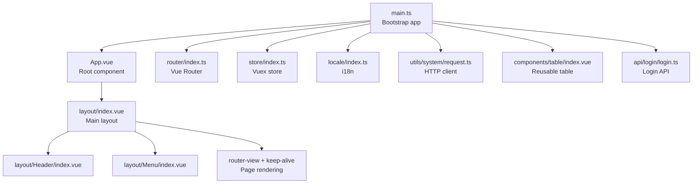
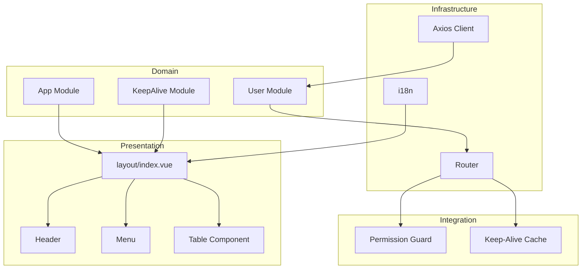
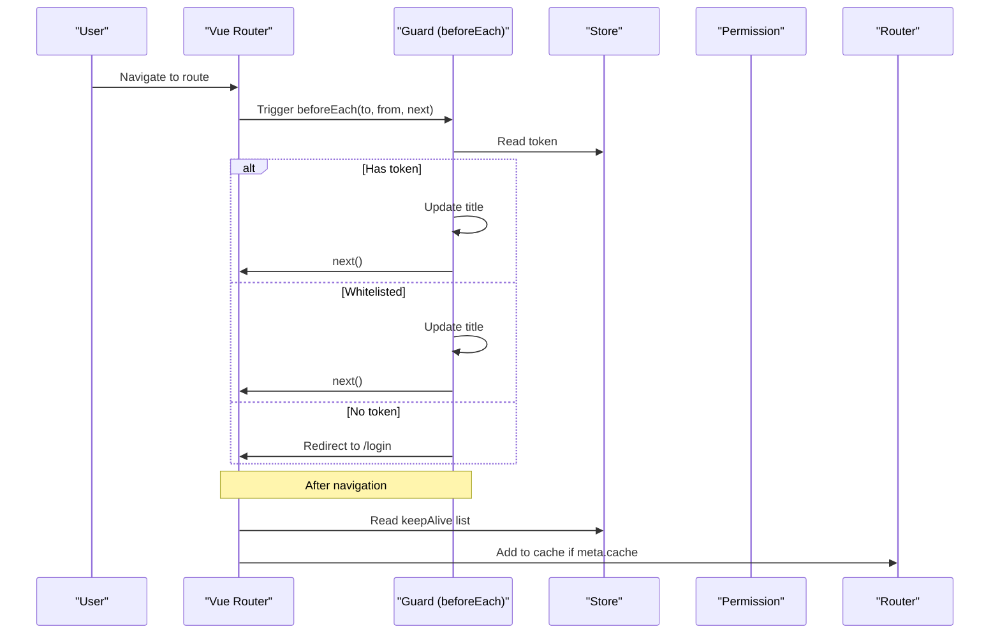
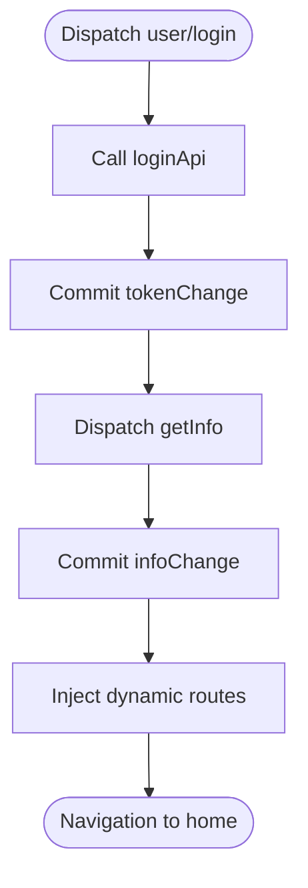
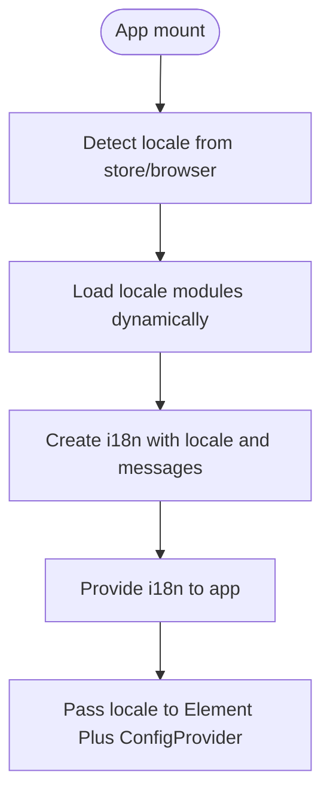
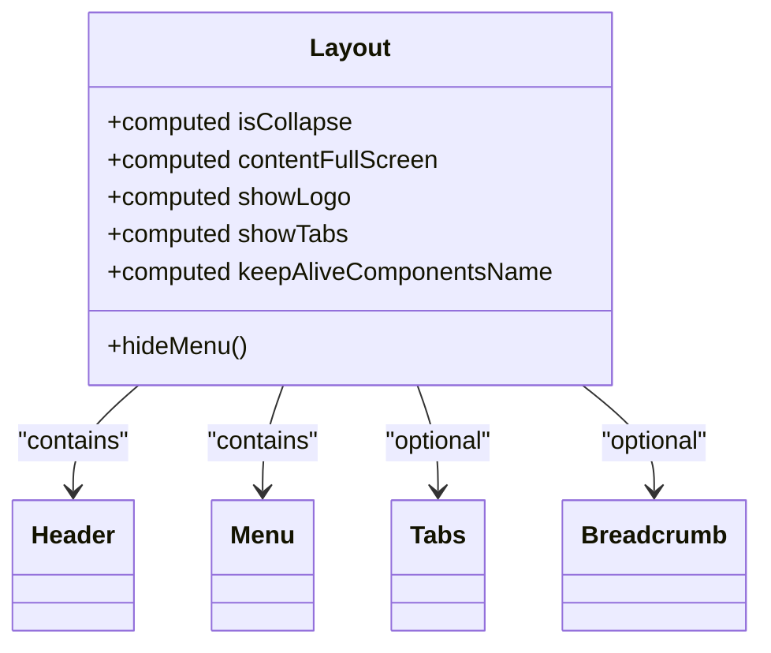
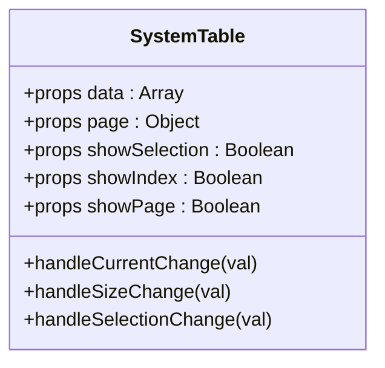
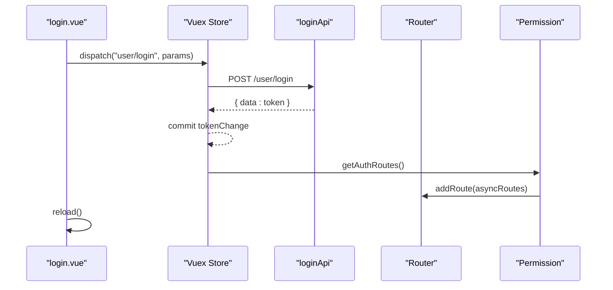
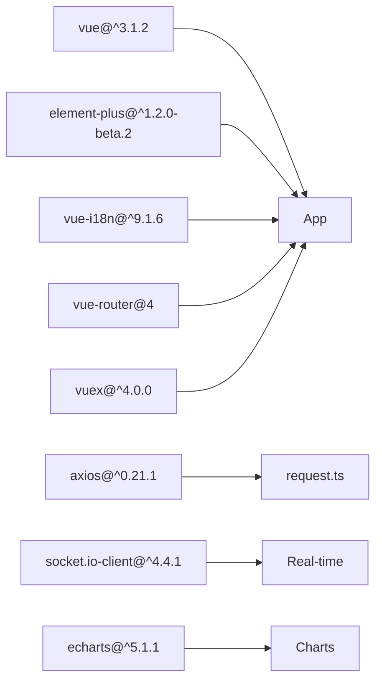

# Frontend Application

<cite>
**Referenced Files in This Document**
- [package.json](file://watcher-web/package.json)
- [vite.config.ts](file://watcher-web/vite.config.ts)
- [main.ts](file://watcher-web/src/main.ts)
- [App.vue](file://watcher-web/src/App.vue)
- [tsconfig.json](file://watcher-web/tsconfig.json)
- [router/index.ts](file://watcher-web/src/router/index.ts)
- [router/permission.ts](file://watcher-web/src/router/permission.ts)
- [router/modules/system.ts](file://watcher-web/src/router/modules/system.ts)
- [store/index.ts](file://watcher-web/src/store/index.ts)
- [store/modules/user.ts](file://watcher-web/src/store/modules/user.ts)
- [store/modules/keepAlive.ts](file://watcher-web/src/store/modules/keepAlive.ts)
- [store/modules/app.ts](file://watcher-web/src/store/modules/app.ts)
- [locale/index.ts](file://watcher-web/src/locale/index.ts)
- [locale/modules/en.ts](file://watcher-web/src/locale/modules/en.ts)
- [locale/modules/zh-cn.ts](file://watcher-web/src/locale/modules/zh-cn.ts)
- [layout/index.vue](file://watcher-web/src/layout/index.vue)
- [layout/Header/index.vue](file://watcher-web/src/layout/Header/index.vue)
- [layout/Menu/index.vue](file://watcher-web/src/layout/Menu/index.vue)
- [components/table/index.vue](file://watcher-web/src/components/table/index.vue)
- [components/table/type.ts](file://watcher-web/src/components/table/type.ts)
- [utils/system/request.ts](file://watcher-web/src/utils/system/request.ts)
- [views/system/login.vue](file://watcher-web/src/views/system/login.vue)
- [api/login/login.ts](file://watcher-web/src/api/login/login.ts)
</cite>

## Table of Contents
1. [Introduction](#introduction)
2. [Project Structure](#project-structure)
3. [Core Components](#core-components)
4. [Architecture Overview](#architecture-overview)
5. [Detailed Component Analysis](#detailed-component-analysis)
6. [Dependency Analysis](#dependency-analysis)
7. [Performance Considerations](#performance-considerations)
8. [Troubleshooting Guide](#troubleshooting-guide)
9. [Conclusion](#conclusion)
10. [Appendices](#appendices)

## Introduction
This document describes the frontend application for the Vue.js 3-based monitoring dashboard. It covers the application structure, Vue 3 Composition API usage, Element Plus integration, TypeScript configuration, routing with Vue Router, state management via Vuex, internationalization with vue-i18n, component architecture, layout system, API integration patterns, authentication flow, and real-time capabilities. It also documents build configuration, development workflow, deployment procedures, responsive design principles, accessibility considerations, and performance optimization strategies.

## Project Structure
The frontend is organized around a modular structure under the watcher-web directory:
- Application bootstrap and global configuration in src/main.ts and App.vue
- Routing under src/router with dynamic route injection and permission guards
- State management under src/store with namespaced modules
- Internationalization under src/locale with per-module message bundles
- Layout and reusable components under src/layout and src/components
- Utilities and API clients under src/utils and src/api
- Build configuration under vite.config.ts and package.json

**Diagram sources**
- [main.ts:1-37](file://watcher-web/src/main.ts#L1-L37)
- [App.vue:1-39](file://watcher-web/src/App.vue#L1-L39)
- [router/index.ts:1-73](file://watcher-web/src/router/index.ts#L1-L73)
- [store/index.ts:1-39](file://watcher-web/src/store/index.ts#L1-L39)
- [locale/index.ts:1-26](file://watcher-web/src/locale/index.ts#L1-L26)
- [layout/index.vue:1-158](file://watcher-web/src/layout/index.vue#L1-L158)
- [layout/Header/index.vue](file://watcher-web/src/layout/Header/index.vue)
- [layout/Menu/index.vue](file://watcher-web/src/layout/Menu/index.vue)
- [utils/system/request.ts:1-81](file://watcher-web/src/utils/system/request.ts#L1-L81)
- [components/table/index.vue:1-133](file://watcher-web/src/components/table/index.vue#L1-L133)
- [api/login/login.ts:1-52](file://watcher-web/src/api/login/login.ts#L1-L52)

**Section sources**
- [main.ts:1-37](file://watcher-web/src/main.ts#L1-L37)
- [App.vue:1-39](file://watcher-web/src/App.vue#L1-L39)
- [vite.config.ts:1-50](file://watcher-web/vite.config.ts#L1-L50)
- [package.json:1-72](file://watcher-web/package.json#L1-L72)
- [tsconfig.json:1-21](file://watcher-web/tsconfig.json#L1-L21)

## Core Components
- Bootstrap and plugin registration:
  - Creates the Vue app instance, registers Element Plus, Vuex, Vue Router, vue-i18n, uploader, event bus, and directives.
  - Applies global styles and theme modules.
- Root component:
  - Wraps router-view with Element Plus ConfigProvider to pass locale messages derived from i18n.
- Router:
  - Hash history, beforeEach guard checks token and whitelist, dynamic route injection via permission.ts, and keep-alive cache control.
- Store:
  - Namespaced modules for user, keepAlive, and app; persistent plugin stores selected modules.
- Internationalization:
  - Loads locale modules dynamically; sets initial locale based on browser or store; exposes fallback to Chinese.
- Layout:
  - Container with aside, header, main, optional tabs and breadcrumb; responsive aside collapse; keep-alive integration.
- Reusable components:
  - Table wrapper with selection, pagination, and slot-based column definition.
- API and HTTP client:
  - Axios instance with request/response interceptors; JWT token propagation; centralized error handling and logout on auth errors.
- Authentication:
  - Login view with form validation, Vuex action dispatch, and dynamic route injection post-login.

**Section sources**
- [main.ts:1-37](file://watcher-web/src/main.ts#L1-L37)
- [App.vue:1-39](file://watcher-web/src/App.vue#L1-L39)
- [router/index.ts:1-73](file://watcher-web/src/router/index.ts#L1-L73)
- [router/permission.ts:1-60](file://watcher-web/src/router/permission.ts#L1-L60)
- [store/index.ts:1-39](file://watcher-web/src/store/index.ts#L1-L39)
- [store/modules/user.ts:1-76](file://watcher-web/src/store/modules/user.ts#L1-L76)
- [locale/index.ts:1-26](file://watcher-web/src/locale/index.ts#L1-L26)
- [layout/index.vue:1-158](file://watcher-web/src/layout/index.vue#L1-L158)
- [components/table/index.vue:1-133](file://watcher-web/src/components/table/index.vue#L1-L133)
- [utils/system/request.ts:1-81](file://watcher-web/src/utils/system/request.ts#L1-L81)
- [views/system/login.vue:1-355](file://watcher-web/src/views/system/login.vue#L1-L355)
- [api/login/login.ts:1-52](file://watcher-web/src/api/login/login.ts#L1-L52)

## Architecture Overview
The application follows a layered architecture:
- Presentation layer: Vue 3 components, Element Plus UI, and layout system
- Domain services: Vuex modules encapsulate state and business logic
- Infrastructure: Axios client with interceptors, i18n provider, and router guards
- Integration: Dynamic route injection after login, keep-alive caching, and theme/scss modules

**Diagram sources**
- [layout/index.vue:1-158](file://watcher-web/src/layout/index.vue#L1-L158)
- [layout/Header/index.vue](file://watcher-web/src/layout/Header/index.vue)
- [layout/Menu/index.vue](file://watcher-web/src/layout/Menu/index.vue)
- [components/table/index.vue:1-133](file://watcher-web/src/components/table/index.vue#L1-L133)
- [router/index.ts:1-73](file://watcher-web/src/router/index.ts#L1-L73)
- [router/permission.ts:1-60](file://watcher-web/src/router/permission.ts#L1-L60)
- [store/modules/user.ts:1-76](file://watcher-web/src/store/modules/user.ts#L1-L76)
- [store/modules/keepAlive.ts](file://watcher-web/src/store/modules/keepAlive.ts)
- [store/modules/app.ts](file://watcher-web/src/store/modules/app.ts)
- [utils/system/request.ts:1-81](file://watcher-web/src/utils/system/request.ts#L1-L81)
- [locale/index.ts:1-26](file://watcher-web/src/locale/index.ts#L1-L26)

## Detailed Component Analysis

### Routing System and Permission Guards
- Router initialization uses hash history and loads static modules (e.g., system).
- beforeEach guard:
  - Starts progress bar, validates token, whitelists unauthenticated access, redirects unauthenticated users to login.
  - Updates page title via utility.
- Dynamic route injection:
  - permission.ts defines asyncRoutes and injects them into the router and modules array reactively.
  - getAuthRoutes triggers injection when a token exists.
- Keep-alive cache:
  - Tracks component names to cache based on route meta.cache.

**Diagram sources**
- [router/index.ts:35-68](file://watcher-web/src/router/index.ts#L35-L68)
- [router/permission.ts:54-59](file://watcher-web/src/router/permission.ts#L54-L59)
- [store/modules/keepAlive.ts](file://watcher-web/src/store/modules/keepAlive.ts)

**Section sources**
- [router/index.ts:1-73](file://watcher-web/src/router/index.ts#L1-L73)
- [router/permission.ts:1-60](file://watcher-web/src/router/permission.ts#L1-L60)
- [router/modules/system.ts](file://watcher-web/src/router/modules/system.ts)

### State Management with Vuex
- Modules:
  - user: token and info, login/getInfo actions, loginOut mutation.
  - keepAlive: cached component names for keep-alive.
  - app: UI state (size, collapse, theme, language).
- Persistence:
  - Persistent plugin configured to store selected modules locally.

**Diagram sources**
- [store/modules/user.ts:33-66](file://watcher-web/src/store/modules/user.ts#L33-L66)
- [router/permission.ts:42-49](file://watcher-web/src/router/permission.ts#L42-L49)

**Section sources**
- [store/index.ts:1-39](file://watcher-web/src/store/index.ts#L1-L39)
- [store/modules/user.ts:1-76](file://watcher-web/src/store/modules/user.ts#L1-L76)
- [store/modules/keepAlive.ts](file://watcher-web/src/store/modules/keepAlive.ts)
- [store/modules/app.ts](file://watcher-web/src/store/modules/app.ts)

### Internationalization with vue-i18n
- Dynamic message loading from locale modules.
- Initial locale detection from store/browser; fallback to Chinese.
- Root component passes locale and Element Plus locale to ConfigProvider.

**Diagram sources**
- [locale/index.ts:1-26](file://watcher-web/src/locale/index.ts#L1-L26)
- [App.vue:14-24](file://watcher-web/src/App.vue#L14-L24)

**Section sources**
- [locale/index.ts:1-26](file://watcher-web/src/locale/index.ts#L1-L26)
- [App.vue:1-39](file://watcher-web/src/App.vue#L1-L39)

### Layout System and Responsive Behavior
- Layout container with aside, header, main, and optional tabs/breadcrumb.
- Responsive aside collapse at small widths; overlay mask appears when expanded.
- Keep-alive integration caches pages based on route meta.cache.
- Header and Menu components are composed into the layout.

**Diagram sources**
- [layout/index.vue:45-102](file://watcher-web/src/layout/index.vue#L45-L102)
- [layout/Header/index.vue](file://watcher-web/src/layout/Header/index.vue)
- [layout/Menu/index.vue](file://watcher-web/src/layout/Menu/index.vue)

**Section sources**
- [layout/index.vue:1-158](file://watcher-web/src/layout/index.vue#L1-L158)

### Reusable UI Components
- Table component:
  - Props for data, selection, pagination, borders, and stripes.
  - Emits selection-change and fetch events; handles keep-alive layout recalculation.

**Diagram sources**
- [components/table/index.vue:40-98](file://watcher-web/src/components/table/index.vue#L40-L98)
- [components/table/type.ts](file://watcher-web/src/components/table/type.ts)

**Section sources**
- [components/table/index.vue:1-133](file://watcher-web/src/components/table/index.vue#L1-L133)
- [components/table/type.ts](file://watcher-web/src/components/table/type.ts)

### API Integration Patterns and Authentication Flow
- HTTP client:
  - Base URL from environment, request interceptor attaches token, response interceptor centralizes error handling and logout on auth failures.
- Login flow:
  - Validates form, dispatches user/login, receives token, injects routes, reloads.

**Diagram sources**
- [views/system/login.vue:139-169](file://watcher-web/src/views/system/login.vue#L139-L169)
- [store/modules/user.ts:33-66](file://watcher-web/src/store/modules/user.ts#L33-L66)
- [router/permission.ts:54-59](file://watcher-web/src/router/permission.ts#L54-L59)
- [api/login/login.ts:4-10](file://watcher-web/src/api/login/login.ts#L4-L10)

**Section sources**
- [utils/system/request.ts:1-81](file://watcher-web/src/utils/system/request.ts#L1-L81)
- [views/system/login.vue:1-355](file://watcher-web/src/views/system/login.vue#L1-L355)
- [api/login/login.ts:1-52](file://watcher-web/src/api/login/login.ts#L1-L52)

### Real-Time Data Updates
- The codebase integrates socket.io-client and mitt for event bus patterns. While no explicit WebSocket handler is present in the analyzed files, the presence of socket.io-client indicates potential real-time capabilities. A dedicated WebSocket service would typically:
  - Initialize connection with mitt-based event channels
  - Subscribe to topics and update Vuex store/state on incoming events
  - Provide composables to components for subscribing/unsubscribing

[No sources needed since this section provides general guidance]

## Dependency Analysis
External dependencies relevant to the frontend include Vue 3, Element Plus, vue-i18n, vue-router, vuex, axios, echarts, and socket.io-client. Build-time dependencies include Vite, TypeScript, and Sass.

**Diagram sources**
- [package.json:20-54](file://watcher-web/package.json#L20-L54)

**Section sources**
- [package.json:1-72](file://watcher-web/package.json#L1-L72)

## Performance Considerations
- Code splitting and chunking:
  - Manual chunking for heavy vendor libraries (e.g., echarts) reduces initial bundle size.
- Keep-alive caching:
  - Route meta.cache enables component reuse to avoid re-fetching data.
- Aliasing and base path:
  - Path alias @ resolves to src; base ./ ensures assets resolve correctly in production builds.
- Environment-specific behavior:
  - Non-development environments initialize analytics; development uses localhost proxy.

[No sources needed since this section provides general guidance]

## Troubleshooting Guide
- Authentication errors:
  - On 401/403, the HTTP client clears local storage/session storage and reloads the page.
- Request/response handling:
  - Centralized error messaging via Element Plus; ensure network tab shows correct backend URLs and tokens.
- Router navigation:
  - Verify token presence and whitelist entries; confirm dynamic routes were injected after login.
- i18n messages:
  - Confirm locale modules are loaded and HTML lang attribute is set.

**Section sources**
- [utils/system/request.ts:50-76](file://watcher-web/src/utils/system/request.ts#L50-L76)
- [router/index.ts:35-52](file://watcher-web/src/router/index.ts#L35-L52)
- [locale/index.ts:14-25](file://watcher-web/src/locale/index.ts#L14-L25)

## Conclusion
The frontend application leverages Vue 3 Composition API, Element Plus, and TypeScript to deliver a structured, maintainable monitoring dashboard. It integrates Vue Router for navigation and dynamic route injection, Vuex for state management with persistence, and vue-i18n for internationalization. The layout system and reusable components promote consistency and performance. The Axios-based HTTP client centralizes request/response handling, while the login flow demonstrates a clear authentication pattern. The build configuration supports efficient bundling and development workflows.

## Appendices

### Build Configuration and Scripts
- Scripts:
  - dev, start, build, build:stag, serve
- Vite configuration:
  - Alias @ to src, define i18n flags, dev server with proxy to backend, manual chunks for echarts, and Vue plugin.

**Section sources**
- [package.json:4-10](file://watcher-web/package.json#L4-L10)
- [vite.config.ts:13-48](file://watcher-web/vite.config.ts#L13-L48)

### Development Workflow
- Local development server runs on port 9090 with proxy to backend.
- TypeScript compiler options enable modern ES modules and Vue SFC support.
- Aliases simplify imports across the codebase.

**Section sources**
- [vite.config.ts:23-34](file://watcher-web/vite.config.ts#L23-L34)
- [tsconfig.json:2-18](file://watcher-web/tsconfig.json#L2-L18)

### Deployment Procedures
- Production build outputs to dist with manual chunking for vendor libraries.
- Base path configured as relative to support various deployment contexts.

**Section sources**
- [vite.config.ts:35-44](file://watcher-web/vite.config.ts#L35-L44)

### Accessibility and Responsive Design
- Responsive layout adapts aside collapse and modal overlay on small screens.
- Keep-alive improves perceived performance by avoiding redundant renders.
- Element Plus provides built-in accessibility attributes for components.

**Section sources**
- [layout/index.vue:136-156](file://watcher-web/src/layout/index.vue#L136-L156)