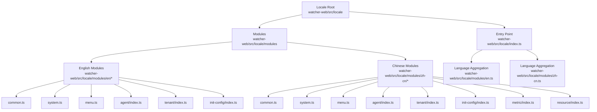
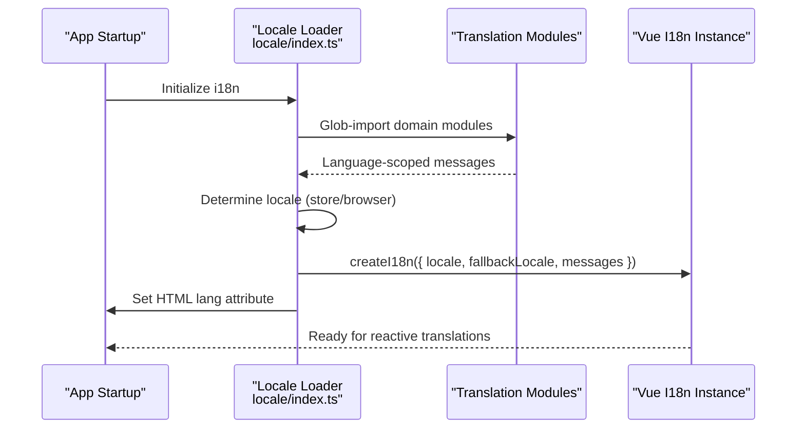
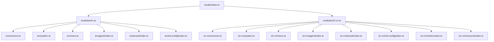

# Internationalization

<cite>
**Referenced Files in This Document**
- [index.ts](file://watcher-web/src/locale/index.ts)
- [en.ts](file://watcher-web/src/locale/modules/en.ts)
- [zh-cn.ts](file://watcher-web/src/locale/modules/zh-cn.ts)
- [common.ts](file://watcher-web/src/locale/modules/en/common.ts)
- [common.ts](file://watcher-web/src/locale/modules/zh-cn/common.ts)
- [system.ts](file://watcher-web/src/locale/modules/en/system.ts)
- [system.ts](file://watcher-web/src/locale/modules/zh-cn/system.ts)
- [menu.ts](file://watcher-web/src/locale/modules/en/menu.ts)
- [menu.ts](file://watcher-web/src/locale/modules/zh-cn/menu.ts)
- [agent/index.ts](file://watcher-web/src/locale/modules/en/agent/index.ts)
- [tenant/index.ts](file://watcher-web/src/locale/modules/zh-cn/tenant/index.ts)
- [metric/index.ts](file://watcher-web/src/locale/modules/zh-cn/metric/index.ts)
- [StringManager.java](file://watcher-sdk/src/main/java/com/virtual/cloud/om/sdk/utils/StringManager.java)
- [DateTimeTool.java](file://watcher-sdk/src/main/java/com/virtual/cloud/om/sdk/utils/DateTimeTool.java)
</cite>

## Table of Contents
1. [Introduction](#introduction)
2. [Project Structure](#project-structure)
3. [Core Components](#core-components)
4. [Architecture Overview](#architecture-overview)
5. [Detailed Component Analysis](#detailed-component-analysis)
6. [Dependency Analysis](#dependency-analysis)
7. [Performance Considerations](#performance-considerations)
8. [Troubleshooting Guide](#troubleshooting-guide)
9. [Conclusion](#conclusion)
10. [Appendices](#appendices)

## Introduction
This document explains the internationalization (i18n) system used in the frontend application. It covers configuration, locale file organization, translation key structure, English and Chinese implementations, dynamic language switching, and the locale modules for different domains (common, menu, system, tenant, metric, resource). It also documents date/time and number localization approaches used in the backend SDK, and provides guidance on pluralization, context-specific translations, and performance optimization for large translation sets.

## Project Structure
The i18n system is organized under the frontend’s locale directory. The structure groups translations by language and domain, enabling modular and maintainable translation management.

**Diagram sources**
- [index.ts:1-26](file://watcher-web/src/locale/index.ts#L1-L26)
- [en.ts:1-22](file://watcher-web/src/locale/modules/en.ts#L1-L22)
- [zh-cn.ts:1-25](file://watcher-web/src/locale/modules/zh-cn.ts#L1-L25)

**Section sources**
- [index.ts:1-26](file://watcher-web/src/locale/index.ts#L1-L26)
- [en.ts:1-22](file://watcher-web/src/locale/modules/en.ts#L1-L22)
- [zh-cn.ts:1-25](file://watcher-web/src/locale/modules/zh-cn.ts#L1-L25)

## Core Components
- Locale entry and initialization: Loads translation modules dynamically and initializes the i18n instance with a selected locale and fallback.
- Language aggregators: Combine domain-specific modules into language-scoped namespaces for Element Plus and application messages.
- Domain modules: Provide translation keys for common UI phrases, system settings, menus, and domain-specific features.

Key behaviors:
- Dynamic module loading via glob import to assemble messages per language.
- Locale selection based on store state or browser language, defaulting to Chinese if not English.
- Fallback to Chinese when a key is missing in the active locale.

**Section sources**
- [index.ts:5-22](file://watcher-web/src/locale/index.ts#L5-L22)
- [en.ts:1-22](file://watcher-web/src/locale/modules/en.ts#L1-L22)
- [zh-cn.ts:1-25](file://watcher-web/src/locale/modules/zh-cn.ts#L1-L25)

## Architecture Overview
The i18n architecture integrates Vue i18n with Element Plus locales and domain-specific translation modules. The initialization script aggregates modules and sets the HTML lang attribute for accessibility.

**Diagram sources**
- [index.ts:5-22](file://watcher-web/src/locale/index.ts#L5-L22)

## Detailed Component Analysis

### Locale Entry and Initialization
- Dynamically loads all locale modules under the modules directory.
- Builds a messages object keyed by language (e.g., en, zh-cn).
- Selects initial locale from the app store or browser language; defaults to Chinese if not English.
- Sets the HTML lang attribute for semantic correctness.
- Configures fallback locale to Chinese.

Best practices:
- Keep language keys lowercase and consistent (e.g., zh-cn).
- Ensure all domain modules are imported by the language aggregator to avoid missing keys.

**Section sources**
- [index.ts:5-22](file://watcher-web/src/locale/index.ts#L5-L22)

### English Locale Implementation
- Imports Element Plus English locale and merges it into the el field.
- Aggregates domain modules: system, common, menu, agent, tenant, init-config.
- Provides English translations for UI phrases, system settings, navigation, and domain features.

Examples of key organization:
- Common actions and prompts under a common namespace.
- System-level labels and settings under a system namespace.
- Navigation labels under a menu namespace.
- Domain-specific keys under agent, tenant, and init-config namespaces.

**Section sources**
- [en.ts:1-22](file://watcher-web/src/locale/modules/en.ts#L1-L22)
- [common.ts:1-28](file://watcher-web/src/locale/modules/en/common.ts#L1-L28)
- [system.ts:1-63](file://watcher-web/src/locale/modules/en/system.ts#L1-L63)
- [menu.ts:1-24](file://watcher-web/src/locale/modules/en/menu.ts#L1-L24)
- [agent/index.ts:1-21](file://watcher-web/src/locale/modules/en/agent/index.ts#L1-L21)

### Chinese Locale Implementation
- Imports Element Plus Chinese locale and merges it into the el field.
- Aggregates domain modules: system, common, menu, agent, tenant, init-config, resource, metric.
- Provides Chinese translations for UI phrases, system settings, navigation, and domain features.

Key differences from English:
- Additional domains such as metric and resource.
- More granular system messages and localized UI terms.

**Section sources**
- [zh-cn.ts:1-25](file://watcher-web/src/locale/modules/zh-cn.ts#L1-L25)
- [common.ts:1-71](file://watcher-web/src/locale/modules/zh-cn/common.ts#L1-L71)
- [system.ts:1-73](file://watcher-web/src/locale/modules/zh-cn/system.ts#L1-L73)
- [menu.ts:1-30](file://watcher-web/src/locale/modules/zh-cn/menu.ts#L1-L30)
- [tenant/index.ts:1-27](file://watcher-web/src/locale/modules/zh-cn/tenant/index.ts#L1-L27)
- [metric/index.ts:1-21](file://watcher-web/src/locale/modules/zh-cn/metric/index.ts#L1-L21)

### Translation Module Organization by Domain
- Common: Shared UI actions, prompts, validations, and statuses.
- System: Application-wide labels, settings, and navigation helpers.
- Menu: Top-level navigation and page group labels.
- Agent: Collection node management terminology.
- Tenant: Tenant authentication and configuration labels.
- Init-config: Initial configuration domain labels.
- Metric: Monitoring metrics and time-range labels.
- Resource: Managed resource listings and related labels.

Each domain module exports a namespaced object (e.g., common, system, menu) to align with the language aggregator’s merge strategy.

**Section sources**
- [common.ts:1-28](file://watcher-web/src/locale/modules/en/common.ts#L1-L28)
- [common.ts:1-71](file://watcher-web/src/locale/modules/zh-cn/common.ts#L1-L71)
- [system.ts:1-63](file://watcher-web/src/locale/modules/en/system.ts#L1-L63)
- [system.ts:1-73](file://watcher-web/src/locale/modules/zh-cn/system.ts#L1-L73)
- [menu.ts:1-24](file://watcher-web/src/locale/modules/en/menu.ts#L1-L24)
- [menu.ts:1-30](file://watcher-web/src/locale/modules/zh-cn/menu.ts#L1-L30)
- [agent/index.ts:1-21](file://watcher-web/src/locale/modules/en/agent/index.ts#L1-L21)
- [tenant/index.ts:1-27](file://watcher-web/src/locale/modules/zh-cn/tenant/index.ts#L1-L27)
- [metric/index.ts:1-21](file://watcher-web/src/locale/modules/zh-cn/metric/index.ts#L1-L21)

### Dynamic Language Switching
- The active locale is derived from the application store state and browser language.
- The initialization script selects either English or Chinese and applies it during i18n creation.
- To switch languages at runtime, update the store state and trigger reactivity; the i18n instance will reflect the new locale.

Guidelines:
- Ensure the store state reflects the chosen locale consistently across the app.
- Verify that all domain modules are present for the target locale to prevent missing keys.

**Section sources**
- [index.ts:14-15](file://watcher-web/src/locale/index.ts#L14-L15)

### Pluralization and Context-Specific Translations
- The frontend i18n setup does not define explicit pluralization rules or contexts in the provided files.
- For pluralization needs, consider using ICU-style message syntax or Vue i18n plural rules if extended later.
- Context-specific translations can be supported by organizing keys with contextual suffixes or nested namespaces.

Recommendations:
- Introduce plural rules and contexts in message files when requirements arise.
- Maintain consistent key naming to differentiate contexts (e.g., action vs. label).

[No sources needed since this section provides general guidance]

### Date/Time and Number Localization
While the frontend primarily handles UI text localization, the backend SDK provides utilities for date/time and number formatting that can be leveraged for localized displays.

- Date/time formatting utilities:
  - Centralized formatters and conversion helpers for consistent date-time rendering.
  - Methods to format timestamps and convert between string and numeric formats.
- Number formatting:
  - Backend uses Java’s Number formatting and MessageFormat for parameterized messages.

Integration tips:
- Use backend formatters to render localized dates/times in server-rendered content.
- For client-side number formatting, leverage JavaScript’s Intl APIs or libraries as needed.

**Section sources**
- [DateTimeTool.java:1-181](file://watcher-sdk/src/main/java/com/virtual/cloud/om/sdk/utils/DateTimeTool.java#L1-L181)
- [StringManager.java:125-219](file://watcher-sdk/src/main/java/com/virtual/cloud/om/sdk/utils/StringManager.java#L125-L219)

### Locale Loading Mechanism and Fallback Strategy
- Dynamic loading: Modules are loaded via glob import to assemble messages per language.
- Fallback: The i18n instance specifies a fallback locale to ensure messages remain readable if a key is missing in the active locale.
- HTML lang attribute: Set at initialization to improve accessibility and SEO.

Operational notes:
- Adding a new language requires:
  - Creating a new language aggregator (e.g., fr.ts) and importing domain modules.
  - Updating the initialization script to recognize the new language and include it in messages.
  - Ensuring all domain modules exist for the new locale.

**Section sources**
- [index.ts:5-22](file://watcher-web/src/locale/index.ts#L5-L22)
- [en.ts:1-22](file://watcher-web/src/locale/modules/en.ts#L1-L22)
- [zh-cn.ts:1-25](file://watcher-web/src/locale/modules/zh-cn.ts#L1-L25)

### Examples of Translation Usage in Components
- Access translations using the i18n instance initialized in the locale entry.
- Reference keys under the appropriate namespace (e.g., common, system, menu, agent, tenant, metric, resource).
- For Element Plus components, use the el field merged from the language aggregator to localize built-in UI texts.

Note: The examples below describe usage patterns without quoting code.

- Common actions and prompts:
  - Access keys under the common namespace for shared UI labels and messages.
- System settings and tabs:
  - Access keys under the system namespace for application-wide labels and tab actions.
- Menu and navigation:
  - Access keys under the menu namespace for top-level navigation and page group labels.
- Domain-specific features:
  - Access keys under agent, tenant, metric, and resource namespaces for domain-specific labels.

**Section sources**
- [common.ts:1-28](file://watcher-web/src/locale/modules/en/common.ts#L1-L28)
- [system.ts:1-63](file://watcher-web/src/locale/modules/en/system.ts#L1-L63)
- [menu.ts:1-24](file://watcher-web/src/locale/modules/en/menu.ts#L1-L24)
- [agent/index.ts:1-21](file://watcher-web/src/locale/modules/en/agent/index.ts#L1-L21)
- [tenant/index.ts:1-27](file://watcher-web/src/locale/modules/zh-cn/tenant/index.ts#L1-L27)
- [metric/index.ts:1-21](file://watcher-web/src/locale/modules/zh-cn/metric/index.ts#L1-L21)

## Dependency Analysis
The i18n system depends on:
- Vue i18n for reactive translations.
- Element Plus locales for component-level localization.
- Language aggregators to merge domain modules into language-scoped namespaces.
- Store-driven locale selection for dynamic switching.

**Diagram sources**
- [index.ts:1-26](file://watcher-web/src/locale/index.ts#L1-L26)
- [en.ts:1-22](file://watcher-web/src/locale/modules/en.ts#L1-L22)
- [zh-cn.ts:1-25](file://watcher-web/src/locale/modules/zh-cn.ts#L1-L25)

**Section sources**
- [index.ts:1-26](file://watcher-web/src/locale/index.ts#L1-L26)
- [en.ts:1-22](file://watcher-web/src/locale/modules/en.ts#L1-L22)
- [zh-cn.ts:1-25](file://watcher-web/src/locale/modules/zh-cn.ts#L1-L25)

## Performance Considerations
- Lazy loading: Consider lazy-loading locale modules on demand to reduce initial bundle size for large translation sets.
- Tree shaking: Ensure unused translation keys are removed by keeping domain modules separate and importing only required ones.
- Fallback efficiency: Minimize missing keys to reduce fallback lookups and improve perceived performance.
- Caching: Cache resolved translations per component to avoid repeated resolution during re-renders.

[No sources needed since this section provides general guidance]

## Troubleshooting Guide
Common issues and resolutions:
- Missing translations:
  - Verify that the active locale includes the required domain modules.
  - Confirm that the fallback locale contains the missing keys.
- Incorrect locale selection:
  - Ensure the store state reflects the intended locale and is reactive.
  - Check browser language detection logic and defaulting behavior.
- HTML lang attribute not set:
  - Confirm that the initialization script runs before rendering and sets the attribute on the HTML element.
- Backend localization mismatches:
  - Align frontend keys with backend message bundles and ensure consistent key naming.

**Section sources**
- [index.ts:14-22](file://watcher-web/src/locale/index.ts#L14-L22)
- [StringManager.java:125-219](file://watcher-sdk/src/main/java/com/virtual/cloud/om/sdk/utils/StringManager.java#L125-L219)

## Conclusion
The i18n system organizes translations by language and domain, supports dynamic loading and fallback, and integrates with Element Plus for component-level localization. By maintaining consistent key organization and leveraging the provided mechanisms, teams can scale localization across the application while ensuring robust fallbacks and efficient performance.

[No sources needed since this section summarizes without analyzing specific files]

## Appendices

### Adding a New Language
Steps to add a new language (e.g., French):
- Create a new language aggregator under modules (e.g., modules/fr.ts) that imports all domain modules.
- Update the initialization script to include the new language in messages and recognize it during selection.
- Ensure all domain modules exist for the new locale to avoid missing keys.
- Test dynamic switching and fallback behavior.

[No sources needed since this section provides general guidance]