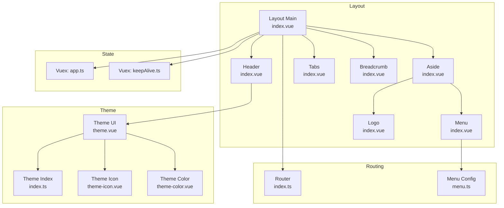
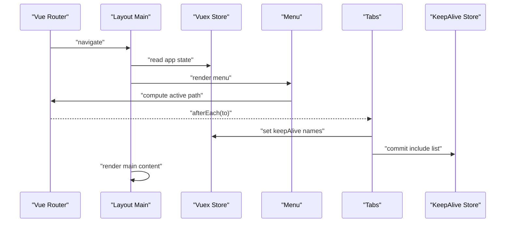
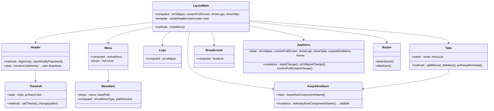
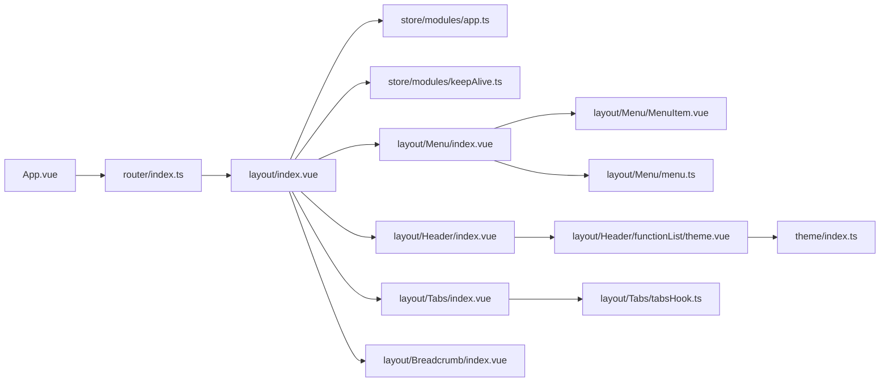

# Layout System

<cite>
**Referenced Files in This Document**
- [index.vue](file://watcher-web/src/layout/index.vue)
- [index.vue](file://watcher-web/src/layout/Header/index.vue)
- [index.vue](file://watcher-web/src/layout/Menu/index.vue)
- [index.vue](file://watcher-web/src/layout/Logo/index.vue)
- [index.vue](file://watcher-web/src/layout/Tabs/index.vue)
- [index.vue](file://watcher-web/src/layout/Breadcrumb/index.vue)
- [index.vue](file://watcher-web/src/layout/Menu/MenuItem.vue)
- [index.ts](file://watcher-web/src/layout/Menu/menu.ts)
- [index.vue](file://watcher-web/src/layout/Header/functionList/theme.vue)
- [index.ts](file://watcher-web/src/theme/index.ts)
- [index.vue](file://watcher-web/src/layout/Header/functionList/theme/theme-icon.vue)
- [index.vue](file://watcher-web/src/layout/Header/functionList/theme/theme-color.vue)
- [index.vue](file://watcher-web/src/layout/Tabs/item.vue)
- [tabsHook.ts](file://watcher-web/src/layout/Tabs/tabsHook.ts)
- [index.ts](file://watcher-web/src/store/modules/app.ts)
- [index.ts](file://watcher-web/src/store/modules/keepAlive.ts)
- [index.ts](file://watcher-web/src/router/index.ts)
- [App.vue](file://watcher-web/src/App.vue)
</cite>

## Table of Contents
1. [Introduction](#introduction)
2. [Project Structure](#project-structure)
3. [Core Components](#core-components)
4. [Architecture Overview](#architecture-overview)
5. [Detailed Component Analysis](#detailed-component-analysis)
6. [Dependency Analysis](#dependency-analysis)
7. [Performance Considerations](#performance-considerations)
8. [Troubleshooting Guide](#troubleshooting-guide)
9. [Conclusion](#conclusion)

## Introduction
This document describes the layout system architecture and page structure of the frontend application. It focuses on the main layout container, header with theme controls and user functions, menu system with navigation and breadcrumbs, tab management for page navigation, logo integration, and responsive design patterns. It also documents layout composition, slot usage, component communication patterns, customization examples, theme switching, mobile-responsive behavior, state management integration, routing coordination, performance optimization, and accessibility considerations.

## Project Structure
The layout system resides under the layout directory and integrates with Vuex stores, Vue Router, Element Plus, and SCSS variables. The main layout component composes the aside (menu and logo), header (functions and user dropdown), optional tabs, and the main content area. The menu is built from a static configuration, while tabs and breadcrumbs are derived from routing metadata.

**Diagram sources**
- [index.vue:1-158](file://watcher-web/src/layout/index.vue#L1-L158)
- [index.vue:1-132](file://watcher-web/src/layout/Menu/index.vue#L1-L132)
- [index.vue:1-52](file://watcher-web/src/layout/Logo/index.vue#L1-L52)
- [index.vue:1-213](file://watcher-web/src/layout/Header/index.vue#L1-L213)
- [index.vue:1-302](file://watcher-web/src/layout/Tabs/index.vue#L1-L302)
- [index.vue:1-133](file://watcher-web/src/layout/Breadcrumb/index.vue#L1-L133)
- [index.ts:1-84](file://watcher-web/src/layout/Menu/menu.ts#L1-L84)
- [index.ts:1-74](file://watcher-web/src/store/modules/app.ts#L1-L74)
- [index.ts:1-51](file://watcher-web/src/store/modules/keepAlive.ts#L1-L51)
- [index.ts:1-73](file://watcher-web/src/router/index.ts#L1-L73)
- [index.ts:1-200](file://watcher-web/src/theme/index.ts#L1-L200)
- [index.vue:1-190](file://watcher-web/src/layout/Header/functionList/theme.vue#L1-L190)
- [index.vue:1-130](file://watcher-web/src/layout/Header/functionList/theme/theme-icon.vue#L1-L130)
- [index.vue:1-77](file://watcher-web/src/layout/Header/functionList/theme/theme-color.vue#L1-L77)

**Section sources**
- [index.vue:1-158](file://watcher-web/src/layout/index.vue#L1-L158)
- [index.ts:1-84](file://watcher-web/src/layout/Menu/menu.ts#L1-L84)

## Core Components
- Main Layout Container: Provides the global container with aside, header, tabs, and main content areas. Handles responsive behavior and mask overlay for mobile.
- Header: Hosts theme controls, user info dropdown, and optional quick functions. Integrates with Vuex for state and emits actions via store commits/dispatches.
- Menu: Renders hierarchical navigation from a static configuration, tracks active route, and supports single-expand behavior.
- Logo: Displays the system title and adapts to collapse state.
- Tabs: Manages page tabs, scrollable tag list, close/reload actions, and keep-alive integration.
- Breadcrumb: Builds breadcrumb segments from route metadata and supports returning to previous level.
- Theme System: Centralizes theme styles and primary color selection, updating CSS variables and persisting user preferences.

**Section sources**
- [index.vue:1-158](file://watcher-web/src/layout/index.vue#L1-L158)
- [index.vue:1-213](file://watcher-web/src/layout/Header/index.vue#L1-L213)
- [index.vue:1-132](file://watcher-web/src/layout/Menu/index.vue#L1-L132)
- [index.vue:1-52](file://watcher-web/src/layout/Logo/index.vue#L1-L52)
- [index.vue:1-302](file://watcher-web/src/layout/Tabs/index.vue#L1-L302)
- [index.vue:1-133](file://watcher-web/src/layout/Breadcrumb/index.vue#L1-L133)
- [index.ts:1-200](file://watcher-web/src/theme/index.ts#L1-L200)

## Architecture Overview
The layout system orchestrates UI composition, state, and routing. The main layout subscribes to Vuex app state for collapse, full-screen, visibility toggles, and theme. The menu reads from a static configuration and computes active items from the current route. Tabs derive from router.afterEach hooks and maintain keep-alive lists. The theme system updates CSS variables and persists preferences.

**Diagram sources**
- [index.ts:54-68](file://watcher-web/src/router/index.ts#L54-L68)
- [index.vue:63-102](file://watcher-web/src/layout/index.vue#L63-L102)
- [index.vue:36-44](file://watcher-web/src/layout/Menu/index.vue#L36-L44)
- [index.vue:97-100](file://watcher-web/src/layout/Tabs/index.vue#L97-L100)
- [index.ts:16-31](file://watcher-web/src/store/modules/keepAlive.ts#L16-L31)

## Detailed Component Analysis

### Main Layout Container
Responsibilities:
- Compose aside, header, tabs, and main content.
- Control aside collapse and overlay mask for mobile.
- Manage keep-alive and transition effects around router-view.
- React to window resize to collapse menu on small screens.

Key behaviors:
- Uses computed bindings from Vuex app state for collapse, full-screen, logo visibility, and tabs visibility.
- Applies transition and keep-alive based on route meta and stored keep-alive names.
- Adds a mask behind the aside on small screens and hides it when clicking outside.

Responsive pattern:
- On window resize below threshold, collapses the aside automatically.
- On small screens, aside becomes fixed with a mask overlay.

Accessibility:
- Ensure focus management when collapsing/expanding aside.
- Verify keyboard navigation within aside and header.

Customization examples:
- Toggle logo visibility by committing to app state.
- Switch theme by updating theme state in app store.
- Enable/disable single-menu expansion via app state.

**Section sources**
- [index.vue:1-158](file://watcher-web/src/layout/index.vue#L1-L158)
- [index.ts:30-47](file://watcher-web/src/store/modules/app.ts#L30-L47)

### Header Implementation
Responsibilities:
- Provide user dropdown with change password and logout actions.
- Integrate optional theme control panel (hidden by default).
- Support quick functions placeholders.

Communication patterns:
- Uses Vuex to read collapse state and commit toggle actions.
- Dispatches logout action via store.
- Reads user info from local storage and decrypts password using utility.

Customization examples:
- Unhide theme control by changing visibility condition.
- Add new quick function buttons by importing and rendering components.

**Section sources**
- [index.vue:1-213](file://watcher-web/src/layout/Header/index.vue#L1-L213)

### Menu System
Responsibilities:
- Render hierarchical navigation from a static configuration.
- Compute active menu item based on current route.
- Support single-expand behavior and loading state via event bus.

Structure:
- Menu configuration defines top-level groups and nested children.
- MenuItem component resolves paths and decides whether to render submenus or direct links.
- Scrollbar wraps the menu for tall layouts.

Integration:
- Reads app state for collapse and single-expand.
- Subscribes to an initialization event to reflect backend configuration readiness.

**Section sources**
- [index.vue:1-132](file://watcher-web/src/layout/Menu/index.vue#L1-L132)
- [index.vue:1-99](file://watcher-web/src/layout/Menu/MenuItem.vue#L1-L99)
- [index.ts:1-84](file://watcher-web/src/layout/Menu/menu.ts#L1-L84)

### Logo Integration
Responsibilities:
- Display system title when menu is expanded.
- Respect collapse state for compact header.

Customization examples:
- Replace placeholder title with localized or dynamic branding.
- Add image asset and adjust styles for logo image.

**Section sources**
- [index.vue:1-52](file://watcher-web/src/layout/Logo/index.vue#L1-L52)

### Tab Management System
Responsibilities:
- Track visited routes as tabs.
- Provide close/reload actions per tab.
- Maintain keep-alive include list based on tabs.
- Persist tab state to session storage.

Behavior:
- Adds a tab on each route change unless marked hidden.
- Computes keep-alive include list from visible tabs.
- Supports closing current, others, or all tabs.
- Scrolls to active tab position after render.

Customization examples:
- Hide specific routes from tabs by setting route meta.
- Add reload capability by invoking component method via route instances.

**Section sources**
- [index.vue:1-302](file://watcher-web/src/layout/Tabs/index.vue#L1-L302)
- [tabsHook.ts:1-12](file://watcher-web/src/layout/Tabs/tabsHook.ts#L1-L12)
- [index.vue:1-106](file://watcher-web/src/layout/Tabs/item.vue#L1-L106)

### Breadcrumb System
Responsibilities:
- Build breadcrumb segments from route metadata.
- Provide a return-to-previous action.

Behavior:
- Filters route segments that have titles and are not explicitly hidden.
- Watches route changes to update breadcrumb list.

**Section sources**
- [index.vue:1-133](file://watcher-web/src/layout/Breadcrumb/index.vue#L1-L133)

### Theme Controls and System
Responsibilities:
- Present theme presets and primary color choices.
- Apply theme by setting CSS variables on the document body.
- Persist theme state to Vuex app store.

Mechanics:
- Theme UI component reads current theme state from app store.
- On change, commits new theme to store and applies CSS variables.
- Updates a data-theme attribute on body for theme-specific overrides.

Customization examples:
- Add new theme presets by extending theme index.
- Allow users to switch primary color dynamically.

**Section sources**
- [index.vue:1-190](file://watcher-web/src/layout/Header/functionList/theme.vue#L1-L190)
- [index.ts:1-200](file://watcher-web/src/theme/index.ts#L1-L200)
- [index.vue:1-130](file://watcher-web/src/layout/Header/functionList/theme/theme-icon.vue#L1-L130)
- [index.vue:1-77](file://watcher-web/src/layout/Header/functionList/theme/theme-color.vue#L1-L77)

### State Management Integration
- App store holds layout flags (collapse, full-screen, showLogo, showTabs, expandOneMenu) and theme state.
- KeepAlive store maintains the include list for Vue’s keep-alive.
- Router.afterEach updates keep-alive include list based on route meta cache flag.

**Section sources**
- [index.ts:1-74](file://watcher-web/src/store/modules/app.ts#L1-L74)
- [index.ts:1-51](file://watcher-web/src/store/modules/keepAlive.ts#L1-L51)
- [index.ts:54-68](file://watcher-web/src/router/index.ts#L54-L68)

### Routing Coordination
- Router initializes with system modules and reacts to beforeEach/afterEach.
- After each navigation, checks route meta.cache and updates keep-alive include list.
- Sets document title via utility and handles progress indicator.

**Section sources**
- [index.ts:1-73](file://watcher-web/src/router/index.ts#L1-L73)

## Architecture Overview

**Diagram sources**
- [index.vue:1-158](file://watcher-web/src/layout/index.vue#L1-L158)
- [index.vue:1-213](file://watcher-web/src/layout/Header/index.vue#L1-L213)
- [index.vue:1-132](file://watcher-web/src/layout/Menu/index.vue#L1-L132)
- [index.vue:1-99](file://watcher-web/src/layout/Menu/MenuItem.vue#L1-L99)
- [index.vue:1-52](file://watcher-web/src/layout/Logo/index.vue#L1-L52)
- [index.vue:1-302](file://watcher-web/src/layout/Tabs/index.vue#L1-L302)
- [index.vue:1-133](file://watcher-web/src/layout/Breadcrumb/index.vue#L1-L133)
- [index.vue:1-190](file://watcher-web/src/layout/Header/functionList/theme.vue#L1-L190)
- [index.ts:1-74](file://watcher-web/src/store/modules/app.ts#L1-L74)
- [index.ts:1-51](file://watcher-web/src/store/modules/keepAlive.ts#L1-L51)
- [index.ts:1-73](file://watcher-web/src/router/index.ts#L1-L73)

## Detailed Component Analysis

### Layout Composition and Slot Usage
- The main layout template composes aside, header, tabs, and main content areas.
- Router outlet is wrapped with transition and keep-alive based on computed store values.
- Slots are not used directly; content is composed via imports and conditional rendering.

**Section sources**
- [index.vue:1-43](file://watcher-web/src/layout/index.vue#L1-L43)

### Responsive Design Patterns
- Automatic collapse on small screens via resize listener.
- Fixed aside with overlay mask on small screens.
- Media queries adjust aside positioning and mask visibility.

**Section sources**
- [index.vue:136-156](file://watcher-web/src/layout/index.vue#L136-L156)

### Component Communication Patterns
- Header communicates with Vuex to toggle collapse and dispatch logout.
- Menu reads active route and app state; renders MenuItem recursively.
- Tabs listen to router.afterEach to add/update tabs and manage keep-alive.
- Theme UI writes to Vuex app state and updates CSS variables on body.

**Section sources**
- [index.vue:79-131](file://watcher-web/src/layout/Header/index.vue#L79-L131)
- [index.vue:36-57](file://watcher-web/src/layout/Menu/index.vue#L36-L57)
- [index.vue:97-100](file://watcher-web/src/layout/Tabs/index.vue#L97-L100)
- [index.vue:96-140](file://watcher-web/src/layout/Header/functionList/theme.vue#L96-L140)

### Examples

#### Layout Customization
- Toggle logo visibility: commit to app state for showLogo.
- Enable single-menu expansion: commit to app state for expandOneMenu.
- Change element size or language: use app state setters.

**Section sources**
- [index.ts:30-47](file://watcher-web/src/store/modules/app.ts#L30-L47)

#### Theme Switching
- Open theme drawer and select a preset or primary color.
- Theme UI commits new theme to app store and applies CSS variables.

**Section sources**
- [index.vue:96-140](file://watcher-web/src/layout/Header/functionList/theme.vue#L96-L140)
- [index.ts:41-200](file://watcher-web/src/theme/index.ts#L41-L200)

#### Mobile-Responsive Behavior
- On window resize below threshold, aside collapses automatically.
- Overlay mask appears on small screens; clicking mask collapses menu.

**Section sources**
- [index.vue:74-92](file://watcher-web/src/layout/index.vue#L74-L92)
- [index.vue:136-156](file://watcher-web/src/layout/index.vue#L136-L156)

## Dependency Analysis

**Diagram sources**
- [App.vue:1-39](file://watcher-web/src/App.vue#L1-L39)
- [index.ts:1-73](file://watcher-web/src/router/index.ts#L1-L73)
- [index.vue:1-158](file://watcher-web/src/layout/index.vue#L1-L158)
- [index.ts:1-74](file://watcher-web/src/store/modules/app.ts#L1-L74)
- [index.ts:1-51](file://watcher-web/src/store/modules/keepAlive.ts#L1-L51)
- [index.vue:1-132](file://watcher-web/src/layout/Menu/index.vue#L1-L132)
- [index.vue:1-99](file://watcher-web/src/layout/Menu/MenuItem.vue#L1-L99)
- [index.ts:1-84](file://watcher-web/src/layout/Menu/menu.ts#L1-L84)
- [index.vue:1-213](file://watcher-web/src/layout/Header/index.vue#L1-L213)
- [index.vue:1-190](file://watcher-web/src/layout/Header/functionList/theme.vue#L1-L190)
- [index.ts:1-200](file://watcher-web/src/theme/index.ts#L1-L200)
- [index.vue:1-302](file://watcher-web/src/layout/Tabs/index.vue#L1-L302)
- [tabsHook.ts:1-12](file://watcher-web/src/layout/Tabs/tabsHook.ts#L1-L12)
- [index.vue:1-133](file://watcher-web/src/layout/Breadcrumb/index.vue#L1-L133)

**Section sources**
- [index.ts:1-73](file://watcher-web/src/router/index.ts#L1-L73)
- [index.vue:1-158](file://watcher-web/src/layout/index.vue#L1-L158)

## Performance Considerations
- Keep-alive integration: Tabs compute and update keep-alive include list to avoid unnecessary re-renders.
- Conditional rendering: Aside, header, tabs visibility controlled by app state to reduce DOM.
- Transition and mask: Minimal overhead; ensure transitions are lightweight.
- Event listeners: Resize listener is attached once on mount; ensure cleanup if needed.
- Menu recursion: MenuItem computes paths and types efficiently; avoid deep nesting if performance is critical.

[No sources needed since this section provides general guidance]

## Troubleshooting Guide
- Tabs not updating: Ensure router.afterEach is firing and meta.cache is set appropriately; verify keep-alive mutations.
- Theme not applying: Confirm CSS variables are being set on body and app state is committed; check theme index values.
- Menu not highlighting: Verify activeMenu computation and route meta.activeMenu; ensure collapse state is correct.
- Mobile aside not hiding: Check overlay mask click handler and collapse commit; verify media query behavior.
- User dropdown not working: Confirm store dispatch for logout and local storage availability.

**Section sources**
- [index.vue:97-100](file://watcher-web/src/layout/Tabs/index.vue#L97-L100)
- [index.vue:96-140](file://watcher-web/src/layout/Header/functionList/theme.vue#L96-L140)
- [index.vue:36-44](file://watcher-web/src/layout/Menu/index.vue#L36-L44)
- [index.vue:74-92](file://watcher-web/src/layout/index.vue#L74-L92)
- [index.vue:95-98](file://watcher-web/src/layout/Header/index.vue#L95-L98)

## Conclusion
The layout system is a cohesive composition of layout container, header, menu, tabs, and theme subsystems, coordinated by Vuex and Vue Router. It offers responsive behavior, customizable appearance, and efficient navigation through keep-alive integration. The modular design allows easy extension for additional functions, themes, and navigation patterns while maintaining performance and accessibility.