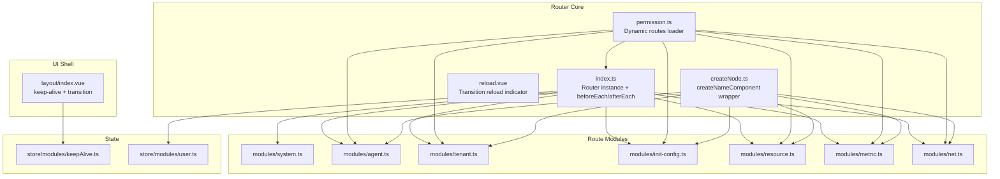
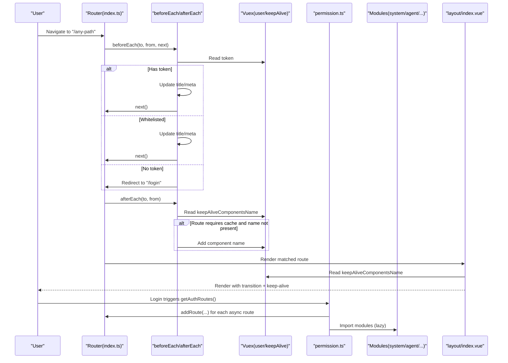
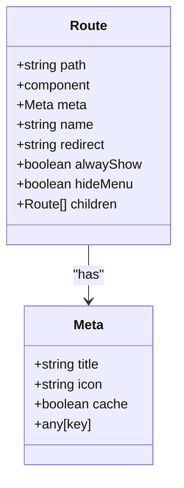
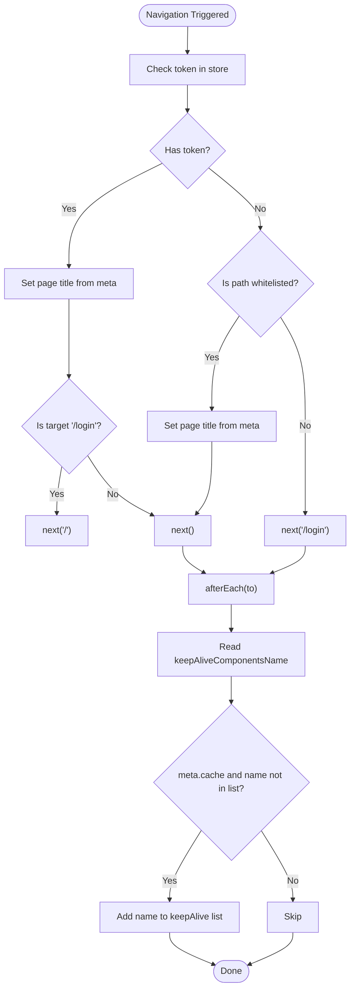
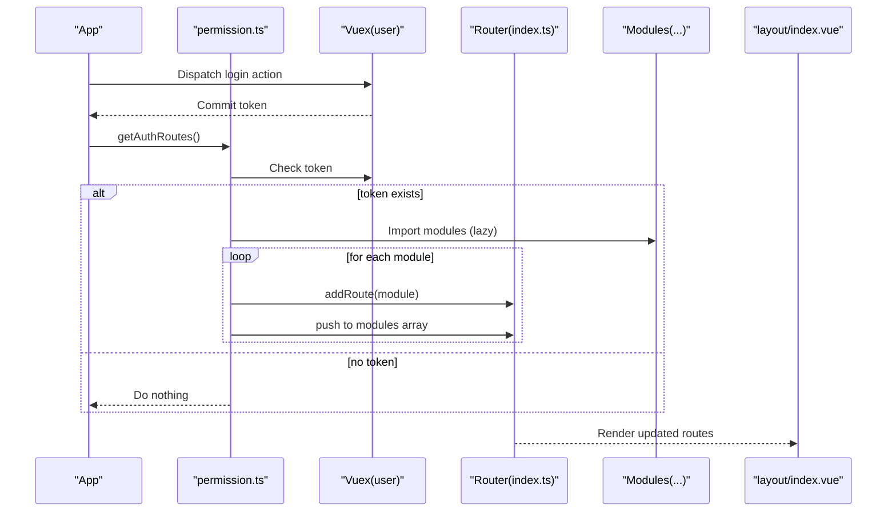
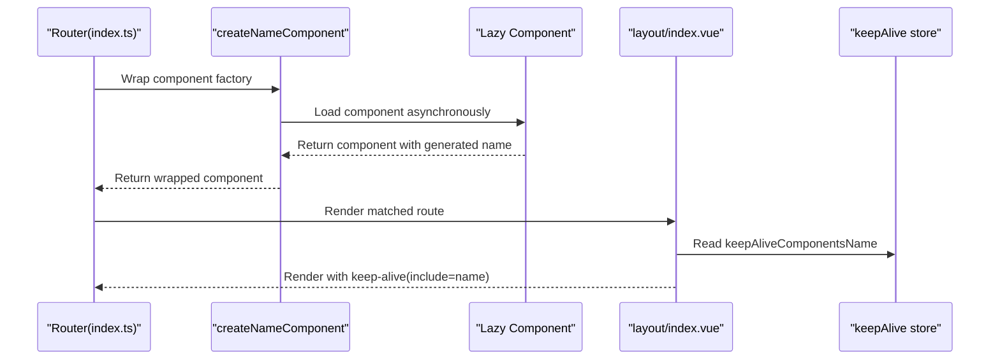
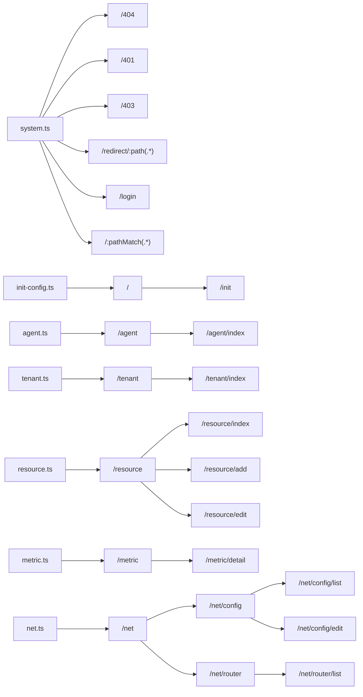
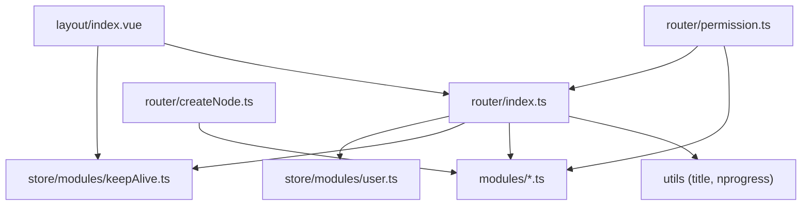

# Routing System

<cite>
**Referenced Files in This Document**
- [index.ts](file://watcher-web/src/router/index.ts)
- [permission.ts](file://watcher-web/src/router/permission.ts)
- [createNode.ts](file://watcher-web/src/router/createNode.ts)
- [reload.vue](file://watcher-web/src/router/reload.vue)
- [system.ts](file://watcher-web/src/router/modules/system.ts)
- [agent.ts](file://watcher-web/src/router/modules/agent.ts)
- [tenant.ts](file://watcher-web/src/router/modules/tenant.ts)
- [init-config.ts](file://watcher-web/src/router/modules/init-config.ts)
- [resource.ts](file://watcher-web/src/router/modules/resource.ts)
- [metric.ts](file://watcher-web/src/router/modules/metric.ts)
- [net.ts](file://watcher-web/src/router/modules/net.ts)
- [index.type.ts](file://watcher-web/src/router/index.type.ts)
- [keepAlive.ts](file://watcher-web/src/store/modules/keepAlive.ts)
- [user.ts](file://watcher-web/src/store/modules/user.ts)
- [index.vue](file://watcher-web/src/layout/index.vue)
</cite>

## Table of Contents
1. [Introduction](#introduction)
2. [Project Structure](#project-structure)
3. [Core Components](#core-components)
4. [Architecture Overview](#architecture-overview)
5. [Detailed Component Analysis](#detailed-component-analysis)
6. [Dependency Analysis](#dependency-analysis)
7. [Performance Considerations](#performance-considerations)
8. [Troubleshooting Guide](#troubleshooting-guide)
9. [Conclusion](#conclusion)

## Introduction
This document explains the Vue Router implementation and routing system used in the watcher-web frontend. It covers route configuration structure, dynamic route generation, permission-based routing with authentication guards, modular router organization across sections (agent, init-config, metric, net, resource, system, tenant), route meta properties, navigation guards, lazy loading strategies, programmatic navigation patterns, route parameters handling, breadcrumb implementation, and keep-alive optimizations.

## Project Structure
The routing system is organized around a central router instance that merges static and dynamic routes. Modules are grouped by functional areas and loaded lazily. A dedicated permission module dynamically injects routes after login. Keep-alive caching is coordinated via a Vuex store module.

**Diagram sources**
- [index.ts:27-52](file://watcher-web/src/router/index.ts#L27-L52)
- [permission.ts:17-36](file://watcher-web/src/router/permission.ts#L17-L36)
- [createNode.ts:8-50](file://watcher-web/src/router/createNode.ts#L8-L50)
- [system.ts:4-48](file://watcher-web/src/router/modules/system.ts#L4-L48)
- [agent.ts:5-26](file://watcher-web/src/router/modules/agent.ts#L5-L26)
- [tenant.ts:4-25](file://watcher-web/src/router/modules/tenant.ts#L4-L25)
- [init-config.ts:5-23](file://watcher-web/src/router/modules/init-config.ts#L5-L23)
- [resource.ts:5-48](file://watcher-web/src/router/modules/resource.ts#L5-L48)
- [metric.ts:5-26](file://watcher-web/src/router/modules/metric.ts#L5-L26)
- [net.ts:5-49](file://watcher-web/src/router/modules/net.ts#L5-L49)
- [index.vue:25-39](file://watcher-web/src/layout/index.vue#L25-L39)
- [keepAlive.ts:11-31](file://watcher-web/src/store/modules/keepAlive.ts#L11-L31)
- [user.ts:10-19](file://watcher-web/src/store/modules/user.ts#L10-L19)

**Section sources**
- [index.ts:27-52](file://watcher-web/src/router/index.ts#L27-L52)
- [permission.ts:17-36](file://watcher-web/src/router/permission.ts#L17-L36)
- [createNode.ts:8-50](file://watcher-web/src/router/createNode.ts#L8-L50)
- [system.ts:4-48](file://watcher-web/src/router/modules/system.ts#L4-L48)
- [agent.ts:5-26](file://watcher-web/src/router/modules/agent.ts#L5-L26)
- [tenant.ts:4-25](file://watcher-web/src/router/modules/tenant.ts#L4-L25)
- [init-config.ts:5-23](file://watcher-web/src/router/modules/init-config.ts#L5-L23)
- [resource.ts:5-48](file://watcher-web/src/router/modules/resource.ts#L5-L48)
- [metric.ts:5-26](file://watcher-web/src/router/modules/metric.ts#L5-L26)
- [net.ts:5-49](file://watcher-web/src/router/modules/net.ts#L5-L49)
- [index.vue:25-39](file://watcher-web/src/layout/index.vue#L25-L39)
- [keepAlive.ts:11-31](file://watcher-web/src/store/modules/keepAlive.ts#L11-L31)
- [user.ts:10-19](file://watcher-web/src/store/modules/user.ts#L10-L19)

## Core Components
- Router instance and global guards: Initializes the router with hash history, defines a whitelist, and sets up beforeEach and afterEach hooks for progress indication, title updates, and keep-alive registration.
- Dynamic route loader: Aggregates asynchronous route modules and injects them into the router after login.
- Lazy component wrapper: Ensures components used with keep-alive have deterministic names and supports a smooth reload UX.
- Route meta model: Defines standardized metadata for titles, icons, caching, and visibility controls.
- Keep-alive store: Tracks which component names should be cached across the app.
- Layout shell: Renders matched components inside transitions and keep-alive based on route meta and store state.

**Section sources**
- [index.ts:27-73](file://watcher-web/src/router/index.ts#L27-L73)
- [permission.ts:26-60](file://watcher-web/src/router/permission.ts#L26-L60)
- [createNode.ts:8-50](file://watcher-web/src/router/createNode.ts#L8-L50)
- [index.type.ts:5-35](file://watcher-web/src/router/index.type.ts#L5-L35)
- [keepAlive.ts:11-31](file://watcher-web/src/store/modules/keepAlive.ts#L11-L31)
- [index.vue:25-39](file://watcher-web/src/layout/index.vue#L25-L39)

## Architecture Overview
The routing architecture separates concerns across initialization, permission-driven injection, lazy loading, and UI rendering. The system ensures that:
- Static routes (e.g., system pages) are always available.
- Dynamic routes are injected post-login.
- Components are lazily loaded and named deterministically for keep-alive.
- Navigation guards enforce authentication and manage UI feedback.

**Diagram sources**
- [index.ts:36-68](file://watcher-web/src/router/index.ts#L36-L68)
- [permission.ts:54-59](file://watcher-web/src/router/permission.ts#L54-L59)
- [system.ts:4-48](file://watcher-web/src/router/modules/system.ts#L4-L48)
- [agent.ts:5-26](file://watcher-web/src/router/modules/agent.ts#L5-L26)
- [tenant.ts:4-25](file://watcher-web/src/router/modules/tenant.ts#L4-L25)
- [init-config.ts:5-23](file://watcher-web/src/router/modules/init-config.ts#L5-L23)
- [resource.ts:5-48](file://watcher-web/src/router/modules/resource.ts#L5-L48)
- [metric.ts:5-26](file://watcher-web/src/router/modules/metric.ts#L5-L26)
- [net.ts:5-49](file://watcher-web/src/router/modules/net.ts#L5-L49)
- [index.vue:25-39](file://watcher-web/src/layout/index.vue#L25-L39)
- [keepAlive.ts:11-31](file://watcher-web/src/store/modules/keepAlive.ts#L11-L31)
- [user.ts:10-19](file://watcher-web/src/store/modules/user.ts#L10-L19)

## Detailed Component Analysis

### Route Configuration Model
- Route type extends Vue Router’s raw record with additional fields for UI metadata and behavior flags.
- Meta supports title, icon, cache flag, and arbitrary extensions.
- Route records include path, component, optional redirect, and nested children.

**Diagram sources**
- [index.type.ts:5-35](file://watcher-web/src/router/index.type.ts#L5-L35)

**Section sources**
- [index.type.ts:5-35](file://watcher-web/src/router/index.type.ts#L5-L35)

### Global Guards and Authentication
- beforeEach handles progress bar start, dynamic title setting, login redirection, and whitelist bypass.
- afterEach reads the last matched component name and conditionally registers it for keep-alive caching.

**Diagram sources**
- [index.ts:36-68](file://watcher-web/src/router/index.ts#L36-L68)
- [keepAlive.ts:11-31](file://watcher-web/src/store/modules/keepAlive.ts#L11-L31)

**Section sources**
- [index.ts:36-68](file://watcher-web/src/router/index.ts#L36-L68)
- [keepAlive.ts:11-31](file://watcher-web/src/store/modules/keepAlive.ts#L11-L31)

### Dynamic Route Generation and Permission-Based Routing
- Static routes (e.g., system) are initialized immediately.
- Dynamic routes (agent, tenant, init-config, resource, metric, net) are aggregated and injected after login.
- The loader reads the token from the store and adds each route to both the modules array and the router.

**Diagram sources**
- [permission.ts:54-59](file://watcher-web/src/router/permission.ts#L54-L59)
- [permission.ts:42-49](file://watcher-web/src/router/permission.ts#L42-L49)
- [user.ts:35-46](file://watcher-web/src/store/modules/user.ts#L35-L46)
- [index.ts:23-30](file://watcher-web/src/router/index.ts#L23-L30)

**Section sources**
- [permission.ts:26-60](file://watcher-web/src/router/permission.ts#L26-L60)
- [user.ts:35-46](file://watcher-web/src/store/modules/user.ts#L35-L46)

### Lazy Loading and Keep-Alive Integration
- Components are wrapped with a factory that assigns a deterministic name derived from the original component plus a timestamp separator. This enables reliable keep-alive caching.
- A smooth reload indicator is shown during transitions to avoid flicker.

**Diagram sources**
- [createNode.ts:8-50](file://watcher-web/src/router/createNode.ts#L8-L50)
- [reload.vue:1-116](file://watcher-web/src/router/reload.vue#L1-L116)
- [index.vue:25-39](file://watcher-web/src/layout/index.vue#L25-L39)
- [keepAlive.ts:11-31](file://watcher-web/src/store/modules/keepAlive.ts#L11-L31)

**Section sources**
- [createNode.ts:8-50](file://watcher-web/src/router/createNode.ts#L8-L50)
- [reload.vue:1-116](file://watcher-web/src/router/reload.vue#L1-L116)
- [index.vue:25-39](file://watcher-web/src/layout/index.vue#L25-L39)
- [keepAlive.ts:11-31](file://watcher-web/src/store/modules/keepAlive.ts#L11-L31)

### Route Modules Organization
- System module: Provides essential system pages (login, 404, 401, 403, redirect) and a catch-all wildcard route.
- Agent module: Rooted under “/agent” with a child “index” page.
- Tenant module: Rooted under “/tenant” with a child “index” page.
- Init-config module: Rooted under “/” with a redirect to “/agent” and an “init” child page.
- Resource module: Rooted under “/resource” with “index”, “add”, and “edit” children.
- Metric module: Rooted under “/metric” with a “detail” child.
- Net module: Rooted under “/net” with nested “config” and “router” sections, each with subroutes.

**Diagram sources**
- [system.ts:4-48](file://watcher-web/src/router/modules/system.ts#L4-L48)
- [init-config.ts:5-23](file://watcher-web/src/router/modules/init-config.ts#L5-L23)
- [agent.ts:5-26](file://watcher-web/src/router/modules/agent.ts#L5-L26)
- [tenant.ts:4-25](file://watcher-web/src/router/modules/tenant.ts#L4-L25)
- [resource.ts:5-48](file://watcher-web/src/router/modules/resource.ts#L5-L48)
- [metric.ts:5-26](file://watcher-web/src/router/modules/metric.ts#L5-L26)
- [net.ts:5-49](file://watcher-web/src/router/modules/net.ts#L5-L49)

**Section sources**
- [system.ts:4-48](file://watcher-web/src/router/modules/system.ts#L4-L48)
- [init-config.ts:5-23](file://watcher-web/src/router/modules/init-config.ts#L5-L23)
- [agent.ts:5-26](file://watcher-web/src/router/modules/agent.ts#L5-L26)
- [tenant.ts:4-25](file://watcher-web/src/router/modules/tenant.ts#L4-L25)
- [resource.ts:5-48](file://watcher-web/src/router/modules/resource.ts#L5-L48)
- [metric.ts:5-26](file://watcher-web/src/router/modules/metric.ts#L5-L26)
- [net.ts:5-49](file://watcher-web/src/router/modules/net.ts#L5-L49)

### Route Meta Properties and Visibility Controls
- hideMenu: Hides a route from the sidebar menu.
- alwayShow: Forces display of a parent menu even with a single child.
- cache: Enables keep-alive caching for the route’s component.
- title/icon: Used for internationalized labels and menu icons.
- hideTabs/hideClose/hideSelf: Flags controlling tab behavior and menu visibility for specific contexts.

These properties are defined in the route meta model and consumed by UI components and guards.

**Section sources**
- [index.type.ts:26-35](file://watcher-web/src/router/index.type.ts#L26-L35)
- [system.ts:15-31](file://watcher-web/src/router/modules/system.ts#L15-L31)
- [net.ts:25-27](file://watcher-web/src/router/modules/net.ts#L25-L27)

### Programmatic Navigation and Route Parameters
- Programmatic navigation is performed via the router instance. Typical patterns include:
  - Redirecting to home after login.
  - Navigating to a wildcard catch-all route for 404 handling.
  - Using redirects within nested routes (e.g., net config/router).
- Route parameters are handled using Vue Router’s dynamic segments (e.g., “:path(.*)” and “:pathMatch(.*)”).

Examples of programmatic navigation patterns are implemented in:
- Global guards for redirecting unauthenticated users and login paths.
- Nested route redirects for sub-sections.

**Section sources**
- [index.ts:40-41](file://watcher-web/src/router/index.ts#L40-L41)
- [system.ts:42-46](file://watcher-web/src/router/modules/system.ts#L42-L46)
- [net.ts:15-15](file://watcher-web/src/router/modules/net.ts#L15-L15)
- [net.ts:35-35](file://watcher-web/src/router/modules/net.ts#L35-L35)

### Breadcrumb Implementation
- The layout includes a breadcrumb component slot and imports the Breadcrumb component. While the breadcrumb is currently commented out in the header area, the infrastructure is present to enable breadcrumbs per route using meta titles.

**Section sources**
- [index.vue:20-24](file://watcher-web/src/layout/index.vue#L20-L24)
- [index.vue:54-62](file://watcher-web/src/layout/index.vue#L54-L62)

### Relationship Between Routes and Component Rendering
- The layout’s router-view renders the matched component with a transition. If keep-alive is enabled for the current route and the component name is registered, the component is cached and reused across navigations.
- The transition name can be customized via meta.transition.

**Section sources**
- [index.vue:25-39](file://watcher-web/src/layout/index.vue#L25-L39)

## Dependency Analysis
- Router depends on:
  - Route modules for initial and dynamic routes.
  - Vuex user store for token availability.
  - Vuex keepAlive store for caching decisions.
  - Progress and title utilities.
- Dynamic loader depends on:
  - Route modules imported lazily.
  - Router instance to add routes.
- Layout depends on:
  - Keep-alive store for include list.
  - Router for route meta and matched component.

**Diagram sources**
- [index.ts:27-52](file://watcher-web/src/router/index.ts#L27-L52)
- [permission.ts:54-59](file://watcher-web/src/router/permission.ts#L54-L59)
- [createNode.ts:8-50](file://watcher-web/src/router/createNode.ts#L8-L50)
- [index.vue:25-39](file://watcher-web/src/layout/index.vue#L25-L39)
- [keepAlive.ts:11-31](file://watcher-web/src/store/modules/keepAlive.ts#L11-L31)
- [user.ts:10-19](file://watcher-web/src/store/modules/user.ts#L10-L19)

**Section sources**
- [index.ts:27-52](file://watcher-web/src/router/index.ts#L27-L52)
- [permission.ts:54-59](file://watcher-web/src/router/permission.ts#L54-L59)
- [createNode.ts:8-50](file://watcher-web/src/router/createNode.ts#L8-L50)
- [index.vue:25-39](file://watcher-web/src/layout/index.vue#L25-L39)
- [keepAlive.ts:11-31](file://watcher-web/src/store/modules/keepAlive.ts#L11-L31)
- [user.ts:10-19](file://watcher-web/src/store/modules/user.ts#L10-L19)

## Performance Considerations
- Lazy loading: All route components are loaded asynchronously via dynamic imports, reducing initial bundle size.
- Keep-alive caching: Components marked with cache are kept alive to avoid re-render costs. Registration occurs automatically in afterEach when meta.cache is true.
- Transition and reload UX: The reload component provides a smooth visual indicator during route transitions to prevent perceived flicker.
- Progress indication: NProgress is started in beforeEach and stopped in afterEach to provide immediate feedback.

[No sources needed since this section provides general guidance]

## Troubleshooting Guide
- Login loops or unauthorized redirects:
  - Verify the whitelist includes “/login” and that the token getter returns a truthy value after login.
- Routes not appearing after login:
  - Confirm getAuthRoutes is invoked after login and that modules are pushed into both the modules array and the router.
- Keep-alive not working:
  - Ensure the component is wrapped with createNameComponent so it has a deterministic name and meta.cache is set when needed.
- 404 handling:
  - Confirm the wildcard route exists and redirects to the intended 404 page.

**Section sources**
- [index.ts:32-33](file://watcher-web/src/router/index.ts#L32-L33)
- [index.ts:55-67](file://watcher-web/src/router/index.ts#L55-L67)
- [permission.ts:54-59](file://watcher-web/src/router/permission.ts#L54-L59)
- [createNode.ts:14-16](file://watcher-web/src/router/createNode.ts#L14-L16)
- [system.ts:42-46](file://watcher-web/src/router/modules/system.ts#L42-L46)

## Conclusion
The routing system combines a clean modular structure with dynamic route injection, robust authentication guards, and efficient keep-alive caching. By leveraging meta properties, lazy loading, and a centralized wrapper for component naming, the system delivers a responsive and maintainable navigation experience across the application’s functional domains.