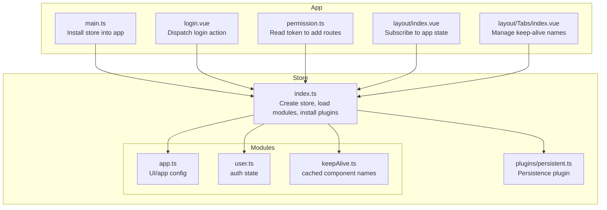
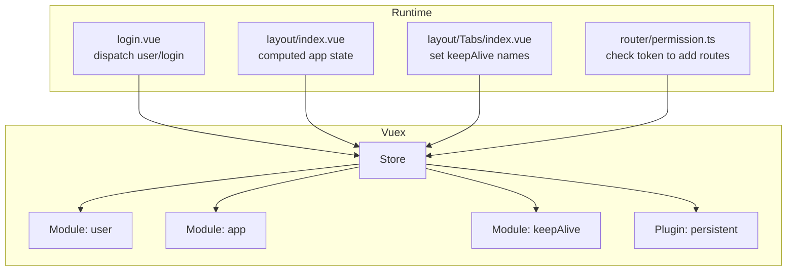
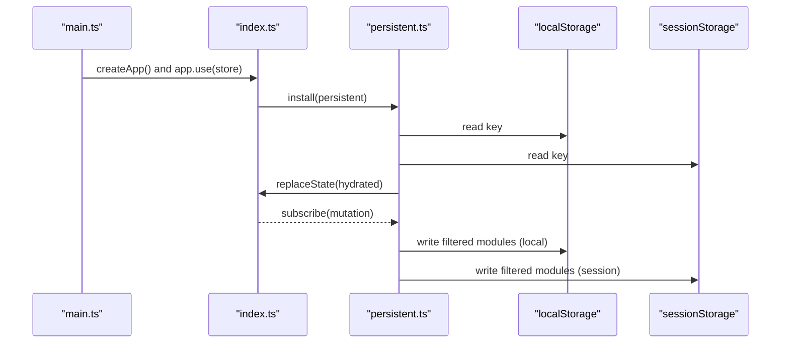
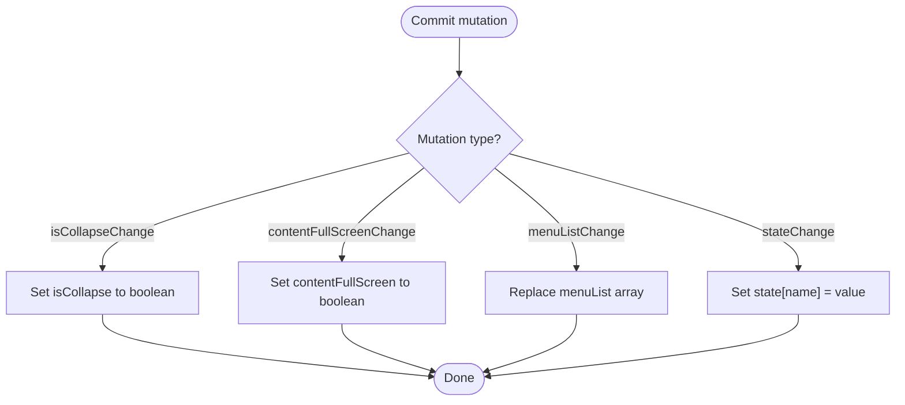
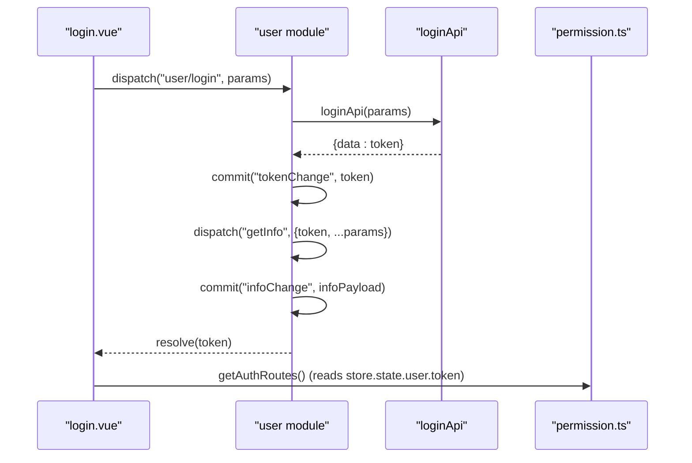
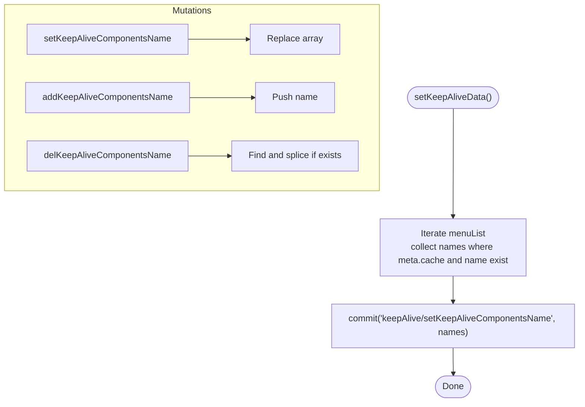
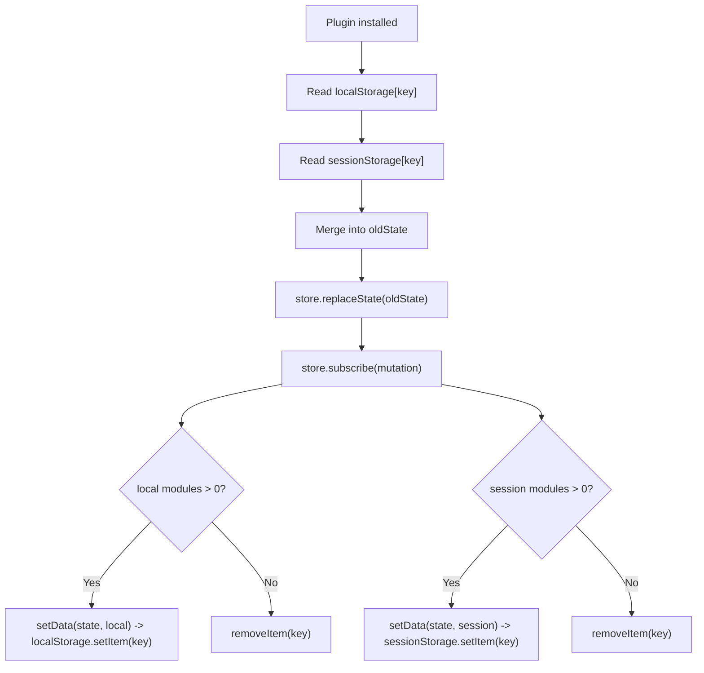
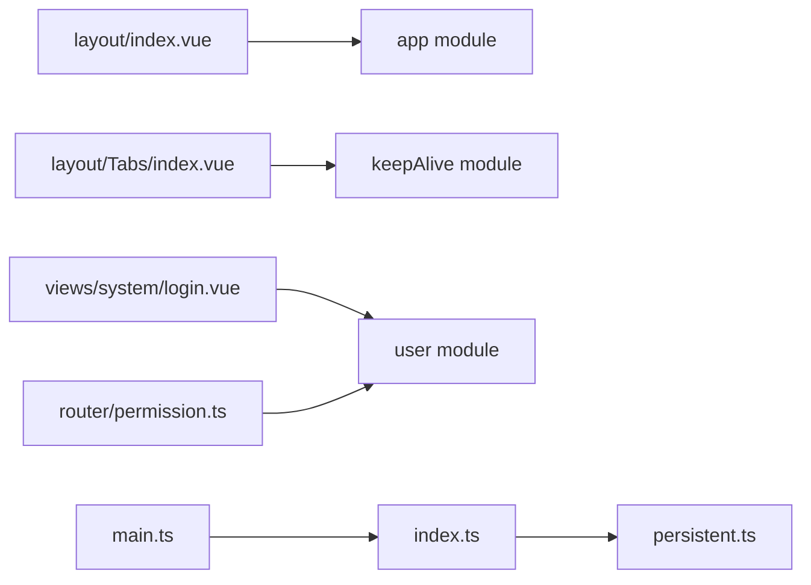

# State Management

<cite>
**Referenced Files in This Document**
- [index.ts](file://watcher-web/src/store/index.ts)
- [app.ts](file://watcher-web/src/store/modules/app.ts)
- [user.ts](file://watcher-web/src/store/modules/user.ts)
- [keepAlive.ts](file://watcher-web/src/store/modules/keepAlive.ts)
- [persistent.ts](file://watcher-web/src/store/plugins/persistent.ts)
- [main.ts](file://watcher-web/src/main.ts)
- [login.vue](file://watcher-web/src/views/system/login.vue)
- [permission.ts](file://watcher-web/src/router/permission.ts)
- [index.vue](file://watcher-web/src/layout/index.vue)
- [Tabs/index.vue](file://watcher-web/src/layout/Tabs/index.vue)
</cite>

## Table of Contents
1. [Introduction](#introduction)
2. [Project Structure](#project-structure)
3. [Core Components](#core-components)
4. [Architecture Overview](#architecture-overview)
5. [Detailed Component Analysis](#detailed-component-analysis)
6. [Dependency Analysis](#dependency-analysis)
7. [Performance Considerations](#performance-considerations)
8. [Troubleshooting Guide](#troubleshooting-guide)
9. [Conclusion](#conclusion)
10. [Appendices](#appendices)

## Introduction
This document explains the Vuex store implementation used for state management in the frontend application. It covers the store structure, modules for application configuration, user authentication, and keep-alive component caching. It also documents state mutations, actions, and getters, the persistence plugin for preserving state across browser sessions, reactive state patterns, getter computations, and action dispatching. Practical examples of component integration, state subscription patterns, and best practices for organizing state are included. Finally, it addresses state debugging, performance considerations, and memory management strategies.

## Project Structure
The Vuex store is organized under a dedicated folder with three core modules and a persistence plugin. The store is bootstrapped in the application entrypoint and made available globally to all components.

**Diagram sources**
- [index.ts:1-39](file://watcher-web/src/store/index.ts#L1-L39)
- [persistent.ts:1-59](file://watcher-web/src/store/plugins/persistent.ts#L1-L59)
- [app.ts:1-74](file://watcher-web/src/store/modules/app.ts#L1-L74)
- [user.ts:1-76](file://watcher-web/src/store/modules/user.ts#L1-L76)
- [keepAlive.ts:1-51](file://watcher-web/src/store/modules/keepAlive.ts#L1-L51)
- [main.ts:1-37](file://watcher-web/src/main.ts#L1-L37)
- [login.vue:1-355](file://watcher-web/src/views/system/login.vue#L1-L355)
- [permission.ts:1-60](file://watcher-web/src/router/permission.ts#L1-L60)
- [index.vue:1-158](file://watcher-web/src/layout/index.vue#L1-L158)
- [Tabs/index.vue:1-302](file://watcher-web/src/layout/Tabs/index.vue#L1-L302)

**Section sources**
- [index.ts:1-39](file://watcher-web/src/store/index.ts#L1-L39)
- [main.ts:1-37](file://watcher-web/src/main.ts#L1-L37)

## Core Components
- Store initialization and module registration:
  - Dynamically loads modules via globbing and registers them under the root store.
  - Installs the persistence plugin with configurable keys for localStorage and sessionStorage.
  - Enables strict mode in non-production environments for development feedback.
- Modules:
  - app: Holds UI and app configuration state and exposes mutations for toggling UI flags and updating arbitrary fields.
  - user: Manages authentication token and user info, with actions for login, fetching info, and logout.
  - keepAlive: Maintains a list of component names to cache via keep-alive, with mutations to add, remove, and reset cached names.
- Persistence plugin:
  - Hydrates state from localStorage/sessionStorage on startup.
  - Subscribes to state changes and writes selected modules to persistent storage.

**Section sources**
- [index.ts:1-39](file://watcher-web/src/store/index.ts#L1-L39)
- [app.ts:14-74](file://watcher-web/src/store/modules/app.ts#L14-L74)
- [user.ts:5-76](file://watcher-web/src/store/modules/user.ts#L5-L76)
- [keepAlive.ts:7-51](file://watcher-web/src/store/modules/keepAlive.ts#L7-L51)
- [persistent.ts:1-59](file://watcher-web/src/store/plugins/persistent.ts#L1-L59)

## Architecture Overview
The store architecture follows a modular design with namespaced modules. The persistence plugin ensures continuity across browser sessions by restoring state on load and persisting updates. Components subscribe to state via computed properties and dispatch actions or commit mutations to update state.

**Diagram sources**
- [login.vue:139-169](file://watcher-web/src/views/system/login.vue#L139-L169)
- [index.vue:63-102](file://watcher-web/src/layout/index.vue#L63-L102)
- [Tabs/index.vue:204-210](file://watcher-web/src/layout/Tabs/index.vue#L204-L210)
- [permission.ts:54-59](file://watcher-web/src/router/permission.ts#L54-L59)
- [index.ts:32-38](file://watcher-web/src/store/index.ts#L32-L38)

## Detailed Component Analysis

### Store Initialization and Plugin
- Module discovery and registration:
  - Uses glob import to discover modules dynamically and register them under the store.
- Persistence configuration:
  - Initializes the persistence plugin with a shared key and module lists for localStorage and sessionStorage.
  - Hydrates existing state from storage on startup and replaces the store’s initial state accordingly.
  - Subscribes to state changes and writes only the configured modules to storage.

**Diagram sources**
- [main.ts:26-36](file://watcher-web/src/main.ts#L26-L36)
- [index.ts:32-38](file://watcher-web/src/store/index.ts#L32-L38)
- [persistent.ts:22-49](file://watcher-web/src/store/plugins/persistent.ts#L22-L49)

**Section sources**
- [index.ts:15-30](file://watcher-web/src/store/index.ts#L15-L30)
- [persistent.ts:21-59](file://watcher-web/src/store/plugins/persistent.ts#L21-L59)

### App Module (UI and App Configuration)
- State fields:
  - Collapsed sidebar flag, content full-screen toggle, logo visibility, top bar fixed behavior, tab visibility, single-expand menu behavior, default element size, language, theme metadata, and menu list.
- Mutations:
  - Toggle collapse state.
  - Toggle content full-screen.
  - Replace menu list.
  - Generic state updater keyed by a name/value pair.
- Actions:
  - Currently empty; future enhancements can centralize app-wide effects here.

**Diagram sources**
- [app.ts:50-63](file://watcher-web/src/store/modules/app.ts#L50-L63)

**Section sources**
- [app.ts:14-74](file://watcher-web/src/store/modules/app.ts#L14-L74)

### User Module (Authentication)
- State fields:
  - Authentication token and user info object.
- Getters:
  - Exposes token getter for derived reads.
- Mutations:
  - Update token.
  - Update user info.
- Actions:
  - login: Calls API, commits token, then dispatches getInfo to populate user info.
  - getInfo: Commits provided info payload.
  - loginOut: Clears tabs and store-related storage keys, then reloads the page.

**Diagram sources**
- [login.vue:139-169](file://watcher-web/src/views/system/login.vue#L139-L169)
- [user.ts:33-67](file://watcher-web/src/store/modules/user.ts#L33-L67)
- [permission.ts:54-59](file://watcher-web/src/router/permission.ts#L54-L59)

**Section sources**
- [user.ts:5-76](file://watcher-web/src/store/modules/user.ts#L5-L76)
- [login.vue:139-169](file://watcher-web/src/views/system/login.vue#L139-L169)
- [permission.ts:54-59](file://watcher-web/src/router/permission.ts#L54-L59)

### Keep-Alive Module (Component Caching)
- State field:
  - Array of component names to cache.
- Mutations:
  - Reset the cache list.
  - Add a component name.
  - Remove a component name if present.
- Getters:
  - Exposes the current list of cached component names.

**Diagram sources**
- [Tabs/index.vue:204-210](file://watcher-web/src/layout/Tabs/index.vue#L204-L210)
- [keepAlive.ts:15-31](file://watcher-web/src/store/modules/keepAlive.ts#L15-L31)

**Section sources**
- [keepAlive.ts:7-51](file://watcher-web/src/store/modules/keepAlive.ts#L7-L51)
- [Tabs/index.vue:204-210](file://watcher-web/src/layout/Tabs/index.vue#L204-L210)

### Persistence Plugin
- Hydration:
  - Reads combined data from localStorage and sessionStorage on plugin installation and hydrates the store.
- Subscription:
  - On every mutation, filters the current state by configured module lists and writes to localStorage and/or sessionStorage respectively.
- Configuration:
  - Accepts a key and two arrays: modules to persist in localStorage and modules to persist in sessionStorage.

**Diagram sources**
- [persistent.ts:21-59](file://watcher-web/src/store/plugins/persistent.ts#L21-L59)

**Section sources**
- [persistent.ts:1-59](file://watcher-web/src/store/plugins/persistent.ts#L1-L59)
- [index.ts:27-30](file://watcher-web/src/store/index.ts#L27-L30)

## Dependency Analysis
- Module coupling:
  - The app module is consumed widely by layout components for responsive UI behavior.
  - The keepAlive module is driven by the Tabs component, which computes which components should be cached based on route metadata.
  - The user module is the trigger for dynamic route addition via the permission system.
- External integrations:
  - The persistence plugin depends on browser storage APIs.
  - The main application integrates the store globally and reads app state for UI sizing.

**Diagram sources**
- [index.vue:63-102](file://watcher-web/src/layout/index.vue#L63-L102)
- [Tabs/index.vue:204-210](file://watcher-web/src/layout/Tabs/index.vue#L204-L210)
- [login.vue:139-169](file://watcher-web/src/views/system/login.vue#L139-L169)
- [permission.ts:54-59](file://watcher-web/src/router/permission.ts#L54-L59)
- [main.ts:26-36](file://watcher-web/src/main.ts#L26-L36)
- [index.ts:32-38](file://watcher-web/src/store/index.ts#L32-L38)

**Section sources**
- [index.ts:15-30](file://watcher-web/src/store/index.ts#L15-L30)
- [index.vue:63-102](file://watcher-web/src/layout/index.vue#L63-L102)
- [Tabs/index.vue:204-210](file://watcher-web/src/layout/Tabs/index.vue#L204-L210)
- [login.vue:139-169](file://watcher-web/src/views/system/login.vue#L139-L169)
- [permission.ts:54-59](file://watcher-web/src/router/permission.ts#L54-L59)
- [main.ts:26-36](file://watcher-web/src/main.ts#L26-L36)

## Performance Considerations
- Minimize unnecessary re-computations:
  - Prefer getters for derived data and keep computed properties focused on small subsets of state.
- Limit persisted modules:
  - Only persist modules that truly need continuity across sessions to reduce storage overhead and serialization costs.
- Mutation granularity:
  - Batch related state updates with a single mutation when possible to reduce plugin write cycles.
- Keep-alive strategy:
  - Avoid caching heavy components unnecessarily; prefer selective caching based on route meta flags to reduce memory footprint.
- Strict mode:
  - Keep strict mode enabled in development to catch accidental mutations outside of mutations.

## Troubleshooting Guide
- State not persisting:
  - Verify the persistence plugin is installed and that the module names are included in either the local or session module lists.
  - Confirm the storage key matches across hydration and subscription phases.
- State resets unexpectedly:
  - Check for manual replacement of state during hydration or accidental clearing of storage keys.
- Keep-alive not working:
  - Ensure component names are set via the keepAlive module and that route meta cache flags are properly configured.
- Token-based routing not triggering:
  - Confirm the permission system checks the correct token path and that dynamic routes are added after login.

**Section sources**
- [persistent.ts:21-59](file://watcher-web/src/store/plugins/persistent.ts#L21-L59)
- [index.ts:27-30](file://watcher-web/src/store/index.ts#L27-L30)
- [Tabs/index.vue:204-210](file://watcher-web/src/layout/Tabs/index.vue#L204-L210)
- [permission.ts:54-59](file://watcher-web/src/router/permission.ts#L54-L59)

## Conclusion
The Vuex store is structured around three core modules—app configuration, user authentication, and keep-alive component caching—enhanced by a persistence plugin that preserves state across browser sessions. Components integrate with the store through computed properties and action dispatching, while mutations provide controlled state updates. Following the best practices outlined here will help maintain a predictable, debuggable, and performant state layer.

## Appendices

### Reactive State Patterns and Component Integration Examples
- Subscribing to app state in layout:
  - Computed properties derive UI flags from the app module to drive responsive behavior.
  - Example path: [index.vue:63-102](file://watcher-web/src/layout/index.vue#L63-L102)
- Dispatching login action:
  - Components dispatch the user login action and await resolution to continue navigation.
  - Example path: [login.vue:139-169](file://watcher-web/src/views/system/login.vue#L139-L169)
- Managing keep-alive component names:
  - Tabs compute which components should be cached and commit the resulting list to the keepAlive module.
  - Example path: [Tabs/index.vue:204-210](file://watcher-web/src/layout/Tabs/index.vue#L204-L210)
- Dynamic route addition based on token:
  - Permission system reads the token from the user module to add routes after login.
  - Example path: [permission.ts:54-59](file://watcher-web/src/router/permission.ts#L54-L59)

### Best Practices for State Organization
- Namespacing:
  - Keep modules namespaced to avoid naming collisions and improve readability.
- Granular mutations:
  - Keep mutations small and focused on a single responsibility.
- Centralized actions:
  - Encapsulate async flows and cross-module coordination in actions.
- Selective persistence:
  - Persist only essential modules to balance continuity and performance.
- Keep-alive hygiene:
  - Use route meta flags to control caching and avoid caching components that do not benefit from it.