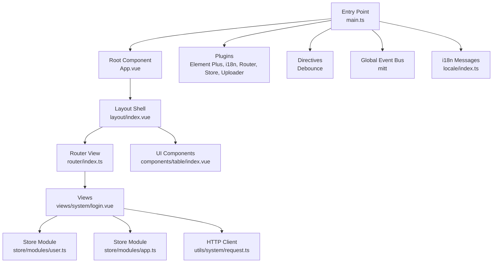
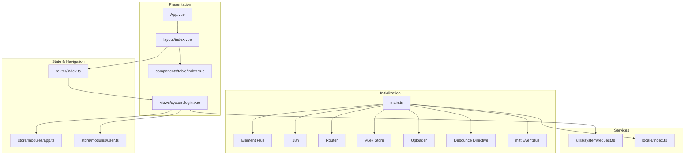
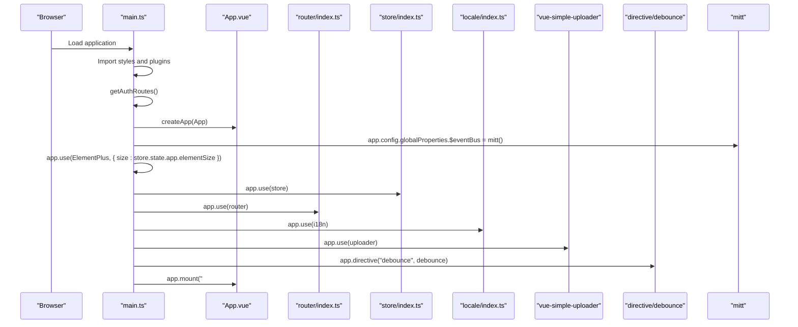
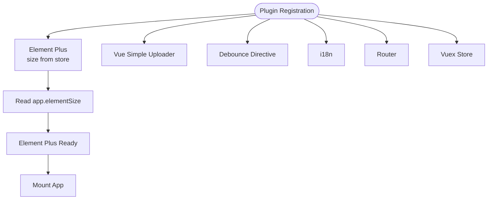
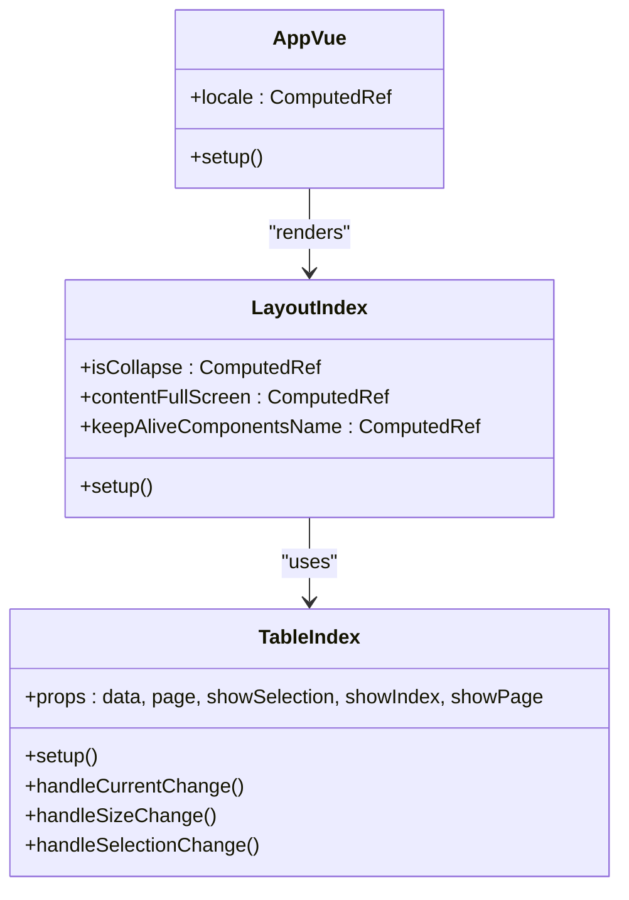
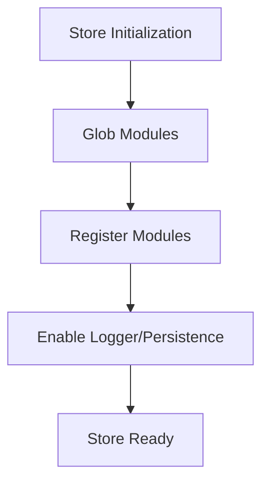
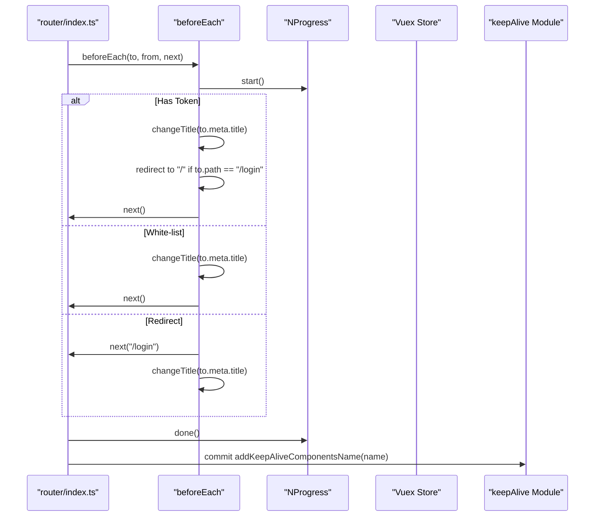
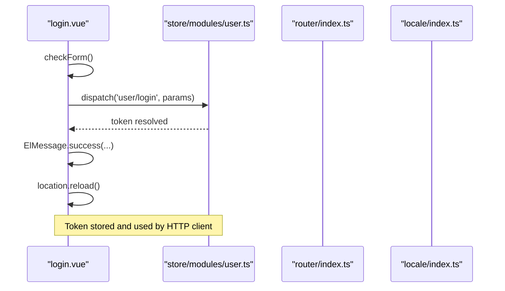
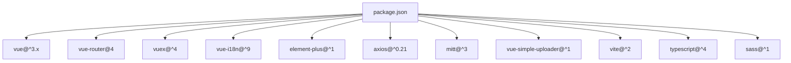

# Vue.js Application Architecture

<cite>
**Referenced Files in This Document**
- [main.ts](file://watcher-web/src/main.ts)
- [package.json](file://watcher-web/package.json)
- [vite.config.ts](file://watcher-web/vite.config.ts)
- [tsconfig.json](file://watcher-web/tsconfig.json)
- [App.vue](file://watcher-web/src/App.vue)
- [store/index.ts](file://watcher-web/src/store/index.ts)
- [store/modules/app.ts](file://watcher-web/src/store/modules/app.ts)
- [store/modules/user.ts](file://watcher-web/src/store/modules/user.ts)
- [router/index.ts](file://watcher-web/src/router/index.ts)
- [locale/index.ts](file://watcher-web/src/locale/index.ts)
- [directive/debounce/index.ts](file://watcher-web/src/directive/debounce/index.ts)
- [utils/system/request.ts](file://watcher-web/src/utils/system/request.ts)
- [components/table/index.vue](file://watcher-web/src/components/table/index.vue)
- [views/system/login.vue](file://watcher-web/src/views/system/login.vue)
- [layout/index.vue](file://watcher-web/src/layout/index.vue)
</cite>

## Table of Contents
1. [Introduction](#introduction)
2. [Project Structure](#project-structure)
3. [Core Components](#core-components)
4. [Architecture Overview](#architecture-overview)
5. [Detailed Component Analysis](#detailed-component-analysis)
6. [Dependency Analysis](#dependency-analysis)
7. [Performance Considerations](#performance-considerations)
8. [Troubleshooting Guide](#troubleshooting-guide)
9. [Conclusion](#conclusion)
10. [Appendices](#appendices)

## Introduction
This document explains the Vue.js 3 application architecture for the watcher-web frontend. It covers application initialization via the main entry point, dependency injection through plugins and global configuration, global event bus setup, Composition API usage patterns, TypeScript integration, component structure, and plugin integrations such as Element Plus, Vue Simple Uploader, and custom directives. It also documents performance considerations, development versus production configurations, and best practices for organizing components and stores.

## Project Structure
The frontend is organized around a clear separation of concerns:
- Entry point initializes the app, registers plugins, and mounts the root component.
- Store modules encapsulate state, getters, mutations, and actions.
- Router manages navigation, guards, and keep-alive caching.
- Locale provides internationalization with dynamic message loading.
- Directives add reusable behavior (e.g., debouncing).
- Utilities centralize HTTP requests and shared helpers.
- Components provide reusable UI building blocks.
- Views implement page-level logic using the Composition API.

**Diagram sources**
- [main.ts:1-37](file://watcher-web/src/main.ts#L1-L37)
- [App.vue:1-39](file://watcher-web/src/App.vue#L1-L39)
- [layout/index.vue:1-158](file://watcher-web/src/layout/index.vue#L1-L158)
- [router/index.ts:1-73](file://watcher-web/src/router/index.ts#L1-L73)
- [views/system/login.vue:1-355](file://watcher-web/src/views/system/login.vue#L1-L355)
- [store/modules/user.ts:1-76](file://watcher-web/src/store/modules/user.ts#L1-L76)
- [store/modules/app.ts:1-74](file://watcher-web/src/store/modules/app.ts#L1-L74)
- [components/table/index.vue:1-133](file://watcher-web/src/components/table/index.vue#L1-L133)
- [utils/system/request.ts:1-81](file://watcher-web/src/utils/system/request.ts#L1-L81)
- [locale/index.ts:1-26](file://watcher-web/src/locale/index.ts#L1-L26)

**Section sources**
- [main.ts:1-37](file://watcher-web/src/main.ts#L1-L37)
- [vite.config.ts:1-50](file://watcher-web/vite.config.ts#L1-L50)
- [tsconfig.json:1-21](file://watcher-web/tsconfig.json#L1-L21)

## Core Components
- Application bootstrap and plugin registration occur in the entry file. It imports styles, sets up Element Plus with store-driven size, registers the global event bus, and mounts the root component.
- The root component wraps routing in an Element Plus configuration provider and exposes locale data derived from i18n.
- The store aggregates modules and applies a persistence plugin. Modules define state, getters, mutations, and actions.
- The router defines navigation, guards, and keep-alive behavior for cached views.
- Internationalization loads messages dynamically and selects a locale based on browser preference and persisted settings.
- A custom directive provides click debouncing behavior.
- The HTTP client centralizes request/response interceptors and error handling.

**Section sources**
- [main.ts:1-37](file://watcher-web/src/main.ts#L1-L37)
- [App.vue:1-39](file://watcher-web/src/App.vue#L1-L39)
- [store/index.ts:1-39](file://watcher-web/src/store/index.ts#L1-L39)
- [store/modules/app.ts:1-74](file://watcher-web/src/store/modules/app.ts#L1-L74)
- [store/modules/user.ts:1-76](file://watcher-web/src/store/modules/user.ts#L1-L76)
- [router/index.ts:1-73](file://watcher-web/src/router/index.ts#L1-L73)
- [locale/index.ts:1-26](file://watcher-web/src/locale/index.ts#L1-L26)
- [directive/debounce/index.ts:1-32](file://watcher-web/src/directive/debounce/index.ts#L1-L32)
- [utils/system/request.ts:1-81](file://watcher-web/src/utils/system/request.ts#L1-L81)

## Architecture Overview
The application follows a layered architecture:
- Entry layer initializes the app and registers plugins.
- Presentation layer consists of layout, views, and components.
- State management layer uses Vuex modules with persistence.
- Navigation layer uses Vue Router with guards and keep-alive caching.
- Services layer uses Axios with centralized interceptors.
- Internationalization layer loads messages dynamically.

**Diagram sources**
- [main.ts:1-37](file://watcher-web/src/main.ts#L1-L37)
- [App.vue:1-39](file://watcher-web/src/App.vue#L1-L39)
- [layout/index.vue:1-158](file://watcher-web/src/layout/index.vue#L1-L158)
- [views/system/login.vue:1-355](file://watcher-web/src/views/system/login.vue#L1-L355)
- [components/table/index.vue:1-133](file://watcher-web/src/components/table/index.vue#L1-L133)
- [store/modules/app.ts:1-74](file://watcher-web/src/store/modules/app.ts#L1-L74)
- [store/modules/user.ts:1-76](file://watcher-web/src/store/modules/user.ts#L1-L76)
- [router/index.ts:1-73](file://watcher-web/src/router/index.ts#L1-L73)
- [utils/system/request.ts:1-81](file://watcher-web/src/utils/system/request.ts#L1-L81)
- [locale/index.ts:1-26](file://watcher-web/src/locale/index.ts#L1-L26)

## Detailed Component Analysis

### Entry Point and Initialization
The entry point creates the Vue app, injects global dependencies, and mounts the root component. It conditionally initializes analytics, sets up the global event bus, and registers plugins in a specific order to ensure availability during rendering.

**Diagram sources**
- [main.ts:1-37](file://watcher-web/src/main.ts#L1-L37)
- [router/index.ts:1-73](file://watcher-web/src/router/index.ts#L1-L73)
- [store/index.ts:1-39](file://watcher-web/src/store/index.ts#L1-L39)
- [locale/index.ts:1-26](file://watcher-web/src/locale/index.ts#L1-L26)
- [directive/debounce/index.ts:1-32](file://watcher-web/src/directive/debounce/index.ts#L1-L32)

**Section sources**
- [main.ts:1-37](file://watcher-web/src/main.ts#L1-L37)

### Global Event Bus with mitt
A global event bus is attached to the app’s global properties to enable loose coupling between components. This allows emitting and listening to events without a shared parent.

Implementation highlights:
- The bus is initialized in the entry point and exposed as a global property.
- Components can emit and subscribe to events globally, enabling cross-component communication.

Best practices:
- Use namespaced event names to avoid collisions.
- Clean up listeners on unmount to prevent memory leaks.

**Section sources**
- [main.ts:27](file://watcher-web/src/main.ts#L27)

### Plugin System: Element Plus, Vue Simple Uploader, and Custom Directives
- Element Plus is registered with a size derived from the store, ensuring consistent UI sizing across the app.
- Vue Simple Uploader is imported and registered to support file upload capabilities.
- A custom debounce directive is registered globally to prevent rapid repeated actions.

**Diagram sources**
- [main.ts:28-33](file://watcher-web/src/main.ts#L28-L33)
- [store/modules/app.ts:37](file://watcher-web/src/store/modules/app.ts#L37)

**Section sources**
- [main.ts:28-33](file://watcher-web/src/main.ts#L28-L33)
- [directive/debounce/index.ts:1-32](file://watcher-web/src/directive/debounce/index.ts#L1-L32)

### Composition API Usage Patterns
- Views commonly use the Composition API with script setup for concise logic and reactivity.
- Components leverage refs, reactive objects, lifecycle hooks, and emits to manage state and events.
- The table component demonstrates props, emits, lifecycle hooks, and scoped slots for extensibility.

Example patterns observed:
- Using reactive forms and refs in views.
- Emitting events to parent components for pagination and selection handling.
- Lifecycle hooks to trigger layout recalculation for keep-alive scenarios.

**Section sources**
- [views/system/login.vue:56-176](file://watcher-web/src/views/system/login.vue#L56-L176)
- [components/table/index.vue:40-98](file://watcher-web/src/components/table/index.vue#L40-L98)

### TypeScript Integration
- The project uses TypeScript with strict compiler options and Vue-specific types.
- Path aliases and module resolution are configured to simplify imports.
- Type-safe store modules and component props improve maintainability.

Key configuration points:
- Strict mode enabled.
- Vue and DOM libraries included.
- Alias mapping for @ resolves to src.

**Section sources**
- [tsconfig.json:1-21](file://watcher-web/tsconfig.json#L1-L21)
- [package.json:55-70](file://watcher-web/package.json#L55-L70)

### Component Structure
- Root component wraps routing inside an Element Plus configuration provider and exposes locale data.
- Layout composes aside, header, main content, and optional tabs/breadcrumbs.
- Reusable components encapsulate UI patterns (e.g., tables) and expose props/events for customization.

**Diagram sources**
- [App.vue:7-25](file://watcher-web/src/App.vue#L7-L25)
- [layout/index.vue:45-102](file://watcher-web/src/layout/index.vue#L45-L102)
- [components/table/index.vue:40-98](file://watcher-web/src/components/table/index.vue#L40-L98)

**Section sources**
- [App.vue:1-39](file://watcher-web/src/App.vue#L1-L39)
- [layout/index.vue:1-158](file://watcher-web/src/layout/index.vue#L1-L158)
- [components/table/index.vue:1-133](file://watcher-web/src/components/table/index.vue#L1-L133)

### Store Organization and Persistence
- Modules are dynamically loaded using glob imports.
- A persistence plugin persists selected modules to localStorage/sessionStorage.
- Strict mode is enabled in non-production environments for debugging.

**Diagram sources**
- [store/index.ts:6-38](file://watcher-web/src/store/index.ts#L6-L38)

**Section sources**
- [store/index.ts:1-39](file://watcher-web/src/store/index.ts#L1-L39)
- [store/modules/app.ts:1-74](file://watcher-web/src/store/modules/app.ts#L1-L74)
- [store/modules/user.ts:1-76](file://watcher-web/src/store/modules/user.ts#L1-L76)

### Router and Navigation Guards
- Routes are composed reactively to reflect menu updates.
- Navigation guards enforce authentication, manage progress indicators, and cache pages using keep-alive.
- After each navigation, components can be added to the keep-alive list based on meta flags.

**Diagram sources**
- [router/index.ts:35-68](file://watcher-web/src/router/index.ts#L35-L68)

**Section sources**
- [router/index.ts:1-73](file://watcher-web/src/router/index.ts#L1-L73)

### Internationalization Setup
- Messages are dynamically loaded from locale modules.
- The initial locale is determined by browser language and persisted app settings.
- The root component passes locale data to Element Plus for UI translations.

**Section sources**
- [locale/index.ts:1-26](file://watcher-web/src/locale/index.ts#L1-L26)
- [App.vue:14-23](file://watcher-web/src/App.vue#L14-L23)

### HTTP Client and Error Handling
- Axios instance is created with a base URL from environment variables.
- Request interceptor attaches tokens and serializes delete parameters.
- Response interceptor validates server responses and handles errors, including token expiration flows.

**Section sources**
- [utils/system/request.ts:8-78](file://watcher-web/src/utils/system/request.ts#L8-L78)

### Example: Login View with Composition API
The login view demonstrates:
- Script setup with composables for store, router, and i18n.
- Reactive form state and validation.
- Dispatching store actions and handling loading states.
- Emitting success notifications and redirecting after successful login.

**Diagram sources**
- [views/system/login.vue:139-169](file://watcher-web/src/views/system/login.vue#L139-L169)
- [store/modules/user.ts:33-66](file://watcher-web/src/store/modules/user.ts#L33-L66)

**Section sources**
- [views/system/login.vue:1-355](file://watcher-web/src/views/system/login.vue#L1-L355)

## Dependency Analysis
External dependencies and their roles:
- Vue 3 runtime and ecosystem packages.
- Element Plus for UI components and theming.
- Vue Router 4 for routing and navigation.
- Vuex 4 for state management.
- Vue I18n for internationalization.
- Axios for HTTP requests.
- mitt for global event bus.
- Vue Simple Uploader for file uploads.
- lodash and throttle-debounce for utilities.

Build and tooling:
- Vite for dev server, proxy, and bundling.
- TypeScript compiler and Vue TS checker.
- Sass for styling.

**Diagram sources**
- [package.json:20-54](file://watcher-web/package.json#L20-L54)

**Section sources**
- [package.json:1-72](file://watcher-web/package.json#L1-L72)

## Performance Considerations
- Manual chunking separates heavy libraries (e.g., ECharts) into dedicated chunks to optimize loading.
- Keep-alive caching reduces re-render costs for frequently visited views.
- Conditional analytics initialization avoids overhead in development.
- Debounce directive prevents excessive handler invocations.

Recommendations:
- Monitor bundle sizes and split additional vendor libraries as needed.
- Use lazy-loading for large views and components.
- Prefer shallow refs for primitive state and computed for derived values.
- Avoid unnecessary global reactivity; scope state to components where possible.

**Section sources**
- [vite.config.ts:39-42](file://watcher-web/vite.config.ts#L39-L42)
- [router/index.ts:54-68](file://watcher-web/src/router/index.ts#L54-L68)
- [main.ts:20-23](file://watcher-web/src/main.ts#L20-L23)
- [directive/debounce/index.ts:10-30](file://watcher-web/src/directive/debounce/index.ts#L10-L30)

## Troubleshooting Guide
Common issues and resolutions:
- Authentication redirects: Ensure tokens are present in the store and cookies cleared on 401/403 responses.
- Keep-alive layout issues: Trigger layout recalculations on activation for components relying on dimensions.
- Global event bus listeners: Remove listeners on unmount to prevent memory leaks.
- Internationalization messages: Verify locale module exports and HTML lang attribute updates.
- Router caching: Confirm meta.cache flags and keep-alive include lists match component names.

**Section sources**
- [utils/system/request.ts:50-78](file://watcher-web/src/utils/system/request.ts#L50-L78)
- [components/table/index.vue:87-90](file://watcher-web/src/components/table/index.vue#L87-L90)
- [locale/index.ts:24](file://watcher-web/src/locale/index.ts#L24)
- [router/index.ts:58-67](file://watcher-web/src/router/index.ts#L58-L67)

## Conclusion
The application employs a clean, modular architecture leveraging Vue 3’s Composition API, TypeScript, and a robust plugin ecosystem. The entry point orchestrates initialization, while Vuex and Vue Router provide predictable state and navigation. Element Plus and i18n ensure consistent UI and localization. The global event bus, custom directives, and centralized HTTP client further enhance developer productivity and maintainability. Following the outlined best practices will help sustain performance and scalability.

## Appendices

### Development vs Production Configuration Highlights
- Environment-specific analytics invocation.
- Dev server proxy configuration for backend integration.
- Build-time chunk splitting for large libraries.
- Strict store mode enabled outside production for debugging.

**Section sources**
- [main.ts:20-23](file://watcher-web/src/main.ts#L20-L23)
- [vite.config.ts:23-34](file://watcher-web/vite.config.ts#L23-L34)
- [vite.config.ts:39-42](file://watcher-web/vite.config.ts#L39-L42)
- [store/index.ts:6](file://watcher-web/src/store/index.ts#L6)