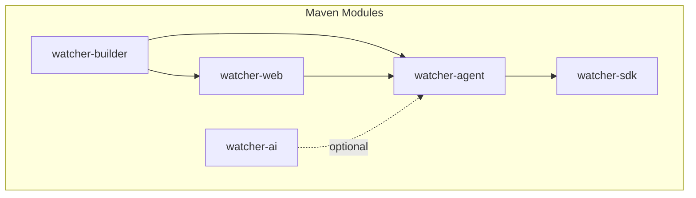
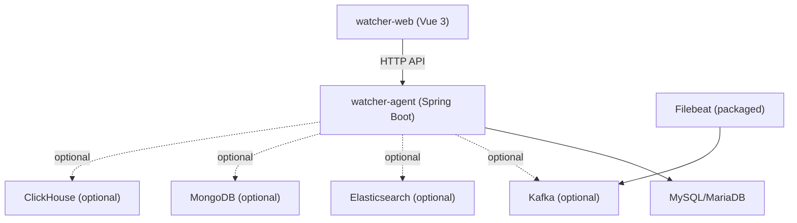
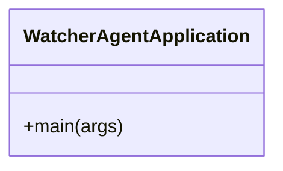
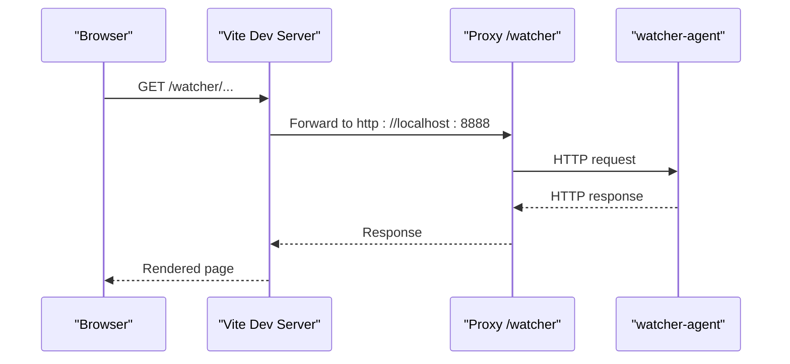
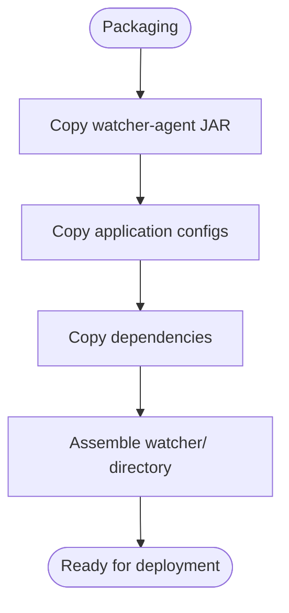
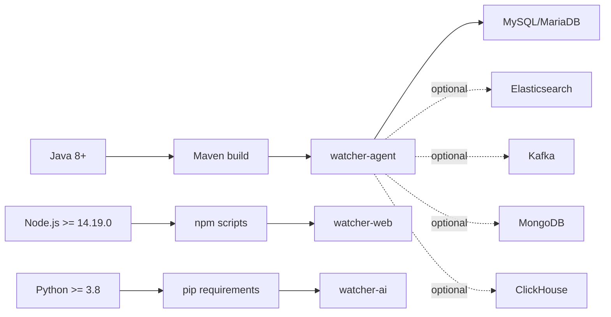

# Getting Started

<cite>
**Referenced Files in This Document**
- [Readme.md](file://Readme.md)
- [pom.xml](file://pom.xml)
- [watcher-agent/src/main/resources/application.properties](file://watcher-agent/src/main/resources/application.properties)
- [watcher-agent/src/main/resources/application-local.properties](file://watcher-agent/src/main/resources/application-local.properties)
- [watcher-agent/src/main/resources/application-dev.properties](file://watcher-agent/src/main/resources/application-dev.properties)
- [watcher-agent/src/main/resources/schema-mysql.sql](file://watcher-agent/src/main/resources/schema-mysql.sql)
- [watcher-builder/assembly/components/filebeat/filebeat-8.0.1-linux-x86_64/filebeat.yml](file://watcher-builder/assembly/components/filebeat/filebeat-8.0.1-linux-x86_64/filebeat.yml)
- [watcher-web/package.json](file://watcher-web/package.json)
- [watcher-web/vite.config.ts](file://watcher-web/vite.config.ts)
- [watcher-web/public/config.json](file://watcher-web/public/config.json)
- [watcher-web/src/main.ts](file://watcher-web/src/main.ts)
- [watcher-ai/requirements.txt](file://watcher-ai/requirements.txt)
- [watcher-agent/src/main/java/com/virtual/cloud/om/agent/WatcherAgentApplication.java](file://watcher-agent/src/main/java/com/virtual/cloud/om/agent/WatcherAgentApplication.java)
</cite>

## Table of Contents
1. [Introduction](#introduction)
2. [Project Structure](#project-structure)
3. [Core Components](#core-components)
4. [Architecture Overview](#architecture-overview)
5. [Detailed Component Analysis](#detailed-component-analysis)
6. [Dependency Analysis](#dependency-analysis)
7. [Performance Considerations](#performance-considerations)
8. [Troubleshooting Guide](#troubleshooting-guide)
9. [Conclusion](#conclusion)
10. [Appendices](#appendices)

## Introduction
This guide helps you install and run the ShowTime platform locally for development. ShowTime is a monitoring platform with a Java backend (Spring Boot), Vue 3 frontend, and optional integrations with Elasticsearch, Kafka, MongoDB, and ClickHouse. For local development, the platform can run with MySQL/MariaDB and minimal middleware toggles.

Key capabilities include:
- Centralized monitoring and alerting
- Log collection and retrieval
- Metrics aggregation and reporting
- Resource management and plugin integration

The guide covers prerequisites, environment setup, database initialization, service startup, quick start examples, and verification steps.

## Project Structure
The repository is a multi-module Maven project. The most relevant modules for getting started are:
- watcher-agent: Spring Boot backend service
- watcher-web: Vue 3 frontend
- watcher-builder: packaging and deployment assets (including Filebeat)
- watcher-sdk: shared utilities and DTOs
- watcher-ai: Python AI module (optional)

**Diagram sources**
- [pom.xml:11-18](file://pom.xml#L11-L18)
- [Readme.md:29-38](file://Readme.md#L29-L38)

**Section sources**
- [Readme.md:27-38](file://Readme.md#L27-L38)
- [pom.xml:11-18](file://pom.xml#L11-L18)

## Core Components
- Backend service (watcher-agent):
  - Spring Boot application with MySQL/MariaDB connectivity
  - Local profile disables optional middleware (Elasticsearch, Kafka, MongoDB, ClickHouse, Quartz)
  - Dev profile enables optional middleware and external services
- Frontend (watcher-web):
  - Vue 3 application with Vite dev server
  - Proxy configured to forward API requests to the backend
- Packaging (watcher-builder):
  - Includes Filebeat configuration for log shipping
- AI module (watcher-ai):
  - Python dependencies for AI-related tasks

Prerequisites summary:
- Java 8+ (Java 1.8 property in Maven; modern JDK recommended)
- Node.js >= 14.19.0
- Python >= 3.8 (for AI module)
- Database: MySQL or MariaDB
- Optional infrastructure: Kafka, Redis, Elasticsearch, Filebeat, Kibana, ClickHouse

**Section sources**
- [pom.xml:29](file://pom.xml#L29)
- [watcher-web/package.json:17-19](file://watcher-web/package.json#L17-L19)
- [watcher-ai/requirements.txt:1-5](file://watcher-ai/requirements.txt#L1-L5)
- [watcher-agent/src/main/resources/application-local.properties:14-20](file://watcher-agent/src/main/resources/application-local.properties#L14-L20)
- [watcher-agent/src/main/resources/application-dev.properties:3-31](file://watcher-agent/src/main/resources/application-dev.properties#L3-L31)

## Architecture Overview
The development stack centers on the watcher-agent backend and watcher-web frontend. The backend connects to MySQL/MariaDB and can optionally integrate with Elasticsearch, Kafka, MongoDB, and ClickHouse depending on the active profile. Filebeat is packaged for log shipping.

**Diagram sources**
- [watcher-agent/src/main/resources/application-local.properties:14-20](file://watcher-agent/src/main/resources/application-local.properties#L14-L20)
- [watcher-agent/src/main/resources/application-dev.properties:3-31](file://watcher-agent/src/main/resources/application-dev.properties#L3-L31)
- [watcher-builder/assembly/components/filebeat/filebeat-8.0.1-linux-x86_64/filebeat.yml:132-135](file://watcher-builder/assembly/components/filebeat/filebeat-8.0.1-linux-x86_64/filebeat.yml#L132-L135)

## Detailed Component Analysis

### Backend: watcher-agent
- Profile-driven configuration:
  - Local profile: disables optional middleware and targets MySQL
  - Dev profile: enables optional middleware and external services
- Database:
  - Uses MySQL driver by default in local profile
  - MariaDB driver supported in local profile
- Startup:
  - Spring Boot main class initializes the application context

**Diagram sources**
- [watcher-agent/src/main/java/com/virtual/cloud/om/agent/WatcherAgentApplication.java:14-27](file://watcher-agent/src/main/java/com/virtual/cloud/om/agent/WatcherAgentApplication.java#L14-L27)

**Section sources**
- [watcher-agent/src/main/resources/application-local.properties:33-36](file://watcher-agent/src/main/resources/application-local.properties#L33-L36)
- [watcher-agent/src/main/resources/application.properties:48-51](file://watcher-agent/src/main/resources/application.properties#L48-L51)
- [watcher-agent/src/main/java/com/virtual/cloud/om/agent/WatcherAgentApplication.java:14-27](file://watcher-agent/src/main/java/com/virtual/cloud/om/agent/WatcherAgentApplication.java#L14-L27)

### Frontend: watcher-web
- Development server:
  - Vite dev server runs on port 9090
  - Proxy forwards requests under /watcher to backend at http://localhost:8888
- Build and scripts:
  - Scripts include dev, build, and serve commands
- Runtime:
  - Initializes Vue app, routing, store, i18n, and plugins

**Diagram sources**
- [watcher-web/vite.config.ts:27-33](file://watcher-web/vite.config.ts#L27-L33)
- [watcher-web/public/config.json:1-3](file://watcher-web/public/config.json#L1-L3)

**Section sources**
- [watcher-web/vite.config.ts:23-34](file://watcher-web/vite.config.ts#L23-L34)
- [watcher-web/package.json:4-10](file://watcher-web/package.json#L4-L10)
- [watcher-web/src/main.ts:24-36](file://watcher-web/src/main.ts#L24-L36)

### Packaging and Filebeat
- Filebeat shipped in the builder package:
  - Kafka output configured with a topic and broker host
  - Log paths and modules are defined in the packaged configuration

**Diagram sources**
- [watcher-builder/assembly/components/filebeat/filebeat-8.0.1-linux-x86_64/filebeat.yml:132-135](file://watcher-builder/assembly/components/filebeat/filebeat-8.0.1-linux-x86_64/filebeat.yml#L132-L135)

**Section sources**
- [watcher-builder/assembly/components/filebeat/filebeat-8.0.1-linux-x86_64/filebeat.yml:132-135](file://watcher-builder/assembly/components/filebeat/filebeat-8.0.1-linux-x86_64/filebeat.yml#L132-L135)

## Dependency Analysis
- Java runtime:
  - Maven sets source/target to Java 1.8; modern JDK recommended for tooling
- Node.js:
  - Minimum version enforced by engines field
- Python:
  - AI module requires Python >= 3.8 and listed packages
- Database:
  - MySQL and MariaDB drivers supported; local profile defaults to MySQL
- Optional middleware:
  - Disabled by default in local profile; enabled in dev profile

**Diagram sources**
- [pom.xml:29](file://pom.xml#L29)
- [watcher-web/package.json:17-19](file://watcher-web/package.json#L17-L19)
- [watcher-ai/requirements.txt:1-5](file://watcher-ai/requirements.txt#L1-L5)
- [watcher-agent/src/main/resources/application-local.properties:33-36](file://watcher-agent/src/main/resources/application-local.properties#L33-L36)

**Section sources**
- [pom.xml:29](file://pom.xml#L29)
- [watcher-web/package.json:17-19](file://watcher-web/package.json#L17-L19)
- [watcher-ai/requirements.txt:1-5](file://watcher-ai/requirements.txt#L1-L5)
- [watcher-agent/src/main/resources/application-local.properties:33-36](file://watcher-agent/src/main/resources/application-local.properties#L33-L36)

## Performance Considerations
- Keep optional middleware disabled during local development to reduce resource usage.
- Use local profile for development; switch to dev profile when integrating with external systems.
- Ensure database connection pooling and query performance are tuned appropriately for your workload.

[No sources needed since this section provides general guidance]

## Troubleshooting Guide
Common setup issues and resolutions:
- Java version mismatch:
  - Confirm your JDK meets the minimum requirement; modern JDK is recommended for tooling.
- Node.js version:
  - Ensure Node.js satisfies the engines constraint.
- Database connectivity:
  - Verify MySQL/MariaDB is reachable at the configured host/port and credentials.
- Port conflicts:
  - Backend runs on 8888; frontend on 9090. Adjust ports if they conflict with existing services.
- CORS/proxy issues:
  - Confirm the Vite proxy is forwarding /watcher to the backend.

Verification steps:
- Backend health:
  - Access the Actuator health endpoint exposed by the backend.
- Frontend:
  - Open the frontend in a browser and confirm it loads without errors.
- Database:
  - Connect to the database and verify schema initialization.

**Section sources**
- [watcher-agent/src/main/resources/application-local.properties:59-60](file://watcher-agent/src/main/resources/application-local.properties#L59-L60)
- [watcher-web/vite.config.ts:23-34](file://watcher-web/vite.config.ts#L23-L34)
- [watcher-agent/src/main/resources/application.properties:10-11](file://watcher-agent/src/main/resources/application.properties#L10-L11)

## Conclusion
You now have the essentials to set up ShowTime locally: Java, Node.js, Python, and a relational database. Use the local profile for a streamlined development experience and enable optional middleware later as needed. Follow the steps below to get started quickly.

[No sources needed since this section summarizes without analyzing specific files]

## Appendices

### Step-by-Step Installation and Setup

1) Prerequisites
- Install Java 8+ (modern JDK recommended)
- Install Node.js >= 14.19.0
- Install Python >= 3.8 (for AI module)
- Install MySQL or MariaDB

2) Clone and build the backend
- Navigate to the repository root
- Build the project using Maven to compile modules and prepare dependencies

3) Initialize the database
- Create the database and run the schema script to set up tables and indices

4) Configure environment
- Local profile:
  - Uses MySQL driver and disables optional middleware
  - Update datasource URL, username, and password as needed
- Dev profile:
  - Enables optional middleware and external services; adjust endpoints accordingly

5) Start the backend
- Run the Spring Boot application from the watcher-agent module

6) Start the frontend
- Install Node.js dependencies
- Start the Vite development server

7) Access the web interface
- Open the frontend URL in a browser
- Use the configured backend proxy for API requests

8) Quick start examples
- Add resources:
  - Use the resource management features in the frontend to register new resources
- Configure monitoring:
  - Enable and configure collectors according to your environment
- Access the web interface:
  - Browse to the frontend URL and log in with default credentials

9) Verification
- Confirm backend health endpoint is reachable
- Verify frontend loads without console errors
- Ensure database connections and schema are present

**Section sources**
- [pom.xml:29](file://pom.xml#L29)
- [watcher-web/package.json:4-10](file://watcher-web/package.json#L4-L10)
- [watcher-agent/src/main/resources/application-local.properties:33-36](file://watcher-agent/src/main/resources/application-local.properties#L33-L36)
- [watcher-agent/src/main/resources/application-dev.properties:3-31](file://watcher-agent/src/main/resources/application-dev.properties#L3-L31)
- [watcher-agent/src/main/resources/schema-mysql.sql:5-6](file://watcher-agent/src/main/resources/schema-mysql.sql#L5-L6)
- [watcher-web/vite.config.ts:23-34](file://watcher-web/vite.config.ts#L23-L34)
- [watcher-web/public/config.json:1-3](file://watcher-web/public/config.json#L1-L3)