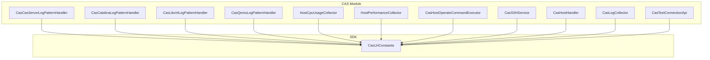
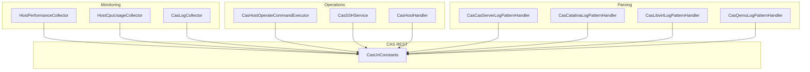
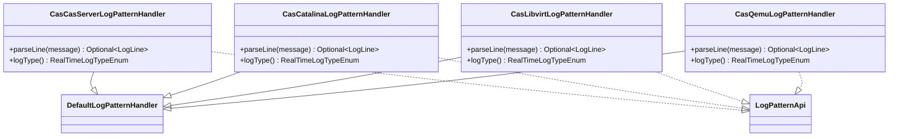
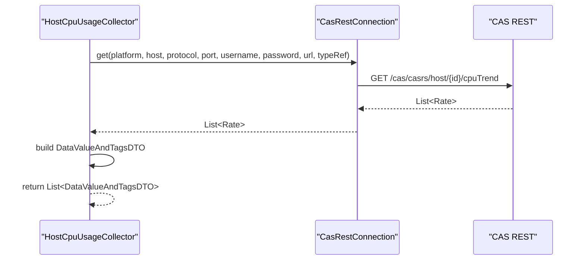
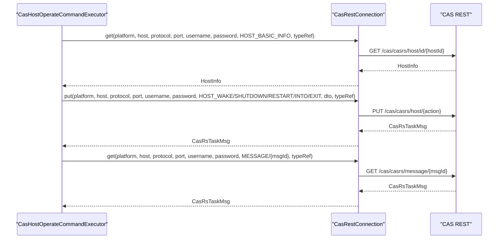
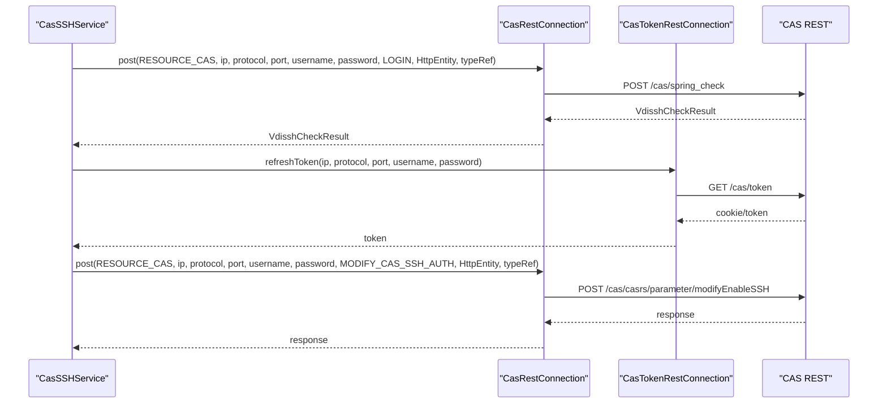
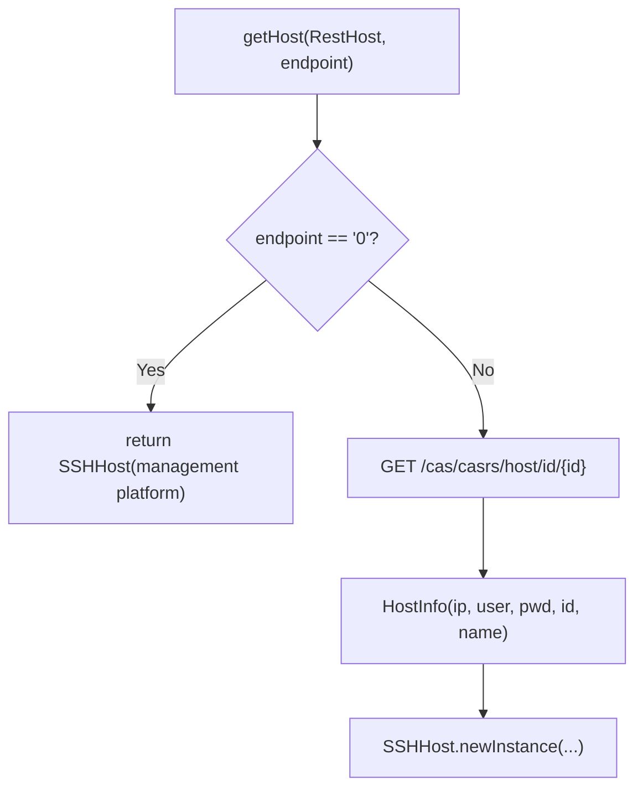
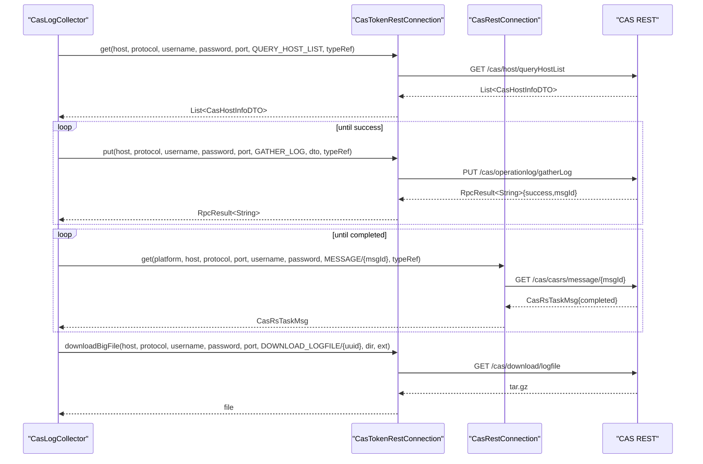
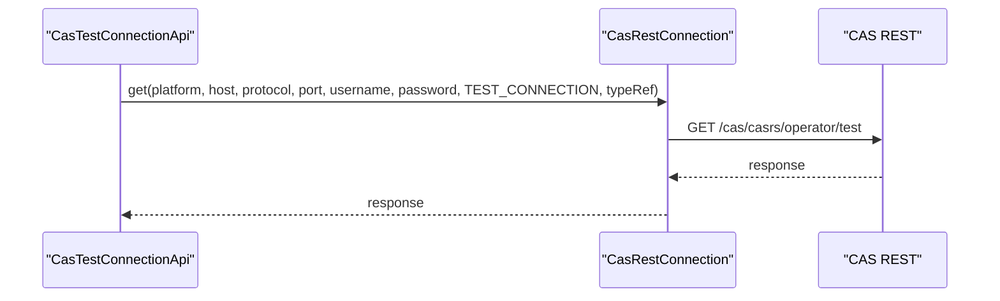
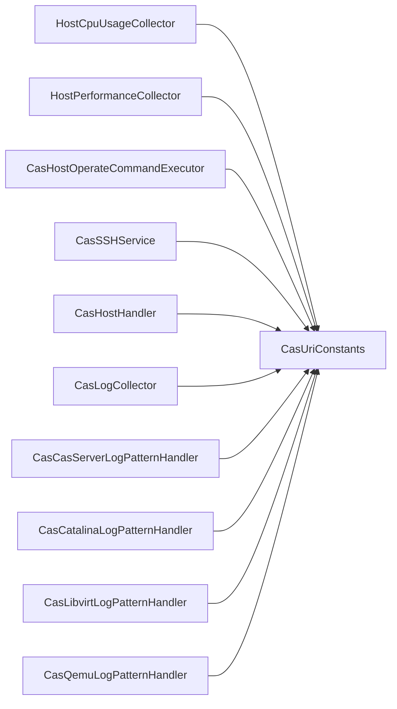

# CAS Platform Module

<cite>
**Referenced Files in This Document**
- [CasCasServerLogPatternHandler.java](file://watcher-cas/src/main/java/com/virtual/cloud/om/cas/service/CasCasServerLogPatternHandler.java)
- [CasCatalinaLogPatternHandler.java](file://watcher-cas/src/main/java/com/virtual/cloud/om/cas/service/CasCatalinaLogPatternHandler.java)
- [CasLibvirtLogPatternHandler.java](file://watcher-cas/src/main/java/com/virtual/cloud/om/cas/service/CasLibvirtLogPatternHandler.java)
- [CasQemuLogPatternHandler.java](file://watcher-cas/src/main/java/com/virtual/cloud/om/cas/service/CasQemuLogPatternHandler.java)
- [CasHostHandler.java](file://watcher-cas/src/main/java/com/virtual/cloud/om/cas/service/CasHostHandler.java)
- [CasSSHService.java](file://watcher-cas/src/main/java/com/virtual/cloud/om/cas/service/ssh/CasSSHService.java)
- [HostCpuUsageCollector.java](file://watcher-cas/src/main/java/com/virtual/cloud/om/cas/service/severPerformanceMonitor/HostCpuUsageCollector.java)
- [HostPerformanceCollector.java](file://watcher-cas/src/main/java/com/virtual/cloud/om/cas/service/report/HostPerformanceCollector.java)
- [CasLogCollector.java](file://watcher-cas/src/main/java/com/virtual/cloud/om/cas/service/log/CasLogCollector.java)
- [CasTestConnectionApi.java](file://watcher-cas/src/main/java/com/virtual/cloud/om/cas/service/CasTestConnectionApi.java)
- [CasHostOperateCommandExecutor.java](file://watcher-cas/src/main/java/com/virtual/cloud/om/cas/service/operate/CasHostOperateCommandExecutor.java)
- [CasUriConstants.java](file://watcher-sdk/src/main/java/com/virtual/cloud/om/sdk/constant/uri/CasUriConstants.java)
</cite>

## Table of Contents
1. [Introduction](#introduction)
2. [Project Structure](#project-structure)
3. [Core Components](#core-components)
4. [Architecture Overview](#architecture-overview)
5. [Detailed Component Analysis](#detailed-component-analysis)
6. [Dependency Analysis](#dependency-analysis)
7. [Performance Considerations](#performance-considerations)
8. [Troubleshooting Guide](#troubleshooting-guide)
9. [Conclusion](#conclusion)
10. [Appendices](#appendices)

## Introduction
This document describes the CAS (Cloud Application Services) platform monitoring module. It covers the metrics collection capabilities for cluster basics, host performance, VM statistics, and storage information, along with the 20+ specialized collectors for CPU usage, memory consumption, disk I/O, network throughput, and virtual machine operations. It also documents the log pattern handlers for parsing CAS-specific log formats (server logs, Catalina logs, libvirt logs, QEMU logs), SSH authentication mechanisms, host operation command executors for VM management, and integration with CAS REST APIs. Guidance is included for configuration, metric interpretation, and troubleshooting CAS-specific monitoring challenges.

## Project Structure
The CAS monitoring module resides under watcher-cas and integrates with watcher-sdk for shared REST clients, DTOs, and URI constants. Key areas:
- Log parsing: dedicated handlers for CAS server, Catalina, libvirt, and QEMU logs
- Metrics collection: cluster/host/VM collectors for CPU, memory, disk I/O, network, and storage
- Operations: host and VM operation executors via CAS REST APIs
- Authentication: SSH enablement and verification against CAS endpoints
- Logging: batch log collection and download from CAS

**Diagram sources**
- [CasCasServerLogPatternHandler.java:1-52](file://watcher-cas/src/main/java/com/virtual/cloud/om/cas/service/CasCasServerLogPatternHandler.java#L1-L52)
- [CasCatalinaLogPatternHandler.java:1-52](file://watcher-cas/src/main/java/com/virtual/cloud/om/cas/service/CasCatalinaLogPatternHandler.java#L1-L52)
- [CasLibvirtLogPatternHandler.java:1-52](file://watcher-cas/src/main/java/com/virtual/cloud/om/cas/service/CasLibvirtLogPatternHandler.java#L1-L52)
- [CasQemuLogPatternHandler.java:1-50](file://watcher-cas/src/main/java/com/virtual/cloud/om/cas/service/CasQemuLogPatternHandler.java#L1-L50)
- [HostCpuUsageCollector.java:1-216](file://watcher-cas/src/main/java/com/virtual/cloud/om/cas/service/severPerformanceMonitor/HostCpuUsageCollector.java#L1-L216)
- [HostPerformanceCollector.java:1-68](file://watcher-cas/src/main/java/com/virtual/cloud/om/cas/service/report/HostPerformanceCollector.java#L1-L68)
- [CasHostOperateCommandExecutor.java:1-158](file://watcher-cas/src/main/java/com/virtual/cloud/om/cas/service/operate/CasHostOperateCommandExecutor.java#L1-L158)
- [CasSSHService.java:1-131](file://watcher-cas/src/main/java/com/virtual/cloud/om/cas/service/ssh/CasSSHService.java#L1-L131)
- [CasHostHandler.java:1-61](file://watcher-cas/src/main/java/com/virtual/cloud/om/cas/service/CasHostHandler.java#L1-L61)
- [CasLogCollector.java:1-112](file://watcher-cas/src/main/java/com/virtual/cloud/om/cas/service/log/CasLogCollector.java#L1-L112)
- [CasTestConnectionApi.java:1-30](file://watcher-cas/src/main/java/com/virtual/cloud/om/cas/service/CasTestConnectionApi.java#L1-L30)
- [CasUriConstants.java:1-822](file://watcher-sdk/src/main/java/com/virtual/cloud/om/sdk/constant/uri/CasUriConstants.java#L1-L822)

**Section sources**
- [CasCasServerLogPatternHandler.java:1-52](file://watcher-cas/src/main/java/com/virtual/cloud/om/cas/service/CasCasServerLogPatternHandler.java#L1-L52)
- [CasCatalinaLogPatternHandler.java:1-52](file://watcher-cas/src/main/java/com/virtual/cloud/om/cas/service/CasCatalinaLogPatternHandler.java#L1-L52)
- [CasLibvirtLogPatternHandler.java:1-52](file://watcher-cas/src/main/java/com/virtual/cloud/om/cas/service/CasLibvirtLogPatternHandler.java#L1-L52)
- [CasQemuLogPatternHandler.java:1-50](file://watcher-cas/src/main/java/com/virtual/cloud/om/cas/service/CasQemuLogPatternHandler.java#L1-L50)
- [HostCpuUsageCollector.java:1-216](file://watcher-cas/src/main/java/com/virtual/cloud/om/cas/service/severPerformanceMonitor/HostCpuUsageCollector.java#L1-L216)
- [HostPerformanceCollector.java:1-68](file://watcher-cas/src/main/java/com/virtual/cloud/om/cas/service/report/HostPerformanceCollector.java#L1-L68)
- [CasHostOperateCommandExecutor.java:1-158](file://watcher-cas/src/main/java/com/virtual/cloud/om/cas/service/operate/CasHostOperateCommandExecutor.java#L1-L158)
- [CasSSHService.java:1-131](file://watcher-cas/src/main/java/com/virtual/cloud/om/cas/service/ssh/CasSSHService.java#L1-L131)
- [CasHostHandler.java:1-61](file://watcher-cas/src/main/java/com/virtual/cloud/om/cas/service/CasHostHandler.java#L1-L61)
- [CasLogCollector.java:1-112](file://watcher-cas/src/main/java/com/virtual/cloud/om/cas/service/log/CasLogCollector.java#L1-L112)
- [CasTestConnectionApi.java:1-30](file://watcher-cas/src/main/java/com/virtual/cloud/om/cas/service/CasTestConnectionApi.java#L1-L30)
- [CasUriConstants.java:1-822](file://watcher-sdk/src/main/java/com/virtual/cloud/om/sdk/constant/uri/CasUriConstants.java#L1-L822)

## Core Components
- Log pattern handlers: Parse CAS-specific log formats for server logs, Catalina logs, libvirt logs, and QEMU logs into structured log lines.
- Metrics collectors: Specialized collectors for CPU usage, memory, disk I/O, network throughput, and VM statistics across hosts and clusters.
- Host and VM operations: Command executors to manage host lifecycle and VM operations via CAS REST endpoints.
- SSH authentication: Verify and modify SSH enablement on CAS-managed hosts using CAS REST endpoints.
- Host discovery: Resolve host credentials and IDs from CAS for unified SSH access.
- Batch log collection: Trigger and download batch logs from CAS with progress polling.
- Connectivity testing: Validate CAS platform connectivity via a dedicated endpoint.

**Section sources**
- [CasCasServerLogPatternHandler.java:1-52](file://watcher-cas/src/main/java/com/virtual/cloud/om/cas/service/CasCasServerLogPatternHandler.java#L1-L52)
- [CasCatalinaLogPatternHandler.java:1-52](file://watcher-cas/src/main/java/com/virtual/cloud/om/cas/service/CasCatalinaLogPatternHandler.java#L1-L52)
- [CasLibvirtLogPatternHandler.java:1-52](file://watcher-cas/src/main/java/com/virtual/cloud/om/cas/service/CasLibvirtLogPatternHandler.java#L1-L52)
- [CasQemuLogPatternHandler.java:1-50](file://watcher-cas/src/main/java/com/virtual/cloud/om/cas/service/CasQemuLogPatternHandler.java#L1-L50)
- [HostCpuUsageCollector.java:1-216](file://watcher-cas/src/main/java/com/virtual/cloud/om/cas/service/severPerformanceMonitor/HostCpuUsageCollector.java#L1-L216)
- [HostPerformanceCollector.java:1-68](file://watcher-cas/src/main/java/com/virtual/cloud/om/cas/service/report/HostPerformanceCollector.java#L1-L68)
- [CasHostOperateCommandExecutor.java:1-158](file://watcher-cas/src/main/java/com/virtual/cloud/om/cas/service/operate/CasHostOperateCommandExecutor.java#L1-L158)
- [CasSSHService.java:1-131](file://watcher-cas/src/main/java/com/virtual/cloud/om/cas/service/ssh/CasSSHService.java#L1-L131)
- [CasHostHandler.java:1-61](file://watcher-cas/src/main/java/com/virtual/cloud/om/cas/service/CasHostHandler.java#L1-L61)
- [CasLogCollector.java:1-112](file://watcher-cas/src/main/java/com/virtual/cloud/om/cas/service/log/CasLogCollector.java#L1-L112)
- [CasTestConnectionApi.java:1-30](file://watcher-cas/src/main/java/com/virtual/cloud/om/cas/service/CasTestConnectionApi.java#L1-L30)

## Architecture Overview
The CAS monitoring module orchestrates log parsing, metrics collection, and operational tasks through CAS REST endpoints defined centrally. Components interact with CAS via typed URIs and DTOs provided by the SDK.

**Diagram sources**
- [HostPerformanceCollector.java:1-68](file://watcher-cas/src/main/java/com/virtual/cloud/om/cas/service/report/HostPerformanceCollector.java#L1-L68)
- [HostCpuUsageCollector.java:1-216](file://watcher-cas/src/main/java/com/virtual/cloud/om/cas/service/severPerformanceMonitor/HostCpuUsageCollector.java#L1-L216)
- [CasLogCollector.java:1-112](file://watcher-cas/src/main/java/com/virtual/cloud/om/cas/service/log/CasLogCollector.java#L1-L112)
- [CasHostOperateCommandExecutor.java:1-158](file://watcher-cas/src/main/java/com/virtual/cloud/om/cas/service/operate/CasHostOperateCommandExecutor.java#L1-L158)
- [CasSSHService.java:1-131](file://watcher-cas/src/main/java/com/virtual/cloud/om/cas/service/ssh/CasSSHService.java#L1-L131)
- [CasHostHandler.java:1-61](file://watcher-cas/src/main/java/com/virtual/cloud/om/cas/service/CasHostHandler.java#L1-L61)
- [CasCasServerLogPatternHandler.java:1-52](file://watcher-cas/src/main/java/com/virtual/cloud/om/cas/service/CasCasServerLogPatternHandler.java#L1-L52)
- [CasCatalinaLogPatternHandler.java:1-52](file://watcher-cas/src/main/java/com/virtual/cloud/om/cas/service/CasCatalinaLogPatternHandler.java#L1-L52)
- [CasLibvirtLogPatternHandler.java:1-52](file://watcher-cas/src/main/java/com/virtual/cloud/om/cas/service/CasLibvirtLogPatternHandler.java#L1-L52)
- [CasQemuLogPatternHandler.java:1-50](file://watcher-cas/src/main/java/com/virtual/cloud/om/cas/service/CasQemuLogPatternHandler.java#L1-L50)
- [CasUriConstants.java:1-822](file://watcher-sdk/src/main/java/com/virtual/cloud/om/sdk/constant/uri/CasUriConstants.java#L1-L822)

## Detailed Component Analysis

### Log Pattern Handlers
These handlers parse CAS-specific log formats into structured log lines for downstream processing.

**Diagram sources**
- [CasCasServerLogPatternHandler.java:1-52](file://watcher-cas/src/main/java/com/virtual/cloud/om/cas/service/CasCasServerLogPatternHandler.java#L1-L52)
- [CasCatalinaLogPatternHandler.java:1-52](file://watcher-cas/src/main/java/com/virtual/cloud/om/cas/service/CasCatalinaLogPatternHandler.java#L1-L52)
- [CasLibvirtLogPatternHandler.java:1-52](file://watcher-cas/src/main/java/com/virtual/cloud/om/cas/service/CasLibvirtLogPatternHandler.java#L1-L52)
- [CasQemuLogPatternHandler.java:1-50](file://watcher-cas/src/main/java/com/virtual/cloud/om/cas/service/CasQemuLogPatternHandler.java#L1-L50)

**Section sources**
- [CasCasServerLogPatternHandler.java:1-52](file://watcher-cas/src/main/java/com/virtual/cloud/om/cas/service/CasCasServerLogPatternHandler.java#L1-L52)
- [CasCatalinaLogPatternHandler.java:1-52](file://watcher-cas/src/main/java/com/virtual/cloud/om/cas/service/CasCatalinaLogPatternHandler.java#L1-L52)
- [CasLibvirtLogPatternHandler.java:1-52](file://watcher-cas/src/main/java/com/virtual/cloud/om/cas/service/CasLibvirtLogPatternHandler.java#L1-L52)
- [CasQemuLogPatternHandler.java:1-50](file://watcher-cas/src/main/java/com/virtual/cloud/om/cas/service/CasQemuLogPatternHandler.java#L1-L50)

### Host and VM Metrics Collection
The collectors query CAS REST endpoints to gather performance metrics for hosts, clusters, and domains.

**Diagram sources**
- [HostCpuUsageCollector.java:1-216](file://watcher-cas/src/main/java/com/virtual/cloud/om/cas/service/severPerformanceMonitor/HostCpuUsageCollector.java#L1-L216)
- [CasUriConstants.java:154-155](file://watcher-sdk/src/main/java/com/virtual/cloud/om/sdk/constant/uri/CasUriConstants.java#L154-L155)

**Section sources**
- [HostCpuUsageCollector.java:1-216](file://watcher-cas/src/main/java/com/virtual/cloud/om/cas/service/severPerformanceMonitor/HostCpuUsageCollector.java#L1-L216)
- [HostPerformanceCollector.java:1-68](file://watcher-cas/src/main/java/com/virtual/cloud/om/cas/service/report/HostPerformanceCollector.java#L1-L68)
- [CasUriConstants.java:1-822](file://watcher-sdk/src/main/java/com/virtual/cloud/om/sdk/constant/uri/CasUriConstants.java#L1-L822)

### Host Operation Command Executor
Executes host lifecycle operations (wake, shutdown, restart, enter/exit maintenance) and refreshes status.

**Diagram sources**
- [CasHostOperateCommandExecutor.java:1-158](file://watcher-cas/src/main/java/com/virtual/cloud/om/cas/service/operate/CasHostOperateCommandExecutor.java#L1-L158)
- [CasUriConstants.java:16-20](file://watcher-sdk/src/main/java/com/virtual/cloud/om/sdk/constant/uri/CasUriConstants.java#L16-L20)

**Section sources**
- [CasHostOperateCommandExecutor.java:1-158](file://watcher-cas/src/main/java/com/virtual/cloud/om/cas/service/operate/CasHostOperateCommandExecutor.java#L1-L158)
- [CasUriConstants.java:1-822](file://watcher-sdk/src/main/java/com/virtual/cloud/om/sdk/constant/uri/CasUriConstants.java#L1-L822)

### SSH Authentication Mechanisms
Verifies user SSH credentials and toggles SSH enablement on CAS-managed hosts.

**Diagram sources**
- [CasSSHService.java:1-131](file://watcher-cas/src/main/java/com/virtual/cloud/om/cas/service/ssh/CasSSHService.java#L1-L131)
- [CasUriConstants.java:800-819](file://watcher-sdk/src/main/java/com/virtual/cloud/om/sdk/constant/uri/CasUriConstants.java#L800-L819)

**Section sources**
- [CasSSHService.java:1-131](file://watcher-cas/src/main/java/com/virtual/cloud/om/cas/service/ssh/CasSSHService.java#L1-L131)
- [CasUriConstants.java:800-822](file://watcher-sdk/src/main/java/com/virtual/cloud/om/sdk/constant/uri/CasUriConstants.java#L800-L822)

### Host Discovery and Credentials
Resolves host credentials and IDs for unified SSH access.

**Diagram sources**
- [CasHostHandler.java:1-61](file://watcher-cas/src/main/java/com/virtual/cloud/om/cas/service/CasHostHandler.java#L1-L61)
- [CasUriConstants.java:102-103](file://watcher-sdk/src/main/java/com/virtual/cloud/om/sdk/constant/uri/CasUriConstants.java#L102-L103)

**Section sources**
- [CasHostHandler.java:1-61](file://watcher-cas/src/main/java/com/virtual/cloud/om/cas/service/CasHostHandler.java#L1-L61)
- [CasUriConstants.java:1-822](file://watcher-sdk/src/main/java/com/virtual/cloud/om/sdk/constant/uri/CasUriConstants.java#L1-L822)

### Batch Log Collection
Triggers log collection on CAS hosts and downloads the resulting archive after completion.

**Diagram sources**
- [CasLogCollector.java:1-112](file://watcher-cas/src/main/java/com/virtual/cloud/om/cas/service/log/CasLogCollector.java#L1-L112)
- [CasUriConstants.java:783-798](file://watcher-sdk/src/main/java/com/virtual/cloud/om/sdk/constant/uri/CasUriConstants.java#L783-L798)

**Section sources**
- [CasLogCollector.java:1-112](file://watcher-cas/src/main/java/com/virtual/cloud/om/cas/service/log/CasLogCollector.java#L1-L112)
- [CasUriConstants.java:783-798](file://watcher-sdk/src/main/java/com/virtual/cloud/om/sdk/constant/uri/CasUriConstants.java#L783-L798)

### Connectivity Testing
Validates CAS platform connectivity using a test endpoint.

**Diagram sources**
- [CasTestConnectionApi.java:1-30](file://watcher-cas/src/main/java/com/virtual/cloud/om/cas/service/CasTestConnectionApi.java#L1-L30)
- [CasUriConstants.java](file://watcher-sdk/src/main/java/com/virtual/cloud/om/sdk/constant/uri/CasUriConstants.java#L15)

**Section sources**
- [CasTestConnectionApi.java:1-30](file://watcher-cas/src/main/java/com/virtual/cloud/om/cas/service/CasTestConnectionApi.java#L1-L30)
- [CasUriConstants.java](file://watcher-sdk/src/main/java/com/virtual/cloud/om/sdk/constant/uri/CasUriConstants.java#L15)

## Dependency Analysis
The CAS module depends on SDK-provided REST connections and URI constants. The following diagram highlights key dependencies among major components.

**Diagram sources**
- [HostCpuUsageCollector.java:1-216](file://watcher-cas/src/main/java/com/virtual/cloud/om/cas/service/severPerformanceMonitor/HostCpuUsageCollector.java#L1-L216)
- [HostPerformanceCollector.java:1-68](file://watcher-cas/src/main/java/com/virtual/cloud/om/cas/service/report/HostPerformanceCollector.java#L1-L68)
- [CasHostOperateCommandExecutor.java:1-158](file://watcher-cas/src/main/java/com/virtual/cloud/om/cas/service/operate/CasHostOperateCommandExecutor.java#L1-L158)
- [CasSSHService.java:1-131](file://watcher-cas/src/main/java/com/virtual/cloud/om/cas/service/ssh/CasSSHService.java#L1-L131)
- [CasHostHandler.java:1-61](file://watcher-cas/src/main/java/com/virtual/cloud/om/cas/service/CasHostHandler.java#L1-L61)
- [CasLogCollector.java:1-112](file://watcher-cas/src/main/java/com/virtual/cloud/om/cas/service/log/CasLogCollector.java#L1-L112)
- [CasCasServerLogPatternHandler.java:1-52](file://watcher-cas/src/main/java/com/virtual/cloud/om/cas/service/CasCasServerLogPatternHandler.java#L1-L52)
- [CasCatalinaLogPatternHandler.java:1-52](file://watcher-cas/src/main/java/com/virtual/cloud/om/cas/service/CasCatalinaLogPatternHandler.java#L1-L52)
- [CasLibvirtLogPatternHandler.java:1-52](file://watcher-cas/src/main/java/com/virtual/cloud/om/cas/service/CasLibvirtLogPatternHandler.java#L1-L52)
- [CasQemuLogPatternHandler.java:1-50](file://watcher-cas/src/main/java/com/virtual/cloud/om/cas/service/CasQemuLogPatternHandler.java#L1-L50)
- [CasUriConstants.java:1-822](file://watcher-sdk/src/main/java/com/virtual/cloud/om/sdk/constant/uri/CasUriConstants.java#L1-L822)

**Section sources**
- [CasUriConstants.java:1-822](file://watcher-sdk/src/main/java/com/virtual/cloud/om/sdk/constant/uri/CasUriConstants.java#L1-L822)

## Performance Considerations
- Parallel collection: Some collectors stream and process lists in parallel to reduce latency when querying multiple hosts or clusters.
- Minimal retries: Authentication and operation flows handle transient errors and retry conditions carefully to avoid unnecessary load.
- Polling intervals: Log collection and task completion polling use fixed intervals; tuning these may impact responsiveness and load.
- Endpoint selection: Prefer targeted queries (by host/cluster/domain IDs) to minimize payload sizes and improve throughput.

[No sources needed since this section provides general guidance]

## Troubleshooting Guide
Common issues and resolutions:
- SSH authentication failures: Verify credentials and permissions via the login endpoint; ensure required permissions are present before enabling SSH.
- Operation timeouts: Host operations may take time; confirm task completion via message endpoints and handle transient HTTP client errors gracefully.
- Log collection stuck: Ensure only valid host IDs are provided; invalid IDs can block collection queues. Monitor message completion and retry on failure.
- Connectivity tests failing: Confirm the test endpoint is reachable and CAS is responding; check network policies and firewall rules.

**Section sources**
- [CasSSHService.java:42-67](file://watcher-cas/src/main/java/com/virtual/cloud/om/cas/service/ssh/CasSSHService.java#L42-L67)
- [CasHostOperateCommandExecutor.java:50-65](file://watcher-cas/src/main/java/com/virtual/cloud/om/cas/service/operate/CasHostOperateCommandExecutor.java#L50-L65)
- [CasLogCollector.java:35-102](file://watcher-cas/src/main/java/com/virtual/cloud/om/cas/service/log/CasLogCollector.java#L35-L102)
- [CasTestConnectionApi.java:18-23](file://watcher-cas/src/main/java/com/virtual/cloud/om/cas/service/CasTestConnectionApi.java#L18-L23)

## Conclusion
The CAS monitoring module provides comprehensive coverage for log parsing, metrics collection, host/VM operations, SSH authentication, and batch log collection. Its design leverages SDK-defined REST endpoints and URI constants to integrate tightly with the CAS platform, enabling robust monitoring and operational workflows.

[No sources needed since this section summarizes without analyzing specific files]

## Appendices

### Configuration Examples
- SSH enablement toggle: Use the modify endpoint to set SSH enablement and verify via the find endpoint.
- Log collection: Provide a time window and target host IDs; the collector validates host IDs against CAS and polls for completion.
- Metrics collection: Select appropriate collectors by tags (host IDs, cluster IDs, domain IDs) to scope queries efficiently.

**Section sources**
- [CasSSHService.java:69-100](file://watcher-cas/src/main/java/com/virtual/cloud/om/cas/service/ssh/CasSSHService.java#L69-L100)
- [CasLogCollector.java:35-102](file://watcher-cas/src/main/java/com/virtual/cloud/om/cas/service/log/CasLogCollector.java#L35-L102)
- [HostCpuUsageCollector.java:44-58](file://watcher-cas/src/main/java/com/virtual/cloud/om/cas/service/severPerformanceMonitor/HostCpuUsageCollector.java#L44-L58)

### Metric Interpretation Guidelines
- CPU usage: Collected trends represent utilization rates; interpret spikes as potential contention or workload bursts.
- Memory usage: Monitor growth trends to detect leaks or misconfigurations.
- Disk I/O and network throughput: Use top-N collectors to identify bottlenecks per host or cluster.
- VM statistics: Track CPU, memory, disk, and network trends for individual domains to correlate performance with guest activity.

**Section sources**
- [HostCpuUsageCollector.java:1-216](file://watcher-cas/src/main/java/com/virtual/cloud/om/cas/service/severPerformanceMonitor/HostCpuUsageCollector.java#L1-L216)
- [HostPerformanceCollector.java:1-68](file://watcher-cas/src/main/java/com/virtual/cloud/om/cas/service/report/HostPerformanceCollector.java#L1-L68)