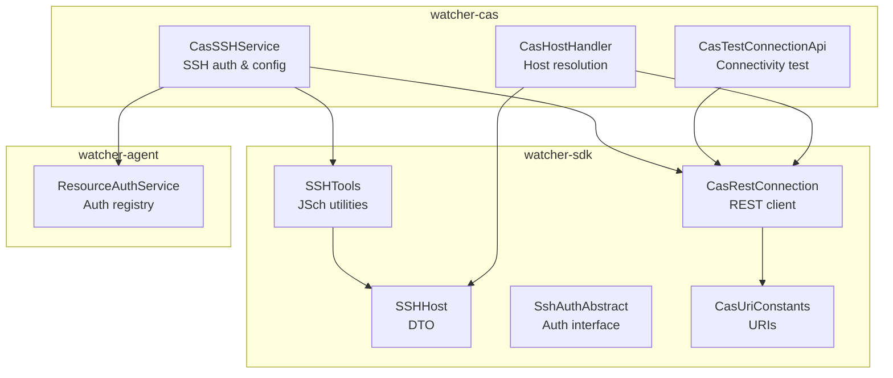
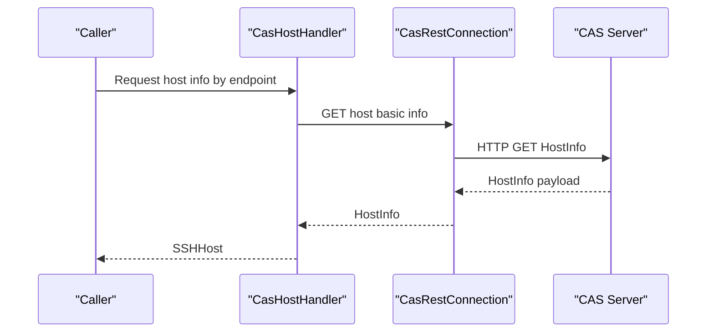
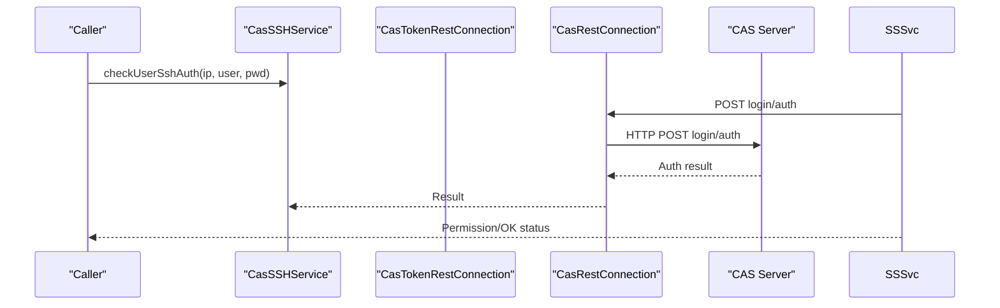
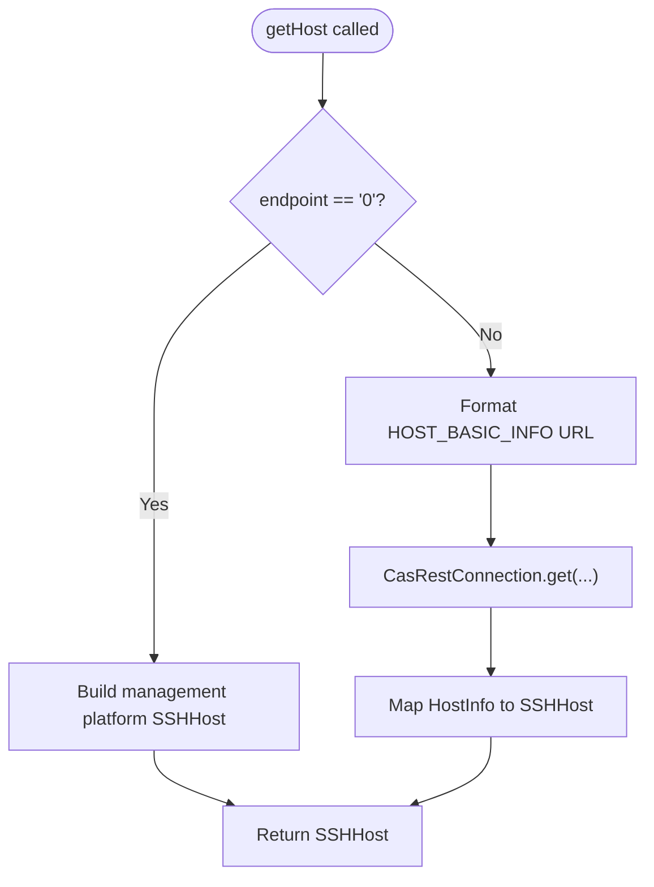
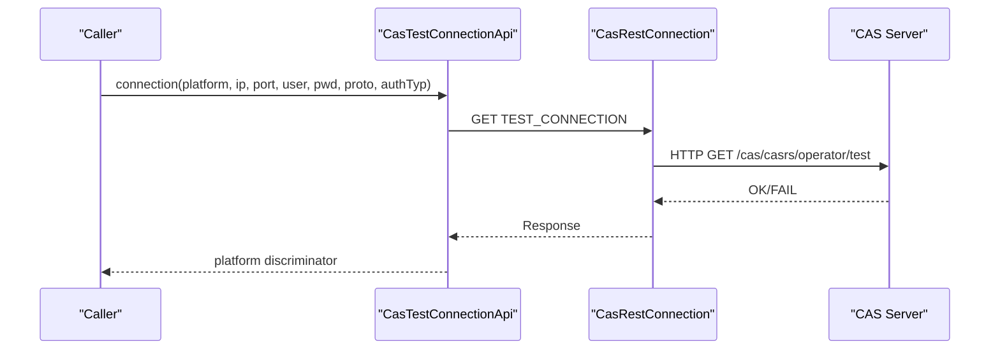
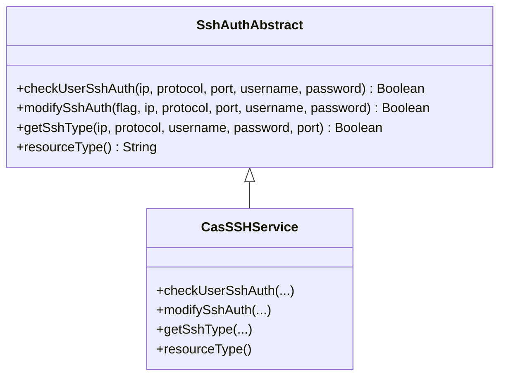
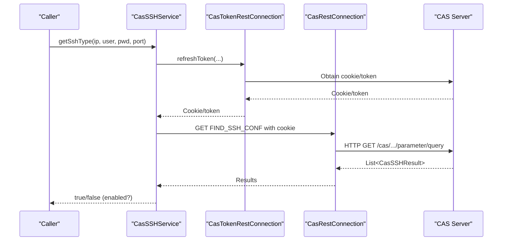
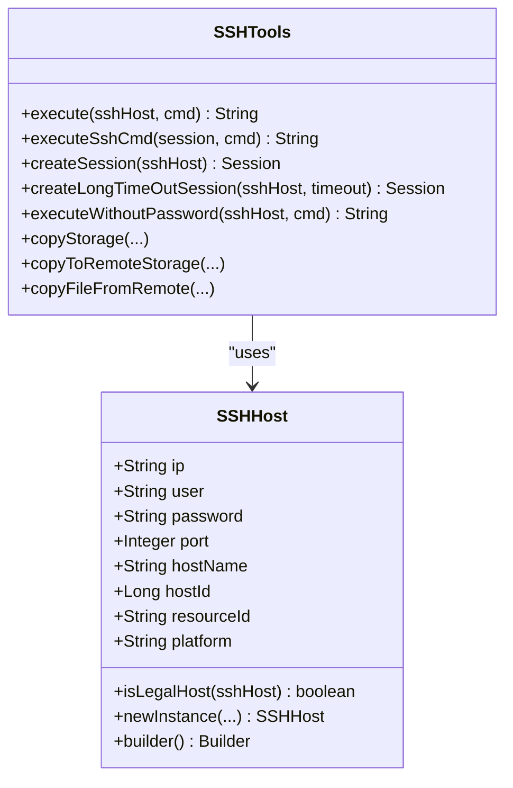
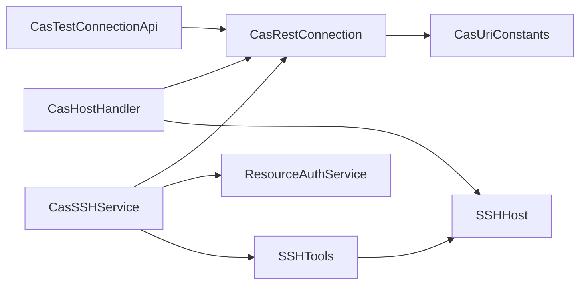

# Host Management & SSH Operations

<cite>
**Referenced Files in This Document**
- [CasHostHandler.java](file://watcher-cas/src/main/java/com/virtual/cloud/om/cas/service/CasHostHandler.java)
- [CasTestConnectionApi.java](file://watcher-cas/src/main/java/com/virtual/cloud/om/cas/service/CasTestConnectionApi.java)
- [CasSSHService.java](file://watcher-cas/src/main/java/com/virtual/cloud/om/cas/service/ssh/CasSSHService.java)
- [SSHHost.java](file://watcher-sdk/src/main/java/com/virtual/cloud/om/sdk/dto/SSHHost.java)
- [SSHTools.java](file://watcher-sdk/src/main/java/com/virtual/cloud/om/sdk/utils/SSHTools.java)
- [SshAuthAbstract.java](file://watcher-sdk/src/main/java/com/virtual/cloud/om/sdk/api/SshAuthAbstract.java)
- [CasUriConstants.java](file://watcher-sdk/src/main/java/com/virtual/cloud/om/sdk/constant/uri/CasUriConstants.java)
- [CasRestConnection.java](file://watcher-sdk/src/main/java/com/virtual/cloud/om/sdk/config/rest/cas/CasRestConnection.java)
- [ResourceAuthService.java](file://watcher-agent/src/main/java/com/virtual/cloud/om/agent/service/ssh/ResourceAuthService.java)
- [VdisshCheckResult.java](file://watcher-sdk/src/main/java/com/virtual/cloud/om/sdk/dto/VdisshCheckResult.java)
- [CasSSHResult.java](file://watcher-sdk/src/main/java/com/virtual/cloud/om/sdk/dto/CasSSHResult.java)
- [CasModifySSHDTO.java](file://watcher-sdk/src/main/java/com/virtual/cloud/om/sdk/dto/CasModifySSHDTO.java)
</cite>

## Table of Contents
1. [Introduction](#introduction)
2. [Project Structure](#project-structure)
3. [Core Components](#core-components)
4. [Architecture Overview](#architecture-overview)
5. [Detailed Component Analysis](#detailed-component-analysis)
6. [Dependency Analysis](#dependency-analysis)
7. [Performance Considerations](#performance-considerations)
8. [Troubleshooting Guide](#troubleshooting-guide)
9. [Conclusion](#conclusion)
10. [Appendices](#appendices)

## Introduction
This document explains the CAS host management and SSH operations subsystem in the ShowTime project. It focuses on:
- Discovering and resolving CAS hosts into SSH targets
- Managing host configuration and status visibility
- Executing secure SSH operations against remote hosts
- Validating connectivity and authentication via a dedicated test connection API
- Implementing SSH authentication checks, enabling/disabling SSH, and retrieving SSH configuration
- Integrating with the broader CAS monitoring ecosystem and host lifecycle processes

## Project Structure
The CAS host management and SSH operations span two primary modules:
- watcher-cas: CAS-specific implementations for host resolution, SSH authentication, and test connectivity
- watcher-sdk: Shared DTOs, utilities, REST clients, and abstractions used across platforms

**Diagram sources**
- [CasHostHandler.java:26-60](file://watcher-cas/src/main/java/com/virtual/cloud/om/cas/service/CasHostHandler.java#L26-L60)
- [CasTestConnectionApi.java:15-29](file://watcher-cas/src/main/java/com/virtual/cloud/om/cas/service/CasTestConnectionApi.java#L15-L29)
- [CasSSHService.java:36-130](file://watcher-cas/src/main/java/com/virtual/cloud/om/cas/service/ssh/CasSSHService.java#L36-L130)
- [SSHHost.java:14-162](file://watcher-sdk/src/main/java/com/virtual/cloud/om/sdk/dto/SSHHost.java#L14-L162)
- [SSHTools.java:24-445](file://watcher-sdk/src/main/java/com/virtual/cloud/om/sdk/utils/SSHTools.java#L24-L445)
- [SshAuthAbstract.java:11-21](file://watcher-sdk/src/main/java/com/virtual/cloud/om/sdk/api/SshAuthAbstract.java#L11-L21)
- [CasUriConstants.java:8-822](file://watcher-sdk/src/main/java/com/virtual/cloud/om/sdk/constant/uri/CasUriConstants.java#L8-L822)
- [CasRestConnection.java:26-160](file://watcher-sdk/src/main/java/com/virtual/cloud/om/sdk/config/rest/cas/CasRestConnection.java#L26-L160)
- [ResourceAuthService.java:21-29](file://watcher-agent/src/main/java/com/virtual/cloud/om/agent/service/ssh/ResourceAuthService.java#L21-L29)

**Section sources**
- [CasHostHandler.java:26-60](file://watcher-cas/src/main/java/com/virtual/cloud/om/cas/service/CasHostHandler.java#L26-L60)
- [CasTestConnectionApi.java:15-29](file://watcher-cas/src/main/java/com/virtual/cloud/om/cas/service/CasTestConnectionApi.java#L15-L29)
- [CasSSHService.java:36-130](file://watcher-cas/src/main/java/com/virtual/cloud/om/cas/service/ssh/CasSSHService.java#L36-L130)
- [SSHHost.java:14-162](file://watcher-sdk/src/main/java/com/virtual/cloud/om/sdk/dto/SSHHost.java#L14-L162)
- [SSHTools.java:24-445](file://watcher-sdk/src/main/java/com/virtual/cloud/om/sdk/utils/SSHTools.java#L24-L445)
- [SshAuthAbstract.java:11-21](file://watcher-sdk/src/main/java/com/virtual/cloud/om/sdk/api/SshAuthAbstract.java#L11-L21)
- [CasUriConstants.java:8-822](file://watcher-sdk/src/main/java/com/virtual/cloud/om/sdk/constant/uri/CasUriConstants.java#L8-L822)
- [CasRestConnection.java:26-160](file://watcher-sdk/src/main/java/com/virtual/cloud/om/sdk/config/rest/cas/CasRestConnection.java#L26-L160)
- [ResourceAuthService.java:21-29](file://watcher-agent/src/main/java/com/virtual/cloud/om/agent/service/ssh/ResourceAuthService.java#L21-L29)

## Core Components
- CasHostHandler: Resolves CAS hosts into SSHHost instances and enumerates host IDs via REST calls.
- CasTestConnectionApi: Validates CAS connectivity and credentials using a platform-specific test endpoint.
- CasSSHService: Implements SSH authentication verification, SSH enablement toggling, and SSH configuration retrieval.
- SSHHost: Encapsulates SSH target attributes and builders for consistent construction.
- SSHTools: Provides low-level SSH utilities using JSch for command execution, file copy, and session management.
- SshAuthAbstract: Defines the contract for SSH authentication operations across platforms.
- CasUriConstants: Centralizes URIs for CAS REST endpoints used by host and SSH operations.
- CasRestConnection: Manages REST client lifecycle and HTTP exchanges with CAS.
- ResourceAuthService: Registers and dispatches SSH authentication implementations by resource type.

**Section sources**
- [CasHostHandler.java:26-60](file://watcher-cas/src/main/java/com/virtual/cloud/om/cas/service/CasHostHandler.java#L26-L60)
- [CasTestConnectionApi.java:15-29](file://watcher-cas/src/main/java/com/virtual/cloud/om/cas/service/CasTestConnectionApi.java#L15-L29)
- [CasSSHService.java:36-130](file://watcher-cas/src/main/java/com/virtual/cloud/om/cas/service/ssh/CasSSHService.java#L36-L130)
- [SSHHost.java:14-162](file://watcher-sdk/src/main/java/com/virtual/cloud/om/sdk/dto/SSHHost.java#L14-L162)
- [SSHTools.java:24-445](file://watcher-sdk/src/main/java/com/virtual/cloud/om/sdk/utils/SSHTools.java#L24-L445)
- [SshAuthAbstract.java:11-21](file://watcher-sdk/src/main/java/com/virtual/cloud/om/sdk/api/SshAuthAbstract.java#L11-L21)
- [CasUriConstants.java:8-822](file://watcher-sdk/src/main/java/com/virtual/cloud/om/sdk/constant/uri/CasUriConstants.java#L8-L822)
- [CasRestConnection.java:26-160](file://watcher-sdk/src/main/java/com/virtual/cloud/om/sdk/config/rest/cas/CasRestConnection.java#L26-L160)
- [ResourceAuthService.java:21-29](file://watcher-agent/src/main/java/com/virtual/cloud/om/agent/service/ssh/ResourceAuthService.java#L21-L29)

## Architecture Overview
The CAS host management and SSH operations follow a layered design:
- Presentation/Orchestration: CasHostHandler and CasTestConnectionApi
- Authentication/Operations: CasSSHService implementing SshAuthAbstract
- Transport/Integration: CasRestConnection and CasUriConstants
- Data/Utilities: SSHHost and SSHTools

**Diagram sources**
- [CasHostHandler.java:31-42](file://watcher-cas/src/main/java/com/virtual/cloud/om/cas/service/CasHostHandler.java#L31-L42)
- [CasRestConnection.java:112-116](file://watcher-sdk/src/main/java/com/virtual/cloud/om/sdk/config/rest/cas/CasRestConnection.java#L112-L116)
- [CasUriConstants.java:98-103](file://watcher-sdk/src/main/java/com/virtual/cloud/om/sdk/constant/uri/CasUriConstants.java#L98-L103)

**Diagram sources**
- [CasSSHService.java:42-67](file://watcher-cas/src/main/java/com/virtual/cloud/om/cas/service/ssh/CasSSHService.java#L42-L67)
- [CasRestConnection.java:128-132](file://watcher-sdk/src/main/java/com/virtual/cloud/om/sdk/config/rest/cas/CasRestConnection.java#L128-L132)
- [CasUriConstants.java:8-822](file://watcher-sdk/src/main/java/com/virtual/cloud/om/sdk/constant/uri/CasUriConstants.java#L8-L822)

## Detailed Component Analysis

### CasHostHandler: Host Discovery and Resolution
Responsibilities:
- Resolve a CAS endpoint to an SSHHost for direct SSH operations
- Enumerate all host IDs for a given CAS instance
- Identify the platform type for reporting

Key behaviors:
- Special-case endpoint "0" returns a management platform SSHHost
- For other endpoints, fetches HostInfo via REST and maps to SSHHost
- Lists all hosts and returns their IDs as a set

**Diagram sources**
- [CasHostHandler.java:31-42](file://watcher-cas/src/main/java/com/virtual/cloud/om/cas/service/CasHostHandler.java#L31-L42)
- [CasRestConnection.java:112-116](file://watcher-sdk/src/main/java/com/virtual/cloud/om/sdk/config/rest/cas/CasRestConnection.java#L112-L116)
- [CasUriConstants.java:98-103](file://watcher-sdk/src/main/java/com/virtual/cloud/om/sdk/constant/uri/CasUriConstants.java#L98-L103)

**Section sources**
- [CasHostHandler.java:26-60](file://watcher-cas/src/main/java/com/virtual/cloud/om/cas/service/CasHostHandler.java#L26-L60)

### CasTestConnectionApi: Connectivity Validation
Responsibilities:
- Validate CAS connectivity and credentials using a test endpoint
- Return platform identity for routing

Behavior:
- Issues a GET to the platform’s test connection URI
- Returns platform discriminator for downstream routing

**Diagram sources**
- [CasTestConnectionApi.java:18-23](file://watcher-cas/src/main/java/com/virtual/cloud/om/cas/service/CasTestConnectionApi.java#L18-L23)
- [CasRestConnection.java:112-116](file://watcher-sdk/src/main/java/com/virtual/cloud/om/sdk/config/rest/cas/CasRestConnection.java#L112-L116)
- [CasUriConstants.java:15-15](file://watcher-sdk/src/main/java/com/virtual/cloud/om/sdk/constant/uri/CasUriConstants.java#L15-L15)

**Section sources**
- [CasTestConnectionApi.java:15-29](file://watcher-cas/src/main/java/com/virtual/cloud/om/cas/service/CasTestConnectionApi.java#L15-L29)

### CasSSHService: SSH Authentication and Configuration
Responsibilities:
- Verify user SSH permissions against CAS
- Toggle SSH enablement on CAS-managed hosts
- Retrieve current SSH configuration

Implementation highlights:
- Uses CasRestConnection for RPC-like calls to CAS endpoints
- Uses CasTokenRestConnection to obtain cookies/tokens for authenticated requests
- Parses JSON responses into typed DTOs for validation and decision-making
- Applies SM4 decryption for sensitive fields prior to REST calls

**Diagram sources**
- [SshAuthAbstract.java:11-21](file://watcher-sdk/src/main/java/com/virtual/cloud/om/sdk/api/SshAuthAbstract.java#L11-L21)
- [CasSSHService.java:36-130](file://watcher-cas/src/main/java/com/virtual/cloud/om/cas/service/ssh/CasSSHService.java#L36-L130)

**Diagram sources**
- [CasSSHService.java:102-124](file://watcher-cas/src/main/java/com/virtual/cloud/om/cas/service/ssh/CasSSHService.java#L102-L124)
- [CasRestConnection.java:112-116](file://watcher-sdk/src/main/java/com/virtual/cloud/om/sdk/config/rest/cas/CasRestConnection.java#L112-L116)
- [CasUriConstants.java:8-822](file://watcher-sdk/src/main/java/com/virtual/cloud/om/sdk/constant/uri/CasUriConstants.java#L8-L822)

**Section sources**
- [CasSSHService.java:36-130](file://watcher-cas/src/main/java/com/virtual/cloud/om/cas/service/ssh/CasSSHService.java#L36-L130)
- [VdisshCheckResult.java:13-19](file://watcher-sdk/src/main/java/com/virtual/cloud/om/sdk/dto/VdisshCheckResult.java#L13-L19)
- [CasSSHResult.java:18-24](file://watcher-sdk/src/main/java/com/virtual/cloud/om/sdk/dto/CasSSHResult.java#L18-L24)
- [CasModifySSHDTO.java:13-17](file://watcher-sdk/src/main/java/com/virtual/cloud/om/sdk/dto/CasModifySSHDTO.java#L13-L17)

### SSHHost and SSHTools: Secure Remote Operations
- SSHHost: Provides constructors and a builder to construct SSH targets consistently, including optional host metadata and platform association.
- SSHTools: Offers:
  - Command execution via JSch ChannelExec
  - File copy utilities leveraging sshpass and scp
  - Session creation with configurable timeouts and password-less modes
  - Robust error handling and exit-status validation

**Diagram sources**
- [SSHHost.java:14-162](file://watcher-sdk/src/main/java/com/virtual/cloud/om/sdk/dto/SSHHost.java#L14-L162)
- [SSHTools.java:24-445](file://watcher-sdk/src/main/java/com/virtual/cloud/om/sdk/utils/SSHTools.java#L24-L445)

**Section sources**
- [SSHHost.java:14-162](file://watcher-sdk/src/main/java/com/virtual/cloud/om/sdk/dto/SSHHost.java#L14-L162)
- [SSHTools.java:24-445](file://watcher-sdk/src/main/java/com/virtual/cloud/om/sdk/utils/SSHTools.java#L24-L445)

### Integration Patterns and Host Lifecycle
- Host discovery and enumeration feed monitoring collectors and dashboards.
- SSH operations integrate with CAS-managed host pools and clusters.
- Test connection validates credentials before provisioning or maintenance tasks.
- SSH enablement toggling supports lifecycle operations such as upgrades or remediation.

[No sources needed since this section synthesizes integration concepts without analyzing specific files]

## Dependency Analysis
- CasHostHandler depends on CasRestConnection and CasUriConstants to resolve hosts.
- CasTestConnectionApi depends on CasRestConnection and CasUriConstants for connectivity tests.
- CasSSHService depends on CasRestConnection, CasTokenRestConnection, and DTOs for authentication and configuration.
- SSHTools depends on JSch and SSHHost for transport operations.
- ResourceAuthService registers SshAuthAbstract implementations by resource type.

**Diagram sources**
- [CasHostHandler.java:26-60](file://watcher-cas/src/main/java/com/virtual/cloud/om/cas/service/CasHostHandler.java#L26-L60)
- [CasTestConnectionApi.java:15-29](file://watcher-cas/src/main/java/com/virtual/cloud/om/cas/service/CasTestConnectionApi.java#L15-L29)
- [CasSSHService.java:36-130](file://watcher-cas/src/main/java/com/virtual/cloud/om/cas/service/ssh/CasSSHService.java#L36-L130)
- [SSHHost.java:14-162](file://watcher-sdk/src/main/java/com/virtual/cloud/om/sdk/dto/SSHHost.java#L14-L162)
- [SSHTools.java:24-445](file://watcher-sdk/src/main/java/com/virtual/cloud/om/sdk/utils/SSHTools.java#L24-L445)
- [CasRestConnection.java:26-160](file://watcher-sdk/src/main/java/com/virtual/cloud/om/sdk/config/rest/cas/CasRestConnection.java#L26-L160)
- [CasUriConstants.java:8-822](file://watcher-sdk/src/main/java/com/virtual/cloud/om/sdk/constant/uri/CasUriConstants.java#L8-L822)
- [ResourceAuthService.java:21-29](file://watcher-agent/src/main/java/com/virtual/cloud/om/agent/service/ssh/ResourceAuthService.java#L21-L29)

**Section sources**
- [CasHostHandler.java:26-60](file://watcher-cas/src/main/java/com/virtual/cloud/om/cas/service/CasHostHandler.java#L26-L60)
- [CasTestConnectionApi.java:15-29](file://watcher-cas/src/main/java/com/virtual/cloud/om/cas/service/CasTestConnectionApi.java#L15-L29)
- [CasSSHService.java:36-130](file://watcher-cas/src/main/java/com/virtual/cloud/om/cas/service/ssh/CasSSHService.java#L36-L130)
- [SSHHost.java:14-162](file://watcher-sdk/src/main/java/com/virtual/cloud/om/sdk/dto/SSHHost.java#L14-L162)
- [SSHTools.java:24-445](file://watcher-sdk/src/main/java/com/virtual/cloud/om/sdk/utils/SSHTools.java#L24-L445)
- [CasRestConnection.java:26-160](file://watcher-sdk/src/main/java/com/virtual/cloud/om/sdk/config/rest/cas/CasRestConnection.java#L26-L160)
- [CasUriConstants.java:8-822](file://watcher-sdk/src/main/java/com/virtual/cloud/om/sdk/constant/uri/CasUriConstants.java#L8-L822)
- [ResourceAuthService.java:21-29](file://watcher-agent/src/main/java/com/virtual/cloud/om/agent/service/ssh/ResourceAuthService.java#L21-L29)

## Performance Considerations
- Prefer batched host enumeration for large deployments to minimize REST calls.
- Use connection pooling and reuse of sessions where feasible; avoid frequent SSH handshakes.
- Apply timeouts for long-running commands and file transfers to prevent resource leaks.
- Cache decrypted credentials and tokens only for the shortest necessary duration.
- Monitor CAS-side rate limits and back off on retry to avoid overload.

[No sources needed since this section provides general guidance]

## Troubleshooting Guide
Common issues and resolutions:
- Host resolution failures:
  - Validate endpoint correctness and network reachability to CAS.
  - Confirm credentials and platform selection.
- SSH authentication errors:
  - Ensure user has required permissions; verify CAS login and permission parsing.
  - Check SSH enablement flag and CAS configuration values.
- Connectivity test failures:
  - Verify CAS test endpoint availability and correct protocol/port.
  - Confirm firewall rules and x-forwarded-for headers.
- SSH command failures:
  - Review exit status and error streams from SSHTools.
  - Increase timeouts for long-running commands.
  - Validate host credentials and key material.

**Section sources**
- [CasHostHandler.java:31-42](file://watcher-cas/src/main/java/com/virtual/cloud/om/cas/service/CasHostHandler.java#L31-L42)
- [CasTestConnectionApi.java:18-23](file://watcher-cas/src/main/java/com/virtual/cloud/om/cas/service/CasTestConnectionApi.java#L18-L23)
- [CasSSHService.java:42-67](file://watcher-cas/src/main/java/com/virtual/cloud/om/cas/service/ssh/CasSSHService.java#L42-L67)
- [SSHTools.java:207-264](file://watcher-sdk/src/main/java/com/virtual/cloud/om/sdk/utils/SSHTools.java#L207-L264)

## Conclusion
The CAS host management and SSH operations subsystem integrates tightly with CAS REST APIs and JSch-based transports to provide robust host discovery, connectivity validation, and secure remote operations. By centralizing URIs, DTOs, and REST clients in the SDK, and implementing platform-specific services in watcher-cas, the system achieves maintainability and extensibility. Proper use of timeouts, credential handling, and error propagation ensures reliable operation across diverse environments.

[No sources needed since this section summarizes without analyzing specific files]

## Appendices

### Example Workflows

- Host discovery and SSH preparation:
  - Use CasHostHandler to resolve endpoint to SSHHost
  - Use SSHHost to initialize SSHTools for subsequent operations
- Test connection before provisioning:
  - Use CasTestConnectionApi to validate CAS connectivity and credentials
- SSH enablement and permission checks:
  - Use CasSSHService to toggle SSH and verify permissions
- Batch host enumeration:
  - Use CasHostHandler to list all host IDs for orchestration

**Section sources**
- [CasHostHandler.java:44-54](file://watcher-cas/src/main/java/com/virtual/cloud/om/cas/service/CasHostHandler.java#L44-L54)
- [CasTestConnectionApi.java:18-23](file://watcher-cas/src/main/java/com/virtual/cloud/om/cas/service/CasTestConnectionApi.java#L18-L23)
- [CasSSHService.java:102-124](file://watcher-cas/src/main/java/com/virtual/cloud/om/cas/service/ssh/CasSSHService.java#L102-L124)
- [SSHHost.java:112-123](file://watcher-sdk/src/main/java/com/virtual/cloud/om/sdk/dto/SSHHost.java#L112-L123)

### Security Best Practices
- Never hardcode credentials; use encrypted storage and decrypt at runtime.
- Limit exposure of decrypted secrets; clear memory after use.
- Enforce strict host key checking in production; disable only in controlled environments.
- Rotate keys and tokens regularly; audit access logs.
- Use least-privilege accounts for SSH operations.

[No sources needed since this section provides general guidance]

### Failover and Resilience
- Implement retries with exponential backoff for transient failures.
- Maintain fallback mechanisms when primary CAS endpoints are unavailable.
- Use health checks to detect and isolate failing hosts or services.

[No sources needed since this section provides general guidance]