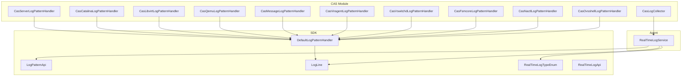
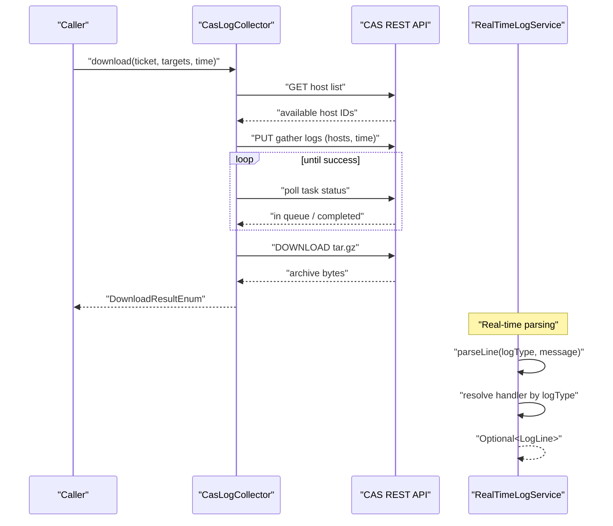
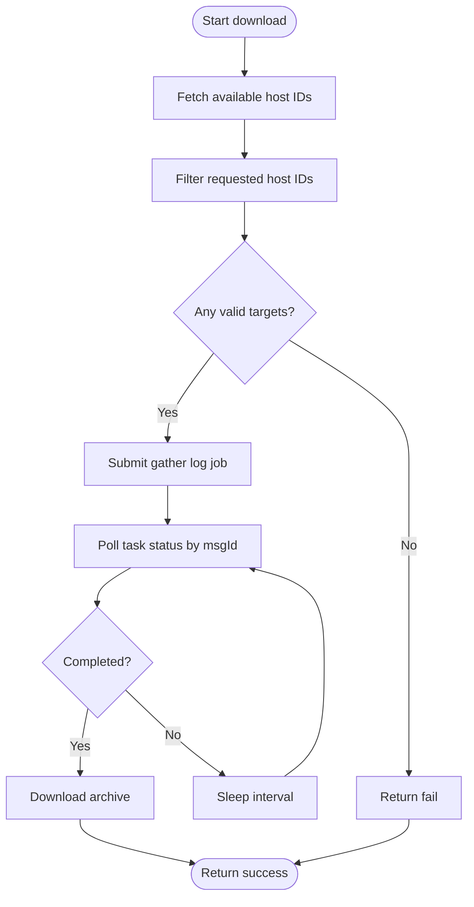
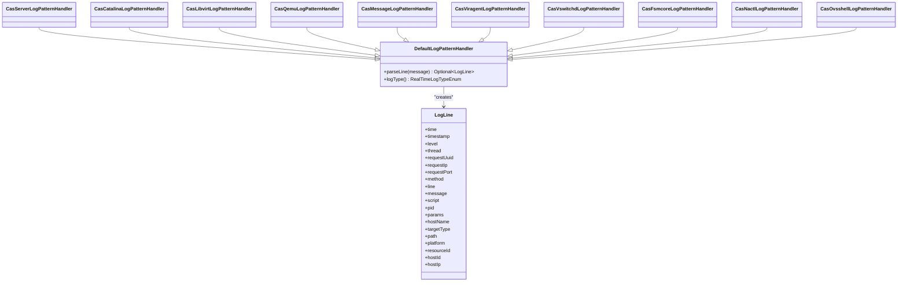
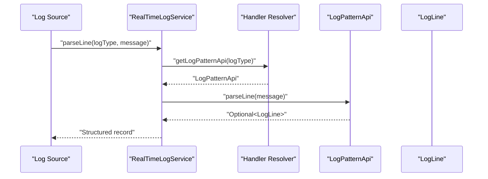
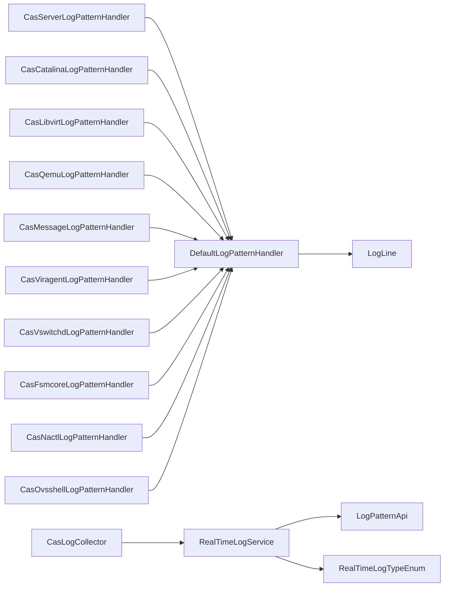

# Log Analysis & Pattern Handlers

<cite>
**Referenced Files in This Document**
- [CasLogCollector.java](file://watcher-cas/src/main/java/com/virtual/cloud/om/cas/service/log/CasLogCollector.java)
- [DefaultLogPatternHandler.java](file://watcher-sdk/src/main/java/com/virtual/cloud/om/sdk/api/DefaultLogPatternHandler.java)
- [LogPatternApi.java](file://watcher-sdk/src/main/java/com/virtual/cloud/om/sdk/api/LogPatternApi.java)
- [LogLine.java](file://watcher-sdk/src/main/java/com/virtual/cloud/om/sdk/dto/LogLine.java)
- [RealTimeLogApi.java](file://watcher-sdk/src/main/java/com/virtual/cloud/om/sdk/api/RealTimeLogApi.java)
- [RealTimeLogTypeEnum.java](file://watcher-sdk/src/main/java/com/virtual/cloud/om/sdk/constant/RealTimeLogTypeEnum.java)
- [RealTimeLogService.java](file://watcher-agent/src/main/java/com/virtual/cloud/om/agent/service/logs/RealTimeLogService.java)
- [CasServerLogPatternHandler.java](file://watcher-cas/src/main/java/com/virtual/cloud/om/cas/service/CasServerLogPatternHandler.java)
- [CasCatalinaLogPatternHandler.java](file://watcher-cas/src/main/java/com/virtual/cloud/om/cas/service/CasCatalinaLogPatternHandler.java)
- [CasLibvirtLogPatternHandler.java](file://watcher-cas/src/main/java/com/virtual/cloud/om/cas/service/CasLibvirtLogPatternHandler.java)
- [CasQemuLogPatternHandler.java](file://watcher-cas/src/main/java/com/virtual/cloud/om/cas/service/CasQemuLogPatternHandler.java)
- [CasMessageLogPatternHandler.java](file://watcher-cas/src/main/java/com/virtual/cloud/om/cas/service/CasMessageLogPatternHandler.java)
- [CasViragentLogPatternHandler.java](file://watcher-cas/src/main/java/com/virtual/cloud/om/cas/service/CasViragentLogPatternHandler.java)
- [CasVswitchdLogPatternHandler.java](file://watcher-cas/src/main/java/com/virtual/cloud/om/cas/service/CasVswitchdLogPatternHandler.java)
- [CasFsmcoreLogPatternHandler.java](file://watcher-cas/src/main/java/com/virtual/cloud/om/cas/service/CasFsmcoreLogPatternHandler.java)
- [CasNactlLogPatternHandler.java](file://watcher-cas/src/main/java/com/virtual/cloud/om/cas/service/CasNactlLogPatternHandler.java)
- [CasOvsshellLogPatternHandler.java](file://watcher-cas/src/main/java/com/virtual/cloud/om/cas/service/CasOvsshellLogPatternHandler.java)
</cite>

## Table of Contents
1. [Introduction](#introduction)
2. [Project Structure](#project-structure)
3. [Core Components](#core-components)
4. [Architecture Overview](#architecture-overview)
5. [Detailed Component Analysis](#detailed-component-analysis)
6. [Dependency Analysis](#dependency-analysis)
7. [Performance Considerations](#performance-considerations)
8. [Troubleshooting Guide](#troubleshooting-guide)
9. [Conclusion](#conclusion)
10. [Appendices](#appendices)

## Introduction
This document describes the CAS log analysis and pattern handler system in the ShowTime project. It covers how CAS-specific log formats are collected, parsed, and transformed into structured records for downstream analytics and monitoring. The system supports multiple log sources including server logs, Catalina logs, libvirt logs, QEMU logs, message logs, viragent logs, and vswitchd logs. It also documents the CasLogCollector for batch log retrieval, the DefaultLogPatternHandler and specialized handlers for parsing, and the real-time log processing pipeline used by the agent.

## Project Structure
The CAS log subsystem is organized around:
- A batch log collector for retrieving compressed log archives from CAS hosts.
- A set of log pattern handlers that parse raw log lines into structured LogLine objects.
- An agent-side real-time log service that routes parsed logs to consumers and integrates with centralized logging.

**Diagram sources**
- [CasLogCollector.java:29-111](file://watcher-cas/src/main/java/com/virtual/cloud/om/cas/service/log/CasLogCollector.java#L29-L111)
- [DefaultLogPatternHandler.java:17-55](file://watcher-sdk/src/main/java/com/virtual/cloud/om/sdk/api/DefaultLogPatternHandler.java#L17-L55)
- [LogPatternApi.java:12-17](file://watcher-sdk/src/main/java/com/virtual/cloud/om/sdk/api/LogPatternApi.java#L12-L17)
- [LogLine.java:6-55](file://watcher-sdk/src/main/java/com/virtual/cloud/om/sdk/dto/LogLine.java#L6-L55)
- [RealTimeLogApi.java:15-49](file://watcher-sdk/src/main/java/com/virtual/cloud/om/sdk/api/RealTimeLogApi.java#L15-L49)
- [RealTimeLogTypeEnum.java:15-44](file://watcher-sdk/src/main/java/com/virtual/cloud/om/sdk/constant/RealTimeLogTypeEnum.java#L15-L44)
- [RealTimeLogService.java:208-249](file://watcher-agent/src/main/java/com/virtual/cloud/om/agent/service/logs/RealTimeLogService.java#L208-L249)
- [CasServerLogPatternHandler.java:19-54](file://watcher-cas/src/main/java/com/virtual/cloud/om/cas/service/CasServerLogPatternHandler.java#L19-L54)
- [CasCatalinaLogPatternHandler.java:16-51](file://watcher-cas/src/main/java/com/virtual/cloud/om/cas/service/CasCatalinaLogPatternHandler.java#L16-L51)
- [CasLibvirtLogPatternHandler.java:16-51](file://watcher-cas/src/main/java/com/virtual/cloud/om/cas/service/CasLibvirtLogPatternHandler.java#L16-L51)
- [CasQemuLogPatternHandler.java:16-49](file://watcher-cas/src/main/java/com/virtual/cloud/om/cas/service/CasQemuLogPatternHandler.java#L16-L49)
- [CasMessageLogPatternHandler.java:17-49](file://watcher-cas/src/main/java/com/virtual/cloud/om/cas/service/CasMessageLogPatternHandler.java#L17-L49)
- [CasViragentLogPatternHandler.java:16-52](file://watcher-cas/src/main/java/com/virtual/cloud/om/cas/service/CasViragentLogPatternHandler.java#L16-L52)
- [CasVswitchdLogPatternHandler.java:17-52](file://watcher-cas/src/main/java/com/virtual/cloud/om/cas/service/CasVswitchdLogPatternHandler.java#L17-L52)
- [CasFsmcoreLogPatternHandler.java:16-51](file://watcher-cas/src/main/java/com/virtual/cloud/om/cas/service/CasFsmcoreLogPatternHandler.java#L16-L51)
- [CasNactlLogPatternHandler.java:16-52](file://watcher-cas/src/main/java/com/virtual/cloud/om/cas/service/CasNactlLogPatternHandler.java#L16-L52)
- [CasOvsshellLogPatternHandler.java:16-52](file://watcher-cas/src/main/java/com/virtual/cloud/om/cas/service/CasOvsshellLogPatternHandler.java#L16-L52)

**Section sources**
- [CasLogCollector.java:29-111](file://watcher-cas/src/main/java/com/virtual/cloud/om/cas/service/log/CasLogCollector.java#L29-L111)
- [DefaultLogPatternHandler.java:17-55](file://watcher-sdk/src/main/java/com/virtual/cloud/om/sdk/api/DefaultLogPatternHandler.java#L17-L55)
- [LogPatternApi.java:12-17](file://watcher-sdk/src/main/java/com/virtual/cloud/om/sdk/api/LogPatternApi.java#L12-L17)
- [LogLine.java:6-55](file://watcher-sdk/src/main/java/com/virtual/cloud/om/sdk/dto/LogLine.java#L6-L55)
- [RealTimeLogApi.java:15-49](file://watcher-sdk/src/main/java/com/virtual/cloud/om/sdk/api/RealTimeLogApi.java#L15-L49)
- [RealTimeLogTypeEnum.java:15-44](file://watcher-sdk/src/main/java/com/virtual/cloud/om/sdk/constant/RealTimeLogTypeEnum.java#L15-L44)
- [RealTimeLogService.java:208-249](file://watcher-agent/src/main/java/com/virtual/cloud/om/agent/service/logs/RealTimeLogService.java#L208-L249)

## Core Components
- CasLogCollector: Orchestrates batch log collection from CAS hosts, validates target host IDs against the platform, submits gather tasks, polls completion via message IDs, and downloads the resulting archive.
- DefaultLogPatternHandler and specialized handlers: Provide log line parsing for CAS-specific formats, extracting timestamps, levels, threads, methods, lines, and messages into a unified LogLine model.
- RealTimeLogService: Resolves log handlers by type, parses incoming log lines, and prepares them for downstream consumption or centralized logging integration.

Key responsibilities:
- Batch retrieval: Submit gather jobs, poll status, and download archives.
- Parsing: Regex-based extraction tailored per log type.
- Routing: Map log types to handlers and produce structured records.

**Section sources**
- [CasLogCollector.java:35-103](file://watcher-cas/src/main/java/com/virtual/cloud/om/cas/service/log/CasLogCollector.java#L35-L103)
- [DefaultLogPatternHandler.java:22-49](file://watcher-sdk/src/main/java/com/virtual/cloud/om/sdk/api/DefaultLogPatternHandler.java#L22-L49)
- [RealTimeLogService.java:221-229](file://watcher-agent/src/main/java/com/virtual/cloud/om/agent/service/logs/RealTimeLogService.java#L221-L229)

## Architecture Overview
The CAS log pipeline consists of two primary flows:
- Batch log collection: The collector interacts with CAS APIs to gather logs from target hosts and download a compressed archive for post-processing.
- Real-time log parsing: The agent resolves the appropriate pattern handler for a given log type, parses each line, and forwards structured records.

**Diagram sources**
- [CasLogCollector.java:35-103](file://watcher-cas/src/main/java/com/virtual/cloud/om/cas/service/log/CasLogCollector.java#L35-L103)
- [RealTimeLogService.java:221-229](file://watcher-agent/src/main/java/com/virtual/cloud/om/agent/service/logs/RealTimeLogService.java#L221-L229)

## Detailed Component Analysis

### CasLogCollector
- Purpose: Retrieve logs from CAS hosts in batch mode and download a compressed archive.
- Key steps:
  - Validate target host IDs against the platform’s host list.
  - Submit a gather log job with a time window and target host IDs.
  - Poll for completion using a message ID returned by the gather operation.
  - Download the resulting archive and return a success/failure indicator.
- Robustness:
  - Filters invalid host IDs early to avoid stuck tasks.
  - Uses polling with fixed intervals to wait for completion.
  - Handles IO errors during download.

**Diagram sources**
- [CasLogCollector.java:35-103](file://watcher-cas/src/main/java/com/virtual/cloud/om/cas/service/log/CasLogCollector.java#L35-L103)

**Section sources**
- [CasLogCollector.java:35-103](file://watcher-cas/src/main/java/com/virtual/cloud/om/cas/service/log/CasLogCollector.java#L35-L103)

### DefaultLogPatternHandler and Specialized Handlers
- DefaultLogPatternHandler:
  - Defines a baseline regex to extract time, level, thread, request UUID/IP/Port, method, line number, and message.
  - Converts extracted time to a numeric timestamp.
- Specialized handlers:
  - CasServerLogPatternHandler: Parses server logs with time, level, thread, method, and message.
  - CasCatalinaLogPatternHandler: Similar to server logs with Catalina-specific formatting.
  - CasLibvirtLogPatternHandler: Parses libvirt logs with date+epoch and method:line:message.
  - CasQemuLogPatternHandler: Extracts timestamp and message for QEMU logs.
  - CasMessageLogPatternHandler: Builds a time field from current day plus HH:mm:ss and extracts message.
  - CasViragentLogPatternHandler: Mirrors libvirt parsing for viragent logs.
  - CasVswitchdLogPatternHandler: Parses vswitchd logs with weekday-month-day format and pipe-delimited fields.
  - CasFsmcoreLogPatternHandler: Parses fsmcore logs with comma-separated tokens and method:line:message.
  - CasNactlLogPatternHandler: Parses nactl logs with space-separated tokens and method:line:message.
  - CasOvsshellLogPatternHandler: Parses ovsshell logs with script, PID, level, method, and params.

**Diagram sources**
- [DefaultLogPatternHandler.java:17-55](file://watcher-sdk/src/main/java/com/virtual/cloud/om/sdk/api/DefaultLogPatternHandler.java#L17-L55)
- [LogLine.java:6-55](file://watcher-sdk/src/main/java/com/virtual/cloud/om/sdk/dto/LogLine.java#L6-L55)
- [CasServerLogPatternHandler.java:19-54](file://watcher-cas/src/main/java/com/virtual/cloud/om/cas/service/CasServerLogPatternHandler.java#L19-L54)
- [CasCatalinaLogPatternHandler.java:16-51](file://watcher-cas/src/main/java/com/virtual/cloud/om/cas/service/CasCatalinaLogPatternHandler.java#L16-L51)
- [CasLibvirtLogPatternHandler.java:16-51](file://watcher-cas/src/main/java/com/virtual/cloud/om/cas/service/CasLibvirtLogPatternHandler.java#L16-L51)
- [CasQemuLogPatternHandler.java:16-49](file://watcher-cas/src/main/java/com/virtual/cloud/om/cas/service/CasQemuLogPatternHandler.java#L16-L49)
- [CasMessageLogPatternHandler.java:17-49](file://watcher-cas/src/main/java/com/virtual/cloud/om/cas/service/CasMessageLogPatternHandler.java#L17-L49)
- [CasViragentLogPatternHandler.java:16-52](file://watcher-cas/src/main/java/com/virtual/cloud/om/cas/service/CasViragentLogPatternHandler.java#L16-L52)
- [CasVswitchdLogPatternHandler.java:17-52](file://watcher-cas/src/main/java/com/virtual/cloud/om/cas/service/CasVswitchdLogPatternHandler.java#L17-L52)
- [CasFsmcoreLogPatternHandler.java:16-51](file://watcher-cas/src/main/java/com/virtual/cloud/om/cas/service/CasFsmcoreLogPatternHandler.java#L16-L51)
- [CasNactlLogPatternHandler.java:16-52](file://watcher-cas/src/main/java/com/virtual/cloud/om/cas/service/CasNactlLogPatternHandler.java#L16-L52)
- [CasOvsshellLogPatternHandler.java:16-52](file://watcher-cas/src/main/java/com/virtual/cloud/om/cas/service/CasOvsshellLogPatternHandler.java#L16-L52)

**Section sources**
- [DefaultLogPatternHandler.java:19-49](file://watcher-sdk/src/main/java/com/virtual/cloud/om/sdk/api/DefaultLogPatternHandler.java#L19-L49)
- [CasServerLogPatternHandler.java:21-48](file://watcher-cas/src/main/java/com/virtual/cloud/om/cas/service/CasServerLogPatternHandler.java#L21-L48)
- [CasCatalinaLogPatternHandler.java:18-45](file://watcher-cas/src/main/java/com/virtual/cloud/om/cas/service/CasCatalinaLogPatternHandler.java#L18-L45)
- [CasLibvirtLogPatternHandler.java:18-44](file://watcher-cas/src/main/java/com/virtual/cloud/om/cas/service/CasLibvirtLogPatternHandler.java#L18-L44)
- [CasQemuLogPatternHandler.java:18-42](file://watcher-cas/src/main/java/com/virtual/cloud/om/cas/service/CasQemuLogPatternHandler.java#L18-L42)
- [CasMessageLogPatternHandler.java:19-42](file://watcher-cas/src/main/java/com/virtual/cloud/om/cas/service/CasMessageLogPatternHandler.java#L19-L42)
- [CasViragentLogPatternHandler.java:18-45](file://watcher-cas/src/main/java/com/virtual/cloud/om/cas/service/CasViragentLogPatternHandler.java#L18-L45)
- [CasVswitchdLogPatternHandler.java:19-45](file://watcher-cas/src/main/java/com/virtual/cloud/om/cas/service/CasVswitchdLogPatternHandler.java#L19-L45)
- [CasFsmcoreLogPatternHandler.java:18-44](file://watcher-cas/src/main/java/com/virtual/cloud/om/cas/service/CasFsmcoreLogPatternHandler.java#L18-L44)
- [CasNactlLogPatternHandler.java:19-45](file://watcher-cas/src/main/java/com/virtual/cloud/om/cas/service/CasNactlLogPatternHandler.java#L19-L45)
- [CasOvsshellLogPatternHandler.java:19-45](file://watcher-cas/src/main/java/com/virtual/cloud/om/cas/service/CasOvsshellLogPatternHandler.java#L19-L45)

### Real-Time Log Processing
- Handler resolution: The agent selects a handler based on the log type. If unknown, it falls back to a generic handler.
- Parsing: Each handler applies a dedicated regex to extract fields and populate a LogLine.
- Integration: The parsed LogLine can be forwarded to consumers or centralized logging systems.

**Diagram sources**
- [RealTimeLogService.java:221-229](file://watcher-agent/src/main/java/com/virtual/cloud/om/agent/service/logs/RealTimeLogService.java#L221-L229)
- [LogPatternApi.java:12-17](file://watcher-sdk/src/main/java/com/virtual/cloud/om/sdk/api/LogPatternApi.java#L12-L17)
- [LogLine.java:6-55](file://watcher-sdk/src/main/java/com/virtual/cloud/om/sdk/dto/LogLine.java#L6-L55)

**Section sources**
- [RealTimeLogService.java:208-249](file://watcher-agent/src/main/java/com/virtual/cloud/om/agent/service/logs/RealTimeLogService.java#L208-L249)
- [RealTimeLogApi.java:22-43](file://watcher-sdk/src/main/java/com/virtual/cloud/om/sdk/api/RealTimeLogApi.java#L22-L43)

## Dependency Analysis
- Coupling:
  - Handlers depend on DefaultLogPatternHandler for shared parsing infrastructure and LogLine for output.
  - RealTimeLogService depends on LogPatternApi implementations and RealTimeLogTypeEnum to route parsing.
  - CasLogCollector depends on CAS REST clients and DTOs for batch operations.
- Cohesion:
  - Each handler encapsulates a single log format’s regex and extraction logic.
  - Real-time service centralizes handler selection and fallback logic.
- External integrations:
  - CAS REST endpoints for host discovery, log gathering, and archive download.
  - Centralized logging pathways via RealTimeLogApi and consumer forwarding.

**Diagram sources**
- [DefaultLogPatternHandler.java:17-55](file://watcher-sdk/src/main/java/com/virtual/cloud/om/sdk/api/DefaultLogPatternHandler.java#L17-L55)
- [LogLine.java:6-55](file://watcher-sdk/src/main/java/com/virtual/cloud/om/sdk/dto/LogLine.java#L6-L55)
- [RealTimeLogService.java:208-249](file://watcher-agent/src/main/java/com/virtual/cloud/om/agent/service/logs/RealTimeLogService.java#L208-L249)
- [RealTimeLogTypeEnum.java:15-44](file://watcher-sdk/src/main/java/com/virtual/cloud/om/sdk/constant/RealTimeLogTypeEnum.java#L15-L44)
- [CasLogCollector.java:35-103](file://watcher-cas/src/main/java/com/virtual/cloud/om/cas/service/log/CasLogCollector.java#L35-L103)

**Section sources**
- [RealTimeLogService.java:208-249](file://watcher-agent/src/main/java/com/virtual/cloud/om/agent/service/logs/RealTimeLogService.java#L208-L249)
- [RealTimeLogTypeEnum.java:40-43](file://watcher-sdk/src/main/java/com/virtual/cloud/om/sdk/constant/RealTimeLogTypeEnum.java#L40-L43)
- [CasLogCollector.java:42-56](file://watcher-cas/src/main/java/com/virtual/cloud/om/cas/service/log/CasLogCollector.java#L42-L56)

## Performance Considerations
- Regex compilation and reuse:
  - Handlers compile patterns once and reuse Matcher instances per parse invocation. Keep patterns minimal and anchored to reduce backtracking.
- Timestamp conversion:
  - TimeUtils.convertToTimestamp is invoked per line; cache or precompute where feasible if throughput demands.
- Batch collection:
  - Polling intervals are fixed; tune sleep durations based on expected task duration and SLA.
- Memory footprint:
  - Prefer streaming decompression and incremental processing for large archives to avoid high memory usage.
- Handler dispatch:
  - Maintain a small, fast map of logType to handler to minimize lookup overhead.

## Troubleshooting Guide
Common issues and resolutions:
- Invalid host IDs in batch collection:
  - Symptom: Immediate failure or no logs downloaded.
  - Action: Verify host IDs against the platform’s host list and filter out non-existent entries.
  - Reference: [CasLogCollector.java:42-56](file://watcher-cas/src/main/java/com/virtual/cloud/om/cas/service/log/CasLogCollector.java#L42-L56)
- Handler mismatch or empty results:
  - Symptom: parseLine returns empty Optional.
  - Action: Confirm logType matches a registered handler; fall back to default handler if necessary.
  - Reference: [RealTimeLogService.java:208-218](file://watcher-agent/src/main/java/com/virtual/cloud/om/agent/service/logs/RealTimeLogService.java#L208-L218)
- Parsing failures due to format drift:
  - Symptom: Fields missing or misaligned.
  - Action: Adjust regex in the appropriate handler to match the current log format; validate with representative samples.
  - References:
    - [CasLibvirtLogPatternHandler.java:18-44](file://watcher-cas/src/main/java/com/virtual/cloud/om/cas/service/CasLibvirtLogPatternHandler.java#L18-L44)
    - [CasVswitchdLogPatternHandler.java:19-45](file://watcher-cas/src/main/java/com/virtual/cloud/om/cas/service/CasVswitchdLogPatternHandler.java#L19-L45)
- Timezone and partial timestamp handling:
  - Symptom: Incorrect timestamps or missing time components.
  - Action: Ensure time parsing aligns with the log’s timezone and format; use helper utilities to normalize partial timestamps.
  - References:
    - [CasMessageLogPatternHandler.java:35-36](file://watcher-cas/src/main/java/com/virtual/cloud/om/cas/service/CasMessageLogPatternHandler.java#L35-L36)
    - [CasVswitchdLogPatternHandler.java:35-36](file://watcher-cas/src/main/java/com/virtual/cloud/om/cas/service/CasVswitchdLogPatternHandler.java#L35-L36)

**Section sources**
- [CasLogCollector.java:42-56](file://watcher-cas/src/main/java/com/virtual/cloud/om/cas/service/log/CasLogCollector.java#L42-L56)
- [RealTimeLogService.java:208-218](file://watcher-agent/src/main/java/com/virtual/cloud/om/agent/service/logs/RealTimeLogService.java#L208-L218)
- [CasLibvirtLogPatternHandler.java:18-44](file://watcher-cas/src/main/java/com/virtual/cloud/om/cas/service/CasLibvirtLogPatternHandler.java#L18-L44)
- [CasVswitchdLogPatternHandler.java:19-45](file://watcher-cas/src/main/java/com/virtual/cloud/om/cas/service/CasVswitchdLogPatternHandler.java#L19-L45)
- [CasMessageLogPatternHandler.java:35-36](file://watcher-cas/src/main/java/com/virtual/cloud/om/cas/service/CasMessageLogPatternHandler.java#L35-L36)

## Conclusion
The CAS log analysis system combines robust batch retrieval with flexible, type-specific parsing. The DefaultLogPatternHandler provides a reusable foundation, while specialized handlers tailor extraction to each log source. The agent’s real-time service ensures scalable routing and parsing, enabling integration with centralized logging systems. By validating inputs, maintaining precise regexes, and optimizing parsing and polling loops, the system achieves reliable and efficient log processing at scale.

## Appendices

### Log Types and Extraction Fields
- cas_server, cas_catalina:
  - Extract time, level, thread, method, message.
  - Reference: [CasServerLogPatternHandler.java:21-48](file://watcher-cas/src/main/java/com/virtual/cloud/om/cas/service/CasServerLogPatternHandler.java#L21-L48), [CasCatalinaLogPatternHandler.java:18-45](file://watcher-cas/src/main/java/com/virtual/cloud/om/cas/service/CasCatalinaLogPatternHandler.java#L18-L45)
- cas_libvirt, cas_viragent:
  - Extract time, level, method, line, message.
  - Reference: [CasLibvirtLogPatternHandler.java:18-44](file://watcher-cas/src/main/java/com/virtual/cloud/om/cas/service/CasLibvirtLogPatternHandler.java#L18-L44), [CasViragentLogPatternHandler.java:18-45](file://watcher-cas/src/main/java/com/virtual/cloud/om/cas/service/CasViragentLogPatternHandler.java#L18-L45)
- cas_qemu:
  - Extract time, message.
  - Reference: [CasQemuLogPatternHandler.java:18-42](file://watcher-cas/src/main/java/com/virtual/cloud/om/cas/service/CasQemuLogPatternHandler.java#L18-L42)
- cas_message:
  - Build time from current day + HH:mm:ss, extract message.
  - Reference: [CasMessageLogPatternHandler.java:19-42](file://watcher-cas/src/main/java/com/virtual/cloud/om/cas/service/CasMessageLogPatternHandler.java#L19-L42)
- cas_vswitchd:
  - Extract level, method, message; build time from weekday-month-day + time.
  - Reference: [CasVswitchdLogPatternHandler.java:19-45](file://watcher-cas/src/main/java/com/virtual/cloud/om/cas/service/CasVswitchdLogPatternHandler.java#L19-L45)
- cas_fsmcore:
  - Extract level, method, line, message.
  - Reference: [CasFsmcoreLogPatternHandler.java:18-44](file://watcher-cas/src/main/java/com/virtual/cloud/om/cas/service/CasFsmcoreLogPatternHandler.java#L18-L44)
- cas_nactl:
  - Extract level, method, line, message.
  - Reference: [CasNactlLogPatternHandler.java:19-45](file://watcher-cas/src/main/java/com/virtual/cloud/om/cas/service/CasNactlLogPatternHandler.java#L19-L45)
- cas_ovsshell:
  - Extract script, level, pid, params; include time.
  - Reference: [CasOvsshellLogPatternHandler.java:19-45](file://watcher-cas/src/main/java/com/virtual/cloud/om/cas/service/CasOvsshellLogPatternHandler.java#L19-L45)

### Data Model: LogLine
- Fields include time, timestamp, level, thread, request identifiers, method, line, message, and optional metadata such as script, pid, params, host info, and resource identifiers.
- Reference: [LogLine.java:6-55](file://watcher-sdk/src/main/java/com/virtual/cloud/om/sdk/dto/LogLine.java#L6-L55)