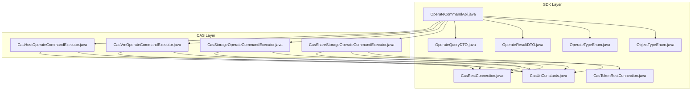
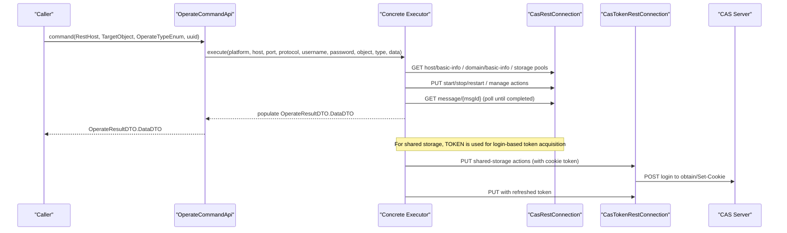
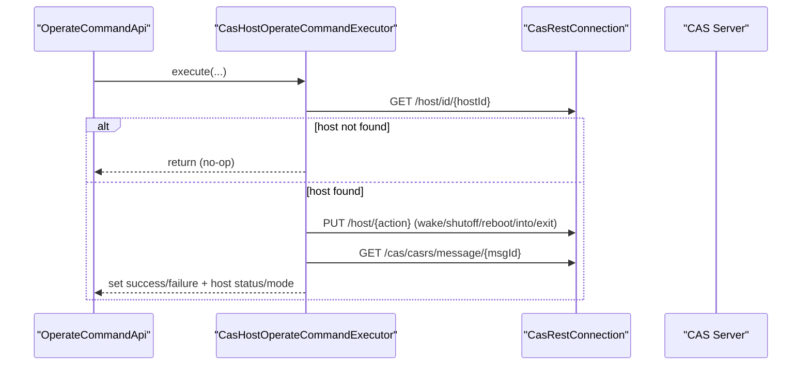
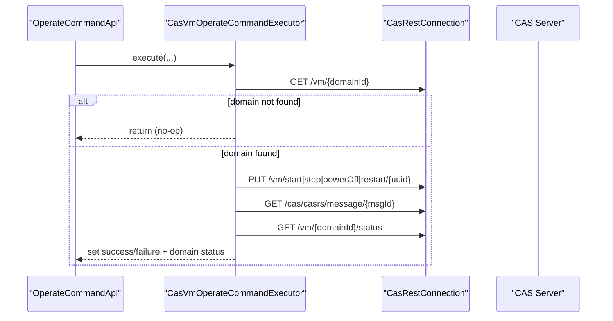
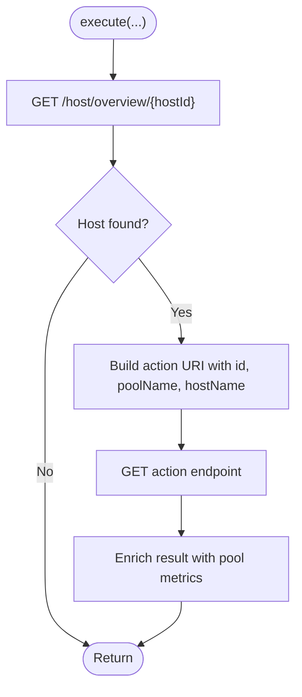
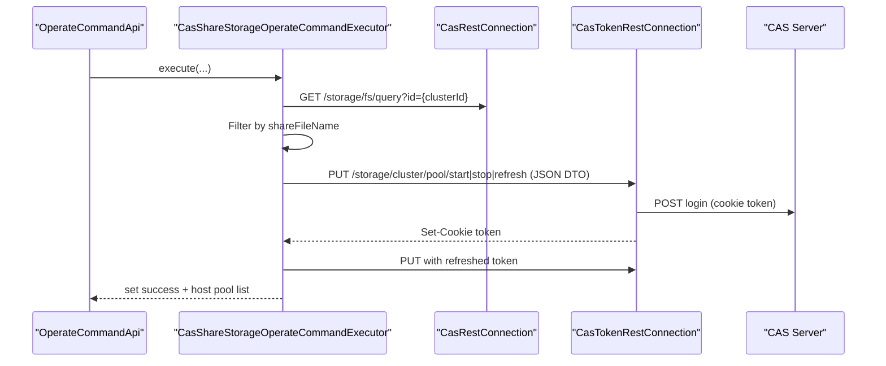
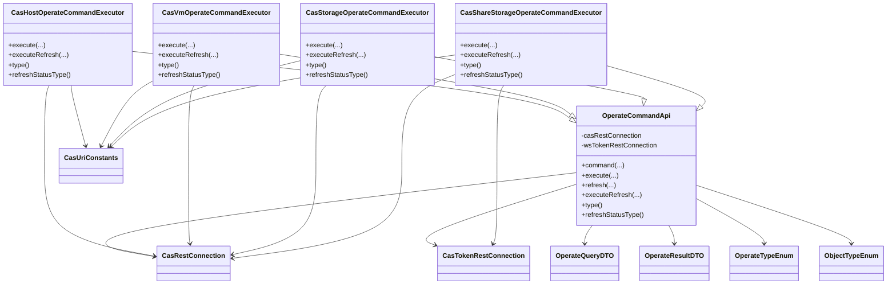

# Operations & Command Execution

<cite>
**Referenced Files in This Document**
- [CasHostOperateCommandExecutor.java](file://watcher-cas/src/main/java/com/virtual/cloud/om/cas/service/operate/CasHostOperateCommandExecutor.java)
- [CasVmOperateCommandExecutor.java](file://watcher-cas/src/main/java/com/virtual/cloud/om/cas/service/operate/CasVmOperateCommandExecutor.java)
- [CasStorageOperateCommandExecutor.java](file://watcher-cas/src/main/java/com/virtual/cloud/om/cas/service/operate/CasStorageOperateCommandExecutor.java)
- [CasShareStorageOperateCommandExecutor.java](file://watcher-cas/src/main/java/com/virtual/cloud/om/cas/service/operate/CasShareStorageOperateCommandExecutor.java)
- [OperateCommandApi.java](file://watcher-sdk/src/main/java/com/virtual/cloud/om/sdk/api/OperateCommandApi.java)
- [CasUriConstants.java](file://watcher-sdk/src/main/java/com/virtual/cloud/om/sdk/constant/uri/CasUriConstants.java)
- [OperateQueryDTO.java](file://watcher-sdk/src/main/java/com/virtual/cloud/om/sdk/dto/operate/OperateQueryDTO.java)
- [OperateResultDTO.java](file://watcher-sdk/src/main/java/com/virtual/cloud/om/sdk/dto/operate/OperateResultDTO.java)
- [OperateTypeEnum.java](file://watcher-sdk/src/main/java/com/virtual/cloud/om/sdk/constant/operate/OperateTypeEnum.java)
- [ObjectTypeEnum.java](file://watcher-sdk/src/main/java/com/virtual/cloud/om/sdk/constant/operate/ObjectTypeEnum.java)
- [CasRestConnection.java](file://watcher-sdk/src/main/java/com/virtual/cloud/om/sdk/config/rest/cas/CasRestConnection.java)
- [CasTokenRestConnection.java](file://watcher-sdk/src/main/java/com/virtual/cloud/om/sdk/config/token/cas/CasTokenRestConnection.java)
- [CasTestConnectionApi.java](file://watcher-cas/src/main/java/com/virtual/cloud/om/cas/service/CasTestConnectionApi.java)
</cite>

## Table of Contents
1. [Introduction](#introduction)
2. [Project Structure](#project-structure)
3. [Core Components](#core-components)
4. [Architecture Overview](#architecture-overview)
5. [Detailed Component Analysis](#detailed-component-analysis)
6. [Dependency Analysis](#dependency-analysis)
7. [Performance Considerations](#performance-considerations)
8. [Troubleshooting Guide](#troubleshooting-guide)
9. [Conclusion](#conclusion)
10. [Appendices](#appendices)

## Introduction
This document explains the CAS operations and command execution capabilities implemented in the watcher-cas module and integrated via the watcher-sdk. It focuses on the four specialized command executors for host operations, virtual machine operations, storage operations, and shared storage operations. It details command execution patterns, parameter validation, result processing, integration with CAS REST APIs, authentication mechanisms, error handling strategies, and provides examples of common operational commands, batch scenarios, and automated workflows. Security considerations, audit logging requirements, and troubleshooting guidance are included, along with extensibility mechanisms for adding new operation types.

## Project Structure
The CAS operation subsystem is organized around a shared SDK abstraction and CAS-specific executor implementations:
- watcher-sdk provides the generic command execution framework, REST clients, DTOs, enums, and URI constants.
- watcher-cas provides CAS-specific executors that translate high-level operations into CAS REST calls.

**Diagram sources**
- [OperateCommandApi.java:29-210](file://watcher-sdk/src/main/java/com/virtual/cloud/om/sdk/api/OperateCommandApi.java#L29-L210)
- [CasRestConnection.java:26-160](file://watcher-sdk/src/main/java/com/virtual/cloud/om/sdk/config/rest/cas/CasRestConnection.java#L26-L160)
- [CasTokenRestConnection.java:40-372](file://watcher-sdk/src/main/java/com/virtual/cloud/om/sdk/config/token/cas/CasTokenRestConnection.java#L40-L372)
- [CasUriConstants.java:1-822](file://watcher-sdk/src/main/java/com/virtual/cloud/om/sdk/constant/uri/CasUriConstants.java#L1-L822)
- [OperateQueryDTO.java:1-53](file://watcher-sdk/src/main/java/com/virtual/cloud/om/sdk/dto/operate/OperateQueryDTO.java#L1-L53)
- [OperateResultDTO.java:1-107](file://watcher-sdk/src/main/java/com/virtual/cloud/om/sdk/dto/operate/OperateResultDTO.java#L1-L107)
- [OperateTypeEnum.java:1-37](file://watcher-sdk/src/main/java/com/virtual/cloud/om/sdk/constant/operate/OperateTypeEnum.java#L1-L37)
- [ObjectTypeEnum.java:1-36](file://watcher-sdk/src/main/java/com/virtual/cloud/om/sdk/constant/operate/ObjectTypeEnum.java#L1-L36)
- [CasHostOperateCommandExecutor.java:30-158](file://watcher-cas/src/main/java/com/virtual/cloud/om/cas/service/operate/CasHostOperateCommandExecutor.java#L30-L158)
- [CasVmOperateCommandExecutor.java:26-104](file://watcher-cas/src/main/java/com/virtual/cloud/om/cas/service/operate/CasVmOperateCommandExecutor.java#L26-L104)
- [CasStorageOperateCommandExecutor.java:27-112](file://watcher-cas/src/main/java/com/virtual/cloud/om/cas/service/operate/CasStorageOperateCommandExecutor.java#L27-L112)
- [CasShareStorageOperateCommandExecutor.java:35-153](file://watcher-cas/src/main/java/com/virtual/cloud/om/cas/service/operate/CasShareStorageOperateCommandExecutor.java#L35-L153)

**Section sources**
- [OperateCommandApi.java:29-210](file://watcher-sdk/src/main/java/com/virtual/cloud/om/sdk/api/OperateCommandApi.java#L29-L210)
- [CasHostOperateCommandExecutor.java:30-158](file://watcher-cas/src/main/java/com/virtual/cloud/om/cas/service/operate/CasHostOperateCommandExecutor.java#L30-L158)
- [CasVmOperateCommandExecutor.java:26-104](file://watcher-cas/src/main/java/com/virtual/cloud/om/cas/service/operate/CasVmOperateCommandExecutor.java#L26-L104)
- [CasStorageOperateCommandExecutor.java:27-112](file://watcher-cas/src/main/java/com/virtual/cloud/om/cas/service/operate/CasStorageOperateCommandExecutor.java#L27-L112)
- [CasShareStorageOperateCommandExecutor.java:35-153](file://watcher-cas/src/main/java/com/virtual/cloud/om/cas/service/operate/CasShareStorageOperateCommandExecutor.java#L35-L153)

## Core Components
- OperateCommandApi: Defines the command execution contract, orchestrates parameter extraction, delegates to concrete executors, handles exceptions, and supports periodic status refresh via WebSocket push types.
- Four CAS executors:
  - Host executor: performs power/manage actions on hosts, queries host info, and updates result metadata.
  - VM executor: starts/stops/restarts/shuts down domains, queries status, and normalizes status codes.
  - Storage executor: manages storage pools on hosts (start, pause, refresh) and enriches result with pool metrics.
  - Shared storage executor: operates shared filesystem pools across clusters using token-authenticated endpoints and enriches result with host pool details.

Key data contracts:
- OperateQueryDTO: carries target identifiers (domainId, hostId, poolName, clusterId, shareFileName, shareFileType, maintainMode) and operation type.
- OperateResultDTO: aggregates per-operation results, statuses, and enriched metadata for reporting.

Enums:
- OperateTypeEnum: operation taxonomy (start, stop, shutdown, restart, intoMaintain, exitMaintain, pause, refresh, wake).
- ObjectTypeEnum: target type taxonomy (host, vm, storagePool, shareStorage).

**Section sources**
- [OperateCommandApi.java:40-111](file://watcher-sdk/src/main/java/com/virtual/cloud/om/sdk/api/OperateCommandApi.java#L40-L111)
- [OperateQueryDTO.java:11-51](file://watcher-sdk/src/main/java/com/virtual/cloud/om/sdk/dto/operate/OperateQueryDTO.java#L11-L51)
- [OperateResultDTO.java:18-105](file://watcher-sdk/src/main/java/com/virtual/cloud/om/sdk/dto/operate/OperateResultDTO.java#L18-L105)
- [OperateTypeEnum.java:8-36](file://watcher-sdk/src/main/java/com/virtual/cloud/om/sdk/constant/operate/OperateTypeEnum.java#L8-L36)
- [ObjectTypeEnum.java:8-35](file://watcher-sdk/src/main/java/com/virtual/cloud/om/sdk/constant/operate/ObjectTypeEnum.java#L8-L35)

## Architecture Overview
The command execution pipeline follows a consistent pattern:
- A caller invokes the generic command method with RestHost credentials, target object, operation type, and UUID.
- The abstract executor validates inputs, constructs CAS REST requests, executes tasks, polls completion, and enriches results.
- Status refresh uses WebSocket push types for real-time updates when supported by the executor.

**Diagram sources**
- [OperateCommandApi.java:40-111](file://watcher-sdk/src/main/java/com/virtual/cloud/om/sdk/api/OperateCommandApi.java#L40-L111)
- [CasHostOperateCommandExecutor.java:34-81](file://watcher-cas/src/main/java/com/virtual/cloud/om/cas/service/operate/CasHostOperateCommandExecutor.java#L34-L81)
- [CasVmOperateCommandExecutor.java:30-71](file://watcher-cas/src/main/java/com/virtual/cloud/om/cas/service/operate/CasVmOperateCommandExecutor.java#L30-L71)
- [CasStorageOperateCommandExecutor.java:31-59](file://watcher-cas/src/main/java/com/virtual/cloud/om/cas/service/operate/CasStorageOperateCommandExecutor.java#L31-L59)
- [CasShareStorageOperateCommandExecutor.java:40-101](file://watcher-cas/src/main/java/com/virtual/cloud/om/cas/service/operate/CasShareStorageOperateCommandExecutor.java#L40-L101)
- [CasRestConnection.java:112-138](file://watcher-sdk/src/main/java/com/virtual/cloud/om/sdk/config/rest/cas/CasRestConnection.java#L112-L138)
- [CasTokenRestConnection.java:106-169](file://watcher-sdk/src/main/java/com/virtual/cloud/om/sdk/config/token/cas/CasTokenRestConnection.java#L106-L169)

## Detailed Component Analysis

### Host Operations Executor
Responsibilities:
- Resolve host identity via REST, enqueue host tasks (wake, shutdown, reboot, enter/exit maintenance), poll task completion, and update result metadata.
- Normalize statuses and handle special cases (e.g., setting host status to off after stop).

Execution pattern:
- Extracts hostId, clusterId, maintainMode from TargetObject.
- Fetches host info, dispatches appropriate host action endpoint, polls message completion, and enriches result with current host status.

Parameter validation:
- Validates presence of hostId and existence of host info; otherwise aborts gracefully.

Result processing:
- Sets success/failure based on task result; populates host status, maintenance mode, and CVK maintenance flags.

**Diagram sources**
- [CasHostOperateCommandExecutor.java:34-81](file://watcher-cas/src/main/java/com/virtual/cloud/om/cas/service/operate/CasHostOperateCommandExecutor.java#L34-L81)
- [CasUriConstants.java:16-21](file://watcher-sdk/src/main/java/com/virtual/cloud/om/sdk/constant/uri/CasUriConstants.java#L16-L21)
- [CasRestConnection.java:112-126](file://watcher-sdk/src/main/java/com/virtual/cloud/om/sdk/config/rest/cas/CasRestConnection.java#L112-L126)

**Section sources**
- [CasHostOperateCommandExecutor.java:34-105](file://watcher-cas/src/main/java/com/virtual/cloud/om/cas/service/operate/CasHostOperateCommandExecutor.java#L34-L105)
- [CasUriConstants.java:16-21](file://watcher-sdk/src/main/java/com/virtual/cloud/om/sdk/constant/uri/CasUriConstants.java#L16-L21)

### Virtual Machine Operations Executor
Responsibilities:
- Resolve domain identity via REST, enqueue VM tasks (start, stop, shutdown, restart), poll completion, and update result metadata.
- Normalizes status codes and optimistically sets shutOff status for stop operations.

Execution pattern:
- Extracts domainId, fetches domain detail to resolve UUID, dispatches action endpoint, polls message completion, and queries current status.

Parameter validation:
- Validates presence of domainId and domain detail; otherwise aborts gracefully.

Result processing:
- Sets success/failure based on task result; populates domain status and enriches result metadata.

**Diagram sources**
- [CasVmOperateCommandExecutor.java:30-71](file://watcher-cas/src/main/java/com/virtual/cloud/om/cas/service/operate/CasVmOperateCommandExecutor.java#L30-L71)
- [CasUriConstants.java:293-305](file://watcher-sdk/src/main/java/com/virtual/cloud/om/sdk/constant/uri/CasUriConstants.java#L293-L305)
- [OperateCommandApi.java:154-176](file://watcher-sdk/src/main/java/com/virtual/cloud/om/sdk/api/OperateCommandApi.java#L154-L176)

**Section sources**
- [CasVmOperateCommandExecutor.java:30-92](file://watcher-cas/src/main/java/com/virtual/cloud/om/cas/service/operate/CasVmOperateCommandExecutor.java#L30-L92)
- [OperateCommandApi.java:154-176](file://watcher-sdk/src/main/java/com/virtual/cloud/om/sdk/api/OperateCommandApi.java#L154-L176)

### Storage Operations Executor
Responsibilities:
- Operates storage pools on a given host (start, pause, refresh) and enriches results with pool metrics.
- Resolves host name via host overview and constructs action URIs with required query parameters.

Execution pattern:
- Extracts hostId and poolName, resolves host name, selects action endpoint based on operation type, executes RPC-style GET, and enriches result with pool stats.

Parameter validation:
- Validates host existence; otherwise aborts gracefully.

Result processing:
- Sets success and enriches total/free/allocation and pool status.

**Diagram sources**
- [CasStorageOperateCommandExecutor.java:31-59](file://watcher-cas/src/main/java/com/virtual/cloud/om/cas/service/operate/CasStorageOperateCommandExecutor.java#L31-L59)
- [CasUriConstants.java:530-535](file://watcher-sdk/src/main/java/com/virtual/cloud/om/sdk/constant/uri/CasUriConstants.java#L530-L535)

**Section sources**
- [CasStorageOperateCommandExecutor.java:31-100](file://watcher-cas/src/main/java/com/virtual/cloud/om/cas/service/operate/CasStorageOperateCommandExecutor.java#L31-L100)

### Shared Storage Operations Executor
Responsibilities:
- Manages shared filesystem pools across clusters using token-authenticated endpoints.
- Resolves clusterId and file system metadata, constructs DTO, and executes start/stop/refresh actions.

Execution pattern:
- Extracts clusterId, shareFileName, shareFileType, resolves FS metadata, builds DTO, executes token-protected PUT, and enriches result with host pool details.

Parameter validation:
- Validates presence of matching shared file; otherwise aborts gracefully.

Result processing:
- Sets success and enriches total/free/allocation and host pool list.

**Diagram sources**
- [CasShareStorageOperateCommandExecutor.java:40-101](file://watcher-cas/src/main/java/com/virtual/cloud/om/cas/service/operate/CasShareStorageOperateCommandExecutor.java#L40-L101)
- [CasTokenRestConnection.java:56-104](file://watcher-sdk/src/main/java/com/virtual/cloud/om/sdk/config/token/cas/CasTokenRestConnection.java#L56-L104)
- [CasUriConstants.java:493-495](file://watcher-sdk/src/main/java/com/virtual/cloud/om/sdk/constant/uri/CasUriConstants.java#L493-L495)

**Section sources**
- [CasShareStorageOperateCommandExecutor.java:40-131](file://watcher-cas/src/main/java/com/virtual/cloud/om/cas/service/operate/CasShareStorageOperateCommandExecutor.java#L40-L131)

### Command Execution Patterns and Validation
- Unified entrypoint: command(...) in OperateCommandApi extracts platform, host, port, protocol, username, password, and delegates to concrete executors.
- Parameter validation: executors validate presence of required identifiers (hostId/domainId/poolName/clusterId/shareFileName) and existence of related resources before dispatching actions.
- Result processing: executors populate result object with operation type, resource id, UUID, object type, success/failure, and enriched metadata (statuses, sizes, lists).

**Section sources**
- [OperateCommandApi.java:40-60](file://watcher-sdk/src/main/java/com/virtual/cloud/om/sdk/api/OperateCommandApi.java#L40-L60)
- [OperateQueryDTO.java:24-51](file://watcher-sdk/src/main/java/com/virtual/cloud/om/sdk/dto/operate/OperateQueryDTO.java#L24-L51)
- [OperateResultDTO.java:18-105](file://watcher-sdk/src/main/java/com/virtual/cloud/om/sdk/dto/operate/OperateResultDTO.java#L18-L105)

### Integration with CAS REST APIs and Authentication
- REST integration:
  - CasRestConnection: provides GET/PUT/POST/DELETE helpers with platform-aware port resolution and request logging.
  - CasTokenRestConnection: manages session cookies, token refresh with locking, and re-execution on 401.
- Authentication:
  - Host/Virt/Storage executors use CasRestConnection with basic credentials.
  - Shared storage executor uses CasTokenRestConnection to obtain and attach a session cookie for protected endpoints.
- URI constants:
  - Centralized endpoints for host actions, VM actions, storage operations, and shared storage operations.

**Section sources**
- [CasRestConnection.java:112-138](file://watcher-sdk/src/main/java/com/virtual/cloud/om/sdk/config/rest/cas/CasRestConnection.java#L112-L138)
- [CasTokenRestConnection.java:106-169](file://watcher-sdk/src/main/java/com/virtual/cloud/om/sdk/config/token/cas/CasTokenRestConnection.java#L106-L169)
- [CasUriConstants.java:16-21](file://watcher-sdk/src/main/java/com/virtual/cloud/om/sdk/constant/uri/CasUriConstants.java#L16-L21)
- [CasTestConnectionApi.java:18-23](file://watcher-cas/src/main/java/com/virtual/cloud/om/cas/service/CasTestConnectionApi.java#L18-L23)

### Error Handling Strategies
- Exception wrapping: OperateCommandApi wraps executor errors into standardized failure messages and logs context.
- REST error mapping: CasRestConnection translates HTTP client errors and conflict responses into AppException with error codes/messages.
- Token refresh on 401: CasTokenRestConnection detects UNAUTHORIZED, refreshes token, and retries automatically.
- Graceful exits: Executors return early when resources are not found or operations are unsupported.

**Section sources**
- [OperateCommandApi.java:52-59](file://watcher-sdk/src/main/java/com/virtual/cloud/om/sdk/api/OperateCommandApi.java#L52-L59)
- [CasRestConnection.java:66-94](file://watcher-sdk/src/main/java/com/virtual/cloud/om/sdk/config/rest/cas/CasRestConnection.java#L66-L94)
- [CasTokenRestConnection.java:118-156](file://watcher-sdk/src/main/java/com/virtual/cloud/om/sdk/config/token/cas/CasTokenRestConnection.java#L118-L156)

### Examples and Automated Workflows
Common operational commands:
- Host: wake, shutdown, reboot, enter/exit maintenance.
- VM: start, stop (safe), shutdown (power-off), restart.
- Storage: start pool, pause pool, refresh pool.
- Shared storage: start cluster pool, stop cluster pool, refresh cluster pool.

Batch operation scenarios:
- VM batch restart/start/shutdown endpoints are defined in URI constants for bulk operations.
- Executing a batch involves invoking the respective batch endpoint with a list of identifiers.

Automated workflows:
- Polling task completion via message endpoints ensures reliable orchestration.
- Status refresh via WebSocket push types enables real-time UI updates for supported executors.

**Section sources**
- [OperateTypeEnum.java:8-18](file://watcher-sdk/src/main/java/com/virtual/cloud/om/sdk/constant/operate/OperateTypeEnum.java#L8-L18)
- [CasUriConstants.java:309-317](file://watcher-sdk/src/main/java/com/virtual/cloud/om/sdk/constant/uri/CasUriConstants.java#L309-L317)
- [OperateCommandApi.java:178-193](file://watcher-sdk/src/main/java/com/virtual/cloud/om/sdk/api/OperateCommandApi.java#L178-L193)

### Security Considerations
- Credential handling: REST calls pass username/password to REST clients; ensure secure transport (HTTPS) and avoid logging sensitive payloads.
- Token lifecycle: CasTokenRestConnection caches tokens with locking to prevent race conditions; refresh on 401 transparently.
- Audit logging: Request URLs, methods, headers, and bodies are logged at debug level; configure log levels appropriately in production.
- Access control: Shared storage operations require session cookies; enforce least privilege and monitor access patterns.

**Section sources**
- [CasRestConnection.java:153-158](file://watcher-sdk/src/main/java/com/virtual/cloud/om/sdk/config/rest/cas/CasRestConnection.java#L153-L158)
- [CasTokenRestConnection.java:56-104](file://watcher-sdk/src/main/java/com/virtual/cloud/om/sdk/config/token/cas/CasTokenRestConnection.java#L56-L104)

### Extensibility Mechanisms
- Add a new operation type:
  - Extend OperateTypeEnum with a new operation and ensure URI constants define the endpoint.
  - Implement a new executor extending OperateCommandApi and override execute/executeRefresh/type/refreshStatusType.
  - Wire the new executor into the calling layer and ensure TargetObject carries required identifiers.
- New target type:
  - Extend ObjectTypeEnum and add fields to OperateQueryDTO.TargetObject.
  - Implement executor logic to validate and act on the new target type.

**Section sources**
- [OperateCommandApi.java:75-111](file://watcher-sdk/src/main/java/com/virtual/cloud/om/sdk/api/OperateCommandApi.java#L75-L111)
- [OperateTypeEnum.java:28-35](file://watcher-sdk/src/main/java/com/virtual/cloud/om/sdk/constant/operate/OperateTypeEnum.java#L28-L35)
- [ObjectTypeEnum.java:27-34](file://watcher-sdk/src/main/java/com/virtual/cloud/om/sdk/constant/operate/ObjectTypeEnum.java#L27-L34)
- [OperateQueryDTO.java:24-51](file://watcher-sdk/src/main/java/com/virtual/cloud/om/sdk/dto/operate/OperateQueryDTO.java#L24-L51)

## Dependency Analysis
The executors depend on:
- OperateCommandApi for command orchestration and status polling.
- CasRestConnection for standard REST calls.
- CasTokenRestConnection for token-authenticated endpoints (shared storage).
- URI constants for endpoint definitions.
- Enums and DTOs for type safety and payload construction.

**Diagram sources**
- [OperateCommandApi.java:29-210](file://watcher-sdk/src/main/java/com/virtual/cloud/om/sdk/api/OperateCommandApi.java#L29-L210)
- [CasHostOperateCommandExecutor.java:30-158](file://watcher-cas/src/main/java/com/virtual/cloud/om/cas/service/operate/CasHostOperateCommandExecutor.java#L30-L158)
- [CasVmOperateCommandExecutor.java:26-104](file://watcher-cas/src/main/java/com/virtual/cloud/om/cas/service/operate/CasVmOperateCommandExecutor.java#L26-L104)
- [CasStorageOperateCommandExecutor.java:27-112](file://watcher-cas/src/main/java/com/virtual/cloud/om/cas/service/operate/CasStorageOperateCommandExecutor.java#L27-L112)
- [CasShareStorageOperateCommandExecutor.java:35-153](file://watcher-cas/src/main/java/com/virtual/cloud/om/cas/service/operate/CasShareStorageOperateCommandExecutor.java#L35-L153)
- [CasRestConnection.java:26-160](file://watcher-sdk/src/main/java/com/virtual/cloud/om/sdk/config/rest/cas/CasRestConnection.java#L26-L160)
- [CasTokenRestConnection.java:40-372](file://watcher-sdk/src/main/java/com/virtual/cloud/om/sdk/config/token/cas/CasTokenRestConnection.java#L40-L372)
- [CasUriConstants.java:1-822](file://watcher-sdk/src/main/java/com/virtual/cloud/om/sdk/constant/uri/CasUriConstants.java#L1-L822)
- [OperateQueryDTO.java:1-53](file://watcher-sdk/src/main/java/com/virtual/cloud/om/sdk/dto/operate/OperateQueryDTO.java#L1-L53)
- [OperateResultDTO.java:1-107](file://watcher-sdk/src/main/java/com/virtual/cloud/om/sdk/dto/operate/OperateResultDTO.java#L1-L107)
- [OperateTypeEnum.java:1-37](file://watcher-sdk/src/main/java/com/virtual/cloud/om/sdk/constant/operate/OperateTypeEnum.java#L1-L37)
- [ObjectTypeEnum.java:1-36](file://watcher-sdk/src/main/java/com/virtual/cloud/om/sdk/constant/operate/ObjectTypeEnum.java#L1-L36)

**Section sources**
- [OperateCommandApi.java:29-210](file://watcher-sdk/src/main/java/com/virtual/cloud/om/sdk/api/OperateCommandApi.java#L29-L210)
- [CasHostOperateCommandExecutor.java:30-158](file://watcher-cas/src/main/java/com/virtual/cloud/om/cas/service/operate/CasHostOperateCommandExecutor.java#L30-L158)
- [CasVmOperateCommandExecutor.java:26-104](file://watcher-cas/src/main/java/com/virtual/cloud/om/cas/service/operate/CasVmOperateCommandExecutor.java#L26-L104)
- [CasStorageOperateCommandExecutor.java:27-112](file://watcher-cas/src/main/java/com/virtual/cloud/om/cas/service/operate/CasStorageOperateCommandExecutor.java#L27-L112)
- [CasShareStorageOperateCommandExecutor.java:35-153](file://watcher-cas/src/main/java/com/virtual/cloud/om/cas/service/operate/CasShareStorageOperateCommandExecutor.java#L35-L153)

## Performance Considerations
- Polling intervals: Task completion polling uses a fixed 1-second interval; adjust for high-latency environments or reduce frequency for large batches.
- Connection pooling: CasRestClientCache maintains pooled connections; ensure proper sizing and lifecycle management.
- Batch operations: Prefer batch endpoints for VM operations to minimize round trips.
- Logging overhead: Debug-level request/response logging adds overhead; tune log levels in production.

[No sources needed since this section provides general guidance]

## Troubleshooting Guide
Common issues and resolutions:
- Resource not found: Executors return early when host/domain/pool/FS metadata is missing; verify identifiers and permissions.
- REST failures: CasRestConnection maps HTTP errors; check error codes/messages and endpoint availability.
- Unauthorized: CasTokenRestConnection refreshes tokens on 401; ensure credentials and session validity.
- Task completion polling: If polling fails, verify message endpoint accessibility and network connectivity.

Audit logging:
- Enable debug logs for REST requests/responses to capture URLs, headers, and bodies for diagnostics.

**Section sources**
- [CasRestConnection.java:66-94](file://watcher-sdk/src/main/java/com/virtual/cloud/om/sdk/config/rest/cas/CasRestConnection.java#L66-L94)
- [CasTokenRestConnection.java:118-156](file://watcher-sdk/src/main/java/com/virtual/cloud/om/sdk/config/token/cas/CasTokenRestConnection.java#L118-L156)
- [OperateCommandApi.java:52-59](file://watcher-sdk/src/main/java/com/virtual/cloud/om/sdk/api/OperateCommandApi.java#L52-L59)

## Conclusion
The CAS operations subsystem provides a robust, extensible framework for executing host, VM, storage, and shared storage operations against CAS. Through unified command execution, centralized REST integration, and strong typing via enums and DTOs, it supports reliable automation and real-time status updates. The design accommodates future extensions with minimal friction, while built-in error handling and token management improve resilience and security.

## Appendices
- Example targets and operations:
  - Host: hostId, clusterId, maintainMode; operations include wake, shutdown, reboot, intoMaintain, exitMaintain.
  - VM: domainId; operations include start, stop, shutdown, restart.
  - Storage: hostId, poolName; operations include start, pause, refresh.
  - Shared storage: clusterId, shareFileName, shareFileType; operations include start, pause, refresh.

[No sources needed since this section provides general guidance]