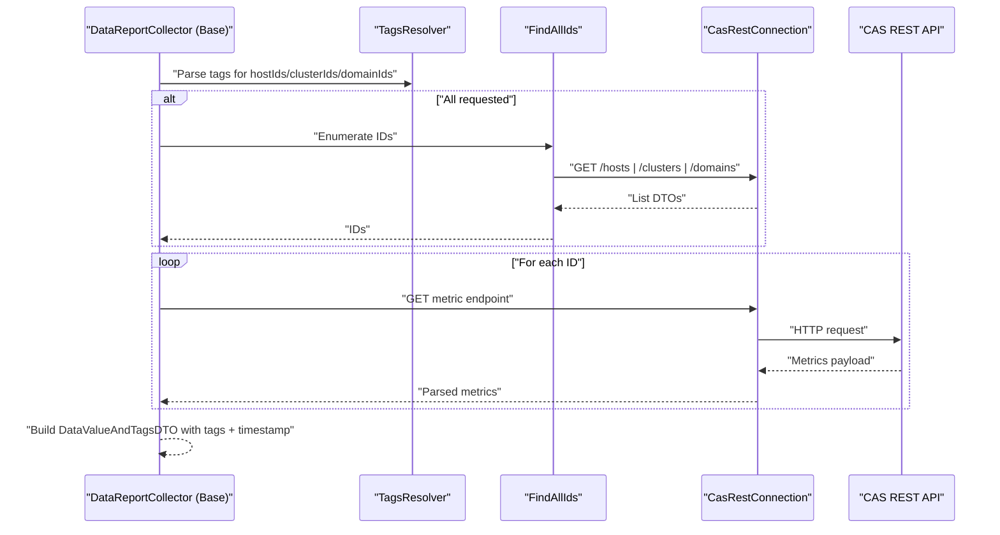
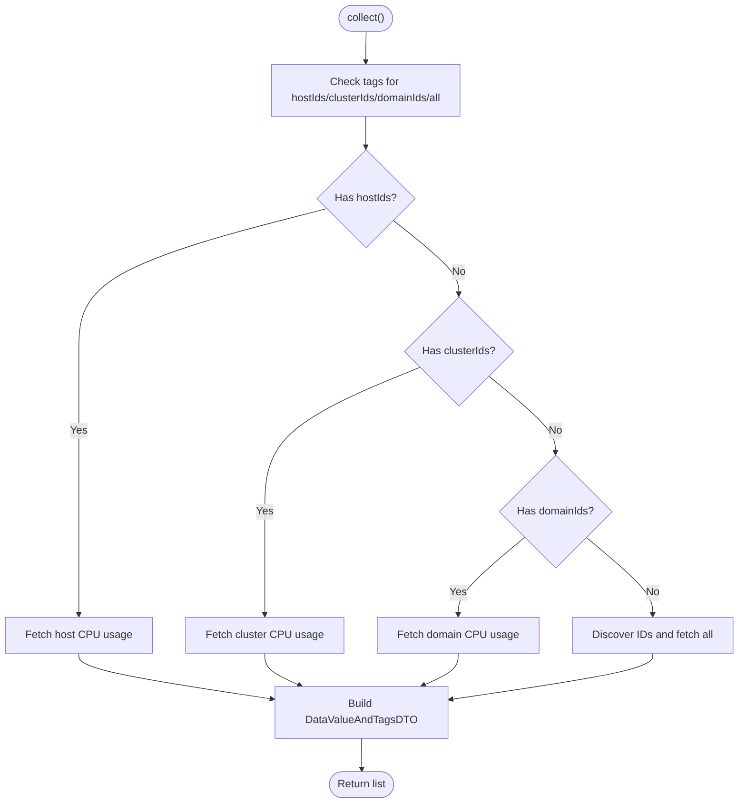

# Performance Monitoring & Health Checks

<cite>
**Referenced Files in This Document**
- [HostCpuUsageCollector.java](file://watcher-cas/src/main/java/com/virtual/cloud/om/cas/service/severPerformanceMonitor/HostCpuUsageCollector.java)
- [HostMemUsageCollector.java](file://watcher-cas/src/main/java/com/virtual/cloud/om/cas/service/severPerformanceMonitor/HostMemUsageCollector.java)
- [HostDiskIopsCollector.java](file://watcher-cas/src/main/java/com/virtual/cloud/om/cas/service/severPerformanceMonitor/HostDiskIopsCollector.java)
- [HostNetIopsCollector.java](file://watcher-cas/src/main/java/com/virtual/cloud/om/cas/service/severPerformanceMonitor/HostNetIopsCollector.java)
- [DiskThroughputCollector.java](file://watcher-cas/src/main/java/com/virtual/cloud/om/cas/service/severPerformanceMonitor/DiskThroughputCollector.java)
- [DomainCpuUseCollector.java](file://watcher-cas/src/main/java/com/virtual/cloud/om/cas/service/severPerformanceMonitor/DomainCpuUseCollector.java)
- [CpuAllocateRateCollector.java](file://watcher-cas/src/main/java/com/virtual/cloud/om/cas/service/severPerformanceMonitor/CpuAllocateRateCollector.java)
- [MemAllocateRateCollector.java](file://watcher-cas/src/main/java/com/virtual/cloud/om/cas/service/severPerformanceMonitor/MemAllocateRateCollector.java)
- [FindAllIds.java](file://watcher-cas/src/main/java/com/virtual/cloud/om/cas/service/severPerformanceMonitor/FindAllIds.java)
- [ConnnectDomainCollector.java](file://watcher-cas/src/main/java/com/virtual/cloud/om/cas/service/severPerformanceMonitor/ConnnectDomainCollector.java)
- [HostDiskUsageCollector.java](file://watcher-cas/src/main/java/com/virtual/cloud/om/cas/service/severPerformanceMonitor/HostDiskUsageCollector.java)
- [HostPartitionUsageCollector.java](file://watcher-cas/src/main/java/com/virtual/cloud/om/cas/service/severPerformanceMonitor/HostPartitionUsageCollector.java)
- [HostDiskLatencyCollector.java](file://watcher-cas/src/main/java/com/virtual/cloud/om/cas/service/severPerformanceMonitor/HostDiskLatencyCollector.java)
- [CasHostHandler.java](file://watcher-cas/src/main/java/com/virtual/cloud/om/cas/service/CasHostHandler.java)
- [DataReportTypeByMetricEnum.java](file://watcher-sdk/src/main/java/com/virtual/cloud/om/sdk/constant/DataReportTypeByMetricEnum.java)
- [Constant.java](file://watcher-sdk/src/main/java/com/virtual/cloud/om/sdk/constant/Constant.java)
</cite>

## Table of Contents
1. [Introduction](#introduction)
2. [Project Structure](#project-structure)
3. [Core Components](#core-components)
4. [Architecture Overview](#architecture-overview)
5. [Detailed Component Analysis](#detailed-component-analysis)
6. [Dependency Analysis](#dependency-analysis)
7. [Performance Considerations](#performance-considerations)
8. [Troubleshooting Guide](#troubleshooting-guide)
9. [Conclusion](#conclusion)
10. [Appendices](#appendices)

## Introduction
This document explains the CAS performance monitoring and health checking capabilities implemented in the ShowTime project. It focuses on the server-side performance suite that collects host CPU usage, memory utilization, disk IOPS, network IOPS, disk throughput, domain CPU usage, and resource allocation rates. It also covers monitoring data collection strategies, tag-based scoping, metric metadata, and how to interpret and act on the collected metrics for trend analysis and capacity planning.

## Project Structure
The CAS performance monitoring resides under the CAS module’s sever performance monitor package. Collectors implement a common pattern to query the CAS REST API for metrics across hosts, clusters, and domains. They build tagged data points suitable for downstream reporting and alerting.

```mermaid
graph TB
subgraph "CAS Module"
A["HostCpuUsageCollector"]
B["HostMemUsageCollector"]
C["HostDiskIopsCollector"]
D["HostNetIopsCollector"]
E["DiskThroughputCollector"]
F["DomainCpuUseCollector"]
G["CpuAllocateRateCollector"]
H["MemAllocateRateCollector"]
I["HostDiskUsageCollector"]
J["HostPartitionUsageCollector"]
K["HostDiskLatencyCollector"]
L["ConnnectDomainCollector"]
M["FindAllIds"]
end
subgraph "SDK"
N["DataReportTypeByMetricEnum"]
O["Constant (Tags)"]
end
A --> N
B --> N
C --> N
D --> N
E --> N
F --> N
G --> N
H --> N
I --> N
J --> N
K --> N
L --> N
A --> O
B --> O
C --> O
D --> O
E --> O
F --> O
G --> O
H --> O
I --> O
J --> O
K --> O
L --> O
A --> M
B --> M
C --> M
D --> M
E --> M
F --> M
G --> M
H --> M
I --> M
J --> M
K --> M
L --> M
```

**Diagram sources**
- [HostCpuUsageCollector.java:37-215](file://watcher-cas/src/main/java/com/virtual/cloud/om/cas/service/severPerformanceMonitor/HostCpuUsageCollector.java#L37-L215)
- [HostMemUsageCollector.java:34-191](file://watcher-cas/src/main/java/com/virtual/cloud/om/cas/service/severPerformanceMonitor/HostMemUsageCollector.java#L34-L191)
- [HostDiskIopsCollector.java:37-223](file://watcher-cas/src/main/java/com/virtual/cloud/om/cas/service/severPerformanceMonitor/HostDiskIopsCollector.java#L37-L223)
- [HostNetIopsCollector.java:34-181](file://watcher-cas/src/main/java/com/virtual/cloud/om/cas/service/severPerformanceMonitor/HostNetIopsCollector.java#L34-L181)
- [DiskThroughputCollector.java:35-191](file://watcher-cas/src/main/java/com/virtual/cloud/om/cas/service/severPerformanceMonitor/DiskThroughputCollector.java#L35-L191)
- [DomainCpuUseCollector.java:29-78](file://watcher-cas/src/main/java/com/virtual/cloud/om/cas/service/severPerformanceMonitor/DomainCpuUseCollector.java#L29-L78)
- [CpuAllocateRateCollector.java:33-90](file://watcher-cas/src/main/java/com/virtual/cloud/om/cas/service/severPerformanceMonitor/CpuAllocateRateCollector.java#L33-L90)
- [MemAllocateRateCollector.java:33-90](file://watcher-cas/src/main/java/com/virtual/cloud/om/cas/service/severPerformanceMonitor/MemAllocateRateCollector.java#L33-L90)
- [HostDiskUsageCollector.java:37-159](file://watcher-cas/src/main/java/com/virtual/cloud/om/cas/service/severPerformanceMonitor/HostDiskUsageCollector.java#L37-L159)
- [HostPartitionUsageCollector.java:35-196](file://watcher-cas/src/main/java/com/virtual/cloud/om/cas/service/severPerformanceMonitor/HostPartitionUsageCollector.java#L35-L196)
- [HostDiskLatencyCollector.java:36-174](file://watcher-cas/src/main/java/com/virtual/cloud/om/cas/service/severPerformanceMonitor/HostDiskLatencyCollector.java#L36-L174)
- [ConnnectDomainCollector.java:29-85](file://watcher-cas/src/main/java/com/virtual/cloud/om/cas/service/severPerformanceMonitor/ConnnectDomainCollector.java#L29-L85)
- [FindAllIds.java:27-85](file://watcher-cas/src/main/java/com/virtual/cloud/om/cas/service/severPerformanceMonitor/FindAllIds.java#L27-L85)
- [DataReportTypeByMetricEnum.java:21-155](file://watcher-sdk/src/main/java/com/virtual/cloud/om/sdk/constant/DataReportTypeByMetricEnum.java#L21-L155)
- [Constant.java:34-51](file://watcher-sdk/src/main/java/com/virtual/cloud/om/sdk/constant/Constant.java#L34-L51)

**Section sources**
- [HostCpuUsageCollector.java:37-215](file://watcher-cas/src/main/java/com/virtual/cloud/om/cas/service/severPerformanceMonitor/HostCpuUsageCollector.java#L37-L215)
- [HostMemUsageCollector.java:34-191](file://watcher-cas/src/main/java/com/virtual/cloud/om/cas/service/severPerformanceMonitor/HostMemUsageCollector.java#L34-L191)
- [HostDiskIopsCollector.java:37-223](file://watcher-cas/src/main/java/com/virtual/cloud/om/cas/service/severPerformanceMonitor/HostDiskIopsCollector.java#L37-L223)
- [HostNetIopsCollector.java:34-181](file://watcher-cas/src/main/java/com/virtual/cloud/om/cas/service/severPerformanceMonitor/HostNetIopsCollector.java#L34-L181)
- [DiskThroughputCollector.java:35-191](file://watcher-cas/src/main/java/com/virtual/cloud/om/cas/service/severPerformanceMonitor/DiskThroughputCollector.java#L35-L191)
- [DomainCpuUseCollector.java:29-78](file://watcher-cas/src/main/java/com/virtual/cloud/om/cas/service/severPerformanceMonitor/DomainCpuUseCollector.java#L29-L78)
- [CpuAllocateRateCollector.java:33-90](file://watcher-cas/src/main/java/com/virtual/cloud/om/cas/service/severPerformanceMonitor/CpuAllocateRateCollector.java#L33-L90)
- [MemAllocateRateCollector.java:33-90](file://watcher-cas/src/main/java/com/virtual/cloud/om/cas/service/severPerformanceMonitor/MemAllocateRateCollector.java#L33-L90)
- [HostDiskUsageCollector.java:37-159](file://watcher-cas/src/main/java/com/virtual/cloud/om/cas/service/severPerformanceMonitor/HostDiskUsageCollector.java#L37-L159)
- [HostPartitionUsageCollector.java:35-196](file://watcher-cas/src/main/java/com/virtual/cloud/om/cas/service/severPerformanceMonitor/HostPartitionUsageCollector.java#L35-L196)
- [HostDiskLatencyCollector.java:36-174](file://watcher-cas/src/main/java/com/virtual/cloud/om/cas/service/severPerformanceMonitor/HostDiskLatencyCollector.java#L36-L174)
- [ConnnectDomainCollector.java:29-85](file://watcher-cas/src/main/java/com/virtual/cloud/om/cas/service/severPerformanceMonitor/ConnnectDomainCollector.java#L29-L85)
- [FindAllIds.java:27-85](file://watcher-cas/src/main/java/com/virtual/cloud/om/cas/service/severPerformanceMonitor/FindAllIds.java#L27-L85)
- [DataReportTypeByMetricEnum.java:21-155](file://watcher-sdk/src/main/java/com/virtual/cloud/om/sdk/constant/DataReportTypeByMetricEnum.java#L21-L155)
- [Constant.java:34-51](file://watcher-sdk/src/main/java/com/virtual/cloud/om/sdk/constant/Constant.java#L34-L51)

## Core Components
- Host CPU usage: Collects CPU utilization per host, cluster, and domain, returning gauge values.
- Host memory usage: Collects memory utilization per host, cluster, and domain, returning gauge values.
- Host disk IOPS: Aggregates read/write IOPS per disk device for hosts and domains, returning JSON values.
- Host network IOPS: Aggregates send/receive throughput per NIC for hosts and domains, returning JSON values.
- Disk throughput: Aggregates read/write throughput per disk device for hosts and domains, returning JSON values.
- Domain CPU usage detail: Provides domain-level CPU usage detail, returning gauge values.
- CPU allocation rate: Reports host-level CPU oversubscription ratio, returning gauge values.
- Memory allocation rate: Reports host-level memory oversubscription ratio, returning gauge values.
- Host disk usage: Reports disk utilization per device for hosts and domains, returning gauge values.
- Host partition usage: Reports partition-level usage details for hosts and domains, returning JSON values.
- Host disk latency: Reports read/write latency per disk device for hosts and domains, returning JSON values.
- Domain connections: Reports current connection count per domain, returning gauge values.
- Discovery utility: Enumerates available host/domain/cluster identifiers when “all” is requested.

These components implement a common collector interface and rely on SDK constants for metric names and tag semantics.

**Section sources**
- [HostCpuUsageCollector.java:37-215](file://watcher-cas/src/main/java/com/virtual/cloud/om/cas/service/severPerformanceMonitor/HostCpuUsageCollector.java#L37-L215)
- [HostMemUsageCollector.java:34-191](file://watcher-cas/src/main/java/com/virtual/cloud/om/cas/service/severPerformanceMonitor/HostMemUsageCollector.java#L34-L191)
- [HostDiskIopsCollector.java:37-223](file://watcher-cas/src/main/java/com/virtual/cloud/om/cas/service/severPerformanceMonitor/HostDiskIopsCollector.java#L37-L223)
- [HostNetIopsCollector.java:34-181](file://watcher-cas/src/main/java/com/virtual/cloud/om/cas/service/severPerformanceMonitor/HostNetIopsCollector.java#L34-L181)
- [DiskThroughputCollector.java:35-191](file://watcher-cas/src/main/java/com/virtual/cloud/om/cas/service/severPerformanceMonitor/DiskThroughputCollector.java#L35-L191)
- [DomainCpuUseCollector.java:29-78](file://watcher-cas/src/main/java/com/virtual/cloud/om/cas/service/severPerformanceMonitor/DomainCpuUseCollector.java#L29-L78)
- [CpuAllocateRateCollector.java:33-90](file://watcher-cas/src/main/java/com/virtual/cloud/om/cas/service/severPerformanceMonitor/CpuAllocateRateCollector.java#L33-L90)
- [MemAllocateRateCollector.java:33-90](file://watcher-cas/src/main/java/com/virtual/cloud/om/cas/service/severPerformanceMonitor/MemAllocateRateCollector.java#L33-L90)
- [HostDiskUsageCollector.java:37-159](file://watcher-cas/src/main/java/com/virtual/cloud/om/cas/service/severPerformanceMonitor/HostDiskUsageCollector.java#L37-L159)
- [HostPartitionUsageCollector.java:35-196](file://watcher-cas/src/main/java/com/virtual/cloud/om/cas/service/severPerformanceMonitor/HostPartitionUsageCollector.java#L35-L196)
- [HostDiskLatencyCollector.java:36-174](file://watcher-cas/src/main/java/com/virtual/cloud/om/cas/service/severPerformanceMonitor/HostDiskLatencyCollector.java#L36-L174)
- [ConnnectDomainCollector.java:29-85](file://watcher-cas/src/main/java/com/virtual/cloud/om/cas/service/severPerformanceMonitor/ConnnectDomainCollector.java#L29-L85)
- [FindAllIds.java:27-85](file://watcher-cas/src/main/java/com/virtual/cloud/om/cas/service/severPerformanceMonitor/FindAllIds.java#L27-L85)

## Architecture Overview
The CAS performance collectors follow a uniform pattern:
- Parse tags to determine scope (hosts, clusters, domains, or “all”).
- Resolve identifiers when “all” is requested via discovery.
- Query CAS REST endpoints for per-entity metrics.
- Build tagged data points with timestamps and appropriate value types.
- Return lists of data points for upstream reporting.

**Diagram sources**
- [HostCpuUsageCollector.java:44-58](file://watcher-cas/src/main/java/com/virtual/cloud/om/cas/service/severPerformanceMonitor/HostCpuUsageCollector.java#L44-L58)
- [HostDiskIopsCollector.java:42-55](file://watcher-cas/src/main/java/com/virtual/cloud/om/cas/service/severPerformanceMonitor/HostDiskIopsCollector.java#L42-L55)
- [FindAllIds.java:32-82](file://watcher-cas/src/main/java/com/virtual/cloud/om/cas/service/severPerformanceMonitor/FindAllIds.java#L32-L82)

**Section sources**
- [HostCpuUsageCollector.java:44-58](file://watcher-cas/src/main/java/com/virtual/cloud/om/cas/service/severPerformanceMonitor/HostCpuUsageCollector.java#L44-L58)
- [HostDiskIopsCollector.java:42-55](file://watcher-cas/src/main/java/com/virtual/cloud/om/cas/service/severPerformanceMonitor/HostDiskIopsCollector.java#L42-L55)
- [FindAllIds.java:32-82](file://watcher-cas/src/main/java/com/virtual/cloud/om/cas/service/severPerformanceMonitor/FindAllIds.java#L32-L82)

## Detailed Component Analysis

### Host CPU Usage Collector
- Purpose: Retrieve CPU utilization for hosts, clusters, domains, or all.
- Scope resolution: Supports hostIds, clusterIds, domainIds, and “all” via discovery.
- Endpoint pattern: Queries per-entity CPU usage endpoints and returns latest gauge values.
- Tags: Includes resource ID and entity-specific tags (hostId, clusterId, domainId).
- Value type: Gauge.

**Diagram sources**
- [HostCpuUsageCollector.java:44-58](file://watcher-cas/src/main/java/com/virtual/cloud/om/cas/service/severPerformanceMonitor/HostCpuUsageCollector.java#L44-L58)

**Section sources**
- [HostCpuUsageCollector.java:44-58](file://watcher-cas/src/main/java/com/virtual/cloud/om/cas/service/severPerformanceMonitor/HostCpuUsageCollector.java#L44-L58)

### Host Memory Usage Collector
- Purpose: Retrieve memory utilization for hosts, clusters, domains, or all.
- Scope resolution: Same as CPU usage collector.
- Endpoint pattern: Queries per-entity memory usage endpoints and returns latest gauge values.
- Tags: Includes resource ID and entity-specific tags.
- Value type: Gauge.

**Section sources**
- [HostMemUsageCollector.java:40-53](file://watcher-cas/src/main/java/com/virtual/cloud/om/cas/service/severPerformanceMonitor/HostMemUsageCollector.java#L40-L53)

### Host Disk IOPS Collector
- Purpose: Aggregate read/write IOPS per disk device for hosts and domains.
- Data model: Returns JSON containing read/write pairs aligned by timestamp.
- Endpoint pattern: Uses trend-based endpoints and aligns read/write series by timestamp.
- Tags: Includes device name tag (dev=...).
- Value type: JSON.

**Section sources**
- [HostDiskIopsCollector.java:42-55](file://watcher-cas/src/main/java/com/virtual/cloud/om/cas/service/severPerformanceMonitor/HostDiskIopsCollector.java#L42-L55)

### Host Network IOPS Collector
- Purpose: Aggregate send/receive throughput per NIC for hosts and domains.
- Data model: Returns JSON containing send/receive pairs aligned by timestamp.
- Endpoint pattern: Uses trend-based endpoints and aligns send/receive series by timestamp.
- Tags: Includes NIC name tag (dev=...).
- Value type: JSON.

**Section sources**
- [HostNetIopsCollector.java:39-50](file://watcher-cas/src/main/java/com/virtual/cloud/om/cas/service/severPerformanceMonitor/HostNetIopsCollector.java#L39-L50)

### Disk Throughput Collector
- Purpose: Aggregate read/write throughput per disk device for hosts and domains.
- Data model: Returns JSON containing read/write pairs aligned by timestamp.
- Endpoint pattern: Similar to disk IOPS but for throughput values.
- Tags: Includes device name tag (dev=...).
- Value type: JSON.

**Section sources**
- [DiskThroughputCollector.java:42-54](file://watcher-cas/src/main/java/com/virtual/cloud/om/cas/service/severPerformanceMonitor/DiskThroughputCollector.java#L42-L54)

### Domain CPU Usage Detail Collector
- Purpose: Provide detailed CPU usage per domain.
- Endpoint pattern: Queries domain CPU usage detail endpoint.
- Tags: Includes domainId tag.
- Value type: Gauge.

**Section sources**
- [DomainCpuUseCollector.java:34-66](file://watcher-cas/src/main/java/com/virtual/cloud/om/cas/service/severPerformanceMonitor/DomainCpuUseCollector.java#L34-L66)

### CPU Allocation Rate Collector
- Purpose: Report host-level CPU oversubscription ratio.
- Endpoint pattern: Queries host detail endpoint for super-ratio and system time.
- Tags: Includes hostId tag.
- Value type: Gauge.

**Section sources**
- [CpuAllocateRateCollector.java:39-76](file://watcher-cas/src/main/java/com/virtual/cloud/om/cas/service/severPerformanceMonitor/CpuAllocateRateCollector.java#L39-L76)

### Memory Allocation Rate Collector
- Purpose: Report host-level memory oversubscription ratio.
- Endpoint pattern: Queries host detail endpoint for memory super-ratio and system time.
- Tags: Includes hostId tag.
- Value type: Gauge.

**Section sources**
- [MemAllocateRateCollector.java:38-75](file://watcher-cas/src/main/java/com/virtual/cloud/om/cas/service/severPerformanceMonitor/MemAllocateRateCollector.java#L38-L75)

### Host Disk Usage Collector
- Purpose: Report disk utilization per device for hosts and domains.
- Endpoint pattern: Queries trend-based disk usage endpoints and returns latest gauge values.
- Tags: Includes device name tag (dev=...).
- Value type: Gauge.

**Section sources**
- [HostDiskUsageCollector.java:42-53](file://watcher-cas/src/main/java/com/virtual/cloud/om/cas/service/severPerformanceMonitor/HostDiskUsageCollector.java#L42-L53)

### Host Partition Usage Collector
- Purpose: Report partition-level usage details for hosts and domains.
- Data model: Returns JSON containing partition name, size, used, mount point, utilization.
- Endpoint pattern: Queries partition usage endpoints and builds structured values.
- Value type: JSON.

**Section sources**
- [HostPartitionUsageCollector.java:40-51](file://watcher-cas/src/main/java/com/virtual/cloud/om/cas/service/severPerformanceMonitor/HostPartitionUsageCollector.java#L40-L51)

### Host Disk Latency Collector
- Purpose: Report read/write latency per disk device for hosts and domains.
- Data model: Returns JSON containing read/write latency aligned by timestamp.
- Endpoint pattern: Uses trend-based latency endpoints and aligns read/write series.
- Tags: Includes device name tag (dev=...).
- Value type: JSON.

**Section sources**
- [HostDiskLatencyCollector.java:41-52](file://watcher-cas/src/main/java/com/virtual/cloud/om/cas/service/severPerformanceMonitor/HostDiskLatencyCollector.java#L41-L52)

### Domain Connections Collector
- Purpose: Report current connection count per domain.
- Endpoint pattern: Queries domain link number endpoint.
- Tags: Includes domainId tag.
- Value type: Gauge.

**Section sources**
- [ConnnectDomainCollector.java:35-72](file://watcher-cas/src/main/java/com/virtual/cloud/om/cas/service/severPerformanceMonitor/ConnnectDomainCollector.java#L35-L72)

### Discovery Utility (FindAllIds)
- Purpose: Enumerate host, domain, and cluster identifiers when “all” is requested.
- Behavior: Calls CAS REST endpoints to list all entities and extracts IDs.
- Exceptions: Wraps errors into application exceptions with endpoint context.

**Section sources**
- [FindAllIds.java:32-82](file://watcher-cas/src/main/java/com/virtual/cloud/om/cas/service/severPerformanceMonitor/FindAllIds.java#L32-L82)

## Dependency Analysis
- Metric identity and platform mapping: Metrics are identified by enum entries that map metric names to supported platforms and separation modes.
- Tag semantics: Tag keys and special “all” values are standardized to enable consistent scoping across collectors.
- REST connectivity: All collectors depend on a shared REST client to query CAS endpoints.
- Host identification: Discovery utility centralizes enumeration of entities when “all” is requested.

```mermaid
classDiagram
class DataReportTypeByMetricEnum {
+desc
+metric
+platform
+separate
+getTypesByMetricAndPlatform(metric, platform)
+getTypesByMetricAndSeparate(metric, separate)
}
class Constant_Tags {
+HOST_IDS
+CLUSTER_IDS
+DOMAIN_IDS
+CULSTER_IDS_ALL_VALUE
+HOST_IDS_ALL_VALUE
+DOMAIN_IDS_ALL_VALUE
+HOST_ID
+CLUSTER_ID
+DOMAIN_ID
}
class HostCpuUsageCollector
class HostMemUsageCollector
class HostDiskIopsCollector
class HostNetIopsCollector
class DiskThroughputCollector
class DomainCpuUseCollector
class CpuAllocateRateCollector
class MemAllocateRateCollector
class HostDiskUsageCollector
class HostPartitionUsageCollector
class HostDiskLatencyCollector
class ConnnectDomainCollector
class FindAllIds
HostCpuUsageCollector --> DataReportTypeByMetricEnum : "metric()"
HostMemUsageCollector --> DataReportTypeByMetricEnum : "metric()"
HostDiskIopsCollector --> DataReportTypeByMetricEnum : "metric()"
HostNetIopsCollector --> DataReportTypeByMetricEnum : "metric()"
DiskThroughputCollector --> DataReportTypeByMetricEnum : "metric()"
DomainCpuUseCollector --> DataReportTypeByMetricEnum : "metric()"
CpuAllocateRateCollector --> DataReportTypeByMetricEnum : "metric()"
MemAllocateRateCollector --> DataReportTypeByMetricEnum : "metric()"
HostDiskUsageCollector --> DataReportTypeByMetricEnum : "metric()"
HostPartitionUsageCollector --> DataReportTypeByMetricEnum : "metric()"
HostDiskLatencyCollector --> DataReportTypeByMetricEnum : "metric()"
ConnnectDomainCollector --> DataReportTypeByMetricEnum : "metric()"
HostCpuUsageCollector --> Constant_Tags : "uses tag keys"
HostMemUsageCollector --> Constant_Tags : "uses tag keys"
HostDiskIopsCollector --> Constant_Tags : "uses tag keys"
HostNetIopsCollector --> Constant_Tags : "uses tag keys"
DiskThroughputCollector --> Constant_Tags : "uses tag keys"
DomainCpuUseCollector --> Constant_Tags : "uses tag keys"
CpuAllocateRateCollector --> Constant_Tags : "uses tag keys"
MemAllocateRateCollector --> Constant_Tags : "uses tag keys"
HostDiskUsageCollector --> Constant_Tags : "uses tag keys"
HostPartitionUsageCollector --> Constant_Tags : "uses tag keys"
HostDiskLatencyCollector --> Constant_Tags : "uses tag keys"
ConnnectDomainCollector --> Constant_Tags : "uses tag keys"
```

**Diagram sources**
- [DataReportTypeByMetricEnum.java:21-155](file://watcher-sdk/src/main/java/com/virtual/cloud/om/sdk/constant/DataReportTypeByMetricEnum.java#L21-L155)
- [Constant.java:34-51](file://watcher-sdk/src/main/java/com/virtual/cloud/om/sdk/constant/Constant.java#L34-L51)
- [HostCpuUsageCollector.java:204-213](file://watcher-cas/src/main/java/com/virtual/cloud/om/cas/service/severPerformanceMonitor/HostCpuUsageCollector.java#L204-L213)
- [HostMemUsageCollector.java:180-189](file://watcher-cas/src/main/java/com/virtual/cloud/om/cas/service/severPerformanceMonitor/HostMemUsageCollector.java#L180-L189)
- [HostDiskIopsCollector.java:211-220](file://watcher-cas/src/main/java/com/virtual/cloud/om/cas/service/severPerformanceMonitor/HostDiskIopsCollector.java#L211-L220)
- [HostNetIopsCollector.java:170-179](file://watcher-cas/src/main/java/com/virtual/cloud/om/cas/service/severPerformanceMonitor/HostNetIopsCollector.java#L170-L179)
- [DiskThroughputCollector.java:155-164](file://watcher-cas/src/main/java/com/virtual/cloud/om/cas/service/severPerformanceMonitor/DiskThroughputCollector.java#L155-L164)
- [DomainCpuUseCollector.java:69-77](file://watcher-cas/src/main/java/com/virtual/cloud/om/cas/service/severPerformanceMonitor/DomainCpuUseCollector.java#L69-L77)
- [CpuAllocateRateCollector.java:80-88](file://watcher-cas/src/main/java/com/virtual/cloud/om/cas/service/severPerformanceMonitor/CpuAllocateRateCollector.java#L80-L88)
- [MemAllocateRateCollector.java:79-88](file://watcher-cas/src/main/java/com/virtual/cloud/om/cas/service/severPerformanceMonitor/MemAllocateRateCollector.java#L79-L88)
- [HostDiskUsageCollector.java:149-157](file://watcher-cas/src/main/java/com/virtual/cloud/om/cas/service/severPerformanceMonitor/HostDiskUsageCollector.java#L149-L157)
- [HostPartitionUsageCollector.java:185-194](file://watcher-cas/src/main/java/com/virtual/cloud/om/cas/service/severPerformanceMonitor/HostPartitionUsageCollector.java#L185-L194)
- [HostDiskLatencyCollector.java:163-172](file://watcher-cas/src/main/java/com/virtual/cloud/om/cas/service/severPerformanceMonitor/HostDiskLatencyCollector.java#L163-L172)
- [ConnnectDomainCollector.java:75-83](file://watcher-cas/src/main/java/com/virtual/cloud/om/cas/service/severPerformanceMonitor/ConnnectDomainCollector.java#L75-L83)

**Section sources**
- [DataReportTypeByMetricEnum.java:21-155](file://watcher-sdk/src/main/java/com/virtual/cloud/om/sdk/constant/DataReportTypeByMetricEnum.java#L21-L155)
- [Constant.java:34-51](file://watcher-sdk/src/main/java/com/virtual/cloud/om/sdk/constant/Constant.java#L34-L51)

## Performance Considerations
- Parallelism: Many collectors use parallel streams to query multiple entities concurrently, reducing total collection latency.
- Asynchronous aggregation: Some collectors use asynchronous futures to process per-entity results and aggregate them efficiently.
- Timestamp alignment: Collectors align read/write series by timestamp to ensure coherent JSON outputs for IOPS, throughput, and latency.
- Discovery cost: Using “all” triggers enumeration calls to discover IDs, which adds overhead; prefer scoping to specific IDs for frequent polling.
- REST round-trips: Each entity requires a dedicated REST call; batching is not implemented at the collector level.

[No sources needed since this section provides general guidance]

## Troubleshooting Guide
- Missing or empty results:
  - Verify tag keys and values match supported keys and “all” sentinel values.
  - Confirm discovery succeeds for “all” requests; failures raise application exceptions with endpoint context.
- REST errors:
  - Collectors wrap exceptions and log error details; check logs for endpoint URLs and messages.
- Timestamp parsing:
  - Allocation rate collectors parse system time from host details; ensure time format compatibility.
- Tagging:
  - Ensure tags include resource ID and correct entity tags (hostId, clusterId, domainId).

**Section sources**
- [FindAllIds.java:38-40](file://watcher-cas/src/main/java/com/virtual/cloud/om/cas/service/severPerformanceMonitor/FindAllIds.java#L38-L40)
- [CpuAllocateRateCollector.java:65-71](file://watcher-cas/src/main/java/com/virtual/cloud/om/cas/service/severPerformanceMonitor/CpuAllocateRateCollector.java#L65-L71)
- [Constant.java:34-51](file://watcher-sdk/src/main/java/com/virtual/cloud/om/sdk/constant/Constant.java#L34-L51)

## Conclusion
The CAS performance monitoring suite provides comprehensive coverage of host CPU, memory, disk IOPS, network IOPS, disk throughput, domain CPU usage, and resource allocation rates. Collectors implement a consistent pattern for scoping, discovery, REST querying, and tagging, enabling reliable trend analysis and capacity planning. While the current design favors correctness and flexibility, further enhancements could include batching, caching, and configurable thresholds for alerting.

[No sources needed since this section summarizes without analyzing specific files]

## Appendices

### Metrics Catalog and Metadata
- Metric names and value types are defined centrally and mapped to platforms and separation modes.
- Typical categories:
  - Gauge metrics: cpu_usage, mem_usage, disk_usage, cpu_usage_detail, cpu_allocate_rate, mem_allocate_rate, connection.
  - JSON metrics: disk_iops, net_throughput, disk_throughput, disk_latency, partition_usage.

**Section sources**
- [DataReportTypeByMetricEnum.java:21-155](file://watcher-sdk/src/main/java/com/virtual/cloud/om/sdk/constant/DataReportTypeByMetricEnum.java#L21-L155)

### Tag Scoping Reference
- Supported tag keys:
  - hostIds, clusterIds, domainIds
  - Special “all” values: clusterIds=-1, hostIds=-2, domainIds=-3
- Tag values appended to data points:
  - hostId, clusterId, domainId

**Section sources**
- [Constant.java:34-51](file://watcher-sdk/src/main/java/com/virtual/cloud/om/sdk/constant/Constant.java#L34-L51)

### Health Checking Capability
- Health-related metrics are defined in the SDK metric catalog; CAS collectors expose health info and related operational metrics suitable for dashboards and alerts.

**Section sources**
- [DataReportTypeByMetricEnum.java:85-85](file://watcher-sdk/src/main/java/com/virtual/cloud/om/sdk/constant/DataReportTypeByMetricEnum.java#L85-L85)

### Integration Notes
- Host identification and credentials:
  - Host handler resolves host details and credentials for CAS endpoints.
- Reporting integration:
  - Collectors return tagged data points suitable for downstream reporting pipelines.

**Section sources**
- [CasHostHandler.java:31-60](file://watcher-cas/src/main/java/com/virtual/cloud/om/cas/service/CasHostHandler.java#L31-L60)