# Reporting & Metrics Collection

<cite>
**Referenced Files in This Document**
- [DataReportCollector.java](file://watcher-sdk/src/main/java/com/virtual/cloud/om/sdk/api/DataReportCollector.java)
- [CasRestConnection.java](file://watcher-sdk/src/main/java/com/virtual/cloud/om/sdk/config/rest/cas/CasRestConnection.java)
- [CasUriConstants.java](file://watcher-sdk/src/main/java/com/virtual/cloud/om/sdk/constant/uri/CasUriConstants.java)
- [ReportDataTypeEnum.java](file://watcher-sdk/src/main/java/com/virtual/cloud/om/sdk/constant/report/ReportDataTypeEnum.java)
- [DataReportTypeByMetricEnum.java](file://watcher-sdk/src/main/java/com/virtual/cloud/om/sdk/constant/DataReportTypeByMetricEnum.java)
- [TagsUtil.java](file://watcher-sdk/src/main/java/com/virtual/cloud/om/sdk/utils/TagsUtil.java)
- [DateTimeTool.java](file://watcher-sdk/src/main/java/com/virtual/cloud/om/sdk/utils/DateTimeTool.java)
- [CasHostHandler.java](file://watcher-cas/src/main/java/com/virtual/cloud/om/cas/service/CasHostHandler.java)
- [FindAllIds.java](file://watcher-cas/src/main/java/com/virtual/cloud/om/cas/service/severPerformanceMonitor/FindAllIds.java)
- [HostCpuUsageCollector.java](file://watcher-cas/src/main/java/com/virtual/cloud/om/cas/service/severPerformanceMonitor/HostCpuUsageCollector.java)
- [HostMemUsageCollector.java](file://watcher-cas/src/main/java/com/virtual/cloud/om/cas/service/severPerformanceMonitor/HostMemUsageCollector.java)
- [DiskThroughputCollector.java](file://watcher-cas/src/main/java/com/virtual/cloud/om/cas/service/severPerformanceMonitor/DiskThroughputCollector.java)
- [ConnnectDomainCollector.java](file://watcher-cas/src/main/java/com/virtual/cloud/om/cas/service/severPerformanceMonitor/ConnnectDomainCollector.java)
- [CpuAllocateRateCollector.java](file://watcher-cas/src/main/java/com/virtual/cloud/om/cas/service/severPerformanceMonitor/CpuAllocateRateCollector.java)
- [ClusterBasicCollector.java](file://watcher-cas/src/main/java/com/virtual/cloud/om/cas/service/report/ClusterBasicCollector.java)
- [DomainBasicCollector.java](file://watcher-cas/src/main/java/com/virtual/cloud/om/cas/service/report/DomainBasicCollector.java)
- [HealthInfoCollector.java](file://watcher-cas/src/main/java/com/virtual/cloud/om/cas/service/report/HealthInfoCollector.java)
- [StoragePoolBasicCollector.java](file://watcher-cas/src/main/java/com/virtual/cloud/om/cas/service/report/StoragePoolBasicCollector.java)
- [HostPerformanceCollector.java](file://watcher-cas/src/main/java/com/virtual/cloud/om/cas/service/report/HostPerformanceCollector.java)
- [HostSummaryCollector.java](file://watcher-cas/src/main/java/com/virtual/cloud/om/cas/service/report/HostSummaryCollector.java)
- [ClusterHostCPUTopNCollector.java](file://watcher-cas/src/main/java/com/virtual/cloud/om/cas/service/report/ClusterHostCPUTopNCollector.java)
- [ClusterVirtHostCpuTopNCollector.java](file://watcher-cas/src/main/java/com/virtual/cloud/om/cas/service/report/ClusterVirtHostCpuTopNCollector.java)
</cite>

## Table of Contents
1. [Introduction](#introduction)
2. [Project Structure](#project-structure)
3. [Core Components](#core-components)
4. [Architecture Overview](#architecture-overview)
5. [Detailed Component Analysis](#detailed-component-analysis)
6. [Dependency Analysis](#dependency-analysis)
7. [Performance Considerations](#performance-considerations)
8. [Troubleshooting Guide](#troubleshooting-guide)
9. [Conclusion](#conclusion)
10. [Appendices](#appendices)

## Introduction
This document describes the CAS reporting and metrics collection subsystem. It covers the comprehensive suite of specialized collectors that gather cluster basics, host performance, domain statistics, health information, and storage metrics. It explains implementation patterns for CPU usage tracking, memory consumption monitoring, disk I/O analysis, network throughput measurement, and virtual machine resource allocation. It also documents data collection intervals, aggregation strategies, metric transformation processes, configuration examples, performance optimization techniques, troubleshooting approaches, and guidelines for interpreting metrics to identify performance bottlenecks in CAS environments.

## Project Structure
The CAS reporting subsystem is organized around two primary packages:
- report: Basic inventory and summary collectors for clusters, domains, hosts, health, storage, and top-N resource lists.
- severPerformanceMonitor: Performance-oriented collectors for CPU usage, memory usage, disk throughput, connections, and CPU allocation rates.

Collectors inherit from a shared base class and use a REST client to query CAS endpoints. They produce standardized metric payloads enriched with tags and timestamps.

```mermaid
graph TB
subgraph "CAS SDK"
DRC["DataReportCollector<br/>Base Collector"]
CRC["CasRestConnection<br/>REST Client"]
URI["CasUriConstants<br/>Endpoint URIs"]
TPE["ReportDataTypeEnum<br/>Value Types"]
MTE["DataReportTypeByMetricEnum<br/>Metric Names"]
TAG["TagsUtil<br/>Tag Builder"]
DTT["DateTimeTool<br/>Timestamp Utils"]
end
subgraph "CAS Report Collectors"
CLB["ClusterBasicCollector"]
DOB["DomainBasicCollector"]
HIC["HealthInfoCollector"]
SPB["StoragePoolBasicCollector"]
HPC["HostPerformanceCollector"]
HSC["HostSummaryCollector"]
CHC["ClusterHostCPUTopNCollector"]
CVH["ClusterVirtHostCpuTopNCollector"]
end
subgraph "CAS Perf Mon Collectors"
HCU["HostCpuUsageCollector"]
HMU["HostMemUsageCollector"]
DT["DiskThroughputCollector"]
CD["ConnnectDomainCollector"]
CAR["CpuAllocateRateCollector"]
FID["FindAllIds"]
HH["CasHostHandler"]
end
DRC --> CRC
DRC --> URI
DRC --> TPE
DRC --> MTE
DRC --> TAG
DRC --> DTT
CLB --> DRC
DOB --> DRC
HIC --> DRC
SPB --> DRC
HPC --> DRC
HSC --> DRC
CHC --> DRC
CVH --> DRC
HCU --> DRC
HCU --> FID
HCU --> CRC
HCU --> TAG
HMU --> DRC
HMU --> FID
HMU --> CRC
HMU --> TAG
DT --> DRC
DT --> FID
DT --> CRC
DT --> TAG
CD --> DRC
CD --> FID
CD --> CRC
CD --> TAG
CAR --> DRC
CAR --> FID
CAR --> CRC
CAR --> TAG
HH --> CRC
HH --> URI
```

**Diagram sources**
- [DataReportCollector.java:1-118](file://watcher-sdk/src/main/java/com/virtual/cloud/om/sdk/api/DataReportCollector.java#L1-L118)
- [CasRestConnection.java](file://watcher-sdk/src/main/java/com/virtual/cloud/om/sdk/config/rest/cas/CasRestConnection.java)
- [CasUriConstants.java](file://watcher-sdk/src/main/java/com/virtual/cloud/om/sdk/constant/uri/CasUriConstants.java)
- [ReportDataTypeEnum.java](file://watcher-sdk/src/main/java/com/virtual/cloud/om/sdk/constant/report/ReportDataTypeEnum.java)
- [DataReportTypeByMetricEnum.java](file://watcher-sdk/src/main/java/com/virtual/cloud/om/sdk/constant/DataReportTypeByMetricEnum.java)
- [TagsUtil.java](file://watcher-sdk/src/main/java/com/virtual/cloud/om/sdk/utils/TagsUtil.java)
- [DateTimeTool.java](file://watcher-sdk/src/main/java/com/virtual/cloud/om/sdk/utils/DateTimeTool.java)
- [CasHostHandler.java:1-61](file://watcher-cas/src/main/java/com/virtual/cloud/om/cas/service/CasHostHandler.java#L1-L61)
- [FindAllIds.java:1-86](file://watcher-cas/src/main/java/com/virtual/cloud/om/cas/service/severPerformanceMonitor/FindAllIds.java#L1-L86)
- [HostCpuUsageCollector.java:1-216](file://watcher-cas/src/main/java/com/virtual/cloud/om/cas/service/severPerformanceMonitor/HostCpuUsageCollector.java#L1-L216)
- [HostMemUsageCollector.java:1-192](file://watcher-cas/src/main/java/com/virtual/cloud/om/cas/service/severPerformanceMonitor/HostMemUsageCollector.java#L1-L192)
- [DiskThroughputCollector.java:1-192](file://watcher-cas/src/main/java/com/virtual/cloud/om/cas/service/severPerformanceMonitor/DiskThroughputCollector.java#L1-L192)
- [ConnnectDomainCollector.java:1-86](file://watcher-cas/src/main/java/com/virtual/cloud/om/cas/service/severPerformanceMonitor/ConnnectDomainCollector.java#L1-L86)
- [CpuAllocateRateCollector.java:1-91](file://watcher-cas/src/main/java/com/virtual/cloud/om/cas/service/severPerformanceMonitor/CpuAllocateRateCollector.java#L1-L91)
- [ClusterBasicCollector.java:1-73](file://watcher-cas/src/main/java/com/virtual/cloud/om/cas/service/report/ClusterBasicCollector.java#L1-L73)
- [DomainBasicCollector.java:1-164](file://watcher-cas/src/main/java/com/virtual/cloud/om/cas/service/report/DomainBasicCollector.java#L1-L164)
- [HealthInfoCollector.java:1-75](file://watcher-cas/src/main/java/com/virtual/cloud/om/cas/service/report/HealthInfoCollector.java#L1-L75)
- [StoragePoolBasicCollector.java:1-101](file://watcher-cas/src/main/java/com/virtual/cloud/om/cas/service/report/StoragePoolBasicCollector.java#L1-L101)
- [HostPerformanceCollector.java:1-68](file://watcher-cas/src/main/java/com/virtual/cloud/om/cas/service/report/HostPerformanceCollector.java#L1-L68)
- [HostSummaryCollector.java:1-65](file://watcher-cas/src/main/java/com/virtual/cloud/om/cas/service/report/HostSummaryCollector.java#L1-L65)
- [ClusterHostCPUTopNCollector.java:1-68](file://watcher-cas/src/main/java/com/virtual/cloud/om/cas/service/report/ClusterHostCPUTopNCollector.java#L1-L68)
- [ClusterVirtHostCpuTopNCollector.java:1-69](file://watcher-cas/src/main/java/com/virtual/cloud/om/cas/service/report/ClusterVirtHostCpuTopNCollector.java#L1-L69)

**Section sources**
- [DataReportCollector.java:1-118](file://watcher-sdk/src/main/java/com/virtual/cloud/om/sdk/api/DataReportCollector.java#L1-L118)
- [CasRestConnection.java](file://watcher-sdk/src/main/java/com/virtual/cloud/om/sdk/config/rest/cas/CasRestConnection.java)
- [CasUriConstants.java](file://watcher-sdk/src/main/java/com/virtual/cloud/om/sdk/constant/uri/CasUriConstants.java)
- [ReportDataTypeEnum.java](file://watcher-sdk/src/main/java/com/virtual/cloud/om/sdk/constant/report/ReportDataTypeEnum.java)
- [DataReportTypeByMetricEnum.java](file://watcher-sdk/src/main/java/com/virtual/cloud/om/sdk/constant/DataReportTypeByMetricEnum.java)
- [TagsUtil.java](file://watcher-sdk/src/main/java/com/virtual/cloud/om/sdk/utils/TagsUtil.java)
- [DateTimeTool.java](file://watcher-sdk/src/main/java/com/virtual/cloud/om/sdk/utils/DateTimeTool.java)
- [CasHostHandler.java:1-61](file://watcher-cas/src/main/java/com/virtual/cloud/om/cas/service/CasHostHandler.java#L1-L61)
- [FindAllIds.java:1-86](file://watcher-cas/src/main/java/com/virtual/cloud/om/cas/service/severPerformanceMonitor/FindAllIds.java#L1-L86)

## Core Components
- Base collector: Provides the common collection lifecycle, tag parsing, and payload shaping.
- REST client: Centralized HTTP access to CAS endpoints.
- Endpoint constants: Unified URI definitions for CAS APIs.
- Tagging and timestamp utilities: Consistent tagging and time normalization.
- Host handler: Resolves host credentials and IDs for CAS.
- ID discovery utility: Enumerates host/domain/cluster IDs for wildcard collections.

Key responsibilities:
- Parse tags to extract target IDs (hostIds, domainIds, clusterIds).
- Fetch metrics via REST endpoints.
- Transform raw data into standardized DTOs with tags and timestamps.
- Return structured reports for upstream ingestion.

**Section sources**
- [DataReportCollector.java:1-118](file://watcher-sdk/src/main/java/com/virtual/cloud/om/sdk/api/DataReportCollector.java#L1-L118)
- [CasRestConnection.java](file://watcher-sdk/src/main/java/com/virtual/cloud/om/sdk/config/rest/cas/CasRestConnection.java)
- [CasUriConstants.java](file://watcher-sdk/src/main/java/com/virtual/cloud/om/sdk/constant/uri/CasUriConstants.java)
- [TagsUtil.java](file://watcher-sdk/src/main/java/com/virtual/cloud/om/sdk/utils/TagsUtil.java)
- [DateTimeTool.java](file://watcher-sdk/src/main/java/com/virtual/cloud/om/sdk/utils/DateTimeTool.java)
- [CasHostHandler.java:1-61](file://watcher-cas/src/main/java/com/virtual/cloud/om/cas/service/CasHostHandler.java#L1-L61)
- [FindAllIds.java:1-86](file://watcher-cas/src/main/java/com/virtual/cloud/om/cas/service/severPerformanceMonitor/FindAllIds.java#L1-L86)

## Architecture Overview
The collectors follow a uniform pattern:
- Receive a RestHost context and a tags string.
- Extract target IDs from tags.
- Query CAS endpoints using the REST client.
- Build DataValueAndTagsDTO entries with metric values, tags, and timestamps.
- Convert to ReportDTO for downstream processing.

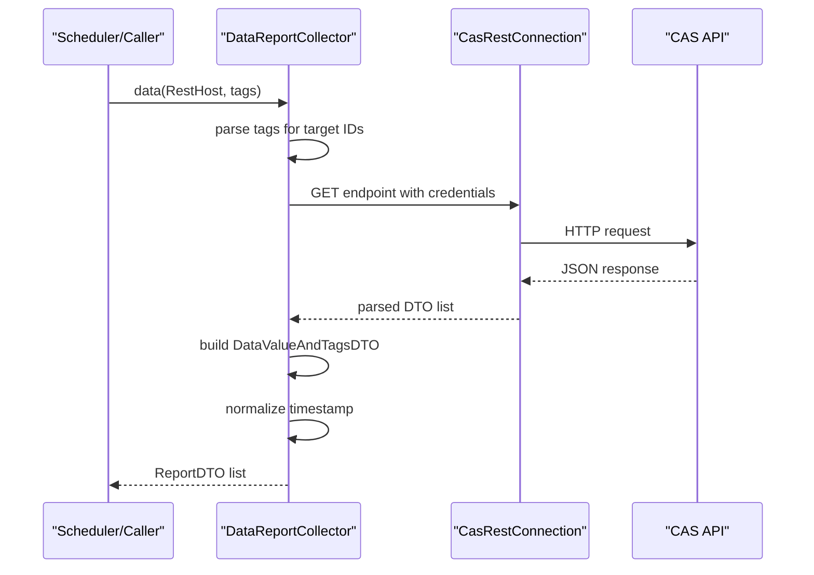

**Diagram sources**
- [DataReportCollector.java:48-86](file://watcher-sdk/src/main/java/com/virtual/cloud/om/sdk/api/DataReportCollector.java#L48-L86)
- [CasRestConnection.java](file://watcher-sdk/src/main/java/com/virtual/cloud/om/sdk/config/rest/cas/CasRestConnection.java)
- [CasUriConstants.java](file://watcher-sdk/src/main/java/com/virtual/cloud/om/sdk/constant/uri/CasUriConstants.java)

## Detailed Component Analysis

### CPU Usage Tracking (Host, Cluster, Domain)
Implementation pattern:
- Detect target scope from tags: clusterIds, hostIds, or domainIds.
- For wildcard “all”, discover IDs via FindAllIds.
- Query the appropriate endpoint for CPU usage trends.
- Select the latest sample by time and emit a gauge metric.

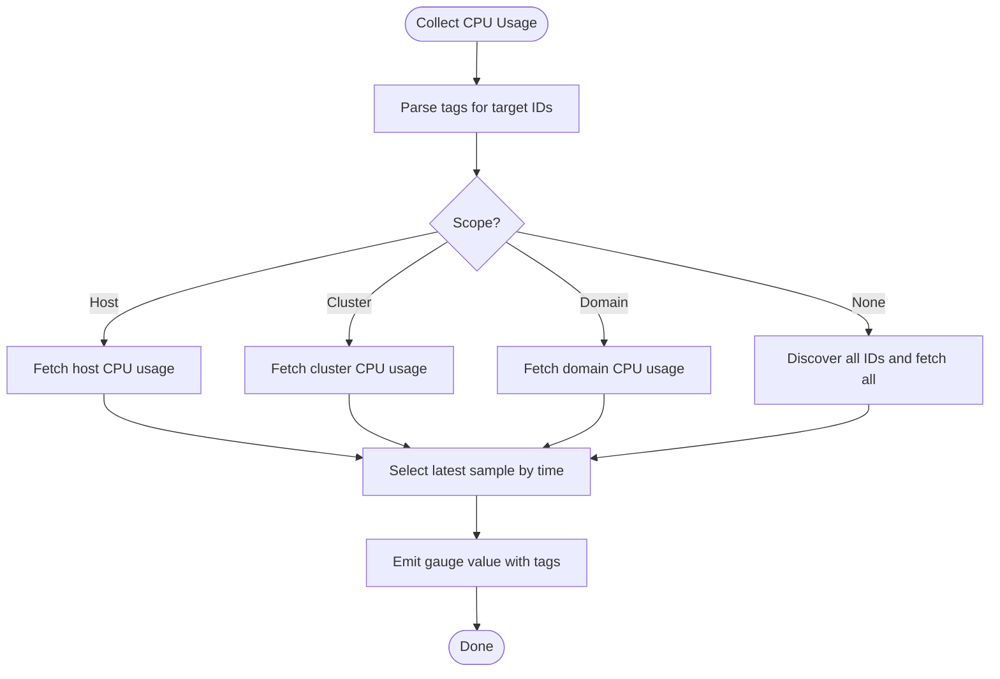

**Diagram sources**
- [HostCpuUsageCollector.java:44-201](file://watcher-cas/src/main/java/com/virtual/cloud/om/cas/service/severPerformanceMonitor/HostCpuUsageCollector.java#L44-L201)
- [FindAllIds.java:32-82](file://watcher-cas/src/main/java/com/virtual/cloud/om/cas/service/severPerformanceMonitor/FindAllIds.java#L32-L82)

**Section sources**
- [HostCpuUsageCollector.java:1-216](file://watcher-cas/src/main/java/com/virtual/cloud/om/cas/service/severPerformanceMonitor/HostCpuUsageCollector.java#L1-L216)
- [FindAllIds.java:1-86](file://watcher-cas/src/main/java/com/virtual/cloud/om/cas/service/severPerformanceMonitor/FindAllIds.java#L1-L86)

### Memory Consumption Monitoring
Implementation pattern:
- Similar to CPU usage but for memory utilization.
- Uses FindAllIds for wildcard discovery.
- Emits a gauge metric with memory usage percentage.

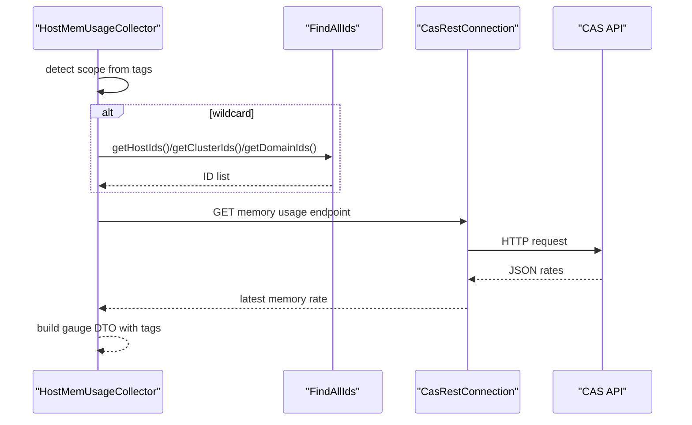

**Diagram sources**
- [HostMemUsageCollector.java:40-177](file://watcher-cas/src/main/java/com/virtual/cloud/om/cas/service/severPerformanceMonitor/HostMemUsageCollector.java#L40-L177)
- [FindAllIds.java:32-82](file://watcher-cas/src/main/java/com/virtual/cloud/om/cas/service/severPerformanceMonitor/FindAllIds.java#L32-L82)

**Section sources**
- [HostMemUsageCollector.java:1-192](file://watcher-cas/src/main/java/com/virtual/cloud/om/cas/service/severPerformanceMonitor/HostMemUsageCollector.java#L1-L192)

### Disk I/O Analysis (Throughput)
Implementation pattern:
- Supports host and domain scopes.
- Aggregates read/write pairs by matching timestamps.
- Emits a JSON metric containing read and write throughput per device.

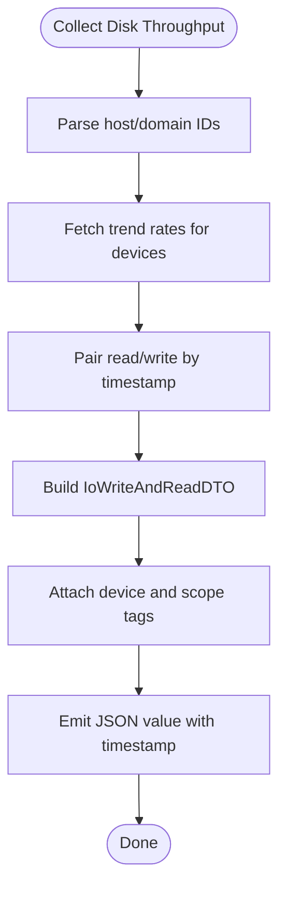

**Diagram sources**
- [DiskThroughputCollector.java:58-153](file://watcher-cas/src/main/java/com/virtual/cloud/om/cas/service/severPerformanceMonitor/DiskThroughputCollector.java#L58-L153)

**Section sources**
- [DiskThroughputCollector.java:1-192](file://watcher-cas/src/main/java/com/virtual/cloud/om/cas/service/severPerformanceMonitor/DiskThroughputCollector.java#L1-L192)

### Network Connections Measurement
Implementation pattern:
- Focuses on domain-level connections.
- Retrieves the latest connection count and emits a gauge.

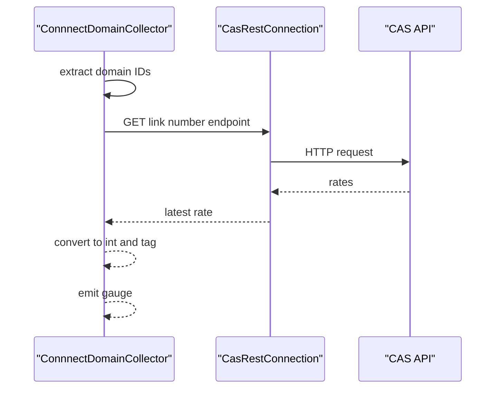

**Diagram sources**
- [ConnnectDomainCollector.java:35-72](file://watcher-cas/src/main/java/com/virtual/cloud/om/cas/service/severPerformanceMonitor/ConnnectDomainCollector.java#L35-L72)

**Section sources**
- [ConnnectDomainCollector.java:1-86](file://watcher-cas/src/main/java/com/virtual/cloud/om/cas/service/severPerformanceMonitor/ConnnectDomainCollector.java#L1-L86)

### CPU Allocation Rate
Implementation pattern:
- Queries host details to obtain CPU super ratio.
- Converts system time string to timestamp and emits a gauge.

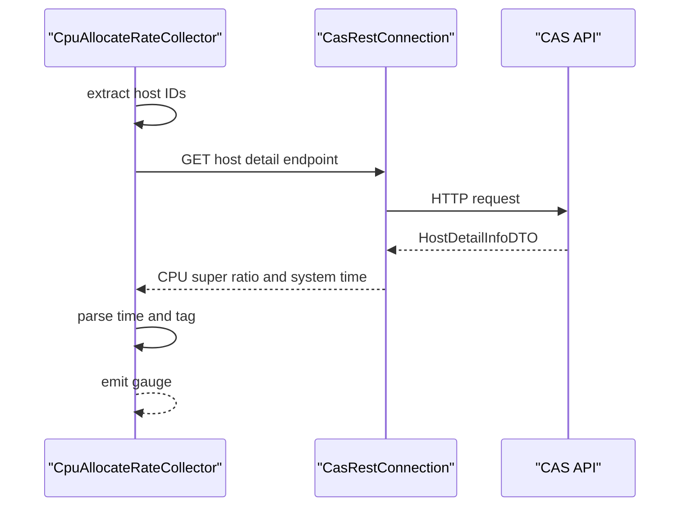

**Diagram sources**
- [CpuAllocateRateCollector.java:39-76](file://watcher-cas/src/main/java/com/virtual/cloud/om/cas/service/severPerformanceMonitor/CpuAllocateRateCollector.java#L39-L76)

**Section sources**
- [CpuAllocateRateCollector.java:1-91](file://watcher-cas/src/main/java/com/virtual/cloud/om/cas/service/severPerformanceMonitor/CpuAllocateRateCollector.java#L1-L91)

### Cluster Basics
Implementation pattern:
- Fetches all clusters and transforms to a basic DTO set.
- Emits a JSON array with cluster metadata.

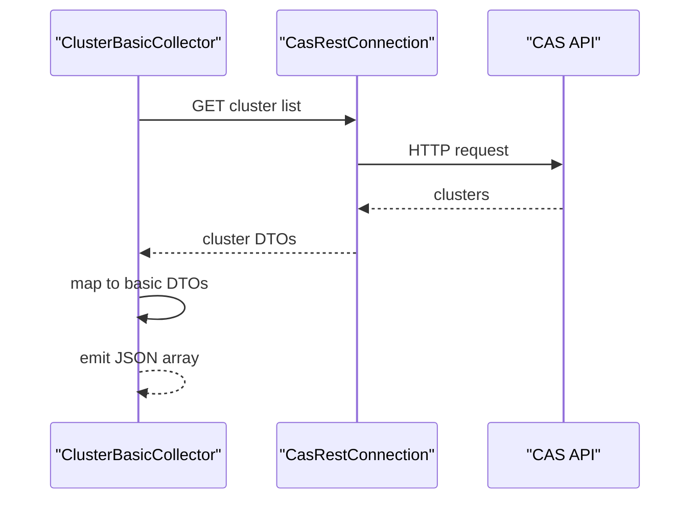

**Diagram sources**
- [ClusterBasicCollector.java:31-60](file://watcher-cas/src/main/java/com/virtual/cloud/om/cas/service/report/ClusterBasicCollector.java#L31-L60)

**Section sources**
- [ClusterBasicCollector.java:1-73](file://watcher-cas/src/main/java/com/virtual/cloud/om/cas/service/report/ClusterBasicCollector.java#L1-L73)

### Domain Statistics
Implementation pattern:
- Fetches all domains and enriches with detail and storage/network info.
- Emits a JSON array with domain attributes and nested lists.

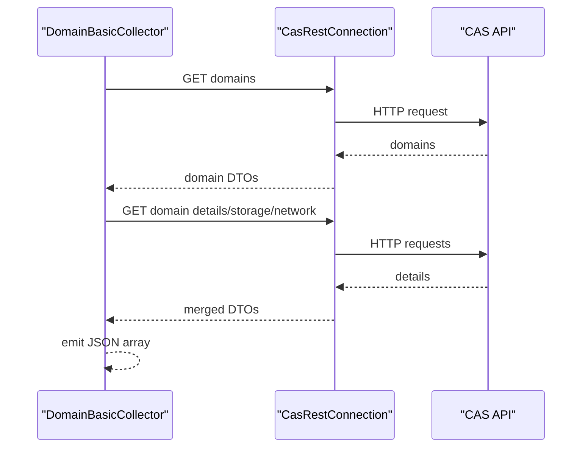

**Diagram sources**
- [DomainBasicCollector.java:34-151](file://watcher-cas/src/main/java/com/virtual/cloud/om/cas/service/report/DomainBasicCollector.java#L34-L151)

**Section sources**
- [DomainBasicCollector.java:1-164](file://watcher-cas/src/main/java/com/virtual/cloud/om/cas/service/report/DomainBasicCollector.java#L1-L164)

### Health Information
Implementation pattern:
- Fetches dashboard health data and filters out empty entries.
- Emits a JSON array of health records.

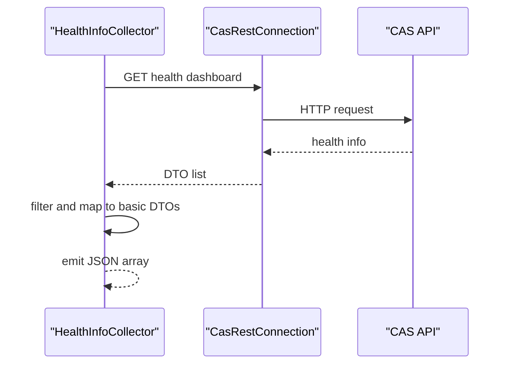

**Diagram sources**
- [HealthInfoCollector.java:33-62](file://watcher-cas/src/main/java/com/virtual/cloud/om/cas/service/report/HealthInfoCollector.java#L33-L62)

**Section sources**
- [HealthInfoCollector.java:1-75](file://watcher-cas/src/main/java/com/virtual/cloud/om/cas/service/report/HealthInfoCollector.java#L1-L75)

### Storage Pool Basics
Implementation pattern:
- Iterates hosts and queries storage pools per host.
- Emits a JSON array per host with pool metadata.

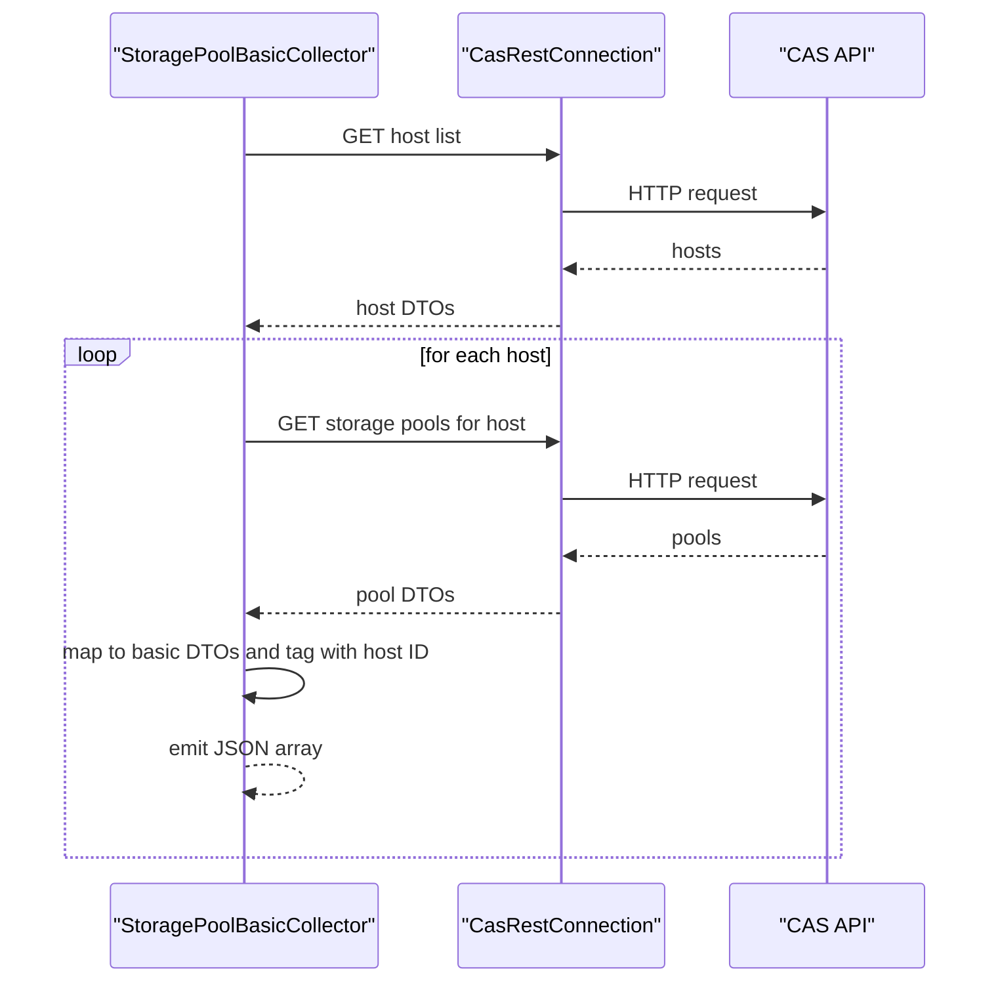

**Diagram sources**
- [StoragePoolBasicCollector.java:32-88](file://watcher-cas/src/main/java/com/virtual/cloud/om/cas/service/report/StoragePoolBasicCollector.java#L32-L88)

**Section sources**
- [StoragePoolBasicCollector.java:1-101](file://watcher-cas/src/main/java/com/virtual/cloud/om/cas/service/report/StoragePoolBasicCollector.java#L1-L101)

### Host Performance and Summary (Placeholder)
- HostPerformanceCollector and HostSummaryCollector demonstrate the same base pattern but currently return empty results pending further implementation.

**Section sources**
- [HostPerformanceCollector.java:1-68](file://watcher-cas/src/main/java/com/virtual/cloud/om/cas/service/report/HostPerformanceCollector.java#L1-L68)
- [HostSummaryCollector.java:1-65](file://watcher-cas/src/main/java/com/virtual/cloud/om/cas/service/report/HostSummaryCollector.java#L1-L65)

### Top-N Resource Lists
- ClusterHostCPUTopNCollector and ClusterVirtHostCpuTopNCollector fetch top-N CPU lists for hosts and virtual machines within a cluster, returning JSON arrays.

**Section sources**
- [ClusterHostCPUTopNCollector.java:1-68](file://watcher-cas/src/main/java/com/virtual/cloud/om/cas/service/report/ClusterHostCPUTopNCollector.java#L1-L68)
- [ClusterVirtHostCpuTopNCollector.java:1-69](file://watcher-cas/src/main/java/com/virtual/cloud/om/cas/service/report/ClusterVirtHostCpuTopNCollector.java#L1-L69)

## Dependency Analysis
- Collectors depend on the base collector for lifecycle and payload construction.
- REST client encapsulates HTTP communication and endpoint resolution.
- Tag utilities and time utilities standardize metadata and timestamps.
- Host handler resolves credentials and IDs for CAS access.
- ID discovery utility centralizes enumeration of targets for wildcard collections.

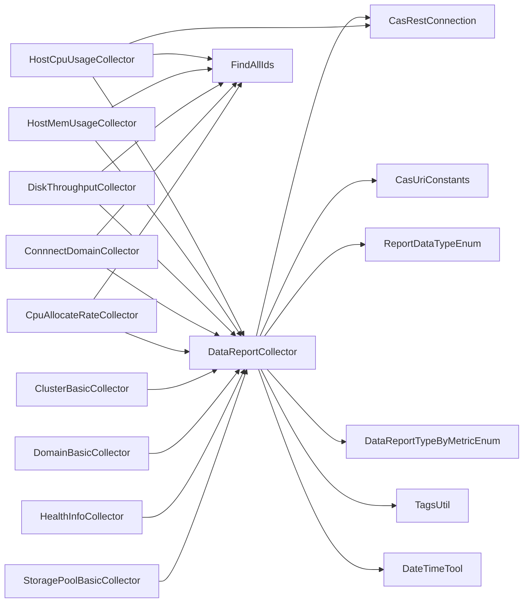

**Diagram sources**
- [DataReportCollector.java:1-118](file://watcher-sdk/src/main/java/com/virtual/cloud/om/sdk/api/DataReportCollector.java#L1-L118)
- [CasRestConnection.java](file://watcher-sdk/src/main/java/com/virtual/cloud/om/sdk/config/rest/cas/CasRestConnection.java)
- [CasUriConstants.java](file://watcher-sdk/src/main/java/com/virtual/cloud/om/sdk/constant/uri/CasUriConstants.java)
- [ReportDataTypeEnum.java](file://watcher-sdk/src/main/java/com/virtual/cloud/om/sdk/constant/report/ReportDataTypeEnum.java)
- [DataReportTypeByMetricEnum.java](file://watcher-sdk/src/main/java/com/virtual/cloud/om/sdk/constant/DataReportTypeByMetricEnum.java)
- [TagsUtil.java](file://watcher-sdk/src/main/java/com/virtual/cloud/om/sdk/utils/TagsUtil.java)
- [DateTimeTool.java](file://watcher-sdk/src/main/java/com/virtual/cloud/om/sdk/utils/DateTimeTool.java)
- [FindAllIds.java:1-86](file://watcher-cas/src/main/java/com/virtual/cloud/om/cas/service/severPerformanceMonitor/FindAllIds.java#L1-L86)
- [HostCpuUsageCollector.java:1-216](file://watcher-cas/src/main/java/com/virtual/cloud/om/cas/service/severPerformanceMonitor/HostCpuUsageCollector.java#L1-L216)
- [HostMemUsageCollector.java:1-192](file://watcher-cas/src/main/java/com/virtual/cloud/om/cas/service/severPerformanceMonitor/HostMemUsageCollector.java#L1-L192)
- [DiskThroughputCollector.java:1-192](file://watcher-cas/src/main/java/com/virtual/cloud/om/cas/service/severPerformanceMonitor/DiskThroughputCollector.java#L1-L192)
- [ConnnectDomainCollector.java:1-86](file://watcher-cas/src/main/java/com/virtual/cloud/om/cas/service/severPerformanceMonitor/ConnnectDomainCollector.java#L1-L86)
- [CpuAllocateRateCollector.java:1-91](file://watcher-cas/src/main/java/com/virtual/cloud/om/cas/service/severPerformanceMonitor/CpuAllocateRateCollector.java#L1-L91)
- [ClusterBasicCollector.java:1-73](file://watcher-cas/src/main/java/com/virtual/cloud/om/cas/service/report/ClusterBasicCollector.java#L1-L73)
- [DomainBasicCollector.java:1-164](file://watcher-cas/src/main/java/com/virtual/cloud/om/cas/service/report/DomainBasicCollector.java#L1-L164)
- [HealthInfoCollector.java:1-75](file://watcher-cas/src/main/java/com/virtual/cloud/om/cas/service/report/HealthInfoCollector.java#L1-L75)
- [StoragePoolBasicCollector.java:1-101](file://watcher-cas/src/main/java/com/virtual/cloud/om/cas/service/report/StoragePoolBasicCollector.java#L1-L101)

**Section sources**
- [DataReportCollector.java:1-118](file://watcher-sdk/src/main/java/com/virtual/cloud/om/sdk/api/DataReportCollector.java#L1-L118)
- [FindAllIds.java:1-86](file://watcher-cas/src/main/java/com/virtual/cloud/om/cas/service/severPerformanceMonitor/FindAllIds.java#L1-L86)

## Performance Considerations
- Parallelization: Many collectors stream over target IDs and apply parallel processing to reduce latency when enumerating multiple hosts, clusters, or domains.
- Latest-sample selection: For time-series metrics, collectors sort by time and select the most recent sample to minimize overhead.
- Wildcard handling: FindAllIds caches ID lists to avoid repeated enumeration during a single collection cycle.
- Payload shaping: Base collector normalizes missing timestamps to collection time to ensure consistent downstream processing.
- REST efficiency: Collectors reuse a single REST client and endpoint constants to minimize initialization overhead.

[No sources needed since this section provides general guidance]

## Troubleshooting Guide
Common issues and resolutions:
- Empty results:
  - Verify tags contain valid target IDs or wildcard markers.
  - Confirm CAS endpoints are reachable and credentials are correct.
- Exceptions during REST calls:
  - Review error logs for endpoint URLs and error messages.
  - Ensure CAS service availability and network connectivity.
- Timestamp anomalies:
  - Some collectors derive timestamps from CAS; the base collector normalizes missing timestamps to collection time.
- Metric type mismatches:
  - Confirm valueType aligns with the metric’s intended representation (gauge vs. JSON).

**Section sources**
- [DataReportCollector.java:58-84](file://watcher-sdk/src/main/java/com/virtual/cloud/om/sdk/api/DataReportCollector.java#L58-L84)
- [HostCpuUsageCollector.java:77-83](file://watcher-cas/src/main/java/com/virtual/cloud/om/cas/service/severPerformanceMonitor/HostCpuUsageCollector.java#L77-L83)
- [HostMemUsageCollector.java:72-78](file://watcher-cas/src/main/java/com/virtual/cloud/om/cas/service/severPerformanceMonitor/HostMemUsageCollector.java#L72-L78)
- [DiskThroughputCollector.java:74-80](file://watcher-cas/src/main/java/com/virtual/cloud/om/cas/service/severPerformanceMonitor/DiskThroughputCollector.java#L74-L80)
- [ConnnectDomainCollector.java:48-54](file://watcher-cas/src/main/java/com/virtual/cloud/om/cas/service/severPerformanceMonitor/ConnnectDomainCollector.java#L48-L54)
- [CpuAllocateRateCollector.java:52-58](file://watcher-cas/src/main/java/com/virtual/cloud/om/cas/service/severPerformanceMonitor/CpuAllocateRateCollector.java#L52-L58)

## Conclusion
The CAS reporting and metrics collection subsystem provides a robust, extensible framework for gathering diverse operational insights. Its base collector design, unified REST client, and consistent tagging/timestamping enable efficient collection across CPU, memory, disk I/O, network connections, and resource allocation. By leveraging parallel processing, wildcard discovery, and latest-sample selection, collectors deliver timely and accurate telemetry suitable for dashboards and alerting systems.

[No sources needed since this section summarizes without analyzing specific files]

## Appendices

### Collector Catalog and Categories
- Cluster basics: ClusterBasicCollector
- Domain statistics: DomainBasicCollector
- Health information: HealthInfoCollector
- Storage metrics: StoragePoolBasicCollector
- Host performance placeholders: HostPerformanceCollector, HostSummaryCollector
- Top-N resource lists: ClusterHostCPUTopNCollector, ClusterVirtHostCpuTopNCollector

- CPU usage: HostCpuUsageCollector
- Memory usage: HostMemUsageCollector
- Disk throughput: DiskThroughputCollector
- Connections: ConnnectDomainCollector
- CPU allocation rate: CpuAllocateRateCollector

**Section sources**
- [ClusterBasicCollector.java:1-73](file://watcher-cas/src/main/java/com/virtual/cloud/om/cas/service/report/ClusterBasicCollector.java#L1-L73)
- [DomainBasicCollector.java:1-164](file://watcher-cas/src/main/java/com/virtual/cloud/om/cas/service/report/DomainBasicCollector.java#L1-L164)
- [HealthInfoCollector.java:1-75](file://watcher-cas/src/main/java/com/virtual/cloud/om/cas/service/report/HealthInfoCollector.java#L1-L75)
- [StoragePoolBasicCollector.java:1-101](file://watcher-cas/src/main/java/com/virtual/cloud/om/cas/service/report/StoragePoolBasicCollector.java#L1-L101)
- [HostPerformanceCollector.java:1-68](file://watcher-cas/src/main/java/com/virtual/cloud/om/cas/service/report/HostPerformanceCollector.java#L1-L68)
- [HostSummaryCollector.java:1-65](file://watcher-cas/src/main/java/com/virtual/cloud/om/cas/service/report/HostSummaryCollector.java#L1-L65)
- [ClusterHostCPUTopNCollector.java:1-68](file://watcher-cas/src/main/java/com/virtual/cloud/om/cas/service/report/ClusterHostCPUTopNCollector.java#L1-L68)
- [ClusterVirtHostCpuTopNCollector.java:1-69](file://watcher-cas/src/main/java/com/virtual/cloud/om/cas/service/report/ClusterVirtHostCpuTopNCollector.java#L1-L69)
- [HostCpuUsageCollector.java:1-216](file://watcher-cas/src/main/java/com/virtual/cloud/om/cas/service/severPerformanceMonitor/HostCpuUsageCollector.java#L1-L216)
- [HostMemUsageCollector.java:1-192](file://watcher-cas/src/main/java/com/virtual/cloud/om/cas/service/severPerformanceMonitor/HostMemUsageCollector.java#L1-L192)
- [DiskThroughputCollector.java:1-192](file://watcher-cas/src/main/java/com/virtual/cloud/om/cas/service/severPerformanceMonitor/DiskThroughputCollector.java#L1-L192)
- [ConnnectDomainCollector.java:1-86](file://watcher-cas/src/main/java/com/virtual/cloud/om/cas/service/severPerformanceMonitor/ConnnectDomainCollector.java#L1-L86)
- [CpuAllocateRateCollector.java:1-91](file://watcher-cas/src/main/java/com/virtual/cloud/om/cas/service/severPerformanceMonitor/CpuAllocateRateCollector.java#L1-L91)

### Data Collection Intervals and Aggregation Strategies
- Intervals: Defined by the scheduler that invokes collectors; collectors themselves fetch the latest available samples.
- Aggregation:
  - Per-target (host/domain/cluster) series emitted as individual time-series entries.
  - Latest-sample selection ensures a single value per target per collection cycle.
  - JSON metrics (e.g., disk throughput) include composite values per device.

**Section sources**
- [HostCpuUsageCollector.java:88-88](file://watcher-cas/src/main/java/com/virtual/cloud/om/cas/service/severPerformanceMonitor/HostCpuUsageCollector.java#L88-L88)
- [HostMemUsageCollector.java:82-82](file://watcher-cas/src/main/java/com/virtual/cloud/om/cas/service/severPerformanceMonitor/HostMemUsageCollector.java#L82-L82)
- [DiskThroughputCollector.java:138-150](file://watcher-cas/src/main/java/com/virtual/cloud/om/cas/service/severPerformanceMonitor/DiskThroughputCollector.java#L138-L150)

### Metric Transformation Processes
- Tag building: TagsUtil constructs tag sets with resource ID and target IDs.
- Timestamp normalization: Base collector sets timestamp to collection time if absent.
- Value typing: valueType determines whether values are gauges or JSON objects.

**Section sources**
- [TagsUtil.java](file://watcher-sdk/src/main/java/com/virtual/cloud/om/sdk/utils/TagsUtil.java)
- [DataReportCollector.java:81-84](file://watcher-sdk/src/main/java/com/virtual/cloud/om/sdk/api/DataReportCollector.java#L81-L84)
- [ReportDataTypeEnum.java](file://watcher-sdk/src/main/java/com/virtual/cloud/om/sdk/constant/report/ReportDataTypeEnum.java)

### Configuration Examples
- Targeting a single host:
  - tags include hostIds=HOST_ID
- Targeting a cluster:
  - tags include clusterIds=CLUSTER_ID
- Targeting a domain:
  - tags include domainIds=DOMAIN_ID
- Wildcard targeting:
  - Use hostIds=all, clusterIds=all, or domainIds=all; FindAllIds will enumerate IDs.

**Section sources**
- [HostCpuUsageCollector.java:47-54](file://watcher-cas/src/main/java/com/virtual/cloud/om/cas/service/severPerformanceMonitor/HostCpuUsageCollector.java#L47-L54)
- [HostMemUsageCollector.java:42-51](file://watcher-cas/src/main/java/com/virtual/cloud/om/cas/service/severPerformanceMonitor/HostMemUsageCollector.java#L42-L51)
- [DiskThroughputCollector.java:44-52](file://watcher-cas/src/main/java/com/virtual/cloud/om/cas/service/severPerformanceMonitor/DiskThroughputCollector.java#L44-L52)
- [FindAllIds.java:32-82](file://watcher-cas/src/main/java/com/virtual/cloud/om/cas/service/severPerformanceMonitor/FindAllIds.java#L32-L82)

### Performance Optimization Techniques
- Prefer parallel streams for bulk target processing.
- Use wildcard discovery once per cycle and cache IDs.
- Minimize redundant REST calls by batching where possible.
- Select latest samples to reduce data volume.

**Section sources**
- [HostCpuUsageCollector.java:74-96](file://watcher-cas/src/main/java/com/virtual/cloud/om/cas/service/severPerformanceMonitor/HostCpuUsageCollector.java#L74-L96)
- [HostMemUsageCollector.java:69-90](file://watcher-cas/src/main/java/com/virtual/cloud/om/cas/service/severPerformanceMonitor/HostMemUsageCollector.java#L69-L90)
- [DiskThroughputCollector.java:71-92](file://watcher-cas/src/main/java/com/virtual/cloud/om/cas/service/severPerformanceMonitor/DiskThroughputCollector.java#L71-L92)
- [FindAllIds.java:32-82](file://watcher-cas/src/main/java/com/virtual/cloud/om/cas/service/severPerformanceMonitor/FindAllIds.java#L32-L82)

### Interpreting Metrics and Identifying Bottlenecks
- CPU usage:
  - Gauge values indicate utilization; compare across hosts, clusters, and domains to spot hotspots.
- Memory usage:
  - Gauge values reveal saturation; sustained high usage may indicate leaks or misconfiguration.
- Disk throughput:
  - JSON read/write pairs per device help identify I/O-bound VMs or hosts; spikes correlate with workload bursts.
- Connections:
  - Gauge counts reflect active sessions; sudden increases may signal traffic spikes or misbehaving clients.
- CPU allocation rate:
  - Indicates oversubscription; higher ratios imply more virtual CPUs than physical cores.

**Section sources**
- [HostCpuUsageCollector.java:204-213](file://watcher-cas/src/main/java/com/virtual/cloud/om/cas/service/severPerformanceMonitor/HostCpuUsageCollector.java#L204-L213)
- [HostMemUsageCollector.java:180-189](file://watcher-cas/src/main/java/com/virtual/cloud/om/cas/service/severPerformanceMonitor/HostMemUsageCollector.java#L180-L189)
- [DiskThroughputCollector.java:155-164](file://watcher-cas/src/main/java/com/virtual/cloud/om/cas/service/severPerformanceMonitor/DiskThroughputCollector.java#L155-L164)
- [ConnnectDomainCollector.java:75-83](file://watcher-cas/src/main/java/com/virtual/cloud/om/cas/service/severPerformanceMonitor/ConnnectDomainCollector.java#L75-L83)
- [CpuAllocateRateCollector.java:80-88](file://watcher-cas/src/main/java/com/virtual/cloud/om/cas/service/severPerformanceMonitor/CpuAllocateRateCollector.java#L80-L88)