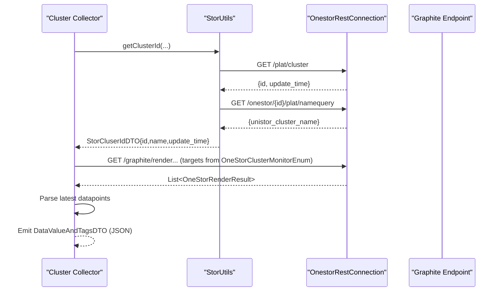
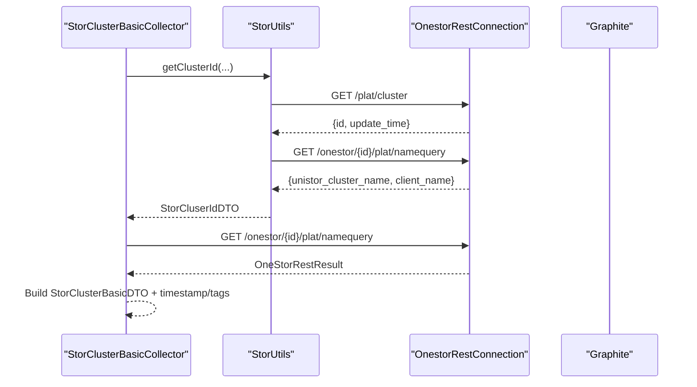
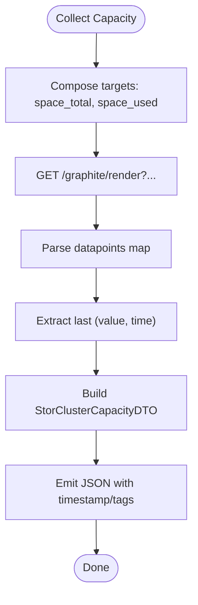
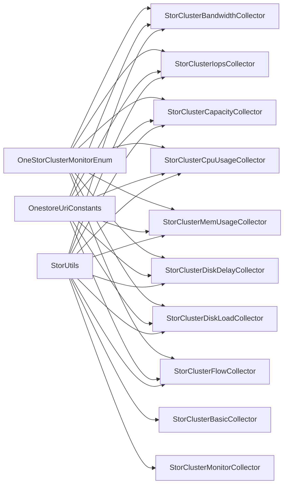

# Cluster-Level Monitoring

<cite>
**Referenced Files in This Document**
- [StorClusterBasicCollector.java](file://watcher-onestor/src/main/java/com/virtual/cloud/om/onestor/service/clusterBasic/StorClusterBasicCollector.java)
- [StorClusterCapacityCollector.java](file://watcher-onestor/src/main/java/com/virtual/cloud/om/onestor/service/clusterBasic/StorClusterCapacityCollector.java)
- [StorClusterBandwidthCollector.java](file://watcher-onestor/src/main/java/com/virtual/cloud/om/onestor/service/clusterBasic/StorClusterBandwidthCollector.java)
- [StorClusterCpuUsageCollector.java](file://watcher-onestor/src/main/java/com/virtual/cloud/om/onestor/service/clusterBasic/StorClusterCpuUsageCollector.java)
- [StorClusterMemUsageCollector.java](file://watcher-onestor/src/main/java/com/virtual/cloud/om/onestor/service/clusterBasic/StorClusterMemUsageCollector.java)
- [StorClusterIopsCollector.java](file://watcher-onestor/src/main/java/com/virtual/cloud/om/onestor/service/clusterBasic/StorClusterIopsCollector.java)
- [StorClusterDiskDelayCollector.java](file://watcher-onestor/src/main/java/com/virtual/cloud/om/onestor/service/clusterBasic/StorClusterDiskDelayCollector.java)
- [StorClusterDiskLoadCollector.java](file://watcher-onestor/src/main/java/com/virtual/cloud/om/onestor/service/clusterBasic/StorClusterDiskLoadCollector.java)
- [StorClusterFlowCollector.java](file://watcher-onestor/src/main/java/com/virtual/cloud/om/onestor/service/clusterBasic/StorClusterFlowCollector.java)
- [StorClusterMonitorCollector.java](file://watcher-onestor/src/main/java/com/virtual/cloud/om/onestor/service/clusterBasic/StorClusterMonitorCollector.java)
- [StorUtils.java](file://watcher-onestor/src/main/java/com/virtual/cloud/om/onestor/service/clusterBasic/StorUtils.java)
- [OneStorClusterMonitorEnum.java](file://watcher-sdk/src/main/java/com/virtual/cloud/om/sdk/constant/OneStorClusterMonitorEnum.java)
- [OnestoreUriConstants.java](file://watcher-sdk/src/main/java/com/virtual/cloud/om/sdk/constant/uri/OnestoreUriConstants.java)
</cite>

## Table of Contents
1. [Introduction](#introduction)
2. [Project Structure](#project-structure)
3. [Core Components](#core-components)
4. [Architecture Overview](#architecture-overview)
5. [Detailed Component Analysis](#detailed-component-analysis)
6. [Dependency Analysis](#dependency-analysis)
7. [Performance Considerations](#performance-considerations)
8. [Troubleshooting Guide](#troubleshooting-guide)
9. [Conclusion](#conclusion)
10. [Appendices](#appendices)

## Introduction
This document explains OneStor cluster-level monitoring capabilities implemented in the watcher-onestor module. It covers the foundational StorClusterBasicCollector for metadata retrieval, capacity collectors for storage space tracking, and performance monitors for overall cluster health. It also documents metric calculation algorithms, thresholds, alerting mechanisms, and integration with OneStor’s storage cluster architecture. Practical examples demonstrate cluster performance analysis, capacity planning recommendations, and troubleshooting common cluster-level issues.

## Project Structure
The cluster monitoring subsystem resides under watcher-onestor in the clusterBasic package. Each metric family is represented by a dedicated collector that extends the shared DataReportCollector base. Supporting utilities and constants define URIs, metric identifiers, and REST connection behavior.

```mermaid
graph TB
subgraph "OneStor Cluster Monitoring"
Basic["StorClusterBasicCollector"]
Capacity["StorClusterCapacityCollector"]
Bandwidth["StorClusterBandwidthCollector"]
Cpu["StorClusterCpuUsageCollector"]
Mem["StorClusterMemUsageCollector"]
Iops["StorClusterIopsCollector"]
Delay["StorClusterDiskDelayCollector"]
Load["StorClusterDiskLoadCollector"]
Flow["StorClusterFlowCollector"]
Health["StorClusterMonitorCollector"]
Utils["StorUtils"]
end
Basic --> Utils
Capacity --> Utils
Bandwidth --> Utils
Cpu --> Utils
Mem --> Utils
Iops --> Utils
Delay --> Utils
Load --> Utils
Flow --> Utils
Health --> Utils
subgraph "SDK Constants and URIs"
Enum["OneStorClusterMonitorEnum"]
Uri["OnestoreUriConstants"]
end
Basic --> Enum
Basic --> Uri
Capacity --> Enum
Capacity --> Uri
Bandwidth --> Enum
Bandwidth --> Uri
Cpu --> Enum
Cpu --> Uri
Mem --> Enum
Mem --> Uri
Iops --> Enum
Iops --> Uri
Delay --> Enum
Delay --> Uri
Load --> Enum
Load --> Uri
Flow --> Enum
Flow --> Uri
Health --> Uri
```

**Diagram sources**
- [StorClusterBasicCollector.java:33-76](file://watcher-onestor/src/main/java/com/virtual/cloud/om/onestor/service/clusterBasic/StorClusterBasicCollector.java#L33-L76)
- [StorClusterCapacityCollector.java:36-87](file://watcher-onestor/src/main/java/com/virtual/cloud/om/onestor/service/clusterBasic/StorClusterCapacityCollector.java#L36-L87)
- [StorClusterBandwidthCollector.java:37-120](file://watcher-onestor/src/main/java/com/virtual/cloud/om/onestor/service/clusterBasic/StorClusterBandwidthCollector.java#L37-L120)
- [StorClusterCpuUsageCollector.java:36-84](file://watcher-onestor/src/main/java/com/virtual/cloud/om/onestor/service/clusterBasic/StorClusterCpuUsageCollector.java#L36-L84)
- [StorClusterMemUsageCollector.java:36-82](file://watcher-onestor/src/main/java/com/virtual/cloud/om/onestor/service/clusterBasic/StorClusterMemUsageCollector.java#L36-L82)
- [StorClusterIopsCollector.java:35-146](file://watcher-onestor/src/main/java/com/virtual/cloud/om/onestor/service/clusterBasic/StorClusterIopsCollector.java#L35-L146)
- [StorClusterDiskDelayCollector.java:36-84](file://watcher-onestor/src/main/java/com/virtual/cloud/om/onestor/service/clusterBasic/StorClusterDiskDelayCollector.java#L36-L84)
- [StorClusterDiskLoadCollector.java:36-84](file://watcher-onestor/src/main/java/com/virtual/cloud/om/onestor/service/clusterBasic/StorClusterDiskLoadCollector.java#L36-L84)
- [StorClusterFlowCollector.java:38-111](file://watcher-onestor/src/main/java/com/virtual/cloud/om/onestor/service/clusterBasic/StorClusterFlowCollector.java#L38-L111)
- [StorClusterMonitorCollector.java:32-77](file://watcher-onestor/src/main/java/com/virtual/cloud/om/onestor/service/clusterBasic/StorClusterMonitorCollector.java#L32-L77)
- [StorUtils.java:27-56](file://watcher-onestor/src/main/java/com/virtual/cloud/om/onestor/service/clusterBasic/StorUtils.java#L27-L56)
- [OneStorClusterMonitorEnum.java:10-66](file://watcher-sdk/src/main/java/com/virtual/cloud/om/sdk/constant/OneStorClusterMonitorEnum.java#L10-L66)
- [OnestoreUriConstants.java:30-62](file://watcher-sdk/src/main/java/com/virtual/cloud/om/sdk/constant/uri/OnestoreUriConstants.java#L30-L62)

**Section sources**
- [StorClusterBasicCollector.java:33-76](file://watcher-onestor/src/main/java/com/virtual/cloud/om/onestor/service/clusterBasic/StorClusterBasicCollector.java#L33-L76)
- [OnestoreUriConstants.java:30-62](file://watcher-sdk/src/main/java/com/virtual/cloud/om/sdk/constant/uri/OnestoreUriConstants.java#L30-L62)

## Core Components
- StorClusterBasicCollector: Retrieves cluster metadata (name, client, and ID) via REST and emits JSON-formatted metrics tagged with update time.
- Capacity collectors: Track total and used space, and optionally per-pool or per-type capacity depending on the specific collector variant present.
- Performance monitors: Measure bandwidth, IOPS, CPU usage, memory usage, disk latency, and disk load.
- Health monitor: Aggregates cluster health counts for warning, critical, and ok states.
- StorUtils: Centralizes cluster identity resolution and cluster name lookup.

Key responsibilities:
- Unified metric emission via DataReportCollector base.
- Graphite target composition using OneStorClusterMonitorEnum.
- REST endpoint construction via OnestoreUriConstants.
- Timestamp normalization and update time formatting.

**Section sources**
- [StorClusterBasicCollector.java:33-76](file://watcher-onestor/src/main/java/com/virtual/cloud/om/onestor/service/clusterBasic/StorClusterBasicCollector.java#L33-L76)
- [StorClusterCapacityCollector.java:36-87](file://watcher-onestor/src/main/java/com/virtual/cloud/om/onestor/service/clusterBasic/StorClusterCapacityCollector.java#L36-L87)
- [StorClusterBandwidthCollector.java:37-120](file://watcher-onestor/src/main/java/com/virtual/cloud/om/onestor/service/clusterBasic/StorClusterBandwidthCollector.java#L37-L120)
- [StorClusterCpuUsageCollector.java:36-84](file://watcher-onestor/src/main/java/com/virtual/cloud/om/onestor/service/clusterBasic/StorClusterCpuUsageCollector.java#L36-L84)
- [StorClusterMemUsageCollector.java:36-82](file://watcher-onestor/src/main/java/com/virtual/cloud/om/onestor/service/clusterBasic/StorClusterMemUsageCollector.java#L36-L82)
- [StorClusterIopsCollector.java:35-146](file://watcher-onestor/src/main/java/com/virtual/cloud/om/onestor/service/clusterBasic/StorClusterIopsCollector.java#L35-L146)
- [StorClusterDiskDelayCollector.java:36-84](file://watcher-onestor/src/main/java/com/virtual/cloud/om/onestor/service/clusterBasic/StorClusterDiskDelayCollector.java#L36-L84)
- [StorClusterDiskLoadCollector.java:36-84](file://watcher-onestor/src/main/java/com/virtual/cloud/om/onestor/service/clusterBasic/StorClusterDiskLoadCollector.java#L36-L84)
- [StorClusterFlowCollector.java:38-111](file://watcher-onestor/src/main/java/com/virtual/cloud/om/onestor/service/clusterBasic/StorClusterFlowCollector.java#L38-L111)
- [StorClusterMonitorCollector.java:32-77](file://watcher-onestor/src/main/java/com/virtual/cloud/om/onestor/service/clusterBasic/StorClusterMonitorCollector.java#L32-L77)
- [StorUtils.java:27-56](file://watcher-onestor/src/main/java/com/virtual/cloud/om/onestor/service/clusterBasic/StorUtils.java#L27-L56)

## Architecture Overview
The monitoring pipeline follows a consistent pattern:
- Resolve cluster identity via StorUtils.
- Build Graphite queries using OneStorClusterMonitorEnum targets.
- Fetch time-series data from Graphite endpoints defined in OnestoreUriConstants.
- Transform latest data points into typed DTOs and emit JSON metrics with timestamps and tags.

**Diagram sources**
- [StorClusterBasicCollector.java:39-65](file://watcher-onestor/src/main/java/com/virtual/cloud/om/onestor/service/clusterBasic/StorClusterBasicCollector.java#L39-L65)
- [StorClusterCapacityCollector.java:42-76](file://watcher-onestor/src/main/java/com/virtual/cloud/om/onestor/service/clusterBasic/StorClusterCapacityCollector.java#L42-L76)
- [StorClusterBandwidthCollector.java:42-109](file://watcher-onestor/src/main/java/com/virtual/cloud/om/onestor/service/clusterBasic/StorClusterBandwidthCollector.java#L42-L109)
- [StorClusterIopsCollector.java:40-135](file://watcher-onestor/src/main/java/com/virtual/cloud/om/onestor/service/clusterBasic/StorClusterIopsCollector.java#L40-L135)
- [StorUtils.java:31-55](file://watcher-onestor/src/main/java/com/virtual/cloud/om/onestor/service/clusterBasic/StorUtils.java#L31-L55)
- [OneStorClusterMonitorEnum.java:10-66](file://watcher-sdk/src/main/java/com/virtual/cloud/om/sdk/constant/OneStorClusterMonitorEnum.java#L10-L66)
- [OnestoreUriConstants.java:54-61](file://watcher-sdk/src/main/java/com/virtual/cloud/om/sdk/constant/uri/OnestoreUriConstants.java#L54-L61)

## Detailed Component Analysis

### StorClusterBasicCollector
Purpose:
- Retrieve cluster name and client metadata and tag metrics with update time.

Processing logic:
- Uses StorUtils to obtain cluster ID and name.
- Calls Graphite endpoint to fetch latest metadata.
- Builds a DTO with cluster_name, client_name, fs_id, and update_time.
- Emits JSON with current timestamp and tags.

Metric emission:
- Type: stor_cluster_basic
- Value type: json

**Diagram sources**
- [StorClusterBasicCollector.java:39-65](file://watcher-onestor/src/main/java/com/virtual/cloud/om/onestor/service/clusterBasic/StorClusterBasicCollector.java#L39-L65)
- [StorUtils.java:31-55](file://watcher-onestor/src/main/java/com/virtual/cloud/om/onestor/service/clusterBasic/StorUtils.java#L31-L55)

**Section sources**
- [StorClusterBasicCollector.java:33-76](file://watcher-onestor/src/main/java/com/virtual/cloud/om/onestor/service/clusterBasic/StorClusterBasicCollector.java#L33-L76)
- [StorUtils.java:27-56](file://watcher-onestor/src/main/java/com/virtual/cloud/om/onestor/service/clusterBasic/StorUtils.java#L27-L56)

### StorClusterCapacityCollector
Purpose:
- Track total and used storage capacity at the cluster level.

Processing logic:
- Compose Graphite targets for total and used space.
- Extract latest values and timestamps.
- Normalize timestamp to ISO-like string.
- Populate DTO with cluster name, totals, used, and update_time.

Metric emission:
- Type: stor_cluster_capacity
- Value type: json

**Diagram sources**
- [StorClusterCapacityCollector.java:42-76](file://watcher-onestor/src/main/java/com/virtual/cloud/om/onestor/service/clusterBasic/StorClusterCapacityCollector.java#L42-L76)
- [OnestoreUriConstants.java:54-57](file://watcher-sdk/src/main/java/com/virtual/cloud/om/sdk/constant/uri/OnestoreUriConstants.java#L54-L57)
- [OneStorClusterMonitorEnum.java:28-29](file://watcher-sdk/src/main/java/com/virtual/cloud/om/sdk/constant/OneStorClusterMonitorEnum.java#L28-L29)

**Section sources**
- [StorClusterCapacityCollector.java:36-87](file://watcher-onestor/src/main/java/com/virtual/cloud/om/onestor/service/clusterBasic/StorClusterCapacityCollector.java#L36-L87)

### StorClusterBandwidthCollector
Purpose:
- Measure storage and filesystem bandwidth across read/write/recovery and aggregate totals.

Processing logic:
- Query Graphite for multiple bandwidth targets.
- For each target, take the latest value and timestamp.
- Build DTO with storage read/write/recover bandwidth, filesystem read/write, and totals.
- Set update_time from the most recent timestamp.

Metric emission:
- Type: stor_cluster_bandwidth
- Value type: json

**Section sources**
- [StorClusterBandwidthCollector.java:37-120](file://watcher-onestor/src/main/java/com/virtual/cloud/om/onestor/service/clusterBasic/StorClusterBandwidthCollector.java#L37-L120)

### StorClusterCpuUsageCollector
Purpose:
- Report cluster-wide CPU usage ratio.

Processing logic:
- Target cpu_ratio.
- Take latest value and convert epoch time to formatted string.
- Populate DTO with cluster name, cpu ratio, and update_time.

Metric emission:
- Type: stor_cluster_cpu_usage
- Value type: json

**Section sources**
- [StorClusterCpuUsageCollector.java:36-84](file://watcher-onestor/src/main/java/com/virtual/cloud/om/onestor/service/clusterBasic/StorClusterCpuUsageCollector.java#L36-L84)

### StorClusterMemUsageCollector
Purpose:
- Report cluster-wide memory usage ratio.

Processing logic:
- Target mem_ratio.
- Take latest value and time, normalize time.
- Populate DTO with cluster name, memory ratio, and update_time.

Metric emission:
- Type: stor_cluster_mem_usage
- Value type: json

**Section sources**
- [StorClusterMemUsageCollector.java:36-82](file://watcher-onestor/src/main/java/com/virtual/cloud/om/onestor/service/clusterBasic/StorClusterMemUsageCollector.java#L36-L82)

### StorClusterIopsCollector
Purpose:
- Measure IOPS and OPS across storage and filesystem, plus recovery and aggregate totals.

Processing logic:
- Query multiple IOPS/OPS targets.
- For each target, extract latest value and timestamp.
- Build DTO with read/write IOPS, recovery ops, filesystem read/write ops, totals, and update_time.

Metric emission:
- Type: stor_cluster_iops
- Value type: json

**Section sources**
- [StorClusterIopsCollector.java:35-146](file://watcher-onestor/src/main/java/com/virtual/cloud/om/onestor/service/clusterBasic/StorClusterIopsCollector.java#L35-L146)

### StorClusterDiskDelayCollector
Purpose:
- Assess disk read/write latency.

Processing logic:
- Target disk latencies (read/write).
- Take latest values and time.
- Build DTO with cluster name, latency values, and update_time.

Metric emission:
- Type: stor_cluster_disk_delay
- Value type: json

**Section sources**
- [StorClusterDiskDelayCollector.java:36-84](file://watcher-onestor/src/main/java/com/virtual/cloud/om/onestor/service/clusterBasic/StorClusterDiskDelayCollector.java#L36-L84)

### StorClusterDiskLoadCollector
Purpose:
- Assess disk utilization (average and maximum).

Processing logic:
- Target util avg and max.
- Take latest values and time.
- Build DTO with cluster name, util avg/max, and update_time.

Metric emission:
- Type: stor_cluster_disk_load
- Value type: json

**Section sources**
- [StorClusterDiskLoadCollector.java:36-84](file://watcher-onestor/src/main/java/com/virtual/cloud/om/onestor/service/clusterBasic/StorClusterDiskLoadCollector.java#L36-L84)

### StorClusterFlowCollector
Purpose:
- Measure traffic volumes (read/write/recover) for storage and filesystem.

Processing logic:
- Query multiple data volume targets.
- Extract latest values and timestamp.
- Build DTO with storage and filesystem flows and update_time.

Metric emission:
- Type: stor_cluster_flow
- Value type: json

**Section sources**
- [StorClusterFlowCollector.java:38-111](file://watcher-onestor/src/main/java/com/virtual/cloud/om/onestor/service/clusterBasic/StorClusterFlowCollector.java#L38-L111)

### StorClusterMonitorCollector
Purpose:
- Aggregate cluster health status counts (warn, critical, ok).

Processing logic:
- Resolve cluster ID and fetch health endpoint.
- Parse health counters and build DTO.
- Emit JSON with timestamp and tags.

Metric emission:
- Type: stor_cluster_monitor
- Value type: json

**Section sources**
- [StorClusterMonitorCollector.java:32-77](file://watcher-onestor/src/main/java/com/virtual/cloud/om/onestor/service/clusterBasic/StorClusterMonitorCollector.java#L32-L77)

## Dependency Analysis
- All collectors depend on StorUtils for cluster identity and name resolution.
- Collectors rely on OneStorClusterMonitorEnum for Graphite target keys.
- REST calls are routed through OnestorRestConnection and hit Graphite endpoints defined in OnestoreUriConstants.
- Emission format is standardized as JSON with timestamp and tags.

**Diagram sources**
- [OneStorClusterMonitorEnum.java:10-66](file://watcher-sdk/src/main/java/com/virtual/cloud/om/sdk/constant/OneStorClusterMonitorEnum.java#L10-L66)
- [OnestoreUriConstants.java:30-62](file://watcher-sdk/src/main/java/com/virtual/cloud/om/sdk/constant/uri/OnestoreUriConstants.java#L30-L62)
- [StorUtils.java:27-56](file://watcher-onestor/src/main/java/com/virtual/cloud/om/onestor/service/clusterBasic/StorUtils.java#L27-L56)
- [StorClusterBandwidthCollector.java:37-120](file://watcher-onestor/src/main/java/com/virtual/cloud/om/onestor/service/clusterBasic/StorClusterBandwidthCollector.java#L37-L120)
- [StorClusterIopsCollector.java:35-146](file://watcher-onestor/src/main/java/com/virtual/cloud/om/onestor/service/clusterBasic/StorClusterIopsCollector.java#L35-L146)
- [StorClusterCapacityCollector.java:36-87](file://watcher-onestor/src/main/java/com/virtual/cloud/om/onestor/service/clusterBasic/StorClusterCapacityCollector.java#L36-L87)
- [StorClusterCpuUsageCollector.java:36-84](file://watcher-onestor/src/main/java/com/virtual/cloud/om/onestor/service/clusterBasic/StorClusterCpuUsageCollector.java#L36-L84)
- [StorClusterMemUsageCollector.java:36-82](file://watcher-onestor/src/main/java/com/virtual/cloud/om/onestor/service/clusterBasic/StorClusterMemUsageCollector.java#L36-L82)
- [StorClusterDiskDelayCollector.java:36-84](file://watcher-onestor/src/main/java/com/virtual/cloud/om/onestor/service/clusterBasic/StorClusterDiskDelayCollector.java#L36-L84)
- [StorClusterDiskLoadCollector.java:36-84](file://watcher-onestor/src/main/java/com/virtual/cloud/om/onestor/service/clusterBasic/StorClusterDiskLoadCollector.java#L36-L84)
- [StorClusterFlowCollector.java:38-111](file://watcher-onestor/src/main/java/com/virtual/cloud/om/onestor/service/clusterBasic/StorClusterFlowCollector.java#L38-L111)
- [StorClusterBasicCollector.java:33-76](file://watcher-onestor/src/main/java/com/virtual/cloud/om/onestor/service/clusterBasic/StorClusterBasicCollector.java#L33-L76)
- [StorClusterMonitorCollector.java:32-77](file://watcher-onestor/src/main/java/com/virtual/cloud/om/onestor/service/clusterBasic/StorClusterMonitorCollector.java#L32-L77)

**Section sources**
- [StorUtils.java:27-56](file://watcher-onestor/src/main/java/com/virtual/cloud/om/onestor/service/clusterBasic/StorUtils.java#L27-L56)
- [OneStorClusterMonitorEnum.java:10-66](file://watcher-sdk/src/main/java/com/virtual/cloud/om/sdk/constant/OneStorClusterMonitorEnum.java#L10-L66)
- [OnestoreUriConstants.java:30-62](file://watcher-sdk/src/main/java/com/virtual/cloud/om/sdk/constant/uri/OnestoreUriConstants.java#L30-L62)

## Performance Considerations
- Graphite query batching: Collectors already combine multiple targets in a single request where applicable (e.g., bandwidth, IOPS, flow), reducing overhead.
- Latest-value extraction: Each collector reads the most recent data point, minimizing processing and memory footprint.
- Time normalization: Timestamps are normalized to a consistent format, aiding downstream aggregation.
- Tagging: Metrics include tags for downstream routing and filtering.

[No sources needed since this section provides general guidance]

## Troubleshooting Guide
Common symptoms and resolutions:
- Empty cluster ID or name:
  - Cause: REST call to cluster identity endpoint fails or returns null.
  - Action: Verify connectivity to the OneStor platform and credentials; check logs around cluster ID retrieval.
- Missing Graphite targets:
  - Cause: Targets not present in the configured Graphite backend.
  - Action: Confirm target keys match OneStorClusterMonitorEnum; validate Graphite retention and target availability.
- Zero or stale values:
  - Cause: No recent data points or time window mismatch.
  - Action: Adjust from window in URIs (e.g., from=-5minute vs from=-60minute) to capture recent samples.
- Health endpoint errors:
  - Cause: Cluster health endpoint unavailable.
  - Action: Validate cluster health API path and permissions; confirm platform readiness.

**Section sources**
- [StorClusterBasicCollector.java:40-44](file://watcher-onestor/src/main/java/com/virtual/cloud/om/onestor/service/clusterBasic/StorClusterBasicCollector.java#L40-L44)
- [StorClusterCapacityCollector.java:44-48](file://watcher-onestor/src/main/java/com/virtual/cloud/om/onestor/service/clusterBasic/StorClusterCapacityCollector.java#L44-L48)
- [StorClusterBandwidthCollector.java:43-47](file://watcher-onestor/src/main/java/com/virtual/cloud/om/onestor/service/clusterBasic/StorClusterBandwidthCollector.java#L43-L47)
- [StorClusterMonitorCollector.java:39-43](file://watcher-onestor/src/main/java/com/virtual/cloud/om/onestor/service/clusterBasic/StorClusterMonitorCollector.java#L39-L43)

## Conclusion
The OneStor cluster-level monitoring system provides a cohesive set of collectors that gather metadata, capacity, bandwidth, CPU/memory usage, IOPS/OPS, disk latency/load, and health status. By leveraging StorUtils for identity resolution and OneStorClusterMonitorEnum/OnestoreUriConstants for target and endpoint definitions, the system ensures consistent, timely, and structured metric emissions suitable for dashboards, alerts, and capacity planning.

[No sources needed since this section summarizes without analyzing specific files]

## Appendices

### Metric Families and Calculation Algorithms
- Metadata: Cluster name and client derived from cluster identity and basic info endpoints; update_time reflects last update.
- Capacity: Latest total and used space values mapped to DTO; update_time normalized from Graphite timestamp.
- Bandwidth: Latest values per category (storage read/write/recover, filesystem read/write, totals); update_time from latest read target.
- CPU/Memory: Latest ratio values; update_time from latest target timestamp.
- IOPS/OPS: Latest values across read/write/recovery and totals; update_time from read target.
- Disk Latency: Latest read/write latency values; update_time from read target timestamp.
- Disk Load: Latest average and maximum utilization; update_time from average target timestamp.
- Flow: Latest traffic values per category; update_time from read target timestamp.
- Health: Counts for warn/critical/ok states aggregated from health endpoint.

[No sources needed since this section provides general guidance]

### Thresholds and Alerting Mechanisms
- Thresholds: Not defined within the collectors; configure thresholds at the platform or dashboard layer.
- Alerting: Use emitted metrics (json) and tags to drive alert rules; health counts can trigger severity-based alerts.

[No sources needed since this section provides general guidance]

### Practical Examples
- Cluster performance analysis:
  - Correlate CPU and memory ratios with IOPS/OPS spikes to identify compute-bound vs IO-bound periods.
  - Compare storage vs filesystem bandwidth to detect mispredictions in workload distribution.
- Capacity planning recommendations:
  - Track capacity trends over time; project growth and plan buffer based on update_time-aligned series.
- Troubleshooting:
  - Investigate disk latency and load increases alongside IOPS anomalies to pinpoint hotspots.
  - Use health counts to triage incidents by severity.

[No sources needed since this section provides general guidance]