# Host-Level Monitoring

<cite>
**Referenced Files in This Document**
- [HostBandwidthMonitorCollector.java](file://watcher-onestor/src/main/java/com/virtual/cloud/om/onestor/service/report/monitor/host/HostBandwidthMonitorCollector.java)
- [HostCapacityMonitorCollector.java](file://watcher-onestor/src/main/java/com/virtual/cloud/om/onestor/service/report/monitor/host/HostCapacityMonitorCollector.java)
- [HostCpuUsageMonitorCollector.java](file://watcher-onestor/src/main/java/com/virtual/cloud/om/onestor/service/report/monitor/host/HostCpuUsageMonitorCollector.java)
- [HostDiskdelayCollector.java](file://watcher-onestor/src/main/java/com/virtual/cloud/om/onestor/service/report/monitor/host/HostDiskdelayCollector.java)
- [HostDiskloadCollector.java](file://watcher-onestor/src/main/java/com/virtual/cloud/om/onestor/service/report/monitor/host/HostDiskloadCollector.java)
- [HostIOPSMonitorCollector.java](file://watcher-onestor/src/main/java/com/virtual/cloud/om/onestor/service/report/monitor/host/HostIOPSMonitorCollector.java)
- [HostMemUsageMonitorCollector.java](file://watcher-onestor/src/main/java/com/virtual/cloud/om/onestor/service/report/monitor/host/HostMemUsageMonitorCollector.java)
- [StorHostNicCollector.java](file://watcher-onestor/src/main/java/com/virtual/cloud/om/onestor/service/report/monitor/host/StorHostNicCollector.java)
- [StorHostSysAvgLoadCollector.java](file://watcher-onestor/src/main/java/com/virtual/cloud/om/onestor/service/report/monitor/host/StorHostSysAvgLoadCollector.java)
- [IOnestorMonitorCollector.java](file://watcher-onestor/src/main/java/com/virtual/cloud/om/onestor/service/report/monitor/IOnestorMonitorCollector.java)
- [OnestorSSHService.java](file://watcher-onestor/src/main/java/com/virtual/cloud/om/onestor/service/ssh/OnestorSSHService.java)
- [OnestorHostHandler.java](file://watcher-onestor/src/main/java/com/virtual/cloud/om/onestor/service/OnestorHostHandler.java)
- [StorClusterMonitorCollector.java](file://watcher-onestor/src/main/java/com/virtual/cloud/om/onestor/service/clusterBasic/StorClusterMonitorCollector.java)
- [OneStorHostMonitorTargetEnum.java](file://watcher-sdk/src/main/java/com/virtual/cloud/om/sdk/constant/onestor/report/OneStorHostMonitorTargetEnum.java)
</cite>

## Table of Contents
1. [Introduction](#introduction)
2. [Project Structure](#project-structure)
3. [Core Components](#core-components)
4. [Architecture Overview](#architecture-overview)
5. [Detailed Component Analysis](#detailed-component-analysis)
6. [Dependency Analysis](#dependency-analysis)
7. [Performance Considerations](#performance-considerations)
8. [Troubleshooting Guide](#troubleshooting-guide)
9. [Conclusion](#conclusion)
10. [Appendices](#appendices)

## Introduction
This document describes the OneStor host-level monitoring system implemented in the watcher-onestor module. It covers the host-specific metrics collected (bandwidth utilization, capacity consumption, CPU usage, disk delays and loads, IOPS, memory usage, NIC counters, and system load averages), the Host*Collector implementations that gather and normalize these metrics, the underlying REST-based discovery and retrieval mechanisms, and how SSH connectivity is integrated for remote host operations. It also outlines performance baselines, optimization strategies, capacity planning guidelines, and troubleshooting methodologies for common host-level performance issues.

## Project Structure
The host monitoring capabilities are implemented as Spring-managed collectors under the watcher-onestor module. Each metric family is represented by a dedicated collector that queries the OneStor management plane via REST APIs, normalizes the returned time-series data, and emits structured reports with timestamps and tags.

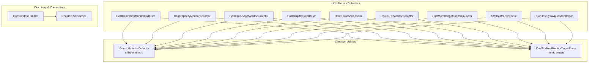

**Diagram sources**
- [HostBandwidthMonitorCollector.java:36-86](file://watcher-onestor/src/main/java/com/virtual/cloud/om/onestor/service/report/monitor/host/HostBandwidthMonitorCollector.java#L36-L86)
- [HostCapacityMonitorCollector.java:36-82](file://watcher-onestor/src/main/java/com/virtual/cloud/om/onestor/service/report/monitor/host/HostCapacityMonitorCollector.java#L36-L82)
- [HostCpuUsageMonitorCollector.java:35-79](file://watcher-onestor/src/main/java/com/virtual/cloud/om/onestor/service/report/monitor/host/HostCpuUsageMonitorCollector.java#L35-L79)
- [HostDiskdelayCollector.java:36-82](file://watcher-onestor/src/main/java/com/virtual/cloud/om/onestor/service/report/monitor/host/HostDiskdelayCollector.java#L36-L82)
- [HostDiskloadCollector.java:37-88](file://watcher-onestor/src/main/java/com/virtual/cloud/om/onestor/service/report/monitor/host/HostDiskloadCollector.java#L37-L88)
- [HostIOPSMonitorCollector.java:36-86](file://watcher-onestor/src/main/java/com/virtual/cloud/om/onestor/service/report/monitor/host/HostIOPSMonitorCollector.java#L36-L86)
- [HostMemUsageMonitorCollector.java:36-80](file://watcher-onestor/src/main/java/com/virtual/cloud/om/onestor/service/report/monitor/host/HostMemUsageMonitorCollector.java#L36-L80)
- [StorHostNicCollector.java:40-144](file://watcher-onestor/src/main/java/com/virtual/cloud/om/onestor/service/report/monitor/host/StorHostNicCollector.java#L40-L144)
- [StorHostSysAvgLoadCollector.java:42-113](file://watcher-onestor/src/main/java/com/virtual/cloud/om/onestor/service/report/monitor/host/StorHostSysAvgLoadCollector.java#L42-L113)
- [IOnestorMonitorCollector.java:16-53](file://watcher-onestor/src/main/java/com/virtual/cloud/om/onestor/service/report/monitor/IOnestorMonitorCollector.java#L16-L53)
- [OneStorHostMonitorTargetEnum.java:7-42](file://watcher-sdk/src/main/java/com/virtual/cloud/om/sdk/constant/onestor/report/OneStorHostMonitorTargetEnum.java#L7-L42)
- [OnestorHostHandler.java:28-71](file://watcher-onestor/src/main/java/com/virtual/cloud/om/onestor/service/OnestorHostHandler.java#L28-L71)
- [OnestorSSHService.java:13-36](file://watcher-onestor/src/main/java/com/virtual/cloud/om/onestor/service/ssh/OnestorSSHService.java#L13-L36)

**Section sources**
- [HostBandwidthMonitorCollector.java:36-86](file://watcher-onestor/src/main/java/com/virtual/cloud/om/onestor/service/report/monitor/host/HostBandwidthMonitorCollector.java#L36-L86)
- [HostCapacityMonitorCollector.java:36-82](file://watcher-onestor/src/main/java/com/virtual/cloud/om/onestor/service/report/monitor/host/HostCapacityMonitorCollector.java#L36-L82)
- [HostCpuUsageMonitorCollector.java:35-79](file://watcher-onestor/src/main/java/com/virtual/cloud/om/onestor/service/report/monitor/host/HostCpuUsageMonitorCollector.java#L35-L79)
- [HostDiskdelayCollector.java:36-82](file://watcher-onestor/src/main/java/com/virtual/cloud/om/onestor/service/report/monitor/host/HostDiskdelayCollector.java#L36-L82)
- [HostDiskloadCollector.java:37-88](file://watcher-onestor/src/main/java/com/virtual/cloud/om/onestor/service/report/monitor/host/HostDiskloadCollector.java#L37-L88)
- [HostIOPSMonitorCollector.java:36-86](file://watcher-onestor/src/main/java/com/virtual/cloud/om/onestor/service/report/monitor/host/HostIOPSMonitorCollector.java#L36-L86)
- [HostMemUsageMonitorCollector.java:36-80](file://watcher-onestor/src/main/java/com/virtual/cloud/om/onestor/service/report/monitor/host/HostMemUsageMonitorCollector.java#L36-L80)
- [StorHostNicCollector.java:40-144](file://watcher-onestor/src/main/java/com/virtual/cloud/om/onestor/service/report/monitor/host/StorHostNicCollector.java#L40-L144)
- [StorHostSysAvgLoadCollector.java:42-113](file://watcher-onestor/src/main/java/com/virtual/cloud/om/onestor/service/report/monitor/host/StorHostSysAvgLoadCollector.java#L42-L113)
- [IOnestorMonitorCollector.java:16-53](file://watcher-onestor/src/main/java/com/virtual/cloud/om/onestor/service/report/monitor/IOnestorMonitorCollector.java#L16-L53)
- [OneStorHostMonitorTargetEnum.java:7-42](file://watcher-sdk/src/main/java/com/virtual/cloud/om/sdk/constant/onestor/report/OneStorHostMonitorTargetEnum.java#L7-L42)
- [OnestorHostHandler.java:28-71](file://watcher-onestor/src/main/java/com/virtual/cloud/om/onestor/service/OnestorHostHandler.java#L28-L71)
- [OnestorSSHService.java:13-36](file://watcher-onestor/src/main/java/com/virtual/cloud/om/onestor/service/ssh/OnestorSSHService.java#L13-L36)

## Core Components
- HostBandwidthMonitorCollector: Aggregates per-host storage and filesystem read/write bandwidth metrics.
- HostCapacityMonitorCollector: Retrieves total and used capacity per host.
- HostCpuUsageMonitorCollector: Fetches host CPU usage ratio.
- HostDiskdelayCollector: Gathers read/write disk latency.
- HostDiskloadCollector: Retrieves average and peak disk utilization for storage nodes.
- HostIOPSMonitorCollector: Collects read/write IOPS and related operation rates.
- HostMemUsageMonitorCollector: Measures host memory usage ratio.
- StorHostNicCollector: Pulls NIC input/output packet stats, drops, and errors.
- StorHostSysAvgLoadCollector: Obtains 1-, 5-, and 15-minute system load averages per host.
- IOnestorMonitorCollector: Provides shared helpers for parsing time-series data and building metric targets.
- OneStorHostMonitorTargetEnum: Enumerates metric target templates used by collectors.
- OnestorHostHandler: Discovers hosts and maps endpoints to SSH credentials for remote operations.
- OnestorSSHService: Implements SSH authentication hooks for OneStor resources.

**Section sources**
- [HostBandwidthMonitorCollector.java:36-86](file://watcher-onestor/src/main/java/com/virtual/cloud/om/onestor/service/report/monitor/host/HostBandwidthMonitorCollector.java#L36-L86)
- [HostCapacityMonitorCollector.java:36-82](file://watcher-onestor/src/main/java/com/virtual/cloud/om/onestor/service/report/monitor/host/HostCapacityMonitorCollector.java#L36-L82)
- [HostCpuUsageMonitorCollector.java:35-79](file://watcher-onestor/src/main/java/com/virtual/cloud/om/onestor/service/report/monitor/host/HostCpuUsageMonitorCollector.java#L35-L79)
- [HostDiskdelayCollector.java:36-82](file://watcher-onestor/src/main/java/com/virtual/cloud/om/onestor/service/report/monitor/host/HostDiskdelayCollector.java#L36-L82)
- [HostDiskloadCollector.java:37-88](file://watcher-onestor/src/main/java/com/virtual/cloud/om/onestor/service/report/monitor/host/HostDiskloadCollector.java#L37-L88)
- [HostIOPSMonitorCollector.java:36-86](file://watcher-onestor/src/main/java/com/virtual/cloud/om/onestor/service/report/monitor/host/HostIOPSMonitorCollector.java#L36-L86)
- [HostMemUsageMonitorCollector.java:36-80](file://watcher-onestor/src/main/java/com/virtual/cloud/om/onestor/service/report/monitor/host/HostMemUsageMonitorCollector.java#L36-L80)
- [StorHostNicCollector.java:40-144](file://watcher-onestor/src/main/java/com/virtual/cloud/om/onestor/service/report/monitor/host/StorHostNicCollector.java#L40-L144)
- [StorHostSysAvgLoadCollector.java:42-113](file://watcher-onestor/src/main/java/com/virtual/cloud/om/onestor/service/report/monitor/host/StorHostSysAvgLoadCollector.java#L42-L113)
- [IOnestorMonitorCollector.java:16-53](file://watcher-onestor/src/main/java/com/virtual/cloud/om/onestor/service/report/monitor/IOnestorMonitorCollector.java#L16-L53)
- [OneStorHostMonitorTargetEnum.java:7-42](file://watcher-sdk/src/main/java/com/virtual/cloud/om/sdk/constant/onestor/report/OneStorHostMonitorTargetEnum.java#L7-L42)
- [OnestorHostHandler.java:28-71](file://watcher-onestor/src/main/java/com/virtual/cloud/om/onestor/service/OnestorHostHandler.java#L28-L71)
- [OnestorSSHService.java:13-36](file://watcher-onestor/src/main/java/com/virtual/cloud/om/onestor/service/ssh/OnestorSSHService.java#L13-L36)

## Architecture Overview
The host monitoring architecture consists of:
- REST-driven discovery and metric retrieval against the OneStor management plane.
- Per-metric collectors that build target expressions, query the backend, and normalize results.
- Shared utilities for target construction, timestamp extraction, and value retrieval.
- Host discovery and SSH integration for remote operations.

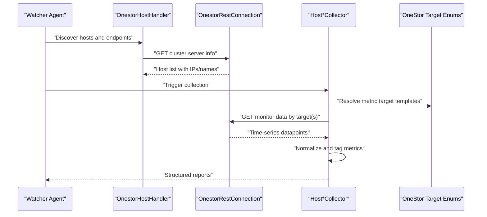

**Diagram sources**
- [OnestorHostHandler.java:34-70](file://watcher-onestor/src/main/java/com/virtual/cloud/om/onestor/service/OnestorHostHandler.java#L34-L70)
- [HostBandwidthMonitorCollector.java:38-74](file://watcher-onestor/src/main/java/com/virtual/cloud/om/onestor/service/report/monitor/host/HostBandwidthMonitorCollector.java#L38-L74)
- [HostCapacityMonitorCollector.java:38-70](file://watcher-onestor/src/main/java/com/virtual/cloud/om/onestor/service/report/monitor/host/HostCapacityMonitorCollector.java#L38-L70)
- [HostCpuUsageMonitorCollector.java:37-67](file://watcher-onestor/src/main/java/com/virtual/cloud/om/onestor/service/report/monitor/host/HostCpuUsageMonitorCollector.java#L37-L67)
- [HostDiskdelayCollector.java:37-69](file://watcher-onestor/src/main/java/com/virtual/cloud/om/onestor/service/report/monitor/host/HostDiskdelayCollector.java#L37-L69)
- [HostDiskloadCollector.java:37-66](file://watcher-onestor/src/main/java/com/virtual/cloud/om/onestor/service/report/monitor/host/HostDiskloadCollector.java#L37-L66)
- [HostIOPSMonitorCollector.java:37-74](file://watcher-onestor/src/main/java/com/virtual/cloud/om/onestor/service/report/monitor/host/HostIOPSMonitorCollector.java#L37-L74)
- [HostMemUsageMonitorCollector.java:36-68](file://watcher-onestor/src/main/java/com/virtual/cloud/om/onestor/service/report/monitor/host/HostMemUsageMonitorCollector.java#L36-L68)
- [StorHostNicCollector.java:43-132](file://watcher-onestor/src/main/java/com/virtual/cloud/om/onestor/service/report/monitor/host/StorHostNicCollector.java#L43-L132)
- [StorHostSysAvgLoadCollector.java:44-101](file://watcher-onestor/src/main/java/com/virtual/cloud/om/onestor/service/report/monitor/host/StorHostSysAvgLoadCollector.java#L44-L101)
- [OneStorHostMonitorTargetEnum.java:7-42](file://watcher-sdk/src/main/java/com/virtual/cloud/om/sdk/constant/onestor/report/OneStorHostMonitorTargetEnum.java#L7-L42)

## Detailed Component Analysis

### Host Bandwidth Monitor Collector
- Purpose: Retrieve per-host storage and filesystem read/write bandwidth metrics.
- Data model: Aggregates four targets per host into a single report DTO with timestamp and tags.
- Collection pattern: Builds a composite target list, queries the backend, maps results, and constructs a report DTO per host.

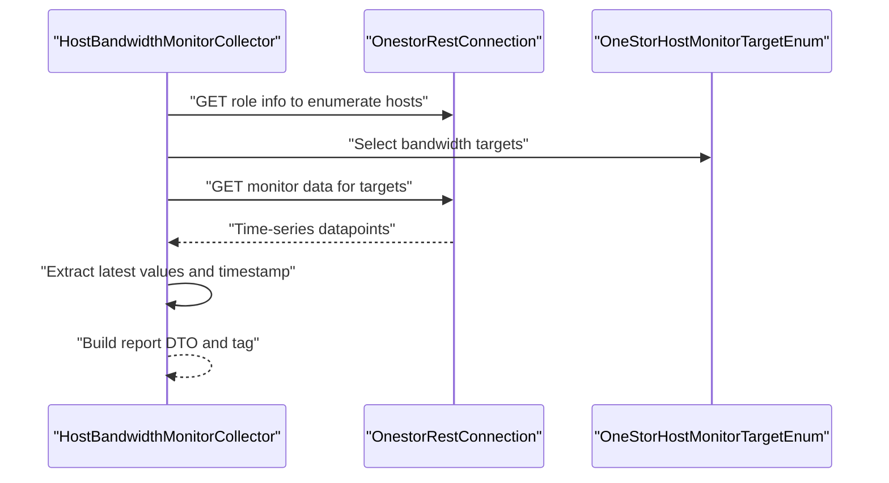

**Diagram sources**
- [HostBandwidthMonitorCollector.java:38-74](file://watcher-onestor/src/main/java/com/virtual/cloud/om/onestor/service/report/monitor/host/HostBandwidthMonitorCollector.java#L38-L74)
- [OneStorHostMonitorTargetEnum.java:13-16](file://watcher-sdk/src/main/java/com/virtual/cloud/om/sdk/constant/onestor/report/OneStorHostMonitorTargetEnum.java#L13-L16)

**Section sources**
- [HostBandwidthMonitorCollector.java:36-86](file://watcher-onestor/src/main/java/com/virtual/cloud/om/onestor/service/report/monitor/host/HostBandwidthMonitorCollector.java#L36-L86)
- [OneStorHostMonitorTargetEnum.java:13-16](file://watcher-sdk/src/main/java/com/virtual/cloud/om/sdk/constant/onestor/report/OneStorHostMonitorTargetEnum.java#L13-L16)

### Host Capacity Monitor Collector
- Purpose: Retrieve total and used capacity per host.
- Data model: Produces a capacity report DTO per host with timestamp and tags.

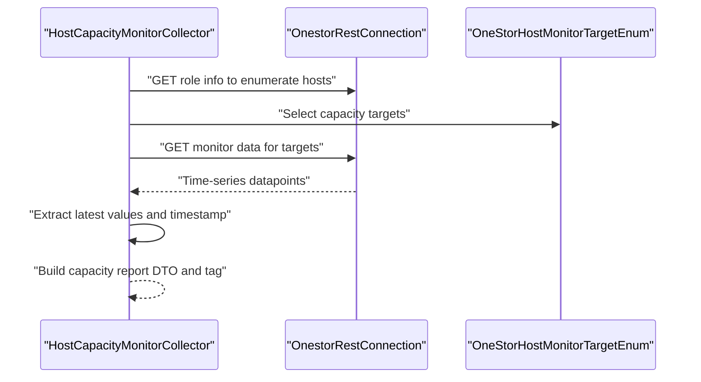

**Diagram sources**
- [HostCapacityMonitorCollector.java:38-70](file://watcher-onestor/src/main/java/com/virtual/cloud/om/onestor/service/report/monitor/host/HostCapacityMonitorCollector.java#L38-L70)
- [OneStorHostMonitorTargetEnum.java:18-19](file://watcher-sdk/src/main/java/com/virtual/cloud/om/sdk/constant/onestor/report/OneStorHostMonitorTargetEnum.java#L18-L19)

**Section sources**
- [HostCapacityMonitorCollector.java:36-82](file://watcher-onestor/src/main/java/com/virtual/cloud/om/onestor/service/report/monitor/host/HostCapacityMonitorCollector.java#L36-L82)
- [OneStorHostMonitorTargetEnum.java:18-19](file://watcher-sdk/src/main/java/com/virtual/cloud/om/sdk/constant/onestor/report/OneStorHostMonitorTargetEnum.java#L18-L19)

### Host CPU Usage Monitor Collector
- Purpose: Retrieve host CPU usage ratio.
- Data model: Produces a CPU usage report DTO per host with timestamp and tags.

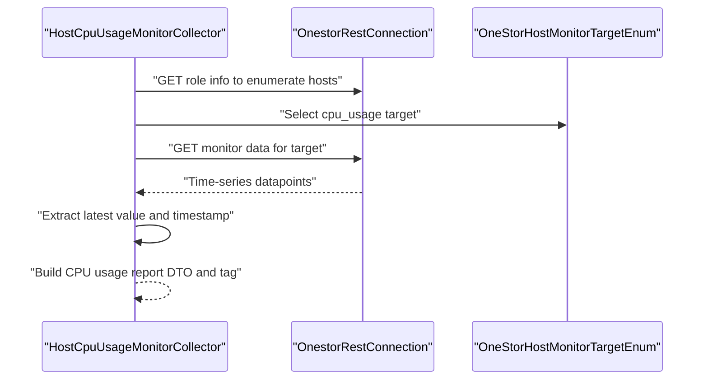

**Diagram sources**
- [HostCpuUsageMonitorCollector.java:37-67](file://watcher-onestor/src/main/java/com/virtual/cloud/om/onestor/service/report/monitor/host/HostCpuUsageMonitorCollector.java#L37-L67)
- [OneStorHostMonitorTargetEnum.java](file://watcher-sdk/src/main/java/com/virtual/cloud/om/sdk/constant/onestor/report/OneStorHostMonitorTargetEnum.java#L21)

**Section sources**
- [HostCpuUsageMonitorCollector.java:35-79](file://watcher-onestor/src/main/java/com/virtual/cloud/om/onestor/service/report/monitor/host/HostCpuUsageMonitorCollector.java#L35-L79)
- [OneStorHostMonitorTargetEnum.java](file://watcher-sdk/src/main/java/com/virtual/cloud/om/sdk/constant/onestor/report/OneStorHostMonitorTargetEnum.java#L21)

### Host Disk Delay Monitor Collector
- Purpose: Retrieve per-host disk read/write latency.
- Data model: Produces a disk delay report DTO per host with timestamp and tags.

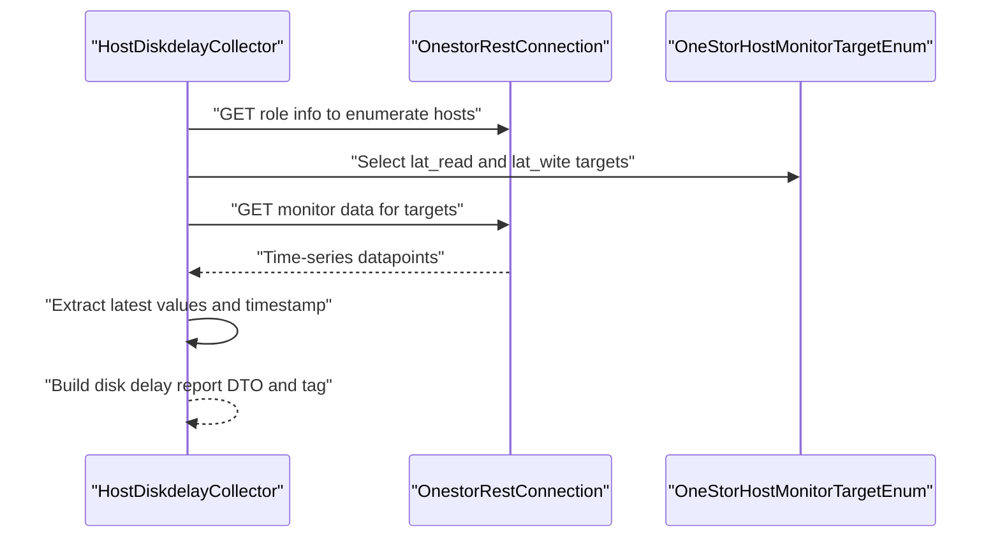

**Diagram sources**
- [HostDiskdelayCollector.java:37-69](file://watcher-onestor/src/main/java/com/virtual/cloud/om/onestor/service/report/monitor/host/HostDiskdelayCollector.java#L37-L69)
- [OneStorHostMonitorTargetEnum.java:24-25](file://watcher-sdk/src/main/java/com/virtual/cloud/om/sdk/constant/onestor/report/OneStorHostMonitorTargetEnum.java#L24-L25)

**Section sources**
- [HostDiskdelayCollector.java:36-82](file://watcher-onestor/src/main/java/com/virtual/cloud/om/onestor/service/report/monitor/host/HostDiskdelayCollector.java#L36-L82)
- [OneStorHostMonitorTargetEnum.java:24-25](file://watcher-sdk/src/main/java/com/virtual/cloud/om/sdk/constant/onestor/report/OneStorHostMonitorTargetEnum.java#L24-L25)

### Host Disk Load Monitor Collector
- Purpose: Retrieve per-storage-node disk utilization (average and max).
- Data model: Produces a disk load report DTO per host with timestamp and tags.
- Discovery note: Filters hosts by storage role prior to querying.

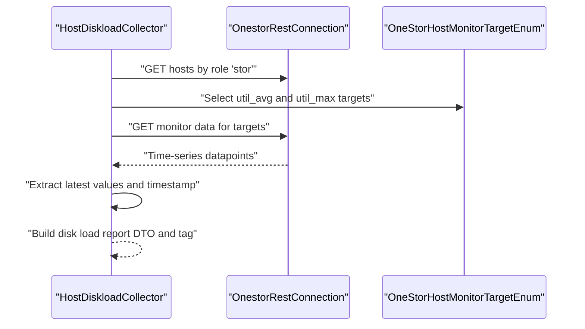

**Diagram sources**
- [HostDiskloadCollector.java:37-66](file://watcher-onestor/src/main/java/com/virtual/cloud/om/onestor/service/report/monitor/host/HostDiskloadCollector.java#L37-L66)
- [OneStorHostMonitorTargetEnum.java:28-29](file://watcher-sdk/src/main/java/com/virtual/cloud/om/sdk/constant/onestor/report/OneStorHostMonitorTargetEnum.java#L28-L29)

**Section sources**
- [HostDiskloadCollector.java:37-88](file://watcher-onestor/src/main/java/com/virtual/cloud/om/onestor/service/report/monitor/host/HostDiskloadCollector.java#L37-L88)
- [OneStorHostMonitorTargetEnum.java:28-29](file://watcher-sdk/src/main/java/com/virtual/cloud/om/sdk/constant/onestor/report/OneStorHostMonitorTargetEnum.java#L28-L29)

### Host IOPS Monitor Collector
- Purpose: Retrieve per-host read/write IOPS and related operation rates.
- Data model: Produces an IOPS report DTO per host with timestamp and tags.

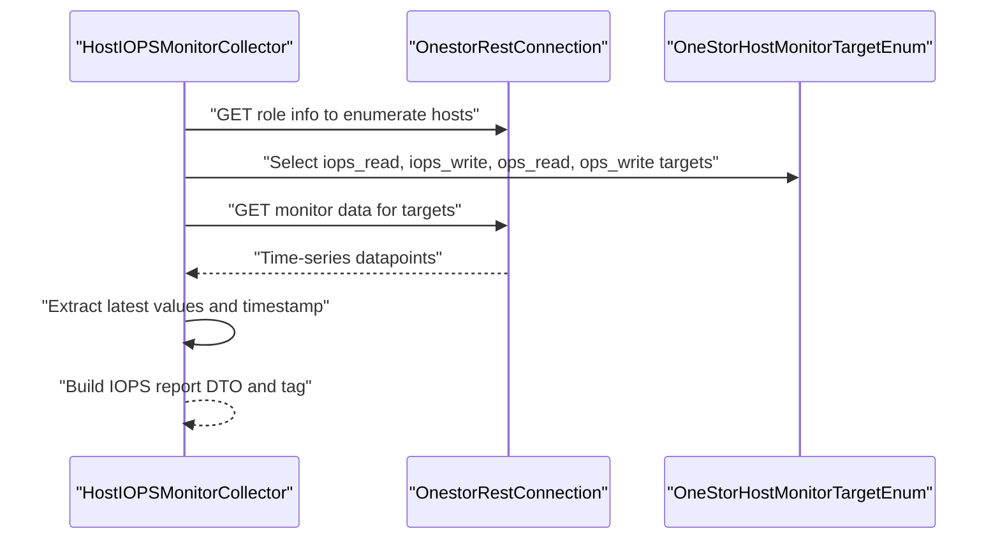

**Diagram sources**
- [HostIOPSMonitorCollector.java:37-74](file://watcher-onestor/src/main/java/com/virtual/cloud/om/onestor/service/report/monitor/host/HostIOPSMonitorCollector.java#L37-L74)
- [OneStorHostMonitorTargetEnum.java:8-11](file://watcher-sdk/src/main/java/com/virtual/cloud/om/sdk/constant/onestor/report/OneStorHostMonitorTargetEnum.java#L8-L11)

**Section sources**
- [HostIOPSMonitorCollector.java:36-86](file://watcher-onestor/src/main/java/com/virtual/cloud/om/onestor/service/report/monitor/host/HostIOPSMonitorCollector.java#L36-L86)
- [OneStorHostMonitorTargetEnum.java:8-11](file://watcher-sdk/src/main/java/com/virtual/cloud/om/sdk/constant/onestor/report/OneStorHostMonitorTargetEnum.java#L8-L11)

### Host Memory Usage Monitor Collector
- Purpose: Retrieve host memory usage ratio.
- Data model: Produces a memory usage report DTO per host with timestamp and tags.

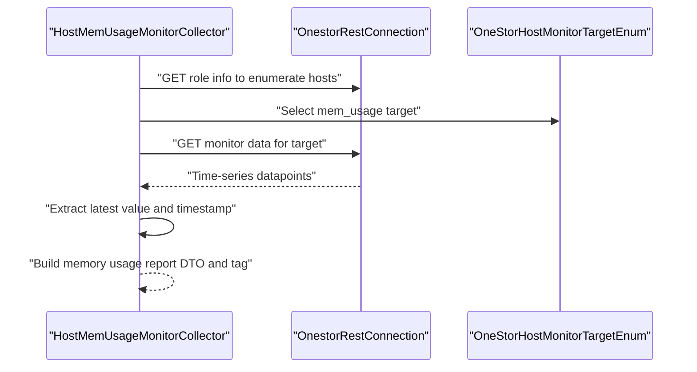

**Diagram sources**
- [HostMemUsageMonitorCollector.java:36-68](file://watcher-onestor/src/main/java/com/virtual/cloud/om/onestor/service/report/monitor/host/HostMemUsageMonitorCollector.java#L36-L68)
- [OneStorHostMonitorTargetEnum.java](file://watcher-sdk/src/main/java/com/virtual/cloud/om/sdk/constant/onestor/report/OneStorHostMonitorTargetEnum.java#L22)

**Section sources**
- [HostMemUsageMonitorCollector.java:36-80](file://watcher-onestor/src/main/java/com/virtual/cloud/om/onestor/service/report/monitor/host/HostMemUsageMonitorCollector.java#L36-L80)
- [OneStorHostMonitorTargetEnum.java](file://watcher-sdk/src/main/java/com/virtual/cloud/om/sdk/constant/onestor/report/OneStorHostMonitorTargetEnum.java#L22)

### StorHost NIC Collector
- Purpose: Retrieve per-host NIC counters: input/output bytes/packets, drops, and errors.
- Data model: Produces a NIC report DTO per host with timestamp and tags.
- Data source: Uses Graphite-style render endpoints to fetch multiple targets in one call.

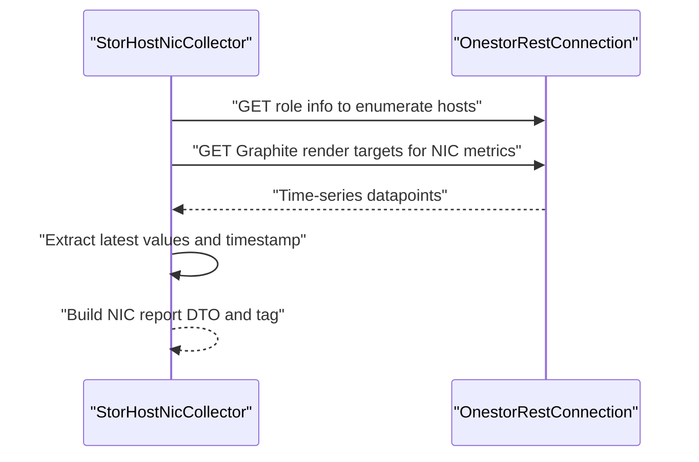

**Diagram sources**
- [StorHostNicCollector.java:43-132](file://watcher-onestor/src/main/java/com/virtual/cloud/om/onestor/service/report/monitor/host/StorHostNicCollector.java#L43-L132)

**Section sources**
- [StorHostNicCollector.java:40-144](file://watcher-onestor/src/main/java/com/virtual/cloud/om/onestor/service/report/monitor/host/StorHostNicCollector.java#L40-L144)

### StorHost Sys Avg Load Collector
- Purpose: Retrieve per-host 1-, 5-, and 15-minute system load averages.
- Data model: Produces a load average report DTO per host with timestamp and tags.
- Data source: Uses Graphite-style render endpoints to fetch multiple targets in one call.

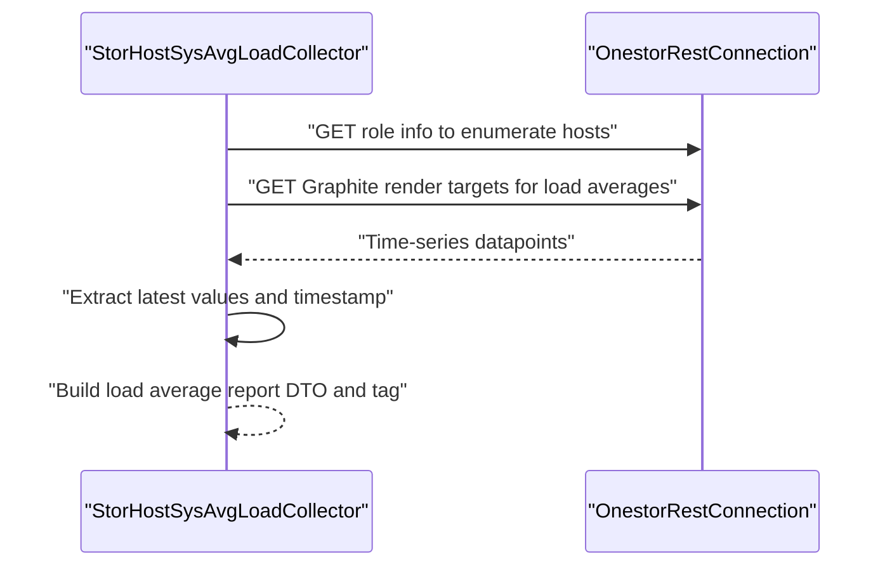

**Diagram sources**
- [StorHostSysAvgLoadCollector.java:44-101](file://watcher-onestor/src/main/java/com/virtual/cloud/om/onestor/service/report/monitor/host/StorHostSysAvgLoadCollector.java#L44-L101)

**Section sources**
- [StorHostSysAvgLoadCollector.java:42-113](file://watcher-onestor/src/main/java/com/virtual/cloud/om/onestor/service/report/monitor/host/StorHostSysAvgLoadCollector.java#L42-L113)

### Host Discovery and SSH Connectivity
- Host discovery: The handler retrieves the full host inventory from the OneStor management plane and maps endpoints to host names and credentials.
- SSH connectivity: The SSH service provides authentication hooks for OneStor resources, enabling remote operations against discovered hosts.

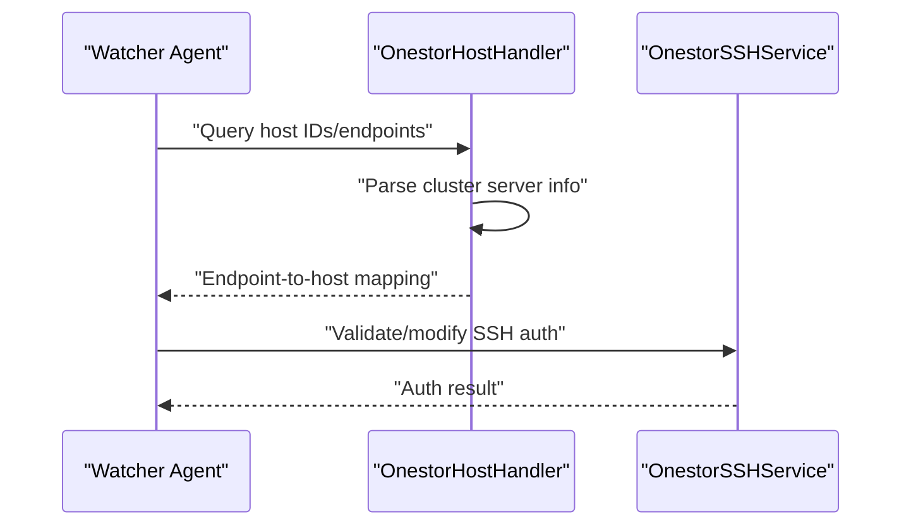

**Diagram sources**
- [OnestorHostHandler.java:34-70](file://watcher-onestor/src/main/java/com/virtual/cloud/om/onestor/service/OnestorHostHandler.java#L34-L70)
- [OnestorSSHService.java:16-35](file://watcher-onestor/src/main/java/com/virtual/cloud/om/onestor/service/ssh/OnestorSSHService.java#L16-L35)

**Section sources**
- [OnestorHostHandler.java:28-71](file://watcher-onestor/src/main/java/com/virtual/cloud/om/onestor/service/OnestorHostHandler.java#L28-L71)
- [OnestorSSHService.java:13-36](file://watcher-onestor/src/main/java/com/virtual/cloud/om/onestor/service/ssh/OnestorSSHService.java#L13-L36)

## Dependency Analysis
- Collectors depend on:
  - OnestorRestConnection for REST calls to the OneStor management plane.
  - OneStorHostMonitorTargetEnum for target template resolution.
  - IOnestorMonitorCollector for shared utilities to parse time-series data and timestamps.
- Discovery and SSH:
  - OnestorHostHandler depends on OnestorRestConnection to enumerate hosts.
  - OnestorSSHService extends the SDK’s SSH abstraction for OneStor resources.

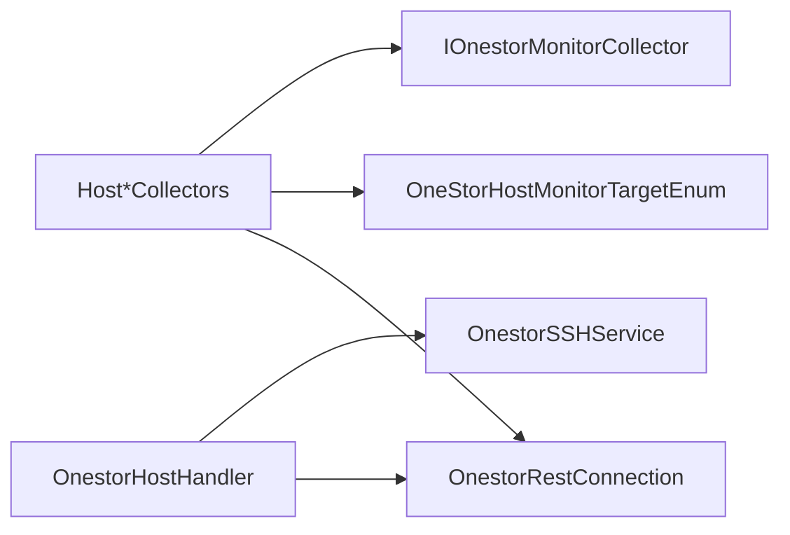

**Diagram sources**
- [HostBandwidthMonitorCollector.java:37-86](file://watcher-onestor/src/main/java/com/virtual/cloud/om/onestor/service/report/monitor/host/HostBandwidthMonitorCollector.java#L37-L86)
- [HostCapacityMonitorCollector.java:37-82](file://watcher-onestor/src/main/java/com/virtual/cloud/om/onestor/service/report/monitor/host/HostCapacityMonitorCollector.java#L37-L82)
- [HostCpuUsageMonitorCollector.java:36-79](file://watcher-onestor/src/main/java/com/virtual/cloud/om/onestor/service/report/monitor/host/HostCpuUsageMonitorCollector.java#L36-L79)
- [HostDiskdelayCollector.java:37-82](file://watcher-onestor/src/main/java/com/virtual/cloud/om/onestor/service/report/monitor/host/HostDiskdelayCollector.java#L37-L82)
- [HostDiskloadCollector.java:37-88](file://watcher-onestor/src/main/java/com/virtual/cloud/om/onestor/service/report/monitor/host/HostDiskloadCollector.java#L37-L88)
- [HostIOPSMonitorCollector.java:37-86](file://watcher-onestor/src/main/java/com/virtual/cloud/om/onestor/service/report/monitor/host/HostIOPSMonitorCollector.java#L37-L86)
- [HostMemUsageMonitorCollector.java:36-80](file://watcher-onestor/src/main/java/com/virtual/cloud/om/onestor/service/report/monitor/host/HostMemUsageMonitorCollector.java#L36-L80)
- [StorHostNicCollector.java:42-144](file://watcher-onestor/src/main/java/com/virtual/cloud/om/onestor/service/report/monitor/host/StorHostNicCollector.java#L42-L144)
- [StorHostSysAvgLoadCollector.java:42-113](file://watcher-onestor/src/main/java/com/virtual/cloud/om/onestor/service/report/monitor/host/StorHostSysAvgLoadCollector.java#L42-L113)
- [IOnestorMonitorCollector.java:16-53](file://watcher-onestor/src/main/java/com/virtual/cloud/om/onestor/service/report/monitor/IOnestorMonitorCollector.java#L16-L53)
- [OneStorHostMonitorTargetEnum.java:7-42](file://watcher-sdk/src/main/java/com/virtual/cloud/om/sdk/constant/onestor/report/OneStorHostMonitorTargetEnum.java#L7-L42)
- [OnestorHostHandler.java:28-71](file://watcher-onestor/src/main/java/com/virtual/cloud/om/onestor/service/OnestorHostHandler.java#L28-L71)
- [OnestorSSHService.java:13-36](file://watcher-onestor/src/main/java/com/virtual/cloud/om/onestor/service/ssh/OnestorSSHService.java#L13-L36)

**Section sources**
- [IOnestorMonitorCollector.java:16-53](file://watcher-onestor/src/main/java/com/virtual/cloud/om/onestor/service/report/monitor/IOnestorMonitorCollector.java#L16-L53)
- [OneStorHostMonitorTargetEnum.java:7-42](file://watcher-sdk/src/main/java/com/virtual/cloud/om/sdk/constant/onestor/report/OneStorHostMonitorTargetEnum.java#L7-L42)
- [OnestorHostHandler.java:28-71](file://watcher-onestor/src/main/java/com/virtual/cloud/om/onestor/service/OnestorHostHandler.java#L28-L71)
- [OnestorSSHService.java:13-36](file://watcher-onestor/src/main/java/com/virtual/cloud/om/onestor/service/ssh/OnestorSSHService.java#L13-L36)

## Performance Considerations
- Parallelization: Collectors use parallel streams to process multiple hosts concurrently, reducing end-to-end collection latency.
- Time-series selection: Utility methods select the most recent data point and derive a timestamp from the latest available record, ensuring freshness.
- Target batching: Some collectors batch multiple targets in a single request to minimize round-trips.
- Role filtering: Disk load collector filters storage-role hosts to avoid unnecessary queries on non-storage nodes.

[No sources needed since this section provides general guidance]

## Troubleshooting Guide
- Empty or stale metrics:
  - Verify cluster ID retrieval and endpoint reachability.
  - Confirm that the selected targets are present for the queried hosts.
- Timestamp anomalies:
  - Ensure the backend returns non-empty datapoints; otherwise, fallback timestamps are applied.
- Host enumeration issues:
  - Validate that the management plane returns a populated host list and that endpoints match expected hostnames/IPs.
- SSH connectivity:
  - Confirm SSH auth checks succeed and that credentials align with the management plane configuration.

**Section sources**
- [IOnestorMonitorCollector.java:16-53](file://watcher-onestor/src/main/java/com/virtual/cloud/om/onestor/service/report/monitor/IOnestorMonitorCollector.java#L16-L53)
- [OnestorHostHandler.java:34-70](file://watcher-onestor/src/main/java/com/virtual/cloud/om/onestor/service/OnestorHostHandler.java#L34-L70)
- [OnestorSSHService.java:16-35](file://watcher-onestor/src/main/java/com/virtual/cloud/om/onestor/service/ssh/OnestorSSHService.java#L16-L35)

## Conclusion
The OneStor host-level monitoring system provides comprehensive visibility into host performance across bandwidth, capacity, CPU, disk delays/loads, IOPS, memory usage, NIC counters, and system load averages. Collectors leverage REST APIs and shared utilities to normalize and tag metrics, while discovery and SSH services integrate with the broader OneStor ecosystem. Applying the optimization strategies and troubleshooting steps outlined here will help maintain accurate, timely, and actionable host performance insights.

[No sources needed since this section summarizes without analyzing specific files]

## Appendices

### Host Metrics Reference
- Bandwidth: Read/write storage and filesystem bandwidth.
- Capacity: Total and used capacity.
- CPU: CPU usage ratio.
- Disk Delay: Read/write latency.
- Disk Load: Average and maximum disk utilization (storage nodes).
- IOPS: Read/write IOPS and related operation rates.
- Memory: Memory usage ratio.
- NIC: Input/output bytes/packets, drops, and errors.
- System Load: 1-, 5-, and 15-minute load averages.

**Section sources**
- [HostBandwidthMonitorCollector.java:36-86](file://watcher-onestor/src/main/java/com/virtual/cloud/om/onestor/service/report/monitor/host/HostBandwidthMonitorCollector.java#L36-L86)
- [HostCapacityMonitorCollector.java:36-82](file://watcher-onestor/src/main/java/com/virtual/cloud/om/onestor/service/report/monitor/host/HostCapacityMonitorCollector.java#L36-L82)
- [HostCpuUsageMonitorCollector.java:35-79](file://watcher-onestor/src/main/java/com/virtual/cloud/om/onestor/service/report/monitor/host/HostCpuUsageMonitorCollector.java#L35-L79)
- [HostDiskdelayCollector.java:36-82](file://watcher-onestor/src/main/java/com/virtual/cloud/om/onestor/service/report/monitor/host/HostDiskdelayCollector.java#L36-L82)
- [HostDiskloadCollector.java:37-88](file://watcher-onestor/src/main/java/com/virtual/cloud/om/onestor/service/report/monitor/host/HostDiskloadCollector.java#L37-L88)
- [HostIOPSMonitorCollector.java:36-86](file://watcher-onestor/src/main/java/com/virtual/cloud/om/onestor/service/report/monitor/host/HostIOPSMonitorCollector.java#L36-L86)
- [HostMemUsageMonitorCollector.java:36-80](file://watcher-onestor/src/main/java/com/virtual/cloud/om/onestor/service/report/monitor/host/HostMemUsageMonitorCollector.java#L36-L80)
- [StorHostNicCollector.java:40-144](file://watcher-onestor/src/main/java/com/virtual/cloud/om/onestor/service/report/monitor/host/StorHostNicCollector.java#L40-L144)
- [StorHostSysAvgLoadCollector.java:42-113](file://watcher-onestor/src/main/java/com/virtual/cloud/om/onestor/service/report/monitor/host/StorHostSysAvgLoadCollector.java#L42-L113)