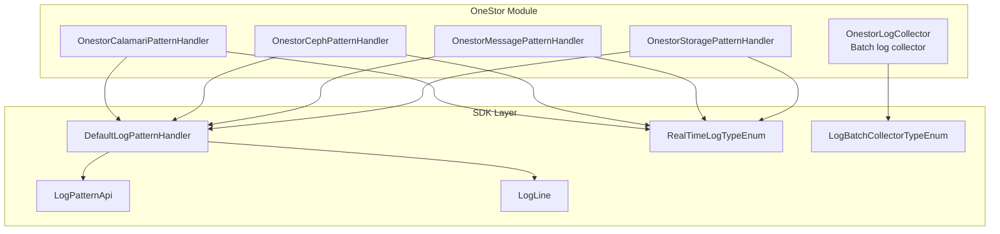
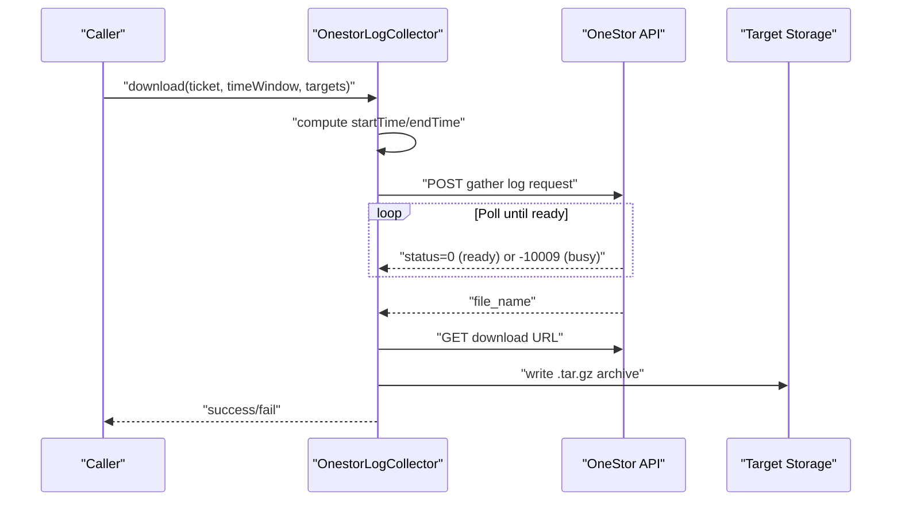
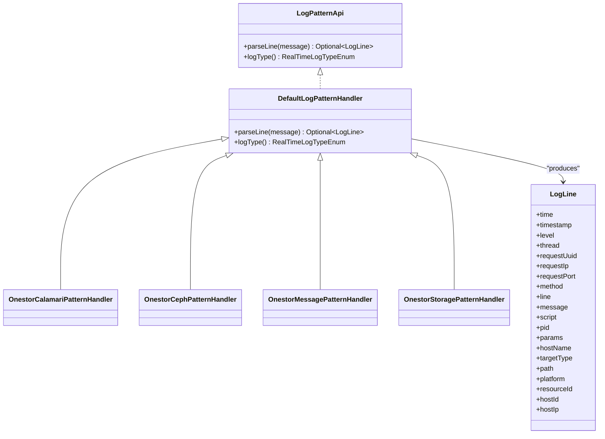
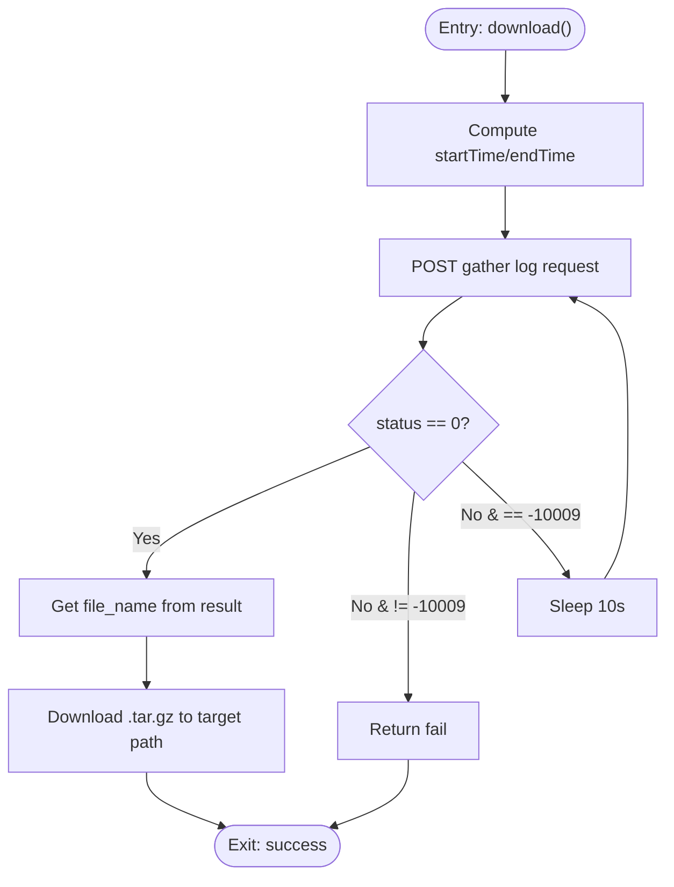
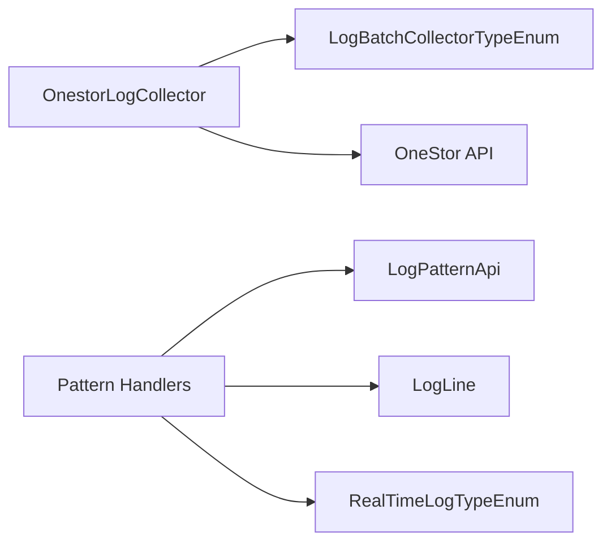

# Log Collection & Analysis

<cite>
**Referenced Files in This Document**
- [OnestorLogCollector.java](file://watcher-onestor/src/main/java/com/virtual/cloud/om/onestor/service/log/OnestorLogCollector.java)
- [OnestorCalamariPatternHandler.java](file://watcher-onestor/src/main/java/com/virtual/cloud/om/onestor/service/OnestorCalamariPatternHandler.java)
- [OnestorCephPatternHandler.java](file://watcher-onestor/src/main/java/com/virtual/cloud/om/onestor/service/OnestorCephPatternHandler.java)
- [OnestorMessagePatternHandler.java](file://watcher-onestor/src/main/java/com/virtual/cloud/om/onestor/service/OnestorMessagePatternHandler.java)
- [OnestorStoragePatternHandler.java](file://watcher-onestor/src/main/java/com/virtual/cloud/om/onestor/service/OnestorStoragePatternHandler.java)
- [DefaultLogPatternHandler.java](file://watcher-sdk/src/main/java/com/virtual/cloud/om/sdk/api/DefaultLogPatternHandler.java)
- [LogPatternApi.java](file://watcher-sdk/src/main/java/com/virtual/cloud/om/sdk/api/LogPatternApi.java)
- [LogLine.java](file://watcher-sdk/src/main/java/com/virtual/cloud/om/sdk/dto/LogLine.java)
- [RealTimeLogTypeEnum.java](file://watcher-sdk/src/main/java/com/virtual/cloud/om/sdk/constant/RealTimeLogTypeEnum.java)
- [LogBatchCollectorTypeEnum.java](file://watcher-sdk/src/main/java/com/virtual/cloud/om/sdk/constant/LogBatchCollectorTypeEnum.java)
</cite>

## Table of Contents
1. [Introduction](#introduction)
2. [Project Structure](#project-structure)
3. [Core Components](#core-components)
4. [Architecture Overview](#architecture-overview)
5. [Detailed Component Analysis](#detailed-component-analysis)
6. [Dependency Analysis](#dependency-analysis)
7. [Performance Considerations](#performance-considerations)
8. [Troubleshooting Guide](#troubleshooting-guide)
9. [Conclusion](#conclusion)
10. [Appendices](#appendices)

## Introduction
This document describes the OneStor log collection and analysis capabilities within the ShowTime platform. It covers the centralized log gathering mechanism via OnestorLogCollector, the real-time log parsing pipeline driven by specialized pattern handlers for Calamari storage management logs, Ceph storage system logs, message queue logs, and storage-specific logs, and the integration with the SDK’s log abstraction and enumeration types. The document also outlines filtering strategies, alert readiness, retention considerations, performance impact, troubleshooting, and best practices for analyzing distributed storage system logs.

## Project Structure
The OneStor log subsystem is composed of:
- A batch collector that orchestrates log retrieval from OneStor hosts.
- Pattern handlers that parse and normalize real-time log streams into a unified model.
- SDK-level abstractions and enumerations that define log types, parsing contracts, and batch collector categories.

**Diagram sources**
- [OnestorLogCollector.java:26-91](file://watcher-onestor/src/main/java/com/virtual/cloud/om/onestor/service/log/OnestorLogCollector.java#L26-L91)
- [OnestorCalamariPatternHandler.java:17-57](file://watcher-onestor/src/main/java/com/virtual/cloud/om/onestor/service/OnestorCalamariPatternHandler.java#L17-L57)
- [OnestorCephPatternHandler.java:16-51](file://watcher-onestor/src/main/java/com/virtual/cloud/om/onestor/service/OnestorCephPatternHandler.java#L16-L51)
- [OnestorMessagePatternHandler.java:17-54](file://watcher-onestor/src/main/java/com/virtual/cloud/om/onestor/service/OnestorMessagePatternHandler.java#L17-L54)
- [OnestorStoragePatternHandler.java:16-51](file://watcher-onestor/src/main/java/com/virtual/cloud/om/onestor/service/OnestorStoragePatternHandler.java#L16-L51)
- [DefaultLogPatternHandler.java:17-55](file://watcher-sdk/src/main/java/com/virtual/cloud/om/sdk/api/DefaultLogPatternHandler.java#L17-L55)
- [LogPatternApi.java:12-17](file://watcher-sdk/src/main/java/com/virtual/cloud/om/sdk/api/LogPatternApi.java#L12-L17)
- [LogLine.java:6-55](file://watcher-sdk/src/main/java/com/virtual/cloud/om/sdk/dto/LogLine.java#L6-L55)
- [RealTimeLogTypeEnum.java:15-44](file://watcher-sdk/src/main/java/com/virtual/cloud/om/sdk/constant/RealTimeLogTypeEnum.java#L15-L44)
- [LogBatchCollectorTypeEnum.java:7-34](file://watcher-sdk/src/main/java/com/virtual/cloud/om/sdk/constant/LogBatchCollectorTypeEnum.java#L7-L34)

**Section sources**
- [OnestorLogCollector.java:26-91](file://watcher-onestor/src/main/java/com/virtual/cloud/om/onestor/service/log/OnestorLogCollector.java#L26-L91)
- [OnestorCalamariPatternHandler.java:17-57](file://watcher-onestor/src/main/java/com/virtual/cloud/om/onestor/service/OnestorCalamariPatternHandler.java#L17-L57)
- [OnestorCephPatternHandler.java:16-51](file://watcher-onestor/src/main/java/com/virtual/cloud/om/onestor/service/OnestorCephPatternHandler.java#L16-L51)
- [OnestorMessagePatternHandler.java:17-54](file://watcher-onestor/src/main/java/com/virtual/cloud/om/onestor/service/OnestorMessagePatternHandler.java#L17-L54)
- [OnestorStoragePatternHandler.java:16-51](file://watcher-onestor/src/main/java/com/virtual/cloud/om/onestor/service/OnestorStoragePatternHandler.java#L16-L51)
- [DefaultLogPatternHandler.java:17-55](file://watcher-sdk/src/main/java/com/virtual/cloud/om/sdk/api/DefaultLogPatternHandler.java#L17-L55)
- [LogPatternApi.java:12-17](file://watcher-sdk/src/main/java/com/virtual/cloud/om/sdk/api/LogPatternApi.java#L12-L17)
- [LogLine.java:6-55](file://watcher-sdk/src/main/java/com/virtual/cloud/om/sdk/dto/LogLine.java#L6-L55)
- [RealTimeLogTypeEnum.java:15-44](file://watcher-sdk/src/main/java/com/virtual/cloud/om/sdk/constant/RealTimeLogTypeEnum.java#L15-L44)
- [LogBatchCollectorTypeEnum.java:7-34](file://watcher-sdk/src/main/java/com/virtual/cloud/om/sdk/constant/LogBatchCollectorTypeEnum.java#L7-L34)

## Core Components
- OnestorLogCollector: Orchestrates batch log collection from OneStor hosts, manages scheduling windows, handles concurrent collection states, and downloads aggregated archives.
- Pattern Handlers: Specialized parsers for Calamari, Ceph, Message Queue, and Storage logs, each implementing a common parsing contract and returning normalized LogLine instances.
- SDK Abstractions: LogPatternApi defines the parsing contract; DefaultLogPatternHandler provides a robust baseline parser; RealTimeLogTypeEnum enumerates supported log families; LogBatchCollectorTypeEnum categorizes batch collectors by platform and type.

Key responsibilities:
- Centralized collection: Request and poll for log bundles, then download compressed archives.
- Real-time parsing: Normalize heterogeneous log formats into a unified LogLine DTO.
- Type safety and extensibility: Enumerations and interfaces enable consistent handling across platforms.

**Section sources**
- [OnestorLogCollector.java:26-91](file://watcher-onestor/src/main/java/com/virtual/cloud/om/onestor/service/log/OnestorLogCollector.java#L26-L91)
- [OnestorCalamariPatternHandler.java:17-57](file://watcher-onestor/src/main/java/com/virtual/cloud/om/onestor/service/OnestorCalamariPatternHandler.java#L17-L57)
- [OnestorCephPatternHandler.java:16-51](file://watcher-onestor/src/main/java/com/virtual/cloud/om/onestor/service/OnestorCephPatternHandler.java#L16-L51)
- [OnestorMessagePatternHandler.java:17-54](file://watcher-onestor/src/main/java/com/virtual/cloud/om/onestor/service/OnestorMessagePatternHandler.java#L17-L54)
- [OnestorStoragePatternHandler.java:16-51](file://watcher-onestor/src/main/java/com/virtual/cloud/om/onestor/service/OnestorStoragePatternHandler.java#L16-L51)
- [DefaultLogPatternHandler.java:17-55](file://watcher-sdk/src/main/java/com/virtual/cloud/om/sdk/api/DefaultLogPatternHandler.java#L17-L55)
- [LogPatternApi.java:12-17](file://watcher-sdk/src/main/java/com/virtual/cloud/om/sdk/api/LogPatternApi.java#L12-L17)
- [LogLine.java:6-55](file://watcher-sdk/src/main/java/com/virtual/cloud/om/sdk/dto/LogLine.java#L6-L55)
- [RealTimeLogTypeEnum.java:15-44](file://watcher-sdk/src/main/java/com/virtual/cloud/om/sdk/constant/RealTimeLogTypeEnum.java#L15-L44)
- [LogBatchCollectorTypeEnum.java:7-34](file://watcher-sdk/src/main/java/com/virtual/cloud/om/sdk/constant/LogBatchCollectorTypeEnum.java#L7-L34)

## Architecture Overview
The OneStor log architecture integrates batch collection and real-time parsing:

**Diagram sources**
- [OnestorLogCollector.java:31-85](file://watcher-onestor/src/main/java/com/virtual/cloud/om/onestor/service/log/OnestorLogCollector.java#L31-L85)

Real-time parsing pipeline:

**Diagram sources**
- [LogPatternApi.java:12-17](file://watcher-sdk/src/main/java/com/virtual/cloud/om/sdk/api/LogPatternApi.java#L12-L17)
- [DefaultLogPatternHandler.java:17-55](file://watcher-sdk/src/main/java/com/virtual/cloud/om/sdk/api/DefaultLogPatternHandler.java#L17-L55)
- [OnestorCalamariPatternHandler.java:17-57](file://watcher-onestor/src/main/java/com/virtual/cloud/om/onestor/service/OnestorCalamariPatternHandler.java#L17-L57)
- [OnestorCephPatternHandler.java:16-51](file://watcher-onestor/src/main/java/com/virtual/cloud/om/onestor/service/OnestorCephPatternHandler.java#L16-L51)
- [OnestorMessagePatternHandler.java:17-54](file://watcher-onestor/src/main/java/com/virtual/cloud/om/onestor/service/OnestorMessagePatternHandler.java#L17-L54)
- [OnestorStoragePatternHandler.java:16-51](file://watcher-onestor/src/main/java/com/virtual/cloud/om/onestor/service/OnestorStoragePatternHandler.java#L16-L51)
- [LogLine.java:6-55](file://watcher-sdk/src/main/java/com/virtual/cloud/om/sdk/dto/LogLine.java#L6-L55)

## Detailed Component Analysis

### OnestorLogCollector
- Purpose: Centralized batch log collector for OneStor hosts.
- Mechanism:
  - Computes a time window based on the requested duration.
  - Sends a gather request to the OneStor API and polls for completion, handling a busy-state response by retrying at intervals.
  - Downloads the resulting archive to a specified directory.
- Filtering and selection:
  - Targets are selected by host identifiers from the provided query DTOs.
  - Modules included are predefined for storage domains (BLOCK, NAS, CLUSTER_STORAGE, CLUSTER_MANAGEMENT, HANDY, OS, MAINTENANCE_MANAGEMENT, CONFIG_INFO, OBJECT).
- Output:
  - Writes a compressed archive named after the collector type.

**Diagram sources**
- [OnestorLogCollector.java:31-85](file://watcher-onestor/src/main/java/com/virtual/cloud/om/onestor/service/log/OnestorLogCollector.java#L31-L85)

**Section sources**
- [OnestorLogCollector.java:31-85](file://watcher-onestor/src/main/java/com/virtual/cloud/om/onestor/service/log/OnestorLogCollector.java#L31-L85)
- [LogBatchCollectorTypeEnum.java:7-34](file://watcher-sdk/src/main/java/com/virtual/cloud/om/sdk/constant/LogBatchCollectorTypeEnum.java#L7-L34)

### OnestorCalamariPatternHandler
- Purpose: Parse Calamari storage management logs into a normalized LogLine.
- Pattern Matching:
  - Extracts structured fields such as timestamp, level, PID, script, method, line number, and message.
- Output:
  - Returns an Optional containing a LogLine when parsing succeeds; empty otherwise.

**Section sources**
- [OnestorCalamariPatternHandler.java:17-57](file://watcher-onestor/src/main/java/com/virtual/cloud/om/onestor/service/OnestorCalamariPatternHandler.java#L17-L57)
- [LogLine.java:6-55](file://watcher-sdk/src/main/java/com/virtual/cloud/om/sdk/dto/LogLine.java#L6-L55)

### OnestorCephPatternHandler
- Purpose: Parse Ceph storage system logs.
- Pattern Matching:
  - Captures timestamp prefix and the remainder of the message.
- Output:
  - Normalized LogLine with timestamp and message.

**Section sources**
- [OnestorCephPatternHandler.java:16-51](file://watcher-onestor/src/main/java/com/virtual/cloud/om/onestor/service/OnestorCephPatternHandler.java#L16-L51)
- [LogLine.java:6-55](file://watcher-sdk/src/main/java/com/virtual/cloud/om/sdk/dto/LogLine.java#L6-L55)

### OnestorMessagePatternHandler
- Purpose: Parse message queue logs.
- Pattern Matching:
  - Parses date, time-of-day, hostname, thread, and message body.
- Output:
  - Normalized LogLine with combined time and message.

**Section sources**
- [OnestorMessagePatternHandler.java:17-54](file://watcher-onestor/src/main/java/com/virtual/cloud/om/onestor/service/OnestorMessagePatternHandler.java#L17-L54)
- [LogLine.java:6-55](file://watcher-sdk/src/main/java/com/virtual/cloud/om/sdk/dto/LogLine.java#L6-L55)

### OnestorStoragePatternHandler
- Purpose: Parse storage-specific logs.
- Pattern Matching:
  - Extracts timestamp and message content.
- Output:
  - Normalized LogLine with timestamp and message.

**Section sources**
- [OnestorStoragePatternHandler.java:16-51](file://watcher-onestor/src/main/java/com/virtual/cloud/om/onestor/service/OnestorStoragePatternHandler.java#L16-L51)
- [LogLine.java:6-55](file://watcher-sdk/src/main/java/com/virtual/cloud/om/sdk/dto/LogLine.java#L6-L55)

### DefaultLogPatternHandler and LogPatternApi
- Purpose: Provide a default parsing template and a common interface for all pattern handlers.
- Behavior:
  - Default pattern extracts time, level, thread, request metadata, method, line, and message.
  - Each specialized handler overrides the pattern and mapping logic to fit the target log family.

**Section sources**
- [DefaultLogPatternHandler.java:17-55](file://watcher-sdk/src/main/java/com/virtual/cloud/om/sdk/api/DefaultLogPatternHandler.java#L17-L55)
- [LogPatternApi.java:12-17](file://watcher-sdk/src/main/java/com/virtual/cloud/om/sdk/api/LogPatternApi.java#L12-L17)

### LogLine Data Model
- Fields:
  - Timestamp and human-readable time
  - Level, thread, method, line
  - Request metadata (UUID, IP, port)
  - Script, PID, parameters
  - Hostname, target type, path, platform, resource identifiers
- Usage:
  - Unified representation produced by all pattern handlers for downstream analysis and alerting.

**Section sources**
- [LogLine.java:6-55](file://watcher-sdk/src/main/java/com/virtual/cloud/om/sdk/dto/LogLine.java#L6-L55)

### Log Type Enumeration
- Supported families include OneStor Calamari, Ceph, Message, and Storage, plus other platform families.
- Existence checks:
  - Utilities to verify whether a given log type name exists among the enum values.

**Section sources**
- [RealTimeLogTypeEnum.java:15-44](file://watcher-sdk/src/main/java/com/virtual/cloud/om/sdk/constant/RealTimeLogTypeEnum.java#L15-L44)

### Batch Collector Type Enumeration
- Categorizes collectors by platform (OneStor) and type (host).
- Enables routing and selection of appropriate collectors per platform.

**Section sources**
- [LogBatchCollectorTypeEnum.java:7-34](file://watcher-sdk/src/main/java/com/virtual/cloud/om/sdk/constant/LogBatchCollectorTypeEnum.java#L7-L34)

## Dependency Analysis
- Cohesion:
  - OnestorLogCollector focuses on batch orchestration; pattern handlers focus on parsing a single log family each.
- Coupling:
  - Pattern handlers depend on the LogPatternApi and share the LogLine model.
  - OnestorLogCollector depends on SDK constants and DTOs for request/response modeling.
- Extensibility:
  - New log families can be added by implementing LogPatternApi and registering a new enum value in RealTimeLogTypeEnum.

**Diagram sources**
- [OnestorLogCollector.java:28-30](file://watcher-onestor/src/main/java/com/virtual/cloud/om/onestor/service/log/OnestorLogCollector.java#L28-L30)
- [LogBatchCollectorTypeEnum.java:7-34](file://watcher-sdk/src/main/java/com/virtual/cloud/om/sdk/constant/LogBatchCollectorTypeEnum.java#L7-L34)
- [LogPatternApi.java:12-17](file://watcher-sdk/src/main/java/com/virtual/cloud/om/sdk/api/LogPatternApi.java#L12-L17)
- [LogLine.java:6-55](file://watcher-sdk/src/main/java/com/virtual/cloud/om/sdk/dto/LogLine.java#L6-L55)
- [RealTimeLogTypeEnum.java:15-44](file://watcher-sdk/src/main/java/com/virtual/cloud/om/sdk/constant/RealTimeLogTypeEnum.java#L15-L44)

**Section sources**
- [OnestorLogCollector.java:28-30](file://watcher-onestor/src/main/java/com/virtual/cloud/om/onestor/service/log/OnestorLogCollector.java#L28-L30)
- [LogPatternApi.java:12-17](file://watcher-sdk/src/main/java/com/virtual/cloud/om/sdk/api/LogPatternApi.java#L12-L17)
- [LogLine.java:6-55](file://watcher-sdk/src/main/java/com/virtual/cloud/om/sdk/dto/LogLine.java#L6-L55)
- [RealTimeLogTypeEnum.java:15-44](file://watcher-sdk/src/main/java/com/virtual/cloud/om/sdk/constant/RealTimeLogTypeEnum.java#L15-L44)
- [LogBatchCollectorTypeEnum.java:7-34](file://watcher-sdk/src/main/java/com/virtual/cloud/om/sdk/constant/LogBatchCollectorTypeEnum.java#L7-L34)

## Performance Considerations
- Batch collection:
  - The polling loop waits for the OneStor API to finish gathering logs; avoid excessive polling intervals to reduce load.
  - Archive size and network bandwidth can impact download time; schedule during low-traffic periods.
- Parsing:
  - Regex-based parsing is efficient but should avoid overly complex patterns; keep patterns minimal and anchored.
  - Prefer streaming or chunked processing when handling large log files post-download.
- Memory:
  - Normalize logs early to reduce downstream memory pressure; discard unnecessary fields.
- Throughput:
  - Parallelize parsing across log families only if the consumer can handle concurrent ingestion.

[No sources needed since this section provides general guidance]

## Troubleshooting Guide
Common issues and resolutions:
- Collection stuck in busy state:
  - Symptom: Repeated busy responses from the OneStor API.
  - Action: Verify no other collection job is running; wait and retry; confirm the polling interval is sufficient.
- Download failure:
  - Symptom: IOException during big file download.
  - Action: Check target directory permissions, available disk space, and network connectivity.
- Parsing mismatch:
  - Symptom: Empty Optional returned by pattern handlers.
  - Action: Validate log format matches the expected pattern; adjust regex or handler if the log format changed.
- Type registration:
  - Symptom: Unknown log type errors.
  - Action: Ensure the log type name exists in the enumeration and is properly registered.

**Section sources**
- [OnestorLogCollector.java:53-82](file://watcher-onestor/src/main/java/com/virtual/cloud/om/onestor/service/log/OnestorLogCollector.java#L53-L82)
- [OnestorCalamariPatternHandler.java:24-51](file://watcher-onestor/src/main/java/com/virtual/cloud/om/onestor/service/OnestorCalamariPatternHandler.java#L24-L51)
- [OnestorCephPatternHandler.java:22-45](file://watcher-onestor/src/main/java/com/virtual/cloud/om/onestor/service/OnestorCephPatternHandler.java#L22-L45)
- [OnestorMessagePatternHandler.java:23-48](file://watcher-onestor/src/main/java/com/virtual/cloud/om/onestor/service/OnestorMessagePatternHandler.java#L23-L48)
- [OnestorStoragePatternHandler.java:22-45](file://watcher-onestor/src/main/java/com/virtual/cloud/om/onestor/service/OnestorStoragePatternHandler.java#L22-L45)
- [RealTimeLogTypeEnum.java:40-43](file://watcher-sdk/src/main/java/com/virtual/cloud/om/sdk/constant/RealTimeLogTypeEnum.java#L40-L43)

## Conclusion
The OneStor log subsystem combines a robust batch collector with specialized, extensible pattern handlers to deliver centralized, normalized log analysis. By leveraging SDK abstractions and enumerations, the system ensures consistent handling of diverse log formats, supports real-time parsing, and provides a foundation for alerting and reporting. Proper scheduling, parsing hygiene, and monitoring of collection states are essential to maintain performance and reliability.

[No sources needed since this section summarizes without analyzing specific files]

## Appendices
- Best practices:
  - Keep regex patterns precise and anchored to minimize backtracking.
  - Normalize timestamps early to simplify downstream analytics.
  - Use type-safe enums to prevent misclassification of log families.
  - Implement idempotent collection jobs and deduplicate results.
- Alert readiness:
  - Integrate parsed LogLine fields (level, method, message) with alerting rules.
  - Consider enrichment with host and resource metadata for actionable alerts.

[No sources needed since this section provides general guidance]