# OneStor Storage Platform Module

<cite>
**Referenced Files in This Document**
- [OnestorHostHandler.java](file://watcher-onestor/src/main/java/com/virtual/cloud/om/onestor/service/OnestorHostHandler.java)
- [OnestorTestConnectionApi.java](file://watcher-onestor/src/main/java/com/virtual/cloud/om/onestor/service/OnestorTestConnectionApi.java)
- [OnestorSSHService.java](file://watcher-onestor/src/main/java/com/virtual/cloud/om/onestor/service/ssh/OnestorSSHService.java)
- [StorClusterBasicCollector.java](file://watcher-onestor/src/main/java/com/virtual/cloud/om/onestor/service/clusterBasic/StorClusterBasicCollector.java)
- [StorClusterMonitorCollector.java](file://watcher-onestor/src/main/java/com/virtual/cloud/om/onestor/service/clusterBasic/StorClusterMonitorCollector.java)
- [StorUtils.java](file://watcher-onestor/src/main/java/com/virtual/cloud/om/onestor/service/clusterBasic/StorUtils.java)
- [OnestorLogCollector.java](file://watcher-onestor/src/main/java/com/virtual/cloud/om/onestor/service/log/OnestorLogCollector.java)
- [OnestorCalamariPatternHandler.java](file://watcher-onestor/src/main/java/com/virtual/cloud/om/onestor/service/OnestorCalamariPatternHandler.java)
- [OnestorCephPatternHandler.java](file://watcher-onestor/src/main/java/com/virtual/cloud/om/onestor/service/OnestorCephPatternHandler.java)
- [OnestorStoragePatternHandler.java](file://watcher-onestor/src/main/java/com/virtual/cloud/om/onestor/service/OnestorStoragePatternHandler.java)
- [OnestorMessagePatternHandler.java](file://watcher-onestor/src/main/java/com/virtual/cloud/om/onestor/service/OnestorMessagePatternHandler.java)
- [NodeBandwidthMonitorCollector.java](file://watcher-onestor/src/main/java/com/virtual/cloud/om/onestor/service/report/monitor/node/NodeBandwidthMonitorCollector.java)
- [HostCpuUsageMonitorCollector.java](file://watcher-onestor/src/main/java/com/virtual/cloud/om/onestor/service/report/monitor/host/HostCpuUsageMonitorCollector.java)
- [DiskPoolCapacityCollector.java](file://watcher-onestor/src/main/java/com/virtual/cloud/om/onestor/service/report/monitor/diskpool/DiskPoolCapacityCollector.java)
- [StorHostBasicCollector.java](file://watcher-onestor/src/main/java/com/virtual/cloud/om/onestor/service/report/basic/StorHostBasicCollector.java)
- [IOnestorMonitorCollector.java](file://watcher-onestor/src/main/java/com/virtual/cloud/om/onestor/service/report/monitor/IOnestorMonitorCollector.java)
</cite>

## Table of Contents
1. [Introduction](#introduction)
2. [Project Structure](#project-structure)
3. [Core Components](#core-components)
4. [Architecture Overview](#architecture-overview)
5. [Detailed Component Analysis](#detailed-component-analysis)
6. [Dependency Analysis](#dependency-analysis)
7. [Performance Considerations](#performance-considerations)
8. [Troubleshooting Guide](#troubleshooting-guide)
9. [Conclusion](#conclusion)

## Introduction
This document describes the OneStor distributed storage platform monitoring module. It explains the hierarchical monitoring structure across cluster-level metrics, node-level monitoring, host-level statistics, and storage pool analysis. It documents the collectors for bandwidth, capacity, CPU usage, disk delays, IOPS, and memory consumption across disk pools, node pools, hosts, and storage volumes. It also covers log collection and parsing for Calamari and Ceph storage system logs, SSH connectivity management, host discovery via REST APIs, and integration with OneStor REST endpoints. Finally, it outlines storage-specific metric calculations, thresholds, and performance optimization recommendations.

## Project Structure
The OneStor monitoring module resides under watcher-onestor and is organized by functional areas:
- Cluster-level collectors for basic info and monitors
- Host and node pool collectors for bandwidth, capacity, CPU, disk delay/load, IOPS, and memory
- Log collection and parsing handlers for Calamari, Ceph, Storage, Message, and generic patterns
- SSH connectivity and host discovery utilities
- Shared utilities for cluster ID retrieval and common monitor data handling

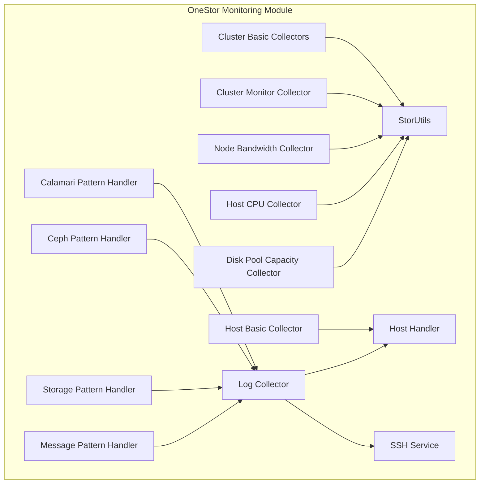

**Diagram sources**
- [StorClusterBasicCollector.java:33-76](file://watcher-onestor/src/main/java/com/virtual/cloud/om/onestor/service/clusterBasic/StorClusterBasicCollector.java#L33-L76)
- [StorClusterMonitorCollector.java:32-77](file://watcher-onestor/src/main/java/com/virtual/cloud/om/onestor/service/clusterBasic/StorClusterMonitorCollector.java#L32-L77)
- [StorHostBasicCollector.java:33-173](file://watcher-onestor/src/main/java/com/virtual/cloud/om/onestor/service/report/basic/StorHostBasicCollector.java#L33-L173)
- [NodeBandwidthMonitorCollector.java:35-92](file://watcher-onestor/src/main/java/com/virtual/cloud/om/onestor/service/report/monitor/node/NodeBandwidthMonitorCollector.java#L35-L92)
- [HostCpuUsageMonitorCollector.java:35-79](file://watcher-onestor/src/main/java/com/virtual/cloud/om/onestor/service/report/monitor/host/HostCpuUsageMonitorCollector.java#L35-L79)
- [DiskPoolCapacityCollector.java:36-91](file://watcher-onestor/src/main/java/com/virtual/cloud/om/onestor/service/report/monitor/diskpool/DiskPoolCapacityCollector.java#L36-L91)
- [OnestorLogCollector.java:26-92](file://watcher-onestor/src/main/java/com/virtual/cloud/om/onestor/service/log/OnestorLogCollector.java#L26-L92)
- [OnestorCalamariPatternHandler.java:17-57](file://watcher-onestor/src/main/java/com/virtual/cloud/om/onestor/service/OnestorCalamariPatternHandler.java#L17-L57)
- [OnestorCephPatternHandler.java:15-51](file://watcher-onestor/src/main/java/com/virtual/cloud/om/onestor/service/OnestorCephPatternHandler.java#L15-L51)
- [OnestorStoragePatternHandler.java:15-51](file://watcher-onestor/src/main/java/com/virtual/cloud/om/onestor/service/OnestorStoragePatternHandler.java#L15-L51)
- [OnestorMessagePatternHandler.java:16-54](file://watcher-onestor/src/main/java/com/virtual/cloud/om/onestor/service/OnestorMessagePatternHandler.java#L16-L54)
- [OnestorSSHService.java:16-36](file://watcher-onestor/src/main/java/com/virtual/cloud/om/onestor/service/ssh/OnestorSSHService.java#L16-L36)
- [OnestorHostHandler.java:29-71](file://watcher-onestor/src/main/java/com/virtual/cloud/om/onestor/service/OnestorHostHandler.java#L29-L71)
- [StorUtils.java:27-56](file://watcher-onestor/src/main/java/com/virtual/cloud/om/onestor/service/clusterBasic/StorUtils.java#L27-L56)

**Section sources**
- [StorClusterBasicCollector.java:33-76](file://watcher-onestor/src/main/java/com/virtual/cloud/om/onestor/service/clusterBasic/StorClusterBasicCollector.java#L33-L76)
- [StorClusterMonitorCollector.java:32-77](file://watcher-onestor/src/main/java/com/virtual/cloud/om/onestor/service/clusterBasic/StorClusterMonitorCollector.java#L32-L77)
- [StorHostBasicCollector.java:33-173](file://watcher-onestor/src/main/java/com/virtual/cloud/om/onestor/service/report/basic/StorHostBasicCollector.java#L33-L173)
- [NodeBandwidthMonitorCollector.java:35-92](file://watcher-onestor/src/main/java/com/virtual/cloud/om/onestor/service/report/monitor/node/NodeBandwidthMonitorCollector.java#L35-L92)
- [HostCpuUsageMonitorCollector.java:35-79](file://watcher-onestor/src/main/java/com/virtual/cloud/om/onestor/service/report/monitor/host/HostCpuUsageMonitorCollector.java#L35-L79)
- [DiskPoolCapacityCollector.java:36-91](file://watcher-onestor/src/main/java/com/virtual/cloud/om/onestor/service/report/monitor/diskpool/DiskPoolCapacityCollector.java#L36-L91)
- [OnestorLogCollector.java:26-92](file://watcher-onestor/src/main/java/com/virtual/cloud/om/onestor/service/log/OnestorLogCollector.java#L26-L92)
- [OnestorCalamariPatternHandler.java:17-57](file://watcher-onestor/src/main/java/com/virtual/cloud/om/onestor/service/OnestorCalamariPatternHandler.java#L17-L57)
- [OnestorCephPatternHandler.java:15-51](file://watcher-onestor/src/main/java/com/virtual/cloud/om/onestor/service/OnestorCephPatternHandler.java#L15-L51)
- [OnestorStoragePatternHandler.java:15-51](file://watcher-onestor/src/main/java/com/virtual/cloud/om/onestor/service/OnestorStoragePatternHandler.java#L15-L51)
- [OnestorMessagePatternHandler.java:16-54](file://watcher-onestor/src/main/java/com/virtual/cloud/om/onestor/service/OnestorMessagePatternHandler.java#L16-L54)
- [OnestorSSHService.java:16-36](file://watcher-onestor/src/main/java/com/virtual/cloud/om/onestor/service/ssh/OnestorSSHService.java#L16-L36)
- [OnestorHostHandler.java:29-71](file://watcher-onestor/src/main/java/com/virtual/cloud/om/onestor/service/OnestorHostHandler.java#L29-L71)
- [StorUtils.java:27-56](file://watcher-onestor/src/main/java/com/virtual/cloud/om/onestor/service/clusterBasic/StorUtils.java#L27-L56)

## Core Components
- Cluster-level collectors:
  - Basic cluster info and update time
  - Cluster monitor counts for warning, critical, and ok states
- Host-level collectors:
  - Host roles, IP addresses, CPU, memory, disk status, and capacity
- Node-level collectors:
  - Bandwidth metrics for storage read/write/recover and filesystem read/write across node pools
- Disk pool collectors:
  - Capacity total and used per disk pool
- Log collection and parsing:
  - Batch log collection from OneStor REST API with progress polling and file download
  - Pattern handlers for Calamari, Ceph, Storage, and Message logs
- SSH and host discovery:
  - SSH service stub for OneStor resource type
  - Host discovery via REST API returning host endpoints and metadata
- Utilities:
  - Cluster ID retrieval and caching of cluster name and update time
  - Common monitor data extraction and target formatting helpers

**Section sources**
- [StorClusterBasicCollector.java:33-76](file://watcher-onestor/src/main/java/com/virtual/cloud/om/onestor/service/clusterBasic/StorClusterBasicCollector.java#L33-L76)
- [StorClusterMonitorCollector.java:32-77](file://watcher-onestor/src/main/java/com/virtual/cloud/om/onestor/service/clusterBasic/StorClusterMonitorCollector.java#L32-L77)
- [StorHostBasicCollector.java:33-173](file://watcher-onestor/src/main/java/com/virtual/cloud/om/onestor/service/report/basic/StorHostBasicCollector.java#L33-L173)
- [NodeBandwidthMonitorCollector.java:35-92](file://watcher-onestor/src/main/java/com/virtual/cloud/om/onestor/service/report/monitor/node/NodeBandwidthMonitorCollector.java#L35-L92)
- [DiskPoolCapacityCollector.java:36-91](file://watcher-onestor/src/main/java/com/virtual/cloud/om/onestor/service/report/monitor/diskpool/DiskPoolCapacityCollector.java#L36-L91)
- [OnestorLogCollector.java:26-92](file://watcher-onestor/src/main/java/com/virtual/cloud/om/onestor/service/log/OnestorLogCollector.java#L26-L92)
- [OnestorSSHService.java:16-36](file://watcher-onestor/src/main/java/com/virtual/cloud/om/onestor/service/ssh/OnestorSSHService.java#L16-L36)
- [OnestorHostHandler.java:29-71](file://watcher-onestor/src/main/java/com/virtual/cloud/om/onestor/service/OnestorHostHandler.java#L29-L71)
- [StorUtils.java:27-56](file://watcher-onestor/src/main/java/com/virtual/cloud/om/onestor/service/clusterBasic/StorUtils.java#L27-L56)
- [IOnestorMonitorCollector.java:16-53](file://watcher-onestor/src/main/java/com/virtual/cloud/om/onestor/service/report/monitor/IOnestorMonitorCollector.java#L16-L53)

## Architecture Overview
The monitoring module integrates with OneStor REST APIs to fetch cluster identifiers, host lists, and metrics. It parses logs using dedicated pattern handlers and aggregates metrics per hierarchy: cluster → node pool → disk pool → host → volume. SSH connectivity is supported for the OneStor resource type, and host discovery is performed via REST calls.

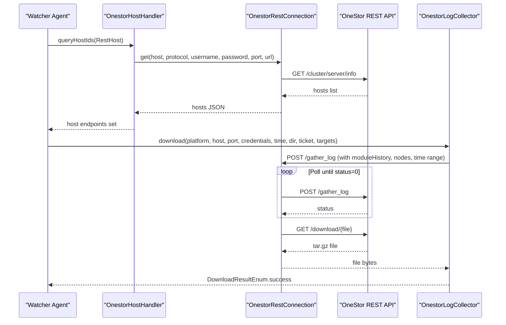

**Diagram sources**
- [OnestorHostHandler.java:34-70](file://watcher-onestor/src/main/java/com/virtual/cloud/om/onestor/service/OnestorHostHandler.java#L34-L70)
- [OnestorLogCollector.java:32-85](file://watcher-onestor/src/main/java/com/virtual/cloud/om/onestor/service/log/OnestorLogCollector.java#L32-L85)

**Section sources**
- [OnestorHostHandler.java:34-70](file://watcher-onestor/src/main/java/com/virtual/cloud/om/onestor/service/OnestorHostHandler.java#L34-L70)
- [OnestorLogCollector.java:32-85](file://watcher-onestor/src/main/java/com/virtual/cloud/om/onestor/service/log/OnestorLogCollector.java#L32-L85)

## Detailed Component Analysis

### Cluster-Level Monitoring
- Cluster basic info collector retrieves cluster identifier and metadata, then constructs a JSON payload with cluster name, client name, and update time.
- Cluster monitor collector fetches monitor health counts (warning, critical, ok) and packages them into a structured DTO.

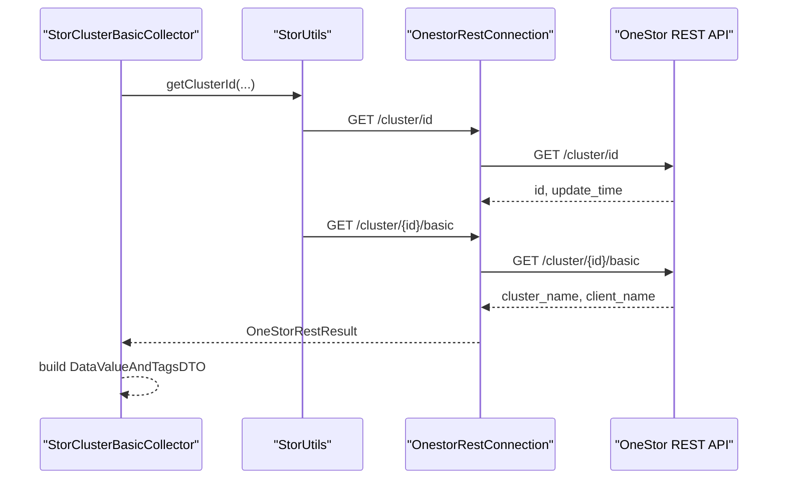

**Diagram sources**
- [StorClusterBasicCollector.java:38-64](file://watcher-onestor/src/main/java/com/virtual/cloud/om/onestor/service/clusterBasic/StorClusterBasicCollector.java#L38-L64)
- [StorUtils.java:31-54](file://watcher-onestor/src/main/java/com/virtual/cloud/om/onestor/service/clusterBasic/StorUtils.java#L31-L54)

**Section sources**
- [StorClusterBasicCollector.java:38-64](file://watcher-onestor/src/main/java/com/virtual/cloud/om/onestor/service/clusterBasic/StorClusterBasicCollector.java#L38-L64)
- [StorClusterMonitorCollector.java:38-65](file://watcher-onestor/src/main/java/com/virtual/cloud/om/onestor/service/clusterBasic/StorClusterMonitorCollector.java#L38-L65)
- [StorUtils.java:31-54](file://watcher-onestor/src/main/java/com/virtual/cloud/om/onestor/service/clusterBasic/StorUtils.java#L31-L54)

### Host-Level Statistics
- Host basic collector consolidates role info, storage, monitor, NAS, and MDS details into a unified report DTO per host, including CPU, memory, disk status, and capacity.

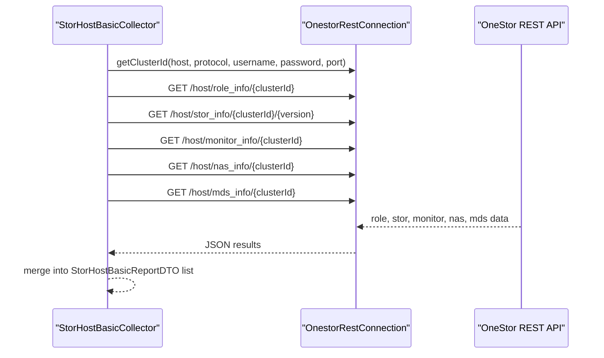

**Diagram sources**
- [StorHostBasicCollector.java:36-81](file://watcher-onestor/src/main/java/com/virtual/cloud/om/onestor/service/report/basic/StorHostBasicCollector.java#L36-L81)

**Section sources**
- [StorHostBasicCollector.java:36-81](file://watcher-onestor/src/main/java/com/virtual/cloud/om/onestor/service/report/basic/StorHostBasicCollector.java#L36-L81)

### Node-Level Monitoring
- Node bandwidth collector enumerates node pools, builds monitor targets for read/write/recover and filesystem bandwidth, queries metrics, and returns a structured report with timestamps.

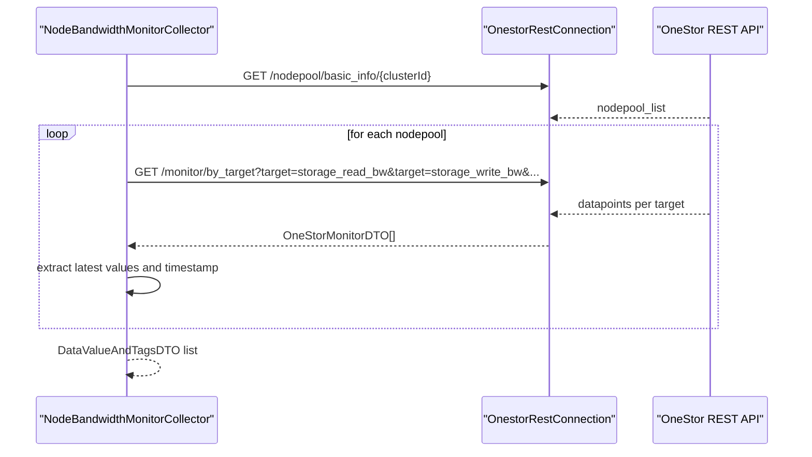

**Diagram sources**
- [NodeBandwidthMonitorCollector.java:38-78](file://watcher-onestor/src/main/java/com/virtual/cloud/om/onestor/service/report/monitor/node/NodeBandwidthMonitorCollector.java#L38-L78)
- [IOnestorMonitorCollector.java:19-52](file://watcher-onestor/src/main/java/com/virtual/cloud/om/onestor/service/report/monitor/IOnestorMonitorCollector.java#L19-L52)

**Section sources**
- [NodeBandwidthMonitorCollector.java:38-78](file://watcher-onestor/src/main/java/com/virtual/cloud/om/onestor/service/report/monitor/node/NodeBandwidthMonitorCollector.java#L38-L78)
- [IOnestorMonitorCollector.java:19-52](file://watcher-onestor/src/main/java/com/virtual/cloud/om/onestor/service/report/monitor/IOnestorMonitorCollector.java#L19-L52)

### Host CPU Usage Monitoring
- Host CPU collector fetches host role info and queries CPU usage per host, returning a report DTO with the latest timestamp.

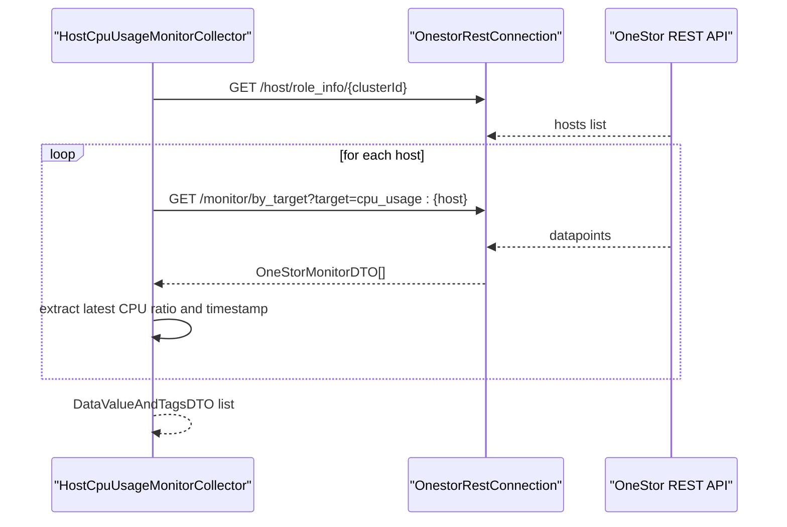

**Diagram sources**
- [HostCpuUsageMonitorCollector.java:38-66](file://watcher-onestor/src/main/java/com/virtual/cloud/om/onestor/service/report/monitor/host/HostCpuUsageMonitorCollector.java#L38-L66)
- [IOnestorMonitorCollector.java:19-52](file://watcher-onestor/src/main/java/com/virtual/cloud/om/onestor/service/report/monitor/IOnestorMonitorCollector.java#L19-L52)

**Section sources**
- [HostCpuUsageMonitorCollector.java:38-66](file://watcher-onestor/src/main/java/com/virtual/cloud/om/onestor/service/report/monitor/host/HostCpuUsageMonitorCollector.java#L38-L66)
- [IOnestorMonitorCollector.java:19-52](file://watcher-onestor/src/main/java/com/virtual/cloud/om/onestor/service/report/monitor/IOnestorMonitorCollector.java#L19-L52)

### Disk Pool Capacity Monitoring
- Disk pool capacity collector enumerates node pools and disk pools, builds targets for total and used capacity, queries metrics, and returns a structured report.

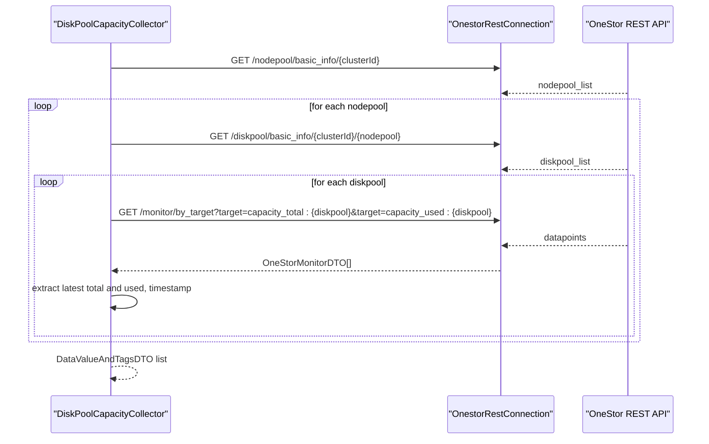

**Diagram sources**
- [DiskPoolCapacityCollector.java:38-78](file://watcher-onestor/src/main/java/com/virtual/cloud/om/onestor/service/report/monitor/diskpool/DiskPoolCapacityCollector.java#L38-L78)
- [IOnestorMonitorCollector.java:19-52](file://watcher-onestor/src/main/java/com/virtual/cloud/om/onestor/service/report/monitor/IOnestorMonitorCollector.java#L19-L52)

**Section sources**
- [DiskPoolCapacityCollector.java:38-78](file://watcher-onestor/src/main/java/com/virtual/cloud/om/onestor/service/report/monitor/diskpool/DiskPoolCapacityCollector.java#L38-L78)
- [IOnestorMonitorCollector.java:19-52](file://watcher-onestor/src/main/java/com/virtual/cloud/om/onestor/service/report/monitor/IOnestorMonitorCollector.java#L19-L52)

### Log Collection and Parsing
- Log collector posts a gather request with module history, node list, and time window, polls for completion, and downloads the resulting archive.
- Pattern handlers parse Calamari, Ceph, Storage, and Message logs into standardized LogLine DTOs with timestamps and extracted fields.

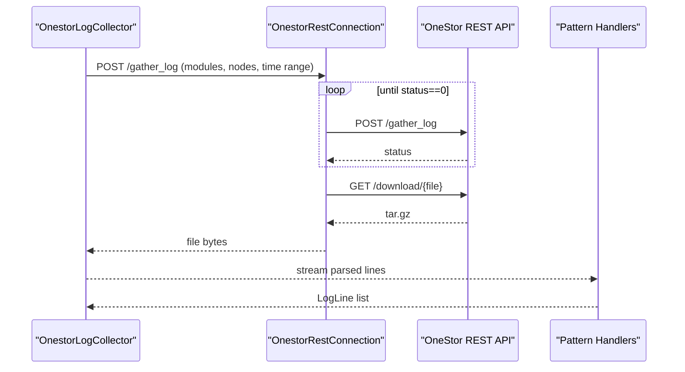

**Diagram sources**
- [OnestorLogCollector.java:32-85](file://watcher-onestor/src/main/java/com/virtual/cloud/om/onestor/service/log/OnestorLogCollector.java#L32-L85)
- [OnestorCalamariPatternHandler.java:24-50](file://watcher-onestor/src/main/java/com/virtual/cloud/om/onestor/service/OnestorCalamariPatternHandler.java#L24-L50)
- [OnestorCephPatternHandler.java:22-44](file://watcher-onestor/src/main/java/com/virtual/cloud/om/onestor/service/OnestorCephPatternHandler.java#L22-L44)
- [OnestorStoragePatternHandler.java:22-44](file://watcher-onestor/src/main/java/com/virtual/cloud/om/onestor/service/OnestorStoragePatternHandler.java#L22-L44)
- [OnestorMessagePatternHandler.java:23-47](file://watcher-onestor/src/main/java/com/virtual/cloud/om/onestor/service/OnestorMessagePatternHandler.java#L23-L47)

**Section sources**
- [OnestorLogCollector.java:32-85](file://watcher-onestor/src/main/java/com/virtual/cloud/om/onestor/service/log/OnestorLogCollector.java#L32-L85)
- [OnestorCalamariPatternHandler.java:24-50](file://watcher-onestor/src/main/java/com/virtual/cloud/om/onestor/service/OnestorCalamariPatternHandler.java#L24-L50)
- [OnestorCephPatternHandler.java:22-44](file://watcher-onestor/src/main/java/com/virtual/cloud/om/onestor/service/OnestorCephPatternHandler.java#L22-L44)
- [OnestorStoragePatternHandler.java:22-44](file://watcher-onestor/src/main/java/com/virtual/cloud/om/onestor/service/OnestorStoragePatternHandler.java#L22-L44)
- [OnestorMessagePatternHandler.java:23-47](file://watcher-onestor/src/main/java/com/virtual/cloud/om/onestor/service/OnestorMessagePatternHandler.java#L23-L47)

### SSH Connectivity Management and Host Discovery
- SSH service returns positive checks for OneStor resource type and exposes the resource type constant.
- Host handler resolves host endpoints and metadata from the OneStor server info API and constructs SSHHost instances.

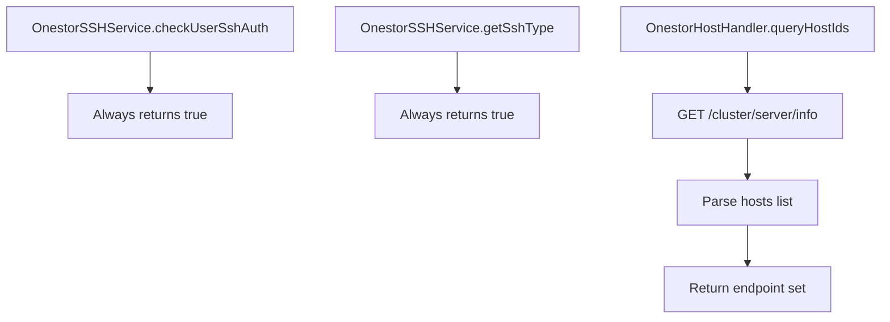

**Diagram sources**
- [OnestorSSHService.java:18-35](file://watcher-onestor/src/main/java/com/virtual/cloud/om/onestor/service/ssh/OnestorSSHService.java#L18-L35)
- [OnestorHostHandler.java:45-51](file://watcher-onestor/src/main/java/com/virtual/cloud/om/onestor/service/OnestorHostHandler.java#L45-L51)

**Section sources**
- [OnestorSSHService.java:18-35](file://watcher-onestor/src/main/java/com/virtual/cloud/om/onestor/service/ssh/OnestorSSHService.java#L18-L35)
- [OnestorHostHandler.java:45-51](file://watcher-onestor/src/main/java/com/virtual/cloud/om/onestor/service/OnestorHostHandler.java#L45-L51)

### Integration with OneStor REST APIs
- Cluster ID retrieval and basic info are accessed via dedicated URIs.
- Host discovery and role info are fetched from cluster-scoped endpoints.
- Monitor data is queried using a flexible target parameter format.
- Log gathering uses a batch endpoint with progress polling and a download endpoint for archives.

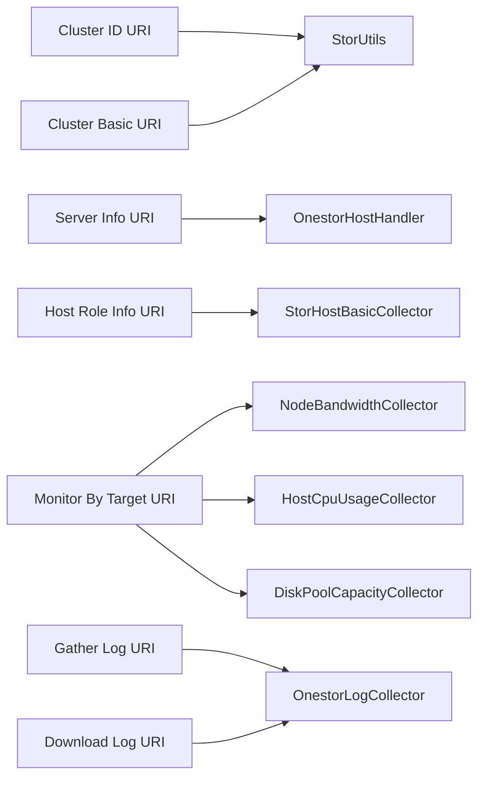

**Diagram sources**
- [StorUtils.java:31-54](file://watcher-onestor/src/main/java/com/virtual/cloud/om/onestor/service/clusterBasic/StorUtils.java#L31-L54)
- [OnestorHostHandler.java:60-68](file://watcher-onestor/src/main/java/com/virtual/cloud/om/onestor/service/OnestorHostHandler.java#L60-L68)
- [StorHostBasicCollector.java:42-72](file://watcher-onestor/src/main/java/com/virtual/cloud/om/onestor/service/report/basic/StorHostBasicCollector.java#L42-L72)
- [NodeBandwidthMonitorCollector.java:46-58](file://watcher-onestor/src/main/java/com/virtual/cloud/om/onestor/service/report/monitor/node/NodeBandwidthMonitorCollector.java#L46-L58)
- [HostCpuUsageMonitorCollector.java:47-51](file://watcher-onestor/src/main/java/com/virtual/cloud/om/onestor/service/report/monitor/host/HostCpuUsageMonitorCollector.java#L47-L51)
- [DiskPoolCapacityCollector.java:57-63](file://watcher-onestor/src/main/java/com/virtual/cloud/om/onestor/service/report/monitor/diskpool/DiskPoolCapacityCollector.java#L57-L63)
- [OnestorLogCollector.java:50-77](file://watcher-onestor/src/main/java/com/virtual/cloud/om/onestor/service/log/OnestorLogCollector.java#L50-L77)

**Section sources**
- [StorUtils.java:31-54](file://watcher-onestor/src/main/java/com/virtual/cloud/om/onestor/service/clusterBasic/StorUtils.java#L31-L54)
- [OnestorHostHandler.java:60-68](file://watcher-onestor/src/main/java/com/virtual/cloud/om/onestor/service/OnestorHostHandler.java#L60-L68)
- [StorHostBasicCollector.java:42-72](file://watcher-onestor/src/main/java/com/virtual/cloud/om/onestor/service/report/basic/StorHostBasicCollector.java#L42-L72)
- [NodeBandwidthMonitorCollector.java:46-58](file://watcher-onestor/src/main/java/com/virtual/cloud/om/onestor/service/report/monitor/node/NodeBandwidthMonitorCollector.java#L46-L58)
- [HostCpuUsageMonitorCollector.java:47-51](file://watcher-onestor/src/main/java/com/virtual/cloud/om/onestor/service/report/monitor/host/HostCpuUsageMonitorCollector.java#L47-L51)
- [DiskPoolCapacityCollector.java:57-63](file://watcher-onestor/src/main/java/com/virtual/cloud/om/onestor/service/report/monitor/diskpool/DiskPoolCapacityCollector.java#L57-L63)
- [OnestorLogCollector.java:50-77](file://watcher-onestor/src/main/java/com/virtual/cloud/om/onestor/service/log/OnestorLogCollector.java#L50-L77)

## Dependency Analysis
- Collectors depend on OnestorRestConnection for REST calls and on DTOs from the SDK for data modeling.
- Host discovery depends on OnestorHostHandler and OnestorRestConnection.
- Log collection depends on OnestorRestConnection and ResourceApi for target resolution.
- Pattern handlers depend on SDK LogLine DTO and time utilities.
- IOnestorMonitorCollector defines shared helpers for data extraction and target formatting.

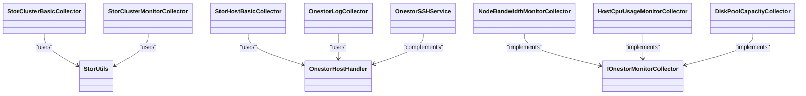

**Diagram sources**
- [StorClusterBasicCollector.java:35-37](file://watcher-onestor/src/main/java/com/virtual/cloud/om/onestor/service/clusterBasic/StorClusterBasicCollector.java#L35-L37)
- [StorClusterMonitorCollector.java:34-36](file://watcher-onestor/src/main/java/com/virtual/cloud/om/onestor/service/clusterBasic/StorClusterMonitorCollector.java#L34-L36)
- [StorHostBasicCollector.java](file://watcher-onestor/src/main/java/com/virtual/cloud/om/onestor/service/report/basic/StorHostBasicCollector.java#L34)
- [NodeBandwidthMonitorCollector.java](file://watcher-onestor/src/main/java/com/virtual/cloud/om/onestor/service/report/monitor/node/NodeBandwidthMonitorCollector.java#L35)
- [HostCpuUsageMonitorCollector.java](file://watcher-onestor/src/main/java/com/virtual/cloud/om/onestor/service/report/monitor/host/HostCpuUsageMonitorCollector.java#L35)
- [DiskPoolCapacityCollector.java](file://watcher-onestor/src/main/java/com/virtual/cloud/om/onestor/service/report/monitor/diskpool/DiskPoolCapacityCollector.java#L36)
- [OnestorLogCollector.java](file://watcher-onestor/src/main/java/com/virtual/cloud/om/onestor/service/log/OnestorLogCollector.java#L29)
- [OnestorHostHandler.java](file://watcher-onestor/src/main/java/com/virtual/cloud/om/onestor/service/OnestorHostHandler.java#L32)
- [OnestorSSHService.java](file://watcher-onestor/src/main/java/com/virtual/cloud/om/onestor/service/ssh/OnestorSSHService.java#L16)
- [IOnestorMonitorCollector.java](file://watcher-onestor/src/main/java/com/virtual/cloud/om/onestor/service/report/monitor/IOnestorMonitorCollector.java#L16)

**Section sources**
- [StorClusterBasicCollector.java:35-37](file://watcher-onestor/src/main/java/com/virtual/cloud/om/onestor/service/clusterBasic/StorClusterBasicCollector.java#L35-L37)
- [StorClusterMonitorCollector.java:34-36](file://watcher-onestor/src/main/java/com/virtual/cloud/om/onestor/service/clusterBasic/StorClusterMonitorCollector.java#L34-L36)
- [StorHostBasicCollector.java](file://watcher-onestor/src/main/java/com/virtual/cloud/om/onestor/service/report/basic/StorHostBasicCollector.java#L34)
- [NodeBandwidthMonitorCollector.java](file://watcher-onestor/src/main/java/com/virtual/cloud/om/onestor/service/report/monitor/node/NodeBandwidthMonitorCollector.java#L35)
- [HostCpuUsageMonitorCollector.java](file://watcher-onestor/src/main/java/com/virtual/cloud/om/onestor/service/report/monitor/host/HostCpuUsageMonitorCollector.java#L35)
- [DiskPoolCapacityCollector.java](file://watcher-onestor/src/main/java/com/virtual/cloud/om/onestor/service/report/monitor/diskpool/DiskPoolCapacityCollector.java#L36)
- [OnestorLogCollector.java](file://watcher-onestor/src/main/java/com/virtual/cloud/om/onestor/service/log/OnestorLogCollector.java#L29)
- [OnestorHostHandler.java](file://watcher-onestor/src/main/java/com/virtual/cloud/om/onestor/service/OnestorHostHandler.java#L32)
- [OnestorSSHService.java](file://watcher-onestor/src/main/java/com/virtual/cloud/om/onestor/service/ssh/OnestorSSHService.java#L16)
- [IOnestorMonitorCollector.java](file://watcher-onestor/src/main/java/com/virtual/cloud/om/onestor/service/report/monitor/IOnestorMonitorCollector.java#L16)

## Performance Considerations
- Parallelization: Node-level and disk pool collectors stream-process lists of targets to improve throughput.
- Data freshness: Latest datapoint selection ensures reports reflect near-real-time conditions.
- Batch log collection: Progress polling avoids busy-waiting and reduces overhead.
- Target construction: Centralized target formatting minimizes repeated string operations.

[No sources needed since this section provides general guidance]

## Troubleshooting Guide
- Cluster ID retrieval failures: Verify REST connectivity and cluster URI availability; fallback to empty DTO prevents crashes.
- Log collection stuck: Ensure gather task completes (status 0) before attempting download; handle existing task conflicts gracefully.
- Host discovery empty: Validate server info endpoint and credentials; return empty set on exceptions.
- SSH auth stub: OneStor SSH checks currently return positive; adjust implementation if real checks are required.

**Section sources**
- [StorUtils.java:31-54](file://watcher-onestor/src/main/java/com/virtual/cloud/om/onestor/service/clusterBasic/StorUtils.java#L31-L54)
- [OnestorLogCollector.java:53-71](file://watcher-onestor/src/main/java/com/virtual/cloud/om/onestor/service/log/OnestorLogCollector.java#L53-L71)
- [OnestorHostHandler.java:45-51](file://watcher-onestor/src/main/java/com/virtual/cloud/om/onestor/service/OnestorHostHandler.java#L45-L51)
- [OnestorSSHService.java:18-35](file://watcher-onestor/src/main/java/com/virtual/cloud/om/onestor/service/ssh/OnestorSSHService.java#L18-L35)

## Conclusion
The OneStor monitoring module provides a comprehensive, hierarchical view of storage infrastructure through cluster, node pool, disk pool, host, and volume telemetry. It leverages REST APIs for discovery and metrics, supports robust log collection with parsing, and offers extensible interfaces for future enhancements. The design emphasizes modularity, parallel processing, and clear separation of concerns across collectors, utilities, and handlers.