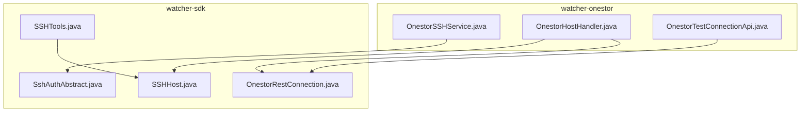
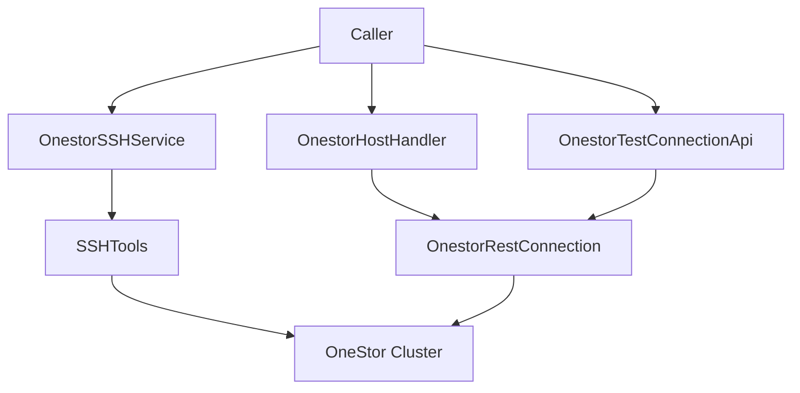
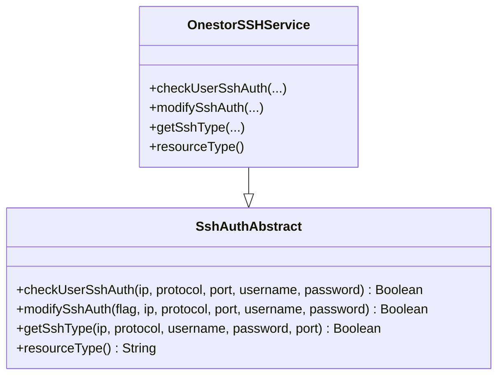
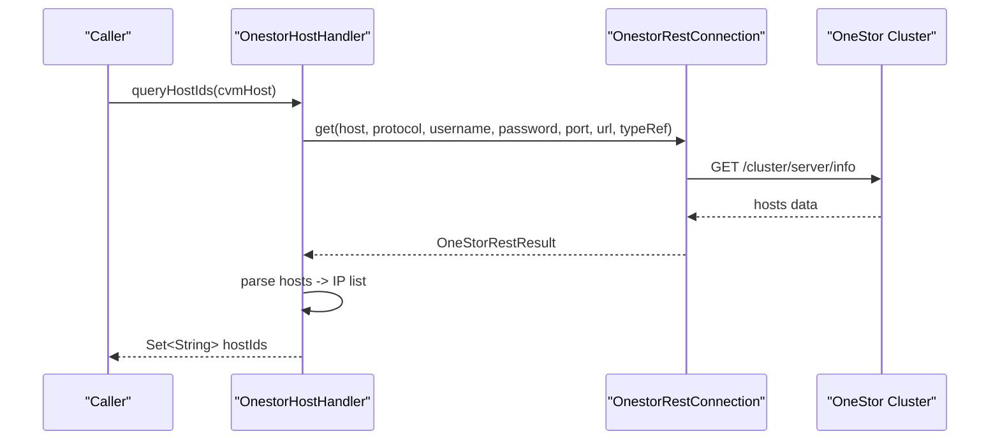
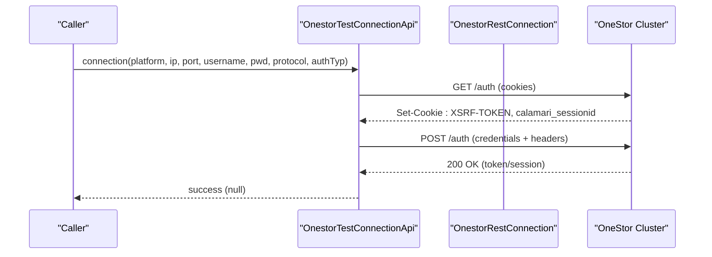
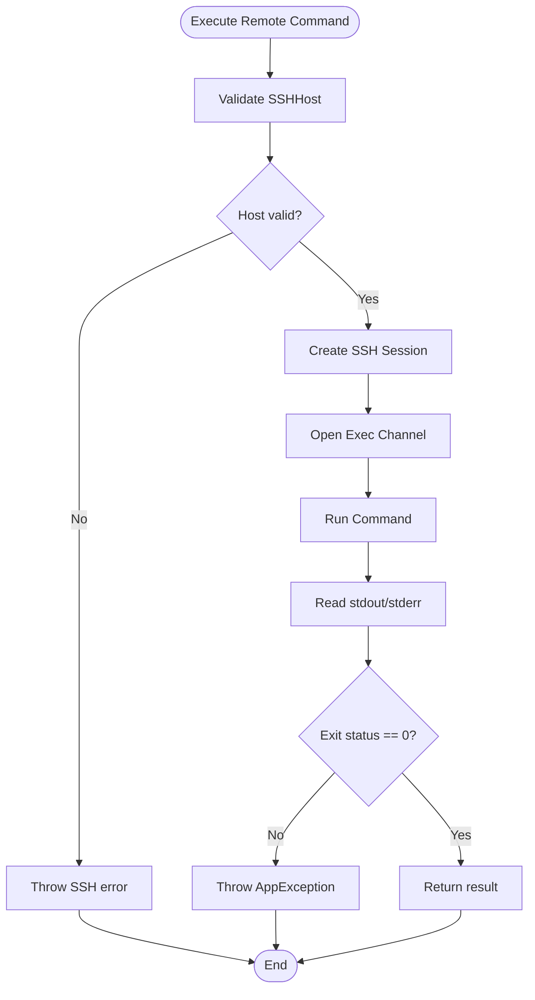
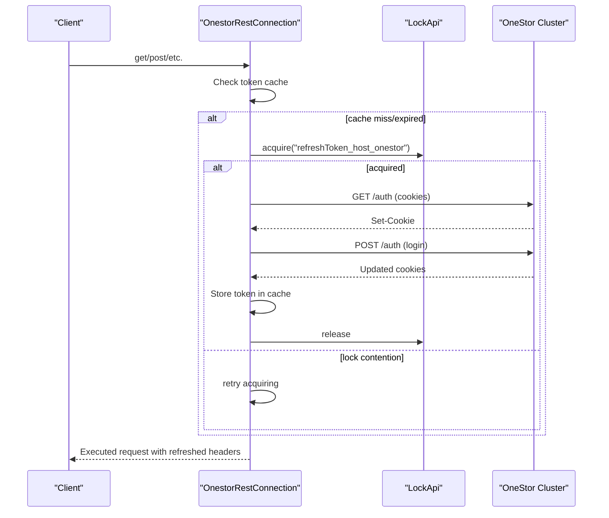
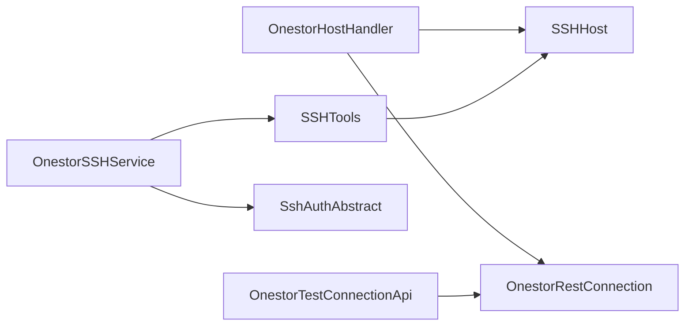

# SSH Connectivity & Host Management

<cite>
**Referenced Files in This Document**
- [OnestorSSHService.java](file://watcher-onestor/src/main/java/com/virtual/cloud/om/onestor/service/ssh/OnestorSSHService.java)
- [OnestorHostHandler.java](file://watcher-onestor/src/main/java/com/virtual/cloud/om/onestor/service/OnestorHostHandler.java)
- [OnestorTestConnectionApi.java](file://watcher-onestor/src/main/java/com/virtual/cloud/om/onestor/service/OnestorTestConnectionApi.java)
- [SshAuthAbstract.java](file://watcher-sdk/src/main/java/com/virtual/cloud/om/sdk/api/SshAuthAbstract.java)
- [SSHHost.java](file://watcher-sdk/src/main/java/com/virtual/cloud/om/sdk/dto/SSHHost.java)
- [SSHTools.java](file://watcher-sdk/src/main/java/com/virtual/cloud/om/sdk/utils/SSHTools.java)
- [OnestorRestConnection.java](file://watcher-sdk/src/main/java/com/virtual/cloud/om/sdk/config/token/onestor/OnestorRestConnection.java)
</cite>

## Table of Contents
1. [Introduction](#introduction)
2. [Project Structure](#project-structure)
3. [Core Components](#core-components)
4. [Architecture Overview](#architecture-overview)
5. [Detailed Component Analysis](#detailed-component-analysis)
6. [Dependency Analysis](#dependency-analysis)
7. [Performance Considerations](#performance-considerations)
8. [Troubleshooting Guide](#troubleshooting-guide)
9. [Conclusion](#conclusion)

## Introduction
This document explains the SSH connectivity and host interaction capabilities for OneStor within the ShowTime monitoring platform. It focuses on:
- Secure remote connections via SSH for host operations
- Host discovery and validation for OneStor clusters
- Authentication mechanisms for SSH and REST-based OneStor access
- Lifecycle management of hosts and connection pooling
- Connectivity validation and diagnostics
- SSH key management, timeouts, retries, and error recovery
- Security best practices and performance optimization for remote operations
- Integration with OneStor’s storage management infrastructure

## Project Structure
The OneStor SSH and host management features are implemented across two modules:
- watcher-onestor: OneStor-specific services for SSH, host discovery, and connectivity testing
- watcher-sdk: Shared SDK utilities for SSH operations, DTOs, REST token management, and abstract authentication interfaces

**Diagram sources**
- [OnestorSSHService.java:1-37](file://watcher-onestor/src/main/java/com/virtual/cloud/om/onestor/service/ssh/OnestorSSHService.java#L1-L37)
- [OnestorHostHandler.java:1-72](file://watcher-onestor/src/main/java/com/virtual/cloud/om/onestor/service/OnestorHostHandler.java#L1-L72)
- [OnestorTestConnectionApi.java:1-65](file://watcher-onestor/src/main/java/com/virtual/cloud/om/onestor/service/OnestorTestConnectionApi.java#L1-L65)
- [SshAuthAbstract.java:1-22](file://watcher-sdk/src/main/java/com/virtual/cloud/om/sdk/api/SshAuthAbstract.java#L1-L22)
- [SSHHost.java:1-163](file://watcher-sdk/src/main/java/com/virtual/cloud/om/sdk/dto/SSHHost.java#L1-L163)
- [SSHTools.java:1-471](file://watcher-sdk/src/main/java/com/virtual/cloud/om/sdk/utils/SSHTools.java#L1-L471)
- [OnestorRestConnection.java:1-413](file://watcher-sdk/src/main/java/com/virtual/cloud/om/sdk/config/token/onestor/OnestorRestConnection.java#L1-L413)

**Section sources**
- [OnestorSSHService.java:1-37](file://watcher-onestor/src/main/java/com/virtual/cloud/om/onestor/service/ssh/OnestorSSHService.java#L1-L37)
- [OnestorHostHandler.java:1-72](file://watcher-onestor/src/main/java/com/virtual/cloud/om/onestor/service/OnestorHostHandler.java#L1-L72)
- [OnestorTestConnectionApi.java:1-65](file://watcher-onestor/src/main/java/com/virtual/cloud/om/onestor/service/OnestorTestConnectionApi.java#L1-L65)
- [SshAuthAbstract.java:1-22](file://watcher-sdk/src/main/java/com/virtual/cloud/om/sdk/api/SshAuthAbstract.java#L1-L22)
- [SSHHost.java:1-163](file://watcher-sdk/src/main/java/com/virtual/cloud/om/sdk/dto/SSHHost.java#L1-L163)
- [SSHTools.java:1-471](file://watcher-sdk/src/main/java/com/virtual/cloud/om/sdk/utils/SSHTools.java#L1-L471)
- [OnestorRestConnection.java:1-413](file://watcher-sdk/src/main/java/com/virtual/cloud/om/sdk/config/token/onestor/OnestorRestConnection.java#L1-L413)

## Core Components
- OnestorSSHService: Extends the SDK’s SSH authentication abstraction to provide OneStor-specific behaviors for checking, modifying, and identifying SSH authentication types. It also declares the resource type for OneStor.
- OnestorHostHandler: Implements host discovery and lifecycle mapping for OneStor. It retrieves host information from the OneStor cluster, constructs SSHHost instances, and exposes host ID queries.
- OnestorTestConnectionApi: Provides connectivity validation by attempting to authenticate against OneStor’s login endpoint and returning a token-based result.
- SSHTools: Offers robust SSH operations including command execution, file copy, session creation, and timeout handling. It supports both password-based and key-based authentication flows.
- OnestorRestConnection: Manages REST authentication tokens for OneStor with caching, concurrency control, and automatic refresh on unauthorized errors. It centralizes HTTP interactions and headers for OneStor APIs.

**Section sources**
- [OnestorSSHService.java:13-36](file://watcher-onestor/src/main/java/com/virtual/cloud/om/onestor/service/ssh/OnestorSSHService.java#L13-L36)
- [OnestorHostHandler.java:28-71](file://watcher-onestor/src/main/java/com/virtual/cloud/om/onestor/service/OnestorHostHandler.java#L28-L71)
- [OnestorTestConnectionApi.java:31-64](file://watcher-onestor/src/main/java/com/virtual/cloud/om/onestor/service/OnestorTestConnectionApi.java#L31-L64)
- [SSHTools.java:24-471](file://watcher-sdk/src/main/java/com/virtual/cloud/om/sdk/utils/SSHTools.java#L24-L471)
- [OnestorRestConnection.java:50-136](file://watcher-sdk/src/main/java/com/virtual/cloud/om/sdk/config/token/onestor/OnestorRestConnection.java#L50-L136)

## Architecture Overview
The system integrates OneStor-specific services with SDK utilities to enable secure, authenticated, and efficient host interactions.

**Diagram sources**
- [OnestorSSHService.java:16-35](file://watcher-onestor/src/main/java/com/virtual/cloud/om/onestor/service/ssh/OnestorSSHService.java#L16-L35)
- [OnestorHostHandler.java:29-71](file://watcher-onestor/src/main/java/com/virtual/cloud/om/onestor/service/OnestorHostHandler.java#L29-L71)
- [OnestorTestConnectionApi.java:31-64](file://watcher-onestor/src/main/java/com/virtual/cloud/om/onestor/service/OnestorTestConnectionApi.java#L31-L64)
- [SSHTools.java:24-471](file://watcher-sdk/src/main/java/com/virtual/cloud/om/sdk/utils/SSHTools.java#L24-L471)
- [OnestorRestConnection.java:50-412](file://watcher-sdk/src/main/java/com/virtual/cloud/om/sdk/config/token/onestor/OnestorRestConnection.java#L50-L412)

## Detailed Component Analysis

### OnestorSSHService
- Purpose: Implements SSH authentication checks, modifications, and type detection tailored for OneStor resources.
- Behavior:
  - checkUserSshAuth: Validates SSH credentials for a given host.
  - modifySshAuth: Applies SSH authentication changes.
  - getSshType: Identifies the SSH authentication type.
  - resourceType: Returns the OneStor resource identifier.
- Integration: Inherits from SshAuthAbstract, ensuring consistent interface across platforms.

**Diagram sources**
- [SshAuthAbstract.java:11-21](file://watcher-sdk/src/main/java/com/virtual/cloud/om/sdk/api/SshAuthAbstract.java#L11-L21)
- [OnestorSSHService.java:16-35](file://watcher-onestor/src/main/java/com/virtual/cloud/om/onestor/service/ssh/OnestorSSHService.java#L16-L35)

**Section sources**
- [OnestorSSHService.java:16-35](file://watcher-onestor/src/main/java/com/virtual/cloud/om/onestor/service/ssh/OnestorSSHService.java#L16-L35)
- [SshAuthAbstract.java:11-21](file://watcher-sdk/src/main/java/com/virtual/cloud/om/sdk/api/SshAuthAbstract.java#L11-L21)

### OnestorHostHandler
- Purpose: Discovers OneStor hosts, maps endpoints to SSHHost configurations, and enumerates host identifiers.
- Key operations:
  - getHost: Builds an SSHHost for a given endpoint using cluster metadata.
  - queryHostIds: Retrieves all managed endpoints/IPs for a OneStor resource.
  - getOneStorHostInfoList: Calls the OneStor REST API to fetch host inventory and parses it into typed DTOs.
- Integration: Uses OnestorRestConnection for authenticated REST calls and SSHHost DTOs for standardized host representation.

**Diagram sources**
- [OnestorHostHandler.java:44-71](file://watcher-onestor/src/main/java/com/virtual/cloud/om/onestor/service/OnestorHostHandler.java#L44-L71)
- [OnestorRestConnection.java:143-229](file://watcher-sdk/src/main/java/com/virtual/cloud/om/sdk/config/token/onestor/OnestorRestConnection.java#L143-L229)

**Section sources**
- [OnestorHostHandler.java:34-71](file://watcher-onestor/src/main/java/com/virtual/cloud/om/onestor/service/OnestorHostHandler.java#L34-L71)
- [OnestorRestConnection.java:143-229](file://watcher-sdk/src/main/java/com/virtual/cloud/om/sdk/config/token/onestor/OnestorRestConnection.java#L143-L229)

### OnestorTestConnectionApi
- Purpose: Validates connectivity to OneStor by authenticating via the login endpoint and extracting session tokens.
- Workflow:
  - Issues a GET to the OneStor auth endpoint to retrieve CSRF and session cookies.
  - Constructs proper headers with XSRF token and session cookie.
  - Posts credentials to authenticate and validates HTTP response status.
- Integration: Uses OnestorRestConnection for token retrieval and RestTemplate for HTTP operations.

**Diagram sources**
- [OnestorTestConnectionApi.java:35-63](file://watcher-onestor/src/main/java/com/virtual/cloud/om/onestor/service/OnestorTestConnectionApi.java#L35-L63)
- [OnestorRestConnection.java:89-136](file://watcher-sdk/src/main/java/com/virtual/cloud/om/sdk/config/token/onestor/OnestorRestConnection.java#L89-L136)

**Section sources**
- [OnestorTestConnectionApi.java:35-63](file://watcher-onestor/src/main/java/com/virtual/cloud/om/onestor/service/OnestorTestConnectionApi.java#L35-L63)
- [OnestorRestConnection.java:89-136](file://watcher-sdk/src/main/java/com/virtual/cloud/om/sdk/config/token/onestor/OnestorRestConnection.java#L89-L136)

### SSHTools
- Purpose: Provides low-level SSH operations and utilities for secure remote host interactions.
- Capabilities:
  - Command execution with optional timeout and error propagation.
  - File copy operations to/from remote hosts.
  - Session creation with strict host key checking disabled for convenience.
  - Support for both password and key-based authentication.
- Error handling: Throws structured exceptions on command failure or non-zero exit status.

**Diagram sources**
- [SSHTools.java:169-264](file://watcher-sdk/src/main/java/com/virtual/cloud/om/sdk/utils/SSHTools.java#L169-L264)
- [SSHTools.java:372-389](file://watcher-sdk/src/main/java/com/virtual/cloud/om/sdk/utils/SSHTools.java#L372-L389)

**Section sources**
- [SSHTools.java:169-264](file://watcher-sdk/src/main/java/com/virtual/cloud/om/sdk/utils/SSHTools.java#L169-L264)
- [SSHTools.java:372-445](file://watcher-sdk/src/main/java/com/virtual/cloud/om/sdk/utils/SSHTools.java#L372-L445)

### OnestorRestConnection
- Purpose: Centralizes REST authentication and HTTP operations for OneStor with token caching and concurrency control.
- Features:
  - Token caching with memory-backed store and lock-based refresh to avoid thundering herds.
  - Automatic header construction including cookies and XSRF tokens.
  - Retry and refresh logic on unauthorized responses.
  - Convenience methods for GET/POST/PUT/DELETE/PATCH and file downloads.
- Error handling: Detects specific HTTP error conditions and triggers token refresh or propagates exceptions.

**Diagram sources**
- [OnestorRestConnection.java:65-136](file://watcher-sdk/src/main/java/com/virtual/cloud/om/sdk/config/token/onestor/OnestorRestConnection.java#L65-L136)
- [OnestorRestConnection.java:143-189](file://watcher-sdk/src/main/java/com/virtual/cloud/om/sdk/config/token/onestor/OnestorRestConnection.java#L143-L189)

**Section sources**
- [OnestorRestConnection.java:65-136](file://watcher-sdk/src/main/java/com/virtual/cloud/om/sdk/config/token/onestor/OnestorRestConnection.java#L65-L136)
- [OnestorRestConnection.java:143-189](file://watcher-sdk/src/main/java/com/virtual/cloud/om/sdk/config/token/onestor/OnestorRestConnection.java#L143-L189)

## Dependency Analysis
- OnestorHostHandler depends on OnestorRestConnection for authenticated REST calls and on SSHHost DTOs for host representation.
- OnestorTestConnectionApi depends on OnestorRestConnection for token retrieval and on RestTemplate for HTTP operations.
- OnestorSSHService depends on SshAuthAbstract for the SSH authentication contract and on SSHTools for underlying SSH operations.
- SSHTools encapsulates JSch and system command execution, providing a unified interface for remote operations.

**Diagram sources**
- [OnestorHostHandler.java:29-71](file://watcher-onestor/src/main/java/com/virtual/cloud/om/onestor/service/OnestorHostHandler.java#L29-L71)
- [OnestorTestConnectionApi.java:32-33](file://watcher-onestor/src/main/java/com/virtual/cloud/om/onestor/service/OnestorTestConnectionApi.java#L32-L33)
- [OnestorSSHService.java:16-35](file://watcher-onestor/src/main/java/com/virtual/cloud/om/onestor/service/ssh/OnestorSSHService.java#L16-L35)
- [SSHTools.java:24-471](file://watcher-sdk/src/main/java/com/virtual/cloud/om/sdk/utils/SSHTools.java#L24-L471)
- [SSHHost.java:14-163](file://watcher-sdk/src/main/java/com/virtual/cloud/om/sdk/dto/SSHHost.java#L14-L163)

**Section sources**
- [OnestorHostHandler.java:29-71](file://watcher-onestor/src/main/java/com/virtual/cloud/om/onestor/service/OnestorHostHandler.java#L29-L71)
- [OnestorTestConnectionApi.java:32-33](file://watcher-onestor/src/main/java/com/virtual/cloud/om/onestor/service/OnestorTestConnectionApi.java#L32-L33)
- [OnestorSSHService.java:16-35](file://watcher-onestor/src/main/java/com/virtual/cloud/om/onestor/service/ssh/OnestorSSHService.java#L16-L35)
- [SSHTools.java:24-471](file://watcher-sdk/src/main/java/com/virtual/cloud/om/sdk/utils/SSHTools.java#L24-L471)
- [SSHHost.java:14-163](file://watcher-sdk/src/main/java/com/virtual/cloud/om/sdk/dto/SSHHost.java#L14-L163)

## Performance Considerations
- Token caching: OnestorRestConnection caches tokens per host and uses distributed locks to prevent redundant refreshes, reducing latency and load on the OneStor API.
- Connection reuse: Prefer reusing sessions where possible; SSHTools creates sessions per operation but disconnects them afterward. For bulk operations, consider minimizing session churn.
- Timeout tuning: SSHTools supports configurable timeouts for long-running commands. Adjust timeouts according to workload characteristics.
- I/O buffering: SSHTools aggregates output streams and uses fixed buffer sizes to handle large outputs efficiently.
- Network efficiency: Batch REST calls where feasible and avoid repeated host discovery operations.

[No sources needed since this section provides general guidance]

## Troubleshooting Guide
Common issues and resolutions:
- Authentication failures:
  - Verify credentials and protocol/port configuration.
  - Ensure OneStor REST authentication succeeds before attempting SSH operations.
- SSH command failures:
  - Check exit status and error stream content returned by SSHTools.
  - Confirm StrictHostKeyChecking is acceptable for your environment; note that it is disabled in session creation.
- Token refresh errors:
  - On 401/403 responses, OnestorRestConnection clears the cache and retries with a refreshed token.
  - Confirm lock acquisition succeeds to avoid race conditions during token refresh.
- Connectivity validation:
  - Use OnestorTestConnectionApi to validate login and session establishment.
- Host discovery:
  - Confirm OnestorHostHandler receives a non-empty host list from the cluster API and that the requested endpoint matches a discovered host.

**Section sources**
- [OnestorRestConnection.java:153-189](file://watcher-sdk/src/main/java/com/virtual/cloud/om/sdk/config/token/onestor/OnestorRestConnection.java#L153-L189)
- [SSHTools.java:253-263](file://watcher-sdk/src/main/java/com/virtual/cloud/om/sdk/utils/SSHTools.java#L253-L263)
- [OnestorTestConnectionApi.java:54-57](file://watcher-onestor/src/main/java/com/virtual/cloud/om/onestor/service/OnestorTestConnectionApi.java#L54-L57)
- [OnestorHostHandler.java:46-52](file://watcher-onestor/src/main/java/com/virtual/cloud/om/onestor/service/OnestorHostHandler.java#L46-L52)

## Conclusion
The OneStor SSH connectivity stack combines OneStor-specific services with robust SDK utilities to deliver secure, authenticated, and efficient host interactions. OnestorHostHandler and OnestorTestConnectionApi provide discovery and validation, OnestorSSHService aligns SSH authentication with OneStor resources, and SSHTools and OnestorRestConnection offer reliable, timeout-aware, and resilient remote operations backed by token caching and concurrency controls.

[No sources needed since this section summarizes without analyzing specific files]