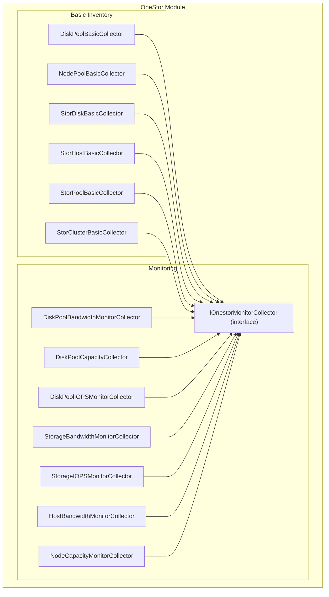
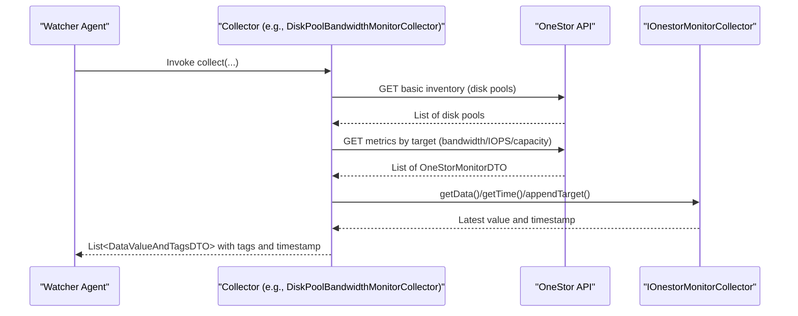
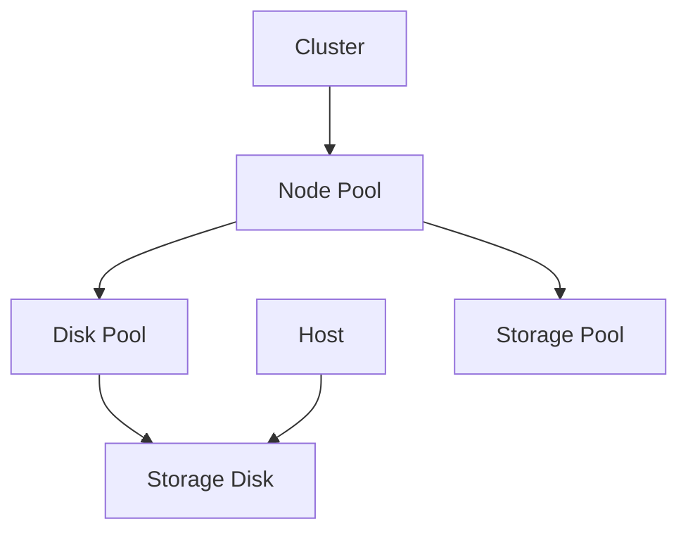
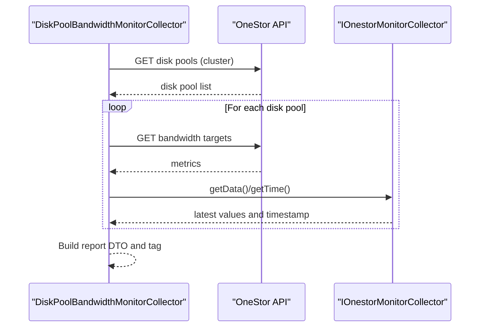
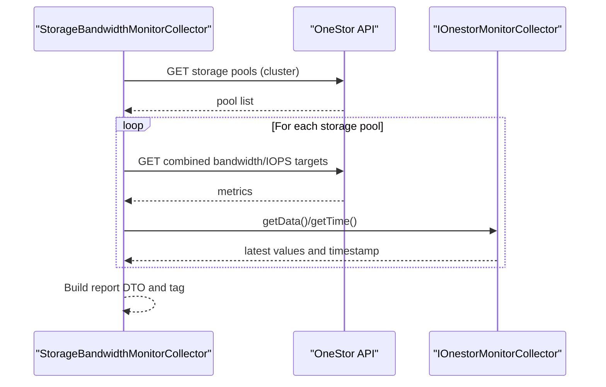
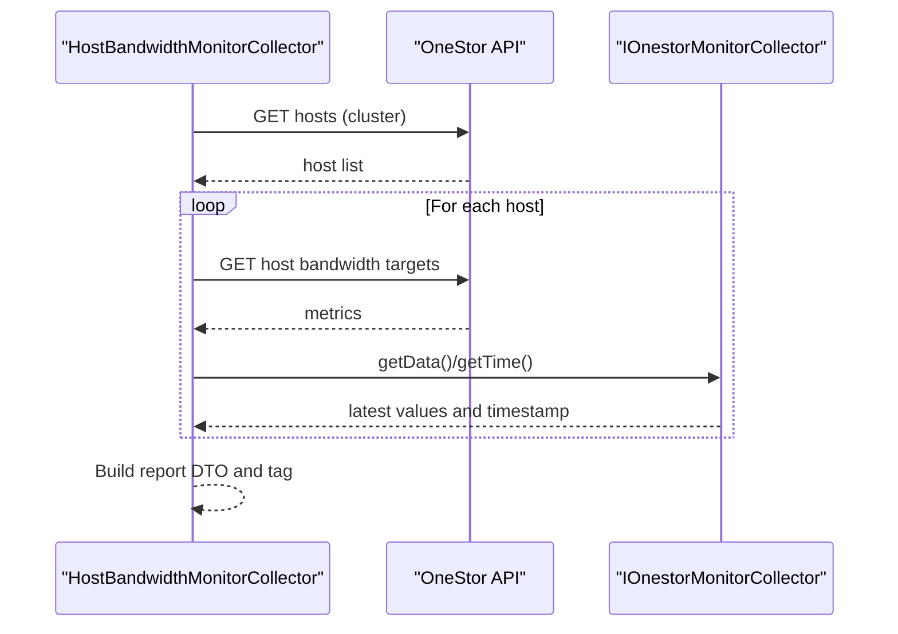
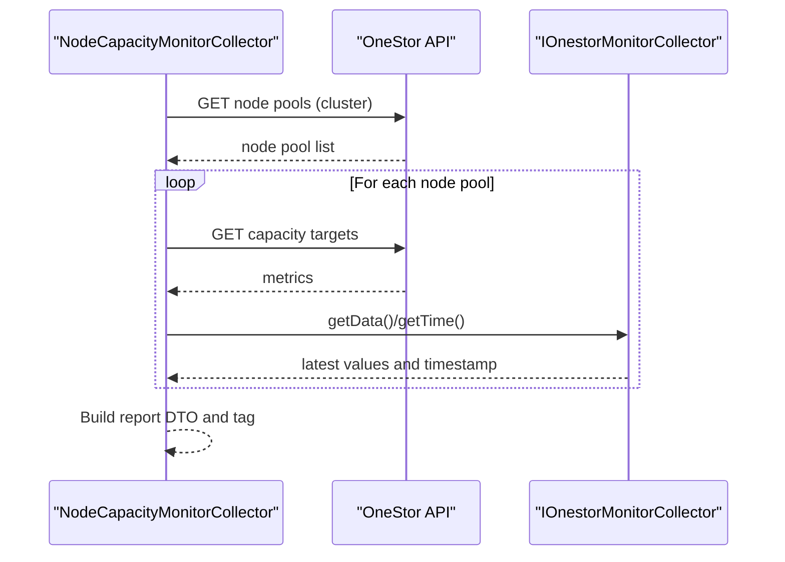
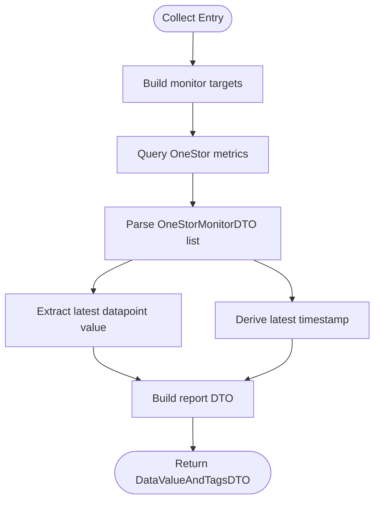
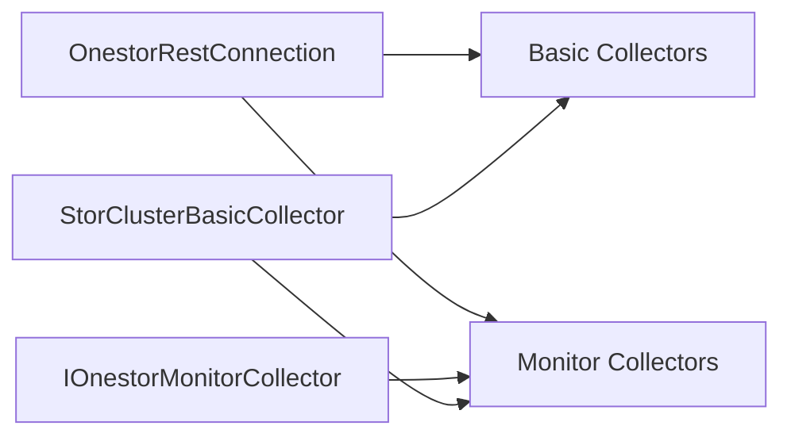

# Storage Pool Monitoring

<cite>
**Referenced Files in This Document**
- [DiskPoolBasicCollector.java](file://watcher-onestor/src/main/java/com/virtual/cloud/om/onestor/service/report/basic/DiskPoolBasicCollector.java)
- [NodePoolBasicCollector.java](file://watcher-onestor/src/main/java/com/virtual/cloud/om/onestor/service/report/basic/NodePoolBasicCollector.java)
- [StorDiskBasicCollector.java](file://watcher-onestor/src/main/java/com/virtual/cloud/om/onestor/service/report/basic/StorDiskBasicCollector.java)
- [StorHostBasicCollector.java](file://watcher-onestor/src/main/java/com/virtual/cloud/om/onestor/service/report/basic/StorHostBasicCollector.java)
- [StorPoolBasicCollector.java](file://watcher-onestor/src/main/java/com/virtual/cloud/om/onestor/service/report/basic/StorPoolBasicCollector.java)
- [DiskPoolBandwidthMonitorCollector.java](file://watcher-onestor/src/main/java/com/virtual/cloud/om/onestor/service/report/monitor/diskpool/DiskPoolBandwidthMonitorCollector.java)
- [DiskPoolCapacityCollector.java](file://watcher-onestor/src/main/java/com/virtual/cloud/om/onestor/service/report/monitor/diskpool/DiskPoolCapacityCollector.java)
- [DiskPoolIOPSMonitorCollector.java](file://watcher-onestor/src/main/java/com/virtual/cloud/om/onestor/service/report/monitor/diskpool/DiskPoolIOPSMonitorCollector.java)
- [StorageBandwidthMonitorCollector.java](file://watcher-onestor/src/main/java/com/virtual/cloud/om/onestor/service/report/monitor/storage/StorageBandwidthMonitorCollector.java)
- [StorageIOPSMonitorCollector.java](file://watcher-onestor/src/main/java/com/virtual/cloud/om/onestor/service/report/monitor/storage/StorageIOPSMonitorCollector.java)
- [HostBandwidthMonitorCollector.java](file://watcher-onestor/src/main/java/com/virtual/cloud/om/onestor/service/report/monitor/host/HostBandwidthMonitorCollector.java)
- [NodeCapacityMonitorCollector.java](file://watcher-onestor/src/main/java/com/virtual/cloud/om/onestor/service/report/monitor/node/NodeCapacityMonitorCollector.java)
- [IOnestorMonitorCollector.java](file://watcher-onestor/src/main/java/com/virtual/cloud/om/onestor/service/report/monitor/IOnestorMonitorCollector.java)
- [StorClusterBasicCollector.java](file://watcher-onestor/src/main/java/com/virtual/cloud/om/onestor/service/clusterBasic/StorClusterBasicCollector.java)
</cite>

## Table of Contents
1. [Introduction](#introduction)
2. [Project Structure](#project-structure)
3. [Core Components](#core-components)
4. [Architecture Overview](#architecture-overview)
5. [Detailed Component Analysis](#detailed-component-analysis)
6. [Dependency Analysis](#dependency-analysis)
7. [Performance Considerations](#performance-considerations)
8. [Troubleshooting Guide](#troubleshooting-guide)
9. [Conclusion](#conclusion)
10. [Appendices](#appendices)

## Introduction
This document describes the OneStor storage pool monitoring and analysis subsystem. It explains the hierarchical storage model (cluster → node pools → disk pools → storage disks, hosts, and storage pools), and documents the collectors responsible for inventory, metadata, bandwidth, capacity, and IOPS monitoring. It also covers performance metrics, capacity utilization patterns, I/O performance analysis, topology visualization, configuration management, optimization recommendations, capacity planning strategies, and troubleshooting methodologies for storage-related performance issues.

## Project Structure
The monitoring logic resides under the OneStor module, organized by functional areas:
- Basic inventory collectors (report/basic): capture static metadata and inventory across cluster, node pools, disk pools, hosts, and storage pools.
- Monitor collectors (report/monitor): fetch live metrics for bandwidth, capacity, and IOPS at multiple hierarchy levels.
- Cluster-level basic collector (clusterBasic): retrieves cluster-level identity and metadata.

**Diagram sources**
- [DiskPoolBasicCollector.java:33-90](file://watcher-onestor/src/main/java/com/virtual/cloud/om/onestor/service/report/basic/DiskPoolBasicCollector.java#L33-L90)
- [NodePoolBasicCollector.java:32-73](file://watcher-onestor/src/main/java/com/virtual/cloud/om/onestor/service/report/basic/NodePoolBasicCollector.java#L32-L73)
- [StorDiskBasicCollector.java:33-89](file://watcher-onestor/src/main/java/com/virtual/cloud/om/onestor/service/report/basic/StorDiskBasicCollector.java#L33-L89)
- [StorHostBasicCollector.java:33-174](file://watcher-onestor/src/main/java/com/virtual/cloud/om/onestor/service/report/basic/StorHostBasicCollector.java#L33-L174)
- [StorPoolBasicCollector.java:34-80](file://watcher-onestor/src/main/java/com/virtual/cloud/om/onestor/service/report/basic/StorPoolBasicCollector.java#L34-L80)
- [StorClusterBasicCollector.java:33-77](file://watcher-onestor/src/main/java/com/virtual/cloud/om/onestor/service/clusterBasic/StorClusterBasicCollector.java#L33-L77)
- [DiskPoolBandwidthMonitorCollector.java:35-94](file://watcher-onestor/src/main/java/com/virtual/cloud/om/onestor/service/report/monitor/diskpool/DiskPoolBandwidthMonitorCollector.java#L35-L94)
- [DiskPoolCapacityCollector.java:36-92](file://watcher-onestor/src/main/java/com/virtual/cloud/om/onestor/service/report/monitor/diskpool/DiskPoolCapacityCollector.java#L36-L92)
- [DiskPoolIOPSMonitorCollector.java:34-90](file://watcher-onestor/src/main/java/com/virtual/cloud/om/onestor/service/report/monitor/diskpool/DiskPoolIOPSMonitorCollector.java#L34-L90)
- [StorageBandwidthMonitorCollector.java:32-83](file://watcher-onestor/src/main/java/com/virtual/cloud/om/onestor/service/report/monitor/storage/StorageBandwidthMonitorCollector.java#L32-L83)
- [StorageIOPSMonitorCollector.java:32-83](file://watcher-onestor/src/main/java/com/virtual/cloud/om/onestor/service/report/monitor/storage/StorageIOPSMonitorCollector.java#L32-L83)
- [HostBandwidthMonitorCollector.java:36-87](file://watcher-onestor/src/main/java/com/virtual/cloud/om/onestor/service/report/monitor/host/HostBandwidthMonitorCollector.java#L36-L87)
- [NodeCapacityMonitorCollector.java:33-79](file://watcher-onestor/src/main/java/com/virtual/cloud/om/onestor/service/report/monitor/node/NodeCapacityMonitorCollector.java#L33-L79)
- [IOnestorMonitorCollector.java:16-54](file://watcher-onestor/src/main/java/com/virtual/cloud/om/onestor/service/report/monitor/IOnestorMonitorCollector.java#L16-L54)

**Section sources**
- [DiskPoolBasicCollector.java:27-90](file://watcher-onestor/src/main/java/com/virtual/cloud/om/onestor/service/report/basic/DiskPoolBasicCollector.java#L27-L90)
- [NodePoolBasicCollector.java:26-73](file://watcher-onestor/src/main/java/com/virtual/cloud/om/onestor/service/report/basic/NodePoolBasicCollector.java#L26-L73)
- [StorDiskBasicCollector.java:26-89](file://watcher-onestor/src/main/java/com/virtual/cloud/om/onestor/service/report/basic/StorDiskBasicCollector.java#L26-L89)
- [StorHostBasicCollector.java:26-174](file://watcher-onestor/src/main/java/com/virtual/cloud/om/onestor/service/report/basic/StorHostBasicCollector.java#L26-L174)
- [StorPoolBasicCollector.java:28-80](file://watcher-onestor/src/main/java/com/virtual/cloud/om/onestor/service/report/basic/StorPoolBasicCollector.java#L28-L80)
- [StorClusterBasicCollector.java:26-77](file://watcher-onestor/src/main/java/com/virtual/cloud/om/onestor/service/clusterBasic/StorClusterBasicCollector.java#L26-L77)

## Core Components
This section outlines the core collectors and their responsibilities across the storage hierarchy.

- DiskPoolBasicCollector
  - Purpose: Enumerates disk pools per node pool and collects disk pool metadata for reporting.
  - Key steps: Obtain cluster ID, list node pools, iterate each node pool to list disk pools, map DTOs, attach tags and timestamps.
  - Output: JSON payload containing disk pool metadata per disk pool.

- NodePoolBasicCollector
  - Purpose: Retrieves node pool metadata for the cluster.
  - Key steps: Fetch node pool list via cluster ID and transform to report DTOs.

- StorDiskBasicCollector
  - Purpose: Aggregates disk inventory across hosts and disk pools, including encryption, logical/physical sizes, and usage.
  - Key steps: Get host roles, for each host query disk info, enrich with disk pool and host attributes.

- StorHostBasicCollector
  - Purpose: Consolidates host metadata across roles (storage, monitor, NAS, MDS) and capacity/CPU/memory stats.
  - Key steps: Fetch role info, storage info, monitor info, NAS info, MDS info; merge into unified host report.

- StorPoolBasicCollector
  - Purpose: Collects storage pool metadata (including cache tier enablement and status).
  - Key steps: Retrieve pool list by cluster ID and map to report DTOs.

- DiskPoolBandwidthMonitorCollector
  - Purpose: Measures read/write/recovery bandwidth per disk pool.
  - Key steps: Discover disk pools, build monitor targets for bandwidth metrics, extract latest datapoints, timestamp, and tag.

- DiskPoolCapacityCollector
  - Purpose: Tracks total and used capacity per disk pool.
  - Key steps: Discover disk pools, query capacity metrics, compute latest values, timestamp, and tag.

- DiskPoolIOPSMonitorCollector
  - Purpose: Measures read and write IOPS per disk pool.
  - Key steps: Discover disk pools, query IOPS metrics, compute latest values, timestamp, and tag.

- StorageBandwidthMonitorCollector
  - Purpose: Aggregates storage pool bandwidth metrics (read/write/all) and IOPS/BW totals.
  - Key steps: Discover storage pools, query combined bandwidth/IOPS metrics, compute latest values, timestamp, and tag.

- StorageIOPSMonitorCollector
  - Purpose: Aggregates storage pool IOPS metrics (read/write/all) and BW/IOPS totals.
  - Key steps: Discover storage pools, query combined IOPS/BW metrics, compute latest values, timestamp, and tag.

- HostBandwidthMonitorCollector
  - Purpose: Measures host-level storage and filesystem bandwidth (read/write).
  - Key steps: Discover hosts, query bandwidth metrics, compute latest values, timestamp, and tag.

- NodeCapacityMonitorCollector
  - Purpose: Reports total and used capacity per node pool.
  - Key steps: Discover node pools, query capacity metrics, compute latest values, timestamp, and tag.

- IOnestorMonitorCollector (interface)
  - Purpose: Provides shared helpers for monitor collectors: extracting latest metric values, timestamps, and building target parameters.

- StorClusterBasicCollector
  - Purpose: Retrieves cluster identity and metadata for top-level context.
  - Key steps: Resolve cluster ID, fetch cluster basic info, attach tags and timestamp.

**Section sources**
- [DiskPoolBasicCollector.java:33-90](file://watcher-onestor/src/main/java/com/virtual/cloud/om/onestor/service/report/basic/DiskPoolBasicCollector.java#L33-L90)
- [NodePoolBasicCollector.java:32-73](file://watcher-onestor/src/main/java/com/virtual/cloud/om/onestor/service/report/basic/NodePoolBasicCollector.java#L32-L73)
- [StorDiskBasicCollector.java:33-89](file://watcher-onestor/src/main/java/com/virtual/cloud/om/onestor/service/report/basic/StorDiskBasicCollector.java#L33-L89)
- [StorHostBasicCollector.java:33-174](file://watcher-onestor/src/main/java/com/virtual/cloud/om/onestor/service/report/basic/StorHostBasicCollector.java#L33-L174)
- [StorPoolBasicCollector.java:34-80](file://watcher-onestor/src/main/java/com/virtual/cloud/om/onestor/service/report/basic/StorPoolBasicCollector.java#L34-L80)
- [DiskPoolBandwidthMonitorCollector.java:35-94](file://watcher-onestor/src/main/java/com/virtual/cloud/om/onestor/service/report/monitor/diskpool/DiskPoolBandwidthMonitorCollector.java#L35-L94)
- [DiskPoolCapacityCollector.java:36-92](file://watcher-onestor/src/main/java/com/virtual/cloud/om/onestor/service/report/monitor/diskpool/DiskPoolCapacityCollector.java#L36-L92)
- [DiskPoolIOPSMonitorCollector.java:34-90](file://watcher-onestor/src/main/java/com/virtual/cloud/om/onestor/service/report/monitor/diskpool/DiskPoolIOPSMonitorCollector.java#L34-L90)
- [StorageBandwidthMonitorCollector.java:32-83](file://watcher-onestor/src/main/java/com/virtual/cloud/om/onestor/service/report/monitor/storage/StorageBandwidthMonitorCollector.java#L32-L83)
- [StorageIOPSMonitorCollector.java:32-83](file://watcher-onestor/src/main/java/com/virtual/cloud/om/onestor/service/report/monitor/storage/StorageIOPSMonitorCollector.java#L32-L83)
- [HostBandwidthMonitorCollector.java:36-87](file://watcher-onestor/src/main/java/com/virtual/cloud/om/onestor/service/report/monitor/host/HostBandwidthMonitorCollector.java#L36-L87)
- [NodeCapacityMonitorCollector.java:33-79](file://watcher-onestor/src/main/java/com/virtual/cloud/om/onestor/service/report/monitor/node/NodeCapacityMonitorCollector.java#L33-L79)
- [IOnestorMonitorCollector.java:16-54](file://watcher-onestor/src/main/java/com/virtual/cloud/om/onestor/service/report/monitor/IOnestorMonitorCollector.java#L16-L54)
- [StorClusterBasicCollector.java:33-77](file://watcher-onestor/src/main/java/com/virtual/cloud/om/onestor/service/clusterBasic/StorClusterBasicCollector.java#L33-L77)

## Architecture Overview
The monitoring architecture follows a layered approach:
- Data retrieval: Each collector uses a REST connection to query OneStor APIs for either basic inventory or metrics.
- Data transformation: DTOs are mapped from raw API responses into standardized report DTOs.
- Metrics extraction: Monitor collectors implement a shared interface to parse latest metric values and timestamps.
- Reporting: Each collector returns a list of tagged metric payloads with timestamps for downstream ingestion.

**Diagram sources**
- [DiskPoolBandwidthMonitorCollector.java:35-94](file://watcher-onestor/src/main/java/com/virtual/cloud/om/onestor/service/report/monitor/diskpool/DiskPoolBandwidthMonitorCollector.java#L35-L94)
- [IOnestorMonitorCollector.java:16-54](file://watcher-onestor/src/main/java/com/virtual/cloud/om/onestor/service/report/monitor/IOnestorMonitorCollector.java#L16-L54)

## Detailed Component Analysis

### Hierarchical Storage Model and Inventory
The system models storage as:
- Cluster: Top-level identity and metadata.
- Node pools: Logical grouping of nodes.
- Disk pools: Logical grouping of disks within a node pool.
- Storage disks: Physical/logical disk inventory and usage.
- Hosts: Nodes with roles (storage, monitor, NAS, MDS) and capacity/CPU/memory.
- Storage pools: Logical storage abstractions (e.g., Ceph pools) associated with node pools.

**Diagram sources**
- [StorClusterBasicCollector.java:33-77](file://watcher-onestor/src/main/java/com/virtual/cloud/om/onestor/service/clusterBasic/StorClusterBasicCollector.java#L33-L77)
- [NodePoolBasicCollector.java:32-73](file://watcher-onestor/src/main/java/com/virtual/cloud/om/onestor/service/report/basic/NodePoolBasicCollector.java#L32-L73)
- [DiskPoolBasicCollector.java:33-90](file://watcher-onestor/src/main/java/com/virtual/cloud/om/onestor/service/report/basic/DiskPoolBasicCollector.java#L33-L90)
- [StorDiskBasicCollector.java:33-89](file://watcher-onestor/src/main/java/com/virtual/cloud/om/onestor/service/report/basic/StorDiskBasicCollector.java#L33-L89)
- [StorHostBasicCollector.java:33-174](file://watcher-onestor/src/main/java/com/virtual/cloud/om/onestor/service/report/basic/StorHostBasicCollector.java#L33-L174)
- [StorPoolBasicCollector.java:34-80](file://watcher-onestor/src/main/java/com/virtual/cloud/om/onestor/service/report/basic/StorPoolBasicCollector.java#L34-L80)

**Section sources**
- [StorClusterBasicCollector.java:33-77](file://watcher-onestor/src/main/java/com/virtual/cloud/om/onestor/service/clusterBasic/StorClusterBasicCollector.java#L33-L77)
- [NodePoolBasicCollector.java:32-73](file://watcher-onestor/src/main/java/com/virtual/cloud/om/onestor/service/report/basic/NodePoolBasicCollector.java#L32-L73)
- [DiskPoolBasicCollector.java:33-90](file://watcher-onestor/src/main/java/com/virtual/cloud/om/onestor/service/report/basic/DiskPoolBasicCollector.java#L33-L90)
- [StorDiskBasicCollector.java:33-89](file://watcher-onestor/src/main/java/com/virtual/cloud/om/onestor/service/report/basic/StorDiskBasicCollector.java#L33-L89)
- [StorHostBasicCollector.java:33-174](file://watcher-onestor/src/main/java/com/virtual/cloud/om/onestor/service/report/basic/StorHostBasicCollector.java#L33-L174)
- [StorPoolBasicCollector.java:34-80](file://watcher-onestor/src/main/java/com/virtual/cloud/om/onestor/service/report/basic/StorPoolBasicCollector.java#L34-L80)

### DiskPool* Collectors: Bandwidth, Capacity, IOPS
These collectors focus on disk pool-level observability.

**Diagram sources**
- [DiskPoolBandwidthMonitorCollector.java:35-94](file://watcher-onestor/src/main/java/com/virtual/cloud/om/onestor/service/report/monitor/diskpool/DiskPoolBandwidthMonitorCollector.java#L35-L94)
- [IOnestorMonitorCollector.java:16-54](file://watcher-onestor/src/main/java/com/virtual/cloud/om/onestor/service/report/monitor/IOnestorMonitorCollector.java#L16-L54)

Key behaviors:
- Bandwidth: Reads read/write/recovery bandwidth per disk pool.
- Capacity: Reads total and used capacity per disk pool.
- IOPS: Reads read and write IOPS per disk pool.

**Section sources**
- [DiskPoolBandwidthMonitorCollector.java:35-94](file://watcher-onestor/src/main/java/com/virtual/cloud/om/onestor/service/report/monitor/diskpool/DiskPoolBandwidthMonitorCollector.java#L35-L94)
- [DiskPoolCapacityCollector.java:36-92](file://watcher-onestor/src/main/java/com/virtual/cloud/om/onestor/service/report/monitor/diskpool/DiskPoolCapacityCollector.java#L36-L92)
- [DiskPoolIOPSMonitorCollector.java:34-90](file://watcher-onestor/src/main/java/com/virtual/cloud/om/onestor/service/report/monitor/diskpool/DiskPoolIOPSMonitorCollector.java#L34-L90)

### Storage Pool Performance Metrics
Storage-level metrics combine node pool and pool identifiers to aggregate bandwidth and IOPS.

**Diagram sources**
- [StorageBandwidthMonitorCollector.java:32-83](file://watcher-onestor/src/main/java/com/virtual/cloud/om/onestor/service/report/monitor/storage/StorageBandwidthMonitorCollector.java#L32-L83)
- [IOnestorMonitorCollector.java:16-54](file://watcher-onestor/src/main/java/com/virtual/cloud/om/onestor/service/report/monitor/IOnestorMonitorCollector.java#L16-L54)

**Section sources**
- [StorageBandwidthMonitorCollector.java:32-83](file://watcher-onestor/src/main/java/com/virtual/cloud/om/onestor/service/report/monitor/storage/StorageBandwidthMonitorCollector.java#L32-L83)
- [StorageIOPSMonitorCollector.java:32-83](file://watcher-onestor/src/main/java/com/virtual/cloud/om/onestor/service/report/monitor/storage/StorageIOPSMonitorCollector.java#L32-L83)

### Host-Level Bandwidth Monitoring
Host-level collectors aggregate storage and filesystem bandwidth metrics per host.

**Diagram sources**
- [HostBandwidthMonitorCollector.java:36-87](file://watcher-onestor/src/main/java/com/virtual/cloud/om/onestor/service/report/monitor/host/HostBandwidthMonitorCollector.java#L36-L87)
- [IOnestorMonitorCollector.java:16-54](file://watcher-onestor/src/main/java/com/virtual/cloud/om/onestor/service/report/monitor/IOnestorMonitorCollector.java#L16-L54)

**Section sources**
- [HostBandwidthMonitorCollector.java:36-87](file://watcher-onestor/src/main/java/com/virtual/cloud/om/onestor/service/report/monitor/host/HostBandwidthMonitorCollector.java#L36-L87)

### Node Pool Capacity Monitoring
Node-level capacity monitoring reports total and used capacity per node pool.

**Diagram sources**
- [NodeCapacityMonitorCollector.java:33-79](file://watcher-onestor/src/main/java/com/virtual/cloud/om/onestor/service/report/monitor/node/NodeCapacityMonitorCollector.java#L33-L79)
- [IOnestorMonitorCollector.java:16-54](file://watcher-onestor/src/main/java/com/virtual/cloud/om/onestor/service/report/monitor/IOnestorMonitorCollector.java#L16-L54)

**Section sources**
- [NodeCapacityMonitorCollector.java:33-79](file://watcher-onestor/src/main/java/com/virtual/cloud/om/onestor/service/report/monitor/node/NodeCapacityMonitorCollector.java#L33-L79)

### Algorithmic Flow for Metric Extraction
The shared interface encapsulates metric parsing and timestamp derivation.

**Diagram sources**
- [IOnestorMonitorCollector.java:16-54](file://watcher-onestor/src/main/java/com/virtual/cloud/om/onestor/service/report/monitor/IOnestorMonitorCollector.java#L16-L54)

**Section sources**
- [IOnestorMonitorCollector.java:16-54](file://watcher-onestor/src/main/java/com/virtual/cloud/om/onestor/service/report/monitor/IOnestorMonitorCollector.java#L16-L54)

## Dependency Analysis
- Collectors depend on a shared REST connection to OneStor APIs.
- Monitor collectors implement a common interface to normalize metric extraction and timestamp handling.
- Basic collectors depend on DTOs for inventory and metadata mapping.
- Cluster-level collector supplies cluster identity used by other collectors.

**Diagram sources**
- [DiskPoolBandwidthMonitorCollector.java:35-94](file://watcher-onestor/src/main/java/com/virtual/cloud/om/onestor/service/report/monitor/diskpool/DiskPoolBandwidthMonitorCollector.java#L35-L94)
- [IOnestorMonitorCollector.java:16-54](file://watcher-onestor/src/main/java/com/virtual/cloud/om/onestor/service/report/monitor/IOnestorMonitorCollector.java#L16-L54)
- [StorClusterBasicCollector.java:33-77](file://watcher-onestor/src/main/java/com/virtual/cloud/om/onestor/service/clusterBasic/StorClusterBasicCollector.java#L33-L77)

**Section sources**
- [DiskPoolBandwidthMonitorCollector.java:35-94](file://watcher-onestor/src/main/java/com/virtual/cloud/om/onestor/service/report/monitor/diskpool/DiskPoolBandwidthMonitorCollector.java#L35-L94)
- [IOnestorMonitorCollector.java:16-54](file://watcher-onestor/src/main/java/com/virtual/cloud/om/onestor/service/report/monitor/IOnestorMonitorCollector.java#L16-L54)
- [StorClusterBasicCollector.java:33-77](file://watcher-onestor/src/main/java/com/virtual/cloud/om/onestor/service/clusterBasic/StorClusterBasicCollector.java#L33-L77)

## Performance Considerations
- Parallelization: Monitor collectors stream-process disk pools, node pools, and hosts in parallel to reduce collection latency.
- Latest datapoint selection: Metric extraction uses the most recent sample to minimize staleness.
- Target batching: Multiple targets are appended to a single query to reduce round-trips.
- Tagging and timestamps: Uniform tagging and timestamping enable accurate time-series correlation.

[No sources needed since this section provides general guidance]

## Troubleshooting Guide
Common issues and resolutions:
- Empty or missing cluster ID: Verify credentials and endpoint reachability; ensure cluster discovery succeeds before metric queries.
- Missing metrics for a target: Confirm target names match OneStor conventions and that the target exists for the given entity (disk pool, node pool, host).
- Stale timestamps: Validate that the metric store is healthy and that the latest datapoint is present; re-run collection if necessary.
- Role-based host data gaps: Ensure host role information is available; some fields may be null for non-storage roles.

**Section sources**
- [StorClusterBasicCollector.java:39-64](file://watcher-onestor/src/main/java/com/virtual/cloud/om/onestor/service/clusterBasic/StorClusterBasicCollector.java#L39-L64)
- [IOnestorMonitorCollector.java:20-47](file://watcher-onestor/src/main/java/com/virtual/cloud/om/onestor/service/report/monitor/IOnestorMonitorCollector.java#L20-L47)

## Conclusion
The OneStor monitoring subsystem provides comprehensive visibility across the storage hierarchy. Basic collectors establish inventory and metadata, while monitor collectors deliver real-time bandwidth, capacity, and IOPS insights at disk pool, storage pool, node pool, and host levels. The shared monitoring interface ensures consistent metric extraction and timestamp handling, enabling effective capacity planning, performance optimization, and troubleshooting.

[No sources needed since this section summarizes without analyzing specific files]

## Appendices

### Storage Topology Visualization
Use the collected inventory to visualize the topology:
- Cluster → Node pools → Disk pools → Storage disks and hosts.
- Storage pools map to node pools and can be overlaid with bandwidth/IOPS metrics.

[No sources needed since this section provides general guidance]