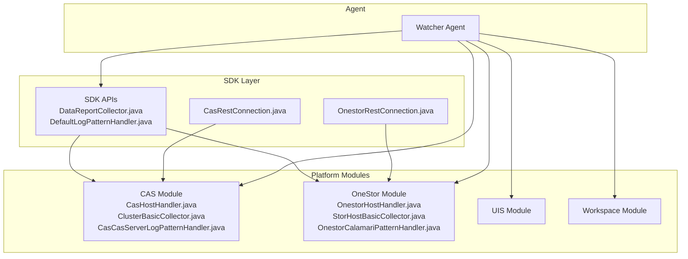
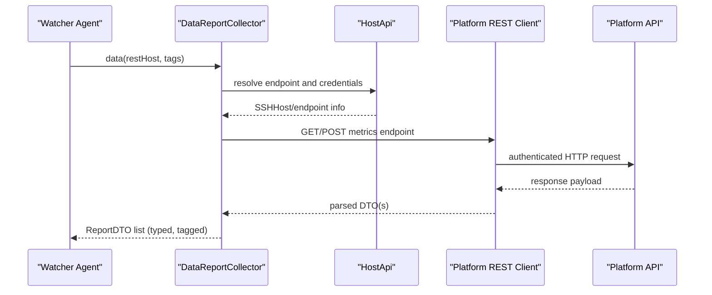
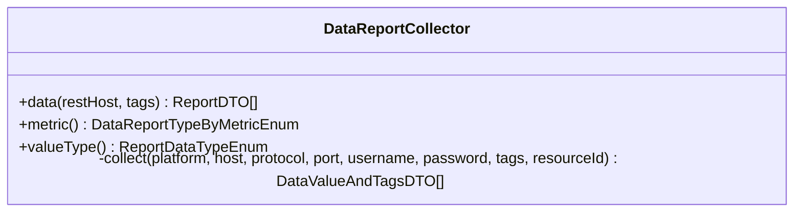
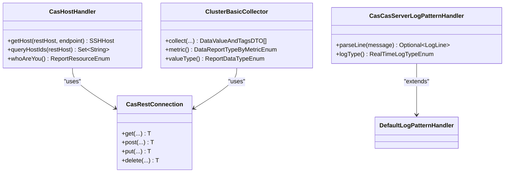
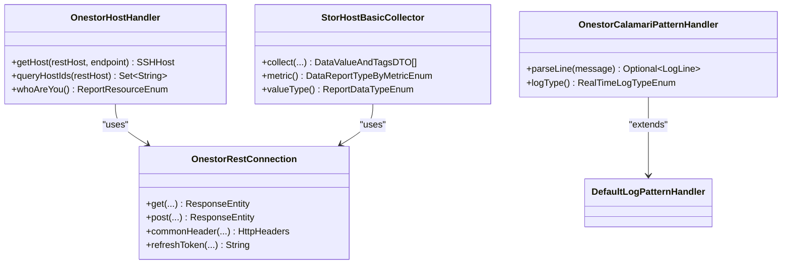
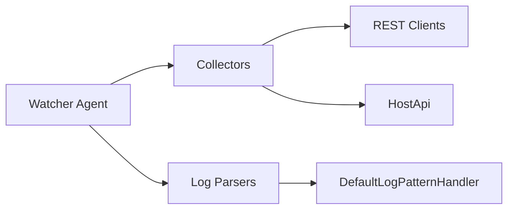
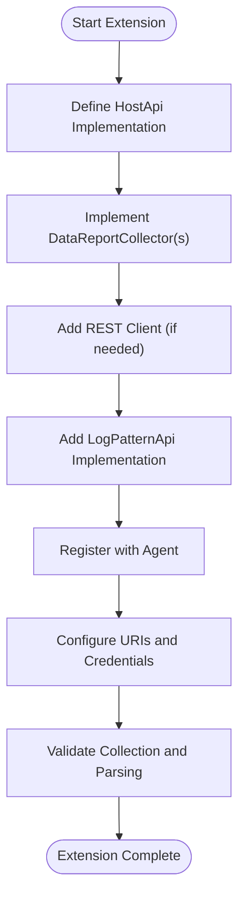

# Platform-Specific Modules

<cite>
**Referenced Files in This Document**
- [DataReportCollector.java](file://watcher-sdk/src/main/java/com/virtual/cloud/om/sdk/api/DataReportCollector.java)
- [DefaultLogPatternHandler.java](file://watcher-sdk/src/main/java/com/virtual/cloud/om/sdk/api/DefaultLogPatternHandler.java)
- [CasHostHandler.java](file://watcher-cas/src/main/java/com/virtual/cloud/om/cas/service/CasHostHandler.java)
- [OnestorHostHandler.java](file://watcher-onestor/src/main/java/com/virtual/cloud/om/onestor/service/OnestorHostHandler.java)
- [ClusterBasicCollector.java](file://watcher-cas/src/main/java/com/virtual/cloud/om/cas/service/report/ClusterBasicCollector.java)
- [StorHostBasicCollector.java](file://watcher-onestor/src/main/java/com/virtual/cloud/om/onestor/service/report/basic/StorHostBasicCollector.java)
- [CasRestConnection.java](file://watcher-sdk/src/main/java/com/virtual/cloud/om/sdk/config/rest/cas/CasRestConnection.java)
- [OnestorRestConnection.java](file://watcher-sdk/src/main/java/com/virtual/cloud/om/sdk/config/token/onestor/OnestorRestConnection.java)
- [CasCasServerLogPatternHandler.java](file://watcher-cas/src/main/java/com/virtual/cloud/om/cas/service/CasCasServerLogPatternHandler.java)
- [OnestorCalamariPatternHandler.java](file://watcher-onestor/src/main/java/com/virtual/cloud/om/onestor/service/OnestorCalamariPatternHandler.java)
</cite>

## Table of Contents
1. [Introduction](#introduction)
2. [Project Structure](#project-structure)
3. [Core Components](#core-components)
4. [Architecture Overview](#architecture-overview)
5. [Detailed Component Analysis](#detailed-component-analysis)
6. [Dependency Analysis](#dependency-analysis)
7. [Performance Considerations](#performance-considerations)
8. [Troubleshooting Guide](#troubleshooting-guide)
9. [Conclusion](#conclusion)
10. [Appendices](#appendices)

## Introduction
This document explains ShowTime’s platform-specific monitoring modules and the plugin-based architecture that enables collecting metrics and logs from multiple platforms: CAS, OneStor, UIS, and Workspace. It focuses on the DataReportCollector abstraction and its implementations, platform-specific log parsing patterns, authentication mechanisms, and data transformation processes. It also covers configuration requirements, deployment procedures, integration with the central monitoring agent, platform-specific challenges, optimization strategies, troubleshooting approaches, and extension guidelines for adding new monitoring targets.

## Project Structure
The monitoring stack is organized into modular Maven modules:
- watcher-sdk: Shared SDK APIs, DTOs, enums, and infrastructure (REST clients, log pattern handler base, collectors base).
- watcher-cas: CAS-specific collectors, host discovery, and log parsers.
- watcher-onestor: OneStor-specific collectors, host discovery, and log parsers.
- watcher-uis: UIS-specific services and collectors (module present).
- watcher-workspace: Workspace-specific services and collectors (module present).
- watcher-agent: Central agent that orchestrates collection, scheduling, and reporting.

**Diagram sources**
- [DataReportCollector.java:19-118](file://watcher-sdk/src/main/java/com/virtual/cloud/om/sdk/api/DataReportCollector.java#L19-L118)
- [DefaultLogPatternHandler.java:17-56](file://watcher-sdk/src/main/java/com/virtual/cloud/om/sdk/api/DefaultLogPatternHandler.java#L17-L56)
- [CasHostHandler.java:26-60](file://watcher-cas/src/main/java/com/virtual/cloud/om/cas/service/CasHostHandler.java#L26-L60)
- [OnestorHostHandler.java:29-72](file://watcher-onestor/src/main/java/com/virtual/cloud/om/onestor/service/OnestorHostHandler.java#L29-L72)
- [ClusterBasicCollector.java:28-73](file://watcher-cas/src/main/java/com/virtual/cloud/om/cas/service/report/ClusterBasicCollector.java#L28-L73)
- [StorHostBasicCollector.java:33-174](file://watcher-onestor/src/main/java/com/virtual/cloud/om/onestor/service/report/basic/StorHostBasicCollector.java#L33-L174)
- [CasRestConnection.java:28-160](file://watcher-sdk/src/main/java/com/virtual/cloud/om/sdk/config/rest/cas/CasRestConnection.java#L28-L160)
- [OnestorRestConnection.java:50-413](file://watcher-sdk/src/main/java/com/virtual/cloud/om/sdk/config/token/onestor/OnestorRestConnection.java#L50-L413)

**Section sources**
- [DataReportCollector.java:19-118](file://watcher-sdk/src/main/java/com/virtual/cloud/om/sdk/api/DataReportCollector.java#L19-L118)
- [CasHostHandler.java:26-60](file://watcher-cas/src/main/java/com/virtual/cloud/om/cas/service/CasHostHandler.java#L26-L60)
- [OnestorHostHandler.java:29-72](file://watcher-onestor/src/main/java/com/virtual/cloud/om/onestor/service/OnestorHostHandler.java#L29-L72)
- [CasRestConnection.java:28-160](file://watcher-sdk/src/main/java/com/virtual/cloud/om/sdk/config/rest/cas/CasRestConnection.java#L28-L160)
- [OnestorRestConnection.java:50-413](file://watcher-sdk/src/main/java/com/virtual/cloud/om/sdk/config/token/onestor/OnestorRestConnection.java#L50-L413)

## Core Components
- DataReportCollector: Abstract base for all metric collectors. It defines the contract for platform-specific collect implementations, provides standardized data shaping into ReportDTO, and ensures consistent timestamps and value typing.
- DefaultLogPatternHandler: Base for platform-specific log parsers. Provides a default regex and parsing logic, extended per platform to match their log formats.
- HostApi implementations: Platform adapters that resolve endpoint identifiers and host credentials for remote access.
- REST connection clients: Platform-specific REST clients handling authentication, retries, and request routing.

Key responsibilities:
- DataReportCollector: orchestrate collection lifecycle, transform raw values into typed reports, and normalize timestamps.
- DefaultLogPatternHandler: parse platform logs into structured LogLine objects.
- HostApi: translate logical endpoints to physical SSH credentials.
- REST connections: handle authentication and HTTP transport specifics per platform.

**Section sources**
- [DataReportCollector.java:48-118](file://watcher-sdk/src/main/java/com/virtual/cloud/om/sdk/api/DataReportCollector.java#L48-L118)
- [DefaultLogPatternHandler.java:17-56](file://watcher-sdk/src/main/java/com/virtual/cloud/om/sdk/api/DefaultLogPatternHandler.java#L17-L56)
- [CasHostHandler.java:26-60](file://watcher-cas/src/main/java/com/virtual/cloud/om/cas/service/CasHostHandler.java#L26-L60)
- [OnestorHostHandler.java:29-72](file://watcher-onestor/src/main/java/com/virtual/cloud/om/onestor/service/OnestorHostHandler.java#L29-L72)

## Architecture Overview
The platform-specific monitoring architecture follows a plugin-like design:
- Central agent invokes collectors via SDK abstractions.
- Collectors use platform-specific REST clients to fetch metrics.
- HostApi implementations resolve endpoints and credentials.
- Log parsers extract structured fields from platform logs.

**Diagram sources**
- [DataReportCollector.java:48-86](file://watcher-sdk/src/main/java/com/virtual/cloud/om/sdk/api/DataReportCollector.java#L48-L86)
- [CasHostHandler.java:31-42](file://watcher-cas/src/main/java/com/virtual/cloud/om/cas/service/CasHostHandler.java#L31-L42)
- [OnestorHostHandler.java:34-42](file://watcher-onestor/src/main/java/com/virtual/cloud/om/onestor/service/OnestorHostHandler.java#L34-L42)
- [CasRestConnection.java:112-132](file://watcher-sdk/src/main/java/com/virtual/cloud/om/sdk/config/rest/cas/CasRestConnection.java#L112-L132)
- [OnestorRestConnection.java:207-229](file://watcher-sdk/src/main/java/com/virtual/cloud/om/sdk/config/token/onestor/OnestorRestConnection.java#L207-L229)

## Detailed Component Analysis

### DataReportCollector Abstraction
- Purpose: Standardize metric collection across platforms.
- Lifecycle:
  - data(): orchestrates collection, logs timing, normalizes empty results, and attaches timestamps.
  - collect(): abstract hook for platform-specific data retrieval.
  - metric(): identifies the metric family/type.
  - valueType(): determines the data type of values (e.g., JSON, numeric).
- Data shaping:
  - Converts raw values into DataValueAndTagsDTO and wraps them into ReportDTO with metric name, type, tags, and timestamp.

**Diagram sources**
- [DataReportCollector.java:19-118](file://watcher-sdk/src/main/java/com/virtual/cloud/om/sdk/api/DataReportCollector.java#L19-L118)

**Section sources**
- [DataReportCollector.java:48-118](file://watcher-sdk/src/main/java/com/virtual/cloud/om/sdk/api/DataReportCollector.java#L48-L118)

### CAS Platform
- Host resolution: CasHostHandler resolves endpoints to SSH credentials using CAS REST APIs and returns SSHHost instances.
- Metrics: Example ClusterBasicCollector retrieves cluster metadata and returns JSON-typed values.
- Logs: CasCasServerLogPatternHandler parses CAS server logs with a platform-specific regex.

**Diagram sources**
- [CasHostHandler.java:26-60](file://watcher-cas/src/main/java/com/virtual/cloud/om/cas/service/CasHostHandler.java#L26-L60)
- [ClusterBasicCollector.java:28-73](file://watcher-cas/src/main/java/com/virtual/cloud/om/cas/service/report/ClusterBasicCollector.java#L28-L73)
- [CasCasServerLogPatternHandler.java:16-52](file://watcher-cas/src/main/java/com/virtual/cloud/om/cas/service/CasCasServerLogPatternHandler.java#L16-L52)
- [CasRestConnection.java:28-160](file://watcher-sdk/src/main/java/com/virtual/cloud/om/sdk/config/rest/cas/CasRestConnection.java#L28-L160)
- [DefaultLogPatternHandler.java:17-56](file://watcher-sdk/src/main/java/com/virtual/cloud/om/sdk/api/DefaultLogPatternHandler.java#L17-L56)

**Section sources**
- [CasHostHandler.java:31-59](file://watcher-cas/src/main/java/com/virtual/cloud/om/cas/service/CasHostHandler.java#L31-L59)
- [ClusterBasicCollector.java:32-71](file://watcher-cas/src/main/java/com/virtual/cloud/om/cas/service/report/ClusterBasicCollector.java#L32-L71)
- [CasCasServerLogPatternHandler.java:18-50](file://watcher-cas/src/main/java/com/virtual/cloud/om/cas/service/CasCasServerLogPatternHandler.java#L18-L50)

### OneStor Platform
- Host resolution: OnestorHostHandler queries cluster hosts and maps endpoints to SSH credentials.
- Metrics: StorHostBasicCollector aggregates host roles and attributes across stor, mon, nas, mds roles and returns JSON-typed values.
- Logs: OnestorCalamariPatternHandler parses Calamari logs with a platform-specific regex.

**Diagram sources**
- [OnestorHostHandler.java:29-72](file://watcher-onestor/src/main/java/com/virtual/cloud/om/onestor/service/OnestorHostHandler.java#L29-L72)
- [StorHostBasicCollector.java:33-174](file://watcher-onestor/src/main/java/com/virtual/cloud/om/onestor/service/report/basic/StorHostBasicCollector.java#L33-L174)
- [OnestorCalamariPatternHandler.java:17-58](file://watcher-onestor/src/main/java/com/virtual/cloud/om/onestor/service/OnestorCalamariPatternHandler.java#L17-L58)
- [OnestorRestConnection.java:50-413](file://watcher-sdk/src/main/java/com/virtual/cloud/om/sdk/config/token/onestor/OnestorRestConnection.java#L50-L413)
- [DefaultLogPatternHandler.java:17-56](file://watcher-sdk/src/main/java/com/virtual/cloud/om/sdk/api/DefaultLogPatternHandler.java#L17-L56)

**Section sources**
- [OnestorHostHandler.java:34-57](file://watcher-onestor/src/main/java/com/virtual/cloud/om/onestor/service/OnestorHostHandler.java#L34-L57)
- [StorHostBasicCollector.java:36-92](file://watcher-onestor/src/main/java/com/virtual/cloud/om/onestor/service/report/basic/StorHostBasicCollector.java#L36-L92)
- [OnestorCalamariPatternHandler.java:19-56](file://watcher-onestor/src/main/java/com/virtual/cloud/om/onestor/service/OnestorCalamariPatternHandler.java#L19-L56)

### UIS and Workspace Platforms
- UIS: Host discovery and authentication are handled via UIS-specific services and collectors in the watcher-uis module.
- Workspace: Services and collectors are provided under watcher-workspace.

These modules follow the same SDK patterns and can be integrated similarly to CAS and OneStor.

[No sources needed since this section doesn't analyze specific files]

## Dependency Analysis
- Coupling:
  - Collectors depend on platform REST clients and HostApi implementations.
  - Log parsers depend on DefaultLogPatternHandler and platform log formats.
- Cohesion:
  - Each platform module encapsulates its own collectors, host handlers, and log parsers.
- External dependencies:
  - REST clients manage authentication and HTTP transport.
  - Central agent coordinates scheduling and reporting.

**Diagram sources**
- [DataReportCollector.java:48-118](file://watcher-sdk/src/main/java/com/virtual/cloud/om/sdk/api/DataReportCollector.java#L48-L118)
- [DefaultLogPatternHandler.java:17-56](file://watcher-sdk/src/main/java/com/virtual/cloud/om/sdk/api/DefaultLogPatternHandler.java#L17-L56)
- [CasHostHandler.java:26-60](file://watcher-cas/src/main/java/com/virtual/cloud/om/cas/service/CasHostHandler.java#L26-L60)
- [OnestorHostHandler.java:29-72](file://watcher-onestor/src/main/java/com/virtual/cloud/om/onestor/service/OnestorHostHandler.java#L29-L72)
- [CasRestConnection.java:28-160](file://watcher-sdk/src/main/java/com/virtual/cloud/om/sdk/config/rest/cas/CasRestConnection.java#L28-L160)
- [OnestorRestConnection.java:50-413](file://watcher-sdk/src/main/java/com/virtual/cloud/om/sdk/config/token/onestor/OnestorRestConnection.java#L50-L413)

**Section sources**
- [CasRestConnection.java:112-132](file://watcher-sdk/src/main/java/com/virtual/cloud/om/sdk/config/rest/cas/CasRestConnection.java#L112-L132)
- [OnestorRestConnection.java:207-229](file://watcher-sdk/src/main/java/com/virtual/cloud/om/sdk/config/token/onestor/OnestorRestConnection.java#L207-L229)

## Performance Considerations
- REST client caching: Both CAS and OneStor clients cache HTTP clients and tokens to reduce overhead.
- Conditional enabling: REST clients are conditionally enabled via properties to avoid unnecessary initialization.
- Batch processing: Collectors return lists of values; batch aggregation reduces overhead in the agent.
- Logging overhead: Default log parser uses compiled patterns; ensure log volume is controlled to avoid CPU spikes.
- Authentication refresh: OneStor client refreshes tokens on 401/403 and caches them to minimize repeated auth calls.

[No sources needed since this section provides general guidance]

## Troubleshooting Guide
Common issues and resolutions:
- REST failures:
  - CAS REST client logs remote call costs and exceptions; check for CONFLICT responses and error headers.
  - OneStor REST client refreshes tokens on unauthorized errors and retries requests.
- Host resolution:
  - Ensure endpoint identifiers are valid and HostApi returns proper SSH credentials.
- Log parsing:
  - Verify logType matches the platform and regex patterns align with actual log formats.
- Timestamp normalization:
  - DataReportCollector sets timestamps when missing; confirm collector implementations populate timestamps consistently.

**Section sources**
- [CasRestConnection.java:64-94](file://watcher-sdk/src/main/java/com/virtual/cloud/om/sdk/config/rest/cas/CasRestConnection.java#L64-L94)
- [OnestorRestConnection.java:151-189](file://watcher-sdk/src/main/java/com/virtual/cloud/om/sdk/config/token/onestor/OnestorRestConnection.java#L151-L189)
- [DefaultLogPatternHandler.java:22-49](file://watcher-sdk/src/main/java/com/virtual/cloud/om/sdk/api/DefaultLogPatternHandler.java#L22-L49)

## Conclusion
ShowTime’s platform-specific monitoring modules leverage a clean SDK abstraction with platform adapters and collectors. The DataReportCollector and DefaultLogPatternHandler enable consistent metric and log handling across CAS, OneStor, UIS, and Workspace. REST clients encapsulate authentication and transport specifics, while HostApi implementations bridge logical endpoints to physical access. This architecture supports extensibility, maintainability, and scalable integration with the central agent.

[No sources needed since this section summarizes without analyzing specific files]

## Appendices

### Configuration Requirements
- CAS:
  - Enable CAS REST client via property.
  - Configure CAS HTTP/HTTPS ports.
- OneStor:
  - Enable OneStor REST client via property.
  - Ensure lock API availability for token refresh coordination.
- General:
  - Ensure platform URIs and endpoints are reachable from the agent.
  - Configure logging and timezone settings for accurate timestamps.

**Section sources**
- [CasRestConnection.java:27-110](file://watcher-sdk/src/main/java/com/virtual/cloud/om/sdk/config/rest/cas/CasRestConnection.java#L27-L110)
- [OnestorRestConnection.java:49-75](file://watcher-sdk/src/main/java/com/virtual/cloud/om/sdk/config/token/onestor/OnestorRestConnection.java#L49-L75)

### Deployment Procedures
- Build and package each module independently.
- Place platform-specific collectors and log parsers into the agent’s plugin/classpath.
- Configure platform endpoints, credentials, and ports.
- Start the agent; it will discover and schedule collectors based on configured resources.

[No sources needed since this section provides general guidance]

### Integration Patterns with the Central Monitoring Agent
- Use DataReportCollector.data() to standardize metric collection.
- Register platform-specific HostApi implementations for endpoint resolution.
- Provide platform-specific log parsers implementing LogPatternApi.
- Ensure REST clients are initialized and enabled for the target platform.

**Section sources**
- [DataReportCollector.java:48-86](file://watcher-sdk/src/main/java/com/virtual/cloud/om/sdk/api/DataReportCollector.java#L48-L86)
- [DefaultLogPatternHandler.java:17-56](file://watcher-sdk/src/main/java/com/virtual/cloud/om/sdk/api/DefaultLogPatternHandler.java#L17-L56)

### Extending the Framework for New Monitoring Targets
Steps to add a new platform:
1. Define a HostApi implementation to resolve endpoints and credentials.
2. Implement DataReportCollector subclasses for each metric family.
3. Add a platform-specific REST client if needed, following existing patterns.
4. Provide a LogPatternApi implementation for real-time log parsing.
5. Register collectors and parsers with the agent and configure platform URIs and credentials.
6. Validate collection lifecycle, authentication, and data transformation.

[No sources needed since this diagram shows conceptual workflow, not actual code structure]