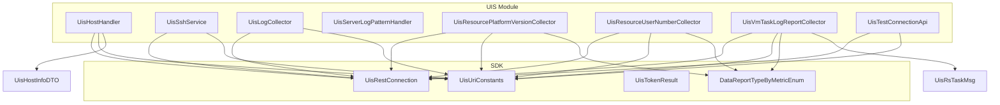
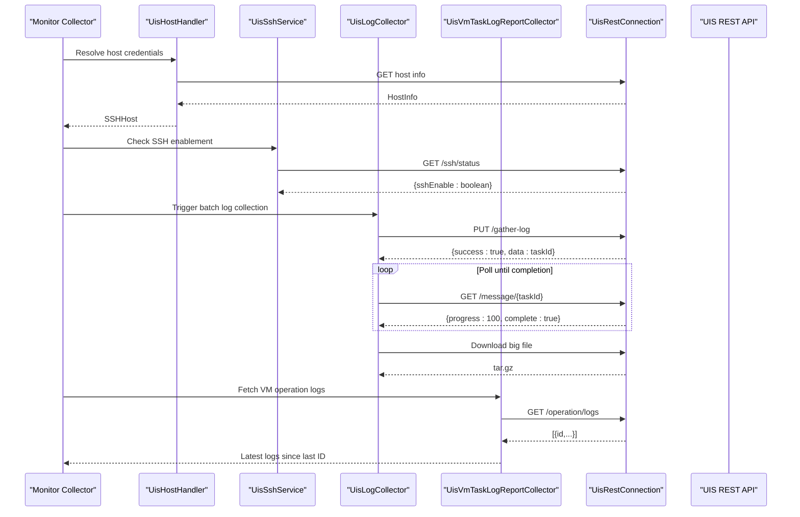
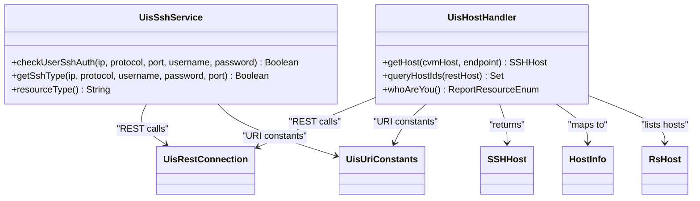
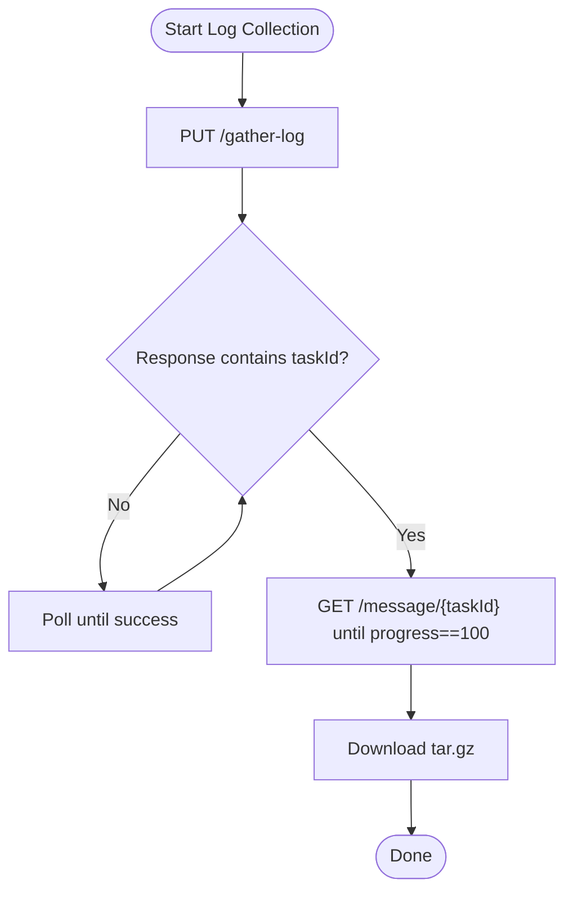
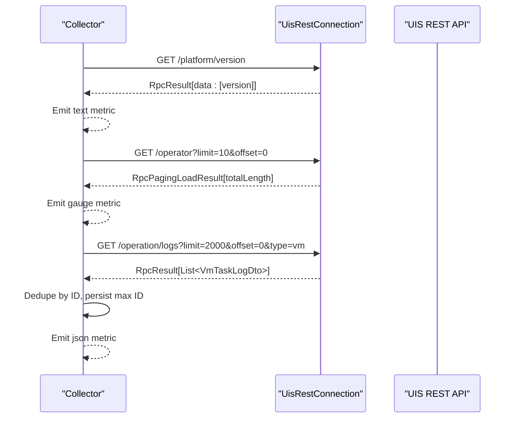
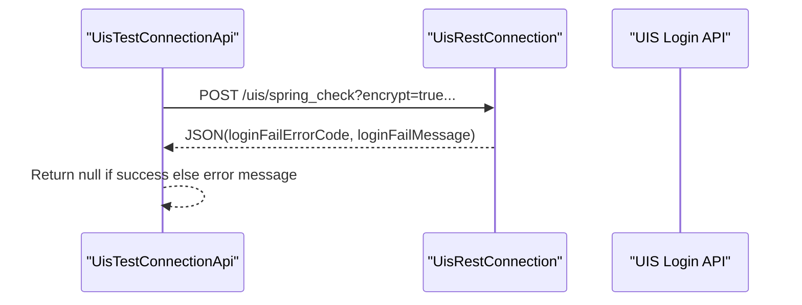
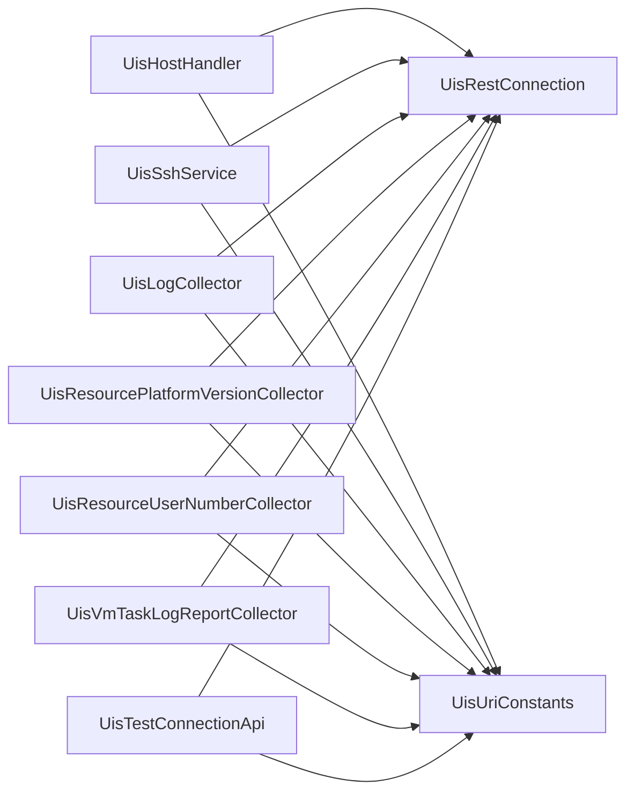
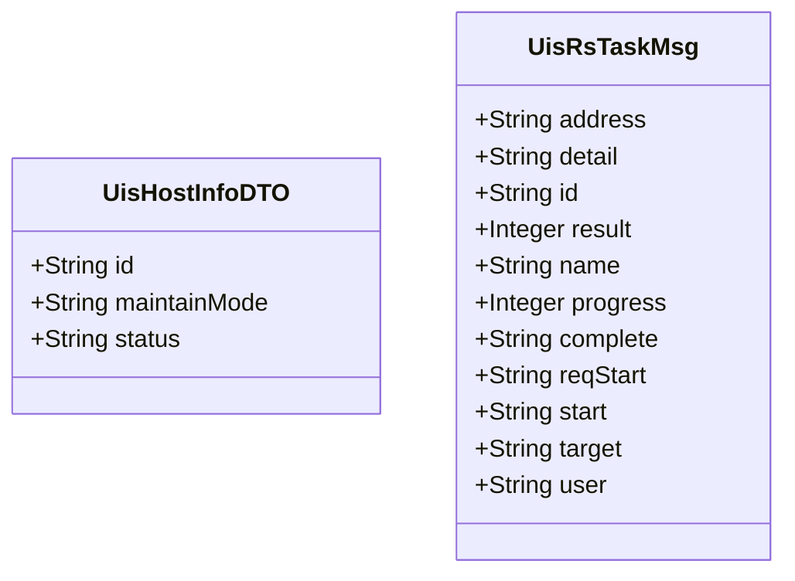

# UIS Platform Module

<cite>
**Referenced Files in This Document**
- [UisHostHandler.java](file://watcher-uis/src/main/java/com/virtual/cloud/om/uis/service/UisHostHandler.java)
- [UisSshService.java](file://watcher-uis/src/main/java/com/virtual/cloud/om/uis/service/ssh/UisSshService.java)
- [UisLogCollector.java](file://watcher-uis/src/main/java/com/virtual/cloud/om/uis/service/log/UisLogCollector.java)
- [UisServerLogPatternHandler.java](file://watcher-uis/src/main/java/com/virtual/cloud/om/uis/service/UisServerLogPatternHandler.java)
- [UisResourcePlatformVersionCollector.java](file://watcher-uis/src/main/java/com/virtual/cloud/om/uis/service/report/UisResourcePlatformVersionCollector.java)
- [UisResourceUserNumberCollector.java](file://watcher-uis/src/main/java/com/virtual/cloud/om/uis/service/report/UisResourceUserNumberCollector.java)
- [UisVmTaskLogReportCollector.java](file://watcher-uis/src/main/java/com/virtual/cloud/om/uis/service/report/UisVmTaskLogReportCollector.java)
- [UisTestConnectionApi.java](file://watcher-uis/src/main/java/com/virtual/cloud/om/uis/service/UisTestConnectionApi.java)
- [UisRestConnection.java](file://watcher-sdk/src/main/java/com/virtual/cloud/om/sdk/config/rest/uis/UisRestConnection.java)
- [UisUriConstants.java](file://watcher-sdk/src/main/java/com/virtual/cloud/om/sdk/constant/uri/UisUriConstants.java)
- [UisTokenResult.java](file://watcher-sdk/src/main/java/com/virtual/cloud/om/sdk/config/rest/uis/UisTokenResult.java)
- [DataReportTypeByMetricEnum.java](file://watcher-sdk/src/main/java/com/virtual/cloud/om/sdk/constant/DataReportTypeByMetricEnum.java)
- [UisHostInfoDTO.java](file://watcher-uis/src/main/java/com/virtual/cloud/om/uis/dto/UisHostInfoDTO.java)
- [UisRsTaskMsg.java](file://watcher-uis/src/main/java/com/virtual/cloud/om/uis/dto/UisRsTaskMsg.java)
</cite>

## Table of Contents
1. [Introduction](#introduction)
2. [Project Structure](#project-structure)
3. [Core Components](#core-components)
4. [Architecture Overview](#architecture-overview)
5. [Detailed Component Analysis](#detailed-component-analysis)
6. [Dependency Analysis](#dependency-analysis)
7. [Performance Considerations](#performance-considerations)
8. [Troubleshooting Guide](#troubleshooting-guide)
9. [Conclusion](#conclusion)
10. [Appendices](#appendices)

## Introduction
This document describes the UIS (Unified Interface Services) platform monitoring module within the Watcher ecosystem. It focuses on:
- Resource platform version monitoring
- User number tracking
- VM task log reporting
- UIS-specific log collection and parsing for server logs
- SSH service implementation for UIS host connectivity
- Host handler for resource management
- Integration patterns with UIS REST APIs, authentication mechanisms, and data transformation processes
- Configuration requirements, metric interpretation guidelines, and troubleshooting approaches

## Project Structure
The UIS monitoring module is organized under the watcher-uis module and integrates with SDK utilities and constants for REST communication and logging.

**Diagram sources**
- [UisHostHandler.java:26-64](file://watcher-uis/src/main/java/com/virtual/cloud/om/uis/service/UisHostHandler.java#L26-L64)
- [UisSshService.java:31-124](file://watcher-uis/src/main/java/com/virtual/cloud/om/uis/service/ssh/UisSshService.java#L31-L124)
- [UisLogCollector.java:27-86](file://watcher-uis/src/main/java/com/virtual/cloud/om/uis/service/log/UisLogCollector.java#L27-L86)
- [UisServerLogPatternHandler.java:19-56](file://watcher-uis/src/main/java/com/virtual/cloud/om/uis/service/UisServerLogPatternHandler.java#L19-L56)
- [UisResourcePlatformVersionCollector.java:23-48](file://watcher-uis/src/main/java/com/virtual/cloud/om/uis/service/report/UisResourcePlatformVersionCollector.java#L23-L48)
- [UisResourceUserNumberCollector.java:25-53](file://watcher-uis/src/main/java/com/virtual/cloud/om/uis/service/report/UisResourceUserNumberCollector.java#L25-L53)
- [UisVmTaskLogReportCollector.java:29-76](file://watcher-uis/src/main/java/com/virtual/cloud/om/uis/service/report/UisVmTaskLogReportCollector.java#L29-L76)
- [UisTestConnectionApi.java:19-36](file://watcher-uis/src/main/java/com/virtual/cloud/om/uis/service/UisTestConnectionApi.java#L19-L36)
- [UisRestConnection.java:44-74](file://watcher-sdk/src/main/java/com/virtual/cloud/om/sdk/config/rest/uis/UisRestConnection.java#L44-L74)
- [UisUriConstants.java:7-33](file://watcher-sdk/src/main/java/com/virtual/cloud/om/sdk/constant/uri/UisUriConstants.java#L7-L33)
- [UisTokenResult.java:16-39](file://watcher-sdk/src/main/java/com/virtual/cloud/om/sdk/config/rest/uis/UisTokenResult.java#L16-L39)
- [DataReportTypeByMetricEnum.java:35-83](file://watcher-sdk/src/main/java/com/virtual/cloud/om/sdk/constant/DataReportTypeByMetricEnum.java#L35-L83)
- [UisHostInfoDTO.java:6-10](file://watcher-uis/src/main/java/com/virtual/cloud/om/uis/dto/UisHostInfoDTO.java#L6-L10)
- [UisRsTaskMsg.java:6-18](file://watcher-uis/src/main/java/com/virtual/cloud/om/uis/dto/UisRsTaskMsg.java#L6-L18)

**Section sources**
- [UisHostHandler.java:26-64](file://watcher-uis/src/main/java/com/virtual/cloud/om/uis/service/UisHostHandler.java#L26-L64)
- [UisRestConnection.java:44-74](file://watcher-sdk/src/main/java/com/virtual/cloud/om/sdk/config/rest/uis/UisRestConnection.java#L44-L74)

## Core Components
- Host management and SSH provisioning via UisHostHandler
- SSH connectivity testing and capability detection via UisSshService
- Batch log collection and asynchronous status polling via UisLogCollector
- Server log parsing for structured fields via UisServerLogPatternHandler
- Platform version reporting via UisResourcePlatformVersionCollector
- User count reporting via UisResourceUserNumberCollector
- VM operation log reporting via UisVmTaskLogReportCollector
- Platform connectivity testing via UisTestConnectionApi

**Section sources**
- [UisHostHandler.java:26-64](file://watcher-uis/src/main/java/com/virtual/cloud/om/uis/service/UisHostHandler.java#L26-L64)
- [UisSshService.java:31-124](file://watcher-uis/src/main/java/com/virtual/cloud/om/uis/service/ssh/UisSshService.java#L31-L124)
- [UisLogCollector.java:27-86](file://watcher-uis/src/main/java/com/virtual/cloud/om/uis/service/log/UisLogCollector.java#L27-L86)
- [UisServerLogPatternHandler.java:19-56](file://watcher-uis/src/main/java/com/virtual/cloud/om/uis/service/UisServerLogPatternHandler.java#L19-L56)
- [UisResourcePlatformVersionCollector.java:23-48](file://watcher-uis/src/main/java/com/virtual/cloud/om/uis/service/report/UisResourcePlatformVersionCollector.java#L23-L48)
- [UisResourceUserNumberCollector.java:25-53](file://watcher-uis/src/main/java/com/virtual/cloud/om/uis/service/report/UisResourceUserNumberCollector.java#L25-L53)
- [UisVmTaskLogReportCollector.java:29-76](file://watcher-uis/src/main/java/com/virtual/cloud/om/uis/service/report/UisVmTaskLogReportCollector.java#L29-L76)
- [UisTestConnectionApi.java:19-36](file://watcher-uis/src/main/java/com/virtual/cloud/om/uis/service/UisTestConnectionApi.java#L19-L36)

## Architecture Overview
The UIS monitoring module orchestrates REST interactions with the UIS platform, transforms responses into metrics/logs, and exposes them for reporting and alerting.

**Diagram sources**
- [UisHostHandler.java:32-46](file://watcher-uis/src/main/java/com/virtual/cloud/om/uis/service/UisHostHandler.java#L32-L46)
- [UisSshService.java:94-118](file://watcher-uis/src/main/java/com/virtual/cloud/om/uis/service/ssh/UisSshService.java#L94-L118)
- [UisLogCollector.java:31-81](file://watcher-uis/src/main/java/com/virtual/cloud/om/uis/service/log/UisLogCollector.java#L31-L81)
- [UisVmTaskLogReportCollector.java:37-65](file://watcher-uis/src/main/java/com/virtual/cloud/om/uis/service/report/UisVmTaskLogReportCollector.java#L37-L65)
- [UisRestConnection.java:44-74](file://watcher-sdk/src/main/java/com/virtual/cloud/om/sdk/config/rest/uis/UisRestConnection.java#L44-L74)

## Detailed Component Analysis

### Host Management and SSH Connectivity
- UisHostHandler resolves UIS host credentials from platform metadata and returns an SSHHost model for remote operations. It supports a special endpoint identifier to return management platform credentials.
- UisSshService checks whether SSH is enabled on the target host via UIS REST API and handles decryption of sensitive fields.

**Diagram sources**
- [UisHostHandler.java:26-64](file://watcher-uis/src/main/java/com/virtual/cloud/om/uis/service/UisHostHandler.java#L26-L64)
- [UisSshService.java:31-124](file://watcher-uis/src/main/java/com/virtual/cloud/om/uis/service/ssh/UisSshService.java#L31-L124)
- [UisRestConnection.java:44-74](file://watcher-sdk/src/main/java/com/virtual/cloud/om/sdk/config/rest/uis/UisRestConnection.java#L44-L74)
- [UisUriConstants.java:7-33](file://watcher-sdk/src/main/java/com/virtual/cloud/om/sdk/constant/uri/UisUriConstants.java#L7-L33)

**Section sources**
- [UisHostHandler.java:32-63](file://watcher-uis/src/main/java/com/virtual/cloud/om/uis/service/UisHostHandler.java#L32-L63)
- [UisSshService.java:94-123](file://watcher-uis/src/main/java/com/virtual/cloud/om/uis/service/ssh/UisSshService.java#L94-L123)

### Log Collection and Parsing
- UisLogCollector triggers batch log gathering, polls for completion using task IDs, and downloads the resulting archive.
- UisServerLogPatternHandler parses UIS server log lines into structured fields for downstream processing.

**Diagram sources**
- [UisLogCollector.java:31-81](file://watcher-uis/src/main/java/com/virtual/cloud/om/uis/service/log/UisLogCollector.java#L31-L81)

**Section sources**
- [UisLogCollector.java:31-81](file://watcher-uis/src/main/java/com/virtual/cloud/om/uis/service/log/UisLogCollector.java#L31-L81)
- [UisServerLogPatternHandler.java:25-50](file://watcher-uis/src/main/java/com/virtual/cloud/om/uis/service/UisServerLogPatternHandler.java#L25-L50)

### Metrics Reporting
- Platform version collector retrieves the platform version and reports it as text.
- User number collector queries operator counts and reports as a gauge.
- VM task log collector fetches recent VM operation logs, deduplicates by ID, and reports as JSON.

**Diagram sources**
- [UisResourcePlatformVersionCollector.java:26-37](file://watcher-uis/src/main/java/com/virtual/cloud/om/uis/service/report/UisResourcePlatformVersionCollector.java#L26-L37)
- [UisResourceUserNumberCollector.java:29-42](file://watcher-uis/src/main/java/com/virtual/cloud/om/uis/service/report/UisResourceUserNumberCollector.java#L29-L42)
- [UisVmTaskLogReportCollector.java:37-65](file://watcher-uis/src/main/java/com/virtual/cloud/om/uis/service/report/UisVmTaskLogReportCollector.java#L37-L65)

**Section sources**
- [UisResourcePlatformVersionCollector.java:26-47](file://watcher-uis/src/main/java/com/virtual/cloud/om/uis/service/report/UisResourcePlatformVersionCollector.java#L26-L47)
- [UisResourceUserNumberCollector.java:29-52](file://watcher-uis/src/main/java/com/virtual/cloud/om/uis/service/report/UisResourceUserNumberCollector.java#L29-L52)
- [UisVmTaskLogReportCollector.java:37-75](file://watcher-uis/src/main/java/com/virtual/cloud/om/uis/service/report/UisVmTaskLogReportCollector.java#L37-L75)

### Authentication and Token Management
- UisRestConnection manages token caching and refresh for UIS REST calls, using configured admin credentials and a token endpoint.
- UisTestConnectionApi validates UIS login credentials against the UIS login endpoint and returns error details when applicable.

**Diagram sources**
- [UisTestConnectionApi.java:22-30](file://watcher-uis/src/main/java/com/virtual/cloud/om/uis/service/UisTestConnectionApi.java#L22-L30)
- [UisRestConnection.java:65-74](file://watcher-sdk/src/main/java/com/virtual/cloud/om/sdk/config/rest/uis/UisRestConnection.java#L65-L74)

**Section sources**
- [UisRestConnection.java:44-74](file://watcher-sdk/src/main/java/com/virtual/cloud/om/sdk/config/rest/uis/UisRestConnection.java#L44-L74)
- [UisTestConnectionApi.java:22-30](file://watcher-uis/src/main/java/com/virtual/cloud/om/uis/service/UisTestConnectionApi.java#L22-L30)

## Dependency Analysis
- UisHostHandler depends on UisRestConnection and UisUriConstants to resolve host credentials and list host IDs.
- UisSshService depends on UisRestConnection and UisUriConstants to query SSH enablement.
- Log collectors depend on UisRestConnection and UisUriConstants for gathering logs and downloading archives.
- Metrics collectors depend on UisRestConnection and UisUriConstants for retrieving platform data and transform via SDK enums.

**Diagram sources**
- [UisHostHandler.java:28-49](file://watcher-uis/src/main/java/com/virtual/cloud/om/uis/service/UisHostHandler.java#L28-L49)
- [UisSshService.java:32-100](file://watcher-uis/src/main/java/com/virtual/cloud/om/uis/service/ssh/UisSshService.java#L32-L100)
- [UisLogCollector.java:28-81](file://watcher-uis/src/main/java/com/virtual/cloud/om/uis/service/log/UisLogCollector.java#L28-L81)
- [UisResourcePlatformVersionCollector.java:24-37](file://watcher-uis/src/main/java/com/virtual/cloud/om/uis/service/report/UisResourcePlatformVersionCollector.java#L24-L37)
- [UisResourceUserNumberCollector.java:27-42](file://watcher-uis/src/main/java/com/virtual/cloud/om/uis/service/report/UisResourceUserNumberCollector.java#L27-L42)
- [UisVmTaskLogReportCollector.java:34-65](file://watcher-uis/src/main/java/com/virtual/cloud/om/uis/service/report/UisVmTaskLogReportCollector.java#L34-L65)
- [UisTestConnectionApi.java:20-30](file://watcher-uis/src/main/java/com/virtual/cloud/om/uis/service/UisTestConnectionApi.java#L20-L30)

**Section sources**
- [UisHostHandler.java:28-49](file://watcher-uis/src/main/java/com/virtual/cloud/om/uis/service/UisHostHandler.java#L28-L49)
- [UisSshService.java:32-100](file://watcher-uis/src/main/java/com/virtual/cloud/om/uis/service/ssh/UisSshService.java#L32-L100)
- [UisLogCollector.java:28-81](file://watcher-uis/src/main/java/com/virtual/cloud/om/uis/service/log/UisLogCollector.java#L28-L81)
- [UisResourcePlatformVersionCollector.java:24-37](file://watcher-uis/src/main/java/com/virtual/cloud/om/uis/service/report/UisResourcePlatformVersionCollector.java#L24-L37)
- [UisResourceUserNumberCollector.java:27-42](file://watcher-uis/src/main/java/com/virtual/cloud/om/uis/service/report/UisResourceUserNumberCollector.java#L27-L42)
- [UisVmTaskLogReportCollector.java:34-65](file://watcher-uis/src/main/java/com/virtual/cloud/om/uis/service/report/UisVmTaskLogReportCollector.java#L34-L65)
- [UisTestConnectionApi.java:20-30](file://watcher-uis/src/main/java/com/virtual/cloud/om/uis/service/UisTestConnectionApi.java#L20-L30)

## Performance Considerations
- Asynchronous log collection: Prefer polling by task ID for newer UIS versions to avoid blocking and reduce latency.
- Batch size tuning: Adjust gather-log size and paging limits to balance throughput and memory footprint.
- Token caching: Leverage UisRestConnection’s token cache to minimize repeated authentication overhead.
- Deduplication: VM task log collector filters by last collected ID to avoid re-reporting and reduce payload sizes.

[No sources needed since this section provides general guidance]

## Troubleshooting Guide
Common issues and resolutions:
- Authentication failures during login tests: Verify encrypted credential handling and UIS login endpoint availability.
- Empty or missing token cache: Confirm admin credentials and token endpoint configuration; ensure token refresh logic executes.
- SSH enablement checks fail: Validate UIS SSH status endpoint and network connectivity to the UIS host.
- Log collection timeouts: Increase polling intervals and confirm UIS log gathering task completes; verify download endpoint accessibility.
- Metric reporting anomalies: Check result validation utilities and ensure proper deserialization of RPC responses.

**Section sources**
- [UisTestConnectionApi.java:22-30](file://watcher-uis/src/main/java/com/virtual/cloud/om/uis/service/UisTestConnectionApi.java#L22-L30)
- [UisRestConnection.java:65-74](file://watcher-sdk/src/main/java/com/virtual/cloud/om/sdk/config/rest/uis/UisRestConnection.java#L65-L74)
- [UisSshService.java:94-118](file://watcher-uis/src/main/java/com/virtual/cloud/om/uis/service/ssh/UisSshService.java#L94-L118)
- [UisLogCollector.java:54-69](file://watcher-uis/src/main/java/com/virtual/cloud/om/uis/service/log/UisLogCollector.java#L54-L69)

## Conclusion
The UIS monitoring module integrates tightly with UIS REST APIs to provide host resolution, SSH readiness checks, batch log collection, and metrics for platform version, user counts, and VM operation logs. Proper configuration of tokens and endpoints, combined with robust error handling and asynchronous polling, ensures reliable monitoring and diagnostics.

[No sources needed since this section summarizes without analyzing specific files]

## Appendices

### Configuration Requirements
- Admin credentials and token port for UisRestConnection
- UIS REST endpoints via UisUriConstants
- Encryption utilities for sensitive fields in login and SSH checks

**Section sources**
- [UisRestConnection.java:52-59](file://watcher-sdk/src/main/java/com/virtual/cloud/om/sdk/config/rest/uis/UisRestConnection.java#L52-L59)
- [UisUriConstants.java:13-33](file://watcher-sdk/src/main/java/com/virtual/cloud/om/sdk/constant/uri/UisUriConstants.java#L13-L33)
- [UisTestConnectionApi.java:24-26](file://watcher-uis/src/main/java/com/virtual/cloud/om/uis/service/UisTestConnectionApi.java#L24-L26)
- [UisSshService.java:96-117](file://watcher-uis/src/main/java/com/virtual/cloud/om/uis/service/ssh/UisSshService.java#L96-L117)

### Metric Interpretation Guidelines
- Platform version: Textual identifier for UIS platform; interpret as semantic version string.
- User number: Gauge representing total operators; monitor trends and thresholds.
- VM operation logs: JSON payload containing task entries; deduplicate by ID and track incremental updates.

**Section sources**
- [UisResourcePlatformVersionCollector.java:40-47](file://watcher-uis/src/main/java/com/virtual/cloud/om/uis/service/report/UisResourcePlatformVersionCollector.java#L40-L47)
- [UisResourceUserNumberCollector.java:44-52](file://watcher-uis/src/main/java/com/virtual/cloud/om/uis/service/report/UisResourceUserNumberCollector.java#L44-L52)
- [UisVmTaskLogReportCollector.java:67-75](file://watcher-uis/src/main/java/com/virtual/cloud/om/uis/service/report/UisVmTaskLogReportCollector.java#L67-L75)
- [DataReportTypeByMetricEnum.java:35-83](file://watcher-sdk/src/main/java/com/virtual/cloud/om/sdk/constant/DataReportTypeByMetricEnum.java#L35-L83)

### Data Models
Representative DTOs used by UIS collectors and handlers.

**Diagram sources**
- [UisHostInfoDTO.java:6-10](file://watcher-uis/src/main/java/com/virtual/cloud/om/uis/dto/UisHostInfoDTO.java#L6-L10)
- [UisRsTaskMsg.java:6-18](file://watcher-uis/src/main/java/com/virtual/cloud/om/uis/dto/UisRsTaskMsg.java#L6-L18)