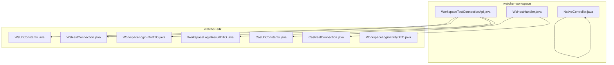
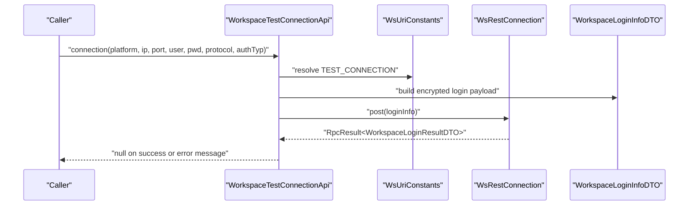
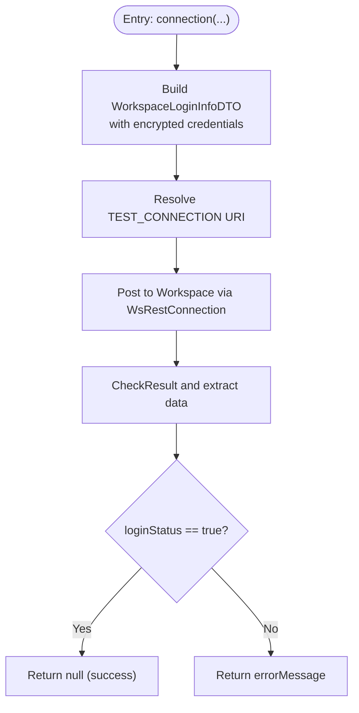
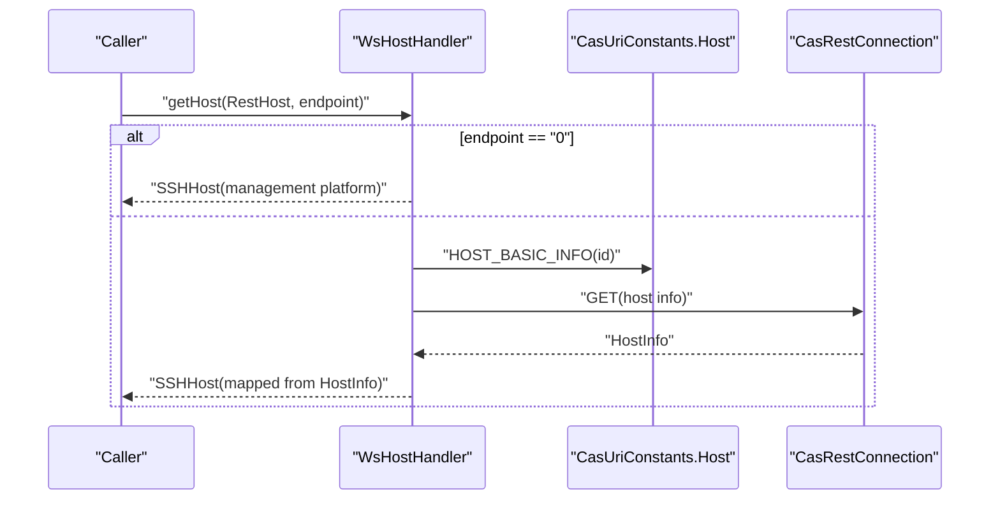
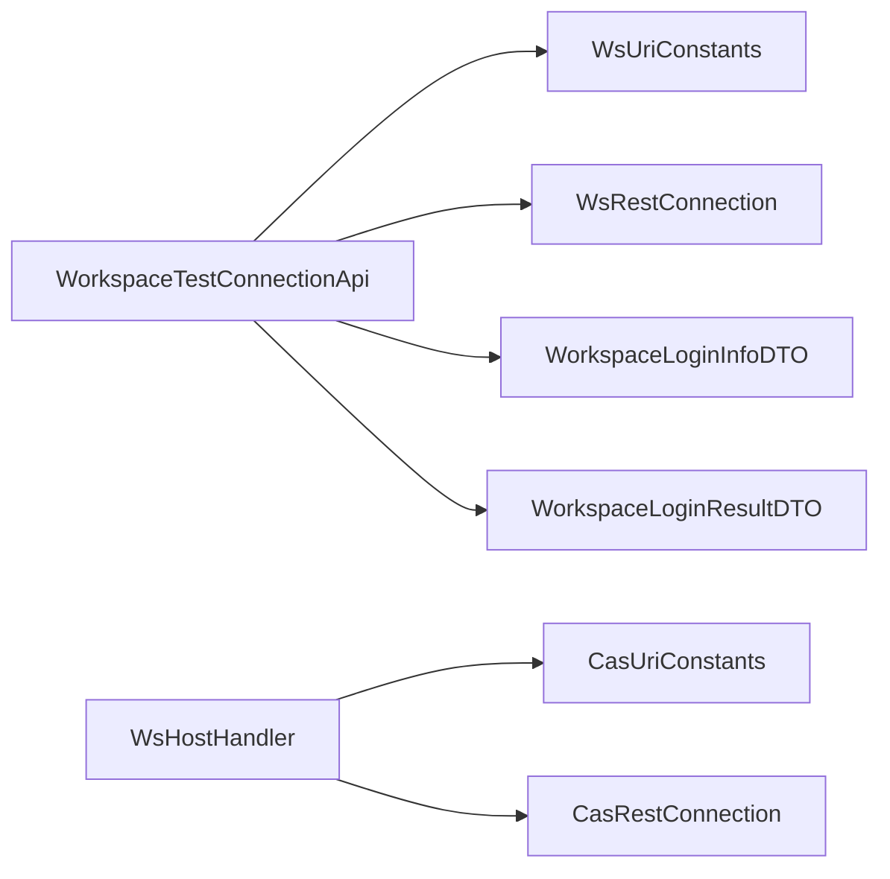

# API Integration

<cite>
**Referenced Files in This Document**
- [WorkspaceTestConnectionApi.java](file://watcher-workspace/src/main/java/com/virtual/cloud/om/workspace/service/WorkspaceTestConnectionApi.java)
- [WsHostHandler.java](file://watcher-workspace/src/main/java/com/virtual/cloud/om/workspace/service/WsHostHandler.java)
- [NativeController.java](file://watcher-workspace/src/main/java/com/virtual/cloud/om/workspace/web/NativeController.java)
- [WorkspaceLoginInfoDTO.java](file://watcher-sdk/src/main/java/com/virtual/cloud/om/sdk/dto/testConnection/WorkspaceLoginInfoDTO.java)
- [WorkspaceLoginResultDTO.java](file://watcher-sdk/src/main/java/com/virtual/cloud/om/sdk/dto/testConnection/WorkspaceLoginResultDTO.java)
- [WorkspaceLoginEntityDTO.java](file://watcher-sdk/src/main/java/com/virtual/cloud/om/sdk/dto/token/WorkspaceLoginEntityDTO.java)
- [WsUriConstants.java](file://watcher-sdk/src/main/java/com/virtual/cloud/om/sdk/constant/uri/WsUriConstants.java)
- [CasUriConstants.java](file://watcher-sdk/src/main/java/com/virtual/cloud/om/sdk/constant/uri/CasUriConstants.java)
- [WsRestConnection.java](file://watcher-sdk/src/main/java/com/virtual/cloud/om/sdk/config/rest/workspace/WsRestConnection.java)
- [CasRestConnection.java](file://watcher-sdk/src/main/java/com/virtual/cloud/om/sdk/config/rest/cas/CasRestConnection.java)
</cite>

## Table of Contents
1. [Introduction](#introduction)
2. [Project Structure](#project-structure)
3. [Core Components](#core-components)
4. [Architecture Overview](#architecture-overview)
5. [Detailed Component Analysis](#detailed-component-analysis)
6. [Dependency Analysis](#dependency-analysis)
7. [Performance Considerations](#performance-considerations)
8. [Security Considerations](#security-considerations)
9. [Troubleshooting Guide](#troubleshooting-guide)
10. [Conclusion](#conclusion)
11. [Appendices](#appendices)

## Introduction
This document explains the Workspace API integration components within the ShowTime ecosystem. It focuses on:
- Connectivity testing via WorkspaceTestConnectionApi
- Host management through WsHostHandler
- Native endpoint exposure via NativeController
- REST API patterns, authentication, and error handling
- Examples of request/response flows and integration workflows
- Guidelines for extending functionality and integrating with external monitoring systems

## Project Structure
The Workspace integration spans two modules:
- watcher-workspace: Implements Workspace-specific APIs and endpoints
- watcher-sdk: Provides shared DTOs, URIs, and REST connection abstractions used across integrations

Key areas:
- WorkspaceTestConnectionApi orchestrates authentication and connectivity checks against Workspace endpoints
- WsHostHandler bridges Workspace host queries to CAS REST endpoints for SSH host provisioning
- NativeController exposes a simple health endpoint for internal diagnostics
- Shared SDK components define URIs, DTOs, and REST clients used by Workspace and other platforms

**Diagram sources**
- [WorkspaceTestConnectionApi.java:1-44](file://watcher-workspace/src/main/java/com/virtual/cloud/om/workspace/service/WorkspaceTestConnectionApi.java#L1-L44)
- [WsHostHandler.java:1-63](file://watcher-workspace/src/main/java/com/virtual/cloud/om/workspace/service/WsHostHandler.java#L1-L63)
- [NativeController.java:1-19](file://watcher-workspace/src/main/java/com/virtual/cloud/om/workspace/web/NativeController.java#L1-L19)
- [WsUriConstants.java:1-195](file://watcher-sdk/src/main/java/com/virtual/cloud/om/sdk/constant/uri/WsUriConstants.java#L1-L195)
- [CasUriConstants.java:1-822](file://watcher-sdk/src/main/java/com/virtual/cloud/om/sdk/constant/uri/CasUriConstants.java#L1-L822)
- [WsRestConnection.java](file://watcher-sdk/src/main/java/com/virtual/cloud/om/sdk/config/rest/workspace/WsRestConnection.java)
- [CasRestConnection.java](file://watcher-sdk/src/main/java/com/virtual/cloud/om/sdk/config/rest/cas/CasRestConnection.java)
- [WorkspaceLoginInfoDTO.java:1-49](file://watcher-sdk/src/main/java/com/virtual/cloud/om/sdk/dto/testConnection/WorkspaceLoginInfoDTO.java#L1-L49)
- [WorkspaceLoginResultDTO.java:1-30](file://watcher-sdk/src/main/java/com/virtual/cloud/om/sdk/dto/testConnection/WorkspaceLoginResultDTO.java#L1-L30)
- [WorkspaceLoginEntityDTO.java:1-11](file://watcher-sdk/src/main/java/com/virtual/cloud/om/sdk/dto/token/WorkspaceLoginEntityDTO.java#L1-L11)

**Section sources**
- [WorkspaceTestConnectionApi.java:1-44](file://watcher-workspace/src/main/java/com/virtual/cloud/om/workspace/service/WorkspaceTestConnectionApi.java#L1-L44)
- [WsHostHandler.java:1-63](file://watcher-workspace/src/main/java/com/virtual/cloud/om/workspace/service/WsHostHandler.java#L1-L63)
- [NativeController.java:1-19](file://watcher-workspace/src/main/java/com/virtual/cloud/om/workspace/web/NativeController.java#L1-L19)
- [WsUriConstants.java:1-195](file://watcher-sdk/src/main/java/com/virtual/cloud/om/sdk/constant/uri/WsUriConstants.java#L1-L195)
- [CasUriConstants.java:1-822](file://watcher-sdk/src/main/java/com/virtual/cloud/om/sdk/constant/uri/CasUriConstants.java#L1-L822)
- [WsRestConnection.java](file://watcher-sdk/src/main/java/com/virtual/cloud/om/sdk/config/rest/workspace/WsRestConnection.java)
- [CasRestConnection.java](file://watcher-sdk/src/main/java/com/virtual/cloud/om/sdk/config/rest/cas/CasRestConnection.java)
- [WorkspaceLoginInfoDTO.java:1-49](file://watcher-sdk/src/main/java/com/virtual/cloud/om/sdk/dto/testConnection/WorkspaceLoginInfoDTO.java#L1-L49)
- [WorkspaceLoginResultDTO.java:1-30](file://watcher-sdk/src/main/java/com/virtual/cloud/om/sdk/dto/testConnection/WorkspaceLoginResultDTO.java#L1-L30)
- [WorkspaceLoginEntityDTO.java:1-11](file://watcher-sdk/src/main/java/com/virtual/cloud/om/sdk/dto/token/WorkspaceLoginEntityDTO.java#L1-L11)

## Core Components
- WorkspaceTestConnectionApi: Validates Workspace service connectivity and authentication using encrypted credentials and a dedicated test endpoint.
- WsHostHandler: Resolves Workspace host identifiers to SSH-ready hosts by querying CAS for host details.
- NativeController: Exposes a lightweight GET endpoint for basic health checks.

**Section sources**
- [WorkspaceTestConnectionApi.java:20-42](file://watcher-workspace/src/main/java/com/virtual/cloud/om/workspace/service/WorkspaceTestConnectionApi.java#L20-L42)
- [WsHostHandler.java:26-61](file://watcher-workspace/src/main/java/com/virtual/cloud/om/workspace/service/WsHostHandler.java#L26-L61)
- [NativeController.java:10-17](file://watcher-workspace/src/main/java/com/virtual/cloud/om/workspace/web/NativeController.java#L10-L17)

## Architecture Overview
The Workspace integration follows a layered pattern:
- Service layer (WorkspaceTestConnectionApi, WsHostHandler) encapsulates business logic
- SDK layer (URIs, DTOs, REST clients) provides reusable infrastructure
- REST clients (WsRestConnection, CasRestConnection) abstract HTTP communication

**Diagram sources**
- [WorkspaceTestConnectionApi.java:23-36](file://watcher-workspace/src/main/java/com/virtual/cloud/om/workspace/service/WorkspaceTestConnectionApi.java#L23-L36)
- [WsUriConstants.java:39-42](file://watcher-sdk/src/main/java/com/virtual/cloud/om/sdk/constant/uri/WsUriConstants.java#L39-L42)
- [WorkspaceLoginInfoDTO.java:17-48](file://watcher-sdk/src/main/java/com/virtual/cloud/om/sdk/dto/testConnection/WorkspaceLoginInfoDTO.java#L17-L48)
- [WorkspaceLoginResultDTO.java:12-29](file://watcher-sdk/src/main/java/com/virtual/cloud/om/sdk/dto/testConnection/WorkspaceLoginResultDTO.java#L12-L29)
- [WsRestConnection.java](file://watcher-sdk/src/main/java/com/virtual/cloud/om/sdk/config/rest/workspace/WsRestConnection.java)

**Section sources**
- [WorkspaceTestConnectionApi.java:23-36](file://watcher-workspace/src/main/java/com/virtual/cloud/om/workspace/service/WorkspaceTestConnectionApi.java#L23-L36)
- [WsUriConstants.java:39-42](file://watcher-sdk/src/main/java/com/virtual/cloud/om/sdk/constant/uri/WsUriConstants.java#L39-L42)
- [WorkspaceLoginInfoDTO.java:17-48](file://watcher-sdk/src/main/java/com/virtual/cloud/om/sdk/dto/testConnection/WorkspaceLoginInfoDTO.java#L17-L48)
- [WorkspaceLoginResultDTO.java:12-29](file://watcher-sdk/src/main/java/com/virtual/cloud/om/sdk/dto/testConnection/WorkspaceLoginResultDTO.java#L12-L29)
- [WsRestConnection.java](file://watcher-sdk/src/main/java/com/virtual/cloud/om/sdk/config/rest/workspace/WsRestConnection.java)

## Detailed Component Analysis

### WorkspaceTestConnectionApi
Responsibilities:
- Build encrypted login payload from provided credentials
- Call Workspace test connection endpoint
- Interpret RPC result and return either success (null) or error message

Processing logic:
- Resolve test connection URI from WsUriConstants
- Encrypt username and password using SM4 utilities
- Post payload to Workspace via WsRestConnection
- Validate result and extract login status and error message

**Diagram sources**
- [WorkspaceTestConnectionApi.java:23-36](file://watcher-workspace/src/main/java/com/virtual/cloud/om/workspace/service/WorkspaceTestConnectionApi.java#L23-L36)
- [WorkspaceLoginInfoDTO.java:17-48](file://watcher-sdk/src/main/java/com/virtual/cloud/om/sdk/dto/testConnection/WorkspaceLoginInfoDTO.java#L17-L48)
- [WorkspaceLoginResultDTO.java:12-29](file://watcher-sdk/src/main/java/com/virtual/cloud/om/sdk/dto/testConnection/WorkspaceLoginResultDTO.java#L12-L29)
- [WsRestConnection.java](file://watcher-sdk/src/main/java/com/virtual/cloud/om/sdk/config/rest/workspace/WsRestConnection.java)

**Section sources**
- [WorkspaceTestConnectionApi.java:23-36](file://watcher-workspace/src/main/java/com/virtual/cloud/om/workspace/service/WorkspaceTestConnectionApi.java#L23-L36)
- [WorkspaceLoginInfoDTO.java:17-48](file://watcher-sdk/src/main/java/com/virtual/cloud/om/sdk/dto/testConnection/WorkspaceLoginInfoDTO.java#L17-L48)
- [WorkspaceLoginResultDTO.java:12-29](file://watcher-sdk/src/main/java/com/virtual/cloud/om/sdk/dto/testConnection/WorkspaceLoginResultDTO.java#L12-L29)
- [WsRestConnection.java](file://watcher-sdk/src/main/java/com/virtual/cloud/om/sdk/config/rest/workspace/WsRestConnection.java)

### WsHostHandler
Responsibilities:
- Convert a generic RestHost into an SSHHost suitable for remote operations
- Query all host IDs from CAS for Workspace-managed environments
- Identify platform association for reporting and routing

Processing logic:
- Special-case management platform endpoint ("0") to construct an SSHHost directly
- Otherwise, resolve host details via CAS REST endpoint and map to SSHHost
- Enumerate all host IDs by querying CAS host list

**Diagram sources**
- [WsHostHandler.java:32-43](file://watcher-workspace/src/main/java/com/virtual/cloud/om/workspace/service/WsHostHandler.java#L32-L43)
- [CasUriConstants.java:98-103](file://watcher-sdk/src/main/java/com/virtual/cloud/om/sdk/constant/uri/CasUriConstants.java#L98-L103)
- [CasRestConnection.java](file://watcher-sdk/src/main/java/com/virtual/cloud/om/sdk/config/rest/cas/CasRestConnection.java)

**Section sources**
- [WsHostHandler.java:31-43](file://watcher-workspace/src/main/java/com/virtual/cloud/om/workspace/service/WsHostHandler.java#L31-L43)
- [CasUriConstants.java:98-103](file://watcher-sdk/src/main/java/com/virtual/cloud/om/sdk/constant/uri/CasUriConstants.java#L98-L103)
- [CasRestConnection.java](file://watcher-sdk/src/main/java/com/virtual/cloud/om/sdk/config/rest/cas/CasRestConnection.java)

### NativeController
Responsibilities:
- Provide a simple GET endpoint under /home for basic health checks

Usage:
- GET /home returns a textual home page indicator

**Section sources**
- [NativeController.java:14-17](file://watcher-workspace/src/main/java/com/virtual/cloud/om/workspace/web/NativeController.java#L14-L17)

## Dependency Analysis
Relationships:
- WorkspaceTestConnectionApi depends on WsUriConstants for endpoint resolution and WsRestConnection for HTTP transport
- WsHostHandler depends on CasUriConstants and CasRestConnection for host enumeration and resolution
- Both services rely on SDK DTOs for request/response modeling

**Diagram sources**
- [WorkspaceTestConnectionApi.java:20-42](file://watcher-workspace/src/main/java/com/virtual/cloud/om/workspace/service/WorkspaceTestConnectionApi.java#L20-L42)
- [WsHostHandler.java:26-61](file://watcher-workspace/src/main/java/com/virtual/cloud/om/workspace/service/WsHostHandler.java#L26-L61)
- [WsUriConstants.java:39-42](file://watcher-sdk/src/main/java/com/virtual/cloud/om/sdk/constant/uri/WsUriConstants.java#L39-L42)
- [CasUriConstants.java:98-103](file://watcher-sdk/src/main/java/com/virtual/cloud/om/sdk/constant/uri/CasUriConstants.java#L98-L103)
- [WsRestConnection.java](file://watcher-sdk/src/main/java/com/virtual/cloud/om/sdk/config/rest/workspace/WsRestConnection.java)
- [CasRestConnection.java](file://watcher-sdk/src/main/java/com/virtual/cloud/om/sdk/config/rest/cas/CasRestConnection.java)
- [WorkspaceLoginInfoDTO.java:17-48](file://watcher-sdk/src/main/java/com/virtual/cloud/om/sdk/dto/testConnection/WorkspaceLoginInfoDTO.java#L17-L48)
- [WorkspaceLoginResultDTO.java:12-29](file://watcher-sdk/src/main/java/com/virtual/cloud/om/sdk/dto/testConnection/WorkspaceLoginResultDTO.java#L12-L29)

**Section sources**
- [WorkspaceTestConnectionApi.java:20-42](file://watcher-workspace/src/main/java/com/virtual/cloud/om/workspace/service/WorkspaceTestConnectionApi.java#L20-L42)
- [WsHostHandler.java:26-61](file://watcher-workspace/src/main/java/com/virtual/cloud/om/workspace/service/WsHostHandler.java#L26-L61)
- [WsUriConstants.java:39-42](file://watcher-sdk/src/main/java/com/virtual/cloud/om/sdk/constant/uri/WsUriConstants.java#L39-L42)
- [CasUriConstants.java:98-103](file://watcher-sdk/src/main/java/com/virtual/cloud/om/sdk/constant/uri/CasUriConstants.java#L98-L103)
- [WsRestConnection.java](file://watcher-sdk/src/main/java/com/virtual/cloud/om/sdk/config/rest/workspace/WsRestConnection.java)
- [CasRestConnection.java](file://watcher-sdk/src/main/java/com/virtual/cloud/om/sdk/config/rest/cas/CasRestConnection.java)
- [WorkspaceLoginInfoDTO.java:17-48](file://watcher-sdk/src/main/java/com/virtual/cloud/om/sdk/dto/testConnection/WorkspaceLoginInfoDTO.java#L17-L48)
- [WorkspaceLoginResultDTO.java:12-29](file://watcher-sdk/src/main/java/com/virtual/cloud/om/sdk/dto/testConnection/WorkspaceLoginResultDTO.java#L12-L29)

## Performance Considerations
- Minimize round trips by batching host queries where feasible
- Cache decrypted or derived host metadata when safe and appropriate
- Use streaming or pagination for large host lists to reduce memory footprint
- Monitor latency of Workspace and CAS endpoints; consider retry/backoff strategies for transient failures

## Security Considerations
- Credentials encryption: WorkspaceTestConnectionApi encrypts username and password before transmission using SM4 utilities
- Endpoint scope: Ensure URIs are restricted to intended operations; avoid exposing administrative endpoints publicly
- Authentication: Prefer token-based or session-based authentication where applicable; avoid plaintext credentials in logs
- Transport security: Enforce HTTPS/TLS for all REST calls to Workspace and CAS
- Least privilege: Limit permissions granted to Workspace service accounts

**Section sources**
- [WorkspaceTestConnectionApi.java:27-28](file://watcher-workspace/src/main/java/com/virtual/cloud/om/workspace/service/WorkspaceTestConnectionApi.java#L27-L28)
- [WorkspaceLoginInfoDTO.java:27-32](file://watcher-sdk/src/main/java/com/virtual/cloud/om/sdk/dto/testConnection/WorkspaceLoginInfoDTO.java#L27-L32)

## Troubleshooting Guide
Common issues and resolutions:
- Authentication failure
  - Verify encrypted credentials and endpoint parameters
  - Confirm Workspace service availability and reachability
  - Check error message returned by WorkspaceTestConnectionApi for actionable details
- Host resolution errors
  - Validate CAS connectivity and endpoint correctness
  - Inspect exceptions during host enumeration and fallback to empty set behavior
- Health endpoint not responding
  - Confirm route registration and controller accessibility
  - Check server logs for startup errors

Operational tips:
- Enable structured logging around REST calls to capture request/response metadata without sensitive data
- Integrate circuit breakers for downstream services to prevent cascading failures
- Add metrics for latency and error rates to detect degradation early

**Section sources**
- [WorkspaceTestConnectionApi.java:34-36](file://watcher-workspace/src/main/java/com/virtual/cloud/om/workspace/service/WorkspaceTestConnectionApi.java#L34-L36)
- [WsHostHandler.java:49-55](file://watcher-workspace/src/main/java/com/virtual/cloud/om/workspace/service/WsHostHandler.java#L49-L55)
- [NativeController.java:14-17](file://watcher-workspace/src/main/java/com/virtual/cloud/om/workspace/web/NativeController.java#L14-L17)

## Conclusion
The Workspace integration leverages a clean separation of concerns: secure connectivity testing, robust host management bridged to CAS, and minimal native endpoints for diagnostics. By adhering to the documented patterns, extending functionality, and applying the recommended security and performance practices, teams can reliably integrate Workspace services into broader monitoring and automation workflows.

## Appendices

### REST API Patterns and Contracts
- Workspace connectivity test
  - Method: POST
  - Path: resolved from WsUriConstants.Test.TEST_CONNECTION
  - Request body: WorkspaceLoginInfoDTO
  - Response: WorkspaceLoginResultDTO
  - Success: loginStatus true; Failure: errorMessage present

- Host resolution
  - Method: GET
  - Paths:
    - Host details: CasUriConstants.Host.HOST_BASIC_INFO(id)
    - All hosts: CasUriConstants.Host.HOST_BASIC_INFO_ALL
  - Response: HostInfo for single host; List<RsHost> for all hosts
  - Mapping: HostInfo mapped to SSHHost for remote operations

- Native health endpoint
  - Method: GET
  - Path: /home
  - Response: Plain text indicator

**Section sources**
- [WsUriConstants.java:39-42](file://watcher-sdk/src/main/java/com/virtual/cloud/om/sdk/constant/uri/WsUriConstants.java#L39-L42)
- [WorkspaceLoginInfoDTO.java:17-48](file://watcher-sdk/src/main/java/com/virtual/cloud/om/sdk/dto/testConnection/WorkspaceLoginInfoDTO.java#L17-L48)
- [WorkspaceLoginResultDTO.java:12-29](file://watcher-sdk/src/main/java/com/virtual/cloud/om/sdk/dto/testConnection/WorkspaceLoginResultDTO.java#L12-L29)
- [CasUriConstants.java:98-103](file://watcher-sdk/src/main/java/com/virtual/cloud/om/sdk/constant/uri/CasUriConstants.java#L98-L103)
- [WsHostHandler.java:32-55](file://watcher-workspace/src/main/java/com/virtual/cloud/om/workspace/service/WsHostHandler.java#L32-L55)
- [NativeController.java:14-17](file://watcher-workspace/src/main/java/com/virtual/cloud/om/workspace/web/NativeController.java#L14-L17)

### Extending API Functionality and Custom Endpoints
- Adding a new Workspace endpoint
  - Define URI in WsUriConstants
  - Create request/response DTOs in watcher-sdk DTO packages
  - Implement service method similar to WorkspaceTestConnectionApi
  - Wire HTTP client via WsRestConnection
- Creating custom endpoints
  - Add a new controller under watcher-workspace web package
  - Apply appropriate request mappings and security constraints
  - Return standardized DTOs or wrappers for consistent handling

[No sources needed since this section provides general guidance]