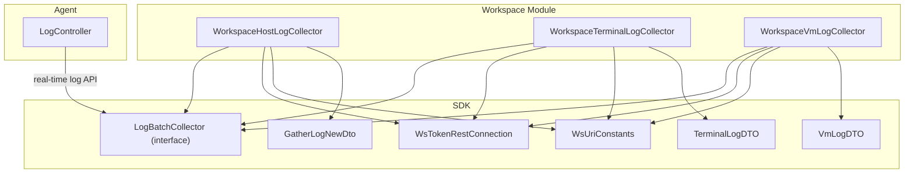
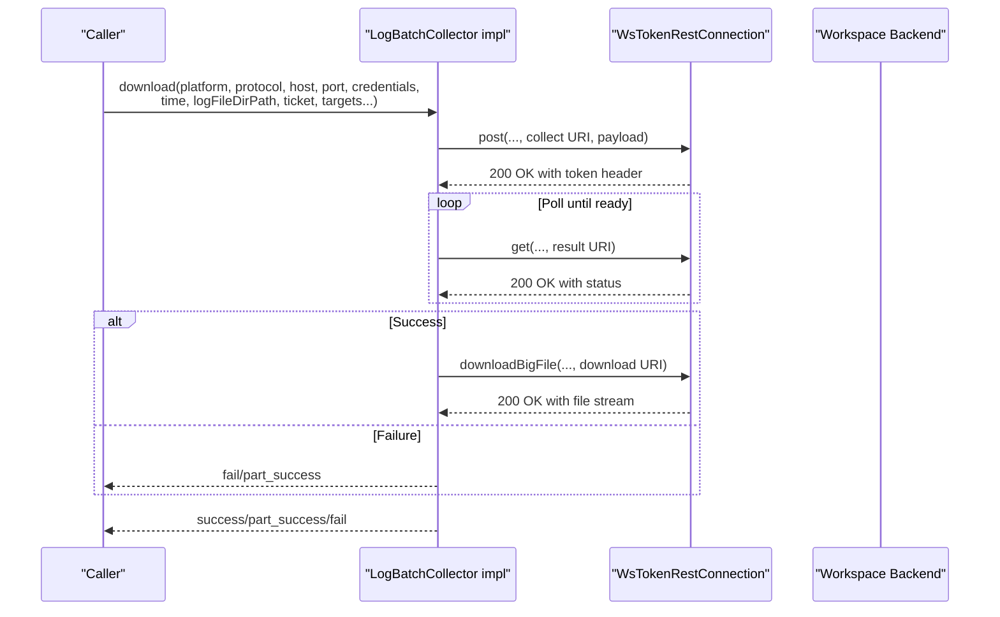
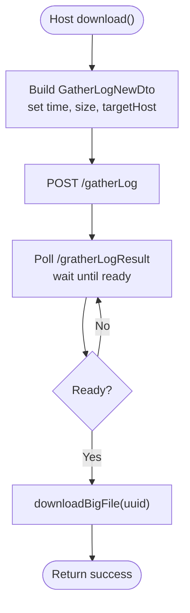
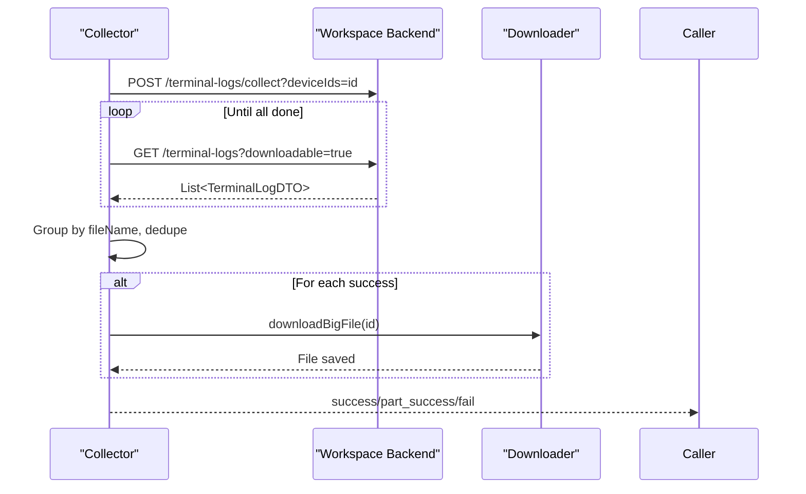
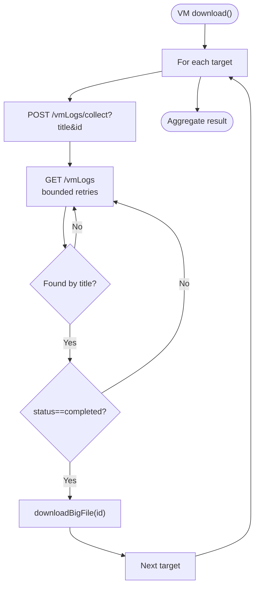
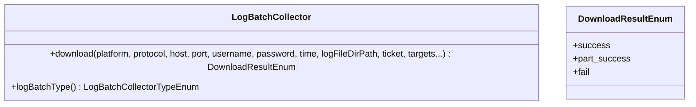
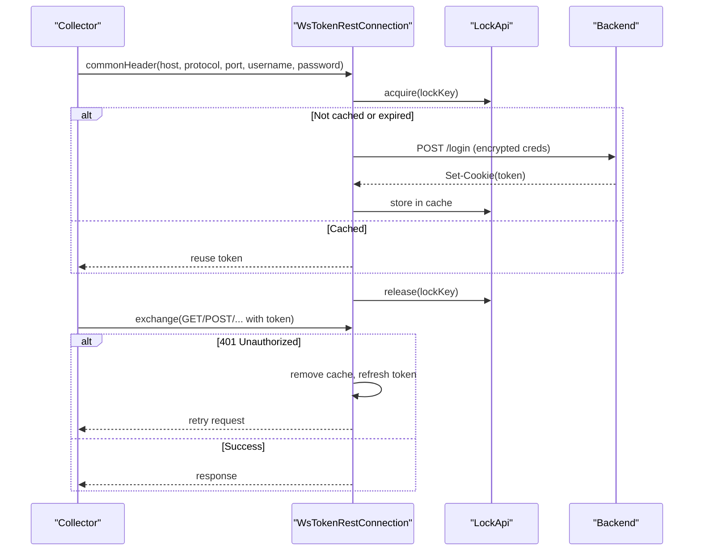
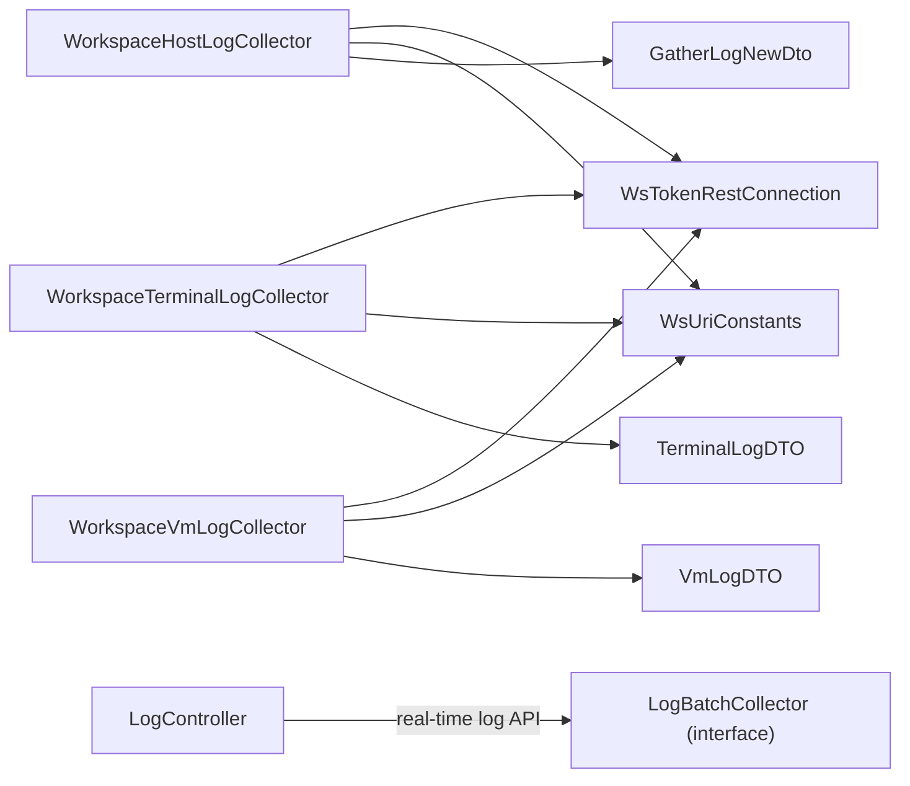

# Batch Log Processing

<cite>
**Referenced Files in This Document**
- [WorkspaceHostLogCollector.java](file://watcher-workspace/src/main/java/com/virtual/cloud/om/workspace/service/batchlog/WorkspaceHostLogCollector.java)
- [WorkspaceTerminalLogCollector.java](file://watcher-workspace/src/main/java/com/virtual/cloud/om/workspace/service/batchlog/WorkspaceTerminalLogCollector.java)
- [WorkspaceVmLogCollector.java](file://watcher-workspace/src/main/java/com/virtual/cloud/om/workspace/service/batchlog/WorkspaceVmLogCollector.java)
- [LogBatchCollector.java](file://watcher-sdk/src/main/java/com/virtual/cloud/om/sdk/api/LogBatchCollector.java)
- [WsUriConstants.java](file://watcher-sdk/src/main/java/com/virtual/cloud/om/sdk/constant/uri/WsUriConstants.java)
- [WsTokenRestConnection.java](file://watcher-sdk/src/main/java/com/virtual/cloud/om/sdk/config/token/workspace/WsTokenRestConnection.java)
- [GatherLogNewDto.java](file://watcher-sdk/src/main/java/com/virtual/cloud/om/sdk/dto/logBatch/GatherLogNewDto.java)
- [VmLogDTO.java](file://watcher-sdk/src/main/java/com/virtual/cloud/om/sdk/dto/logBatch/VmLogDTO.java)
- [TerminalLogDTO.java](file://watcher-sdk/src/main/java/com/virtual/cloud/om/sdk/dto/logBatch/TerminalLogDTO.java)
- [LogController.java](file://watcher-agent/src/main/java/com/virtual/cloud/om/agent/controller/LogController.java)
</cite>

## Table of Contents
1. [Introduction](#introduction)
2. [Project Structure](#project-structure)
3. [Core Components](#core-components)
4. [Architecture Overview](#architecture-overview)
5. [Detailed Component Analysis](#detailed-component-analysis)
6. [Dependency Analysis](#dependency-analysis)
7. [Performance Considerations](#performance-considerations)
8. [Troubleshooting Guide](#troubleshooting-guide)
9. [Conclusion](#conclusion)
10. [Appendices](#appendices)

## Introduction
This document describes the Workspace batch log processing system responsible for collecting host logs, terminal logs, and virtual machine (VM) logs. It explains how WorkspaceHostLogCollector aggregates system-level host logs, WorkspaceTerminalLogCollector tracks terminal activity, and WorkspaceVmLogCollector processes VM-specific logs. The documentation covers collection mechanisms, REST integration with the Workspace backend, batch processing workflows, parsing strategies, data extraction patterns, storage optimization, configuration parameters, and performance considerations.

## Project Structure
The batch log processing resides in the Workspace module and leverages shared SDK components for REST communication, DTOs, and URI constants. The Agent module exposes a log search endpoint that integrates with real-time log APIs.

**Diagram sources**
- [WorkspaceHostLogCollector.java:30-95](file://watcher-workspace/src/main/java/com/virtual/cloud/om/workspace/service/batchlog/WorkspaceHostLogCollector.java#L30-L95)
- [WorkspaceTerminalLogCollector.java:31-153](file://watcher-workspace/src/main/java/com/virtual/cloud/om/workspace/service/batchlog/WorkspaceTerminalLogCollector.java#L31-L153)
- [WorkspaceVmLogCollector.java:33-153](file://watcher-workspace/src/main/java/com/virtual/cloud/om/workspace/service/batchlog/WorkspaceVmLogCollector.java#L33-L153)
- [LogBatchCollector.java:6-33](file://watcher-sdk/src/main/java/com/virtual/cloud/om/sdk/api/LogBatchCollector.java#L6-L33)
- [WsUriConstants.java:6-42](file://watcher-sdk/src/main/java/com/virtual/cloud/om/sdk/constant/uri/WsUriConstants.java#L6-L42)
- [WsTokenRestConnection.java:42-380](file://watcher-sdk/src/main/java/com/virtual/cloud/om/sdk/config/token/workspace/WsTokenRestConnection.java#L42-L380)
- [GatherLogNewDto.java:8-15](file://watcher-sdk/src/main/java/com/virtual/cloud/om/sdk/dto/logBatch/GatherLogNewDto.java#L8-L15)
- [VmLogDTO.java:10-28](file://watcher-sdk/src/main/java/com/virtual/cloud/om/sdk/dto/logBatch/VmLogDTO.java#L10-L28)
- [TerminalLogDTO.java:13-30](file://watcher-sdk/src/main/java/com/virtual/cloud/om/sdk/dto/logBatch/TerminalLogDTO.java#L13-L30)
- [LogController.java:20-36](file://watcher-agent/src/main/java/com/virtual/cloud/om/agent/controller/LogController.java#L20-L36)

**Section sources**
- [WorkspaceHostLogCollector.java:30-95](file://watcher-workspace/src/main/java/com/virtual/cloud/om/workspace/service/batchlog/WorkspaceHostLogCollector.java#L30-L95)
- [WorkspaceTerminalLogCollector.java:31-153](file://watcher-workspace/src/main/java/com/virtual/cloud/om/workspace/service/batchlog/WorkspaceTerminalLogCollector.java#L31-L153)
- [WorkspaceVmLogCollector.java:33-153](file://watcher-workspace/src/main/java/com/virtual/cloud/om/workspace/service/batchlog/WorkspaceVmLogCollector.java#L33-L153)
- [LogBatchCollector.java:6-33](file://watcher-sdk/src/main/java/com/virtual/cloud/om/sdk/api/LogBatchCollector.java#L6-L33)
- [WsUriConstants.java:6-42](file://watcher-sdk/src/main/java/com/virtual/cloud/om/sdk/constant/uri/WsUriConstants.java#L6-L42)
- [WsTokenRestConnection.java:42-380](file://watcher-sdk/src/main/java/com/virtual/cloud/om/sdk/config/token/workspace/WsTokenRestConnection.java#L42-L380)
- [GatherLogNewDto.java:8-15](file://watcher-sdk/src/main/java/com/virtual/cloud/om/sdk/dto/logBatch/GatherLogNewDto.java#L8-L15)
- [VmLogDTO.java:10-28](file://watcher-sdk/src/main/java/com/virtual/cloud/om/sdk/dto/logBatch/VmLogDTO.java#L10-L28)
- [TerminalLogDTO.java:13-30](file://watcher-sdk/src/main/java/com/virtual/cloud/om/sdk/dto/logBatch/TerminalLogDTO.java#L13-L30)
- [LogController.java:20-36](file://watcher-agent/src/main/java/com/virtual/cloud/om/agent/controller/LogController.java#L20-L36)

## Core Components
- WorkspaceHostLogCollector: Initiates host log collection via a gather operation, polls for readiness, and downloads aggregated logs as a zip archive.
- WorkspaceTerminalLogCollector: Triggers per-terminal log collection, waits for completion, deduplicates by filename, and downloads successful results.
- WorkspaceVmLogCollector: Triggers per-VM log collection, polls for completion, filters by VM title, and downloads successful results.
- LogBatchCollector: Shared interface defining the batch log collection contract and result semantics.
- WsTokenRestConnection: Manages Workspace authentication tokens, builds HTTP requests, retries on unauthorized errors, and performs large file downloads.
- WsUriConstants: Centralized URIs for gather, poll, and download operations for hosts, terminals, and VMs.
- DTOs: GatherLogNewDto, VmLogDTO, TerminalLogDTO define payload and response structures for batch log operations.

**Section sources**
- [WorkspaceHostLogCollector.java:33-95](file://watcher-workspace/src/main/java/com/virtual/cloud/om/workspace/service/batchlog/WorkspaceHostLogCollector.java#L33-L95)
- [WorkspaceTerminalLogCollector.java:34-153](file://watcher-workspace/src/main/java/com/virtual/cloud/om/workspace/service/batchlog/WorkspaceTerminalLogCollector.java#L34-L153)
- [WorkspaceVmLogCollector.java:36-153](file://watcher-workspace/src/main/java/com/virtual/cloud/om/workspace/service/batchlog/WorkspaceVmLogCollector.java#L36-L153)
- [LogBatchCollector.java:6-33](file://watcher-sdk/src/main/java/com/virtual/cloud/om/sdk/api/LogBatchCollector.java#L6-L33)
- [WsTokenRestConnection.java:54-121](file://watcher-sdk/src/main/java/com/virtual/cloud/om/sdk/config/token/workspace/WsTokenRestConnection.java#L54-L121)
- [WsUriConstants.java:7-32](file://watcher-sdk/src/main/java/com/virtual/cloud/om/sdk/constant/uri/WsUriConstants.java#L7-L32)
- [GatherLogNewDto.java:8-15](file://watcher-sdk/src/main/java/com/virtual/cloud/om/sdk/dto/logBatch/GatherLogNewDto.java#L8-L15)
- [VmLogDTO.java:10-28](file://watcher-sdk/src/main/java/com/virtual/cloud/om/sdk/dto/logBatch/VmLogDTO.java#L10-L28)
- [TerminalLogDTO.java:13-30](file://watcher-sdk/src/main/java/com/virtual/cloud/om/sdk/dto/logBatch/TerminalLogDTO.java#L13-L30)

## Architecture Overview
The batch log collectors implement a standardized workflow:
- Build a request payload (where applicable)
- Trigger collection on the Workspace backend
- Poll for completion with bounded retries
- Filter and deduplicate results
- Download artifacts to a configured directory

**Diagram sources**
- [WorkspaceHostLogCollector.java:34-88](file://watcher-workspace/src/main/java/com/virtual/cloud/om/workspace/service/batchlog/WorkspaceHostLogCollector.java#L34-L88)
- [WorkspaceTerminalLogCollector.java:34-97](file://watcher-workspace/src/main/java/com/virtual/cloud/om/workspace/service/batchlog/WorkspaceTerminalLogCollector.java#L34-L97)
- [WorkspaceVmLogCollector.java:36-90](file://watcher-workspace/src/main/java/com/virtual/cloud/om/workspace/service/batchlog/WorkspaceVmLogCollector.java#L36-L90)
- [WsTokenRestConnection.java:128-177](file://watcher-sdk/src/main/java/com/virtual/cloud/om/sdk/config/token/workspace/WsTokenRestConnection.java#L128-L177)
- [WsUriConstants.java:7-32](file://watcher-sdk/src/main/java/com/virtual/cloud/om/sdk/constant/uri/WsUriConstants.java#L7-L32)

## Detailed Component Analysis

### WorkspaceHostLogCollector
Responsibilities:
- Builds a gather request with time window and target host selection
- Triggers log collection and polls for readiness
- Downloads aggregated logs as a single zip archive

Processing logic:
- Constructs a payload with time window and target host flag
- Calls the gather endpoint and validates RPC result
- Polls the result endpoint with a fixed interval until ready
- Validates UUID consistency and downloads the archive to the specified directory

**Diagram sources**
- [WorkspaceHostLogCollector.java:34-88](file://watcher-workspace/src/main/java/com/virtual/cloud/om/workspace/service/batchlog/WorkspaceHostLogCollector.java#L34-L88)
- [GatherLogNewDto.java:8-15](file://watcher-sdk/src/main/java/com/virtual/cloud/om/sdk/dto/logBatch/GatherLogNewDto.java#L8-L15)
- [WsUriConstants.java:7-12](file://watcher-sdk/src/main/java/com/virtual/cloud/om/sdk/constant/uri/WsUriConstants.java#L7-L12)
- [WsTokenRestConnection.java:353-373](file://watcher-sdk/src/main/java/com/virtual/cloud/om/sdk/config/token/workspace/WsTokenRestConnection.java#L353-L373)

**Section sources**
- [WorkspaceHostLogCollector.java:33-95](file://watcher-workspace/src/main/java/com/virtual/cloud/om/workspace/service/batchlog/WorkspaceHostLogCollector.java#L33-L95)
- [GatherLogNewDto.java:8-15](file://watcher-sdk/src/main/java/com/virtual/cloud/om/sdk/dto/logBatch/GatherLogNewDto.java#L8-L15)
- [WsUriConstants.java:7-12](file://watcher-sdk/src/main/java/com/virtual/cloud/om/sdk/constant/uri/WsUriConstants.java#L7-L12)
- [WsTokenRestConnection.java:353-373](file://watcher-sdk/src/main/java/com/virtual/cloud/om/sdk/config/token/workspace/WsTokenRestConnection.java#L353-L373)

### WorkspaceTerminalLogCollector
Responsibilities:
- Trigger per-terminal log collection asynchronously
- Poll for completion with bounded recursion
- Deduplicate by filename and download successful archives

Processing logic:
- For each target, posts to the terminal collect endpoint
- Polls the terminal logs list, with short delays and bounded retries
- Groups results by filename and selects the first occurrence
- Filters successful entries and downloads each archive to a subdirectory named after the collector type

**Diagram sources**
- [WorkspaceTerminalLogCollector.java:34-97](file://watcher-workspace/src/main/java/com/virtual/cloud/om/workspace/service/batchlog/WorkspaceTerminalLogCollector.java#L34-L97)
- [WsUriConstants.java:21-26](file://watcher-sdk/src/main/java/com/virtual/cloud/om/sdk/constant/uri/WsUriConstants.java#L21-L26)
- [TerminalLogDTO.java:13-30](file://watcher-sdk/src/main/java/com/virtual/cloud/om/sdk/dto/logBatch/TerminalLogDTO.java#L13-L30)
- [WsTokenRestConnection.java:353-373](file://watcher-sdk/src/main/java/com/virtual/cloud/om/sdk/config/token/workspace/WsTokenRestConnection.java#L353-L373)

**Section sources**
- [WorkspaceTerminalLogCollector.java:31-153](file://watcher-workspace/src/main/java/com/virtual/cloud/om/workspace/service/batchlog/WorkspaceTerminalLogCollector.java#L31-L153)
- [WsUriConstants.java:21-26](file://watcher-sdk/src/main/java/com/virtual/cloud/om/sdk/constant/uri/WsUriConstants.java#L21-L26)
- [TerminalLogDTO.java:13-30](file://watcher-sdk/src/main/java/com/virtual/cloud/om/sdk/dto/logBatch/TerminalLogDTO.java#L13-L30)
- [WsTokenRestConnection.java:353-373](file://watcher-sdk/src/main/java/com/virtual/cloud/om/sdk/config/token/workspace/WsTokenRestConnection.java#L353-L373)

### WorkspaceVmLogCollector
Responsibilities:
- Trigger per-VM log collection by title and VM ID
- Poll for completion with bounded recursion
- Select the matching VM log entry and download the archive

Processing logic:
- Posts to the VM collect endpoint with title and VM ID
- Polls the VM logs list, checks for presence and completion status
- Filters by title and downloads successful archives to a subdirectory named after the collector type

**Diagram sources**
- [WorkspaceVmLogCollector.java:36-90](file://watcher-workspace/src/main/java/com/virtual/cloud/om/workspace/service/batchlog/WorkspaceVmLogCollector.java#L36-L90)
- [WsUriConstants.java:14-19](file://watcher-sdk/src/main/java/com/virtual/cloud/om/sdk/constant/uri/WsUriConstants.java#L14-L19)
- [VmLogDTO.java:10-28](file://watcher-sdk/src/main/java/com/virtual/cloud/om/sdk/dto/logBatch/VmLogDTO.java#L10-L28)
- [WsTokenRestConnection.java:353-373](file://watcher-sdk/src/main/java/com/virtual/cloud/om/sdk/config/token/workspace/WsTokenRestConnection.java#L353-L373)

**Section sources**
- [WorkspaceVmLogCollector.java:33-153](file://watcher-workspace/src/main/java/com/virtual/cloud/om/workspace/service/batchlog/WorkspaceVmLogCollector.java#L33-L153)
- [WsUriConstants.java:14-19](file://watcher-sdk/src/main/java/com/virtual/cloud/om/sdk/constant/uri/WsUriConstants.java#L14-L19)
- [VmLogDTO.java:10-28](file://watcher-sdk/src/main/java/com/virtual/cloud/om/sdk/dto/logBatch/VmLogDTO.java#L10-L28)
- [WsTokenRestConnection.java:353-373](file://watcher-sdk/src/main/java/com/virtual/cloud/om/sdk/config/token/workspace/WsTokenRestConnection.java#L353-L373)

### LogBatchCollector Interface
Defines the contract for all batch log collectors, including the download method and result enumeration.

**Diagram sources**
- [LogBatchCollector.java:6-33](file://watcher-sdk/src/main/java/com/virtual/cloud/om/sdk/api/LogBatchCollector.java#L6-L33)

**Section sources**
- [LogBatchCollector.java:6-33](file://watcher-sdk/src/main/java/com/virtual/cloud/om/sdk/api/LogBatchCollector.java#L6-L33)

### WsTokenRestConnection
Manages authentication and HTTP operations:
- Token caching with locking to avoid concurrent refreshes
- Automatic retry on 401 with refreshed token
- Large file download support with cookie-based authentication

**Diagram sources**
- [WsTokenRestConnection.java:54-121](file://watcher-sdk/src/main/java/com/virtual/cloud/om/sdk/config/token/workspace/WsTokenRestConnection.java#L54-L121)
- [WsTokenRestConnection.java:128-177](file://watcher-sdk/src/main/java/com/virtual/cloud/om/sdk/config/token/workspace/WsTokenRestConnection.java#L128-L177)
- [WsTokenRestConnection.java:353-373](file://watcher-sdk/src/main/java/com/virtual/cloud/om/sdk/config/token/workspace/WsTokenRestConnection.java#L353-L373)

**Section sources**
- [WsTokenRestConnection.java:42-380](file://watcher-sdk/src/main/java/com/virtual/cloud/om/sdk/config/token/workspace/WsTokenRestConnection.java#L42-L380)

### DTOs and Payloads
- GatherLogNewDto: Defines the payload for host log gathering with time window, size limit, target host flag, and selected nodes.
- VmLogDTO: Describes VM log entries with identifiers, filenames, status, timestamps, and tenant/project metadata.
- TerminalLogDTO: Describes terminal log entries with device IDs, filenames, counts, timestamps, and tenant/project metadata.

**Section sources**
- [GatherLogNewDto.java:8-15](file://watcher-sdk/src/main/java/com/virtual/cloud/om/sdk/dto/logBatch/GatherLogNewDto.java#L8-L15)
- [VmLogDTO.java:10-28](file://watcher-sdk/src/main/java/com/virtual/cloud/om/sdk/dto/logBatch/VmLogDTO.java#L10-L28)
- [TerminalLogDTO.java:13-30](file://watcher-sdk/src/main/java/com/virtual/cloud/om/sdk/dto/logBatch/TerminalLogDTO.java#L13-L30)

## Dependency Analysis
- Workspace collectors depend on WsTokenRestConnection for authenticated HTTP operations and on WsUriConstants for endpoint URIs.
- Host collector depends on GatherLogNewDto for the payload.
- VM and terminal collectors depend on their respective DTOs for parsing responses.
- The Agent’s LogController integrates with real-time log APIs, complementing batch processing.

**Diagram sources**
- [WorkspaceHostLogCollector.java:31-95](file://watcher-workspace/src/main/java/com/virtual/cloud/om/workspace/service/batchlog/WorkspaceHostLogCollector.java#L31-L95)
- [WorkspaceTerminalLogCollector.java:31-153](file://watcher-workspace/src/main/java/com/virtual/cloud/om/workspace/service/batchlog/WorkspaceTerminalLogCollector.java#L31-L153)
- [WorkspaceVmLogCollector.java:33-153](file://watcher-workspace/src/main/java/com/virtual/cloud/om/workspace/service/batchlog/WorkspaceVmLogCollector.java#L33-L153)
- [WsTokenRestConnection.java:42-380](file://watcher-sdk/src/main/java/com/virtual/cloud/om/sdk/config/token/workspace/WsTokenRestConnection.java#L42-L380)
- [WsUriConstants.java:6-42](file://watcher-sdk/src/main/java/com/virtual/cloud/om/sdk/constant/uri/WsUriConstants.java#L6-L42)
- [GatherLogNewDto.java:8-15](file://watcher-sdk/src/main/java/com/virtual/cloud/om/sdk/dto/logBatch/GatherLogNewDto.java#L8-L15)
- [VmLogDTO.java:10-28](file://watcher-sdk/src/main/java/com/virtual/cloud/om/sdk/dto/logBatch/VmLogDTO.java#L10-L28)
- [TerminalLogDTO.java:13-30](file://watcher-sdk/src/main/java/com/virtual/cloud/om/sdk/dto/logBatch/TerminalLogDTO.java#L13-L30)
- [LogController.java:20-36](file://watcher-agent/src/main/java/com/virtual/cloud/om/agent/controller/LogController.java#L20-L36)

**Section sources**
- [WorkspaceHostLogCollector.java:31-95](file://watcher-workspace/src/main/java/com/virtual/cloud/om/workspace/service/batchlog/WorkspaceHostLogCollector.java#L31-L95)
- [WorkspaceTerminalLogCollector.java:31-153](file://watcher-workspace/src/main/java/com/virtual/cloud/om/workspace/service/batchlog/WorkspaceTerminalLogCollector.java#L31-L153)
- [WorkspaceVmLogCollector.java:33-153](file://watcher-workspace/src/main/java/com/virtual/cloud/om/workspace/service/batchlog/WorkspaceVmLogCollector.java#L33-L153)
- [WsTokenRestConnection.java:42-380](file://watcher-sdk/src/main/java/com/virtual/cloud/om/sdk/config/token/workspace/WsTokenRestConnection.java#L42-L380)
- [WsUriConstants.java:6-42](file://watcher-sdk/src/main/java/com/virtual/cloud/om/sdk/constant/uri/WsUriConstants.java#L6-L42)
- [GatherLogNewDto.java:8-15](file://watcher-sdk/src/main/java/com/virtual/cloud/om/sdk/dto/logBatch/GatherLogNewDto.java#L8-L15)
- [VmLogDTO.java:10-28](file://watcher-sdk/src/main/java/com/virtual/cloud/om/sdk/dto/logBatch/VmLogDTO.java#L10-L28)
- [TerminalLogDTO.java:13-30](file://watcher-sdk/src/main/java/com/virtual/cloud/om/sdk/dto/logBatch/TerminalLogDTO.java#L13-L30)
- [LogController.java:20-36](file://watcher-agent/src/main/java/com/virtual/cloud/om/agent/controller/LogController.java#L20-L36)

## Performance Considerations
- Asynchronous collection: Terminal and VM collectors use asynchronous futures to parallelize collection across multiple targets, reducing total latency.
- Bounded polling: Each collector applies a maximum recursion limit and short sleeps between polls to avoid excessive load.
- Deduplication: Terminal collector groups by filename and selects the first occurrence to prevent redundant downloads.
- Token caching: WsTokenRestConnection caches tokens and uses locks to avoid concurrent refresh storms.
- Large file downloads: Dedicated download method ensures efficient streaming and avoids loading entire archives into memory.
- Directory organization: Logs are written under a collector-type-named subdirectory to prevent collisions and simplify cleanup.

[No sources needed since this section provides general guidance]

## Troubleshooting Guide
Common issues and resolutions:
- Authentication failures (401): WsTokenRestConnection automatically refreshes the token and retries; verify credentials and network reachability to the Workspace backend.
- Collection not ready: Host collector polls with a fixed interval; ensure the Workspace backend is responsive and the time window is appropriate.
- Empty results or missing entries: Terminal and VM collectors enforce bounded retries and filtering by title/name; confirm target IDs and titles are correct.
- Download failures: Verify the target directory exists and is writable; ensure sufficient disk space; check network stability during large file transfers.
- Duplicate filenames: Terminal collector deduplicates by filename; if duplicates persist, review backend naming conventions.

**Section sources**
- [WsTokenRestConnection.java:128-177](file://watcher-sdk/src/main/java/com/virtual/cloud/om/sdk/config/token/workspace/WsTokenRestConnection.java#L128-L177)
- [WorkspaceHostLogCollector.java:58-71](file://watcher-workspace/src/main/java/com/virtual/cloud/om/workspace/service/batchlog/WorkspaceHostLogCollector.java#L58-L71)
- [WorkspaceTerminalLogCollector.java:65-74](file://watcher-workspace/src/main/java/com/virtual/cloud/om/workspace/service/batchlog/WorkspaceTerminalLogCollector.java#L65-L74)
- [WorkspaceVmLogCollector.java:106-141](file://watcher-workspace/src/main/java/com/virtual/cloud/om/workspace/service/batchlog/WorkspaceVmLogCollector.java#L106-L141)

## Conclusion
The Workspace batch log processing system provides robust, scalable mechanisms to collect host, terminal, and VM logs. Through standardized interfaces, authenticated REST clients, and structured DTOs, it supports reliable batch retrieval and optimized storage. The collectors’ asynchronous design, bounded retries, and deduplication strategies ensure predictable performance and reliability across diverse environments.

[No sources needed since this section summarizes without analyzing specific files]

## Appendices

### Configuration Parameters
- Log directories: The collectors write downloaded archives under a subdirectory named after the collector type within the provided logFileDirPath. Ensure the path exists and is writable.
- Collection intervals: Host polling uses a fixed interval; terminal and VM collectors use short sleeps between recursive polls with bounded limits.
- Retention policies: The system does not enforce retention; manage retention externally by cleaning old archives in the configured log directory.

**Section sources**
- [WorkspaceHostLogCollector.java:77-81](file://watcher-workspace/src/main/java/com/virtual/cloud/om/workspace/service/batchlog/WorkspaceHostLogCollector.java#L77-L81)
- [WorkspaceTerminalLogCollector.java:76-82](file://watcher-workspace/src/main/java/com/virtual/cloud/om/workspace/service/batchlog/WorkspaceTerminalLogCollector.java#L76-L82)
- [WorkspaceVmLogCollector.java:62-72](file://watcher-workspace/src/main/java/com/virtual/cloud/om/workspace/service/batchlog/WorkspaceVmLogCollector.java#L62-L72)

### Log File Formats and Parsing
- Host logs: Aggregated as a single archive; extract locally for further processing.
- Terminal logs: Per-terminal archives; deduplicated by filename to avoid redundancy.
- VM logs: Per-VM archives; filtered by VM title to select the correct entry.

**Section sources**
- [WorkspaceHostLogCollector.java:80-81](file://watcher-workspace/src/main/java/com/virtual/cloud/om/workspace/service/batchlog/WorkspaceHostLogCollector.java#L80-L81)
- [WorkspaceTerminalLogCollector.java:78-82](file://watcher-workspace/src/main/java/com/virtual/cloud/om/workspace/service/batchlog/WorkspaceTerminalLogCollector.java#L78-L82)
- [WorkspaceVmLogCollector.java:64-72](file://watcher-workspace/src/main/java/com/virtual/cloud/om/workspace/service/batchlog/WorkspaceVmLogCollector.java#L64-L72)

### Integration with Centralized Log Management
- Real-time search: The Agent’s LogController exposes a real-time log search endpoint that integrates with real-time log APIs, complementing batch retrieval for immediate diagnostics.
- Batch-to-centralized workflows: After downloading archives, route extracted logs to centralized systems using existing ingestion pipelines.

**Section sources**
- [LogController.java:27-34](file://watcher-agent/src/main/java/com/virtual/cloud/om/agent/controller/LogController.java#L27-L34)