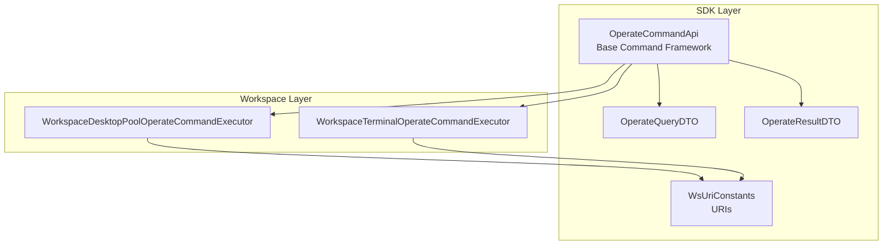
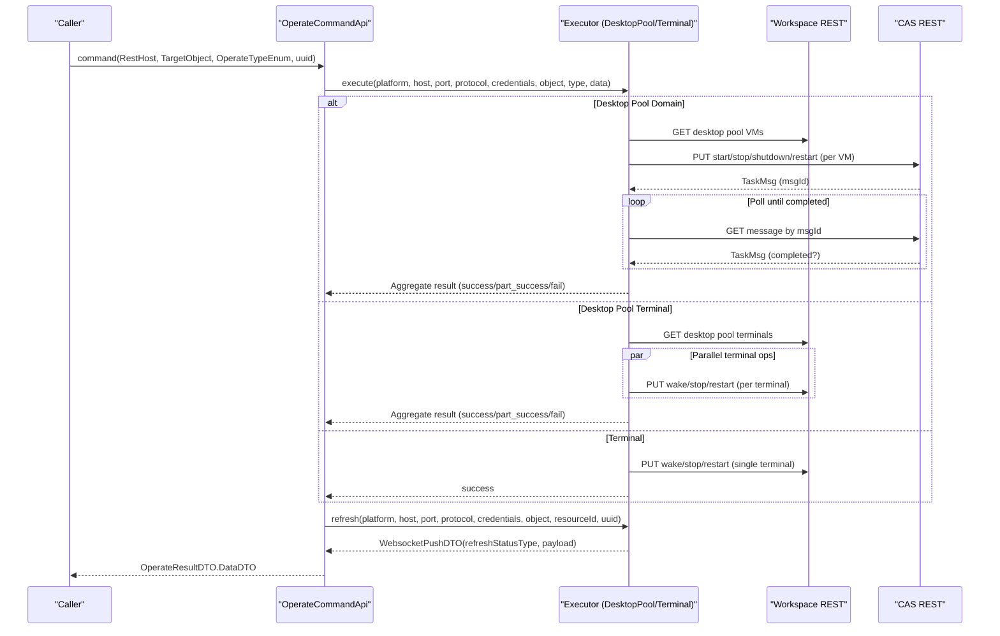
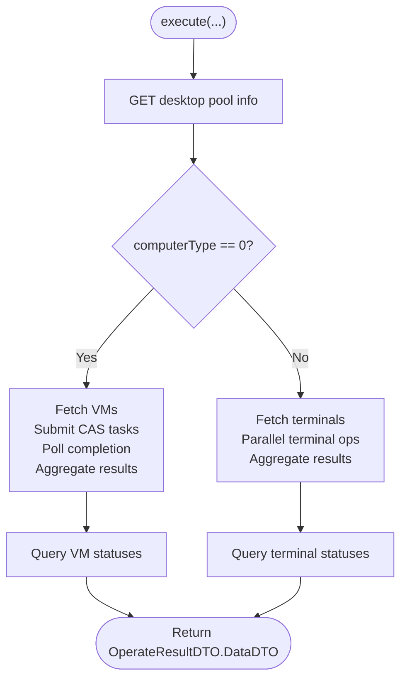
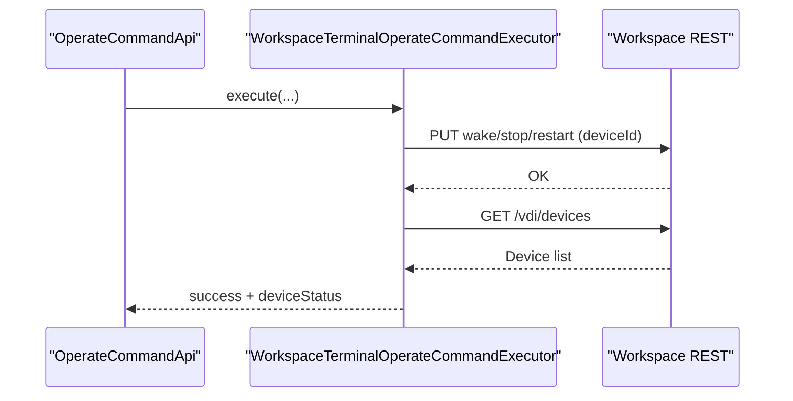
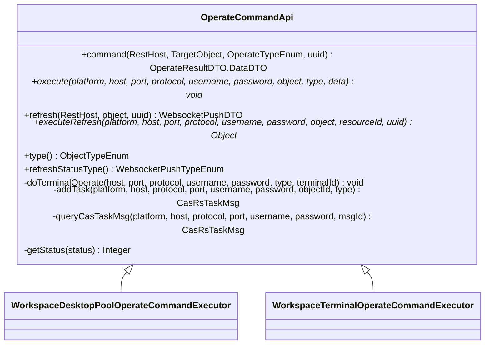
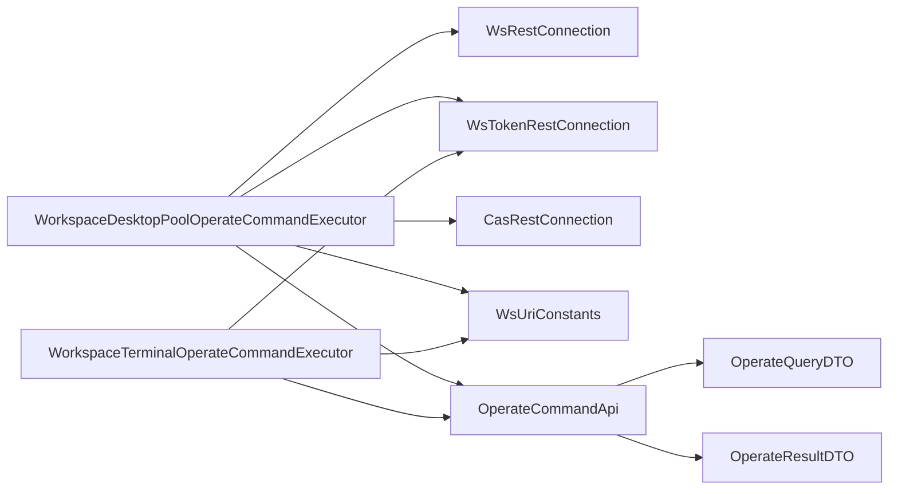

# Operational Commands

<cite>
**Referenced Files in This Document**
- [WorkspaceDesktopPoolOperateCommandExecutor.java](file://watcher-workspace/src/main/java/com/virtual/cloud/om/workspace/service/operate/WorkspaceDesktopPoolOperateCommandExecutor.java)
- [WorkspaceTerminalOperateCommandExecutor.java](file://watcher-workspace/src/main/java/com/virtual/cloud/om/workspace/service/operate/WorkspaceTerminalOperateCommandExecutor.java)
- [OperateCommandApi.java](file://watcher-sdk/src/main/java/com/virtual/cloud/om/sdk/api/OperateCommandApi.java)
- [WsUriConstants.java](file://watcher-sdk/src/main/java/com/virtual/cloud/om/sdk/constant/uri/WsUriConstants.java)
- [OperateQueryDTO.java](file://watcher-sdk/src/main/java/com/virtual/cloud/om/sdk/dto/operate/OperateQueryDTO.java)
- [OperateResultDTO.java](file://watcher-sdk/src/main/java/com/virtual/cloud/om/sdk/dto/operate/OperateResultDTO.java)
</cite>

## Table of Contents
1. [Introduction](#introduction)
2. [Project Structure](#project-structure)
3. [Core Components](#core-components)
4. [Architecture Overview](#architecture-overview)
5. [Detailed Component Analysis](#detailed-component-analysis)
6. [Dependency Analysis](#dependency-analysis)
7. [Performance Considerations](#performance-considerations)
8. [Troubleshooting Guide](#troubleshooting-guide)
9. [Conclusion](#conclusion)
10. [Appendices](#appendices)

## Introduction
This document describes the Workspace operational command execution system responsible for desktop pool and terminal management operations. It covers:
- WorkspaceDesktopPoolOperateCommandExecutor for desktop pool administration (creation, modification, deletion) and orchestration of VM and terminal operations.
- WorkspaceTerminalOperateCommandExecutor for terminal provisioning, configuration changes, and maintenance operations.
- The command execution framework, parameter validation, result processing, success/failure handling, and status refresh.
- Examples of operational commands, rollback considerations, extension guidelines, and integration with the central task management system.
- Security, audit logging, and performance monitoring recommendations.

## Project Structure
The Workspace module exposes two primary executors that extend a shared command framework:
- WorkspaceDesktopPoolOperateCommandExecutor: orchestrates desktop pool operations and delegates to VM or terminal operation paths depending on computer type.
- WorkspaceTerminalOperateCommandExecutor: executes terminal lifecycle operations (restart, stop, wake).

Both executors rely on:
- OperateCommandApi: a common base that defines the command contract, refresh workflow, and shared helpers for terminal and VM operations.
- WsUriConstants: URI templates for Workspace and CAS REST endpoints.
- OperateQueryDTO and OperateResultDTO: standardized request and response DTOs for operational commands.

**Diagram sources**
- [OperateCommandApi.java:29-111](file://watcher-sdk/src/main/java/com/virtual/cloud/om/sdk/api/OperateCommandApi.java#L29-L111)
- [WorkspaceDesktopPoolOperateCommandExecutor.java:42-68](file://watcher-workspace/src/main/java/com/virtual/cloud/om/workspace/service/operate/WorkspaceDesktopPoolOperateCommandExecutor.java#L42-L68)
- [WorkspaceTerminalOperateCommandExecutor.java:25-47](file://watcher-workspace/src/main/java/com/virtual/cloud/om/workspace/service/operate/WorkspaceTerminalOperateCommandExecutor.java#L25-L47)
- [WsUriConstants.java:6-103](file://watcher-sdk/src/main/java/com/virtual/cloud/om/sdk/constant/uri/WsUriConstants.java#L6-L103)
- [OperateQueryDTO.java:11-51](file://watcher-sdk/src/main/java/com/virtual/cloud/om/sdk/dto/operate/OperateQueryDTO.java#L11-L51)
- [OperateResultDTO.java:10-106](file://watcher-sdk/src/main/java/com/virtual/cloud/om/sdk/dto/operate/OperateResultDTO.java#L10-L106)

**Section sources**
- [WorkspaceDesktopPoolOperateCommandExecutor.java:42-68](file://watcher-workspace/src/main/java/com/virtual/cloud/om/workspace/service/operate/WorkspaceDesktopPoolOperateCommandExecutor.java#L42-L68)
- [WorkspaceTerminalOperateCommandExecutor.java:25-47](file://watcher-workspace/src/main/java/com/virtual/cloud/om/workspace/service/operate/WorkspaceTerminalOperateCommandExecutor.java#L25-L47)
- [OperateCommandApi.java:29-111](file://watcher-sdk/src/main/java/com/virtual/cloud/om/sdk/api/OperateCommandApi.java#L29-L111)
- [WsUriConstants.java:6-103](file://watcher-sdk/src/main/java/com/virtual/cloud/om/sdk/constant/uri/WsUriConstants.java#L6-L103)
- [OperateQueryDTO.java:11-51](file://watcher-sdk/src/main/java/com/virtual/cloud/om/sdk/dto/operate/OperateQueryDTO.java#L11-L51)
- [OperateResultDTO.java:10-106](file://watcher-sdk/src/main/java/com/virtual/cloud/om/sdk/dto/operate/OperateResultDTO.java#L10-L106)

## Core Components
- WorkspaceDesktopPoolOperateCommandExecutor
  - Determines desktop pool type (domain vs terminal) and dispatches to appropriate handler.
  - For domain pools: submits CAS tasks per VM and aggregates results.
  - For terminal pools: performs terminal operations concurrently and aggregates outcomes.
  - Provides status refresh for desktop pools via CAS and Workspace endpoints.
- WorkspaceTerminalOperateCommandExecutor
  - Executes terminal operations (restart, stop, wake) via Workspace endpoints.
  - Returns terminal status after operation completion.
- OperateCommandApi
  - Defines the command lifecycle: command(RestHost, TargetObject, OperateTypeEnum, uuid) -> execute(...) -> refresh(...) -> WebsocketPushDTO.
  - Provides shared helpers: doTerminalOperate(...), addTask(...), queryCasTaskMsg(...), getStatus(...).
- DTOs and URIs
  - OperateQueryDTO: carries target identifiers (desktopPoolId, deviceId) and operation metadata.
  - OperateResultDTO: standardizes result, failure message, and nested ResultObject with target lists.
  - WsUriConstants: Workspace and CAS endpoint templates used by executors.

**Section sources**
- [WorkspaceDesktopPoolOperateCommandExecutor.java:47-68](file://watcher-workspace/src/main/java/com/virtual/cloud/om/workspace/service/operate/WorkspaceDesktopPoolOperateCommandExecutor.java#L47-L68)
- [WorkspaceTerminalOperateCommandExecutor.java:28-47](file://watcher-workspace/src/main/java/com/virtual/cloud/om/workspace/service/operate/WorkspaceTerminalOperateCommandExecutor.java#L28-L47)
- [OperateCommandApi.java:40-111](file://watcher-sdk/src/main/java/com/virtual/cloud/om/sdk/api/OperateCommandApi.java#L40-L111)
- [OperateQueryDTO.java:24-51](file://watcher-sdk/src/main/java/com/virtual/cloud/om/sdk/dto/operate/OperateQueryDTO.java#L24-L51)
- [OperateResultDTO.java:18-106](file://watcher-sdk/src/main/java/com/virtual/cloud/om/sdk/dto/operate/OperateResultDTO.java#L18-L106)
- [WsUriConstants.java:27-35](file://watcher-sdk/src/main/java/com/virtual/cloud/om/sdk/constant/uri/WsUriConstants.java#L27-L35)
- [WsUriConstants.java:44-103](file://watcher-sdk/src/main/java/com/virtual/cloud/om/sdk/constant/uri/WsUriConstants.java#L44-L103)

## Architecture Overview
The system follows a layered pattern:
- Command entrypoint: OperateCommandApi.command(...)
- Executor-specific logic: WorkspaceDesktopPoolOperateCommandExecutor and WorkspaceTerminalOperateCommandExecutor
- REST integrations: Workspace endpoints (token and non-token) and CAS task submission/query
- Status refresh: WebSocket push via refresh(...) and refreshStatusType()

**Diagram sources**
- [OperateCommandApi.java:40-111](file://watcher-sdk/src/main/java/com/virtual/cloud/om/sdk/api/OperateCommandApi.java#L40-L111)
- [WorkspaceDesktopPoolOperateCommandExecutor.java:47-129](file://watcher-workspace/src/main/java/com/virtual/cloud/om/workspace/service/operate/WorkspaceDesktopPoolOperateCommandExecutor.java#L47-L129)
- [WorkspaceDesktopPoolOperateCommandExecutor.java:131-173](file://watcher-workspace/src/main/java/com/virtual/cloud/om/workspace/service/operate/WorkspaceDesktopPoolOperateCommandExecutor.java#L131-L173)
- [WorkspaceTerminalOperateCommandExecutor.java:28-47](file://watcher-workspace/src/main/java/com/virtual/cloud/om/workspace/service/operate/WorkspaceTerminalOperateCommandExecutor.java#L28-L47)
- [WsUriConstants.java:27-35](file://watcher-sdk/src/main/java/com/virtual/cloud/om/sdk/constant/uri/WsUriConstants.java#L27-L35)
- [WsUriConstants.java:44-103](file://watcher-sdk/src/main/java/com/virtual/cloud/om/sdk/constant/uri/WsUriConstants.java#L44-L103)

## Detailed Component Analysis

### WorkspaceDesktopPoolOperateCommandExecutor
Responsibilities:
- Resolve desktop pool type and route to domain or terminal operation.
- Domain pool operations:
  - Fetch VM list for the pool.
  - Submit CAS tasks per VM for start/stop/shutdown/restart.
  - Poll task completion and aggregate success/part_success/fail.
  - Query and populate per-target statuses.
- Terminal pool operations:
  - Fetch terminal list for the pool.
  - Execute terminal operations in parallel and aggregate outcomes.
  - Query and populate per-target statuses.
- Status refresh:
  - Query desktop pool summary stats and per-target statuses via Workspace and CAS.

Key behaviors:
- Uses CompletableFuture for parallelism and aggregation.
- Uses Utils.checkResult for consistent error handling on REST calls.
- Logs structured entries with uuid, objectType, and operateType for auditability.

**Diagram sources**
- [WorkspaceDesktopPoolOperateCommandExecutor.java:47-129](file://watcher-workspace/src/main/java/com/virtual/cloud/om/workspace/service/operate/WorkspaceDesktopPoolOperateCommandExecutor.java#L47-L129)
- [WorkspaceDesktopPoolOperateCommandExecutor.java:131-173](file://watcher-workspace/src/main/java/com/virtual/cloud/om/workspace/service/operate/WorkspaceDesktopPoolOperateCommandExecutor.java#L131-L173)
- [OperateCommandApi.java:118-193](file://watcher-sdk/src/main/java/com/virtual/cloud/om/sdk/api/OperateCommandApi.java#L118-L193)

**Section sources**
- [WorkspaceDesktopPoolOperateCommandExecutor.java:47-129](file://watcher-workspace/src/main/java/com/virtual/cloud/om/workspace/service/operate/WorkspaceDesktopPoolOperateCommandExecutor.java#L47-L129)
- [WorkspaceDesktopPoolOperateCommandExecutor.java:131-173](file://watcher-workspace/src/main/java/com/virtual/cloud/om/workspace/service/operate/WorkspaceDesktopPoolOperateCommandExecutor.java#L131-L173)
- [OperateCommandApi.java:118-193](file://watcher-sdk/src/main/java/com/virtual/cloud/om/sdk/api/OperateCommandApi.java#L118-L193)

### WorkspaceTerminalOperateCommandExecutor
Responsibilities:
- Execute terminal operations (restart, stop, wake) against Workspace endpoints.
- Update and return terminal status post-operation.

Key behaviors:
- Single-device operation with immediate status fetch.
- Uses shared helper doTerminalOperate(...) for URI routing and REST invocation.

**Diagram sources**
- [WorkspaceTerminalOperateCommandExecutor.java:28-47](file://watcher-workspace/src/main/java/com/virtual/cloud/om/workspace/service/operate/WorkspaceTerminalOperateCommandExecutor.java#L28-L47)
- [OperateCommandApi.java:118-140](file://watcher-sdk/src/main/java/com/virtual/cloud/om/sdk/api/OperateCommandApi.java#L118-L140)
- [WsUriConstants.java:27-35](file://watcher-sdk/src/main/java/com/virtual/cloud/om/sdk/constant/uri/WsUriConstants.java#L27-L35)

**Section sources**
- [WorkspaceTerminalOperateCommandExecutor.java:28-47](file://watcher-workspace/src/main/java/com/virtual/cloud/om/workspace/service/operate/WorkspaceTerminalOperateCommandExecutor.java#L28-L47)
- [OperateCommandApi.java:118-140](file://watcher-sdk/src/main/java/com/virtual/cloud/om/sdk/api/OperateCommandApi.java#L118-L140)

### Command Execution Framework (OperateCommandApi)
Responsibilities:
- Define command lifecycle: command(...) -> execute(...) -> refresh(...) -> WebsocketPushDTO.
- Shared helpers:
  - doTerminalOperate(...): routes to wake/stop/restart endpoints.
  - addTask(...): submits CAS tasks for VM operations.
  - queryCasTaskMsg(...): polls task completion.
  - getStatus(...): maps raw status strings to numeric codes.

**Diagram sources**
- [OperateCommandApi.java:29-210](file://watcher-sdk/src/main/java/com/virtual/cloud/om/sdk/api/OperateCommandApi.java#L29-L210)
- [WorkspaceDesktopPoolOperateCommandExecutor.java:42-68](file://watcher-workspace/src/main/java/com/virtual/cloud/om/workspace/service/operate/WorkspaceDesktopPoolOperateCommandExecutor.java#L42-L68)
- [WorkspaceTerminalOperateCommandExecutor.java:25-47](file://watcher-workspace/src/main/java/com/virtual/cloud/om/workspace/service/operate/WorkspaceTerminalOperateCommandExecutor.java#L25-L47)

**Section sources**
- [OperateCommandApi.java:40-111](file://watcher-sdk/src/main/java/com/virtual/cloud/om/sdk/api/OperateCommandApi.java#L40-L111)
- [OperateCommandApi.java:118-208](file://watcher-sdk/src/main/java/com/virtual/cloud/om/sdk/api/OperateCommandApi.java#L118-L208)

### Parameter Validation and Result Processing
- OperateQueryDTO validates and carries:
  - objectType and operateType integers.
  - TargetObject with either desktopPoolId or deviceId.
- OperateResultDTO.DataDTO:
  - result encoded as success/part_success/fail.
  - failureMessage for failures.
  - ResultObject with nested targetList for desktop pools.

Validation and processing:
- Executors call Utils.checkResult on each REST response to ensure exceptions are surfaced consistently.
- Aggregation logic computes overall result based on partial successes and failures.

**Section sources**
- [OperateQueryDTO.java:11-51](file://watcher-sdk/src/main/java/com/virtual/cloud/om/sdk/dto/operate/OperateQueryDTO.java#L11-L51)
- [OperateResultDTO.java:18-106](file://watcher-sdk/src/main/java/com/virtual/cloud/om/sdk/dto/operate/OperateResultDTO.java#L18-L106)
- [WorkspaceDesktopPoolOperateCommandExecutor.java:55-55](file://watcher-workspace/src/main/java/com/virtual/cloud/om/workspace/service/operate/WorkspaceDesktopPoolOperateCommandExecutor.java#L55-L55)
- [WorkspaceDesktopPoolOperateCommandExecutor.java:136-136](file://watcher-workspace/src/main/java/com/virtual/cloud/om/workspace/service/operate/WorkspaceDesktopPoolOperateCommandExecutor.java#L136-L136)
- [WorkspaceTerminalOperateCommandExecutor.java:42-42](file://watcher-workspace/src/main/java/com/virtual/cloud/om/workspace/service/operate/WorkspaceTerminalOperateCommandExecutor.java#L42-L42)

### Examples of Operational Commands
- Desktop Pool Domain Operations
  - Start/Stop/Shut Down/Restart: submitted per VM via CAS task submission; results aggregated.
  - URIs used: desktop pool VM list and per-VM start/stop/shutdown/restart endpoints.
- Desktop Pool Terminal Operations
  - Wake/Stop/Restart: executed per terminal in parallel; results aggregated.
  - URIs used: terminal wake/stop/restart endpoints and terminal list endpoint.
- Terminal Operations
  - Single-device wake/stop/restart; status refreshed post-operation.

Note: Specific endpoint paths are defined in WsUriConstants and used by executors.

**Section sources**
- [WorkspaceDesktopPoolOperateCommandExecutor.java:70-129](file://watcher-workspace/src/main/java/com/virtual/cloud/om/workspace/service/operate/WorkspaceDesktopPoolOperateCommandExecutor.java#L70-L129)
- [WorkspaceDesktopPoolOperateCommandExecutor.java:131-173](file://watcher-workspace/src/main/java/com/virtual/cloud/om/workspace/service/operate/WorkspaceDesktopPoolOperateCommandExecutor.java#L131-L173)
- [WorkspaceTerminalOperateCommandExecutor.java:28-47](file://watcher-workspace/src/main/java/com/virtual/cloud/om/workspace/service/operate/WorkspaceTerminalOperateCommandExecutor.java#L28-L47)
- [WsUriConstants.java:27-35](file://watcher-sdk/src/main/java/com/virtual/cloud/om/sdk/constant/uri/WsUriConstants.java#L27-L35)
- [WsUriConstants.java:44-103](file://watcher-sdk/src/main/java/com/virtual/cloud/om/sdk/constant/uri/WsUriConstants.java#L44-L103)

### Success/Failure Handling and Rollback Mechanisms
- Success/Failure Handling
  - Domain operations: CAS task polling determines success/failure; overall result computed from task list.
  - Terminal operations: parallel execution with boolean result list; overall result computed.
  - Logging includes uuid, objectType, and operateType for traceability.
- Rollback
  - No explicit rollback logic is present in the executors. For idempotent operations (e.g., stop), repeated operations are safe. For non-idempotent operations, consider adding compensating actions or explicit rollback steps in future enhancements.

**Section sources**
- [WorkspaceDesktopPoolOperateCommandExecutor.java:82-123](file://watcher-workspace/src/main/java/com/virtual/cloud/om/workspace/service/operate/WorkspaceDesktopPoolOperateCommandExecutor.java#L82-L123)
- [WorkspaceDesktopPoolOperateCommandExecutor.java:144-167](file://watcher-workspace/src/main/java/com/virtual/cloud/om/workspace/service/operate/WorkspaceDesktopPoolOperateCommandExecutor.java#L144-L167)
- [OperateCommandApi.java:178-193](file://watcher-sdk/src/main/java/com/virtual/cloud/om/sdk/api/OperateCommandApi.java#L178-L193)

### Extension Guidelines and Central Task Management Integration
- Extending the Executor System
  - Create a new executor class extending OperateCommandApi.
  - Implement execute(...) and executeRefresh(...), and override type() and refreshStatusType().
  - Use shared helpers (doTerminalOperate, addTask, queryCasTaskMsg) when applicable.
- Integrating with Central Task Management
  - For VM operations, reuse addTask(...) and queryCasTaskMsg(...) to integrate with CAS task queue.
  - For terminal operations, use Workspace endpoints and update ResultObject.targetList accordingly.
- Wiring
  - Ensure the new executor is a Spring-managed bean so it can be discovered by the central command routing.

**Section sources**
- [OperateCommandApi.java:75-111](file://watcher-sdk/src/main/java/com/virtual/cloud/om/sdk/api/OperateCommandApi.java#L75-L111)
- [OperateCommandApi.java:154-193](file://watcher-sdk/src/main/java/com/virtual/cloud/om/sdk/api/OperateCommandApi.java#L154-L193)

## Dependency Analysis
- WorkspaceDesktopPoolOperateCommandExecutor depends on:
  - WsTokenRestConnection and WsRestConnection for Workspace endpoints.
  - CasRestConnection for CAS task submission and status.
  - WsUriConstants for endpoint templates.
- WorkspaceTerminalOperateCommandExecutor depends on:
  - WsTokenRestConnection for Workspace endpoints.
  - WsUriConstants for endpoint templates.
- Both executors depend on:
  - OperateCommandApi for shared behavior and helpers.
  - OperateQueryDTO and OperateResultDTO for standardized I/O.

**Diagram sources**
- [WorkspaceDesktopPoolOperateCommandExecutor.java:42-46](file://watcher-workspace/src/main/java/com/virtual/cloud/om/workspace/service/operate/WorkspaceDesktopPoolOperateCommandExecutor.java#L42-L46)
- [WorkspaceTerminalOperateCommandExecutor.java:25-26](file://watcher-workspace/src/main/java/com/virtual/cloud/om/workspace/service/operate/WorkspaceTerminalOperateCommandExecutor.java#L25-L26)
- [OperateCommandApi.java:113-116](file://watcher-sdk/src/main/java/com/virtual/cloud/om/sdk/api/OperateCommandApi.java#L113-L116)
- [WsUriConstants.java:6-103](file://watcher-sdk/src/main/java/com/virtual/cloud/om/sdk/constant/uri/WsUriConstants.java#L6-L103)
- [OperateQueryDTO.java:11-51](file://watcher-sdk/src/main/java/com/virtual/cloud/om/sdk/dto/operate/OperateQueryDTO.java#L11-L51)
- [OperateResultDTO.java:10-106](file://watcher-sdk/src/main/java/com/virtual/cloud/om/sdk/dto/operate/OperateResultDTO.java#L10-L106)

**Section sources**
- [WorkspaceDesktopPoolOperateCommandExecutor.java:42-46](file://watcher-workspace/src/main/java/com/virtual/cloud/om/workspace/service/operate/WorkspaceDesktopPoolOperateCommandExecutor.java#L42-L46)
- [WorkspaceTerminalOperateCommandExecutor.java:25-26](file://watcher-workspace/src/main/java/com/virtual/cloud/om/workspace/service/operate/WorkspaceTerminalOperateCommandExecutor.java#L25-L26)
- [OperateCommandApi.java:113-116](file://watcher-sdk/src/main/java/com/virtual/cloud/om/sdk/api/OperateCommandApi.java#L113-L116)

## Performance Considerations
- Parallelization
  - Desktop pool domain operations use CompletableFuture to submit tasks per VM and to poll completion, improving throughput.
  - Desktop pool terminal operations use CompletableFuture to execute per-terminal operations concurrently.
- Polling Strategy
  - CAS task polling occurs every second until completion; consider tuning intervals or batching queries for very large pools.
- Network Calls
  - Minimize redundant calls by reusing fetched lists (VMs, terminals) and avoiding repeated status queries when unnecessary.
- Logging Overhead
  - Structured logging with uuid/objectType/operateType aids observability but should be tuned for high-volume scenarios.

[No sources needed since this section provides general guidance]

## Troubleshooting Guide
Common issues and resolutions:
- REST Call Failures
  - Ensure Utils.checkResult is invoked on all responses; exceptions propagate as failureMessage in OperateResultDTO.
- CAS Task Not Found
  - Verify msgId validity and that the task exists; queryCasTaskMsg handles missing tasks gracefully by returning null.
- Terminal Operation Fails
  - Confirm terminalId exists and Workspace endpoints are reachable; check device status retrieval after operation.
- Audit and Monitoring
  - Use uuid/objectType/operateType in logs to correlate requests and responses.
  - Leverage refresh(...) to push status updates via WebSocket using refreshStatusType().

**Section sources**
- [WorkspaceDesktopPoolOperateCommandExecutor.java:55-55](file://watcher-workspace/src/main/java/com/virtual/cloud/om/workspace/service/operate/WorkspaceDesktopPoolOperateCommandExecutor.java#L55-L55)
- [WorkspaceDesktopPoolOperateCommandExecutor.java:136-136](file://watcher-workspace/src/main/java/com/virtual/cloud/om/workspace/service/operate/WorkspaceDesktopPoolOperateCommandExecutor.java#L136-L136)
- [WorkspaceTerminalOperateCommandExecutor.java:42-42](file://watcher-workspace/src/main/java/com/virtual/cloud/om/workspace/service/operate/WorkspaceTerminalOperateCommandExecutor.java#L42-L42)
- [OperateCommandApi.java:178-193](file://watcher-sdk/src/main/java/com/virtual/cloud/om/sdk/api/OperateCommandApi.java#L178-L193)

## Conclusion
The Workspace operational command execution system provides a robust, extensible framework for managing desktop pools and terminals. By leveraging shared helpers, consistent DTOs, and REST integrations, it supports scalable, parallelized operations with clear status reporting and WebSocket refresh capabilities. Future enhancements can focus on explicit rollback support, improved polling strategies, and expanded operation coverage.

[No sources needed since this section summarizes without analyzing specific files]

## Appendices

### Appendix A: Endpoint Templates Used by Executors
- Terminal operations: wake, stop, restart endpoints under Workspace URIs.
- Desktop pool operations: VM list, terminal list, and status endpoints under Workspace URIs.
- CAS task operations: start/stop/shutdown/restart endpoints for VMs.

**Section sources**
- [WsUriConstants.java:27-35](file://watcher-sdk/src/main/java/com/virtual/cloud/om/sdk/constant/uri/WsUriConstants.java#L27-L35)
- [WsUriConstants.java:44-103](file://watcher-sdk/src/main/java/com/virtual/cloud/om/sdk/constant/uri/WsUriConstants.java#L44-L103)