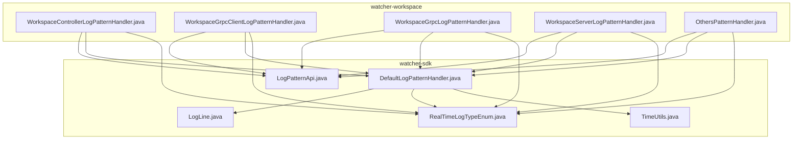
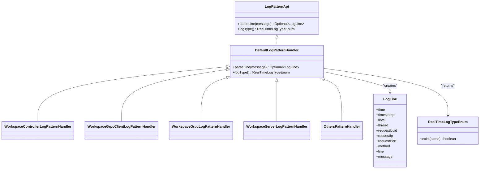
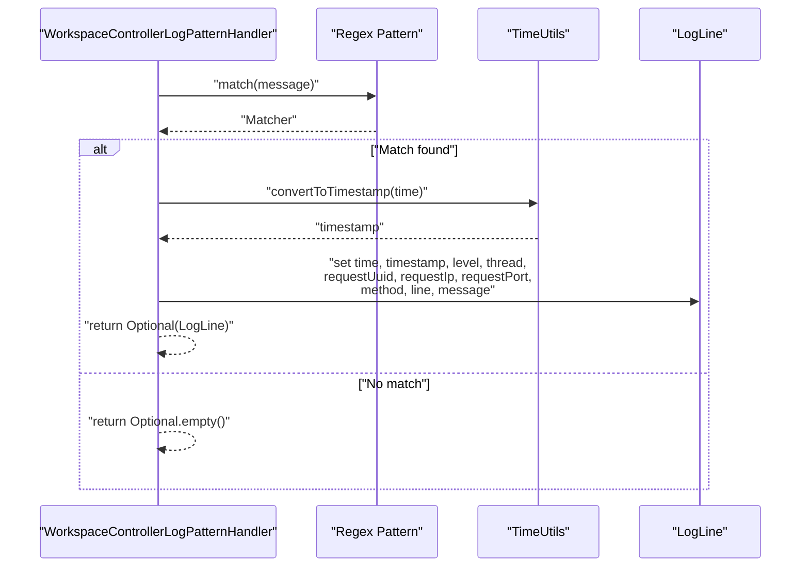
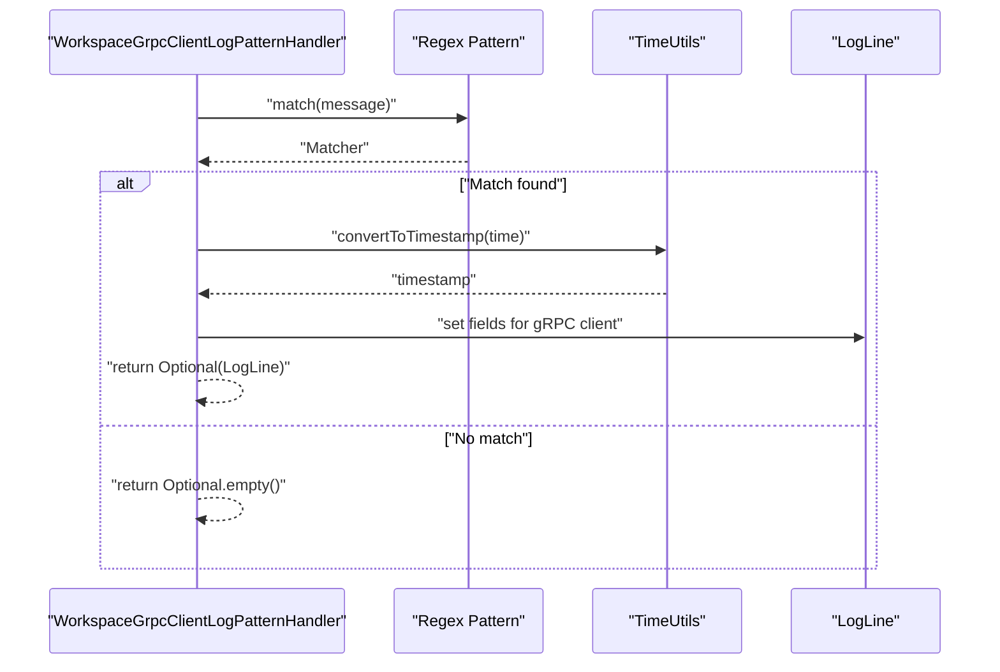
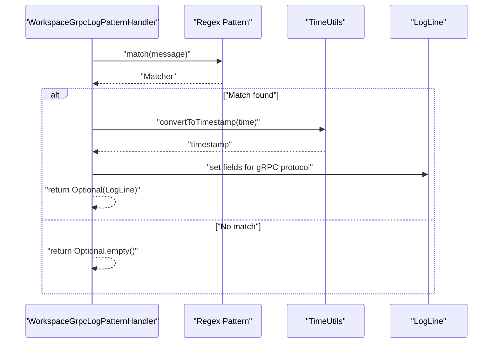
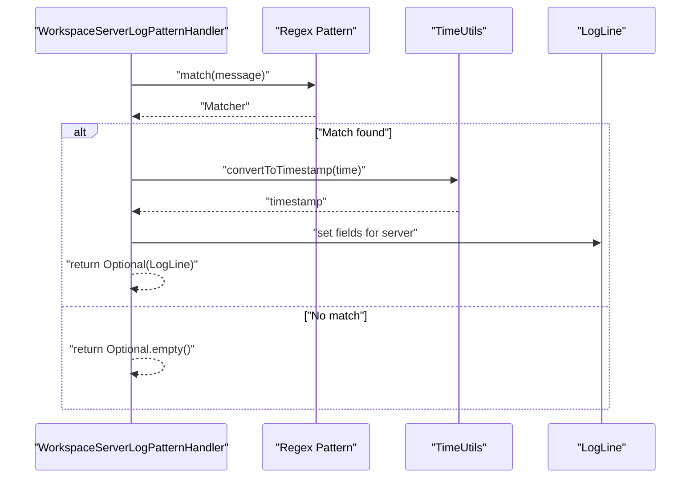
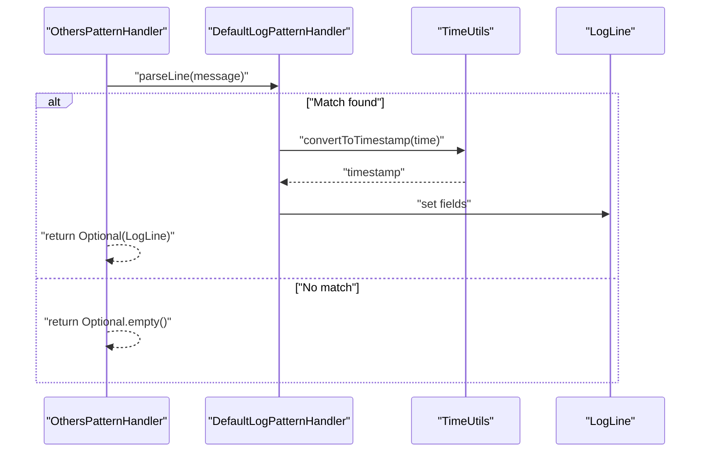
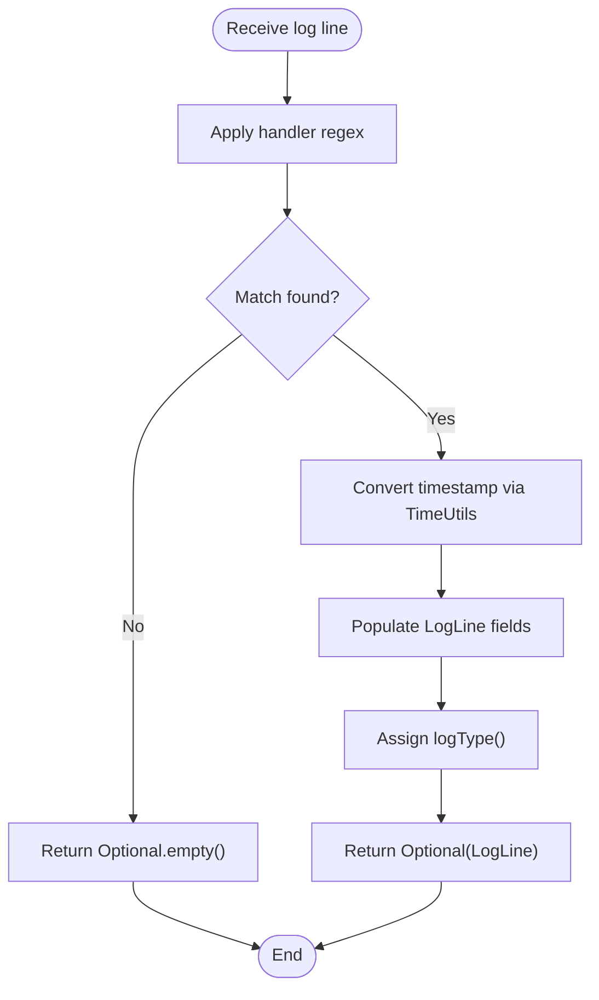
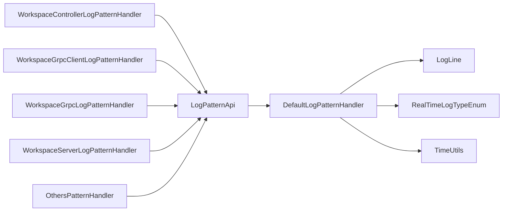

# Real-time Logging

<cite>
**Referenced Files in This Document**
- [WorkspaceControllerLogPatternHandler.java](file://watcher-workspace/src/main/java/com/virtual/cloud/om/workspace/service/realtimelog/WorkspaceControllerLogPatternHandler.java)
- [WorkspaceGrpcClientLogPatternHandler.java](file://watcher-workspace/src/main/java/com/virtual/cloud/om/workspace/service/realtimelog/WorkspaceGrpcClientLogPatternHandler.java)
- [WorkspaceGrpcLogPatternHandler.java](file://watcher-workspace/src/main/java/com/virtual/cloud/om/workspace/service/realtimelog/WorkspaceGrpcLogPatternHandler.java)
- [WorkspaceServerLogPatternHandler.java](file://watcher-workspace/src/main/java/com/virtual/cloud/om/workspace/service/realtimelog/WorkspaceServerLogPatternHandler.java)
- [OthersPatternHandler.java](file://watcher-workspace/src/main/java/com/virtual/cloud/om/workspace/service/realtimelog/OthersPatternHandler.java)
- [DefaultLogPatternHandler.java](file://watcher-sdk/src/main/java/com/virtual/cloud/om/sdk/api/DefaultLogPatternHandler.java)
- [LogPatternApi.java](file://watcher-sdk/src/main/java/com/virtual/cloud/om/sdk/api/LogPatternApi.java)
- [LogLine.java](file://watcher-sdk/src/main/java/com/virtual/cloud/om/sdk/dto/LogLine.java)
- [RealTimeLogTypeEnum.java](file://watcher-sdk/src/main/java/com/virtual/cloud/om/sdk/constant/RealTimeLogTypeEnum.java)
- [TimeUtils.java](file://watcher-sdk/src/main/java/com/virtual/cloud/om/sdk/utils/TimeUtils.java)
</cite>

## Table of Contents
1. [Introduction](#introduction)
2. [Project Structure](#project-structure)
3. [Core Components](#core-components)
4. [Architecture Overview](#architecture-overview)
5. [Detailed Component Analysis](#detailed-component-analysis)
6. [Dependency Analysis](#dependency-analysis)
7. [Performance Considerations](#performance-considerations)
8. [Troubleshooting Guide](#troubleshooting-guide)
9. [Conclusion](#conclusion)
10. [Appendices](#appendices)

## Introduction
This document describes the Workspace real-time logging system with a focus on live log processing and pattern recognition. It covers the Workspace-specific log pattern handlers for controller-side, gRPC client, gRPC protocol, and server-side logs, as well as the generic OthersPatternHandler for miscellaneous logs. It explains the real-time parsing algorithms, pattern matching strategies, and streaming data processing. It also provides configuration guidance for log patterns, filtering rules, and notification triggers, along with implementation guidelines for adding custom log handlers and integrating with WebSocket-based real-time dashboards. Finally, it addresses performance optimization for high-volume log streams and troubleshooting parsing issues.

## Project Structure
The Workspace real-time logging module resides under the watcher-workspace module and leverages shared SDK components from watcher-sdk. The key elements are:
- Workspace log pattern handlers: controller, gRPC client, gRPC protocol, server, and others
- Shared SDK abstractions: LogPatternApi, DefaultLogPatternHandler, LogLine DTO, RealTimeLogTypeEnum, and TimeUtils

**Diagram sources**
- [WorkspaceControllerLogPatternHandler.java:1-58](file://watcher-workspace/src/main/java/com/virtual/cloud/om/workspace/service/realtimelog/WorkspaceControllerLogPatternHandler.java#L1-L58)
- [WorkspaceGrpcClientLogPatternHandler.java:1-58](file://watcher-workspace/src/main/java/com/virtual/cloud/om/workspace/service/realtimelog/WorkspaceGrpcClientLogPatternHandler.java#L1-L58)
- [WorkspaceGrpcLogPatternHandler.java:1-58](file://watcher-workspace/src/main/java/com/virtual/cloud/om/workspace/service/realtimelog/WorkspaceGrpcLogPatternHandler.java#L1-L58)
- [WorkspaceServerLogPatternHandler.java:1-59](file://watcher-workspace/src/main/java/com/virtual/cloud/om/workspace/service/realtimelog/WorkspaceServerLogPatternHandler.java#L1-L59)
- [OthersPatternHandler.java:1-29](file://watcher-workspace/src/main/java/com/virtual/cloud/om/workspace/service/realtimelog/OthersPatternHandler.java#L1-L29)
- [LogPatternApi.java:1-18](file://watcher-sdk/src/main/java/com/virtual/cloud/om/sdk/api/LogPatternApi.java#L1-L18)
- [DefaultLogPatternHandler.java:1-56](file://watcher-sdk/src/main/java/com/virtual/cloud/om/sdk/api/DefaultLogPatternHandler.java#L1-L56)
- [LogLine.java:1-56](file://watcher-sdk/src/main/java/com/virtual/cloud/om/sdk/dto/LogLine.java#L1-L56)
- [RealTimeLogTypeEnum.java:1-45](file://watcher-sdk/src/main/java/com/virtual/cloud/om/sdk/constant/RealTimeLogTypeEnum.java#L1-L45)
- [TimeUtils.java:1-37](file://watcher-sdk/src/main/java/com/virtual/cloud/om/sdk/utils/TimeUtils.java#L1-L37)

**Section sources**
- [WorkspaceControllerLogPatternHandler.java:1-58](file://watcher-workspace/src/main/java/com/virtual/cloud/om/workspace/service/realtimelog/WorkspaceControllerLogPatternHandler.java#L1-L58)
- [WorkspaceGrpcClientLogPatternHandler.java:1-58](file://watcher-workspace/src/main/java/com/virtual/cloud/om/workspace/service/realtimelog/WorkspaceGrpcClientLogPatternHandler.java#L1-L58)
- [WorkspaceGrpcLogPatternHandler.java:1-58](file://watcher-workspace/src/main/java/com/virtual/cloud/om/workspace/service/realtimelog/WorkspaceGrpcLogPatternHandler.java#L1-L58)
- [WorkspaceServerLogPatternHandler.java:1-59](file://watcher-workspace/src/main/java/com/virtual/cloud/om/workspace/service/realtimelog/WorkspaceServerLogPatternHandler.java#L1-L59)
- [OthersPatternHandler.java:1-29](file://watcher-workspace/src/main/java/com/virtual/cloud/om/workspace/service/realtimelog/OthersPatternHandler.java#L1-L29)
- [DefaultLogPatternHandler.java:1-56](file://watcher-sdk/src/main/java/com/virtual/cloud/om/sdk/api/DefaultLogPatternHandler.java#L1-L56)
- [LogPatternApi.java:1-18](file://watcher-sdk/src/main/java/com/virtual/cloud/om/sdk/api/LogPatternApi.java#L1-L18)
- [LogLine.java:1-56](file://watcher-sdk/src/main/java/com/virtual/cloud/om/sdk/dto/LogLine.java#L1-L56)
- [RealTimeLogTypeEnum.java:1-45](file://watcher-sdk/src/main/java/com/virtual/cloud/om/sdk/constant/RealTimeLogTypeEnum.java#L1-L45)
- [TimeUtils.java:1-37](file://watcher-sdk/src/main/java/com/virtual/cloud/om/sdk/utils/TimeUtils.java#L1-L37)

## Core Components
- LogPatternApi: Defines the contract for parsing a single log line and returning a typed log result.
- DefaultLogPatternHandler: Provides a default regex-based parser and common field extraction logic.
- Workspace-specific handlers: Specialized parsers for Workspace controller, gRPC client, gRPC protocol, and server logs; a fallback OthersPatternHandler.
- LogLine DTO: Encapsulates parsed fields such as time, timestamp, level, thread, request identifiers, method, line number, and message.
- RealTimeLogTypeEnum: Enumerates supported log types, including Workspace variants and defaults.
- TimeUtils: Converts human-readable timestamps to numeric timestamps with robust fallbacks.

Key responsibilities:
- Parse raw log lines into structured LogLine instances.
- Extract standardized fields across Workspace subsystems.
- Provide type-specific parsing behavior while reusing common logic.

**Section sources**
- [LogPatternApi.java:1-18](file://watcher-sdk/src/main/java/com/virtual/cloud/om/sdk/api/LogPatternApi.java#L1-L18)
- [DefaultLogPatternHandler.java:1-56](file://watcher-sdk/src/main/java/com/virtual/cloud/om/sdk/api/DefaultLogPatternHandler.java#L1-L56)
- [WorkspaceControllerLogPatternHandler.java:1-58](file://watcher-workspace/src/main/java/com/virtual/cloud/om/workspace/service/realtimelog/WorkspaceControllerLogPatternHandler.java#L1-L58)
- [WorkspaceGrpcClientLogPatternHandler.java:1-58](file://watcher-workspace/src/main/java/com/virtual/cloud/om/workspace/service/realtimelog/WorkspaceGrpcClientLogPatternHandler.java#L1-L58)
- [WorkspaceGrpcLogPatternHandler.java:1-58](file://watcher-workspace/src/main/java/com/virtual/cloud/om/workspace/service/realtimelog/WorkspaceGrpcLogPatternHandler.java#L1-L58)
- [WorkspaceServerLogPatternHandler.java:1-59](file://watcher-workspace/src/main/java/com/virtual/cloud/om/workspace/service/realtimelog/WorkspaceServerLogPatternHandler.java#L1-L59)
- [OthersPatternHandler.java:1-29](file://watcher-workspace/src/main/java/com/virtual/cloud/om/workspace/service/realtimelog/OthersPatternHandler.java#L1-L29)
- [LogLine.java:1-56](file://watcher-sdk/src/main/java/com/virtual/cloud/om/sdk/dto/LogLine.java#L1-L56)
- [RealTimeLogTypeEnum.java:1-45](file://watcher-sdk/src/main/java/com/virtual/cloud/om/sdk/constant/RealTimeLogTypeEnum.java#L1-L45)
- [TimeUtils.java:1-37](file://watcher-sdk/src/main/java/com/virtual/cloud/om/sdk/utils/TimeUtils.java#L1-L37)

## Architecture Overview
The Workspace real-time logging system follows a modular, pluggable architecture:
- Handlers implement LogPatternApi and are discovered via Spring component scanning.
- Each handler encapsulates a specific regex pattern tailored to a subsystem’s log format.
- DefaultLogPatternHandler centralizes common parsing logic and shared fields.
- Parsed LogLine instances carry normalized metadata suitable for downstream consumers (e.g., dashboards, alerts).

**Diagram sources**
- [LogPatternApi.java:1-18](file://watcher-sdk/src/main/java/com/virtual/cloud/om/sdk/api/LogPatternApi.java#L1-L18)
- [DefaultLogPatternHandler.java:1-56](file://watcher-sdk/src/main/java/com/virtual/cloud/om/sdk/api/DefaultLogPatternHandler.java#L1-L56)
- [WorkspaceControllerLogPatternHandler.java:1-58](file://watcher-workspace/src/main/java/com/virtual/cloud/om/workspace/service/realtimelog/WorkspaceControllerLogPatternHandler.java#L1-L58)
- [WorkspaceGrpcClientLogPatternHandler.java:1-58](file://watcher-workspace/src/main/java/com/virtual/cloud/om/workspace/service/realtimelog/WorkspaceGrpcClientLogPatternHandler.java#L1-L58)
- [WorkspaceGrpcLogPatternHandler.java:1-58](file://watcher-workspace/src/main/java/com/virtual/cloud/om/workspace/service/realtimelog/WorkspaceGrpcLogPatternHandler.java#L1-L58)
- [WorkspaceServerLogPatternHandler.java:1-59](file://watcher-workspace/src/main/java/com/virtual/cloud/om/workspace/service/realtimelog/WorkspaceServerLogPatternHandler.java#L1-L59)
- [OthersPatternHandler.java:1-29](file://watcher-workspace/src/main/java/com/virtual/cloud/om/workspace/service/realtimelog/OthersPatternHandler.java#L1-L29)
- [LogLine.java:1-56](file://watcher-sdk/src/main/java/com/virtual/cloud/om/sdk/dto/LogLine.java#L1-L56)
- [RealTimeLogTypeEnum.java:1-45](file://watcher-sdk/src/main/java/com/virtual/cloud/om/sdk/constant/RealTimeLogTypeEnum.java#L1-L45)

## Detailed Component Analysis

### WorkspaceControllerLogPatternHandler
Purpose:
- Parses controller-side log lines produced by Workspace applications.
- Extracts time, level, thread, request UUID, IP, port, HTTP method, line number, and message.

Parsing strategy:
- Uses a dedicated regex tailored to the Workspace controller log format.
- Leverages shared timestamp conversion via TimeUtils.
- Returns Optional.empty() when the line does not match the expected format.

Output:
- Populates a LogLine with extracted fields and a Workspace controller log type.

**Diagram sources**
- [WorkspaceControllerLogPatternHandler.java:21-51](file://watcher-workspace/src/main/java/com/virtual/cloud/om/workspace/service/realtimelog/WorkspaceControllerLogPatternHandler.java#L21-L51)
- [TimeUtils.java:23-35](file://watcher-sdk/src/main/java/com/virtual/cloud/om/sdk/utils/TimeUtils.java#L23-L35)
- [LogLine.java:6-55](file://watcher-sdk/src/main/java/com/virtual/cloud/om/sdk/dto/LogLine.java#L6-L55)

**Section sources**
- [WorkspaceControllerLogPatternHandler.java:1-58](file://watcher-workspace/src/main/java/com/virtual/cloud/om/workspace/service/realtimelog/WorkspaceControllerLogPatternHandler.java#L1-L58)
- [TimeUtils.java:1-37](file://watcher-sdk/src/main/java/com/virtual/cloud/om/sdk/utils/TimeUtils.java#L1-L37)
- [LogLine.java:1-56](file://watcher-sdk/src/main/java/com/virtual/cloud/om/sdk/dto/LogLine.java#L1-L56)
- [RealTimeLogTypeEnum.java:21-22](file://watcher-sdk/src/main/java/com/virtual/cloud/om/sdk/constant/RealTimeLogTypeEnum.java#L21-L22)

### WorkspaceGrpcClientLogPatternHandler
Purpose:
- Parses gRPC client-side log lines generated by Workspace.
- Extracts time, level, thread, request UUID, remote IP, remote port, method, and message.

Parsing strategy:
- Uses a specialized regex aligned with Workspace gRPC client log format.
- Applies shared timestamp conversion and returns Optional.empty() on mismatch.

Output:
- Populates a LogLine with gRPC client-specific fields and a Workspace gRPC client log type.

**Diagram sources**
- [WorkspaceGrpcClientLogPatternHandler.java:21-51](file://watcher-workspace/src/main/java/com/virtual/cloud/om/workspace/service/realtimelog/WorkspaceGrpcClientLogPatternHandler.java#L21-L51)
- [TimeUtils.java:23-35](file://watcher-sdk/src/main/java/com/virtual/cloud/om/sdk/utils/TimeUtils.java#L23-L35)
- [LogLine.java:6-55](file://watcher-sdk/src/main/java/com/virtual/cloud/om/sdk/dto/LogLine.java#L6-L55)

**Section sources**
- [WorkspaceGrpcClientLogPatternHandler.java:1-58](file://watcher-workspace/src/main/java/com/virtual/cloud/om/workspace/service/realtimelog/WorkspaceGrpcClientLogPatternHandler.java#L1-L58)
- [TimeUtils.java:1-37](file://watcher-sdk/src/main/java/com/virtual/cloud/om/sdk/utils/TimeUtils.java#L1-L37)
- [RealTimeLogTypeEnum.java](file://watcher-sdk/src/main/java/com/virtual/cloud/om/sdk/constant/RealTimeLogTypeEnum.java#L24)

### WorkspaceGrpcLogPatternHandler
Purpose:
- Parses Workspace gRPC protocol logs.
- Extracts time, level, thread, request UUID, remote IP, remote port, method, line number, and message.

Parsing strategy:
- Uses a regex tailored to Workspace gRPC protocol log format.
- Leverages shared timestamp conversion and returns Optional.empty() when the line does not match.

Output:
- Populates a LogLine with gRPC protocol fields and a Workspace gRPC log type.

**Diagram sources**
- [WorkspaceGrpcLogPatternHandler.java:20-51](file://watcher-workspace/src/main/java/com/virtual/cloud/om/workspace/service/realtimelog/WorkspaceGrpcLogPatternHandler.java#L20-L51)
- [TimeUtils.java:23-35](file://watcher-sdk/src/main/java/com/virtual/cloud/om/sdk/utils/TimeUtils.java#L23-L35)
- [LogLine.java:6-55](file://watcher-sdk/src/main/java/com/virtual/cloud/om/sdk/dto/LogLine.java#L6-L55)

**Section sources**
- [WorkspaceGrpcLogPatternHandler.java:1-58](file://watcher-workspace/src/main/java/com/virtual/cloud/om/workspace/service/realtimelog/WorkspaceGrpcLogPatternHandler.java#L1-L58)
- [TimeUtils.java:1-37](file://watcher-sdk/src/main/java/com/virtual/cloud/om/sdk/utils/TimeUtils.java#L1-L37)
- [RealTimeLogTypeEnum.java](file://watcher-sdk/src/main/java/com/virtual/cloud/om/sdk/constant/RealTimeLogTypeEnum.java#L23)

### WorkspaceServerLogPatternHandler
Purpose:
- Parses Workspace server-side logs.
- Extracts time, level, thread, request UUID, request IP, method, line number, and message.

Parsing strategy:
- Uses a regex adapted to Workspace server log format.
- Applies shared timestamp conversion and returns Optional.empty() on mismatch.

Output:
- Populates a LogLine with server-side fields and a Workspace server log type.

**Diagram sources**
- [WorkspaceServerLogPatternHandler.java:21-52](file://watcher-workspace/src/main/java/com/virtual/cloud/om/workspace/service/realtimelog/WorkspaceServerLogPatternHandler.java#L21-L52)
- [TimeUtils.java:23-35](file://watcher-sdk/src/main/java/com/virtual/cloud/om/sdk/utils/TimeUtils.java#L23-L35)
- [LogLine.java:6-55](file://watcher-sdk/src/main/java/com/virtual/cloud/om/sdk/dto/LogLine.java#L6-L55)

**Section sources**
- [WorkspaceServerLogPatternHandler.java:1-59](file://watcher-workspace/src/main/java/com/virtual/cloud/om/workspace/service/realtimelog/WorkspaceServerLogPatternHandler.java#L1-L59)
- [TimeUtils.java:1-37](file://watcher-sdk/src/main/java/com/virtual/cloud/om/sdk/utils/TimeUtils.java#L1-L37)
- [RealTimeLogTypeEnum.java](file://watcher-sdk/src/main/java/com/virtual/cloud/om/sdk/constant/RealTimeLogTypeEnum.java#L22)

### OthersPatternHandler
Purpose:
- Acts as a fallback handler for logs that do not match any Workspace-specific pattern.
- Delegates parsing to the default handler and assigns a generic “others” log type.

Parsing strategy:
- Reuses DefaultLogPatternHandler’s regex and field extraction.
- Returns Optional.empty() when the line does not match the default pattern.

Output:
- Populates a LogLine with default fields and an “others” log type.

**Diagram sources**
- [OthersPatternHandler.java:19-22](file://watcher-workspace/src/main/java/com/virtual/cloud/om/workspace/service/realtimelog/OthersPatternHandler.java#L19-L22)
- [DefaultLogPatternHandler.java:22-49](file://watcher-sdk/src/main/java/com/virtual/cloud/om/sdk/api/DefaultLogPatternHandler.java#L22-L49)
- [TimeUtils.java:23-35](file://watcher-sdk/src/main/java/com/virtual/cloud/om/sdk/utils/TimeUtils.java#L23-L35)
- [LogLine.java:6-55](file://watcher-sdk/src/main/java/com/virtual/cloud/om/sdk/dto/LogLine.java#L6-L55)

**Section sources**
- [OthersPatternHandler.java:1-29](file://watcher-workspace/src/main/java/com/virtual/cloud/om/workspace/service/realtimelog/OthersPatternHandler.java#L1-L29)
- [DefaultLogPatternHandler.java:1-56](file://watcher-sdk/src/main/java/com/virtual/cloud/om/sdk/api/DefaultLogPatternHandler.java#L1-L56)
- [RealTimeLogTypeEnum.java](file://watcher-sdk/src/main/java/com/virtual/cloud/om/sdk/constant/RealTimeLogTypeEnum.java#L38)

### Real-time Parsing Algorithms and Pattern Matching Strategies
- Regex-based parsing: Each handler compiles a pattern specific to its log format and uses a single Matcher per line.
- Field extraction: Groups capture time, level, thread, request identifiers, IP/port, method, line number, and message.
- Timestamp normalization: TimeUtils validates and converts timestamps to milliseconds, with fallbacks for common formats.
- Streaming processing: Handlers return Optional.empty() for non-matching lines, enabling efficient filtering and downstream routing.

**Diagram sources**
- [WorkspaceControllerLogPatternHandler.java:25-51](file://watcher-workspace/src/main/java/com/virtual/cloud/om/workspace/service/realtimelog/WorkspaceControllerLogPatternHandler.java#L25-L51)
- [DefaultLogPatternHandler.java:22-49](file://watcher-sdk/src/main/java/com/virtual/cloud/om/sdk/api/DefaultLogPatternHandler.java#L22-L49)
- [TimeUtils.java:23-35](file://watcher-sdk/src/main/java/com/virtual/cloud/om/sdk/utils/TimeUtils.java#L23-L35)
- [LogLine.java:6-55](file://watcher-sdk/src/main/java/com/virtual/cloud/om/sdk/dto/LogLine.java#L6-L55)
- [RealTimeLogTypeEnum.java:15-44](file://watcher-sdk/src/main/java/com/virtual/cloud/om/sdk/constant/RealTimeLogTypeEnum.java#L15-L44)

**Section sources**
- [DefaultLogPatternHandler.java:1-56](file://watcher-sdk/src/main/java/com/virtual/cloud/om/sdk/api/DefaultLogPatternHandler.java#L1-L56)
- [TimeUtils.java:1-37](file://watcher-sdk/src/main/java/com/virtual/cloud/om/sdk/utils/TimeUtils.java#L1-L37)
- [LogLine.java:1-56](file://watcher-sdk/src/main/java/com/virtual/cloud/om/sdk/dto/LogLine.java#L1-L56)
- [RealTimeLogTypeEnum.java:1-45](file://watcher-sdk/src/main/java/com/virtual/cloud/om/sdk/constant/RealTimeLogTypeEnum.java#L1-L45)

## Dependency Analysis
- Handlers depend on LogPatternApi and DefaultLogPatternHandler for shared behavior.
- DefaultLogPatternHandler depends on LogLine DTO and RealTimeLogTypeEnum for output and classification.
- TimeUtils is a shared utility for timestamp normalization.
- RealTimeLogTypeEnum enumerates all supported log types, including Workspace variants.

**Diagram sources**
- [WorkspaceControllerLogPatternHandler.java:3-8](file://watcher-workspace/src/main/java/com/virtual/cloud/om/workspace/service/realtimelog/WorkspaceControllerLogPatternHandler.java#L3-L8)
- [WorkspaceGrpcClientLogPatternHandler.java:3-8](file://watcher-workspace/src/main/java/com/virtual/cloud/om/workspace/service/realtimelog/WorkspaceGrpcClientLogPatternHandler.java#L3-L8)
- [WorkspaceGrpcLogPatternHandler.java:3-8](file://watcher-workspace/src/main/java/com/virtual/cloud/om/workspace/service/realtimelog/WorkspaceGrpcLogPatternHandler.java#L3-L8)
- [WorkspaceServerLogPatternHandler.java:3-8](file://watcher-workspace/src/main/java/com/virtual/cloud/om/workspace/service/realtimelog/WorkspaceServerLogPatternHandler.java#L3-L8)
- [OthersPatternHandler.java:3-7](file://watcher-workspace/src/main/java/com/virtual/cloud/om/workspace/service/realtimelog/OthersPatternHandler.java#L3-L7)
- [DefaultLogPatternHandler.java:3-9](file://watcher-sdk/src/main/java/com/virtual/cloud/om/sdk/api/DefaultLogPatternHandler.java#L3-L9)
- [LogLine.java:1-56](file://watcher-sdk/src/main/java/com/virtual/cloud/om/sdk/dto/LogLine.java#L1-L56)
- [RealTimeLogTypeEnum.java:1-45](file://watcher-sdk/src/main/java/com/virtual/cloud/om/sdk/constant/RealTimeLogTypeEnum.java#L1-L45)
- [TimeUtils.java:1-37](file://watcher-sdk/src/main/java/com/virtual/cloud/om/sdk/utils/TimeUtils.java#L1-L37)

**Section sources**
- [LogPatternApi.java:1-18](file://watcher-sdk/src/main/java/com/virtual/cloud/om/sdk/api/LogPatternApi.java#L1-L18)
- [DefaultLogPatternHandler.java:1-56](file://watcher-sdk/src/main/java/com/virtual/cloud/om/sdk/api/DefaultLogPatternHandler.java#L1-L56)
- [LogLine.java:1-56](file://watcher-sdk/src/main/java/com/virtual/cloud/om/sdk/dto/LogLine.java#L1-L56)
- [RealTimeLogTypeEnum.java:1-45](file://watcher-sdk/src/main/java/com/virtual/cloud/om/sdk/constant/RealTimeLogTypeEnum.java#L1-L45)
- [TimeUtils.java:1-37](file://watcher-sdk/src/main/java/com/virtual/cloud/om/sdk/utils/TimeUtils.java#L1-L37)

## Performance Considerations
- Regex compilation: Patterns are compiled once per handler class; avoid recompiling per line.
- Thread safety: DefaultLogPatternHandler synchronizes parseLine to prevent concurrent regex misuse; consider handler isolation for high concurrency.
- Optional.empty(): Non-matching lines short-circuit processing, reducing downstream overhead.
- Timestamp conversion: TimeUtils validates format and falls back to common patterns; ensure logs adhere to supported formats to minimize exceptions.
- Backpressure: Integrate with bounded queues and rate-limiting when forwarding parsed logs to dashboards or alerting systems.
- Memory: Prefer immutable DTOs and reuse objects where safe; avoid retaining large intermediate buffers.

[No sources needed since this section provides general guidance]

## Troubleshooting Guide
Common issues and resolutions:
- Pattern mismatch:
  - Symptom: Handler returns Optional.empty().
  - Action: Verify log line format matches the handler’s regex; adjust pattern or handler selection.
- Timestamp conversion errors:
  - Symptom: Null timestamp or warnings during conversion.
  - Action: Ensure log time format aligns with supported patterns; normalize log timestamps upstream.
- Missing fields:
  - Symptom: Some LogLine fields are empty.
  - Action: Confirm the log line includes the expected segments; update regex groups accordingly.
- Type mismatches:
  - Symptom: Logs misclassified under “others”.
  - Action: Use the correct handler for the subsystem; ensure RealTimeLogTypeEnum includes the intended type.

Operational checks:
- Validate handler registration and component scanning.
- Monitor parsing throughput and error rates.
- Use RealTimeLogTypeEnum.exist to confirm type availability before routing.

**Section sources**
- [DefaultLogPatternHandler.java:22-49](file://watcher-sdk/src/main/java/com/virtual/cloud/om/sdk/api/DefaultLogPatternHandler.java#L22-L49)
- [TimeUtils.java:23-35](file://watcher-sdk/src/main/java/com/virtual/cloud/om/sdk/utils/TimeUtils.java#L23-L35)
- [RealTimeLogTypeEnum.java:40-43](file://watcher-sdk/src/main/java/com/virtual/cloud/om/sdk/constant/RealTimeLogTypeEnum.java#L40-L43)

## Conclusion
The Workspace real-time logging system provides a robust, extensible framework for parsing and normalizing diverse log formats. By leveraging shared SDK abstractions and specialized handlers, it supports live log processing across controllers, gRPC clients, gRPC protocols, servers, and miscellaneous logs. The design emphasizes modularity, performance, and maintainability, enabling straightforward integration with real-time dashboards and alerting systems.

[No sources needed since this section summarizes without analyzing specific files]

## Appendices

### Configuration Examples
- Log patterns:
  - Workspace controller: Use the controller handler’s regex to extract time, level, thread, request UUID, IP, port, method, line, and message.
  - Workspace gRPC client: Use the gRPC client handler’s regex to extract time, level, thread, request UUID, remote IP, remote port, method, and message.
  - Workspace gRPC protocol: Use the gRPC protocol handler’s regex to extract time, level, thread, request UUID, remote IP, remote port, method, line, and message.
  - Workspace server: Use the server handler’s regex to extract time, level, thread, request UUID, request IP, method, line, and message.
  - Others: Use the default handler for fallback parsing.
- Filtering rules:
  - Filter by level (e.g., WARN, ERROR) or method names.
  - Filter by request UUID for correlated request tracing.
- Notification triggers:
  - Trigger alerts on ERROR/WARN levels or specific message patterns.
  - Combine filters with time windows for anomaly detection.

Implementation guidelines for adding custom log handlers:
- Implement LogPatternApi or extend DefaultLogPatternHandler.
- Define a regex tailored to the target log format.
- Populate LogLine fields consistently with existing handlers.
- Assign a unique RealTimeLogTypeEnum value and ensure it exists in the enum.
- Register the handler as a Spring component and wire it into the log ingestion pipeline.

Integration with WebSocket-based real-time dashboards:
- Stream parsed LogLine instances to WebSocket endpoints.
- Group messages by logType for targeted UI rendering.
- Apply client-side filtering and real-time updates.

**Section sources**
- [LogPatternApi.java:1-18](file://watcher-sdk/src/main/java/com/virtual/cloud/om/sdk/api/LogPatternApi.java#L1-L18)
- [DefaultLogPatternHandler.java:1-56](file://watcher-sdk/src/main/java/com/virtual/cloud/om/sdk/api/DefaultLogPatternHandler.java#L1-L56)
- [WorkspaceControllerLogPatternHandler.java:21-51](file://watcher-workspace/src/main/java/com/virtual/cloud/om/workspace/service/realtimelog/WorkspaceControllerLogPatternHandler.java#L21-L51)
- [WorkspaceGrpcClientLogPatternHandler.java:21-51](file://watcher-workspace/src/main/java/com/virtual/cloud/om/workspace/service/realtimelog/WorkspaceGrpcClientLogPatternHandler.java#L21-L51)
- [WorkspaceGrpcLogPatternHandler.java:20-51](file://watcher-workspace/src/main/java/com/virtual/cloud/om/workspace/service/realtimelog/WorkspaceGrpcLogPatternHandler.java#L20-L51)
- [WorkspaceServerLogPatternHandler.java:21-52](file://watcher-workspace/src/main/java/com/virtual/cloud/om/workspace/service/realtimelog/WorkspaceServerLogPatternHandler.java#L21-L52)
- [OthersPatternHandler.java:19-27](file://watcher-workspace/src/main/java/com/virtual/cloud/om/workspace/service/realtimelog/OthersPatternHandler.java#L19-L27)
- [LogLine.java:6-55](file://watcher-sdk/src/main/java/com/virtual/cloud/om/sdk/dto/LogLine.java#L6-L55)
- [RealTimeLogTypeEnum.java:15-44](file://watcher-sdk/src/main/java/com/virtual/cloud/om/sdk/constant/RealTimeLogTypeEnum.java#L15-L44)